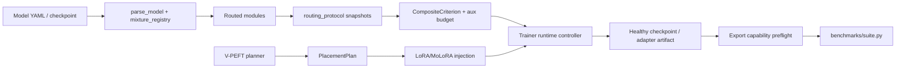

# YOLO-Master 后续优化实施方案

> **For Claude:** REQUIRED SUB-SKILL: Use superpowers:executing-plans to implement this plan task-by-task.

**目标：** 在不破坏当前 YOLO-Master 模型兼容性的前提下，把报告中的研究资产收敛为可重复、可部署、可验收的 MoE 主线，以及可控的 MoLoRA/V-PEFT 适配链路。

**架构：** 采用“基线冻结 -> 稳定性收口 -> MoE 生产化 -> PEFT 闭环 -> 受控研究实验”的分层路线。统一入口是现有 `mixture_registry`、`routing_protocol`、`mixture_loss`、`AdapterRuntimeController` 和 export capability matrix；模型结构、路由损失、适配器、导出和 benchmark 不再各自维护隐含契约。MoA/MoT 默认保持 opt-in，只有通过成本/精度门禁后才进入发布配置。

**技术栈：** Python 3.9+/3.11、PyTorch、Ultralytics trainer/validator、pytest、PyYAML、ONNX/TensorRT（可选）、现有 `benchmarks/` runner 和 GitHub Actions。

---

## 0. 先说结论

### 推荐的产品路线

1. **发布主线：** `v0_15 GatedFusionMoE` 作为默认研究/生产候选；先完成 COCO 多 seed、剪枝、导出和端到端 benchmark。
2. **适配主线：** 先把 MoLoRA 做成可靠 adapter backend，再把 V-PEFT 接到“规划 -> LoRA 注入 -> 训练 -> 保存/加载 -> 评测”闭环；第一版不导出动态 MoE adapter。
3. **探索支线：** MoA 作为低成本可选件；MoT 只保留场景路由实验，不进入默认 YAML，直到精度和延迟同时过门禁。
4. **基础设施：** 继续使用统一 routing protocol 和 `CompositeCriterion`，所有模块必须能提供 aux loss、routing snapshot、export capability 三项信息。

### 目标结果（以同硬件、同输入、同 seed 口径）

| 方向 | 进入下一阶段的最低门槛 | 未达标处理 |
|---|---|---|
| MoE 主线 | COCO128 smoke 无回归；正式实验 3 seed 的 mAP 不低于当前基线 -0.2；剪枝后 P50 至少提升 15%，精度下降不超过 0.2 mAP | 保留未剪枝模型，停止扩大专家数 |
| MoLoRA | fp32/fp16/bf16（后端支持时）前向、反向、保存/加载全通过；merge 与动态路径在校准集上相对误差 <=1% | 禁止发布 merge artifact，继续使用动态 adapter |
| V-PEFT | 规划结果可序列化、可复现、满足预算和 MoE 一致性；端到端训练与固定 rank LoRA 的精度差不超过 0.2 mAP | 自动拒绝并回退固定 LoRA 配置 |
| MoA | 训练/推理成本在目标设备预算内，且作为可选件不降低精度超过 0.2 mAP | 只作为即插即用实验件 |
| MoT | 先证明场景统计确实改变路由，再要求收益 >=0.5 mAP 或等价业务指标；P50 增幅超过 20% 不得进默认配置 | 仅保留 P5 或 `top_k=1` 实验 profile |

这些门槛是工程门禁，不是论文结论；最终报告必须同时给出 mAP、P50/P95、参数量、FLOPs、实际 expert calls、导出模式和显存。

## 1. 当前状态与边界

### 1.1 已确认的现有入口

- MoE：`ultralytics/nn/modules/moe/{gated.py,modules.py,routers.py,pruning.py,analysis.py}`；当前重点是 `GatedFusionMoE`/v0.15。
- MoA/MoT：`ultralytics/nn/modules/{moa,mot}`；MoT scene-aware router 已有 opt-in 配置和测试资产。
- 统一路由：`ultralytics/nn/modules/routing_protocol.py`、`ultralytics/nn/mixture_loss.py`、`ultralytics/nn/mixture_registry.py`。
- MoLoRA：`ultralytics/nn/peft/molora/{layer.py,model.py,router.py,moe_aware.py}`；adapter backend 位于 `ultralytics/utils/lora/{backend.py,io.py}`。
- Planner：生产侧 `ultralytics/utils/lora/planner.py`，研究侧 `ultralytics/vpeft/{graph.py,constraints.py,policy.py,solver.py}`。
- Benchmark：`benchmarks/suite.py`、`benchmarks/run.py`、`benchmarks/suites.yaml` 已提供可恢复的统一测量入口。

### 1.2 本轮不做的事

- 不删除历史 MoE class；只通过 stable/experimental/legacy 元数据和 registry 管理。
- 不把训练期 dense 或导出 dense fallback 宣称为真实稀疏计算。
- 不同时启用标准 LoRA 和 MoLoRA；维持 `validate_adapter_configuration()` 的互斥规则。
- 不在 V-PEFT 未完成 checkpoint/export 契约前把 dynamic MoE adapter 加入公开 API。
- 不直接改动当前工作区已有的 latent mixture、routing、export 等未提交修改；先记录并隔离基线。

## 2. 总体架构与运行链路



### ADR-001：MoE 是默认主线，MoA/MoT 保持 opt-in

- **决定：** 发布配置优先使用 v0.15 MoE；MoA/MoT 只在专用 YAML/profile 中启用。
- **原因：** MoE 已有论文级结果和剪枝闭环；MoA 当前主要是成本可控的增强件；MoT 的延迟开销尚未被精度收益覆盖。
- **取舍：** 放弃短期把三条路线合并成一个“全动态模型”的叙事，换取结果可解释、部署可控和回滚简单。

### ADR-002：研究 Planner 与生产 Planner 分层

- **决定：** `utils/lora/planner.py` 负责生产安全决策；`ultralytics/vpeft` 负责图编码、策略和求解器研究。两者通过版本化 `PlacementPlan` 交换，不共享内部对象。
- **原因：** 研究求解器可能变化，生产链路需要稳定、可审计、可回退。
- **取舍：** 初期会有一层转换代码，但可以独立发布、独立做消融和独立升级。

### ADR-003：所有合并必须声明语义

- **决定：** MoLoRA merge 只接受 `uniform`、`ema`、`calibrated` 三种显式模式，artifact 中保存权重、校准批次数、authority、approximate 标志和输入 fingerprint。
- **原因：** 动态路由和均匀平均不等价；没有元数据的 merge 不能被可靠复现。
- **取舍：** 用户需要提供校准数据才能得到最接近动态路径的静态 artifact。

## 3. 分阶段实施计划

## Phase 0：基线冻结与工作区隔离（1-2 天）

**目标：** 先确认报告中的问题在当前代码是否仍可复现，避免把已经存在的用户修改误判为本轮修复。

**Files:**

- Create: `docs/governance/baseline-20260723.md`
- Modify: `docs/governance/model-registry.yaml`（若已存在则追加验证记录）
- Use: `benchmarks/suite.py`、`benchmarks/suites.yaml`
- Test: `tests/test_moe.py`、`tests/test_moa.py`、`tests/test_mot.py`、`tests/test_molora*.py`、`tests/test_planner*.py`

**Steps:**

1. 记录当前 Git commit、Python/PyTorch/device、工作区 diff 摘要和模型权重来源。
2. 运行并保存以下 focused baseline：

   ```bash
   python3 -m pytest -q tests/test_moe.py tests/test_moa.py tests/test_mot.py --tb=long
   python3 -m pytest -q tests/test_molora.py tests/test_molora_dtype.py tests/test_molora_merge_semantics.py tests/test_molora_routing_aware_merge.py --tb=long
   python3 -m pytest -q tests/test_planner.py tests/test_planner_enhancement.py tests/test_planner_integration.py --tb=long
   python3 benchmarks/run.py --suite mixture_smoke --device cpu --imgsz 64 --warmup 0 --iterations 1 --output runs/benchmarks/baseline-20260723
   ```

3. 对 `yolo26-master-n.yaml` 运行构建 + 最小 forward；只有确认当前 parser 仍失败时才修 YAML。`SPPF` 当前签名是 `SPPF(c1, c2, k, ...)`，不能仅凭报告中的旧结论盲改参数。
4. 把报告中的每个问题标成 `reproduced`、`fixed-in-worktree` 或 `not-reproduced`，为后续阶段建立退出条件。

**验收：** 基线文件包含可复现命令和结果；没有“报告说有问题但当前代码未验证”的开放 P0。

## Phase 1：P0/P1 稳定性与配置治理（3-5 天）

**目标：** 先保证训练、恢复、保存、加载和模型构建不被适配器/配置问题阻断。

**Files:**

- Modify if reproduced: `ultralytics/nn/peft/molora/layer.py`
- Modify if reproduced: `ultralytics/cfg/models/26/yolo26-master-n.yaml`
- Modify: `ultralytics/cfg/default.yaml`、`ultralytics/cfg/__init__.py`
- Modify: `ultralytics/engine/trainer.py`、`ultralytics/engine/model.py`
- Test: Create `tests/test_default_config_integrity.py`、`tests/test_master_model_configs.py`

**Steps:**

1. 用参数化测试覆盖 Conv2d/Linear 的 fp32、fp16、bf16 和 autocast；测试 forward、backward、`.to()`、`.half()` 后的 adapter dtype 与输出 dtype。
2. 测试 MoLoRA trainer 的 `save_model -> resume`，检查 adapter 参数、`_usage_ema`、router step 和 EMA 状态全部恢复。
3. 扫描 `default.yaml` 重复 key，并验证 `MoLoRAConfig.from_args()` 对 `None`、空 list、空 dict 的语义一致。
4. 批量构建 `yolo26-master-n.yaml`、标准 yolo26 配置和 v0.10 MoA/MoT 配置，做一次 CPU 最小 forward。
5. 将这组测试加入 CI `mixture-p0-regression` job。

**验收命令：**

```bash
python3 -m pytest -q tests/test_default_config_integrity.py tests/test_master_model_configs.py --tb=long
python3 -m pytest -q tests/test_molora_dtype.py tests/test_molora.py tests/test_molora_merge_semantics.py --tb=long
```

**门禁：** 任一 dtype 路径产生非有限值、base layer 被意外解冻、checkpoint 不能恢复或配置构建失败，停止后续阶段。

## Phase 2：MoE 生产化与部署闭环（1-2 周）

**目标：** 把 MoE 的精度、负载、剪枝、导出和实际延迟变成一条可重复 pipeline。

**Files:**

- Modify: `ultralytics/nn/modules/moe/pruning.py`、`ultralytics/nn/modules/moe/analysis.py`
- Modify: `ultralytics/nn/modules/routing_protocol.py`、`ultralytics/nn/mixture_loss.py`（只补指标/契约，不另建 aux-loss 通道）
- Use: `scripts/moe_pruning_sweep.py`、`scripts/audit_moe_usage.py`、`benchmarks/run.py`
- Test: Create `tests/test_moe_production_pipeline.py`
- Docs: `docs/governance/model-registry.yaml`、`docs/governance/benchmark-suite.md`

**Steps:**

1. 固化 v0.15 配置的专家数、top-k、split ratio、balance loss 和训练 seed；写入 model registry。
2. 为每个 MoE 层输出统一 routing snapshot：usage、Gini、entropy、collapse flag、实际 expert calls、dispatch mode。
3. 建立 `calibrate -> prune -> validate -> export` pipeline。默认先做 `keep_top_m`，再支持 usage threshold；任何 prune 都保存原始 checkpoint 和 prune manifest。
4. 在 COCO128 上做 10 epoch smoke，确认三 seed 的 loss、mAP、usage 没有异常；通过后再做 COCO 300 epoch 三 seed 正式实验。
5. 在 CPU、MPS（可用时）、CUDA/TensorRT（可用时）分别测 P50/P95、吞吐、显存和 expert calls；导出结果必须引用 capability matrix 的 dense/eager-sparse 声明。

**验收：**

- 3 seed 正式结果相对当前 MoE baseline 不低于 -0.2 mAP。
- 剪枝模型 P50 至少提升 15%，mAP 下降不超过 0.2；否则只发布未剪枝模型。
- `tests/test_moe_production_pipeline.py` 验证 prune 后 state_dict、router 维度、usage manifest 和 forward parity。

## Phase 3：MoLoRA 收敛与统一 Adapter IO（1-2 周）

**目标：** 让 MoLoRA 成为可训练、可恢复、可合并、可部署的正式 backend。

**Files:**

- Modify: `ultralytics/nn/peft/molora/layer.py`、`model.py`
- Modify: `ultralytics/utils/lora/backend.py`、`io.py`
- Modify: `ultralytics/engine/model.py`、`ultralytics/engine/extensions/adapters.py`
- Test: `tests/test_molora_dtype.py`、`tests/test_molora_merge_semantics.py`、`tests/test_molora_routing_aware_merge.py`、`tests/test_lora_moe_ddp_control_paths.py`
- Create: `tests/test_molora_backend_roundtrip.py`

**Steps:**

1. 统一 adapter compute dtype policy：输入 dtype、参数 dtype、accumulation dtype、输出 cast 必须可诊断；不要在单个 Conv2d 路径中隐式改变 base layer dtype。
2. 将 `save_adapters/load_adapters/merge_adapters` 接到 `YOLO.save_adapters/load_adapters/merge_adapters`；普通 LoRA 和 MoLoRA 走同一 backend discovery，但 artifact schema 分开。
3. 强制 merge mode 显式记录：`uniform` 仅用于对照，`ema` 标记 rank/同步语义，`calibrated` 保存每层权重、批次数、校准来源和 fingerprint。
4. 对动态 forward 与 calibrated merge 做校准集 parity；用 max relative error、cosine similarity 和任务 mAP 三种指标验收。
5. 增加 DDP rank-0/`sync_ema=True` 两条路径；非 rank-0 默认拒绝 merge，避免产生不一致 artifact。

**验收：**

- fp32/fp16/bf16 后端支持矩阵全部通过或明确 skip。
- save/load 后输出和路由统计可复现；fp32 max abs error <= 1e-5，低精度按 backend 设 <= 1e-3。
- calibrated merge 在校准集相对误差 <=1%，任务 mAP 下降 <=0.2；不满足时 artifact 必须标为不可发布。

## Phase 4：V-PEFT 接入主链路（2 周）

**目标：** 把研究版 V-PEFT 的结构感知和约束求解接入生产 LoRA 流程，同时保留安全回退。

**Files:**

- Create: `ultralytics/vpeft/placement_plan.py`
- Modify: `ultralytics/vpeft/graph.py`、`constraints.py`、`policy.py`、`solver.py`
- Modify: `ultralytics/utils/lora/api.py`、`planner.py`
- Modify: `ultralytics/engine/extensions/adapters.py`
- Test: Create `tests/test_vpeft_lora_e2e.py`、`tests/test_placement_plan_schema.py`
- Use: `scripts/validate_planner.py`、`scripts/planner_train_compare.py`

**PlacementPlan 最小 schema：**

```json
{
  "schema_version": 1,
  "model_fingerprint": "...",
  "planner_backend": "legacy|vpeft",
  "solver": "ao|dco|mip",
  "budget": {"max_adapter_params": 0},
  "targets": [{"name": "...", "variant": "lora", "rank": 8}],
  "constraints": {"hard": [], "soft": []},
  "predicted_delta": 0.0,
  "confidence": 0.0,
  "status": "ADAPT|REFUSE|FALLBACK",
  "refusal_reason": null
}
```

**Steps:**

1. 先实现 `PlacementPlan` 的 JSON schema、fingerprint 和 `from_dict/to_dict`，不改变默认行为。
2. 在 `apply_lora()` 前调用 planner；planner 只产出目标层/rank/variant，不直接改模型。
3. 生产默认使用 `utils/lora/planner.py`；增加 `lora_planner_backend=vpeft` opt-in，把 V-PEFT solver 结果转换为同一 `PlacementPlan`。
4. 继续启用 `MoEConsistencyConstraint`：默认不把 router、gate、detect head 作为普通 LoRA target；MoE expert 只能按 group 一致放置。
5. planner 拒绝、预算不可行、置信度不足或导出不兼容时，显式回退固定 rank 配置并写入 trainer metadata。
6. 在 COCO128/VisDrone 小子集比较 fixed-rank、legacy planner、V-PEFT 三组，记录 adapter params、训练时间、mAP 和计划耗时。

**验收：**

- planner 结果在不同进程/相同 fingerprint 下可复现。
- 计划不超过 adapter budget，不违反 MoE group/semantic/deployment 约束。
- V-PEFT 端到端结果与固定 rank LoRA 相差不超过 0.2 mAP；失败时自动 fallback 且训练仍可完成。
- dynamic MoE adapter 仍不加入 `ultralytics/vpeft/__init__.py` 的公开导出，直到有独立 checkpoint/export/merge 契约。

## Phase 5：MoA/MoT 受控实验（并行，1 周一轮）

**目标：** 用最小实验成本验证假设，避免继续投入没有收益证据的复杂组合。

### MoA profile

- 保留 `C2fMoA`/`NeckMoAFusion`，新增一个 benchmark case 与 MoE baseline 对照。
- 只在目标硬件测训练时间、P50/P95、显存和 mAP；不把 dense soft routing 记作 FLOPs 节省。
- 若成本增幅超过 20% 或精度下降超过 0.2 mAP，保持 experimental，不改默认配置。

### MoT scene-aware profile

**Files:** `ultralytics/nn/modules/mot/router.py`、`tests/test_mot_scene_aware_router.py`、`scripts/analyze_mot_routing.py`、`scripts/diagnose_mot_routing.py`。

**Steps:**

1. 先用已有 routing analyzer 将数据按稠密/稀疏、小目标/大目标、遮挡/非遮挡分组，输出 legacy router 的专家分布。
2. 在同一输入和同一 legacy 权重下验证 scene residual 的零初始化 parity，再验证 residual 学习后分布确实发生改变。
3. 先跑 COCO128/VisDrone 10 epoch 诊断实验；只有 Deformable/Window/Local 激活与对应 scene statistic 的相关性改善，才做 50 epoch 正式实验。
4. CPU profile 只测 `top_k=1` 和仅 P5 两个部署候选；完整 top-k 仅用于研究。

**验收：**

- scene residual 的 KL/JS 分布变化和场景分组统计写入报告。
- 若无可重复行为改善，关闭 scene-aware 开关，不扩大训练预算。
- MoT 只有在 mAP 增益达到 0.5 且 P50 增幅不超过 20% 时才进入候选发布 profile。

## Phase 6：发布与持续治理（持续）

**目标：** 让每次模型/路由/adapter 变化都有可追溯的实验、导出和回滚记录。

**Files:**

- Modify: `docs/governance/model-registry.yaml`
- Modify: `ultralytics/cfg/export-capability-matrix.yaml`
- Modify: `.github/workflows/ci.yml`
- Use: `scripts/generate_export_capability_docs.py`、`benchmarks/run.py`

**CI 分层：**

1. **PR smoke（分钟级）：** 配置唯一 key、模型构建、forward、routing protocol、MoLoRA dtype、adapter roundtrip。
2. **Nightly benchmark（小时级）：** MoE/MoA/MoT profile 的 P50/P95、routing collapse、export preflight 和 COCO128 smoke。
3. **Release gate（硬件级）：** 固定硬件正式训练、多 seed、剪枝前后、ONNX/TensorRT/CPU 对照和 artifact checksum。

**发布 artifact 必须包含：** base checkpoint fingerprint、model YAML、resolved args、planner decision、routing summary、merge/prune manifest、export capability、benchmark result 路径。

## 4. 推荐执行顺序

```text
本方案 Phase 0
  -> Phase 1 配置/恢复稳定
  -> Phase 2 MoE RC + benchmark + prune
  -> Phase 3 MoLoRA backend 收敛
  -> Phase 4 V-PEFT opt-in 闭环
  -> Phase 5 MoA/MoT 受控实验
  -> Phase 6 发布治理
```

不要先做 MoT 大规模训练，也不要先把 V-PEFT solver 接入默认训练。两者都应建立在 Phase 0 的可重复 baseline 和 Phase 1 的 checkpoint/配置稳定之上。

## 5. 最小交付清单

第一轮建议只交付以下 5 个结果，即可证明项目进入“可优化”而不是继续堆模块的阶段：

1. `docs/governance/baseline-20260723.md`：报告问题在当前工作区的复现矩阵。
2. `tests/test_master_model_configs.py` + `tests/test_default_config_integrity.py`：模型/配置健康门禁。
3. `tests/test_molora_backend_roundtrip.py`：MoLoRA dtype、保存、恢复、merge 验收。
4. `runs/benchmarks/baseline-20260723/`：MoE/MoA/MoT 可比较的 latency/routing 基线。
5. `docs/governance/model-registry.yaml`：稳定、实验、遗留配置和证据链接。

**方案完成后建议的下一步：** 先执行 Phase 0，确认当前工作区的真实失败项，再按门禁推进 Phase 1；不要依据报告中的旧行号直接修改实现。
