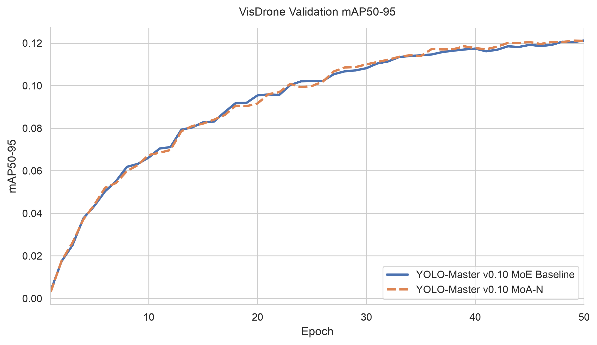
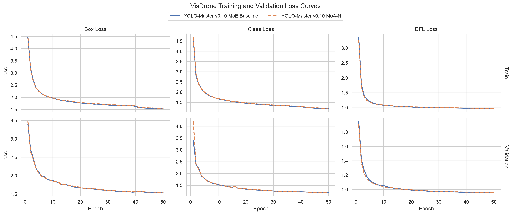

# MoA Boundary Validation Example

This example documents the MoA boundary tests added for the `test/moa-boundary-vertical-validation` issue and records the local validation results. The tests focus on numerical stability, shape safety, routing stability, and auxiliary loss accounting for modules under `ultralytics/nn/modules/moa/`.

## What Was Tested

| Area | Test method | Purpose |
| --- | --- | --- |
| `NeckMoAFusion` cross-scale input | Run `hi` as `15x15` and `lo` as `7x7`, then verify output shape, finite values, and backward pass | Ensures non-strict 2x scale mismatch does not trigger shape errors |
| `MoABlock` extreme temperature | Set router temperature below `1e-4`, bias logits to be non-uniform, and verify finite normalized probabilities | Guards against NaN/Inf propagation and accidental uniform collapse |
| `_LocalAttnHead` and `_GlobalAttnHead` safe heads | Instantiate attention heads with `dim=10` and `num_heads=3` | Verifies `_safe_groups` and head fallback logic when channels are not cleanly divisible |
| `C2fMoA` nested aux loss | Compare collected aux loss with child `MoABlock.last_aux_loss` sum | Prevents double counting similar to MoE aux loss registry issues |
| `_flash_attn` fallback | Temporarily remove `scaled_dot_product_attention` and execute the manual attention path | Ensures compatibility with PyTorch environments without SDPA |
| `_GlobalAttnHead` linear attention | Use a `17x17` feature map to force the large-map linear attention path | Covers the O(N) global attention branch |
| `_MoARouter` default return path | Call router without `return_logits=True` and verify finite normalized probabilities | Covers inference-style probability-only routing |
| `MoABlock(shortcut=False)` | Run forward with residual paths disabled | Ensures the pure transform branch remains shape-safe and produces aux loss |
| `NeckMoAFusion` eval projection | Use `c_hi != c_out` in eval mode | Verifies self-path projection and zero aux loss behavior |
| Empty and standalone aux collection | Collect aux loss from `nn.Identity()` and standalone `MoABlock` | Ensures fallback device handling and standalone MoA accounting |

## Implementation Notes

- `NeckMoAFusion` now aligns the low-resolution feature map with `size=hi.shape[2:]`, so odd or non-strict feature scales such as `15x15` and `7x7` remain shape-safe.
- `collect_moa_aux_loss()` avoids counting child `MoABlock` losses twice when they are nested inside `C2fMoA`.
- `BaseValidator` can resolve the distributed validation context and NDJSON helper used during final validation, avoiding the late `NameError` seen after training completion.

## Files

| File | Description |
| --- | --- |
| `results/test_run_summary.csv` | Local pytest/build command results |
| `results/build_summary.csv` | v0.10 baseline and v0.10 MoA model build summary |
| `results/vertical_training_results.csv` | VisDrone 50-epoch training and validation results |
| `results/visdrone_comparison_delta.csv` | Delta table comparing v0.10 baseline and v0.10 MoA |
| `assets/visdrone_map50_95_curve.png` | Seaborn mAP50-95 curve with English labels and Arial font |
| `assets/visdrone_loss_curves.png` | Seaborn train/validation loss curves with English labels and Arial font |
| `plot_visdrone_curves.py` | Reproducible plotting script for the two seaborn figures |

## Run The Tests

Use the `yolo_master` conda environment:

```bash
python -m pytest tests/test_moa.py -q
```

Expected local result:

```text
18 passed
```

Run the MoA coverage suite:

```bash
python -m pytest \
  tests/test_moa.py tests/test_mixture_aux_loss.py \
  --cov=ultralytics/nn/modules/moa \
  --cov-report=term-missing \
  --cov-report=html:runs/moa_ablation/coverage_html -q
```

Expected local result:

```text
20 passed
ultralytics/nn/modules/moa: 100%
```

The HTML coverage report is written to:

```text
runs/moa_ablation/coverage_html/index.html
```

## Coverage Report

Coverage is measured at the MoA module directory level with:

```bash
python -m pytest tests/test_moa.py tests/test_mixture_aux_loss.py \
  --cov=ultralytics/nn/modules/moa \
  --cov-report=term-missing \
  --cov-report=html:runs/moa_ablation/coverage_html -q
```

Before/after comparison:

| Stage | Test files | Statements | Missed | Coverage | Passed tests |
| --- | --- | ---: | ---: | ---: | ---: |
| Main branch baseline (`9163e96`) | `tests/test_moa.py`, `tests/test_mixture_aux_loss.py` | 297 | 17 | 94% | 9 |
| Current branch after boundary completion | `tests/test_moa.py`, `tests/test_mixture_aux_loss.py` | 297 | 0 | 100% | 20 |

Final terminal coverage summary:

```text
Name                                     Stmts   Miss  Cover
----------------------------------------------------------------------
ultralytics/nn/modules/moa/__init__.py       2      0   100%
ultralytics/nn/modules/moa/moa.py          295      0   100%
----------------------------------------------------------------------
TOTAL                                      297      0   100%
```

## Model Build Check

The **v0.10 baseline** and **v0.10 MoA** model can be checked with:

```bash
python scripts/compare_moa_ablation.py \
  --check-build --models v10 v10_moa --device cpu --project runs/moa_ablation
```

Local result:

| Model | Config | Params | MoABlock | C2fMoA |
| --- | --- | ---: | ---: | ---: |
| YOLO-Master v0.10 baseline | `ultralytics/cfg/models/master/v0_10/det/yolo-master-n.yaml` | 3,449,963 | 0 | 0 |
| YOLO-Master v0.10 MoA | `ultralytics/cfg/models/master/v0_10/det/yolo-master-moa-n.yaml` | 3,576,587 | 6 | 3 |

## Vertical Training Validation

The issue also asks for a real dataset convergence check on VisDrone or SKU-110K for 50-100 epochs. The VisDrone 50-epoch experiment has been completed with `YOLO-Master-v0.10-MoA-N` and compared against the same v0.10 MoE baseline.

Comparison setup:

| Role | Model key | Config |
| --- | --- | --- |
| MoE baseline | `v10` | `ultralytics/cfg/models/master/v0_10/det/yolo-master-n.yaml` |
| MoA validation model | `v10_moa` | `ultralytics/cfg/models/master/v0_10/det/yolo-master-moa-n.yaml` |

Recorded configuration:

| Setting | Value |
| --- | --- |
| Dataset | `ultralytics/cfg/datasets/VisDrone.yaml` |
| Epochs | 50 |
| Image size | 640 |
| Batch size | 24 |
| Device | `0` |
| AMP | `False` |
| Deterministic | `True` |
| Project | `runs/moa_ablation/visdrone_v10_50ep` |

Final VisDrone result:

| Model | Params | mAP50 | mAP50-95 | Precision | Recall | Train box/cls/dfl | Val box/cls/dfl | Time |
| --- | ---: | ---: | ---: | ---: | ---: | --- | --- | --- |
| YOLO-Master v0.10 baseline | 3,449,963 | 0.22113 | 0.12119 | 0.31388 | 0.24208 | 1.54358 / 1.19714 / 0.97160 | 1.54373 / 1.19511 / 0.95679 | 2.22 h |
| YOLO-Master v0.10 MoA | 3,576,587 | 0.22018 | 0.12104 | 0.32180 | 0.23843 | 1.55375 / 1.20763 / 0.97522 | 1.54962 / 1.19342 / 0.95856 | 2.59 h |

The MoA variant converged without shape or routing failures in the 50-epoch VisDrone run. Its final mAP50-95 is essentially tied with the v0.10 MoE baseline (`-0.00015` absolute), while precision is slightly higher and recall is slightly lower. The MoA model adds 126,624 parameters and took about 22.26 more minutes based on the final `time` column in each `results.csv`.

## Seaborn Convergence Plots





Result artifacts:

| Model | Results CSV | Loss/metric curve | PR/F1 curves | Weights |
| --- | --- | --- | --- | --- |
| v10 baseline | `runs/moa_ablation/visdrone_v10_50ep/v10/results.csv` | `runs/moa_ablation/visdrone_v10_50ep/v10/results.png` | `runs/moa_ablation/visdrone_v10_50ep/v10/BoxPR_curve.png`, `BoxF1_curve.png` | `runs/moa_ablation/visdrone_v10_50ep/v10/weights/best.pt` |
| v10 MoA | `runs/moa_ablation/visdrone_v10_50ep/v10_moa/results.csv` | `runs/moa_ablation/visdrone_v10_50ep/v10_moa/results.png` | `runs/moa_ablation/visdrone_v10_50ep/v10_moa/BoxPR_curve.png`, `BoxF1_curve.png` | `runs/moa_ablation/visdrone_v10_50ep/v10_moa/weights/best.pt` |

`results.png` contains the loss curves and metric curves generated by the YOLO trainer, including train/val box loss, class loss, DFL loss, mAP50, and mAP50-95. Final scalar values are also captured in:

```text
examples/YOLOv10-Master-MoA/results/vertical_training_results.csv
examples/YOLOv10-Master-MoA/results/visdrone_comparison_delta.csv
```

The seaborn plots use English titles/axis labels and set the matplotlib font family to Arial. Regenerate them with:

```bash
python examples/YOLOv10-Master-MoA/plot_visdrone_curves.py
```

The training command used the same ablation script and matched hyperparameters across the two models:

```bash
python scripts/compare_moa_ablation.py \
  --train --models v10 v10_moa \
  --data ultralytics/cfg/datasets/VisDrone.yaml \
  --epochs 50 --imgsz 640 --batch 24 --device 0 --workers 8 \
  --project runs/moa_ablation/visdrone_v10_50ep \
  --plots --exist-ok --no-amp
```

After training, the comparison CSV was generated with:

```bash
python scripts/compare_moa_ablation.py \
  --summary-only --models v10 v10_moa \
  --project runs/moa_ablation/visdrone_v10_50ep
```
