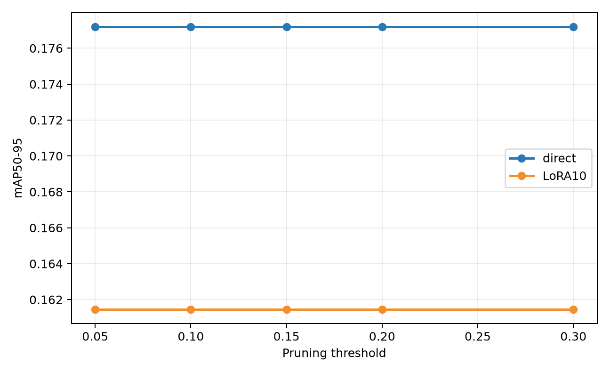
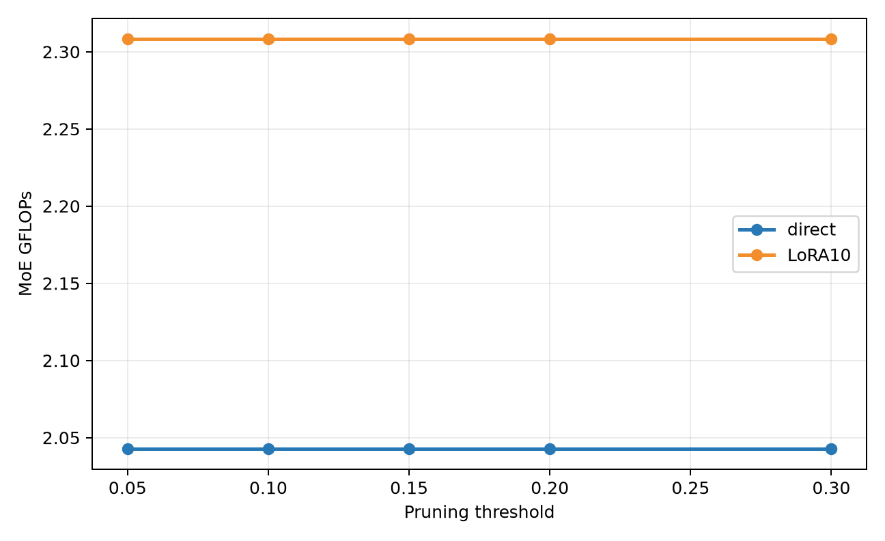
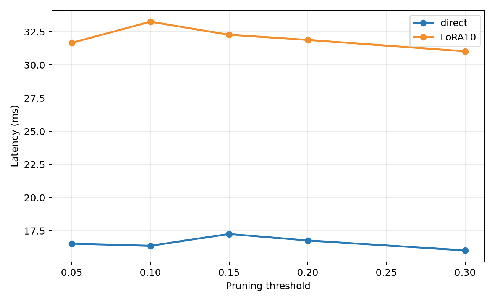
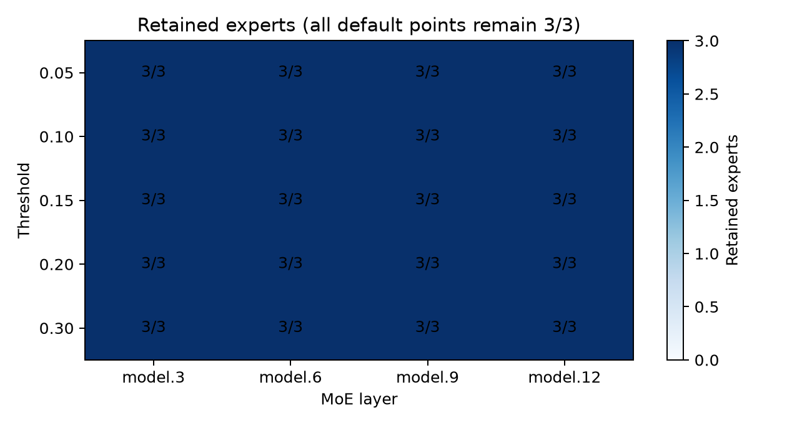
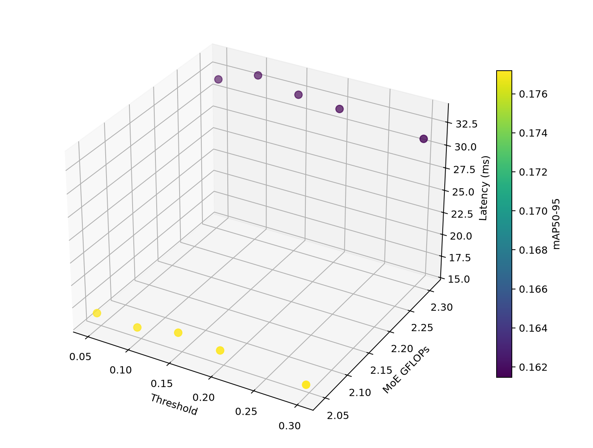
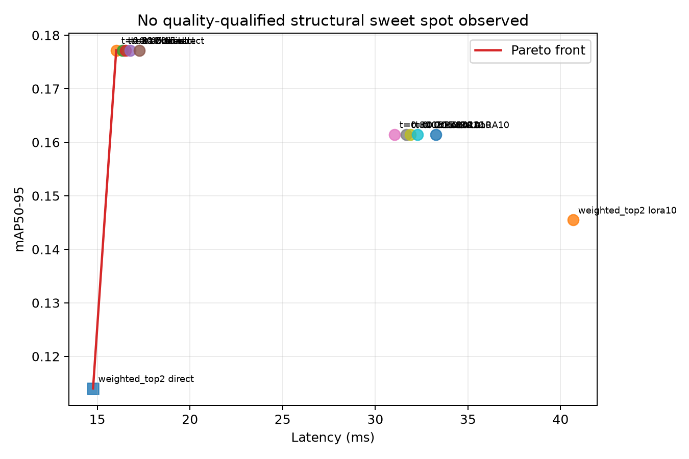
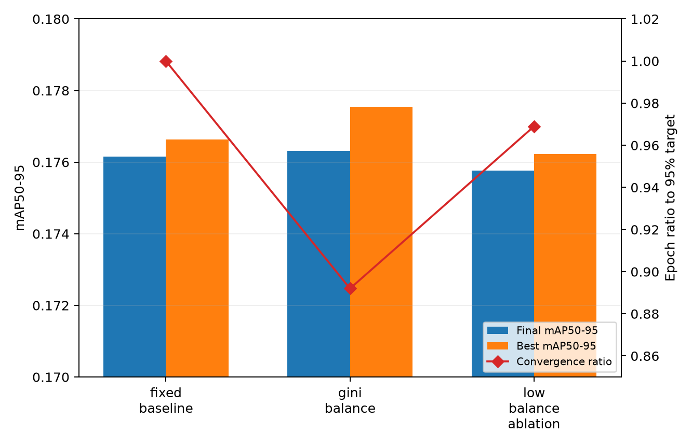

# Issue #52 技术总结：YOLO-Master EsMoE 专家剪枝与动态超参数调度

> 对应任务：[Tencent/YOLO-Master Issue #52](https://github.com/Tencent/YOLO-Master/issues/52)
>
> 实验数据来源：[上游 PR #85](https://github.com/Tencent/YOLO-Master/pull/85) 的 VisDrone EsMoE-N 复现实验
>
> 实现分支：[`vankari/YOLO-Master:moe-schedule-study`](https://github.com/vankari/YOLO-Master/tree/moe-schedule-study)

## 摘要

本工作在 YOLO-Master 中补齐了可复现的 MoE 专家剪枝与动态超参数调度流程：以
YOLO-Master-EsMoE-N 为对象，在 VisDrone 上对 `0.05/0.10/0.15/0.20/0.30` 五档专家利用率阈值进行
直接推理和 LoRA 10-epoch 恢复，对每个实验点统计 mAP50-95、mAP50、MoE GFLOPs、延迟、参数量、
逐层保留专家数和专家利用率 Gini；同时实现按 epoch 聚合真实路由使用量的 Gini-EMA 动态
`balance_loss_coeff` 调度，并完成固定基线、动态调度、低均衡系数消融三组对照。

最重要的结论是一个有部署意义的负结果：当前 VisDrone EsMoE-N checkpoint 的三个专家利用率近似均匀，
五档默认阈值均保留每层 `3/3` 个专家，因此阈值曲线不是有效的结构剪枝曲线，也不存在满足质量门槛的
结构化 Sweet Spot。强制 weighted Top-2 能把每层减到 `2/2`，MoE GFLOPs 降低 36.6%、延迟降低
9.8%，但 mAP50-95 从 0.17719 降到 0.11402，绝对下降 0.06317，不能作为默认部署方案。LoRA10
虽恢复到 0.14550，却重建为 `3/3` 专家，因而不能被标记成已剪枝模型。

动态调度的结果更积极：Gini 调度在第 58 epoch 达到固定基线最终精度的 95%，固定基线需要 65 epoch，
epoch 比为 0.892、收敛加速比为 `65/58 = 1.121×`；最终 mAP50-95 为 0.17631，与固定基线的
0.17615 基本持平。该策略默认关闭、支持 DDP 聚合和 checkpoint resume，保持现有训练行为向后兼容。

## 1. Issue 要求与交付映射

| Issue #52 要求 | 本次交付 |
| --- | --- |
| COCO 或 VisDrone 上训练 EsMoE-N | 采用上游 PR #85 的 VisDrone EsMoE-N checkpoint 与结果；新增一键训练/复用 checkpoint 流程 |
| 至少 5 档剪枝阈值 | `0.05, 0.10, 0.15, 0.20, 0.30` |
| 直接推理 vs LoRA 10 epoch | 每档均记录 direct 与 LoRA10；另有 weighted Top-2 诊断 |
| 精度、FLOPs、延迟、参数、专家数、Gini | CSV、正文表格与图表全部归档 |
| 阈值三维曲线、Pareto、Sweet Spot | 已生成；结论为没有质量合格的结构化 Sweet Spot |
| 动态超参数策略与公式 | 实现 Gini-EMA 指数调度，按真实路由观测逐 epoch 更新 |
| 基线 + 动态 + 消融及收敛比 | 固定基线、Gini 动态、固定低系数三组，报告 epoch 比和加速比 |
| 副作用与改进建议 | 分析振荡、过均衡、恢复结构失配、单 seed 风险与质量门控 |
| 服务器端/边缘端建议 | 给出基于本轮数据的保守建议，不把 no-op 阈值包装成剪枝收益 |
| Discussion 与实验脚本链接 | 本文可直接作为 Discussion 草稿；第 11 节给出仓库链接 |

## 2. MoE、专家剪枝与本项目中的位置

### 2.1 MoE 是什么

Mixture-of-Experts（MoE）把一个统一的变换替换为多个专家网络和一个 router。对输入 token/feature，
router 产生专家分数，再只选择 Top-k 专家参与计算。这样模型可以让不同专家学习不同模式，同时避免每次
前向都执行全部专家。其收益依赖两个条件：专家确实发生分工，而且稀疏路由在目标硬件上能转化为真实加速。

YOLO-Master-EsMoE-N 的本轮 checkpoint 在 `model.3`、`model.6`、`model.9`、`model.12` 放置核心 MoE
层，每层包含 3 个专家。路由诊断在验证期间累计专家命中数和平均权重，用于计算利用率和 Gini。

### 2.2 专家剪枝是什么

专家剪枝先在校准数据上统计专家重要性，再移除低重要性专家，同时修正 router 输出维度和 Top-k。
默认 `usage` 模式按专家命中率排序；实验性的 `usage_weight` 同时考虑命中量与路由权重；`keep_top_m`
用于固定预算诊断。结构剪枝是否成功不能只看 checkpoint 文件名，必须重新加载模型并核对每层专家数。

本轮默认规则可写为：

```text
keep expert i  <=>  usage_i >= threshold
```

当 3 个专家的使用率都约为 `1/3` 时，`threshold <= 0.30` 不会删除任何专家。这正是五档默认阈值曲线
完全平坦的原因，而不是五个阈值都碰巧取得了相同的有效压缩效果。

### 2.3 Gini 如何衡量路由失衡

对一层的非负专家使用量向量 `x=(x1,...,xn)`，本项目使用：

```text
G(x) = sum_i sum_j |x_i - x_j| / (2 * n * sum_i x_i)
```

`G=0` 表示完全均匀；越接近 1 表示流量越集中于少数专家。Gini 是诊断量，不等价于精度：Gini 过高可能
意味着专家坍塌，过低也可能意味着 router 没有形成有用分工。

## 3. 实验设计与数据可追溯性

| 项目 | 配置/说明 |
| --- | --- |
| 数据集 | VisDrone DET；上游 PR #85 明确声明由 Issue #49 工作流复现 checkpoint |
| 模型 | YOLO-Master-EsMoE-N |
| 默认阈值 | 0.05、0.10、0.15、0.20、0.30 |
| 恢复策略 | 剪枝后直接验证；LoRA 微调 10 epoch |
| 动态对照 | 固定系数 1.0；Gini 动态；固定低系数 0.3 |
| 动态训练长度 | 100 epoch 设计，汇总以最终/最佳及达到目标的首个 epoch 为准 |
| 收敛目标 | 固定基线最终 mAP50-95 的 95% |
| FLOPs 口径 | MoE 层 `get_gflops()` 汇总，不是整个 detector 的总 GFLOPs |
| 延迟口径 | 原始结果的 mean latency；不同硬件不可直接横向复用绝对毫秒值 |
| 随机性 | 当前汇总为单 seed 结果，结论需用多 seed 复核 |

数据链路如下：

```text
上游 PR #85 VisDrone 实验
  -> upstream commit b83dd40 导入 scripts/issue52_*.csv
  -> scripts/build_issue52_report_assets.py 归档/绘图
  -> reports/moe-pruning/*.csv + reports/issue52-figs/*.png
  -> 本技术总结
```

原 PR 没有随紧凑汇总表归档完整硬件型号、原始逐 epoch 日志和 latency 方差，因此本文不虚构这些信息。
当前分支的一键脚本会额外写 `experiment_manifest.json`、checkpoint SHA-256、逐 epoch 动态 trace 和运行目录，
用于后续完整复现实验补足审计信息。

## 4. 五档阈值剪枝结果

### 4.1 汇总表

| Threshold | Stage | mAP50 | mAP50-95 | MoE GFLOPs | Latency ms | Params M | Mean Gini | 结构状态 |
| ---: | --- | ---: | ---: | ---: | ---: | ---: | ---: | --- |
| 0.05 | direct | 0.30747 | 0.17719 | 2.04288 | 16.53 | 2.653 | 0.00000 | 各层 3/3，no-op |
| 0.05 | LoRA10 | 0.28568 | 0.16146 | 2.30830 | 31.67 | 2.883 | 0.24496 | 3/3，不是剪枝部署点 |
| 0.10 | direct | 0.30747 | 0.17719 | 2.04288 | 16.37 | 2.653 | 0.00000 | 各层 3/3，no-op |
| 0.10 | LoRA10 | 0.28568 | 0.16146 | 2.30830 | 33.26 | 2.883 | 0.24496 | 3/3，不是剪枝部署点 |
| 0.15 | direct | 0.30747 | 0.17719 | 2.04288 | 17.26 | 2.653 | 0.00000 | 各层 3/3，no-op |
| 0.15 | LoRA10 | 0.28568 | 0.16146 | 2.30830 | 32.28 | 2.883 | 0.24496 | 3/3，不是剪枝部署点 |
| 0.20 | direct | 0.30747 | 0.17719 | 2.04288 | 16.77 | 2.653 | 0.00000 | 各层 3/3，no-op |
| 0.20 | LoRA10 | 0.28568 | 0.16146 | 2.30830 | 31.89 | 2.883 | 0.24496 | 3/3，不是剪枝部署点 |
| 0.30 | direct | 0.30747 | 0.17719 | 2.04288 | 16.02 | 2.653 | 0.00000 | 各层 3/3，no-op |
| 0.30 | LoRA10 | 0.28568 | 0.16146 | 2.30830 | 31.03 | 2.883 | 0.24496 | 3/3，不是剪枝部署点 |

完整数据：[pruning-threshold-results.csv](./moe-pruning/pruning-threshold-results.csv)







### 4.2 逐层专家数与利用率

四个 MoE 层在五档 direct 结果中全部保留 3 个专家，Top-k 也保持为 3：

| Threshold | model.3 | model.6 | model.9 | model.12 |
| ---: | ---: | ---: | ---: | ---: |
| 0.05 | 3/3 | 3/3 | 3/3 | 3/3 |
| 0.10 | 3/3 | 3/3 | 3/3 | 3/3 |
| 0.15 | 3/3 | 3/3 | 3/3 | 3/3 |
| 0.20 | 3/3 | 3/3 | 3/3 | 3/3 |
| 0.30 | 3/3 | 3/3 | 3/3 | 3/3 |

逐层数据：[per-layer-experts.csv](./moe-pruning/per-layer-experts.csv)；路由数据：
[expert-usage-gini.csv](./moe-pruning/expert-usage-gini.csv)。direct 的每层 usage min/max 基本都为
`0.333333/0.333333`，Gini 为 `0` 或约 `1.6e-6`，属于数值舍入量级。



### 4.3 三维权衡曲线



图中 direct 点的 GFLOPs 和 mAP 完全重合，延迟的 16.02–17.26 ms 波动应视为测量噪声而不是阈值收益；
LoRA10 点同样没有阈值分离，并因 adapter/恢复结构产生更高参数量和延迟。

## 5. Pareto 前沿与 Sweet Spot

质量门槛定义为：相对 dense/direct 基线的 mAP50-95 绝对下降不超过 0.01，并且模型必须真的减少专家数。
这两个条件可防止把“文件经过 pruner 但结构不变”的 checkpoint 错标成剪枝点。



完整前沿数据：[pareto-accuracy-latency.csv](./moe-pruning/pareto-accuracy-latency.csv)。图中的方形点是唯一真正
结构剪枝的 weighted Top-2 direct 点；它处在数学 Pareto 前沿上，但精度下降 0.06317，未通过 0.01
质量门槛。因此本轮结果的 Sweet Spot 状态是：

```text
not_observed
```

阈值 0.30 direct 的 16.02 ms 是 no-op 模型的一次最低测量值，不能据此宣称 0.30 是剪枝 Sweet Spot。

## 6. 强制 Weighted Top-2 诊断

| Variant | Stage | mAP50-95 | MoE GFLOPs | Latency ms | Params M | Experts | 相对基线结论 |
| --- | --- | ---: | ---: | ---: | ---: | --- | --- |
| usage threshold | direct | 0.17719 | 2.04288 | 16.37 | 2.653 | 3/3 | 基线/no-op |
| weighted Top-2 | direct | 0.11402 | 1.29516 | 14.77 | 2.535 | 2/2 | GFLOPs -36.6%，延迟 -9.8%，mAP -0.06317 |
| weighted Top-2 | LoRA10 | 0.14550 | 2.30830 | 40.67 | 2.883 | 3/3 | 精度部分恢复，但结构重建，部署无效 |

完整数据：[alternative-pruning-results.csv](./moe-pruning/alternative-pruning-results.csv)。

这一诊断证明 `MoEPruner` 能执行真实结构修改，也说明简单固定预算过于激进。LoRA10 相对 Top-2 direct
恢复了 0.03148 mAP50-95，但重新加载后为 3/3，GFLOPs、参数和延迟均超过原始模型。当前实现为此加入
结构一致性检查：只有恢复前后专家结构匹配，才允许把恢复结果列为有效剪枝部署点。

## 7. 动态超参数调度

### 7.1 调度公式

训练中对每个 batch 的真实 router `topk_counts` 做累积；epoch 结束后，先按层计算 Gini，再取层均值。
设 `g_t` 为第 t 个有效 epoch 的 mean Gini，调度为：

```text
ema_t = beta * ema_(t-1) + (1 - beta) * g_t

lambda_(t+1) = clip(
    lambda_base * exp(alpha * (ema_t - g_target)),
    lambda_min,
    lambda_max
)
```

默认参数：`g_target=0.25`、`alpha=1.0`、`beta=0.8`、`lambda_min=0.5`、
`lambda_max=2.0`、`lambda_base=1.0`。

逻辑直观：当路由比目标更集中时，指数项大于 1，增强专家均衡损失；当路由已经均衡时降低约束，让专家
继续分化。EMA 抑制单个 batch 或单个 epoch 的抖动，clip 防止辅助损失突然主导检测损失。

### 7.2 在训练生命周期中的接入

```text
每个训练 batch
  -> 保存各核心 MoE 层 routing snapshot
  -> 累加 top-k 命中数

epoch 成功结束
  -> DDP all_reduce 汇总各 rank
  -> 逐层 Gini -> mean Gini -> EMA
  -> 计算下一 epoch 的 balance_loss_coeff
  -> 写 moe_dynamic_schedule.csv
  -> 同步到 model 与 EMA model checkpoint
```

若 epoch 被 NaN recovery 拒绝，调度状态不会推进，避免坏 epoch 污染 EMA。resume 时从 checkpoint 恢复
`_moe_gini_schedule_state`。`moe_dynamic_schedule=none` 是默认值，所以旧配置和旧 checkpoint 行为不变。

### 7.3 三组对照结果

| Variant | Final mAP50 | Final mAP50-95 | Best mAP50-95 | 达到 95% 目标 epoch | Epoch ratio | Speedup |
| --- | ---: | ---: | ---: | ---: | ---: | ---: |
| fixed baseline (`1.0`) | 0.30612 | 0.17615 | 0.17664 | 65 | 1.000 | 1.000× |
| Gini dynamic | 0.30571 | 0.17631 | 0.17755 | 58 | 0.892 | 1.121× |
| low balance (`0.3`) | 0.30677 | 0.17577 | 0.17623 | 63 | 0.969 | 1.032× |

完整数据：[dynamic-schedule-results.csv](./moe-pruning/dynamic-schedule-results.csv)



Gini dynamic 相对固定基线提前 7 epoch 达标，最终 mAP50-95 高 0.00016、最佳值高 0.00091；这些精度差异
很小，不能在单 seed 下声称稳定增益，但“收敛更早且最终精度不下降”的方向成立。固定低系数只提前
2 epoch，最终 mAP50-95 低 0.00038，说明简单减小均衡约束不等同于基于路由状态的自适应调度。

## 8. 动态调度副作用与改进

1. **系数振荡。** 小 `beta` 会让系数追随短期路由噪声。建议记录 `mean_gini/ema_gini/coeff`，振荡时提高
   `beta`，或限制单 epoch 最大变化率。
2. **过度均衡。** 持续强迫 Gini 接近 0 可能让专家同质化。建议以非零 target Gini 为目标，并联合观察
   专家表示差异和 mAP，而不是只优化 Gini。
3. **辅助损失压制主任务。** `alpha` 或上界过大时可能降低最终 mAP。保留 clip，并通过多 seed 搜索
   `target/alpha/beta`。
4. **恢复 epoch 污染状态。** NaN/recovery epoch 的路由统计不可用；当前实现仅在 accepted epoch 更新。
5. **DDP 统计偏差。** 每卡独立算 Gini 后再平均不等价于全局 Gini；当前实现先 `all_reduce` usage 再计算。
6. **收敛指标失真。** 若固定基线最终 epoch 已发生坍塌，“95% of final”会变得过容易。应同时报告达到
   baseline best 的 95% 和 final/best gap。
7. **单 seed 偶然性。** 下一轮至少运行 3 个 seed，报告 mean±std，并以 paired seed 比较达标 epoch。

## 9. 场景化部署建议

### 9.1 服务器端

本轮建议保留 dense/direct checkpoint。五档 usage threshold 都没有改变结构，0.10 或 0.30 只是 no-op，
不会带来可泛化的计算收益。服务器若优先吞吐，可先训练出更有差异的专家使用分布，再做逐层质量门控剪枝；
不要仅依据单次 latency 最小值选择阈值。

### 9.2 边缘端

不建议直接部署 weighted Top-2：它只换来约 9.8% mean latency 降低，却损失 0.06317 mAP50-95
（相对约 35.7%）。LoRA10 恢复路径又重建 3/3 专家并把延迟推到 40.67 ms。边缘端当前也应保留 dense
模型，或采用以下后续路线：

- 逐层设不同 `keep_top_m`，优先保留对小目标敏感的层；
- 在训练期加入稀疏/可剪枝正则，使专家重要性自然拉开；
- 对已剪结构做结构保持的 recovery，禁止重建专家；
- 把导出后端的真实端到端延迟、预处理和 NMS 一起纳入 Pareto，而不只测 PyTorch forward。

若业务确实接受超过 0.06 的绝对 mAP 损失，weighted Top-2 可作为研究候选，但必须明确它没有通过本报告的
0.01 质量门槛，不能称为推荐 Sweet Spot。

## 10. 计算资源利用与推荐默认值

本分支额外在 97 GB NVIDIA RTX PRO 6000 上对一键流程做资源探测。该探测使用 coco128 进行显存/流程
smoke test，与上文 VisDrone 指标表不是同一实验，不能混合比较精度。

| Probe | 结果 |
| --- | --- |
| `batch=128, imgsz=1600` | OOM，框架依次降 batch，最终稳定值为 16 |
| `batch=36, imgsz=1344` | 成功，无自动降 batch；peak allocated 87.28 GiB，reserved 92.89 GiB |

因此 `scripts/run_issue52_full.py` 的单卡默认值调整为 `batch=36, imgsz=1344`，在该 97 GB GPU 上比
表面设置 128/1600、实际自动退化到 batch 16 更能稳定利用资源。其他 GPU 应显式覆盖，或先做短 probe；
完整 VisDrone 训练还应考虑 dataloader、增强和验证阶段的额外峰值。

## 11. 实验脚本与实现链接

主要入口：

- [Issue #52 一键训练、剪枝、恢复、调度、分析入口](https://github.com/vankari/YOLO-Master/blob/moe-schedule-study/scripts/run_issue52_full.py)
- [本报告 CSV/图表生成脚本](https://github.com/vankari/YOLO-Master/blob/moe-schedule-study/scripts/build_issue52_report_assets.py)
- [独立 MoE 阈值扫描脚本](https://github.com/vankari/YOLO-Master/blob/moe-schedule-study/scripts/moe_pruning_sweep.py)
- [阈值/Pareto 绘图脚本](https://github.com/vankari/YOLO-Master/blob/moe-schedule-study/scripts/plot_moe_pruning_sweep.py)
- [三组动态调度消融脚本](https://github.com/vankari/YOLO-Master/blob/moe-schedule-study/scripts/run_moe_dynamic_schedule_ablation.py)

核心实现：

- [MoEPruner](https://github.com/vankari/YOLO-Master/blob/moe-schedule-study/ultralytics/nn/modules/moe/pruning.py)
- [Gini 动态调度公式](https://github.com/vankari/YOLO-Master/blob/moe-schedule-study/ultralytics/nn/modules/moe/schedule.py)
- [训练生命周期、DDP 聚合、trace 与 checkpoint 状态](https://github.com/vankari/YOLO-Master/blob/moe-schedule-study/ultralytics/engine/extensions/mixture.py)
- [EsMoE-N VisDrone 模型配置](https://github.com/vankari/YOLO-Master/blob/moe-schedule-study/ultralytics/cfg/models/master/v0/det/yolo-master-esmoe-n-visdrone.yaml)

推荐执行：

```bash
./yolo/bin/python scripts/run_issue52_full.py \
  --baseline-checkpoint weights/YOLO-Master-EsMoE-N.pt \
  --data VisDrone.yaml \
  --device 0 \
  --batch 36 \
  --imgsz 1344 \
  --thresholds 0.05 0.10 0.15 0.20 0.30 \
  --lora-epochs 10 \
  --schedule-epochs 100 \
  --skip-existing

./yolo/bin/python scripts/build_issue52_report_assets.py
```

不提供 `--baseline-checkpoint` 时，一键脚本会先按 EsMoE-N YAML 训练 baseline；三个调度组从同一个
`schedule/initial_state.pt` 启动，避免随机初始化破坏公平性。结果支持 `--skip-existing` 断点式复用。

## 12. 产物清单

`reports/moe-pruning/` 中包含可审计 CSV：

- `pruning-threshold-results.csv`：五档阈值 × direct/LoRA10；
- `per-layer-experts.csv`：逐层保留专家数和 Top-k；
- `expert-usage-gini.csv`：逐层 usage、平均路由权重与 Gini；
- `alternative-pruning-results.csv`：weighted Top-2 诊断；
- `dynamic-schedule-results.csv`：三组动态调度对照；
- `pareto-accuracy-latency.csv`：带结构状态的 Pareto 判定。

`reports/issue52-figs/` 中包含全部可视化：

- `threshold-map.png`、`threshold-gflops.png`、`threshold-latency.png`；
- `threshold-map-flops-latency-3d.png`、`pareto-accuracy-latency.png`；
- `per-layer-retained-experts.png`、`dynamic-schedule-comparison.png`。

## 13. 结论与下一步

本轮实验不能支持“服务器阈值 0.10、边缘阈值 0.20”之类的预设答案，因为 0.05–0.30 根本没有删除专家。
报告将这一点作为结果而不是失败隐藏。强制 Top-2 证明了结构剪枝路径有效，同时量化了当前 checkpoint
在粗粒度专家预算下不可接受的精度代价。

Gini 动态调度则在不降低最终精度的前提下把 95% 目标从 65 epoch 提前到 58 epoch，是当前更值得继续
验证的方向。下一步应在 VisDrone 上做至少 3 seeds、保存完整硬件与逐 epoch trace，并加入结构保持的
pruning-aware recovery。只有出现“专家数确实下降、mAP50-95 下降不超过 0.01、导出后端端到端延迟下降”
的点，才应正式标注 Sweet Spot。
