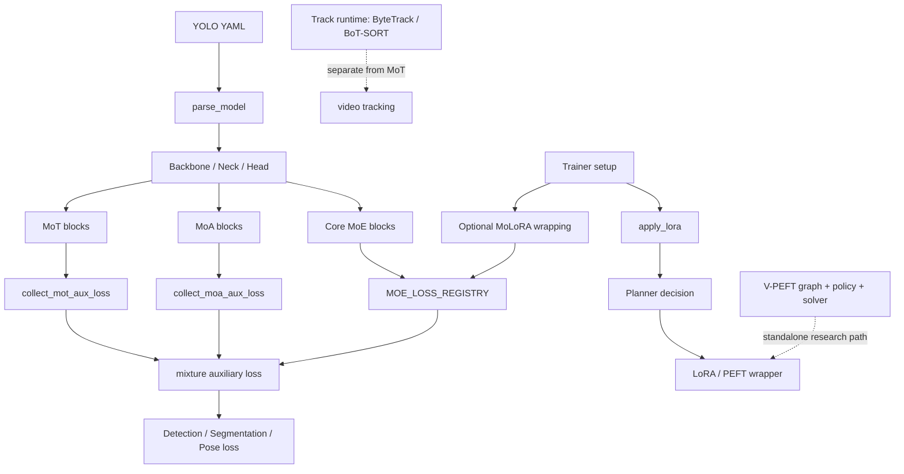

# YOLO-Master-v0708 深度分析报告

> 分析日期：2026-07-16
>
> 分析范围：`/Users/gatilin/PycharmProjects/YOLO-Master-v0708`
>
> 重点：MoA、MoE、MoT、PEFT/MoLoRA、Planner/V-PEFT，以及它们在模型构建、训练损失、DDP/AMP、导出和实验体系中的真实集成路径。

## 1. 结论先行

YOLO-Master-v0708 已经从“在 YOLO 中加入一个 MoE block”发展成一个包含多代 MoE、MoA、MoT、LoRA/MoLoRA、架构感知 Planner、V-PEFT 求解器、路由诊断和非有限值恢复的研究型框架。技术深度很高，但当前最大的风险不是单个算法模块，而是多个相似机制共存后的系统边界：配置语义、辅助损失收集、模型导出、adapter IO、AMP dtype、模型 YAML 兼容性仍未完全统一。

核心判断如下：

1. **MoE 是当前主干能力最完整、最成熟的 mixture 子系统。** 它有多套 expert/router 实现、共享辅助损失 registry、DDP 处理、路由诊断、动态调度、剪枝和非有限值恢复；代价是历史实现数量过多，维护边界较复杂。
2. **MoA 的定位清晰，但它是 dense soft mixture，不是稀疏计算。** 三组 attention head（local/regional/global）都会执行，router 只改变输出融合权重；其收益应解释为多感受野融合，而不是降低 FLOPs。
3. **MoT 的建模表达力强，但默认仍然是 dense expert execution。** `top_k` 主要控制混合权重，`sparse_train=False` 时训练阶段会执行全部 Transformer experts；开启 sparse path 后仍有数据相关控制流和导出约束。
4. **标准 LoRA/PEFT 的主链路较完整，Planner 已接入 `apply_lora()`。** Planner 可以基于架构 fingerprint 进行 ACCEPT/ADAPT/REFUSE，并影响 variant、rank 和 target hint。
5. **MoLoRA 目前是最需要优先收敛的子系统。** 本次验证发现 `.half()` 后 Conv2d forward 失败；训练器保存逻辑没有将 `molora_enabled` 接到 adapter 保存 API；merge 采用所有专家 delta 的均匀平均，和训练时的输入相关路由不等价。
6. **V-PEFT 已实现为独立的图、策略、约束和求解器包，但当前未发现它被主训练/`apply_lora()` 生产路径直接调用。** 因此它更像研究原型/离线优化框架，而不是当前默认的在线 PEFT planner。
7. **当前有一个明确的模型构建阻断项：** `ultralytics/cfg/models/26/yolo26-master-n.yaml` 使用了与实际 `SPPF` 构造函数不兼容的参数列表，模型无法实例化。

## 2. 本次验证结果

### 2.1 自动化测试

| 范围 | 结果 | 说明 |
|---|---:|---|
| MoA/MoT/MoE 核心测试 | **146 passed** | `tests/test_moa.py`、`test_mot.py`、`test_moe*.py`、router boundary 等 |
| MoLoRA/PEFT 测试 | **156 passed, 6 skipped, 1 failed** | 失败为 MoLoRA float16 forward |
| Planner/LOVO/V-PEFT 相关 Planner 测试 | **106 passed, 10 skipped** | Planner 单元、增强、集成、LOVO E2E、错误层次 |
| Python 编译检查 | **通过** | `compileall` 覆盖重点模块 |

失败用例：

- `tests/test_peft_adapters.py::TestPeftModelDeviceAndDtype::test_molora_model_dtype`
- 触发点：`ultralytics/nn/peft/molora/layer.py:101`
- 原因：输入被强制转换为 `float32`，但 `.half()` 后 `lora_A/lora_B` 已是 `float16`，CPU Conv2d 收到 float 输入和 half 权重，触发 `expected scalar type Float but found Half`。

### 2.2 模型配置构建

以下配置可以通过当前 `parse_model()` 构建：

- `ultralytics/cfg/models/master/v0_10/det/yolo-master-moa-n.yaml`
- `ultralytics/cfg/models/master/v0_10/det/yolo-master-mot-n.yaml`
- `ultralytics/cfg/models/master/v0_10/det/yolo-master-moa-mot-n.yaml`

以下配置当前构建失败：

- `ultralytics/cfg/models/26/yolo26-master-n.yaml`
- `SPPF` 在 `ultralytics/nn/modules/block.py:208` 的签名为 `SPPF(c1, c2, k=5)`，而 YAML 第 25 行传入 `[1024, 5, 3, True]`，导致参数数量不匹配。

### 2.3 配置静态检查

`ultralytics/cfg/default.yaml` 当前发现重复 key：

- `lora_tinit`：2 次
- `lora_tfinal`：2 次
- `lora_alpha_warmup`：2 次
- `moa_aux_gain`：2 次

`MoLoRAConfig` 定义了但 `default.yaml` 没有对应 CLI 默认项的字段：

- `molora_top_k_warmup`
- `molora_domain_experts`
- `molora_freeze_experts`

这不会阻止直接使用 Python dataclass，但会使 YAML/CLI 的配置能力与实现能力不一致。

## 3. 总体架构



### 3.1 真实训练主链路

1. `ultralytics/nn/tasks.py:1701` 的 `parse_model()` 将 YAML module name 映射为 Python class，并将 `C2fMoA`、`C2fMoT`、大量 MoE class 纳入 `base_modules`/`repeat_modules`。
2. `ultralytics/engine/trainer.py:493` 在 optimizer 建立前调用 `apply_lora()`。
3. `ultralytics/engine/trainer.py:499` 在 `molora_num_experts > 0` 时额外执行 MoLoRA wrapping。
4. 模型每次 training forward 前，`ultralytics/nn/tasks.py:213` 清空共享 `MOE_LOSS_REGISTRY`。
5. 检测损失在 `ultralytics/utils/loss.py:535` 同时收集 MoE、MoT、MoA 三类 auxiliary loss，并使用独立 gain 和 EMA normalization。
6. trainer 每 epoch 调用 `ultralytics/engine/trainer.py:874` 附近的温度退火逻辑，同时更新 MoA/MoT router temperature。

这个主链路的设计优点是：所有 mixture loss 都在任务 loss 层集中汇总，避免把每个 block 的 aux loss 直接塞进 detection loss；但它也要求每种模块严格遵守自己的“发布协议”，否则会产生漏收集、重复收集或 stale graph。

## 4. MoE 深度分析

### 4.1 实现分层

MoE 代码位于 `ultralytics/nn/modules/moe/`，包含：

- `modules.py`：基础 MoE、loss、辅助属性和兼容导出。
- `gated.py`：当前大量 gated/visual/hybrid MoE 变体。
- `base.py`：基础 block、专家参数、非有限恢复等共用协议。
- `integration.py`：更完整的 router/expert dispatch 集成。
- `routers.py`、`routers_advanced.py`：多种路由器。
- `loss.py`：GShard balance、router z-loss、DDP reduction。
- `analysis.py`、`diagnostics.py`、`history.py`、`viz.py`：路由统计、collapse/dead expert 检测和可视化。
- `schedule.py`、`scheduler.py`、`pruning.py`、`quantize.py`：动态调度、mAP saturation、专家剪枝和量化相关能力。

`parse_model()` 将大量历史和实验变体都注册进模型解析器（`ultralytics/nn/tasks.py:1772` 起）。这保证了旧 YAML 的兼容性，但也形成明显的“多实现并存”结构：同一个概念可能存在不同的 routing、expert packing、loss 属性和导出行为。

### 4.2 辅助损失与 DDP

核心 registry 位于 `ultralytics/nn/modules/moe/_common.py:48`，使用 `WeakKeyDictionary` 保存 module 到 graph-connected loss 的映射。训练 forward 前清空 registry，MoE forward 中重新写入。

`ultralytics/utils/loss.py:21` 的 `_collect_moe_aux_loss()` 只读取 registry，具备以下防护：

- 避免 wrapper 与 nested block 重复计数。
- 检查 loss 是否 finite。
- 将非有限项跳过，而不是污染主检测 loss。

`ultralytics/nn/tasks.py:319` 还会避免对会写 registry 的 MoE/MoLoRA module 做 gradient checkpointing，因为 checkpoint 重算可能覆盖 registry 中的计算图。

这是本项目较成熟的工程设计之一。代价是 auxiliary loss 不再是纯模块局部状态，而是依赖“forward 前清空 → forward 发布 → loss 读取”的生命周期协议；任何绕过标准 YOLO loss 的自定义训练循环都必须显式遵守这个协议。

### 4.3 稳定性体系

当前 MoE 相关代码已经包含较完整的非有限值防护：

- router 输入非有限值诊断：`ultralytics/nn/modules/moe/routers.py:52`。
- registry 非有限值检查：`ultralytics/engine/trainer.py:1506`。
- 模型/EMA 状态 finite 检查和健康 checkpoint：`ultralytics/engine/trainer.py:1449`、`1537`。
- validation 前恢复：`ultralytics/engine/trainer.py:1422`。
- DDP 下的全局标记同步和 AMP recovery。

这些机制说明项目确实经历过 router NaN、AMP overflow、EMA 污染和 DDP 恢复问题。建议把它们视为核心运行时基础设施，而不是临时 debug 代码，并进一步收敛到统一的 `RoutingRuntimeState`/`AuxLossPublisher` 接口。

### 4.4 主要风险

1. **实现变体过多。** `tasks.py` 中注册了二十余种 MoE 变体，增加 checkpoint、导出、DDP 和配置回归风险。
2. **配置注入分散。** 一部分参数在 YAML parse 时注入（`tasks.py:1915`），另一部分在 trainer setup 时注入（`trainer.py:529`），同名参数可能有不同默认值和生效时机。
3. **统一 API 仍偏“反射式”。** `moe/api.py:67` 通过多个属性名尝试读取 aux loss，适合兼容历史模块，但不利于静态验证。
4. **MoE 与 LoRA 的控制路径耦合。** LoRA target 自动检测必须排除 MoE router、expert 和 complexity estimator，相关保护见 `tests/test_lora_moe_ddp_control_paths.py`；后续新增 MoE 变体需要同步更新识别规则。

## 5. MoA 深度分析

### 5.1 算法与模块结构

核心代码：`ultralytics/nn/modules/moa/moa.py`。

`MoABlock` 在 `ultralytics/nn/modules/moa/moa.py:484` 定义，包含三种 attention group：

- **Local**：depthwise 3x3 bias + window attention，偏纹理和边缘。
- **Regional**：对 K/V 做空间池化，降低上下文计算量。
- **Global**：小 token 数使用标准 attention，大 token 数切换到随机特征线性 attention。

router `ultralytics/nn/modules/moa/moa.py:399` 输出 `[B, 3, H, W]` 的 soft probabilities。`MoABlock.forward()` 在 `:614` 到 `:625` 对三个 head 全部计算，然后进行加权融合。

因此 MoA 的真实语义是：

```text
不同空间位置 -> 不同 attention inductive bias 的连续加权
```

而不是：

```text
不同空间位置 -> 只执行一个/少数几个 attention expert
```

### 5.2 集成方式

- `C2fMoA`：将 MoABlock 作为 C2f-style repeat module，接入 backbone/neck。
- `NeckMoAFusion`：用于跨尺度 neck fusion。
- `ultralytics/cfg/models/master/v0_10/det/yolo-master-moa-n.yaml`：MoE backbone + MoA neck。
- `yolo-master-moa-mot-n.yaml`：MoE backbone + MoT/MoA 混合 neck。

### 5.3 Loss 与温度

MoA 自己维护 `last_aux_loss`，并由 `collect_moa_aux_loss()` 聚合（`moa.py:938`）。它使用 balance、z-loss 和 entropy deficit 的组合，并且具备 DDP-safe reduction。

trainer 通过 `moa_mot_temperature_factor` 和 `moa_mot_min_temperature` 统一退火 MoA/MoT router。这种统一退火便于实验控制，但它隐含假设两种 router 的 entropy/temperature 标度可直接比较，后续如果两者训练动态差异明显，建议拆成独立策略。

### 5.4 主要风险

- **计算收益有限。** 三个 head 默认全算，MoA 主要增加表达力而不是减少延迟；已有 VisDrone 历史报告也显示 MoA+MoT 精度提升伴随明显 latency 代价。
- **全局 attention 的近似边界需要专项基准。** global head 在 token 数附近切换 exact/linear attention，虽然有 transition window，但仍应做输出误差和部署后端一致性测试。
- **head 数自动调整会改变模型语义。** `C2fMoA` 会为了满足“可被 3 整除”和 `head_dim >= 16` 自动调整 `num_heads`，当前测试有 warning，但生产配置应直接使用合法 head 数，避免实验记录与实际网络不一致。

## 6. MoT 深度分析

### 6.1 与视频 MOT 的术语区分

本报告将 `ultralytics/nn/modules/mot/mot.py` 中的 **MoT** 解释为 **Mixture of Transformers**。

项目同时存在传统多目标跟踪运行时：

- `ultralytics/trackers/track.py:14` 的 `TRACKER_MAP` 只映射 `bytetrack` 和 `botsort`。
- `ultralytics/trackers/byte_tracker.py`、`bot_sort.py` 实现 Kalman prediction、IoU/appearance matching、GMC 和 ReID。

这两个 MOT/MoT 系统没有直接算法耦合：前者是训练期网络 block，后者是预测期视频数据关联器。

### 6.2 MoT block

`MoTBlock` 在 `ultralytics/nn/modules/mot/mot.py:746` 定义，包含三种完整 Transformer expert：

- `LocalConvTransformer`：卷积偏置的局部注意力。
- `WindowTransformer`：窗口/shifted-window attention。
- `DeformableTransformer`：每个 query 采样固定数量 offset points。

router 在 `mot.py:591`，输出 token-level 或 image-level 的 expert weights，并生成 top-k indices。

### 6.3 “稀疏”边界

`MoTBlock._blend_experts()` 位于 `mot.py:859`：

- eval 或 `sparse_train=True` 时可走 sparse batch dispatch。
- ONNX export 时强制回退 dense blending，避免 `torch.nonzero` 的 data-dependent control flow。
- 默认 `sparse_train=False`，因此配置 `ultralytics/cfg/default.yaml:253` 下训练会执行所有 experts。

这意味着当前 MoT 的 `top_k=2` 首先是“输出混合稀疏”，并不保证“计算稀疏”。如果目标是显著降低训练 FLOPs，需要进一步实现 token packing / grouped dispatch，而不是只依赖 batch-level active expert 过滤。

### 6.4 Deformable expert 的实现特点

Deformable expert 使用 `grid_sample`，并在 `mot.py:543` 将 sampling operation 强制提升到 float32，以降低 fp16 坐标采样风险。这是合理的数值稳定策略，但会带来：

- AMP 下额外 cast 成本。
- 不同后端对 `grid_sample` 的支持差异。
- ONNX/TensorRT/NCNN 导出时需要 parity 测试。

### 6.5 Loss、诊断和温度

`collect_mot_aux_loss()` 位于 `mot.py:1102`，会对 nested `C2fMoT` 做去重，并可进行 DDP global-value/local-gradient 处理。最终由 `ultralytics/utils/loss.py:44` 接入统一 mixture loss。

### 6.6 主要风险

1. **默认 dense training 与“MoT 稀疏”命名容易造成误解。** 文档和 benchmark 应分别报告 activated experts 与实际 expert FLOPs。
2. **sparse path 的导出限制明确，但没有形成统一 capability matrix。** 建议为 PyTorch eager、torch.compile、TorchScript、ONNX、TensorRT 分别记录支持状态。
3. **完整 Transformer expert 的参数和内存成本较高。** MoT 更适合作为 neck 的少量高价值层，而不是大面积替换普通 C2f。

## 7. PEFT 与 MoLoRA 深度分析

### 7.1 标准 LoRA/PEFT 主链路

标准路径是：

```text
BaseTrainer._setup_train
  -> apply_lora(model, args)
  -> LoRAConfig / backend selection
  -> Planner（可选）
  -> target detection
  -> PEFT backend 或 repo fallback
  -> runtime metadata / adapter save
```

关键位置：

- `ultralytics/utils/lora/api.py:584`：`apply_lora()`。
- `api.py:645`：Planner opt-in。
- `api.py:676`：Planner ADAPT 后应用 variant/rank/override。
- `ultralytics/utils/lora/config.py:434`：Planner target hint 参与 target detection。
- `ultralytics/utils/lora/io.py:16`：标准 adapter save/load/merge。
- `ultralytics/engine/model.py:406`：用户侧 `save_lora_only()`。

标准 LoRA 侧已经覆盖多种 variant、target filter、DoRA/RS-LoRA、AdaLoRA、few-shot distillation、gradient checkpointing 和 fallback backend，属于功能面较广的 PEFT 框架。

### 7.2 MoLoRA 结构

`MoLoRALayer` 位于 `ultralytics/nn/peft/molora/layer.py:118`：

1. base layer 冻结。
2. 创建多个 LoRA experts。
3. router 根据输入产生 expert logits。
4. top-k 选择并归一化权重。
5. 汇总 `base_out + adapted`。
6. aux loss 写入共享 `MOE_LOSS_REGISTRY`。

MoLoRA 还支持：

- dynamic top-k warmup。
- expert dropout。
- capacity factor。
- domain expert mask。
- continual learning 的 expert freeze/unfreeze。
- replay buffer。
- versioned `save_checkpoint()`/`load_checkpoint()`（`model.py:304` 起）。

### 7.3 已验证的 MoLoRA 缺陷

#### P0/P1：AMP/half dtype 失败

`MoLoRAExpert.forward()` 在 `layer.py:101` 将非 float32 输入转为 float32，并在 `layer.py:104` 直接调用当前参数 dtype 的 `lora_A/lora_B`。当模型整体 `.half()` 后，权重为 half、输入为 float，CPU Conv2d 直接失败。

建议：

- 要么在低秩路径中将模块权重临时/持久保持 float32，并在输出端 cast 回输入 dtype。
- 要么将输入转换为 `self.lora_A.weight.dtype`，并只在 CUDA autocast 关闭时进行必要的 float32 accumulate。
- 必须补充 CPU half、CUDA fp16、CUDA bf16、AMP autocast 四类测试。

#### P1：merge 与动态路由不等价

`layer.py:519` 明确采用 `E[delta] = mean(delta)`，随后按 `scaling / num_experts` 合并（`layer.py:524`）。训练时实际输出是输入相关的：

```text
base(x) + sum_k router(x)_k * Delta_k(x)
```

merge 后变成固定的：

```text
base(x) + 1/E * sum_k Delta_k(x)
```

两者只有在 router 恒定且均匀时才近似等价。若部署必须 merge，应明确选择策略：

1. 保留动态 router，不 merge，只做算子融合优化。
2. 用代表性校准集估计 router 的平均权重，并明确这是 calibration merge。
3. 输出一个 dense adapter，而不是声称它与动态 MoLoRA 完全等价。

#### P1：训练器没有接入 MoLoRA adapter 保存

虽然 `MoLoRAModel.save_checkpoint()` 存在，但 `BaseTrainer.save_model()` 在 `trainer.py:1605` 只判断 `lora_enabled`，并调用标准 `save_lora_adapters()`；`YOLO.save_lora_only()` 在 `engine/model.py:423` 也只寻找 `lora_enabled`。

结果是：仅启用 MoLoRA 时，训练 checkpoint 可能存在，但独立 adapter 导出不会自动发生。

建议新增统一接口：

```python
save_adapters(model, path)
load_adapters(model, path)
merge_adapters(model, calibration_data=None)
```

由 LoRA、MoLoRA、未来其他 PEFT variant 各自实现 backend handler，而不是在 trainer 中继续追加 `if getattr(..., "xxx_enabled")`。

#### P1：MoLoRA 的 sparse expert 实际仍有重复计算

`layer.py:475` 到 `:497` 对每个 top-k 位置和每个 expert 进入循环，当前实现为了避免 GPU→CPU sync，实际会对所有 experts 计算完整 batch，再用 mask 清零非选中样本。

因此其主要收益是路由表达和参数共享，不是当前实现下的线性推理加速。后续应提供真正的 grouped sample dispatch，并对小 batch、large batch、CPU/GPU 分别 benchmark。

#### P2：registry 双通道语义

MoLoRA forward 同时把 aux loss 写入 registry（`layer.py:427`）和 `_last_aux_loss`（`layer.py:456`）。`MoLoRAModel.compute_aux_loss()` 却只读取 registry（`model.py:193` 起）。当 `share_moe_registry=False` 时，手动调用 `compute_aux_loss()` 会返回 0；当用户在统一 YOLO loss 外再手动加 `compute_aux_loss()` 时又有重复计数风险。

建议明确唯一策略：

- 主框架模式：只使用 registry，由统一 loss collector 收集。
- 独立 MoLoRA 模式：只使用 wrapper 的 `compute_aux_loss()`。
- 两者不能同时作为默认入口。

## 8. Planner 与 V-PEFT 深度分析

### 8.1 Planner 的职责

`ultralytics/utils/lora/planner.py` 不是简单的 target name filter，而是一个 architecture-conditioned decision engine，主要组件包括：

- `ArchitectureFingerprint`：从模块统计中构造架构 fingerprint。
- `PEFTVariantProfile`：描述不同 PEFT variant 的能力边界。
- `LOVODataCollector` / `LOVOValidator`：收集和验证 leave-one-variant-out 数据。
- `PEFTPlanner`：回归预测、bootstrap uncertainty、ACCEPT/ADAPT/REFUSE 决策、audit JSON。

它的决策流程大致是：

```text
model -> fingerprint -> variant prediction
      -> capability/safety checks
      -> ACCEPT / ADAPT / REFUSE
      -> target_modules_hint + runtime metadata
```

`apply_lora()` 在 `api.py:645` 只在显式启用 Planner 时调用它；REFUSE 会回退到 full fine-tuning，ADAPT 会修改 variant/rank/safety overrides。

### 8.2 Planner 的优点

- 能把架构差异显式纳入 PEFT 选择，而不是所有模型统一套 LoRA。
- 对 RT-DETR、attention-heavy、YOLO12 等架构保留了安全策略。
- audit JSON 能记录 fingerprint、预测 delta、recommended variant/rank 和 refusal reason。
- 有 LOVO 数据收集和交叉验证测试，避免 Planner 完全依赖硬编码规则。

### 8.3 Planner 的边界

- 回归模型依赖历史实验数据质量；数据不足时使用默认系数和 safety heuristics。
- Planner 的目标是“选择/限制 PEFT”，不是实际完成受约束的全局 placement optimization。
- target hint 仍需要经过 `LoRAConfigBuilder` 的结构性过滤，Planner 不能绕过 operator、MoE control path、layer filter 等安全规则。

### 8.4 V-PEFT 的定位

`ultralytics/vpeft/` 提供更完整的约束优化原型：

- `graph.py`：将 Conv2d、Linear、attention、norm 等构建为 typed computation graph。
- `constraints.py`：operator compatibility、semantic protection、budget、deployment、variant compatibility、MoE consistency、rank divisibility。
- `policy.py`：带 hard mask 的 placement policy、预算和部署惩罚。
- `solver.py`：AO、DCO、MIP relaxation/iterative rounding 三种 solver。

它比当前 Planner 更接近“每个节点是否放 adapter、放哪种 variant、使用多少 rank”的组合优化问题。

但本次代码检索没有发现 `ultralytics.vpeft` 被 `apply_lora()` 或 trainer 主链路直接 import。当前更准确的定位是：

```text
Planner：已接入主 PEFT 链路的架构感知选择器
V-PEFT：已实现但尚未成为主链路默认执行器的约束优化研究包
```

如果后续要把 V-PEFT 接入主链路，必须解决：

1. graph node 与实际 `named_modules()` 的稳定映射。
2. solver placement/rank 结果到 `LoRAConfigBuilder` target/rank 的落地。
3. DDP、checkpoint resume、adapter IO 和导出的一致性。
4. MIP/OR-Tools 不可用时的可复现 fallback。

## 9. 配置与模型版本治理

### 9.1 当前版本谱系

项目中同时存在：

- `v0_2` 到 `v0_11` 的 YOLO-Master 历史实验配置。
- `v0_10` 的 MoA、MoT、MoA+MoT 组合配置。
- `26/yolo26-master-n.yaml` 的 YOLO26 + A2C2fMoE 方向。
- 多种非 Master 的上游 YOLO 配置。

这对研究复现有帮助，但对“哪个版本是主线”不够清晰。建议增加一份 machine-readable model registry，至少记录：模型 YAML、依赖的 block class、默认 task、是否支持 export、实验状态、最后验证 commit。

### 9.2 当前具体问题

- `default.yaml` 重复 key 会依赖 YAML parser 的 last-write-wins 行为。
- MoLoRA dataclass 字段和 CLI default 不完全同步。
- 部分模型 YAML 仍沿用旧版模块签名。
- `tasks.py` 同时承担模型解析、MoE 参数注入、registry/checkpointing 兼容逻辑，职责过重。

## 10. 风险分级与改进路线

### P0：应立即修复

1. 修复 MoLoRA float16/bfloat16 forward，至少让 `tests/test_peft_adapters.py` 全部通过。
2. 修复 `yolo26-master-n.yaml` 的 `SPPF` 参数，使配置可以构建；同时确认同目录其他 YOLO26 配置是否也受同一签名漂移影响。

### P1：应在部署/大规模实验前修复

1. 统一 adapter IO，给 MoLoRA 接入训练期保存、用户侧 save/load、merge/unmerge 和 runtime metadata。
2. 明确 MoLoRA merge 是“近似 calibration merge”还是禁止 merge；不要将均匀专家平均当作动态路由等价替换。
3. 将 MoE/MoA/MoT/MoLoRA 的 auxiliary loss 统一为明确的 publisher/collector 协议，消除 registry、`last_aux_loss`、wrapper collector 三套语义重叠。
4. 对 MoT 和 MoLoRA 实现真正的 grouped sparse dispatch，并分别报告 activated FLOPs 与实际 FLOPs。
5. 建立 export capability matrix，覆盖 PyTorch eager、AMP、torch.compile、TorchScript、ONNX、TensorRT、NCNN/MNN。
6. 让 V-PEFT 的 placement 结果能通过一个正式 adapter orchestration API 落地，否则保持其为明确的 offline research package。

### P2：维护性和复现性改进

1. 清理 `default.yaml` 重复 key，补齐 MoLoRA CLI 字段。
2. 为 `MoLoRAConfig.from_args()` 增加专门集成测试。
3. 为每个模型配置建立 parse smoke test 和最小 forward test。
4. 逐步将历史 MoE class 分为 `stable`、`experimental`、`legacy` 三个 namespace，减少 `tasks.py` 的平面注册表。
5. 将实验结果中的精度、延迟、显存、路由 entropy、expert usage、seed、commit 统一写入结构化 manifest。

## 11. 建议的下一阶段重构

### 阶段 A：稳定运行时契约

新增统一协议：

```python
class RoutingModuleProtocol:
    def routing_snapshot(self) -> dict: ...
    def publish_aux_loss(self) -> torch.Tensor: ...
    def export_capabilities(self) -> dict: ...

class AdapterBackendProtocol:
    def save(self, model, path): ...
    def load(self, model, path): ...
    def merge(self, model, calibration_data=None): ...
```

由 MoE、MoA、MoT、MoLoRA 分别实现，而不是依赖属性名猜测和多个 collector。

### 阶段 B：配置与模型 registry

建立一个 registry 文件，记录每个配置：

```yaml
name: yolo-master-v0.10-moa-mot-n
task: detect
status: experimental
blocks: [VisualEnhancedAdaptiveGateMoE, C2fMoA, C2fMoT]
export: {onnx: partial, tensorrt: unverified}
last_verified_commit: afe2867
```

### 阶段 C：实验可信度

MoA/MoT/MoE 的论文或产品结论至少应同时报告：

- mAP50-95、mAP50。
- p50/p95/p99 latency。
- 显存和参数量。
- activated expert ratio 与真实 FLOPs。
- router entropy、expert usage Gini、dead/collapse flags。
- 多 seed 和数据集覆盖。
- 当前代码 commit 与完整配置。

## 12. 最终评价

YOLO-Master-v0708 的研究创新密度很高：MoE 负责可路由的专家容量，MoA 负责多感受野 attention mixture，MoT 负责不同 Transformer inductive bias 的组合，PEFT/MoLoRA 负责低成本域适配，Planner/V-PEFT 负责架构和预算约束下的适配决策。整体方向是有内在逻辑的。

当前工程成熟度呈现明显不均衡：

```text
MoE runtime / DDP / NaN recovery       较成熟
MoA / MoT forward + unit tests          较成熟，但 dense cost 明显
标准 LoRA / PEFT / Planner              主链路可用
MoLoRA AMP / IO / merge                 仍需收敛
V-PEFT online integration               尚未完成
YOLO26-Master configuration             当前存在构建阻断
```

因此，最合理的下一步不是继续堆叠新的 router/expert 变体，而是先完成 P0/P1 的运行时契约、adapter IO、dtype、模型配置和导出一致性建设。完成这些工作后，MoA/MoT/MoLoRA 的实验结论才更适合用于稳定的论文复现或生产部署。

## 附录：关键文件索引

| 主题 | 关键文件 |
|---|---|
| 模型解析与 mixture 注册 | `ultralytics/nn/tasks.py` |
| 核心 MoE | `ultralytics/nn/modules/moe/` |
| MoA | `ultralytics/nn/modules/moa/moa.py` |
| MoT | `ultralytics/nn/modules/mot/mot.py` |
| 统一 mixture loss | `ultralytics/utils/loss.py` |
| 标准 LoRA/PEFT | `ultralytics/utils/lora/api.py`、`config.py`、`io.py` |
| MoLoRA | `ultralytics/nn/peft/molora/` |
| Planner | `ultralytics/utils/lora/planner.py` |
| V-PEFT | `ultralytics/vpeft/` |
| 视频跟踪运行时 | `ultralytics/trackers/` |
| MoA/MoT/MoE 测试 | `tests/test_moa.py`、`test_mot.py`、`test_moe*.py` |
| PEFT/Planner 测试 | `tests/test_molora*.py`、`test_peft_adapters.py`、`test_planner*.py` |
