# API Reference

<cite>
**Files Referenced in This Document**
- [ultralytics/__init__.py](file://ultralytics/__init__.py)
- [ultralytics/engine/model.py](file://ultralytics/engine/model.py)
- [ultralytics/engine/predictor.py](file://ultralytics/engine/predictor.py)
- [ultralytics/engine/trainer.py](file://ultralytics/engine/trainer.py)
- [ultralytics/engine/validator.py](file://ultralytics/engine/validator.py)
- [ultralytics/engine/exporter.py](file://ultralytics/engine/exporter.py)
- [ultralytics/utils/events.py](file://ultralytics/utils/events.py)
- [ultralytics/utils/errors.py](file://ultralytics/utils/errors.py)
- [ultralytics/hub/session.py](file://ultralytics/hub/session.py)
- [agent/runtime/cli/core_handlers.py](file://agent/runtime/cli/core_handlers.py)
- [agent/runtime/cli/dispatcher.py](file://agent/runtime/cli/dispatcher.py)
- [agent/runtime/cli/job_handlers.py](file://agent/runtime/cli/job_handlers.py)
- [agent/runtime/cli/executor.py](file://agent/runtime/cli/executor.py)
- [agent/runtime/cli/model_handlers.py](file://agent/runtime/cli/model_handlers.py)
- [agent/runtime/cli/multimodal_handlers.py](file://agent/runtime/cli/multimodal_handlers.py)
- [agent/runtime/cli/system_handlers.py](file://agent/runtime/cli/system_handlers.py)
- [agent/runtime/cli/validate.py](file://agent/runtime/cli/validate.py)
- [agent/runtime/cli/snapshot.py](file://agent/runtime/cli/snapshot.py)
- [agent/runtime/cli/lora_tools.py](file://agent/runtime/cli/lora_tools.py)
- [agent/runtime/cli/moe_tools.py](file://agent/runtime/cli/moe_tools.py)
- [agent/runtime/cli/peft_compare.py](file://agent/runtime/cli/peft_compare.py)
- [agent/runtime/cli/stability.py](file://agent/runtime/cli/stability.py)
- [agent/runtime/cli/normalize.py](file://agent/runtime/cli/normalize.py)
- [agent/runtime/cli/progress.py](file://agent/runtime/cli/progress.py)
- [agent/runtime/cli/async_jobs.py](file://agent/runtime/cli/async_jobs.py)
- [agent/runtime/cli/contract.py](file://agent/runtime/cli/contract.py)
- [agent/runtime/cli/pipeline.py](file://agent/runtime/cli/pipeline.py)
- [agent/runtime/cli/dataset.py](file://agent/runtime/cli/dataset.py)
- [agent/runtime/cli/device.py](file://agent/runtime/cli/device.py)
- [agent/runtime/cli/regenerate_open_world_report.py](file://agent/runtime/cli/regenerate_open_world_report.py)
- [agent/runtime/cli/compare_open_world_profiles.py](file://agent/runtime/cli/compare_open_world_profiles.py)
- [agent/runtime/cli/sahi_compare.py](file://agent/runtime/cli/sahi_compare.py)
- [app.py](file://app.py)
</cite>

## Table of Contents
1. [Introduction](#Introduction)
2. [Project Structure](#Project Structure)
3. [Core Components](#Core Components)
4. [Architecture Overview](#Architecture Overview)
5. [Detailed Component Analysis](#Detailed Component Analysis)
6. [Dependency Analysis](#Dependency Analysis)
7. [性能and资源特征](#性能and资源特征)
8. [Troubleshooting Guide](#Troubleshooting Guide)
9. [Conclusion](#Conclusion)
10. [Appendix](#Appendix)

## Introduction
本API ReferencetargetingYOLO-Master的Python API、CLI命令andWeb API，覆盖公共接口、核心类and方法、配置参数、事件系统and回调、插件扩展点、错误and异常层次、版本兼容性andMigration、IDE集成and自动补全、Centered onand性能and资源Uses要求。Documentation旨while帮助开发者快速上手并稳定集成YOLO-Masterto生产环境。

## Project Structure
YOLO-Master采用分层Modules化设计：
- Python API层：Viaultralytics包暴露Unified entry point，Encapsulates模型加载、Inference、Training、ValidationandExportetc.capabilities。
- Engine Layer：engineModulesprovidesModel、Predictor、Trainer、Validator、Exporteretc.核心运行时组件。
- 工具and事件：utils.eventsprovides事件总线and回调机制；utils.errors定义错误and异常层次。
- CLI层：agent.runtime.cliprovides命令行子命令andTasks调度器，将User指令映射to具体处理器and执行器。
- Web服务：顶层app.pyprovidesHTTP服务入口（such asFastAPI应用）。
- HUB集成：hub.sessionprovides云端会话and模型/数据集管理capabilities。

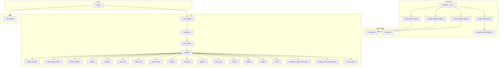

Figure Source
- [ultralytics/__init__.py](file://ultralytics/__init__.py)
- [ultralytics/engine/model.py](file://ultralytics/engine/model.py)
- [ultralytics/engine/predictor.py](file://ultralytics/engine/predictor.py)
- [ultralytics/engine/trainer.py](file://ultralytics/engine/trainer.py)
- [ultralytics/engine/validator.py](file://ultralytics/engine/validator.py)
- [ultralytics/engine/exporter.py](file://ultralytics/engine/exporter.py)
- [ultralytics/utils/events.py](file://ultralytics/utils/events.py)
- [ultralytics/utils/errors.py](file://ultralytics/utils/errors.py)
- [agent/runtime/cli/core_handlers.py](file://agent/runtime/cli/core_handlers.py)
- [agent/runtime/cli/dispatcher.py](file://agent/runtime/cli/dispatcher.py)
- [agent/runtime/cli/job_handlers.py](file://agent/runtime/cli/job_handlers.py)
- [agent/runtime/cli/executor.py](file://agent/runtime/cli/executor.py)
- [agent/runtime/cli/model_handlers.py](file://agent/runtime/cli/model_handlers.py)
- [agent/runtime/cli/multimodal_handlers.py](file://agent/runtime/cli/multimodal_handlers.py)
- [agent/runtime/cli/system_handlers.py](file://agent/runtime/cli/system_handlers.py)
- [agent/runtime/cli/validate.py](file://agent/runtime/cli/validate.py)
- [agent/runtime/cli/snapshot.py](file://agent/runtime/cli/snapshot.py)
- [agent/runtime/cli/lora_tools.py](file://agent/runtime/cli/lora_tools.py)
- [agent/runtime/cli/moe_tools.py](file://agent/runtime/cli/moe_tools.py)
- [agent/runtime/cli/peft_compare.py](file://agent/runtime/cli/peft_compare.py)
- [agent/runtime/cli/stability.py](file://agent/runtime/cli/stability.py)
- [agent/runtime/cli/normalize.py](file://agent/runtime/cli/normalize.py)
- [agent/runtime/cli/progress.py](file://agent/runtime/cli/progress.py)
- [agent/runtime/cli/async_jobs.py](file://agent/runtime/cli/async_jobs.py)
- [agent/runtime/cli/contract.py](file://agent/runtime/cli/contract.py)
- [agent/runtime/cli/pipeline.py](file://agent/runtime/cli/pipeline.py)
- [agent/runtime/cli/dataset.py](file://agent/runtime/cli/dataset.py)
- [agent/runtime/cli/device.py](file://agent/runtime/cli/device.py)
- [agent/runtime/cli/regenerate_open_world_report.py](file://agent/runtime/cli/regenerate_open_world_report.py)
- [agent/runtime/cli/compare_open_world_profiles.py](file://agent/runtime/cli/compare_open_world_profiles.py)
- [agent/runtime/cli/sahi_compare.py](file://agent/runtime/cli/sahi_compare.py)
- [app.py](file://app.py)
- [ultralytics/hub/session.py](file://ultralytics/hub/session.py)

Section Source
- [ultralytics/__init__.py](file://ultralytics/__init__.py)
- [ultralytics/engine/model.py](file://ultralytics/engine/model.py)
- [ultralytics/engine/predictor.py](file://ultralytics/engine/predictor.py)
- [ultralytics/engine/trainer.py](file://ultralytics/engine/trainer.py)
- [ultralytics/engine/validator.py](file://ultralytics/engine/validator.py)
- [ultralytics/engine/exporter.py](file://ultralytics/engine/exporter.py)
- [ultralytics/utils/events.py](file://ultralytics/utils/events.py)
- [ultralytics/utils/errors.py](file://ultralytics/utils/errors.py)
- [agent/runtime/cli/core_handlers.py](file://agent/runtime/cli/core_handlers.py)
- [agent/runtime/cli/dispatcher.py](file://agent/runtime/cli/dispatcher.py)
- [agent/runtime/cli/job_handlers.py](file://agent/runtime/cli/job_handlers.py)
- [agent/runtime/cli/executor.py](file://agent/runtime/cli/executor.py)
- [agent/runtime/cli/model_handlers.py](file://agent/runtime/cli/model_handlers.py)
- [agent/runtime/cli/multimodal_handlers.py](file://agent/runtime/cli/multimodal_handlers.py)
- [agent/runtime/cli/system_handlers.py](file://agent/runtime/cli/system_handlers.py)
- [agent/runtime/cli/validate.py](file://agent/runtime/cli/validate.py)
- [agent/runtime/cli/snapshot.py](file://agent/runtime/cli/snapshot.py)
- [agent/runtime/cli/lora_tools.py](file://agent/runtime/cli/lora_tools.py)
- [agent/runtime/cli/moe_tools.py](file://agent/runtime/cli/moe_tools.py)
- [agent/runtime/cli/peft_compare.py](file://agent/runtime/cli/peft_compare.py)
- [agent/runtime/cli/stability.py](file://agent/runtime/cli/stability.py)
- [agent/runtime/cli/normalize.py](file://agent/runtime/cli/normalize.py)
- [agent/runtime/cli/progress.py](file://agent/runtime/cli/progress.py)
- [agent/runtime/cli/async_jobs.py](file://agent/runtime/cli/async_jobs.py)
- [agent/runtime/cli/contract.py](file://agent/runtime/cli/contract.py)
- [agent/runtime/cli/pipeline.py](file://agent/runtime/cli/pipeline.py)
- [agent/runtime/cli/dataset.py](file://agent/runtime/cli/dataset.py)
- [agent/runtime/cli/device.py](file://agent/runtime/cli/device.py)
- [agent/runtime/cli/regenerate_open_world_report.py](file://agent/runtime/cli/regenerate_open_world_report.py)
- [agent/runtime/cli/compare_open_world_profiles.py](file://agent/runtime/cli/compare_open_world_profiles.py)
- [agent/runtime/cli/sahi_compare.py](file://agent/runtime/cli/sahi_compare.py)
- [app.py](file://app.py)
- [ultralytics/hub/session.py](file://ultralytics/hub/session.py)

## Core Components
本节概述Python API的核心类and其职责，包括构造函数、关键方法、属性and返回值类型说明。for避免冗长代码，所有implementing细节Centered on“源码路径”形式引用。

- Model（Model Encapsulation）
  - 职责：统一加载权重、设备管理、Inference、Training、Validation、Exportetc.高层接口。
  - 典型方法：load、predict、train、val、export、infoetc.。
  - 属性：device、task、version、cfgetc.。
  - 异常：权重缺失、格式不兼容、设备不可用etc.。
  - 源码路径：[ultralytics/engine/model.py](file://ultralytics/engine/model.py)

- Predictor（Predictor）
  - 职责：Image Preprocessing、批处理、NMS、Visualization、结果聚合。
  - 典型方法：predict、postprocess、update_stateetc.。
  - 属性：imgsz、conf_thres、iou_thres、augmentetc.。
  - 源码路径：[ultralytics/engine/predictor.py](file://ultralytics/engine/predictor.py)

- Trainer（Trainer）
  - 职责：Optimizer配置、损失计算、EMA、Logging、Checkpoint保存。
  - 典型方法：setup、fit、resume、save_checkpointetc.。
  - 属性：hyp、data、epochs、batch_sizeetc.。
  - 源码路径：[ultralytics/engine/trainer.py](file://ultralytics/engine/trainer.py)

- Validator（Validator）
  - 职责：Metrics计算、混淆矩阵、PR曲线、Evaluation报告生成。
  - 典型方法：validate、compute_metrics、log_resultsetc.。
  - 属性：task、classes、iou_thresholdsetc.。
  - 源码路径：[ultralytics/engine/validator.py](file://ultralytics/engine/validator.py)

- Exporter（Exporter）
  - 职责：ONNX/TensorRT/OpenVINO/TFLiteetc.格式Export，预检and兼容性校验。
  - 典型方法：export、precheck、optimizeetc.。
  - 属性：format、half、dynamic、opsetetc.。
  - 源码路径：[ultralytics/engine/exporter.py](file://ultralytics/engine/exporter.py)

- 事件系统（events）
  - 职责：订阅/发布事件、生命周期钩子、进度andLogging回调。
  - 典型事件：on_train_start、on_epoch_end、on_predict_result、on_export_doneetc.。
  - 源码路径：[ultralytics/utils/events.py](file://ultralytics/utils/events.py)

- 错误and异常（errors）
  - 职责：统一异常层次、错误码、可诊断信息。
  - 常见基类：YoloError、ConfigError、DeviceError、ExportErroretc.。
  - 源码路径：[ultralytics/utils/errors.py](file://ultralytics/utils/errors.py)

- HUB会话（session）
  - 职责：认证、模型/数据集上传下载、远程TrainingandInference。
  - 典型方法：login、get_model、upload、download、start_trainingetc.。
  - 源码路径：[ultralytics/hub/session.py](file://ultralytics/hub/session.py)

Section Source
- [ultralytics/engine/model.py](file://ultralytics/engine/model.py)
- [ultralytics/engine/predictor.py](file://ultralytics/engine/predictor.py)
- [ultralytics/engine/trainer.py](file://ultralytics/engine/trainer.py)
- [ultralytics/engine/validator.py](file://ultralytics/engine/validator.py)
- [ultralytics/engine/exporter.py](file://ultralytics/engine/exporter.py)
- [ultralytics/utils/events.py](file://ultralytics/utils/events.py)
- [ultralytics/utils/errors.py](file://ultralytics/utils/errors.py)
- [ultralytics/hub/session.py](file://ultralytics/hub/session.py)

## Architecture Overview
下图展示从Python APIto引擎、事件、CLIandWeb服务的整体交互流程。

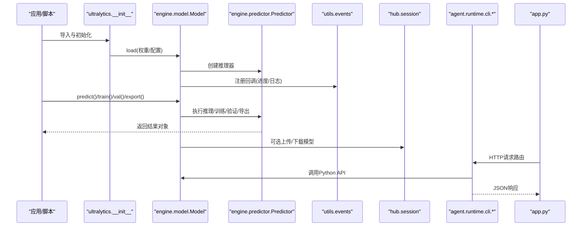

Figure Source
- [ultralytics/__init__.py](file://ultralytics/__init__.py)
- [ultralytics/engine/model.py](file://ultralytics/engine/model.py)
- [ultralytics/engine/predictor.py](file://ultralytics/engine/predictor.py)
- [ultralytics/utils/events.py](file://ultralytics/utils/events.py)
- [ultralytics/hub/session.py](file://ultralytics/hub/session.py)
- [agent/runtime/cli/core_handlers.py](file://agent/runtime/cli/core_handlers.py)
- [agent/runtime/cli/dispatcher.py](file://agent/runtime/cli/dispatcher.py)
- [agent/runtime/cli/job_handlers.py](file://agent/runtime/cli/job_handlers.py)
- [agent/runtime/cli/executor.py](file://agent/runtime/cli/executor.py)
- [agent/runtime/cli/model_handlers.py](file://agent/runtime/cli/model_handlers.py)
- [agent/runtime/cli/multimodal_handlers.py](file://agent/runtime/cli/multimodal_handlers.py)
- [agent/runtime/cli/system_handlers.py](file://agent/runtime/cli/system_handlers.py)
- [agent/runtime/cli/validate.py](file://agent/runtime/cli/validate.py)
- [agent/runtime/cli/snapshot.py](file://agent/runtime/cli/snapshot.py)
- [agent/runtime/cli/lora_tools.py](file://agent/runtime/cli/lora_tools.py)
- [agent/runtime/cli/moe_tools.py](file://agent/runtime/cli/moe_tools.py)
- [agent/runtime/cli/peft_compare.py](file://agent/runtime/cli/peft_compare.py)
- [agent/runtime/cli/stability.py](file://agent/runtime/cli/stability.py)
- [agent/runtime/cli/normalize.py](file://agent/runtime/cli/normalize.py)
- [agent/runtime/cli/progress.py](file://agent/runtime/cli/progress.py)
- [agent/runtime/cli/async_jobs.py](file://agent/runtime/cli/async_jobs.py)
- [agent/runtime/cli/contract.py](file://agent/runtime/cli/contract.py)
- [agent/runtime/cli/pipeline.py](file://agent/runtime/cli/pipeline.py)
- [agent/runtime/cli/dataset.py](file://agent/runtime/cli/dataset.py)
- [agent/runtime/cli/device.py](file://agent/runtime/cli/device.py)
- [agent/runtime/cli/regenerate_open_world_report.py](file://agent/runtime/cli/regenerate_open_world_report.py)
- [agent/runtime/cli/compare_open_world_profiles.py](file://agent/runtime/cli/compare_open_world_profiles.py)
- [agent/runtime/cli/sahi_compare.py](file://agent/runtime/cli/sahi_compare.py)
- [app.py](file://app.py)

## Detailed Component Analysis

### Python API：Model类
- 构造函数
  - 主要参数：weights、cfg、task、device、verbose、cacheetc.。
  - 行for：解析权重或配置、选择Tasks、初始化设备、Loading Model Weights。
  - 异常：权重不存while、格式不Supporting、设备不可用、配置冲突。
- 关键方法
  - predict：输入图像/视频/流，Returning Detection Results对象。
  - train：启动Training，Supporting断点续训、超参调优。
  - val：执行Validation，输出MetricsandVisualization。
  - export：Exporting to多种部署格式，Supporting半精度and动态形状。
  - info：打印模型结构and参数统计。
- 属性
  - device：当前运行设备（CPU/GPU）。
  - task：Tasks类型（detect/segment/pose/tracketc.）。
  - version：框架版本。
  - cfg：配置字典。
- 最佳实践
  - 复用Model实例Centered on减少重复加载开销。
  - Set appropriatelyconf_thresandiou_thres平衡召回and误报。
  - whileGPU上启用半精度Centered on提升吞吐。
- 源码路径
  - [ultralytics/engine/model.py](file://ultralytics/engine/model.py)

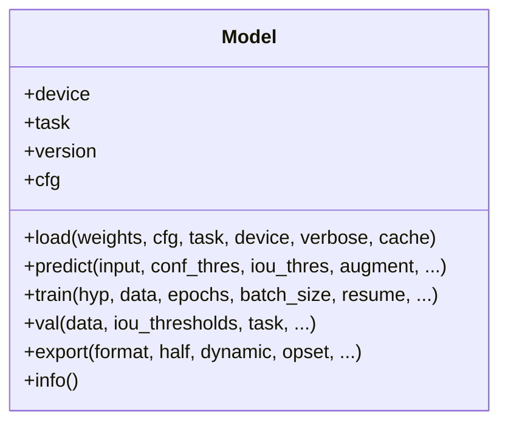

Figure Source
- [ultralytics/engine/model.py](file://ultralytics/engine/model.py)

Section Source
- [ultralytics/engine/model.py](file://ultralytics/engine/model.py)

### Python API：Predictor类
- 职责：数据预处理、批处理、Post-Processing（NMS）、结果Visualization。
- 关键方法
  - predict：Executing Inference流水线。
  - postprocess：阈值过滤、NMS、坐标还原。
  - update_state：更新内部状态（such as设备、Batch Size）。
- 属性
  - imgsz：输入尺寸。
  - conf_thres：Confidence Threshold。
  - iou_thres：IoU阈值。
  - augment：是否开启测试时增强。
- 源码路径
  - [ultralytics/engine/predictor.py](file://ultralytics/engine/predictor.py)

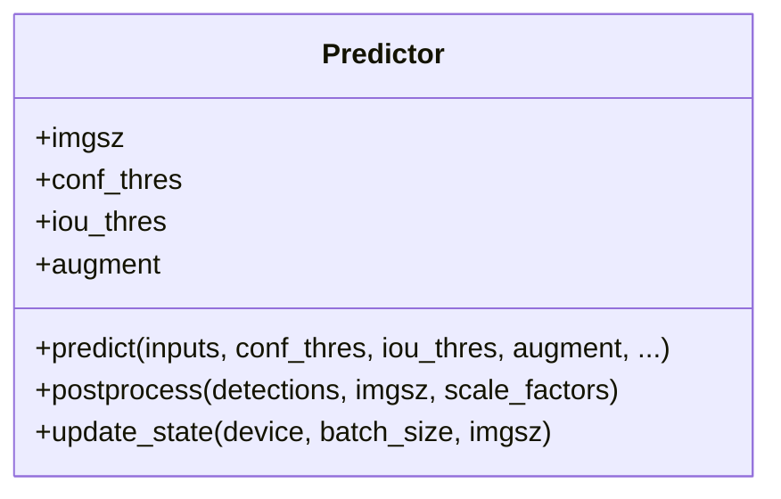

Figure Source
- [ultralytics/engine/predictor.py](file://ultralytics/engine/predictor.py)

Section Source
- [ultralytics/engine/predictor.py](file://ultralytics/engine/predictor.py)

### Python API：Trainer类
- 职责：Training循环、Optimizer、损失、EMA、Checkpoint、Logging。
- 关键方法
  - setup：准备数据、模型、Optimizer、回调。
  - fit：主Training循环。
  - resume：恢复Training。
  - save_checkpoint：保存Checkpoint。
- 属性
  - hyp：超参配置。
  - data：数据集配置。
  - epochs：Training轮数。
  - batch_size：Batch Size。
- 源码路径
  - [ultralytics/engine/trainer.py](file://ultralytics/engine/trainer.py)

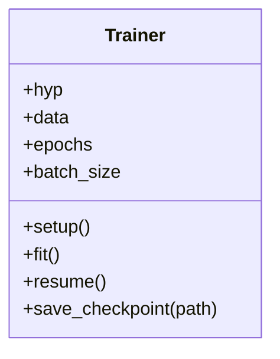

Figure Source
- [ultralytics/engine/trainer.py](file://ultralytics/engine/trainer.py)

Section Source
- [ultralytics/engine/trainer.py](file://ultralytics/engine/trainer.py)

### Python API：Validator类
- 职责：ValidationMetrics计算、混淆矩阵、PR曲线、报告生成。
- 关键方法
  - validate：执行Validation流程。
  - compute_metrics：计算各类Metrics。
  - log_results：记录andVisualization结果。
- 属性
  - task：Tasks类型。
  - classes：类别列表。
  - iou_thresholds：IoU阈值集合。
- 源码路径
  - [ultralytics/engine/validator.py](file://ultralytics/engine/validator.py)

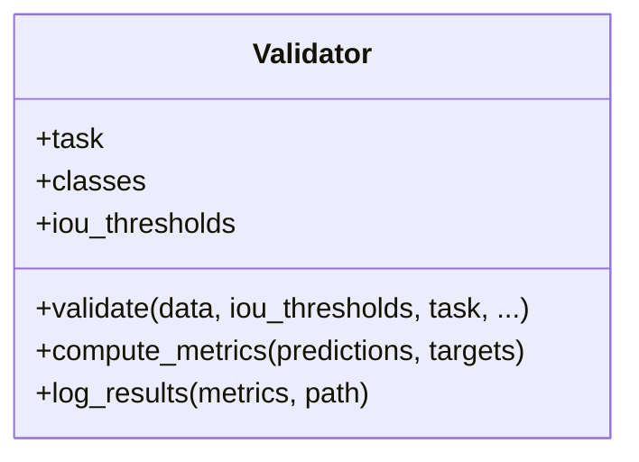

Figure Source
- [ultralytics/engine/validator.py](file://ultralytics/engine/validator.py)

Section Source
- [ultralytics/engine/validator.py](file://ultralytics/engine/validator.py)

### Python API：Exporter类
- 职责：多格式Export、预检、Optimization。
- 关键方法
  - export：执行Export流程。
  - precheck：环境andcapabilities预检。
  - optimize：针对目标后端进行Optimization。
- 属性
  - format：目标格式（onnx/tensorrt/openvino/tfliteetc.）。
  - half：半精度开关。
  - dynamic：动态形状开关。
  - opset：算子集版本。
- 源码路径
  - [ultralytics/engine/exporter.py](file://ultralytics/engine/exporter.py)

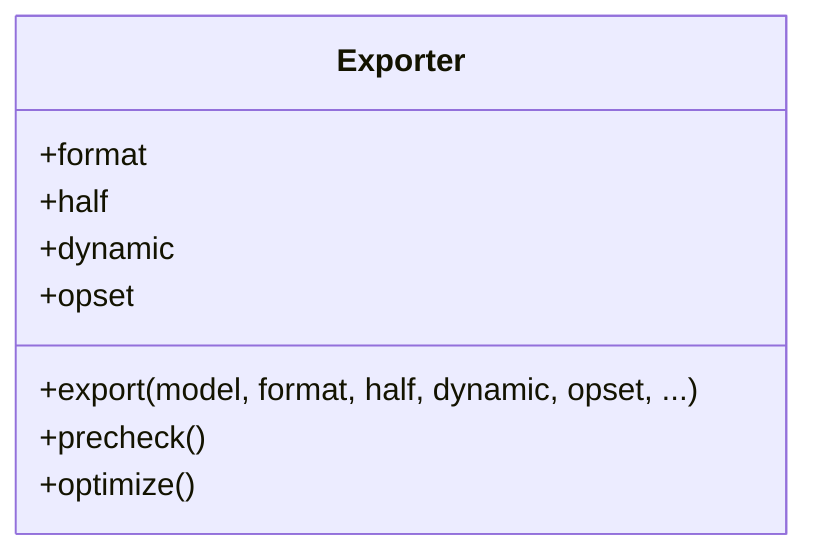

Figure Source
- [ultralytics/engine/exporter.py](file://ultralytics/engine/exporter.py)

Section Source
- [ultralytics/engine/exporter.py](file://ultralytics/engine/exporter.py)

### 事件系统and回调机制
- 事件总线
  - 订阅：register(event_name, callback)。
  - 发布：emit(event_name, payload)。
  - 生命周期：Training开始/End、Inference完成、Export完成etc.。
- 常用事件
  - on_train_start、on_epoch_end、on_predict_result、on_export_done。
- 回调规范
  - 函数签名：callback(event_payload)。
  - 异常隔离：回调内异常不应影响主流程。
- 源码路径
  - [ultralytics/utils/events.py](file://ultralytics/utils/events.py)

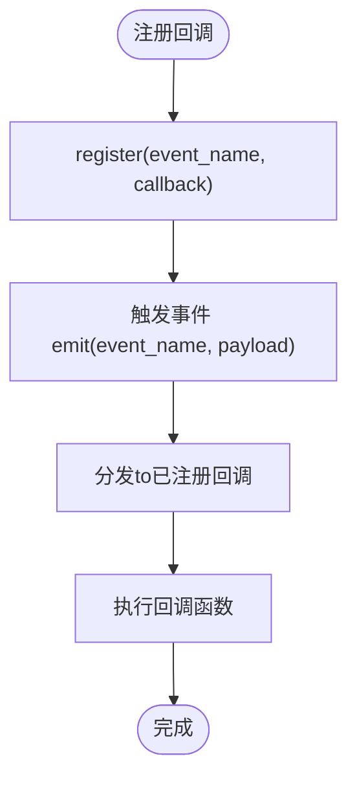

Figure Source
- [ultralytics/utils/events.py](file://ultralytics/utils/events.py)

Section Source
- [ultralytics/utils/events.py](file://ultralytics/utils/events.py)

### 错误and异常层次
- 基类
  - YoloError：通用错误基类。
- 派生类
  - ConfigError：配置相关错误。
  - DeviceError：设备不可用或分配失败。
  - ExportError：Export Failure或格式不兼容。
  - DataError：Data Loading或预处理错误。
- Uses建议
  - 捕获具体异常类型，避免吞掉异常。
  - provides上下文信息and错误码便于诊断。
- 源码路径
  - [ultralytics/utils/errors.py](file://ultralytics/utils/errors.py)

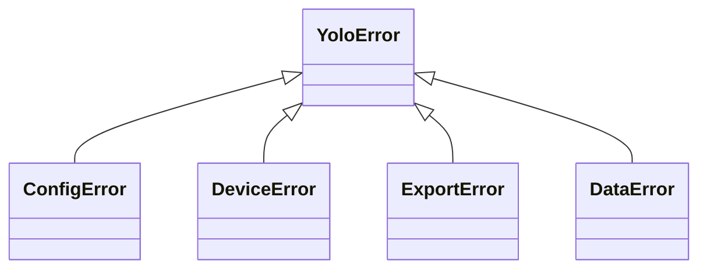

Figure Source
- [ultralytics/utils/errors.py](file://ultralytics/utils/errors.py)

Section Source
- [ultralytics/utils/errors.py](file://ultralytics/utils/errors.py)

### CLI命令andTasks调度
- 核心处理器
  - core_handlers：定义基础命令and参数解析。
  - dispatcher：命令分发and路由。
  - job_handlers：作业管理and状态Tracking。
  - executor：异步执行and并发控制。
- 功能处理器
  - model_handlers：模型加载/Export/诊断。
  - multimodal_handlers：MultimodalInferenceand融合。
  - system_handlers：系统信息and资源监控。
  - validate：数据and配置校验。
  - snapshot：快照and回滚。
  - lora_tools：LoRA微调工具。
  - moe_tools：MoE路由and专家管理。
  - peft_compare：PEFT对比实验。
  - stability：稳定性检测。
  - normalize：数据归一化。
  - progress：进度条andLogging。
  - async_jobs：异步作业队列。
  - contract：契约and接口校验。
  - pipeline：End-to-end pipeline编排。
  - dataset：数据集操作。
  - device：设备探测and管理。
  - regenerate_open_world_report：开放世界报告再生成。
  - compare_open_world_profiles：开放世界画像对比。
  - sahi_compare：SAHI切片Inference对比。
- 源码路径
  - [agent/runtime/cli/core_handlers.py](file://agent/runtime/cli/core_handlers.py)
  - [agent/runtime/cli/dispatcher.py](file://agent/runtime/cli/dispatcher.py)
  - [agent/runtime/cli/job_handlers.py](file://agent/runtime/cli/job_handlers.py)
  - [agent/runtime/cli/executor.py](file://agent/runtime/cli/executor.py)
  - [agent/runtime/cli/model_handlers.py](file://agent/runtime/cli/model_handlers.py)
  - [agent/runtime/cli/multimodal_handlers.py](file://agent/runtime/cli/multimodal_handlers.py)
  - [agent/runtime/cli/system_handlers.py](file://agent/runtime/cli/system_handlers.py)
  - [agent/runtime/cli/validate.py](file://agent/runtime/cli/validate.py)
  - [agent/runtime/cli/snapshot.py](file://agent/runtime/cli/snapshot.py)
  - [agent/runtime/cli/lora_tools.py](file://agent/runtime/cli/lora_tools.py)
  - [agent/runtime/cli/moe_tools.py](file://agent/runtime/cli/moe_tools.py)
  - [agent/runtime/cli/peft_compare.py](file://agent/runtime/cli/peft_compare.py)
  - [agent/runtime/cli/stability.py](file://agent/runtime/cli/stability.py)
  - [agent/runtime/cli/normalize.py](file://agent/runtime/cli/normalize.py)
  - [agent/runtime/cli/progress.py](file://agent/runtime/cli/progress.py)
  - [agent/runtime/cli/async_jobs.py](file://agent/runtime/cli/async_jobs.py)
  - [agent/runtime/cli/contract.py](file://agent/runtime/cli/contract.py)
  - [agent/runtime/cli/pipeline.py](file://agent/runtime/cli/pipeline.py)
  - [agent/runtime/cli/dataset.py](file://agent/runtime/cli/dataset.py)
  - [agent/runtime/cli/device.py](file://agent/runtime/cli/device.py)
  - [agent/runtime/cli/regenerate_open_world_report.py](file://agent/runtime/cli/regenerate_open_world_report.py)
  - [agent/runtime/cli/compare_open_world_profiles.py](file://agent/runtime/cli/compare_open_world_profiles.py)
  - [agent/runtime/cli/sahi_compare.py](file://agent/runtime/cli/sahi_compare.py)

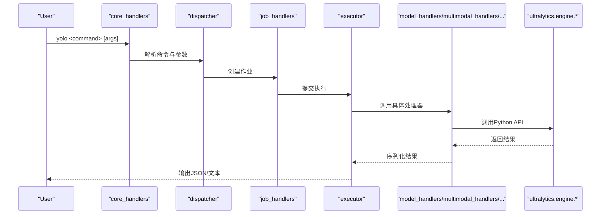

Figure Source
- [agent/runtime/cli/core_handlers.py](file://agent/runtime/cli/core_handlers.py)
- [agent/runtime/cli/dispatcher.py](file://agent/runtime/cli/dispatcher.py)
- [agent/runtime/cli/job_handlers.py](file://agent/runtime/cli/job_handlers.py)
- [agent/runtime/cli/executor.py](file://agent/runtime/cli/executor.py)
- [agent/runtime/cli/model_handlers.py](file://agent/runtime/cli/model_handlers.py)
- [agent/runtime/cli/multimodal_handlers.py](file://agent/runtime/cli/multimodal_handlers.py)
- [agent/runtime/cli/system_handlers.py](file://agent/runtime/cli/system_handlers.py)
- [agent/runtime/cli/validate.py](file://agent/runtime/cli/validate.py)
- [agent/runtime/cli/snapshot.py](file://agent/runtime/cli/snapshot.py)
- [agent/runtime/cli/lora_tools.py](file://agent/runtime/cli/lora_tools.py)
- [agent/runtime/cli/moe_tools.py](file://agent/runtime/cli/moe_tools.py)
- [agent/runtime/cli/peft_compare.py](file://agent/runtime/cli/peft_compare.py)
- [agent/runtime/cli/stability.py](file://agent/runtime/cli/stability.py)
- [agent/runtime/cli/normalize.py](file://agent/runtime/cli/normalize.py)
- [agent/runtime/cli/progress.py](file://agent/runtime/cli/progress.py)
- [agent/runtime/cli/async_jobs.py](file://agent/runtime/cli/async_jobs.py)
- [agent/runtime/cli/contract.py](file://agent/runtime/cli/contract.py)
- [agent/runtime/cli/pipeline.py](file://agent/runtime/cli/pipeline.py)
- [agent/runtime/cli/dataset.py](file://agent/runtime/cli/dataset.py)
- [agent/runtime/cli/device.py](file://agent/runtime/cli/device.py)
- [agent/runtime/cli/regenerate_open_world_report.py](file://agent/runtime/cli/regenerate_open_world_report.py)
- [agent/runtime/cli/compare_open_world_profiles.py](file://agent/runtime/cli/compare_open_world_profiles.py)
- [agent/runtime/cli/sahi_compare.py](file://agent/runtime/cli/sahi_compare.py)

Section Source
- [agent/runtime/cli/core_handlers.py](file://agent/runtime/cli/core_handlers.py)
- [agent/runtime/cli/dispatcher.py](file://agent/runtime/cli/dispatcher.py)
- [agent/runtime/cli/job_handlers.py](file://agent/runtime/cli/job_handlers.py)
- [agent/runtime/cli/executor.py](file://agent/runtime/cli/executor.py)
- [agent/runtime/cli/model_handlers.py](file://agent/runtime/cli/model_handlers.py)
- [agent/runtime/cli/multimodal_handlers.py](file://agent/runtime/cli/multimodal_handlers.py)
- [agent/runtime/cli/system_handlers.py](file://agent/runtime/cli/system_handlers.py)
- [agent/runtime/cli/validate.py](file://agent/runtime/cli/validate.py)
- [agent/runtime/cli/snapshot.py](file://agent/runtime/cli/snapshot.py)
- [agent/runtime/cli/lora_tools.py](file://agent/runtime/cli/lora_tools.py)
- [agent/runtime/cli/moe_tools.py](file://agent/runtime/cli/moe_tools.py)
- [agent/runtime/cli/peft_compare.py](file://agent/runtime/cli/peft_compare.py)
- [agent/runtime/cli/stability.py](file://agent/runtime/cli/stability.py)
- [agent/runtime/cli/normalize.py](file://agent/runtime/cli/normalize.py)
- [agent/runtime/cli/progress.py](file://agent/runtime/cli/progress.py)
- [agent/runtime/cli/async_jobs.py](file://agent/runtime/cli/async_jobs.py)
- [agent/runtime/cli/contract.py](file://agent/runtime/cli/contract.py)
- [agent/runtime/cli/pipeline.py](file://agent/runtime/cli/pipeline.py)
- [agent/runtime/cli/dataset.py](file://agent/runtime/cli/dataset.py)
- [agent/runtime/cli/device.py](file://agent/runtime/cli/device.py)
- [agent/runtime/cli/regenerate_open_world_report.py](file://agent/runtime/cli/regenerate_open_world_report.py)
- [agent/runtime/cli/compare_open_world_profiles.py](file://agent/runtime/cli/compare_open_world_profiles.py)
- [agent/runtime/cli/sahi_compare.py](file://agent/runtime/cli/sahi_compare.py)

### Web API（HTTP服务）
- 入口：app.pyprovidesHTTP服务（such asFastAPI应用），路由toCLI处理器或直接CallsPython API。
- 典型端点
  - /predict：图像/视频Inference。
  - /train：启动TrainingTasks。
  - /export：Model Export。
  - /status：作业状态查询。
- 请求/响应
  - 请求：JSON表单或Multipart文件。
  - 响应：结构化JSON（包含结果、Metrics、Logging路径）。
- 安全and鉴权
  - Recommended to use中间件进行鉴权and限流。
- 源码路径
  - [app.py](file://app.py)

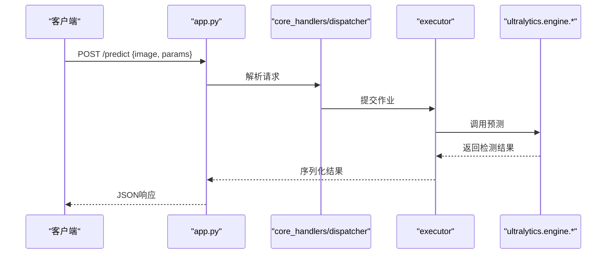

Figure Source
- [app.py](file://app.py)
- [agent/runtime/cli/core_handlers.py](file://agent/runtime/cli/core_handlers.py)
- [agent/runtime/cli/dispatcher.py](file://agent/runtime/cli/dispatcher.py)
- [agent/runtime/cli/executor.py](file://agent/runtime/cli/executor.py)
- [ultralytics/engine/model.py](file://ultralytics/engine/model.py)

Section Source
- [app.py](file://app.py)
- [agent/runtime/cli/core_handlers.py](file://agent/runtime/cli/core_handlers.py)
- [agent/runtime/cli/dispatcher.py](file://agent/runtime/cli/dispatcher.py)
- [agent/runtime/cli/executor.py](file://agent/runtime/cli/executor.py)
- [ultralytics/engine/model.py](file://ultralytics/engine/model.py)

### 插件开发and扩展点
- 事件回调扩展
  - Via事件系统注册自定义回调，implementingLogging、监控、告警etc.。
  - Refer to：[ultralytics/utils/events.py](file://ultralytics/utils/events.py)
- CLI处理器扩展
  - 新增处理器Modules并whiledispatcher中注册新命令。
  - Refer to：[agent/runtime/cli/dispatcher.py](file://agent/runtime/cli/dispatcher.py)、[agent/runtime/cli/core_handlers.py](file://agent/runtime/cli/core_handlers.py)
- Export Backends扩展
  - whileExporter中添加新的Export Format Support。
  - Refer to：[ultralytics/engine/exporter.py](file://ultralytics/engine/exporter.py)
- Data Pipeline扩展
  - whileDataset/Loader中增加新的数据源或预处理步骤。
  - Refer to：[agent/runtime/cli/dataset.py](file://agent/runtime/cli/dataset.py)

Section Source
- [ultralytics/utils/events.py](file://ultralytics/utils/events.py)
- [agent/runtime/cli/dispatcher.py](file://agent/runtime/cli/dispatcher.py)
- [agent/runtime/cli/core_handlers.py](file://agent/runtime/cli/core_handlers.py)
- [ultralytics/engine/exporter.py](file://ultralytics/engine/exporter.py)
- [agent/runtime/cli/dataset.py](file://agent/runtime/cli/dataset.py)

## Dependency Analysis
- 耦合and内聚
  - Model高内聚地Encapsulates了Training、Inference、Exportetc.capabilities，降低外部耦合。
  - CLI层Viadispatcher解耦命令and处理器，提升可Extensibility。
- 直接依赖
  - engine.*依赖utils.eventsandutils.errors。
  - CLI依赖executorandhandlers，间接依赖engine.*。
- External Dependencies
  - HUB集成用于云端模型/数据集管理。
  - Web服务依赖HTTP框架（such asFastAPI）。
- Potential Cycles依赖
  - 确保CLI仅ViaexecutorCallsengine.*，避免反向依赖。

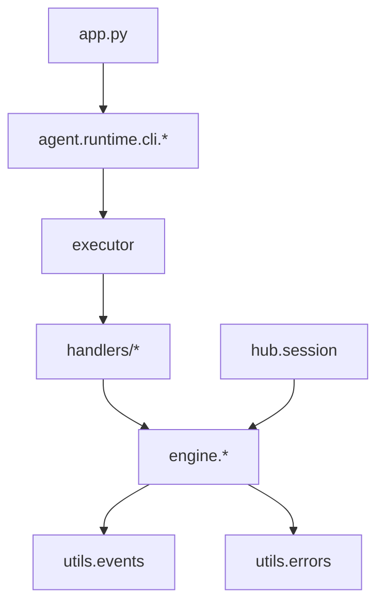

Figure Source
- [ultralytics/engine/model.py](file://ultralytics/engine/model.py)
- [ultralytics/engine/predictor.py](file://ultralytics/engine/predictor.py)
- [ultralytics/engine/trainer.py](file://ultralytics/engine/trainer.py)
- [ultralytics/engine/validator.py](file://ultralytics/engine/validator.py)
- [ultralytics/engine/exporter.py](file://ultralytics/engine/exporter.py)
- [ultralytics/utils/events.py](file://ultralytics/utils/events.py)
- [ultralytics/utils/errors.py](file://ultralytics/utils/errors.py)
- [agent/runtime/cli/dispatcher.py](file://agent/runtime/cli/dispatcher.py)
- [agent/runtime/cli/executor.py](file://agent/runtime/cli/executor.py)
- [agent/runtime/cli/model_handlers.py](file://agent/runtime/cli/model_handlers.py)
- [agent/runtime/cli/multimodal_handlers.py](file://agent/runtime/cli/multimodal_handlers.py)
- [agent/runtime/cli/system_handlers.py](file://agent/runtime/cli/system_handlers.py)
- [agent/runtime/cli/validate.py](file://agent/runtime/cli/validate.py)
- [agent/runtime/cli/snapshot.py](file://agent/runtime/cli/snapshot.py)
- [agent/runtime/cli/lora_tools.py](file://agent/runtime/cli/lora_tools.py)
- [agent/runtime/cli/moe_tools.py](file://agent/runtime/cli/moe_tools.py)
- [agent/runtime/cli/peft_compare.py](file://agent/runtime/cli/peft_compare.py)
- [agent/runtime/cli/stability.py](file://agent/runtime/cli/stability.py)
- [agent/runtime/cli/normalize.py](file://agent/runtime/cli/normalize.py)
- [agent/runtime/cli/progress.py](file://agent/runtime/cli/progress.py)
- [agent/runtime/cli/async_jobs.py](file://agent/runtime/cli/async_jobs.py)
- [agent/runtime/cli/contract.py](file://agent/runtime/cli/contract.py)
- [agent/runtime/cli/pipeline.py](file://agent/runtime/cli/pipeline.py)
- [agent/runtime/cli/dataset.py](file://agent/runtime/cli/dataset.py)
- [agent/runtime/cli/device.py](file://agent/runtime/cli/device.py)
- [agent/runtime/cli/regenerate_open_world_report.py](file://agent/runtime/cli/regenerate_open_world_report.py)
- [agent/runtime/cli/compare_open_world_profiles.py](file://agent/runtime/cli/compare_open_world_profiles.py)
- [agent/runtime/cli/sahi_compare.py](file://agent/runtime/cli/sahi_compare.py)
- [app.py](file://app.py)
- [ultralytics/hub/session.py](file://ultralytics/hub/session.py)

Section Source
- [ultralytics/engine/model.py](file://ultralytics/engine/model.py)
- [ultralytics/engine/predictor.py](file://ultralytics/engine/predictor.py)
- [ultralytics/engine/trainer.py](file://ultralytics/engine/trainer.py)
- [ultralytics/engine/validator.py](file://ultralytics/engine/validator.py)
- [ultralytics/engine/exporter.py](file://ultralytics/engine/exporter.py)
- [ultralytics/utils/events.py](file://ultralytics/utils/events.py)
- [ultralytics/utils/errors.py](file://ultralytics/utils/errors.py)
- [agent/runtime/cli/dispatcher.py](file://agent/runtime/cli/dispatcher.py)
- [agent/runtime/cli/executor.py](file://agent/runtime/cli/executor.py)
- [agent/runtime/cli/model_handlers.py](file://agent/runtime/cli/model_handlers.py)
- [agent/runtime/cli/multimodal_handlers.py](file://agent/runtime/cli/multimodal_handlers.py)
- [agent/runtime/cli/system_handlers.py](file://agent/runtime/cli/system_handlers.py)
- [agent/runtime/cli/validate.py](file://agent/runtime/cli/validate.py)
- [agent/runtime/cli/snapshot.py](file://agent/runtime/cli/snapshot.py)
- [agent/runtime/cli/lora_tools.py](file://agent/runtime/cli/lora_tools.py)
- [agent/runtime/cli/moe_tools.py](file://agent/runtime/cli/moe_tools.py)
- [agent/runtime/cli/peft_compare.py](file://agent/runtime/cli/peft_compare.py)
- [agent/runtime/cli/stability.py](file://agent/runtime/cli/stability.py)
- [agent/runtime/cli/normalize.py](file://agent/runtime/cli/normalize.py)
- [agent/runtime/cli/progress.py](file://agent/runtime/cli/progress.py)
- [agent/runtime/cli/async_jobs.py](file://agent/runtime/cli/async_jobs.py)
- [agent/runtime/cli/contract.py](file://agent/runtime/cli/contract.py)
- [agent/runtime/cli/pipeline.py](file://agent/runtime/cli/pipeline.py)
- [agent/runtime/cli/dataset.py](file://agent/runtime/cli/dataset.py)
- [agent/runtime/cli/device.py](file://agent/runtime/cli/device.py)
- [agent/runtime/cli/regenerate_open_world_report.py](file://agent/runtime/cli/regenerate_open_world_report.py)
- [agent/runtime/cli/compare_open_world_profiles.py](file://agent/runtime/cli/compare_open_world_profiles.py)
- [agent/runtime/cli/sahi_compare.py](file://agent/runtime/cli/sahi_compare.py)
- [app.py](file://app.py)
- [ultralytics/hub/session.py](file://ultralytics/hub/session.py)

## 性能and资源特征
- Inference Performance
  - 推荐whileGPU上Uses半精度and动态形状Centered on提升吞吐。
  - 调整conf_thresandiou_thresCentered on平衡延迟and召回。
- Training性能
  - Set appropriatelybatch_sizeandnum_workers，避免内存溢出。
  - UsesEMAandMixture精度加速收敛。
- Export性能
  - 选择合适的后端（TensorRT/OpenVINO/TFLite）andopset版本。
  - 预检andOptimization可减少部署时的兼容性问题。
- 资源Uses
  - 监控GPU显存andCPU占用，必要时限制并发。
  - Uses异步作业队列提高系统利用率。

## Troubleshooting Guide
- 常见问题
  - 权重加载失败：检查路径and格式，确认设备可用。
  - Export Failure：确认后端依赖安装and环境变量。
  - Training中断：检查数据完整性andLearning Rate设置。
- 诊断工具
  - Uses事件回调记录关键节点Logging。
  - 利用CLI的validateandsnapshot进行配置and状态检查。
- 异常处理
  - 捕获具体异常类型，避免吞掉异常。
  - provides上下文信息and错误码便于定位问题。

Section Source
- [ultralytics/utils/events.py](file://ultralytics/utils/events.py)
- [ultralytics/utils/errors.py](file://ultralytics/utils/errors.py)
- [agent/runtime/cli/validate.py](file://agent/runtime/cli/validate.py)
- [agent/runtime/cli/snapshot.py](file://agent/runtime/cli/snapshot.py)

## Conclusion
YOLO-Masterprovides了统一的Python API、丰富的CLI命令and灵活的Web API，Combining事件系统and错误层次，满足从开发to生产的多样化需求。Via合理的配置and扩展点，开发者可Centered on高效构建定制化视觉解决方案。

## Appendix
- 版本兼容性andMigration
  - 遵循向后兼容性承诺，重大变更需标注弃用周期。
  - Migration指南：逐步替换旧接口，关注配置Drift Detection。
- IDE集成and自动补全
  - 安装类型TipsandDocumentation字符串，启用IDE自动补全。
  - 配置虚拟环境and依赖，确保符号解析正确。
- 最佳实践
  - 复用Model实例，减少重复加载。
  - Uses事件回调进行监控and告警。
  - while生产环境启用Export预检andOptimization。