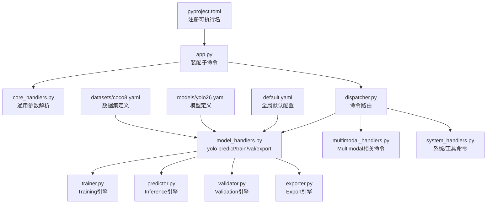
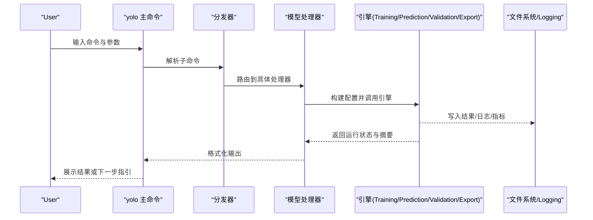
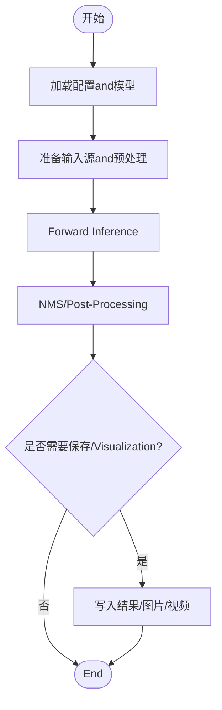
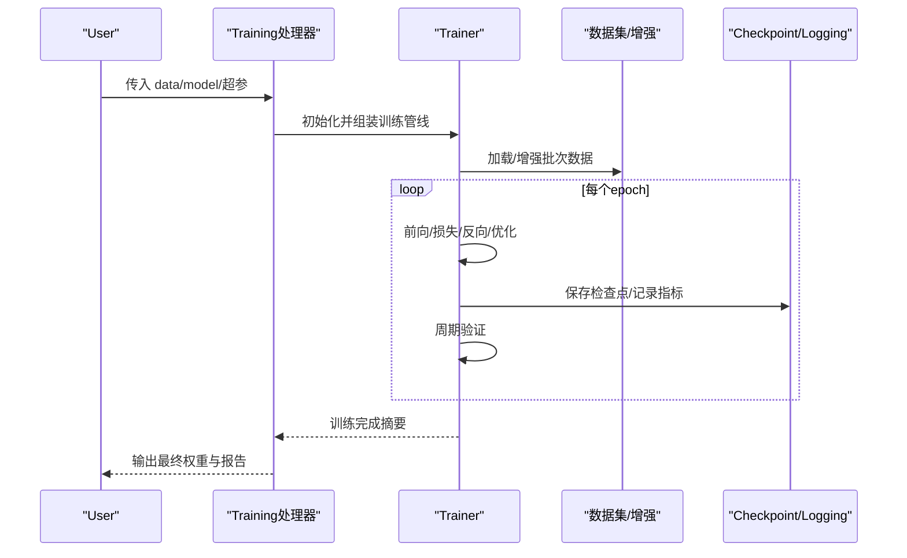
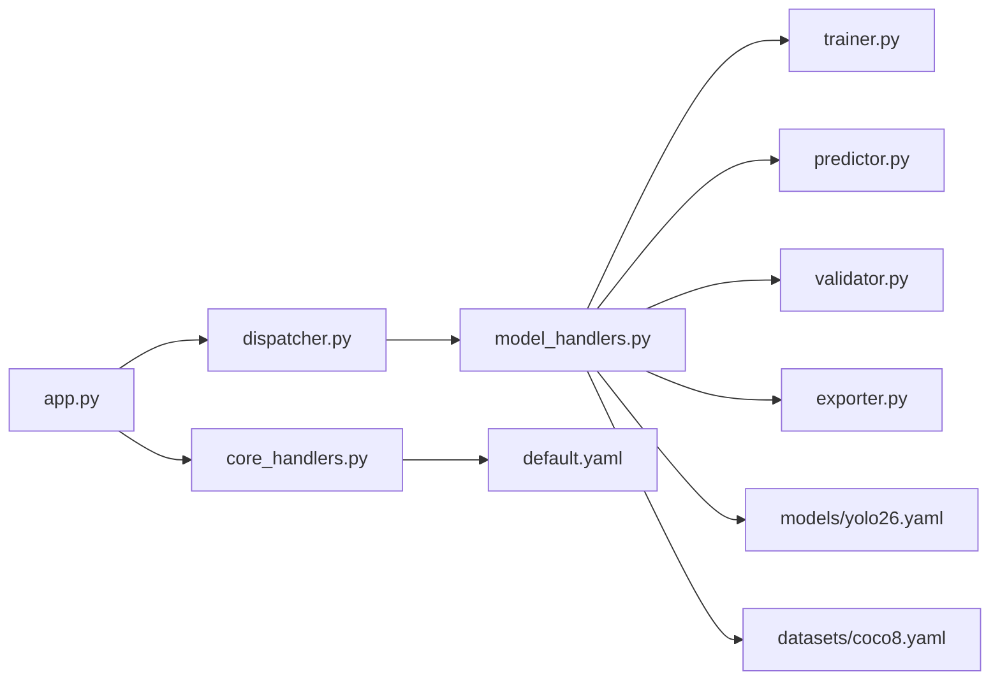

# Command Line API

<cite>
**Files Referenced in This Document**
- [pyproject.toml](file://pyproject.toml)
- [app.py](file://app.py)
- [runtime/cli/core_handlers.py](file://agent/runtime/cli/core_handlers.py)
- [runtime/cli/executor.py](file://agent/runtime/cli/executor.py)
- [runtime/cli/dispatcher.py](file://agent/runtime/cli/dispatcher.py)
- [runtime/cli/model_handlers.py](file://agent/runtime/cli/model_handlers.py)
- [runtime/cli/multimodal_handlers.py](file://agent/runtime/cli/multimodal_handlers.py)
- [runtime/cli/system_handlers.py](file://agent/runtime/cli/system_handlers.py)
- [runtime/cli/pipeline.py](file://agent/runtime/cli/pipeline.py)
- [runtime/cli/job_handlers.py](file://agent/runtime/cli/job_handlers.py)
- [runtime/cli/async_jobs.py](file://agent/runtime/cli/async_jobs.py)
- [runtime/cli/launcher_handlers.py](file://agent/runtime/cli/launcher_handlers.py)
- [runtime/cli/lora_tools.py](file://agent/runtime/cli/lora_tools.py)
- [runtime/cli/moe_tools.py](file://agent/runtime/cli/moe_tools.py)
- [runtime/cli/snapshot.py](file://agent/runtime/cli/snapshot.py)
- [runtime/cli/stability.py](file://agent/runtime/cli/stability.py)
- [runtime/cli/validate.py](file://agent/runtime/cli/validate.py)
- [runtime/cli/normalize.py](file://agent/runtime/cli/normalize.py)
- [runtime/cli/progress.py](file://agent/runtime/cli/progress.py)
- [runtime/cli/device.py](file://agent/runtime/cli/device.py)
- [runtime/cli/dataset.py](file://agent/runtime/cli/dataset.py)
- [runtime/cli/contract.py](file://agent/runtime/cli/contract.py)
- [runtime/cli/compare_open_world_profiles.py](file://agent/runtime/cli/compare_open_world_profiles.py)
- [runtime/cli/regenerate_open_world_report.py](file://agent/runtime/cli/regenerate_open_world_report.py)
- [runtime/cli/sahi_compare.py](file://agent/runtime/cli/sahi_compare.py)
- [runtime/cli/peft_compare.py](file://agent/runtime/cli/peft_compare.py)
- [engine/trainer.py](file://ultralytics/engine/trainer.py)
- [engine/predictor.py](file://ultralytics/engine/predictor.py)
- [engine/validator.py](file://ultralytics/engine/validator.py)
- [engine/exporter.py](file://ultralytics/engine/exporter.py)
- [cfg/default.yaml](file://ultralytics/cfg/default.yaml)
- [cfg/models/yolo26.yaml](file://ultralytics/cfg/models/yolo26.yaml)
- [cfg/datasets/coco8.yaml](file://ultralytics/cfg/datasets/coco8.yaml)
</cite>

## Table of Contents
1. [Introduction](#Introduction)
2. [Project Structure](#Project Structure)
3. [Core Components](#Core Components)
4. [Architecture Overview](#Architecture Overview)
5. [Detailed Component Analysis](#Detailed Component Analysis)
6. [Dependency Analysis](#Dependency Analysis)
7. [性能and资源建议](#性能and资源建议)
8. [Troubleshooting Guide](#Troubleshooting Guide)
9. [Conclusion](#Conclusion)
10. [Appendix：常用命令模板and工作流](#Appendix常用命令模板and工作流)

## Introduction
本文件for YOLO-Master 的Command Line Interface（CLI）完整Documentation，覆盖Prediction、Training、Validation、Exportetc.核心命令and其参数、配置文件Uses方式、批量处理and脚本自动化最佳实践、输出格式控制and结果保存选项、错误处理and调试信息查看方法，并provides常用Tasks的命令行模板and脚本Examples。读者无需深入源码即可高效完成端to端Tasks。

## Project Structure
YOLO-Master CLI 入口由包元数据注册，并while运行时Via统一调度器分发to具体处理器。核心路径such as下：
- 包入口and可执行名注册：pyproject.toml
- 顶层应用装配and子命令挂载：app.py
- CLI 核心调度and处理器：agent/runtime/cli/*
- Engine Layerimplementing（Training/Prediction/Validation/Export）：ultralytics/engine/*
- 默认配置and模型/数据集定义：ultralytics/cfg/*

Figure Source
- [pyproject.toml](file://pyproject.toml)
- [app.py](file://app.py)
- [runtime/cli/core_handlers.py](file://agent/runtime/cli/core_handlers.py)
- [runtime/cli/dispatcher.py](file://agent/runtime/cli/dispatcher.py)
- [runtime/cli/model_handlers.py](file://agent/runtime/cli/model_handlers.py)
- [engine/trainer.py](file://ultralytics/engine/trainer.py)
- [engine/predictor.py](file://ultralytics/engine/predictor.py)
- [engine/validator.py](file://ultralytics/engine/validator.py)
- [engine/exporter.py](file://ultralytics/engine/exporter.py)
- [cfg/default.yaml](file://ultralytics/cfg/default.yaml)
- [cfg/models/yolo26.yaml](file://ultralytics/cfg/models/yolo26.yaml)
- [cfg/datasets/coco8.yaml](file://ultralytics/cfg/datasets/coco8.yaml)

Section Source
- [pyproject.toml](file://pyproject.toml)
- [app.py](file://app.py)
- [runtime/cli/core_handlers.py](file://agent/runtime/cli/core_handlers.py)
- [runtime/cli/dispatcher.py](file://agent/runtime/cli/dispatcher.py)
- [runtime/cli/model_handlers.py](file://agent/runtime/cli/model_handlers.py)
- [engine/trainer.py](file://ultralytics/engine/trainer.py)
- [engine/predictor.py](file://ultralytics/engine/predictor.py)
- [engine/validator.py](file://ultralytics/engine/validator.py)
- [engine/exporter.py](file://ultralytics/engine/exporter.py)
- [cfg/default.yaml](file://ultralytics/cfg/default.yaml)
- [cfg/models/yolo26.yaml](file://ultralytics/cfg/models/yolo26.yaml)
- [cfg/datasets/coco8.yaml](file://ultralytics/cfg/datasets/coco8.yaml)

## Core Components
- 命令注册and装配：while应用入口中集中注册 yolo 主命令and子命令（predict、train、val、export etc.），并绑定对应处理器。
- 通用参数解析：providesDevice Selection、Logging级别、工作Table of Contents、缓存策略、Visualization开关etc.通用参数，供各子命令复用。
- 命令分发器：根据子命令名称将请求路由至具体处理器，Supporting扩展新命令。
- 业务处理器：
  - 模型类命令：Prediction、Training、Validation、Export
  - Multimodal命令：文本/图像联合Inference、Tips词管理etc.
  - 系统and工具命令：设备探测、快照、稳定性检查、对比报告生成etc.
- 异步and作业管理：后台Tasks提交、状态查询、结果拉取。
- 引擎对接：Calls ultralytics.engine 中的 trainer/predictor/validator/exporter 完成实际计算。

Section Source
- [app.py](file://app.py)
- [runtime/cli/core_handlers.py](file://agent/runtime/cli/core_handlers.py)
- [runtime/cli/dispatcher.py](file://agent/runtime/cli/dispatcher.py)
- [runtime/cli/model_handlers.py](file://agent/runtime/cli/model_handlers.py)
- [runtime/cli/multimodal_handlers.py](file://agent/runtime/cli/multimodal_handlers.py)
- [runtime/cli/system_handlers.py](file://agent/runtime/cli/system_handlers.py)
- [runtime/cli/async_jobs.py](file://agent/runtime/cli/async_jobs.py)
- [runtime/cli/job_handlers.py](file://agent/runtime/cli/job_handlers.py)
- [engine/trainer.py](file://ultralytics/engine/trainer.py)
- [engine/predictor.py](file://ultralytics/engine/predictor.py)
- [engine/validator.py](file://ultralytics/engine/validator.py)
- [engine/exporter.py](file://ultralytics/engine/exporter.py)

## Architecture Overview
下图展示了从命令行toEngine Layer的整体Calls链and数据流向。

Figure Source
- [runtime/cli/dispatcher.py](file://agent/runtime/cli/dispatcher.py)
- [runtime/cli/model_handlers.py](file://agent/runtime/cli/model_handlers.py)
- [engine/trainer.py](file://ultralytics/engine/trainer.py)
- [engine/predictor.py](file://ultralytics/engine/predictor.py)
- [engine/validator.py](file://ultralytics/engine/validator.py)
- [engine/exporter.py](file://ultralytics/engine/exporter.py)

## Detailed Component Analysis

### 通用参数and配置机制
- 通用参数
  - 设备and并行：GPU/CPU 选择、可见设备、分布式启动参数、批大小、线程数etc.
  - 路径and输出：工作Table of Contents、结果保存路径、是否覆盖已有结果、是否保留中间产物
  - Loggingand调试：Logging级别、详细模式、进度条开关、Visualization开关
  - 缓存andIO：数据缓存、预取、I/O 并发度
- 配置文件加载and覆盖
  - 优先级顺序（从高to低）：命令行参数 > Tasks级 YAML > 模型定义 YAML > 全局默认 YAML
  - 合并策略：同名键被高优先级覆盖；嵌套字典按键递归合并；列表型参数通常Centered on命令行for准进行替换
  - 常见配置项：数据集路径、类别数、模型权重、Learning Rate、Optimizer、增强策略、Export目标格式etc.
  - 推荐做法：将稳定复现实验的配置放入 YAML，仅对差异项Uses命令行覆盖

Section Source
- [runtime/cli/core_handlers.py](file://agent/runtime/cli/core_handlers.py)
- [cfg/default.yaml](file://ultralytics/cfg/default.yaml)

### 命令：yolo predict（Prediction）
- 功能：对单张图像、图像Table of Contents或视频进行Object Detection/分割/姿态etc.Inference，SupportingTrackingandVisualization。
- 关键参数
  - 输入：source（图像/视频/Table of Contents）、batch、conf、iou、imgsz、half、device、verbose
  - 输出：save_txt/save_json/save_crop、exist_ok、project/name、show/show_conf、line_thickness、hide_labels、hide_conf
  - 高级：nms、agnostic_nms、augment、retina_masks、max_det、classes、region、sahi、stream
- 典型流程
  - Loading Model Weights → 预处理 → Inference → NMS/Post-Processing → Visualization/保存 → 统计Metrics（Optional）

Figure Source
- [runtime/cli/model_handlers.py](file://agent/runtime/cli/model_handlers.py)
- [engine/predictor.py](file://ultralytics/engine/predictor.py)

Section Source
- [runtime/cli/model_handlers.py](file://agent/runtime/cli/model_handlers.py)
- [engine/predictor.py](file://ultralytics/engine/predictor.py)

### 命令：yolo train（Training）
- 功能：基于数据集and模型定义进行Training，Supporting断点续训、早停、Mixture精度、Distributed Trainingetc.。
- 关键参数
  - 数据and模型：data、model、weights、task、name、project、exist_ok
  - Training超参：epochs、batch、lr0、lrf、momentum、weight_decay、warmup_epochs、patience、amp、device、workers
  - 增强and正则：hsv、mosaic、mixup、copy_paste、scale、flip、translate、zoom、shear、perspective
  - LoggingandVisualization：plots、save_period、log_dir、tb、wandb、mlflow
  - 分布式：ddp、rank、local_rank、world_size、sync_bn
- 典型流程
  - 初始化数据集and模型 → 构建Optimizerand调度器 → 循环Training → 周期Validationand保存 → 汇总MetricsandVisualization

Figure Source
- [runtime/cli/model_handlers.py](file://agent/runtime/cli/model_handlers.py)
- [engine/trainer.py](file://ultralytics/engine/trainer.py)

Section Source
- [runtime/cli/model_handlers.py](file://agent/runtime/cli/model_handlers.py)
- [engine/trainer.py](file://ultralytics/engine/trainer.py)

### 命令：yolo val（Validation）
- 功能：whileValidation集上Evaluation模型性能，输出 mAP、precision、recall、混淆矩阵、PR曲线etc.。
- 关键参数
  - 输入：data、model、split、batch、conf、iou、imgsz、device
  - 输出：save_json、save_hybrid、plots、project/name、exist_ok
- 典型流程
  - 加载Validation集 → Batch Inference → Metrics计算 → VisualizationandExport

Section Source
- [runtime/cli/model_handlers.py](file://agent/runtime/cli/model_handlers.py)
- [engine/validator.py](file://ultralytics/engine/validator.py)

### 命令：yolo export（Export）
- 功能：将 PyTorch Model Exportfor ONNX/TensorRT/OpenVINO/CoreML/TFLite etc.格式，便于部署。
- 关键参数
  - 输入：model、weights、task、imgsz、dynamic、half、opset、simplify、include
  - 后端：backend、trt_calib、trt_int8、openvino_fp16、coreml_compute_units、tflite_int8
  - 输出：project/name、exist_ok、verbose
- 典型流程
  - 加载权重 → 构建Export图 → 转换andOptimization → 校验and打包

Section Source
- [runtime/cli/model_handlers.py](file://agent/runtime/cli/model_handlers.py)
- [engine/exporter.py](file://ultralytics/engine/exporter.py)

### 命令：Multimodaland系统工具
- Multimodal命令：Supporting文本+图像联合Inference、Tips词管理、Open-Vocabulary Detectionetc.（See multimodal_handlers）。
- 系统工具命令：设备探测、快照、稳定性检查、对比报告生成、SAHI 切片Inference对比、PEFT/LORA 工具etc.。

Section Source
- [runtime/cli/multimodal_handlers.py](file://agent/runtime/cli/multimodal_handlers.py)
- [runtime/cli/system_handlers.py](file://agent/runtime/cli/system_handlers.py)
- [runtime/cli/sahi_compare.py](file://agent/runtime/cli/sahi_compare.py)
- [runtime/cli/peft_compare.py](file://agent/runtime/cli/peft_compare.py)
- [runtime/cli/lora_tools.py](file://agent/runtime/cli/lora_tools.py)
- [runtime/cli/moe_tools.py](file://agent/runtime/cli/moe_tools.py)
- [runtime/cli/snapshot.py](file://agent/runtime/cli/snapshot.py)
- [runtime/cli/stability.py](file://agent/runtime/cli/stability.py)

### 异步and作业管理
- 后台提交：将Training/Exportetc.耗时Tasks提交to后台队列，返回 job_id。
- 状态查询：根据 job_id 查询运行状态、进度and结果位置。
- 结果拉取：完成后自动归档结果，Supporting远程存储and版本化。

Section Source
- [runtime/cli/async_jobs.py](file://agent/runtime/cli/async_jobs.py)
- [runtime/cli/job_handlers.py](file://agent/runtime/cli/job_handlers.py)

## Dependency Analysis
- Modules耦合
  - app.py 负责装配，低耦合地依赖 dispatcher and各 handlers
  - model_handlers 作for门面，聚合 trainer/predictor/validator/exporter
  - core_handlers provides通用参数解析and配置合并逻辑
- External Dependencies
  - ultralytics.engine.* provides核心算法implementing
  - 配置体系依赖 cfg/*.yaml and默认值
- 潜while风险
  - 避免while handlers 中直接耦合底层implementing细节，保持门面职责单一
  - 配置合并需保证幂etc.性and可追溯性

Figure Source
- [app.py](file://app.py)
- [runtime/cli/core_handlers.py](file://agent/runtime/cli/core_handlers.py)
- [runtime/cli/dispatcher.py](file://agent/runtime/cli/dispatcher.py)
- [runtime/cli/model_handlers.py](file://agent/runtime/cli/model_handlers.py)
- [engine/trainer.py](file://ultralytics/engine/trainer.py)
- [engine/predictor.py](file://ultralytics/engine/predictor.py)
- [engine/validator.py](file://ultralytics/engine/validator.py)
- [engine/exporter.py](file://ultralytics/engine/exporter.py)
- [cfg/default.yaml](file://ultralytics/cfg/default.yaml)
- [cfg/models/yolo26.yaml](file://ultralytics/cfg/models/yolo26.yaml)
- [cfg/datasets/coco8.yaml](file://ultralytics/cfg/datasets/coco8.yaml)

Section Source
- [app.py](file://app.py)
- [runtime/cli/core_handlers.py](file://agent/runtime/cli/core_handlers.py)
- [runtime/cli/dispatcher.py](file://agent/runtime/cli/dispatcher.py)
- [runtime/cli/model_handlers.py](file://agent/runtime/cli/model_handlers.py)
- [engine/trainer.py](file://ultralytics/engine/trainer.py)
- [engine/predictor.py](file://ultralytics/engine/predictor.py)
- [engine/validator.py](file://ultralytics/engine/validator.py)
- [engine/exporter.py](file://ultralytics/engine/exporter.py)
- [cfg/default.yaml](file://ultralytics/cfg/default.yaml)
- [cfg/models/yolo26.yaml](file://ultralytics/cfg/models/yolo26.yaml)
- [cfg/datasets/coco8.yaml](file://ultralytics/cfg/datasets/coco8.yaml)

## 性能and资源建议
- 设备and并行
  - Prefer GPU；多卡场景启用分布式参数；Set appropriately batch size and workers
- 内存and显存
  - Uses half/Mixture精度降低显存占用；必要时开启动态形状或裁剪输入尺寸
- I/O and缓存
  - 增大数据缓存and预取；Uses SSD/NVMe 提升吞吐
- ExportOptimization
  - 针对目标平台选择合适后端and量化策略；先小图Validation再全尺寸Export

[This section provides general guidance and does not directly analyze specific files]

## Troubleshooting Guide
- 常见问题定位
  - 参数冲突：检查命令行and YAML 的覆盖顺序，确认重复键的最终取值
  - 设备不可用：核对 device anddrivers are installed/环境；查看设备探测命令输出
  - 数据路径错误：确认 data YAML 中路径存while且可读
  - Export Failure：检查 opset、后端兼容性、模型算子Supporting
- Loggingand调试
  - 提高Logging级别；开启 verbose；保存中间产物Centered on便回溯
  - Uses快照and稳定性检查辅助定位异常
- 异步Tasks
  - Via job 查询接口获取状态and错误堆栈；注意清理过期Tasks

Section Source
- [runtime/cli/system_handlers.py](file://agent/runtime/cli/system_handlers.py)
- [runtime/cli/snapshot.py](file://agent/runtime/cli/snapshot.py)
- [runtime/cli/stability.py](file://agent/runtime/cli/stability.py)
- [runtime/cli/async_jobs.py](file://agent/runtime/cli/async_jobs.py)
- [runtime/cli/job_handlers.py](file://agent/runtime/cli/job_handlers.py)

## Conclusion
YOLO-Master CLI through a unified装配and分发机制，将通用参数、配置合并and具体业务处理器解耦，形成可扩展的命令体系。Combined withEngine Layercapabilities，可快速完成Training、Validation、PredictionandExportand other tasks。遵循本Documentation的参数说明、配置覆盖规则and最佳实践，可显著提升效率and稳定性。

[本节for总结，不直接分析具体文件]

## Appendix：常用命令模板and工作流

- Prediction
  - 单图/Table of Contents/视频Inference
  - 保存检测结果andVisualization
  - 调整置信度and IoU
- Training
  - Uses数据集 YAML and模型权重
  - 设置 epochs/batch/lr etc.超参
  - 启用 AMP and分布式
- Validation
  - 指定 split andEvaluationMetrics输出
- Export
  - 选择目标格式and后端
  - 开启简化and量化（such as适用）
- 批量and自动化
  - Uses shell/python 脚本遍历数据Table of Contents
  - Combining异步作业管理后台Tasks
  - 统一结果Table of Contents结构and命名规范
- 配置and覆盖
  - 将稳定配置沉淀for YAML
  - 仅对差异项Uses命令行覆盖
  - 记录每次运行的参数快照

Section Source
- [runtime/cli/model_handlers.py](file://agent/runtime/cli/model_handlers.py)
- [runtime/cli/async_jobs.py](file://agent/runtime/cli/async_jobs.py)
- [runtime/cli/job_handlers.py](file://agent/runtime/cli/job_handlers.py)
- [cfg/default.yaml](file://ultralytics/cfg/default.yaml)
- [cfg/models/yolo26.yaml](file://ultralytics/cfg/models/yolo26.yaml)
- [cfg/datasets/coco8.yaml](file://ultralytics/cfg/datasets/coco8.yaml)