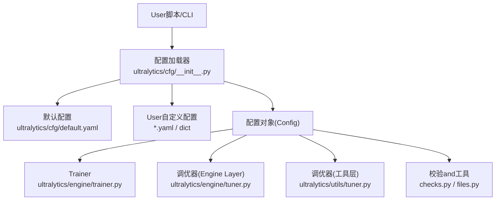
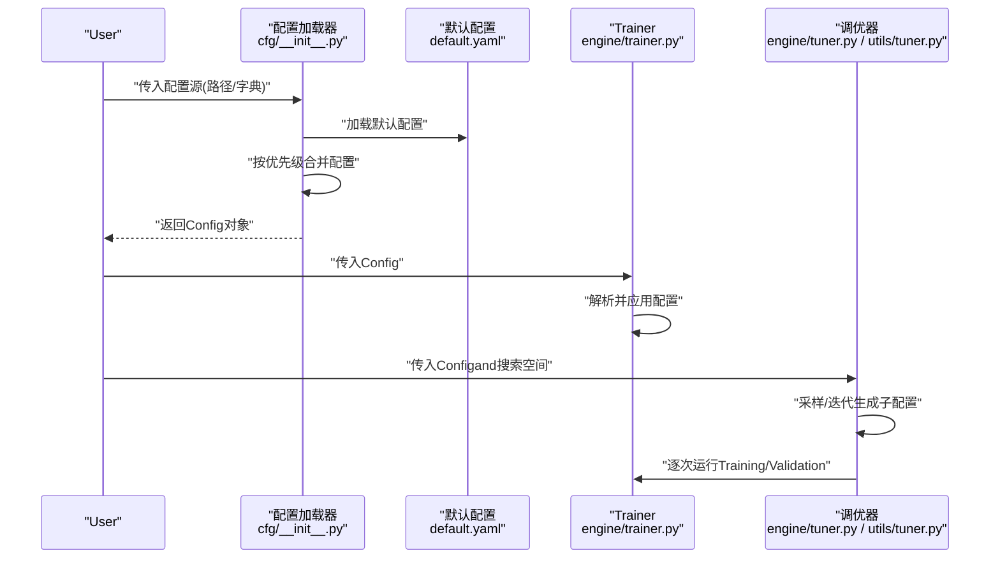
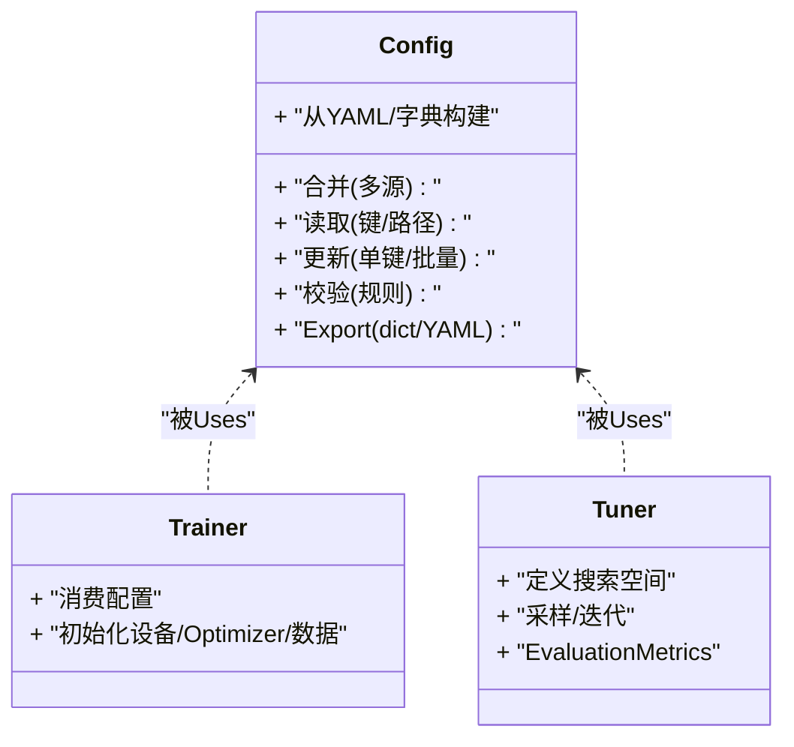
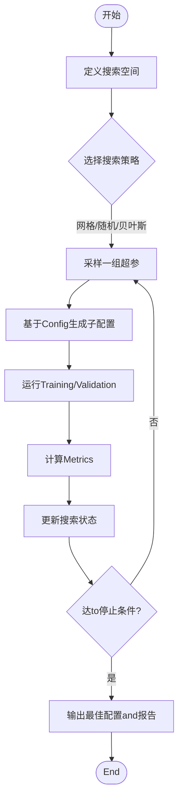
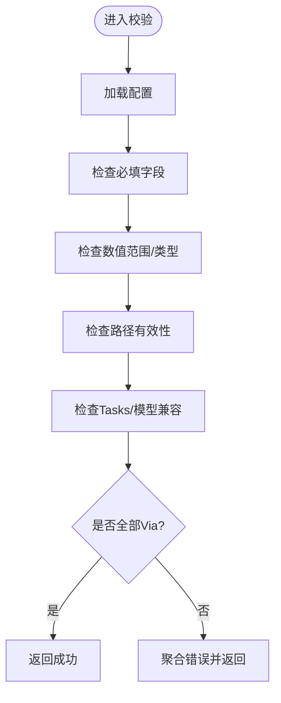
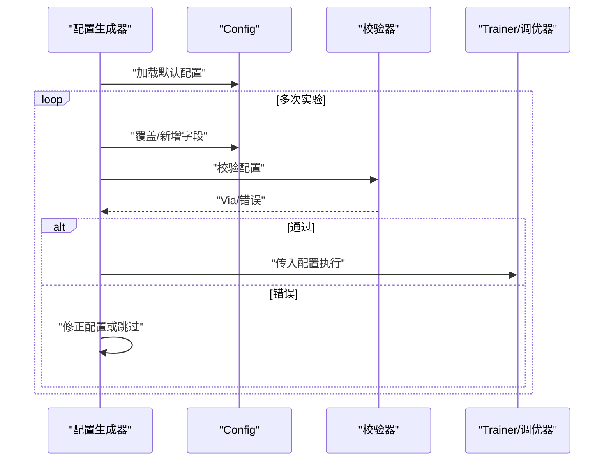
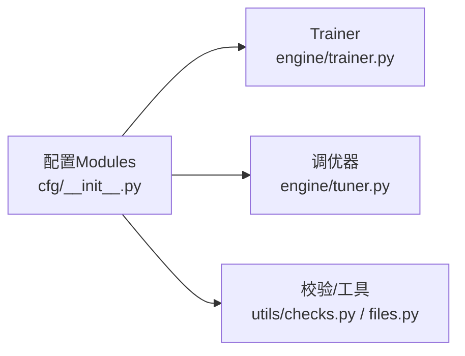

# 配置管理API

<cite>
**Files Referenced in This Document**
- [ultralytics/cfg/__init__.py](file://ultralytics/cfg/__init__.py)
- [ultralytics/cfg/default.yaml](file://ultralytics/cfg/default.yaml)
- [ultralytics/engine/trainer.py](file://ultralytics/engine/trainer.py)
- [ultralytics/engine/tuner.py](file://ultralytics/engine/tuner.py)
- [ultralytics/utils/tuner.py](file://ultralytics/utils/tuner.py)
- [ultralytics/utils/checks.py](file://ultralytics/utils/checks.py)
- [ultralytics/utils/files.py](file://ultralytics/utils/files.py)
- [examples/lora_examples/yolo_master_lora_README.md](file://examples/lora_examples/yolo_master_lora_README.md)
</cite>

## Table of Contents
1. [Introduction](#Introduction)
2. [Project Structure](#Project Structure)
3. [Core Components](#Core Components)
4. [Architecture Overview](#Architecture Overview)
5. [Detailed Component Analysis](#Detailed Component Analysis)
6. [Dependency Analysis](#Dependency Analysis)
7. [性能考量](#性能考量)
8. [Troubleshooting Guide](#Troubleshooting Guide)
9. [Conclusion](#Conclusion)
10. [Appendix](#Appendix)

## Introduction
本文件targetingYOLO-Master的配置管理系统，聚焦Centered on下目标：
- 说明配置文件结构and层次关系（模型、Training、数据etc.）
- 记录Config类的主要操作方法（读取、修改、Validation、保存）
- 解释超参数调优的API接口（搜索策略and参数空间定义）
- 明确默认配置的覆盖机制and优先级规则
- provides配置文件模板and最佳实践
- 给出配置Validationand错误检查的接口说明
- 展示such as何Via编程方式动态生成配置

## Project Structure
配置相关代码主要分布whileCentered on下Modules：
- 配置加载and合并：ultralytics/cfg/__init__.py
- 默认配置：ultralytics/cfg/default.yaml
- Training流程对配置的解析andUses：ultralytics/engine/trainer.py
- 超参搜索andOptimization：ultralytics/engine/tuner.py、ultralytics/utils/tuner.py
- 配置校验and工具：ultralytics/utils/checks.py、ultralytics/utils/files.py
- Examplesand模板Refer to：examples/lora_examples/yolo_master_lora_README.md

Figure Source
- [ultralytics/cfg/__init__.py](file://ultralytics/cfg/__init__.py)
- [ultralytics/cfg/default.yaml](file://ultralytics/cfg/default.yaml)
- [ultralytics/engine/trainer.py](file://ultralytics/engine/trainer.py)
- [ultralytics/engine/tuner.py](file://ultralytics/engine/tuner.py)
- [ultralytics/utils/tuner.py](file://ultralytics/utils/tuner.py)
- [ultralytics/utils/checks.py](file://ultralytics/utils/checks.py)
- [ultralytics/utils/files.py](file://ultralytics/utils/files.py)

Section Source
- [ultralytics/cfg/__init__.py](file://ultralytics/cfg/__init__.py)
- [ultralytics/cfg/default.yaml](file://ultralytics/cfg/default.yaml)
- [ultralytics/engine/trainer.py](file://ultralytics/engine/trainer.py)
- [ultralytics/engine/tuner.py](file://ultralytics/engine/tuner.py)
- [ultralytics/utils/tuner.py](file://ultralytics/utils/tuner.py)
- [ultralytics/utils/checks.py](file://ultralytics/utils/checks.py)
- [ultralytics/utils/files.py](file://ultralytics/utils/files.py)

## Core Components
- Config类（配置对象）
  - 职责：统一表示配置，Supporting从YAML或字典构建、深度合并、访问and修改、校验and持久化。
  - 典型capabilities：
    - 读取：从路径或内存字典加载配置
    - 合并：将多个配置源按优先级合并
    - 访问：Via点号路径或键名获取字段值
    - 修改：就地更新配置项
    - 校验：基于Built-in规则进行完整性and一致性检查
    - 保存：Exporting toYAML或字典
- 默认配置（default.yaml）
  - 作用：provides系统级默认值，作for所有Tasks的基线
- Trainer集成（trainer.py）
  - while初始化时消费配置，用于设备、批大小、Optimizer、Data Loadingetc.关键设置
- 调优器（engine/tuner.py, utils/tuner.py）
  - provides搜索策略and参数空间定义，drivers are installed多组配置执行and结果Evaluation

Section Source
- [ultralytics/cfg/__init__.py](file://ultralytics/cfg/__init__.py)
- [ultralytics/cfg/default.yaml](file://ultralytics/cfg/default.yaml)
- [ultralytics/engine/trainer.py](file://ultralytics/engine/trainer.py)
- [ultralytics/engine/tuner.py](file://ultralytics/engine/tuner.py)
- [ultralytics/utils/tuner.py](file://ultralytics/utils/tuner.py)

## Architecture Overview
下图展示了配置从加载to被Trainingand调优Uses的整体流程。

Figure Source
- [ultralytics/cfg/__init__.py](file://ultralytics/cfg/__init__.py)
- [ultralytics/cfg/default.yaml](file://ultralytics/cfg/default.yaml)
- [ultralytics/engine/trainer.py](file://ultralytics/engine/trainer.py)
- [ultralytics/engine/tuner.py](file://ultralytics/engine/tuner.py)
- [ultralytics/utils/tuner.py](file://ultralytics/utils/tuner.py)

## Detailed Component Analysis

### 配置对象（Config）API
- 构造and读取
  - 从YAML文件或字典创建配置对象
  - Supporting相对路径解析and资源定位
- 合并and覆盖
  - Supporting多源合并，遵循“后覆盖前”的优先级
  - 默认configuration-first于空值，User配置覆盖默认值
- 访问and修改
  - Supporting键名访问and层级访问
  - Supporting就地更新and批量更新
- 校验and诊断
  - provides基础校验入口，可Combining外部校验逻辑
- 序列化
  - Exporting to字典或写入YAML文件

Figure Source
- [ultralytics/cfg/__init__.py](file://ultralytics/cfg/__init__.py)
- [ultralytics/engine/trainer.py](file://ultralytics/engine/trainer.py)
- [ultralytics/engine/tuner.py](file://ultralytics/engine/tuner.py)

Section Source
- [ultralytics/cfg/__init__.py](file://ultralytics/cfg/__init__.py)

### 配置文件结构and层次关系
- 顶层字段
  - Tasks类型、模型选择、输出Table of Contents、LoggingandVisualization开关etc.
- 模型配置
  - 网络结构、Pre-trained Weights、通道数、类别数、头配置etc.
- Training参数
  - Learning Rate、Optimizer、调度器、Batch Size、轮数、早停、Mixture精度etc.
- 数据设置
  - 数据集路径、标签格式、增强策略、分片and并行加载etc.
- Tracking/Export/部署
  - Tracking器选择、Export格式and后端、Inference参数etc.

建议Centered on分层组织配置，便于复用and覆盖。

Section Source
- [ultralytics/cfg/default.yaml](file://ultralytics/cfg/default.yaml)

### 超参数调优API
- 搜索空间定义
  - Supporting连续、离散、分类etc.参数域
  - Supporting条件参数and约束表达
- 搜索策略
  - 网格/随机/贝叶斯/启发式etc.策略Optional
  - Supporting并行and早停
- Evaluationand回传
  - 每轮TrainingEnd后计算Metrics，反馈给搜索器
- 结果汇总
  - 记录每次运行的配置andMetrics，Supporting排序andExport

Figure Source
- [ultralytics/engine/tuner.py](file://ultralytics/engine/tuner.py)
- [ultralytics/utils/tuner.py](file://ultralytics/utils/tuner.py)
- [ultralytics/cfg/__init__.py](file://ultralytics/cfg/__init__.py)

Section Source
- [ultralytics/engine/tuner.py](file://ultralytics/engine/tuner.py)
- [ultralytics/utils/tuner.py](file://ultralytics/utils/tuner.py)

### 默认配置覆盖机制and优先级
- 优先级顺序（由低to高）
  - 系统默认配置（default.yaml）
  - Tasks/模型预设配置
  - User命令行/环境变量注入
  - User本地配置文件
  - 运行时动态更新（程序内Calls更新接口）
- 合并策略
  - 同名字段高优先级覆盖低优先级
  - 嵌套字典按键递归合并
  - 列表通常整体替换而非逐项拼接（具体行forCentered onimplementingfor准）

Section Source
- [ultralytics/cfg/default.yaml](file://ultralytics/cfg/default.yaml)
- [ultralytics/cfg/__init__.py](file://ultralytics/cfg/__init__.py)

### 配置模板and最佳实践
- 模板来源
  - Refer toLoRAExamplesDocumentation中的配置样例and说明
- 最佳实践
  - 将通用部分放入默认配置，业务差异Via覆盖文件注入
  - Uses命名约定区分环境（dev/prod）andTasks（train/val/export）
  - 对敏感信息（路径、密钥）采用环境变量注入
  - 保持配置版本化and可追溯

Section Source
- [examples/lora_examples/yolo_master_lora_README.md](file://examples/lora_examples/yolo_master_lora_README.md)

### 配置Validationand错误检查
- 校验入口
  - provides统一的校验方法，可whileTraining/Export前触发
- 常见检查项
  - 必填字段存while性
  - 数值范围and单位一致性
  - 路径有效性（数据集/权重/输出Table of Contents）
  - Tasksand模型兼容性
- 错误处理
  - 抛出结构化异常，包含字段名、期望类型/范围、上下文Tips
  - Supporting收集多条错误一次性返回

Figure Source
- [ultralytics/utils/checks.py](file://ultralytics/utils/checks.py)
- [ultralytics/utils/files.py](file://ultralytics/utils/files.py)
- [ultralytics/cfg/__init__.py](file://ultralytics/cfg/__init__.py)

Section Source
- [ultralytics/utils/checks.py](file://ultralytics/utils/checks.py)
- [ultralytics/utils/files.py](file://ultralytics/utils/files.py)

### 编程方式动态生成配置
- 思路
  - Centered on默认配置for基底，按需覆盖字段
  - 根据实验设计循环生成不同配置实例
  - 将生成的配置传递给Trainer或调优器
- 步骤
  - 加载默认配置
  - 依据策略更新字段（such asLearning Rate、Batch Size、增强强度）
  - 校验配置
  - 保存或提交至Training/调优流程

Figure Source
- [ultralytics/cfg/__init__.py](file://ultralytics/cfg/__init__.py)
- [ultralytics/utils/checks.py](file://ultralytics/utils/checks.py)
- [ultralytics/engine/trainer.py](file://ultralytics/engine/trainer.py)
- [ultralytics/engine/tuner.py](file://ultralytics/engine/tuner.py)

Section Source
- [ultralytics/cfg/__init__.py](file://ultralytics/cfg/__init__.py)
- [ultralytics/utils/checks.py](file://ultralytics/utils/checks.py)
- [ultralytics/engine/trainer.py](file://ultralytics/engine/trainer.py)
- [ultralytics/engine/tuner.py](file://ultralytics/engine/tuner.py)

## Dependency Analysis
- 耦合关系
  - trainer.py依赖Configprovides的Training期参数
  - tuner.py依赖Config进行配置派生and传递
  - checks.pyandfiles.pyfor配置生命周期provides辅助capabilities
- External Dependencies
  - YAML解析、文件系统访问、Loggingand事件记录

Figure Source
- [ultralytics/cfg/__init__.py](file://ultralytics/cfg/__init__.py)
- [ultralytics/engine/trainer.py](file://ultralytics/engine/trainer.py)
- [ultralytics/engine/tuner.py](file://ultralytics/engine/tuner.py)
- [ultralytics/utils/checks.py](file://ultralytics/utils/checks.py)
- [ultralytics/utils/files.py](file://ultralytics/utils/files.py)

Section Source
- [ultralytics/cfg/__init__.py](file://ultralytics/cfg/__init__.py)
- [ultralytics/engine/trainer.py](file://ultralytics/engine/trainer.py)
- [ultralytics/engine/tuner.py](file://ultralytics/engine/tuner.py)
- [ultralytics/utils/checks.py](file://ultralytics/utils/checks.py)
- [ultralytics/utils/files.py](file://ultralytics/utils/files.py)

## 性能考量
- 配置加载and合并应尽量while进程启动阶段完成，避免热路径重复解析
- 大配置文件的读写Recommended to use流式或懒加载策略
- 调优过程中减少不必要的配置拷贝，尽量原地更新
- 校验逻辑应轻量且可缓存，避免重复检查相同配置

[This section provides general guidance and does not directly analyze specific files]

## Troubleshooting Guide
- 常见问题
  - 字段缺失或类型不符：检查必填项and类型约束
  - 路径无效：确认数据集/权重/输出Table of Contents是否存while且可读
  - Tasksand模型不兼容：核对Tasks类型and模型头配置
  - 覆盖未生效：确认优先级顺序and合并策略
- 定位手段
  - 启用详细Logging，打印最终合并后的配置
  - 逐步缩小覆盖范围，定位冲突字段
  - Uses校验器输出错误清单，逐一修复

Section Source
- [ultralytics/utils/checks.py](file://ultralytics/utils/checks.py)
- [ultralytics/utils/files.py](file://ultralytics/utils/files.py)

## Conclusion
本API围绕Config对象构建了完整的配置生命周期：从默认配置出发，经多源合并and严格校验，稳定地供给Trainingand调优流程。Via清晰的优先级规则and可扩展的校验/调优接口，User能够Centered on声明式and编程式两种方式高效管理复杂实验配置。

[本节for总结，不直接分析具体文件]

## Appendix
- 术语
  - 配置源：YAML文件或字典形式的配置输入
  - 覆盖：高优先级配置替换低优先级同名字段
  - 搜索空间：超参数的取值集合and分布定义
- Refer to
  - LoRAExamplesDocumentation中provides了配置模板and实践要点

Section Source
- [examples/lora_examples/yolo_master_lora_README.md](file://examples/lora_examples/yolo_master_lora_README.md)