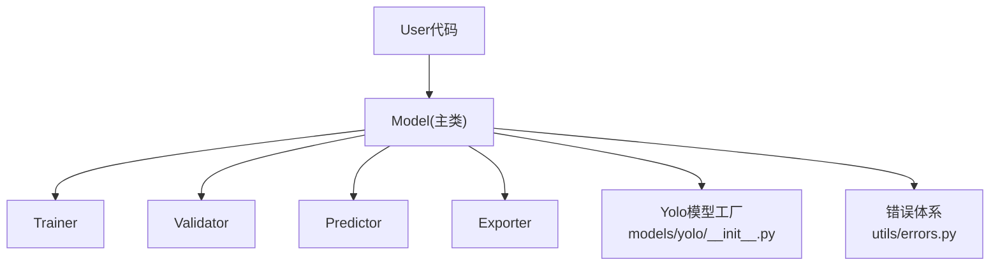
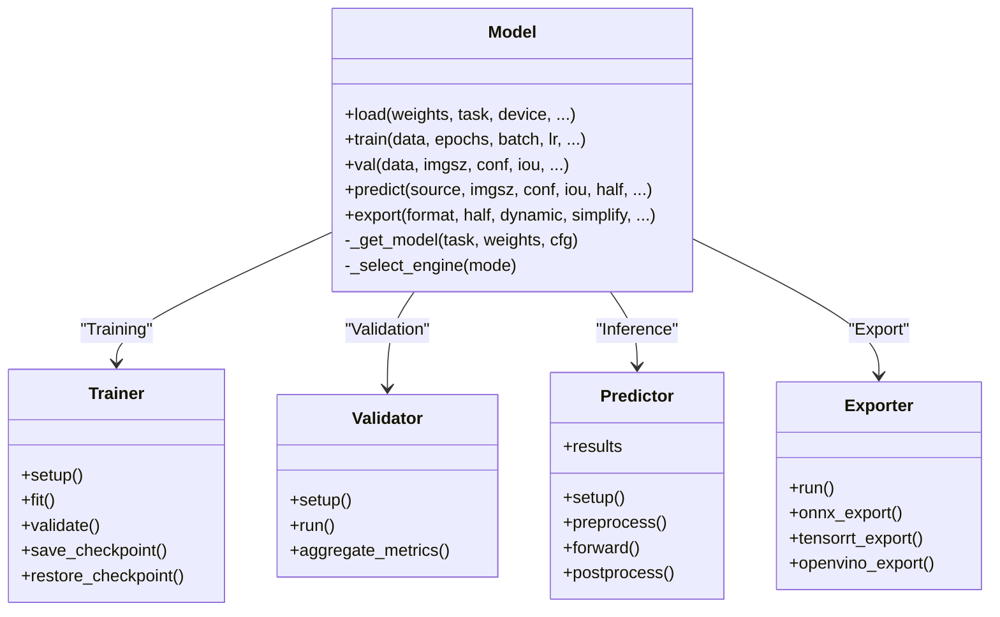
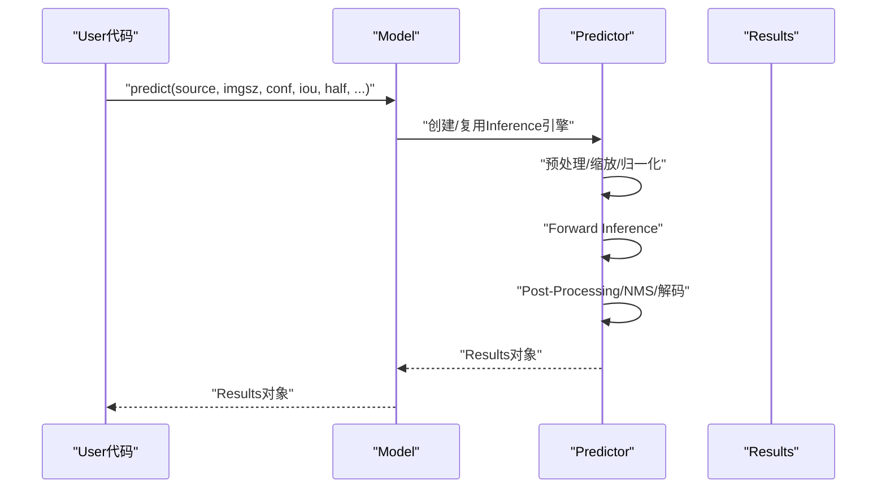
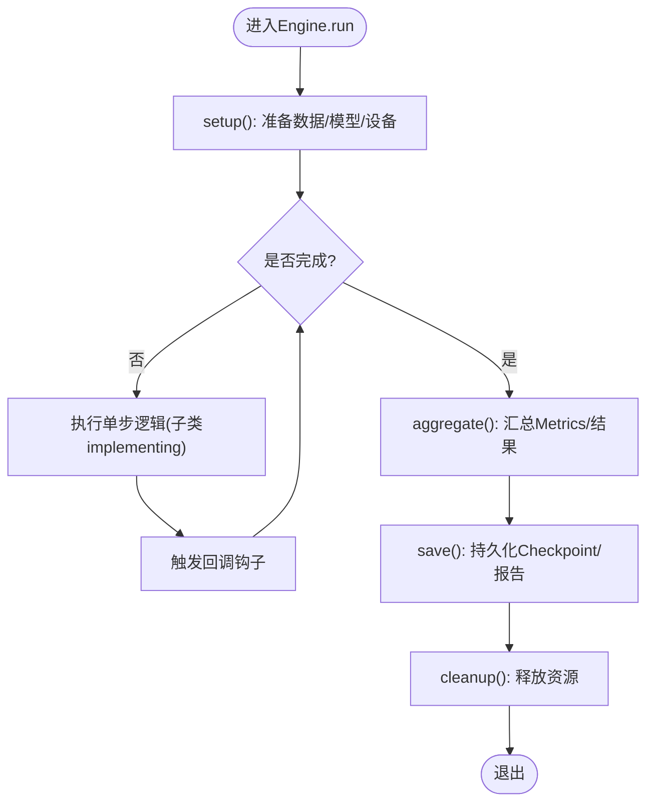
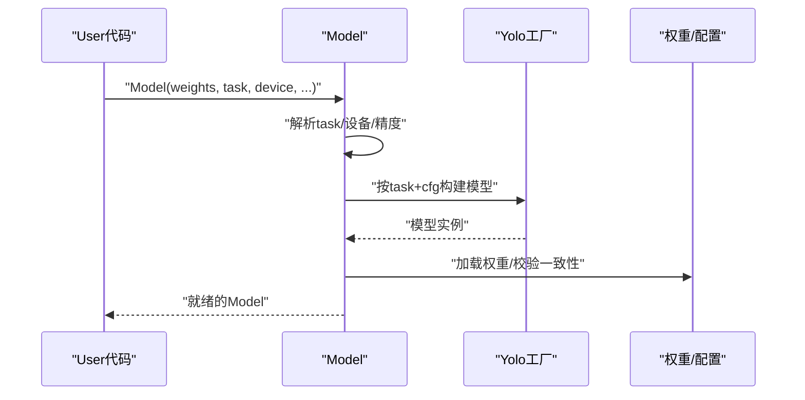
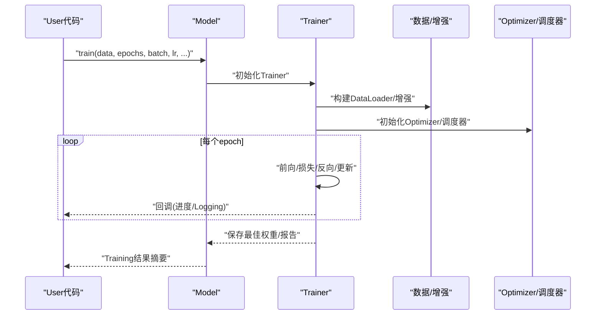
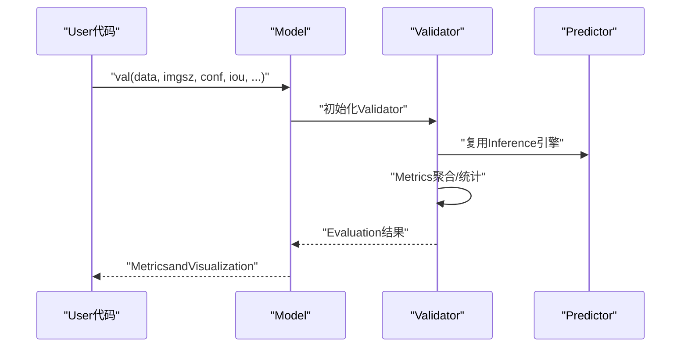
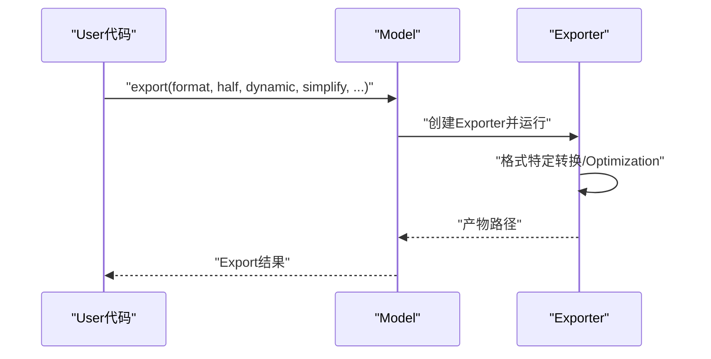
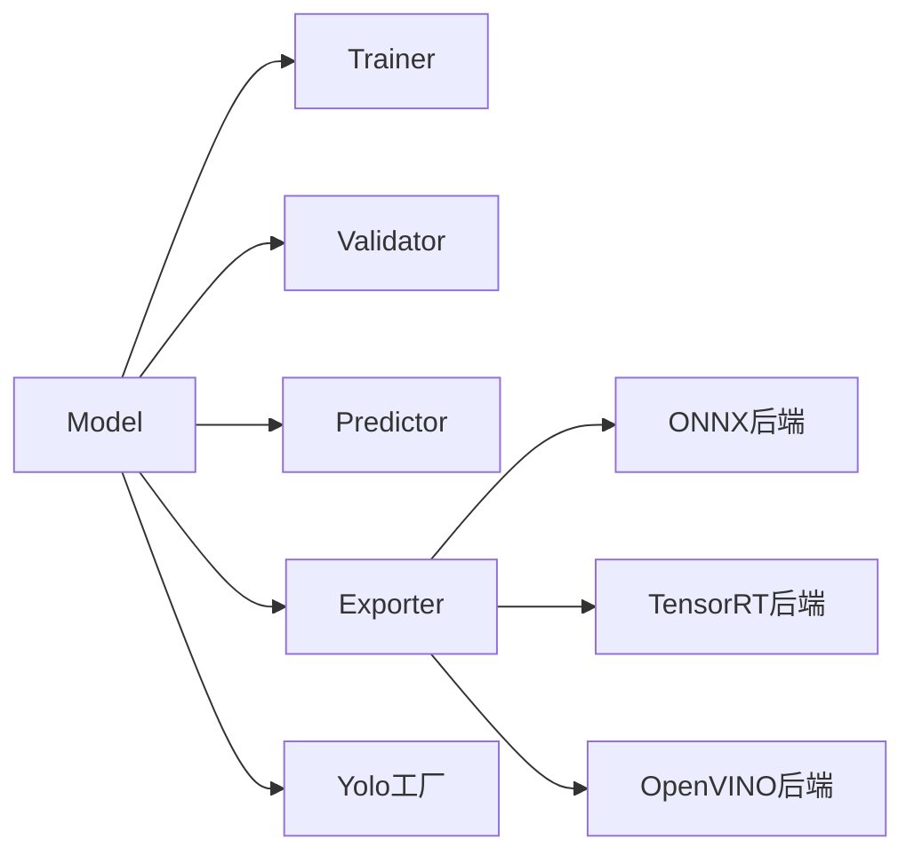

# Core API

<cite>
**Files Referenced in This Document**
- [ultralytics/engine/model.py](file://ultralytics/engine/model.py)
- [ultralytics/engine/trainer.py](file://ultralytics/engine/trainer.py)
- [ultralytics/engine/validator.py](file://ultralytics/engine/validator.py)
- [ultralytics/engine/predictor.py](file://ultralytics/engine/predictor.py)
- [ultralytics/engine/exporter.py](file://ultralytics/engine/exporter.py)
- [ultralytics/models/yolo/__init__.py](file://ultralytics/models/yolo/__init__.py)
- [ultralytics/utils/errors.py](file://ultralytics/utils/errors.py)
- [examples/tutorial.ipynb](file://examples/tutorial.ipynb)
</cite>

## Table of Contents
1. [Introduction](#Introduction)
2. [Project Structure](#Project Structure)
3. [Core Components](#Core Components)
4. [Architecture Overview](#Architecture Overview)
5. [Detailed Component Analysis](#Detailed Component Analysis)
6. [Dependency Analysis](#Dependency Analysis)
7. [Performance Considerations](#Performance Considerations)
8. [Troubleshooting Guide](#Troubleshooting Guide)
9. [Conclusion](#Conclusion)
10. [Appendix](#Appendix)

## Introduction
本文件targetingYOLO-Master的核心Python API，聚焦于Model主类and其andEngine基类的关系，系统梳理模型加载、Training、Validation、InferenceandExportetc.关键接口。Documentation同时给出常见Uses模式、错误处理策略、并发and异步建议Centered onand性能Optimization实践，帮助读者快速上手并高效集成to生产环境。

## Project Structure
围绕Core API的关键代码位于engineandmodels两个子包中：
- engine/model.py：对外暴露的Model主类，Encapsulates加载、Training、Validation、InferenceandExportcapabilities。
- engine/trainer.py：Training流程编排and回调钩子。
- engine/validator.py：Validation流程编排andMetrics计算。
- engine/predictor.py：Inference流程编排and结果Post-Processing。
- engine/exporter.py：多后端Export（ONNX/TensorRT/OpenVINOetc.）Unified entry point。
- models/yolo/__init__.py：Tasks级模型注册and工厂方法，供Model内部按需实例化具体网络。
- utils/errors.py：统一的异常类型定义and错误传播约定。
- examples/tutorial.ipynb：官方Examples，展示典型Calls路径。

Figure Source
- [ultralytics/engine/model.py](file://ultralytics/engine/model.py)
- [ultralytics/engine/trainer.py](file://ultralytics/engine/trainer.py)
- [ultralytics/engine/validator.py](file://ultralytics/engine/validator.py)
- [ultralytics/engine/predictor.py](file://ultralytics/engine/predictor.py)
- [ultralytics/engine/exporter.py](file://ultralytics/engine/exporter.py)
- [ultralytics/models/yolo/__init__.py](file://ultralytics/models/yolo/__init__.py)
- [ultralytics/utils/errors.py](file://ultralytics/utils/errors.py)

Section Source
- [ultralytics/engine/model.py](file://ultralytics/engine/model.py)
- [ultralytics/models/yolo/__init__.py](file://ultralytics/models/yolo/__init__.py)

## Core Components
- Model主类
  - 职责：Unified entry point，负责权重加载、设备管理、Tasks识别、Training/Validation/Inference/Export的调度and参数校验。
  - 关键capabilities：
    - 构造and初始化：Supporting从权重文件或配置名加载；自动推断Tasks类型；Selecting Deviceand精度。
    - Training：train()，对接Trainer，Supporting超参覆盖、Logging、Checkpoint保存and恢复。
    - Validation：val()，对接Validator，输出常用检测/分割/姿态etc.Metrics。
    - Inference：predict()，对接Predictor，返回带Visualizationand结构化信息的Results对象。
    - Export：export()，对接Exporter，生成目标格式模型文件。
- Engine基类（Trainer/Validator/Predictor/Exporter）
  - 设计模式：模板方法and策略组合。各子类implementing特定流程步骤，共享通用生命周期（准备数据、构建模型、执行循环、记录Metrics、清理资源）。
  - 扩展机制：Via回调钩子、配置字典and插件式后端（such as不同Exporter）进行行for定制。

Section Source
- [ultralytics/engine/model.py](file://ultralytics/engine/model.py)
- [ultralytics/engine/trainer.py](file://ultralytics/engine/trainer.py)
- [ultralytics/engine/validator.py](file://ultralytics/engine/validator.py)
- [ultralytics/engine/predictor.py](file://ultralytics/engine/predictor.py)
- [ultralytics/engine/exporter.py](file://ultralytics/engine/exporter.py)

## Architecture Overview
下图展示了Modeland各Engine子类的交互关系and数据流向。

Figure Source
- [ultralytics/engine/model.py](file://ultralytics/engine/model.py)
- [ultralytics/engine/trainer.py](file://ultralytics/engine/trainer.py)
- [ultralytics/engine/validator.py](file://ultralytics/engine/validator.py)
- [ultralytics/engine/predictor.py](file://ultralytics/engine/predictor.py)
- [ultralytics/engine/exporter.py](file://ultralytics/engine/exporter.py)

## Detailed Component Analysis

### Model主类接口
- 构造函数and初始化
  - 输入：权重路径或预Training名称、Tasks类型、设备、精度、缓存策略etc.。
  - 行for：解析Tasks、加载权重、构建模型图、分配设备、预热引擎。
  - 属性：device、task、model、cfg、weights、half、dynamicetc.。
- Training接口 train()
  - 主要参数：数据集配置、轮数、Batch Size、Learning Rate、Optimizer、增强、Mixture精度、分布式设置、回调etc.。
  - 返回值：Training历史摘要（损失、Metrics、最佳权重路径etc.）。
- Validation接口 val()
  - 主要参数：数据集、图像尺寸、Confidence Threshold、IoU阈值、半精度、Visualization开关etc.。
  - 返回值：EvaluationMetrics汇总（mAP、precision、recalletc.）andOptionalVisualization结果。
- Inference接口 predict()
  - 主要参数：输入源（图片/视频/流）、图像尺寸、NMS相关阈值、半精度、动态形状、批大小、Tracking器etc.。
  - 返回值：Results对象集合，包含边界框、类别、掩码、关键点、轨迹etc.结构化信息。
- Export接口 export()
  - 主要参数：目标格式（ONNX/TensorRT/OpenVINOetc.）、半精度、动态轴、简化、算子兼容、I/O绑定etc.。
  - 返回值：Export产物路径列表and元信息。

Figure Source
- [ultralytics/engine/model.py](file://ultralytics/engine/model.py)
- [ultralytics/engine/predictor.py](file://ultralytics/engine/predictor.py)

Section Source
- [ultralytics/engine/model.py](file://ultralytics/engine/model.py)
- [ultralytics/engine/predictor.py](file://ultralytics/engine/predictor.py)

### Engine基类设计and扩展机制
- 模板方法模式
  - 公共流程：setup → run/fit → aggregate/save → cleanup。
  - 子类差异：Training的损失计算andOptimizer更新、Validation的Metrics聚合、Inference的前Post-Processing、Export的后端适配。
- 回调and钩子
  - while关键阶段触发回调（开始/End、每步、每轮、保存/恢复），便于自定义Logging、监控and断点续训。
- 配置drivers are installed
  - Via配置字典注入超参and行for开关，避免硬编码分支。
- 后端可插拔
  - Exporter按目标格式拆分implementing，Model仅持有Unified Interface。

Figure Source
- [ultralytics/engine/trainer.py](file://ultralytics/engine/trainer.py)
- [ultralytics/engine/validator.py](file://ultralytics/engine/validator.py)
- [ultralytics/engine/predictor.py](file://ultralytics/engine/predictor.py)
- [ultralytics/engine/exporter.py](file://ultralytics/engine/exporter.py)

Section Source
- [ultralytics/engine/trainer.py](file://ultralytics/engine/trainer.py)
- [ultralytics/engine/validator.py](file://ultralytics/engine/validator.py)
- [ultralytics/engine/predictor.py](file://ultralytics/engine/predictor.py)
- [ultralytics/engine/exporter.py](file://ultralytics/engine/exporter.py)

### 模型加载andTasks识别
- Tasks识别
  - 根据权重后缀或显式task参数确定Tasks（检测/分割/姿态/分类/回归etc.）。
- 模型构建
  - Viamodels/yolo工厂方法按Tasksand配置构建网络，Supporting权重回退and兼容性处理。
- 设备and精度
  - 自动选择GPU/CPU/MPS，Supporting半精度and动态形状。

Figure Source
- [ultralytics/engine/model.py](file://ultralytics/engine/model.py)
- [ultralytics/models/yolo/__init__.py](file://ultralytics/models/yolo/__init__.py)

Section Source
- [ultralytics/engine/model.py](file://ultralytics/engine/model.py)
- [ultralytics/models/yolo/__init__.py](file://ultralytics/models/yolo/__init__.py)

### Training流程and回调
- 关键步骤
  - 数据构建and增强、Optimizerand调度器初始化、Mixture精度、分布式同步、Checkpoint保存and恢复。
- 回调点
  - 每步/每轮/End/保存/恢复etc.，便于接入TensorBoard、Weights&Biases、MLflowetc.。
- 返回值
  - Training历史、最佳权重路径、Metrics曲线etc.。

Figure Source
- [ultralytics/engine/model.py](file://ultralytics/engine/model.py)
- [ultralytics/engine/trainer.py](file://ultralytics/engine/trainer.py)

Section Source
- [ultralytics/engine/model.py](file://ultralytics/engine/model.py)
- [ultralytics/engine/trainer.py](file://ultralytics/engine/trainer.py)

### Validation流程andMetrics
- 关键步骤
  - 构建Validation集、Batch Inference、解码andNMS、Metrics聚合（mAP、PR曲线etc.）。
- 返回值
  - Metrics字典、Visualization结果（Optional）。

Figure Source
- [ultralytics/engine/model.py](file://ultralytics/engine/model.py)
- [ultralytics/engine/validator.py](file://ultralytics/engine/validator.py)
- [ultralytics/engine/predictor.py](file://ultralytics/engine/predictor.py)

Section Source
- [ultralytics/engine/model.py](file://ultralytics/engine/model.py)
- [ultralytics/engine/validator.py](file://ultralytics/engine/validator.py)

### Export流程and后端
- 关键步骤
  - 选择目标格式、构建Exporter、转换图结构、OptimizationandValidationExport产物。
- 返回值
  - Export文件路径and元信息。

Figure Source
- [ultralytics/engine/model.py](file://ultralytics/engine/model.py)
- [ultralytics/engine/exporter.py](file://ultralytics/engine/exporter.py)

Section Source
- [ultralytics/engine/model.py](file://ultralytics/engine/model.py)
- [ultralytics/engine/exporter.py](file://ultralytics/engine/exporter.py)

### 常见Uses模式andExamples
- 快速Inference
  - 加载Pre-trained Weights，对图片或视频进行Inference，获取Results并进行Visualization。
- 微调Training
  - 指定数据集and超参，启动Training，观察Metrics并保存最佳权重。
- Export部署
  - 将PyTorchModel ExportforONNX/TensorRT/OpenVINOetc.，用于服务端或边缘端部署。
- Refer toExamples
  - 参见notebookExamplesCentered on了解端to端Calls方式and参数组织。

Section Source
- [examples/tutorial.ipynb](file://examples/tutorial.ipynb)

## Dependency Analysis
- Modules耦合
  - Model作for门面，低耦合地依赖Trainer/Validator/Predictor/Exporter。
  - Yolo工厂解耦Tasksand网络implementing，便于新增Tasks。
- External Dependencies
  - Exporter依赖对应运行时（ONNXRuntime、TensorRT、OpenVINOetc.）。
  - Distributed Training依赖torch.distributed。
- Potential Cycles依赖
  - 当前分层清晰，未见直接循环导入；建议while新增Modules时保持单向依赖。

Figure Source
- [ultralytics/engine/model.py](file://ultralytics/engine/model.py)
- [ultralytics/engine/exporter.py](file://ultralytics/engine/exporter.py)
- [ultralytics/models/yolo/__init__.py](file://ultralytics/models/yolo/__init__.py)

Section Source
- [ultralytics/engine/model.py](file://ultralytics/engine/model.py)
- [ultralytics/engine/exporter.py](file://ultralytics/engine/exporter.py)
- [ultralytics/models/yolo/__init__.py](file://ultralytics/models/yolo/__init__.py)

## Performance Considerations
- 设备and精度
  - PreferGPU；开启半精度（FP16/BF16）Centered on降低显存and提升吞吐。
- 批大小and图像尺寸
  - 合理增大batchandimgszCentered on提升吞吐，注意显存上限and延迟要求。
- 动态形状
  - Export时启用动态轴Centered on适应多变输入，但可能牺牲部分Optimization收益。
- NMSandPost-Processing
  - 调整confandiou阈值平衡召回and速度；必要时Uses后端加速NMS。
- 缓存and预热
  - 复用Model实例andPredictor，减少重复初始化；首次Inference前进行预热。
- Distributed Training
  - UsesDDP或多进程Data Loading，CombiningGradient累积andMixture精度。

[This section provides general guidance and does not directly analyze specific files]

## Troubleshooting Guide
- 常见异常类型
  - 权重/配置不一致、设备不可用、Export Backends缺失、数据路径错误etc.。
- 定位建议
  - 查看异常堆栈and错误消息；确认路径and权限；检查后端库安装。
- 重试and降级
  - 对网络下载失败进行重试；while缺少某后端is available, fall back to其他格式。
- Refer to位置
  - 统一错误类型定义and传播约定位于错误Modules。

Section Source
- [ultralytics/utils/errors.py](file://ultralytics/utils/errors.py)

## Conclusion
Model主类provides了统一、可扩展的YOLO-MasterCore API，Combined withEngine基类的模板方法and回调机制，implementing了Training、Validation、InferenceandExport的一体化体验。遵循本文的性能and并发建议，可while多种硬件and部署场景下获得稳定高效的性能表现。

## Appendix
- 术语
  - Results：Inference输出的结构化对象，包含检测结果、掩码、关键点、轨迹etc.。
  - Tasks：检测、分割、姿态、分类、回归etc.。
- Refer toExamples
  - notebookExamplesprovides端to端Calls范式and参数组织方式。

Section Source
- [examples/tutorial.ipynb](file://examples/tutorial.ipynb)