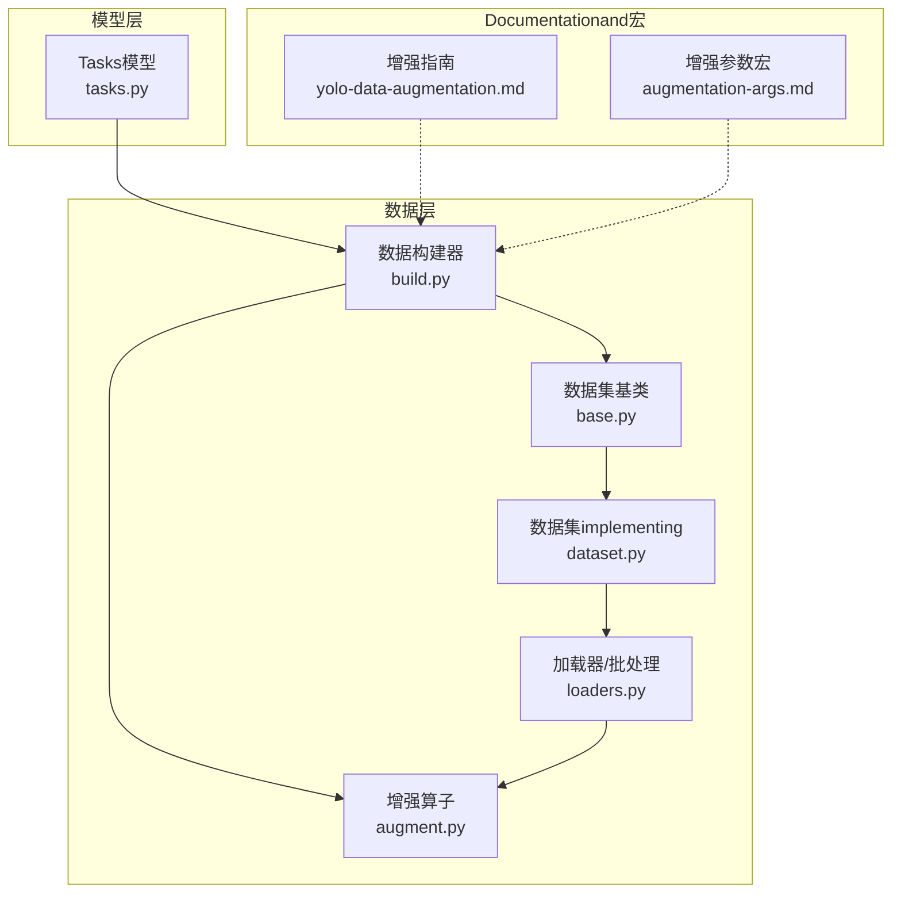
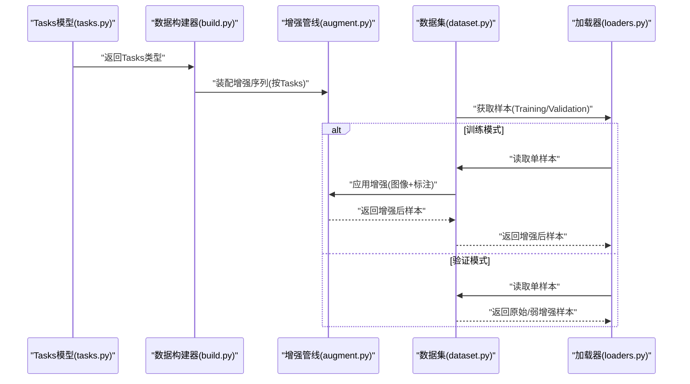
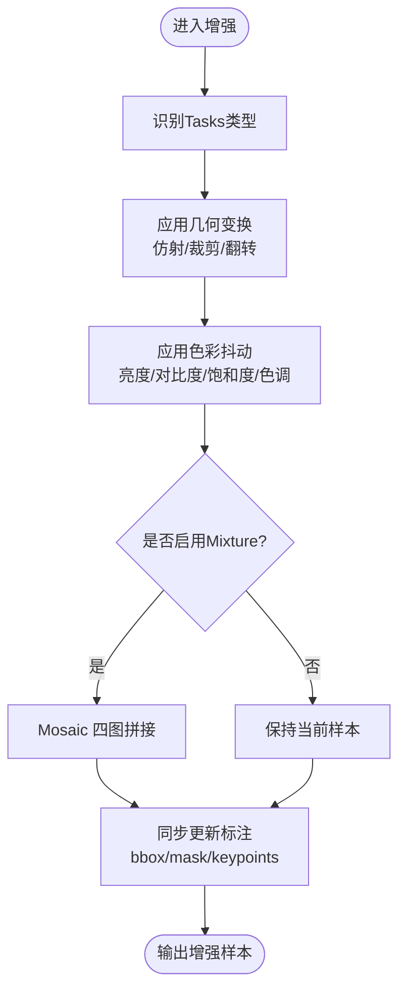
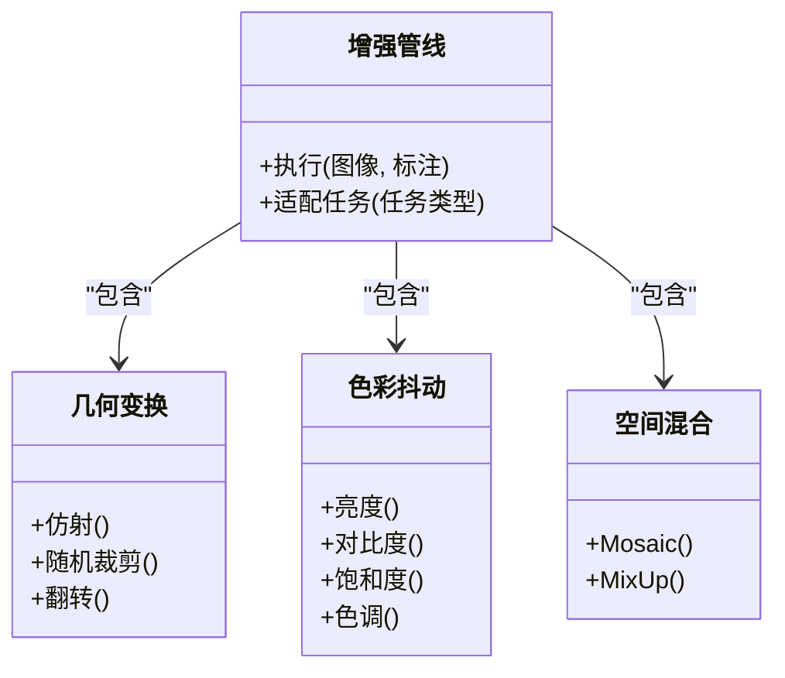
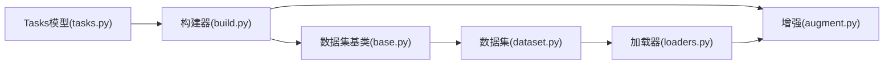

# Data Augmentation

<cite>
**Files Referenced in This Document**
- [ultralytics/data/augment.py](file://ultralytics/data/augment.py)
- [ultralytics/data/base.py](file://ultralytics/data/base.py)
- [ultralytics/data/build.py](file://ultralytics/data/build.py)
- [ultralytics/data/dataset.py](file://ultralytics/data/dataset.py)
- [ultralytics/data/loaders.py](file://ultralytics/data/loaders.py)
- [ultralytics/data/utils.py](file://ultralytics/data/utils.py)
- [ultralytics/nn/tasks.py](file://ultralytics/nn/tasks.py)
- [docs/en/guides/yolo-data-augmentation.md](file://docs/en/guides/yolo-data-augmentation.md)
- [docs/macros/augmentation-args.md](file://docs/macros/augmentation-args.md)
</cite>

## Table of Contents
1. [Introduction](#Introduction)
2. [Project Structure](#Project Structure)
3. [Core Components](#Core Components)
4. [Architecture Overview](#Architecture Overview)
5. [Detailed Component Analysis](#Detailed Component Analysis)
6. [Dependency Analysis](#Dependency Analysis)
7. [性能考量](#性能考量)
8. [Troubleshooting Guide](#Troubleshooting Guide)
9. [Conclusion](#Conclusion)
10. [Appendix](#Appendix)

## Introduction
本文件targetingYOLO-Master的Data AugmentationAPI，系统性梳理图像增强的implementingandUses方式，覆盖Mosaic、MixUp、随机裁剪、颜色抖动、几何变换etc.常用策略；说明参数配置and组合方法；解释针对检测、分割、Pose Estimationand other tasks的专用增强技术；provides自定义增强算法的开发接口and集成路径；并给出VisualizationValidation工具and性能Evaluation方法，Centered onand基于数据集特点的增强策略选择and参数调优建议。

## Project Structure
Data Augmentation相关代码主要位于Data Loadingand预处理Modules中，围绕“Tasks感知”的增强流水线组织：
- 增强算子定义and组合：while增强Modules中集中implementing各类变换（such asMosaic、MixUp、仿射、色彩、随机裁剪etc.），并provides统一的Calls接口。
- 构建and装配：数据构建器根据Tasks类型装配增强管线，将基础变换andTasks特定增强串联。
- 数据集and加载器：数据集类负责读取样本and标注，并whileTraining阶段按批次触发增强；加载器负责批处理、多进程and缓存。
- Tasks模型：Tasks模型providesTasks类型信息，用于drivers are installedTasks特定的增强分支。

Figure Source
- [ultralytics/data/augment.py](file://ultralytics/data/augment.py)
- [ultralytics/data/build.py](file://ultralytics/data/build.py)
- [ultralytics/data/base.py](file://ultralytics/data/base.py)
- [ultralytics/data/dataset.py](file://ultralytics/data/dataset.py)
- [ultralytics/data/loaders.py](file://ultralytics/data/loaders.py)
- [ultralytics/nn/tasks.py](file://ultralytics/nn/tasks.py)
- [docs/en/guides/yolo-data-augmentation.md](file://docs/en/guides/yolo-data-augmentation.md)
- [docs/macros/augmentation-args.md](file://docs/macros/augmentation-args.md)

Section Source
- [ultralytics/data/augment.py](file://ultralytics/data/augment.py)
- [ultralytics/data/build.py](file://ultralytics/data/build.py)
- [ultralytics/data/base.py](file://ultralytics/data/base.py)
- [ultralytics/data/dataset.py](file://ultralytics/data/dataset.py)
- [ultralytics/data/loaders.py](file://ultralytics/data/loaders.py)
- [ultralytics/nn/tasks.py](file://ultralytics/nn/tasks.py)
- [docs/en/guides/yolo-data-augmentation.md](file://docs/en/guides/yolo-data-augmentation.md)
- [docs/macros/augmentation-args.md](file://docs/macros/augmentation-args.md)

## Core Components
- 增强算子库：Encapsulates常见图像and标注同步变换，包括几何（仿射、旋转、缩放、翻转）、色彩（亮度、对比度、饱和度、色调）、空间（随机裁剪、马赛克、Mixture）etc.。
- Tasks感知装配：依据Tasks类型（检测、分割、Pose Estimationetc.）动态装配增强序列，确保对边界框、掩码、关键点etc.标注的一致性变换。
- 数据构建器：负责解析配置、实例化增强管线、绑定to数据集and加载器，SupportingTraining/Validation模式切换。
- 数据集and加载器：whileTraining阶段按需启用增强，保证批内并行and多进程安全；Validation阶段禁用或弱化增强Centered on保证评测一致性。

Section Source
- [ultralytics/data/augment.py](file://ultralytics/data/augment.py)
- [ultralytics/data/build.py](file://ultralytics/data/build.py)
- [ultralytics/data/base.py](file://ultralytics/data/base.py)
- [ultralytics/data/dataset.py](file://ultralytics/data/dataset.py)
- [ultralytics/data/loaders.py](file://ultralytics/data/loaders.py)

## Architecture Overview
下图展示从Tasks模型toData Augmentation的端to端流程：Tasks模型providesTasks类型，构建器据此装配增强管线，数据集whileTraining时Calls增强，加载器完成批处理and并发。

Figure Source
- [ultralytics/nn/tasks.py](file://ultralytics/nn/tasks.py)
- [ultralytics/data/build.py](file://ultralytics/data/build.py)
- [ultralytics/data/augment.py](file://ultralytics/data/augment.py)
- [ultralytics/data/dataset.py](file://ultralytics/data/dataset.py)
- [ultralytics/data/loaders.py](file://ultralytics/data/loaders.py)

## Detailed Component Analysis

### 通用增强算子
- 几何变换：仿射（平移、缩放、旋转、剪切）、随机裁剪、随机翻转。这些变换需同步更新边界框、掩码and关键点坐标。
- 色彩抖动：亮度、对比度、饱和度、色调扰动，提升模型对光照and色偏的鲁棒性。
- 空间Mixture：Mosaic（四图拼接）、MixUp（线性插值Mixture），用于丰富场景多样性and类别分布。

Figure Source
- [ultralytics/data/augment.py](file://ultralytics/data/augment.py)
- [ultralytics/data/build.py](file://ultralytics/data/build.py)

Section Source
- [ultralytics/data/augment.py](file://ultralytics/data/augment.py)

### Tasks特定增强
- 检测Tasks：重点while于边界框的完整性and合理性。Mosaic常用于小目标增强；仿射and随机裁剪需避免过度裁剪导致目标丢失。
- 分割Tasks：掩码需and图像同步变换，注意插值方式（最近邻）Centered on保持标签离散性；MosaicandMixUp同样适用但需严格对齐掩码。
- Pose Estimation：关键点坐标随几何变换一致更新；旋转and缩放时需考虑人体关节拓扑约束，避免产生不合理姿态。

Figure Source
- [ultralytics/data/augment.py](file://ultralytics/data/augment.py)
- [ultralytics/data/build.py](file://ultralytics/data/build.py)

Section Source
- [ultralytics/data/augment.py](file://ultralytics/data/augment.py)
- [ultralytics/data/build.py](file://ultralytics/data/build.py)

### 参数配置and组合
- 参数来源：增强参数可Via配置文件或宏定义进行集中管理，便于while不同Tasksand数据集间复用。
- 组合策略：通常先进行几何变换，再进行色彩抖动，最后视情况启用空间Mixture；不同Tasks可调整概率and强度Centered on平衡多样性和标注一致性。
- 推荐实践：
  - 检测：适度提高Mosaic概率，控制裁剪比例Centered on避免小目标被裁掉。
  - 分割：保持掩码插值for最近邻，降低过强色彩抖动对精细边界的干扰。
  - Pose Estimation：限制大角度旋转and大幅缩放，确保关键点合理性and可见性。

Section Source
- [docs/macros/augmentation-args.md](file://docs/macros/augmentation-args.md)
- [docs/en/guides/yolo-data-augmentation.md](file://docs/en/guides/yolo-data-augmentation.md)

### 自定义增强开发接口and集成
- 扩展点：while增强管线中注册新的变换算子，并确保其对图像and标注（bbox/mask/keypoints）的同步更新逻辑正确。
- 集成步骤：
  1) while增强Modules中implementing新算子，遵循统一输入输出契约。
  2) while构建器中将该算子加入Tasks特定的增强序列。
  3) Via配置开关控制启用and否and参数范围。
- 注意事项：
  - 保持数值稳定性and数据类型一致性。
  - while多进程环境下确保随机种子and状态隔离。
  - 对标注的变换需满足几何一致性（例such as仿射矩阵应用于所有标注）。

Section Source
- [ultralytics/data/augment.py](file://ultralytics/data/augment.py)
- [ultralytics/data/build.py](file://ultralytics/data/build.py)

### VisualizationValidation工具
- 快速Validation：whileTraining脚本或独立脚本中抽取少量样本，依次应用各增强并保存结果图，人工检查标注一致性。
- 批量统计：记录增强前后关键Metrics（such as目标数量、平均尺寸、关键点可见率），辅助定位异常增强。
- 建议流程：
  - 固定随机种子，复现实验结果。
  - 分别对检测、分割、姿态样本进行Validation。
  - CombiningVisualization叠加显示（such as绘制bbox、mask、关键点）确认变换正确性。

Section Source
- [docs/en/guides/yolo-data-augmentation.md](file://docs/en/guides/yolo-data-augmentation.md)

### 性能Evaluation方法
- Training效率：监控每步耗时、GPU利用率and内存峰值，Evaluation增强对吞吐的影响。
- 泛化效果：whileValidation集上对比开启/关闭特定增强的Metrics变化（such asmAP、mIoU、PCK），量化收益。
- 消融实验：逐项替换或关闭增强，观察对收敛速度and最终性能的贡献。

Section Source
- [docs/en/guides/yolo-data-augmentation.md](file://docs/en/guides/yolo-data-augmentation.md)

## Dependency Analysis
- 组件耦合：
  - 构建器依赖Tasks模型的Tasks类型，决定增强序列。
  - 数据集and加载器whileTraining阶段Calls增强管线，Validation阶段可能禁用或弱化增强。
  - 增强管线内部Modules相互独立，ViaUnified Interface组合。
- External Dependencies：
  - 图像处理and数值计算库（such asNumPy、OpenCV、TorchVisionetc.）for底层implementingprovidesSupporting。
  - 多进程and线程池用于加速Data Loadingand增强。

Figure Source
- [ultralytics/nn/tasks.py](file://ultralytics/nn/tasks.py)
- [ultralytics/data/build.py](file://ultralytics/data/build.py)
- [ultralytics/data/augment.py](file://ultralytics/data/augment.py)
- [ultralytics/data/base.py](file://ultralytics/data/base.py)
- [ultralytics/data/dataset.py](file://ultralytics/data/dataset.py)
- [ultralytics/data/loaders.py](file://ultralytics/data/loaders.py)

Section Source
- [ultralytics/nn/tasks.py](file://ultralytics/nn/tasks.py)
- [ultralytics/data/build.py](file://ultralytics/data/build.py)
- [ultralytics/data/augment.py](file://ultralytics/data/augment.py)
- [ultralytics/data/base.py](file://ultralytics/data/base.py)
- [ultralytics/data/dataset.py](file://ultralytics/data/dataset.py)
- [ultralytics/data/loaders.py](file://ultralytics/data/loaders.py)

## 性能考量
- 计算开销：MosaicandMixUp会引入额外CPU/GPU负载，建议whileData Loading阶段并行执行，避免阻塞Training主循环。
- I/Obottlenecks：多进程加载and缓存可减少磁盘I/O压力，Combined with合理的batch sizeandworkers数。
- 精度权衡：过强的增强可能导致标注噪声增加，需Via消融实验找to最佳平衡点。
- 设备差异：whileCPUandGPU环境下的性能表现不同，应分别调参Centered on获得稳定吞吐。

[This section provides general guidance and does not directly analyze specific files]

## Troubleshooting Guide
- 标注不一致：检查几何变换对bbox/mask/keypoints的同步更新逻辑，确保仿射矩阵应用正确。
- 目标丢失：调整裁剪比例andMosaic拼接策略，避免小目标被裁切或遮挡。
- 掩码失真：确认掩码插值方式for最近邻，避免双线性插值破坏标签离散性。
- 关键点异常：限制旋转and缩放幅度，检查关键点可见性过滤逻辑。
- 性能退化：减少增强强度或关闭部分增强，观察吞吐andMetrics变化，定位bottlenecks。

Section Source
- [ultralytics/data/augment.py](file://ultralytics/data/augment.py)
- [ultralytics/data/build.py](file://ultralytics/data/build.py)

## Conclusion
YOLO-Master的Data Augmentation体系Centered onTasks感知for核心，ViaModules化增强算子and灵活装配机制，implementing对检测、分割、Pose Estimationetc.多Tasks的统一Supporting。合理配置and组合增强参数，CombiningVisualizationValidationand性能Evaluation，可while保证标注一致性的前提下显著提升模型泛化capabilities。对于自定义增强，遵循Unified Interfaceand同步更新原则即可无缝集成。

[This section is summary content and does not directly analyze specific files]

## Appendix
- Refer toDocumentation：
  - 增强指南：[docs/en/guides/yolo-data-augmentation.md](file://docs/en/guides/yolo-data-augmentation.md)
  - 增强参数宏：[docs/macros/augmentation-args.md](file://docs/macros/augmentation-args.md)
- 核心implementing：
  - 增强算子and管线：[ultralytics/data/augment.py](file://ultralytics/data/augment.py)
  - 数据构建器：[ultralytics/data/build.py](file://ultralytics/data/build.py)
  - 数据集and加载器：[ultralytics/data/base.py](file://ultralytics/data/base.py), [ultralytics/data/dataset.py](file://ultralytics/data/dataset.py), [ultralytics/data/loaders.py](file://ultralytics/data/loaders.py)
  - Tasks模型：[ultralytics/nn/tasks.py](file://ultralytics/nn/tasks.py)