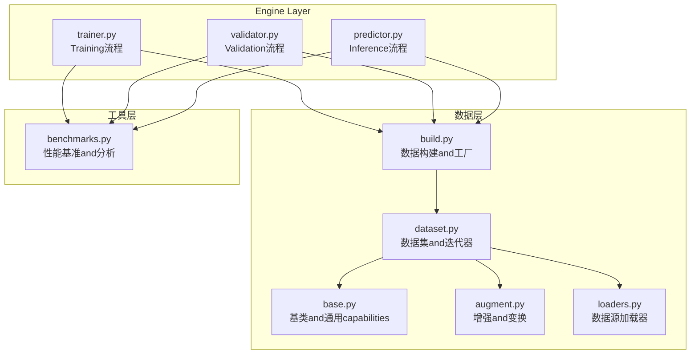
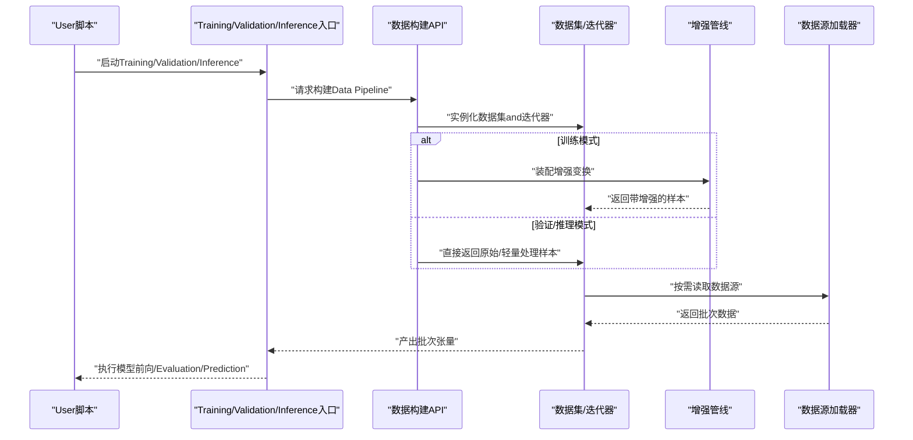
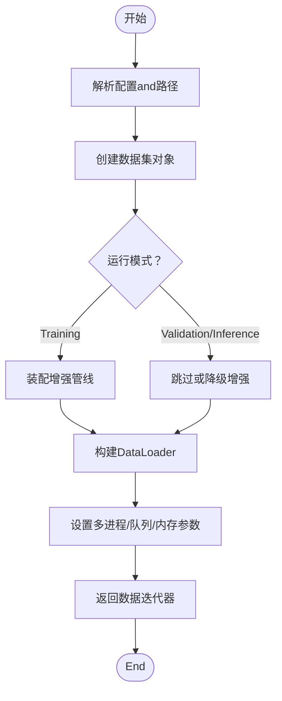
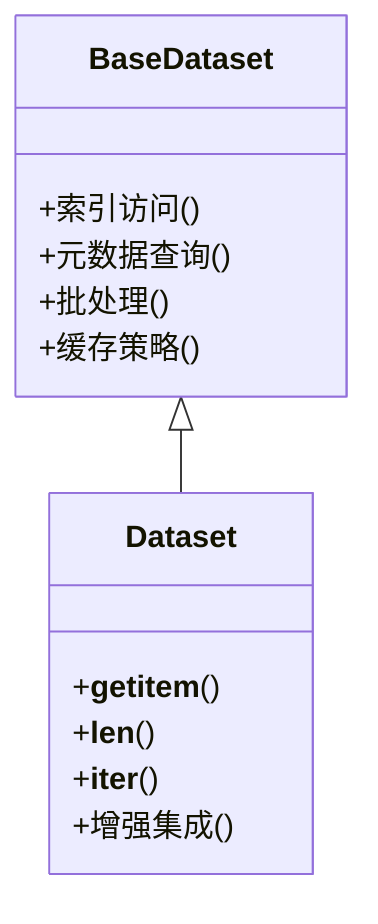
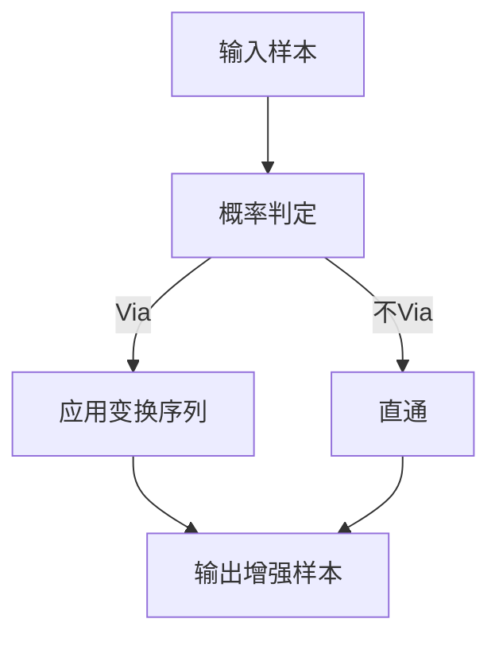
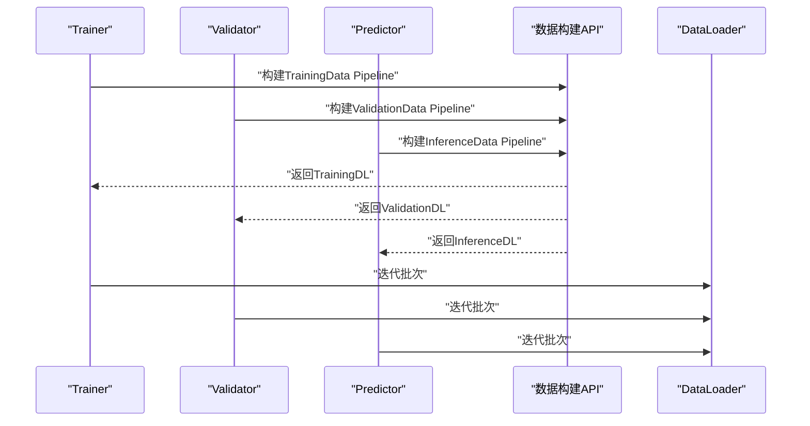
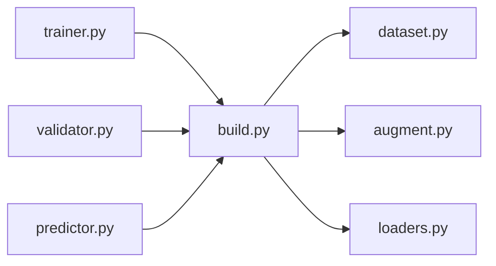

# Data Pipeline构建

<cite>
**Files Referenced in This Document**
- [ultralytics/data/build.py](file://ultralytics/data/build.py)
- [ultralytics/data/dataset.py](file://ultralytics/data/dataset.py)
- [ultralytics/data/base.py](file://ultralytics/data/base.py)
- [ultralytics/data/augment.py](file://ultralytics/data/augment.py)
- [ultralytics/data/loaders.py](file://ultralytics/data/loaders.py)
- [ultralytics/engine/trainer.py](file://ultralytics/engine/trainer.py)
- [ultralytics/engine/validator.py](file://ultralytics/engine/validator.py)
- [ultralytics/engine/predictor.py](file://ultralytics/engine/predictor.py)
- [ultralytics/utils/benchmarks.py](file://ultralytics/utils/benchmarks.py)
</cite>

## Table of Contents
1. [Introduction](#Introduction)
2. [Project Structure](#Project Structure)
3. [Core Components](#Core Components)
4. [Architecture Overview](#Architecture Overview)
5. [Detailed Component Analysis](#Detailed Component Analysis)
6. [Dependency Analysis](#Dependency Analysis)
7. [Performance Considerations](#Performance Considerations)
8. [Troubleshooting Guide](#Troubleshooting Guide)
9. [Conclusion](#Conclusion)
10. [Appendix](#Appendix)

## Introduction
本文件targetingYOLO-Master的Data Pipeline构建API，系统性说明Training、ValidationandInference场景下的Data Loadingand预处理流水线设计，涵盖多进程Data Loading配置、队列and内存管理、自定义处理函数集成、监控and调试工具Uses、大数据集分块and流式处理策略，Centered onand性能分析andbottlenecks识别方法。DocumentationCentered on代码级implementingfor依据，providesVisualization图示and可操作建议，帮助读者快速搭建高效稳定的Data Pipeline。

## Project Structure
Data Pipeline相关代码主要位于 ultralytics/data and ultralytics/engine Modules中：
- 数据构建and工厂：ultralytics/data/build.py
- 数据集抽象and迭代器：ultralytics/data/dataset.py、ultralytics/data/base.py
- 增强and变换：ultralytics/data/augment.py
- 数据源加载器：ultralytics/data/loaders.py
- Training/Validation/Inference入口：ultralytics/engine/trainer.py、ultralytics/engine/validator.py、ultralytics/engine/predictor.py
- 基准and性能分析：ultralytics/utils/benchmarks.py

Figure Source
- [ultralytics/data/build.py](file://ultralytics/data/build.py)
- [ultralytics/data/dataset.py](file://ultralytics/data/dataset.py)
- [ultralytics/data/base.py](file://ultralytics/data/base.py)
- [ultralytics/data/augment.py](file://ultralytics/data/augment.py)
- [ultralytics/data/loaders.py](file://ultralytics/data/loaders.py)
- [ultralytics/engine/trainer.py](file://ultralytics/engine/trainer.py)
- [ultralytics/engine/validator.py](file://ultralytics/engine/validator.py)
- [ultralytics/engine/predictor.py](file://ultralytics/engine/predictor.py)
- [ultralytics/utils/benchmarks.py](file://ultralytics/utils/benchmarks.py)

Section Source
- [ultralytics/data/build.py](file://ultralytics/data/build.py)
- [ultralytics/data/dataset.py](file://ultralytics/data/dataset.py)
- [ultralytics/data/base.py](file://ultralytics/data/base.py)
- [ultralytics/data/augment.py](file://ultralytics/data/augment.py)
- [ultralytics/data/loaders.py](file://ultralytics/data/loaders.py)
- [ultralytics/engine/trainer.py](file://ultralytics/engine/trainer.py)
- [ultralytics/engine/validator.py](file://ultralytics/engine/validator.py)
- [ultralytics/engine/predictor.py](file://ultralytics/engine/predictor.py)
- [ultralytics/utils/benchmarks.py](file://ultralytics/utils/benchmarks.py)

## Core Components
- 数据构建and工厂（build）
  - 负责根据Tasks类型and配置创建数据集对象，统一EncapsulatesTraining/Validation/Inference所需的数据迭代器。
  - 暴露高层API，屏蔽底层加载细节，便于while不同场景下复用。
- 数据集and迭代器（dataset/base）
  - 定义数据集抽象and通用行for，包括索引、元数据访问、批处理、缓存etc.。
  - provides可复用的迭代协议，Supporting随机访问and顺序遍历。
- 增强and变换（augment）
  - provides图像and标注的增强管线，Supporting组合式变换、概率控制、参数化配置。
  - whileTraining阶段启用，Validation/Inference阶段可按需关闭或降级。
- 数据源加载器（loaders）
  - 对接多种数据源（本地文件、Table of Contents结构、外部格式），完成路径解析、校验and读取。
- 引擎集成（trainer/validator/predictor）
  - Training/Validation/Inference入口Via数据构建API获取DataLoader，drivers are installed模型前向andMetrics计算。
- 性能基准（benchmarks）
  - provides吞吐、延迟、I/OandCPU/GPU利用率etc.Metrics采集and分析capabilities。

Section Source
- [ultralytics/data/build.py](file://ultralytics/data/build.py)
- [ultralytics/data/dataset.py](file://ultralytics/data/dataset.py)
- [ultralytics/data/base.py](file://ultralytics/data/base.py)
- [ultralytics/data/augment.py](file://ultralytics/data/augment.py)
- [ultralytics/data/loaders.py](file://ultralytics/data/loaders.py)
- [ultralytics/engine/trainer.py](file://ultralytics/engine/trainer.py)
- [ultralytics/engine/validator.py](file://ultralytics/engine/validator.py)
- [ultralytics/engine/predictor.py](file://ultralytics/engine/predictor.py)
- [ultralytics/utils/benchmarks.py](file://ultralytics/utils/benchmarks.py)

## Architecture Overview
下图展示从引擎toData Pipeline的Calls链路and职责划分。Training/Validation/Inference均through a unified构建接口获取数据迭代器，内部再按场景选择是否启用增强and多进程加载。

Figure Source
- [ultralytics/engine/trainer.py](file://ultralytics/engine/trainer.py)
- [ultralytics/engine/validator.py](file://ultralytics/engine/validator.py)
- [ultralytics/engine/predictor.py](file://ultralytics/engine/predictor.py)
- [ultralytics/data/build.py](file://ultralytics/data/build.py)
- [ultralytics/data/dataset.py](file://ultralytics/data/dataset.py)
- [ultralytics/data/augment.py](file://ultralytics/data/augment.py)
- [ultralytics/data/loaders.py](file://ultralytics/data/loaders.py)

## Detailed Component Analysis

### 数据构建API（build）
- 职责
  - 根据Tasks类型（检测、分割、姿态etc.）and运行模式（train/val/predict）组装Data Pipeline。
  - 统一暴露构建接口，隐藏多进程、缓存、增强etc.细节。
- 关键流程
  - 解析配置and路径，确定数据源and标签格式。
  - 创建数据集对象并装配增强（Training时）。
  - 生成DataLoader，设置工作进程、队列大小、持久化etc.参数。
- 典型参数
  - 工作进程数量、批大小、是否打乱、是否持久化worker、prefetch因子、pin_memoryetc.。
- 扩展点
  - 可Via配置注入自定义增强或Post-Processing逻辑。

Figure Source
- [ultralytics/data/build.py](file://ultralytics/data/build.py)
- [ultralytics/data/dataset.py](file://ultralytics/data/dataset.py)
- [ultralytics/data/augment.py](file://ultralytics/data/augment.py)

Section Source
- [ultralytics/data/build.py](file://ultralytics/data/build.py)
- [ultralytics/data/dataset.py](file://ultralytics/data/dataset.py)
- [ultralytics/data/augment.py](file://ultralytics/data/augment.py)

### 数据集and迭代器（dataset/base）
- 职责
  - 定义数据集抽象，provides索引、元数据访问、批处理、缓存机制。
  - implementing标准迭代协议，Supporting随机访问and顺序遍历。
- 关键capabilities
  - 索引映射and批量采样。
  - Optional的内存缓存and磁盘缓存。
  - and增强管线的解耦集成。
- 复杂度andOptimization
  - 索引访问通常forO(1)，批处理聚合forO(B)。
  - 缓存命中可显著降低I/O开销。

Figure Source
- [ultralytics/data/base.py](file://ultralytics/data/base.py)
- [ultralytics/data/dataset.py](file://ultralytics/data/dataset.py)

Section Source
- [ultralytics/data/base.py](file://ultralytics/data/base.py)
- [ultralytics/data/dataset.py](file://ultralytics/data/dataset.py)

### 增强and变换（augment）
- 职责
  - provides图像and标注的增强组合，Supporting概率、强度、随机种子etc.控制。
  - whileTraining阶段启用，Validation/Inference阶段可关闭或仅保留必要变换。
- 设计要点
  - 变换可组合、可序列化，便于实验对比and复现。
  - and数据集解耦，Via回调或中间层接入。

Figure Source
- [ultralytics/data/augment.py](file://ultralytics/data/augment.py)

Section Source
- [ultralytics/data/augment.py](file://ultralytics/data/augment.py)

### 数据源加载器（loaders）
- 职责
  - 对接多种数据源格式andTable of Contents结构，完成路径解析、校验and读取。
  - provides统一的读取接口，屏蔽差异。
- 关键点
  - Supporting批量预取and懒加载。
  - 错误处理and重试策略。

Section Source
- [ultralytics/data/loaders.py](file://ultralytics/data/loaders.py)

### 引擎集成（trainer/validator/predictor）
- Training（trainer）
  - Via数据构建API获取TrainingData Pipeline，开启增强and多进程。
  - CombiningOptimizer、损失andLogging进行Training循环。
- Validation（validator）
  - UsesValidationData Pipeline，通常关闭增强，确保Evaluation一致性。
- Inference（predictor）
  - UsesInferenceData Pipeline，优先低延迟and高吞吐，必要时禁用增强。

Figure Source
- [ultralytics/engine/trainer.py](file://ultralytics/engine/trainer.py)
- [ultralytics/engine/validator.py](file://ultralytics/engine/validator.py)
- [ultralytics/engine/predictor.py](file://ultralytics/engine/predictor.py)
- [ultralytics/data/build.py](file://ultralytics/data/build.py)

Section Source
- [ultralytics/engine/trainer.py](file://ultralytics/engine/trainer.py)
- [ultralytics/engine/validator.py](file://ultralytics/engine/validator.py)
- [ultralytics/engine/predictor.py](file://ultralytics/engine/predictor.py)

## Dependency Analysis
- 耦合and内聚
  - build对dataset/augment/loaders有强依赖；engine对build有强依赖。
  - datasetandbase保持良好内聚，增强and加载器解耦清晰。
- External Dependencies
  - 多进程and队列由框架provides的DataLoaderimplementing。
  - I/Oand缓存可能依赖文件系统and内存管理。
- Potential Cycles依赖
  - 当前分层清晰，未见明显循环依赖风险。

Figure Source
- [ultralytics/data/build.py](file://ultralytics/data/build.py)
- [ultralytics/data/dataset.py](file://ultralytics/data/dataset.py)
- [ultralytics/data/augment.py](file://ultralytics/data/augment.py)
- [ultralytics/data/loaders.py](file://ultralytics/data/loaders.py)
- [ultralytics/engine/trainer.py](file://ultralytics/engine/trainer.py)
- [ultralytics/engine/validator.py](file://ultralytics/engine/validator.py)
- [ultralytics/engine/predictor.py](file://ultralytics/engine/predictor.py)

Section Source
- [ultralytics/data/build.py](file://ultralytics/data/build.py)
- [ultralytics/data/dataset.py](file://ultralytics/data/dataset.py)
- [ultralytics/data/augment.py](file://ultralytics/data/augment.py)
- [ultralytics/data/loaders.py](file://ultralytics/data/loaders.py)
- [ultralytics/engine/trainer.py](file://ultralytics/engine/trainer.py)
- [ultralytics/engine/validator.py](file://ultralytics/engine/validator.py)
- [ultralytics/engine/predictor.py](file://ultralytics/engine/predictor.py)

## Performance Considerations
- 多进程Data Loading
  - 工作进程数量：建议设置forCPU物理核数或略少，避免上下文切换开销过大。
  - 队列大小：适当增大可减少GPU空闲etc.待，但会增加内存占用。
  - 持久化worker：长生命周期Training可启用Centered on减少启动开销。
  - pin_memory：将数据预分配to固定内存，提升GPU传输效率。
- 内存管理
  - Set appropriately批大小andprefetch因子，避免OOM。
  - Uses缓存策略（内存/磁盘）减少重复I/O。
- 增强成本
  - Training阶段增强会引入CPU负载，建议and多进程协同调优。
  - Validation/Inference阶段尽量关闭或简化增强Centered on降低延迟。
- 监控and诊断
  - Uses基准工具采集吞吐、延迟、I/OandCPU/GPU利用率。
  - 关注数据饥饿、队列阻塞、GC抖动etc.bottlenecks信号。

Section Source
- [ultralytics/utils/benchmarks.py](file://ultralytics/utils/benchmarks.py)

## Troubleshooting Guide
- 常见问题
  - 数据饥饿：GPUetc.待数据，检查多进程and队列大小、增强耗时。
  - OOM：批大小或prefetch过大，降低批大小或队列容量。
  - 数据不一致：Validation/Inference误开增强，确认模式开关。
  - 路径错误：数据源路径或标签格式不正确，检查加载器配置。
- 定位步骤
  - 启用Loggingand监控，观察I/OandCPU/GPU曲线。
  - 逐步关闭增强and多进程，隔离问题来源。
  - Uses小样本子集Validation管道正确性。
- 恢复策略
  - 调整工作进程、队列、批大小and缓存策略。
  - 更换数据源格式或预转换至更快介质（such asSSD）。

Section Source
- [ultralytics/data/loaders.py](file://ultralytics/data/loaders.py)
- [ultralytics/data/augment.py](file://ultralytics/data/augment.py)
- [ultralytics/utils/benchmarks.py](file://ultralytics/utils/benchmarks.py)

## Conclusion
YOLO-Master的Data Pipelinethrough a unified构建API将数据集、增强and加载器有机整合，并whileTraining、ValidationandInference场景中provides差异化配置。ViaSet appropriately多进程、队列and内存参数，Combining增强策略and缓存机制，可implementing高吞吐、低延迟的稳定数据供给。借助基准and监控工具，可快速识别bottlenecks并进行针对性Optimization。

## Appendix

### 场景化配置建议
- Training
  - 启用增强，设置较高工作进程and适度队列大小，开启pin_memoryand持久化worker。
  - 批大小受显存限制，Combined withGradient累积达to目标吞吐。
- Validation
  - 关闭增强，降低工作进程and队列大小，保证Evaluation一致性and稳定性。
- Inference
  - 最小化增强，优先低延迟；可适当提高批大小Centered on提升吞吐。

### 自定义处理函数集成
- while增强管线中插入自定义变换，遵循统一输入输出契约。
- while数据集的__getitem__前后钩入预处理/Post-Processing逻辑。
- Via配置注册自定义增强，便于实验管理and复现实验。

### 大数据集分块and流式处理
- 分块加载：按Table of Contents或文件列表分批构建数据集，避免一次性载入全部索引。
- 流式处理：Uses惰性读取and游标迭代，按需拉取数据，降低峰值内存。
- 缓存策略：对热点数据进行内存或磁盘缓存，平衡速度and资源。

### 监控and调试工具
- Uses基准工具采集吞吐、延迟、I/OandCPU/GPU利用率。
- Combining系统监控（such asnvidia-smi、top、iotop）定位bottlenecks。
- 打印关键统计（队列长度、worker存活、异常计数）辅助排障。