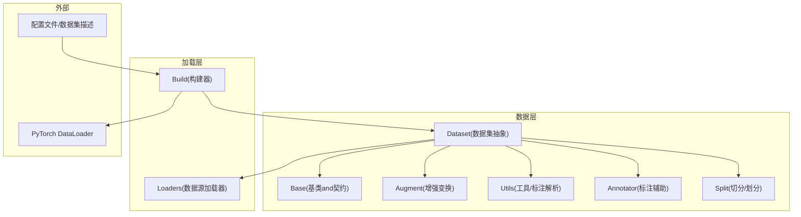
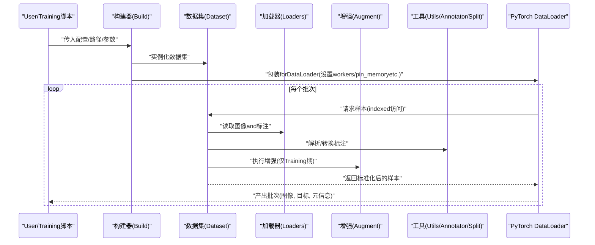
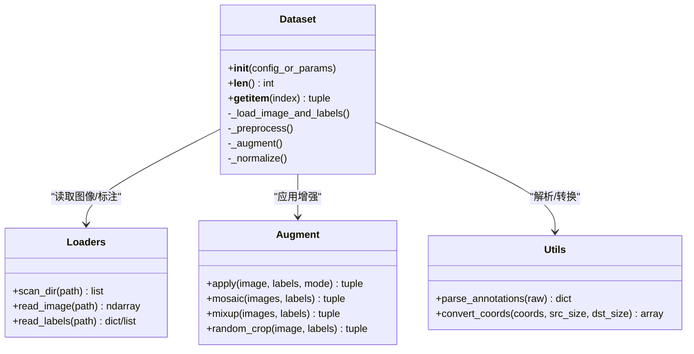
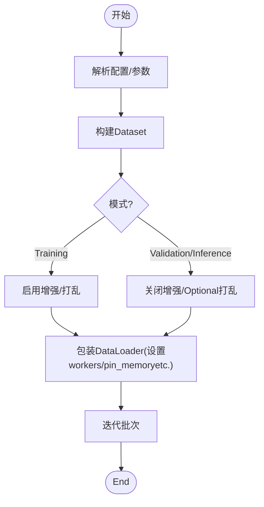
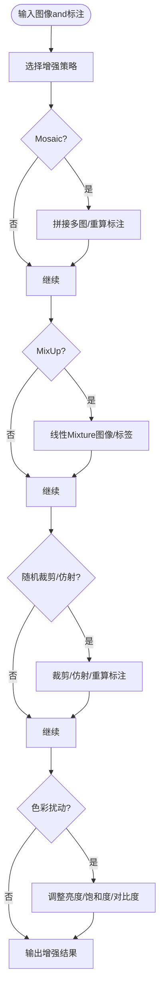
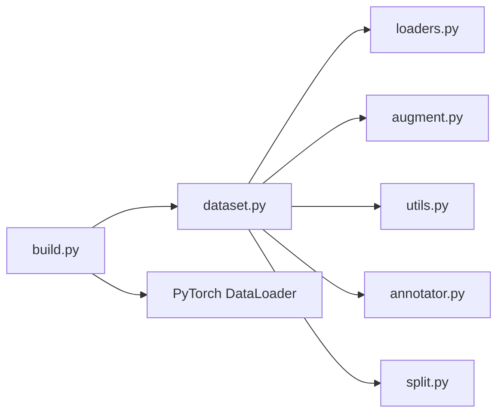

# Data Processing API

<cite>
**Files Referenced in This Document**
- [ultralytics/data/dataset.py](file://ultralytics/data/dataset.py)
- [ultralytics/data/build.py](file://ultralytics/data/build.py)
- [ultralytics/data/loaders.py](file://ultralytics/data/loaders.py)
- [ultralytics/data/augment.py](file://ultralytics/data/augment.py)
- [ultralytics/data/base.py](file://ultralytics/data/base.py)
- [ultralytics/data/utils.py](file://ultralytics/data/utils.py)
- [ultralytics/data/annotator.py](file://ultralytics/data/annotator.py)
- [ultralytics/data/split.py](file://ultralytics/data/split.py)
- [ultralytics/data/scripts/coco8.yaml](file://ultralytics/cfg/datasets/coco8.yaml)
</cite>

## Table of Contents
1. [Introduction](#Introduction)
2. [Project Structure](#Project Structure)
3. [Core Components](#Core Components)
4. [Architecture Overview](#Architecture Overview)
5. [Detailed Component Analysis](#Detailed Component Analysis)
6. [Dependency Analysis](#Dependency Analysis)
7. [Performance Considerations](#Performance Considerations)
8. [Troubleshooting Guide](#Troubleshooting Guide)
9. [Conclusion](#Conclusion)
10. [Appendix](#Appendix)

## Introduction
本文件targetingYOLO-Master的Data Processing API，聚焦于Data Loading、预处理and增强、DataLoader构建and管理、自定义数据集开发接口、多进程Data Pipeline配置and调优、Centered onand大规模数据集and内存管理实践。DocumentationCentered on代码级分析for基础，providesVisualization图示and最佳实践建议，帮助读者快速搭建高效稳定的Training数据流水线。

## Project Structure
Data processing相关代码集中while ultralytics/data Table of Contents下，围绕“数据集抽象—加载器—增强—工具”分层组织：
- dataset.py：定义统一的数据集类and索引访问语义，Encapsulates图像and标注的读取、归一化、Tasks适配etc.逻辑。
- build.py：负责从配置或路径构建数据集对象andDataLoader实例，协调多进程、批处理、打乱策略etc.。
- loaders.py：provides多种数据源加载器（such as按Table of Contents扫描、按列表迭代、按流式输入etc.），并implementing统一的迭代协议。
- augment.py：集中implementing各类Data Augmentation变换（Mosaic、MixUp、随机裁剪、色彩抖动、仿射变换etc.）。
- base.py：定义数据集基类and通用接口契约，便于扩展新Tasks或新格式。
- utils.py / annotator.py / split.py：provides标注解析、坐标转换、分割切分etc.辅助capabilities。

Figure Source
- [ultralytics/data/dataset.py](file://ultralytics/data/dataset.py)
- [ultralytics/data/build.py](file://ultralytics/data/build.py)
- [ultralytics/data/loaders.py](file://ultralytics/data/loaders.py)
- [ultralytics/data/augment.py](file://ultralytics/data/augment.py)
- [ultralytics/data/base.py](file://ultralytics/data/base.py)
- [ultralytics/data/utils.py](file://ultralytics/data/utils.py)
- [ultralytics/data/annotator.py](file://ultralytics/data/annotator.py)
- [ultralytics/data/split.py](file://ultralytics/data/split.py)

Section Source
- [ultralytics/data/dataset.py](file://ultralytics/data/dataset.py)
- [ultralytics/data/build.py](file://ultralytics/data/build.py)
- [ultralytics/data/loaders.py](file://ultralytics/data/loaders.py)
- [ultralytics/data/augment.py](file://ultralytics/data/augment.py)
- [ultralytics/data/base.py](file://ultralytics/data/base.py)
- [ultralytics/data/utils.py](file://ultralytics/data/utils.py)
- [ultralytics/data/annotator.py](file://ultralytics/data/annotator.py)
- [ultralytics/data/split.py](file://ultralytics/data/split.py)

## Core Components
- Dataset类
  - 职责：统一Encapsulates图像and标注的读取、预处理、增强、Tasks适配（检测/分割/姿态etc.）、索引访问and长度协议。
  - 关键capabilities：
    - 构造and配置：Supporting从配置文件、Table of Contents结构或显式参数初始化；可指定Tasks类型、尺寸、归一化方式etc.。
    - Data Loading：Via底层Loaders按需读取图像and标注，Supporting懒加载and缓存策略。
    - 预处理：缩放、填充、边界框and掩码对齐、类别映射、标签格式化。
    - 增强：集成Mosaic、MixUp、随机裁剪、仿射、色彩扰动etc.，可按阶段启用/禁用。
    - 输出：返回模型所需的张量批次或样本元组（图像、目标、路径、形状etc.）。
- DataLoaders构建and管理
  - 职责：将Dataset包装forPyTorch DataLoader，协调多进程、批大小、打乱、持久化工作进程、pin_memoryetc.。
  - 关键capabilities：
    - 构建入口：根据配置或参数创建DatasetandDataLoader实例。
    - 多进程：workers、prefetch_factor、persistent_workersetc.参数控制I/O吞吐。
    - 批处理：collate_fn定制、动态padding、mask打包etc.。
    - 生命周期：Training/Validation/Inference模式下的差异化行for（是否打乱、是否增强etc.）。
- 增强Modules
  - 职责：provides丰富的几何and外观变换，组合成Training期增强流水线。
  - 典型变换：Mosaic、MixUp、随机裁剪、仿射变换、颜色空间扰动、随机翻转、尺度变化etc.。
- 基础and工具
  - Base：定义数据集契约and通用方法，便于扩展新Tasks。
  - Utils/Annotator/Split：标注格式解析、坐标/掩码转换、数据集切分and子集生成。

Section Source
- [ultralytics/data/dataset.py](file://ultralytics/data/dataset.py)
- [ultralytics/data/build.py](file://ultralytics/data/build.py)
- [ultralytics/data/loaders.py](file://ultralytics/data/loaders.py)
- [ultralytics/data/augment.py](file://ultralytics/data/augment.py)
- [ultralytics/data/base.py](file://ultralytics/data/base.py)
- [ultralytics/data/utils.py](file://ultralytics/data/utils.py)
- [ultralytics/data/annotator.py](file://ultralytics/data/annotator.py)
- [ultralytics/data/split.py](file://ultralytics/data/split.py)

## Architecture Overview
下图展示从配置to数据产出的端to端流程：配置drivers are installed构建器，构建器组装数据集and加载器，数据集while迭代时Calls增强and工具函数，最终由DataLoader进行批处理and多进程调度。

Figure Source
- [ultralytics/data/build.py](file://ultralytics/data/build.py)
- [ultralytics/data/dataset.py](file://ultralytics/data/dataset.py)
- [ultralytics/data/loaders.py](file://ultralytics/data/loaders.py)
- [ultralytics/data/augment.py](file://ultralytics/data/augment.py)
- [ultralytics/data/utils.py](file://ultralytics/data/utils.py)
- [ultralytics/data/annotator.py](file://ultralytics/data/annotator.py)
- [ultralytics/data/split.py](file://ultralytics/data/split.py)

## Detailed Component Analysis

### Dataset类：构造、配置and数据流
- 构造and配置
  - Supporting从YAML/字典配置或显式参数初始化，包含Tasks类型、图像Root Directory、标注路径、尺寸、归一化、增强开关etc.。
  - 内部维护索引集合、类别映射、尺寸策略and增强管线。
- Data Loading
  - ViaLoaders按需读取图像and标注，避免一次性载入全部数据。
  - Supporting懒加载andOptional缓存（例such as路径缓存、索引缓存）Centered on降低重复IO开销。
- 预处理
  - 图像缩放and填充、边界框and掩码同步变换、类别ID重映射、标签规范化。
- 增强
  - Training期启用Mosaic、MixUp、随机裁剪、仿射、色彩扰动etc.；Validation/Inference期关闭或降级增强。
- 输出
  - 返回标准样本元组（图像张量、目标张量、图像路径、原始尺寸etc.），供下游TasksUses。

Figure Source
- [ultralytics/data/dataset.py](file://ultralytics/data/dataset.py)
- [ultralytics/data/loaders.py](file://ultralytics/data/loaders.py)
- [ultralytics/data/augment.py](file://ultralytics/data/augment.py)
- [ultralytics/data/utils.py](file://ultralytics/data/utils.py)

Section Source
- [ultralytics/data/dataset.py](file://ultralytics/data/dataset.py)
- [ultralytics/data/loaders.py](file://ultralytics/data/loaders.py)
- [ultralytics/data/augment.py](file://ultralytics/data/augment.py)
- [ultralytics/data/utils.py](file://ultralytics/data/utils.py)

### DataLoaders构建and管理接口
- 构建入口
  - Via构建器接收配置and参数，创建Dataset实例，再包装forDataLoader。
- 多进程and批处理
  - workers：并行Data Loading线程数；prefetch_factor：每进程预取批次数量；persistent_workers：保持工作进程存活Centered on减少启动开销。
  - pin_memory：加速GPU传输；drop_last：丢弃不足批次；shuffle：Training期打乱。
- 模式差异
  - Training：开启增强and打乱；Validation/Inference：关闭增强，可能关闭打乱Centered on提升稳定性。
- 自定义Collate
  - 可Viacollate_fn对批次进行Post-Processing（such as动态padding、掩码打包、目标过滤）。

Figure Source
- [ultralytics/data/build.py](file://ultralytics/data/build.py)
- [ultralytics/data/dataset.py](file://ultralytics/data/dataset.py)

Section Source
- [ultralytics/data/build.py](file://ultralytics/data/build.py)
- [ultralytics/data/dataset.py](file://ultralytics/data/dataset.py)

### Data Augmentation详解
- Mosaic
  - 将多张图像拼接for一张大图，提升小Object Detection鲁棒性and上下文多样性。
  - 适用：Training期；注意边界框and掩码的同步变换and裁剪。
- MixUp
  - 线性Mixture两张图像and其标签，平滑决策边界，提高泛化。
  - 适用：Training期；需按比例Mixture目标分布。
- 随机裁剪and仿射变换
  - 随机区域裁剪、旋转、平移、缩放，增强位置and尺度不变性。
  - 适用：Training期；需确保标注随之变换。
- 色彩and对比度扰动
  - 亮度、饱和度、色调、对比度随机调整，提升光照鲁棒性。
- 组合策略
  - Training期按概率启用若干增强；Validation/Inference期通常关闭或仅保留轻量变换。

Figure Source
- [ultralytics/data/augment.py](file://ultralytics/data/augment.py)

Section Source
- [ultralytics/data/augment.py](file://ultralytics/data/augment.py)

### 自定义数据集开发接口and数据格式要求
- 开发接口
  - 继承基类或遵循统一契约：implementing索引访问、长度协议、Tasks特定的标签格式转换。
  - 复用LoadersandUtils：Via现有加载器and工具函数完成图像/标注读取and坐标转换。
  - 注册and配置：while配置中声明数据路径、类别映射、Tasks类型，Centered on便构建器正确装配。
- 数据格式要求
  - 图像：常见格式（JPEG/PNGetc.），路径可由配置或扫描得to。
  - 标注：Supporting多种格式（such asYOLO文本、COCO JSONetc.），需能被解析for统一的目标结构（类别、边界框、掩码etc.）。
  - 切分：Supportingtrain/val/test划分，可Viasplit工具或配置文件指定比例/路径。
- ExamplesRefer to
  - 可Refer toBuilt-in数据集配置（such ascoco8.yaml）了解最小可用配置结构and字段含义。

Section Source
- [ultralytics/data/base.py](file://ultralytics/data/base.py)
- [ultralytics/data/utils.py](file://ultralytics/data/utils.py)
- [ultralytics/data/annotator.py](file://ultralytics/data/annotator.py)
- [ultralytics/data/split.py](file://ultralytics/data/split.py)
- [ultralytics/cfg/datasets/coco8.yaml](file://ultralytics/cfg/datasets/coco8.yaml)

## Dependency Analysis
- 组件耦合
  - Dataset强依赖LoadersandAugment，弱依赖Utils/Annotator/Split。
  - Build作for编排者，聚合DatasetandDataLoader，屏蔽多进程细节。
- External Dependencies
  - PyTorch DataLoader：批处理、多进程、pin_memoryetc.。
  - 图像处理库（such asOpenCV/PIL）：用于图像读取and变换（由Loaders/Augment内部Uses）。
- Potential Cycles依赖
  - 当前分层清晰，未见直接循环导入；若扩展时需保持“上层编排、下层被依赖”的单向依赖。

Figure Source
- [ultralytics/data/build.py](file://ultralytics/data/build.py)
- [ultralytics/data/dataset.py](file://ultralytics/data/dataset.py)
- [ultralytics/data/loaders.py](file://ultralytics/data/loaders.py)
- [ultralytics/data/augment.py](file://ultralytics/data/augment.py)
- [ultralytics/data/utils.py](file://ultralytics/data/utils.py)
- [ultralytics/data/annotator.py](file://ultralytics/data/annotator.py)
- [ultralytics/data/split.py](file://ultralytics/data/split.py)

Section Source
- [ultralytics/data/build.py](file://ultralytics/data/build.py)
- [ultralytics/data/dataset.py](file://ultralytics/data/dataset.py)
- [ultralytics/data/loaders.py](file://ultralytics/data/loaders.py)
- [ultralytics/data/augment.py](file://ultralytics/data/augment.py)
- [ultralytics/data/utils.py](file://ultralytics/data/utils.py)
- [ultralytics/data/annotator.py](file://ultralytics/data/annotator.py)
- [ultralytics/data/split.py](file://ultralytics/data/split.py)

## Performance Considerations
- 多进程Data Loading
  - workers：根据CPU核数and磁盘I/Ocapabilities调节；SSD/NVMe可更高；HDD需保守。
  - prefetch_factor：增大可减少GPUetc.待，但会占用更多内存。
  - persistent_workers：长TrainingTasks建议开启，减少进程重启开销。
  - pin_memory：Combined withGPUTraining显著提升数据传输速度。
- 批处理and内存
  - batch_size：受限于GPU显存andCPU内存；过大可能导致OOM或频繁GC。
  - collate_fn：避免while批处理中进行昂贵操作；尽量whileDataset内完成。
- 增强成本
  - Mosaic/MixUp计算密集，建议whileTraining初期或中etc.epoch启用；Validation期关闭。
  - Set appropriately增强概率and强度，平衡效果and耗时。
- I/OOptimization
  - Uses高速存储；必要时启用索引缓存或路径缓存。
  - 图像压缩and分辨率权衡：高分辨率提升精度但增加I/Oand计算压力。
- 监控and诊断
  - 记录Data Loading耗时、GPU利用率、内存峰值；定位bottlenecks后进行针对性调优。

[This section provides general guidance and does not directly analyze specific files]

## Troubleshooting Guide
- 常见问题
  - 多进程崩溃：检查workersandprefetch_factor是否过高；确认数据路径权限and可读性。
  - OOM（内存溢出）：降低batch_size、workers或prefetch_factor；关闭部分增强。
  - 标注不一致：校验标注格式and类别映射；Uses工具函数进行坐标/掩码一致性检查。
  - 性能低下：Evaluation磁盘I/OandCPU负载；尝试开启pin_memoryandpersistent_workers。
- 定位步骤
  - 逐步缩小范围：先单进程无增强Validation；再逐步引入增强and多进程。
  - 打印中间状态：记录图像尺寸、标注数量、异常样本路径。
  - Uses最小复现：基于小型数据集（such ascoco8）Validation配置and代码路径。

Section Source
- [ultralytics/data/utils.py](file://ultralytics/data/utils.py)
- [ultralytics/data/annotator.py](file://ultralytics/data/annotator.py)
- [ultralytics/data/split.py](file://ultralytics/data/split.py)

## Conclusion
YOLO-Master的Data Processing APIVia清晰的层次划分and可扩展的接口设计，provides了从配置to批处理的完整数据流水线。Dataset负责数据and增强的核心逻辑，Build负责编排and多进程管理，LoadersandUtilsprovides灵活的读取and解析capabilities。Combining合理的多进程and增强策略，可while保证精度获得良好的Training吞吐。对于大规模数据集，建议优先OptimizationI/Oand内存管理，并采用渐进式增强and监控手段持续调优。

[This section is summary content and does not directly analyze specific files]

## Appendix
- 常用配置Refer to
  - 可Refer toBuilt-in数据集配置文件（such ascoco8.yaml）了解字段含义and最小可用结构。
- 最佳实践清单
  - Training期启用Mosaic/MixUp，Validation期关闭；Set appropriatelyworkersandprefetch_factor；开启pin_memoryandpersistent_workers；定期监控I/OandGPU利用率；对异常样本进行专项修复and回归测试。

Section Source
- [ultralytics/cfg/datasets/coco8.yaml](file://ultralytics/cfg/datasets/coco8.yaml)