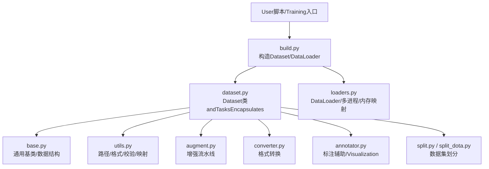
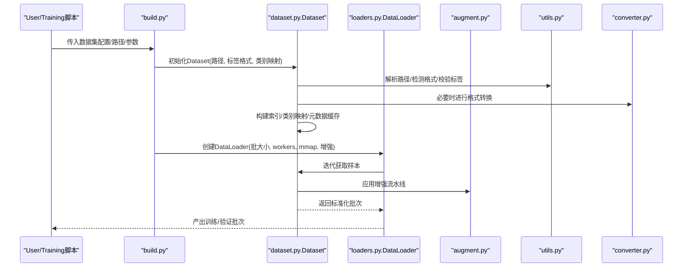
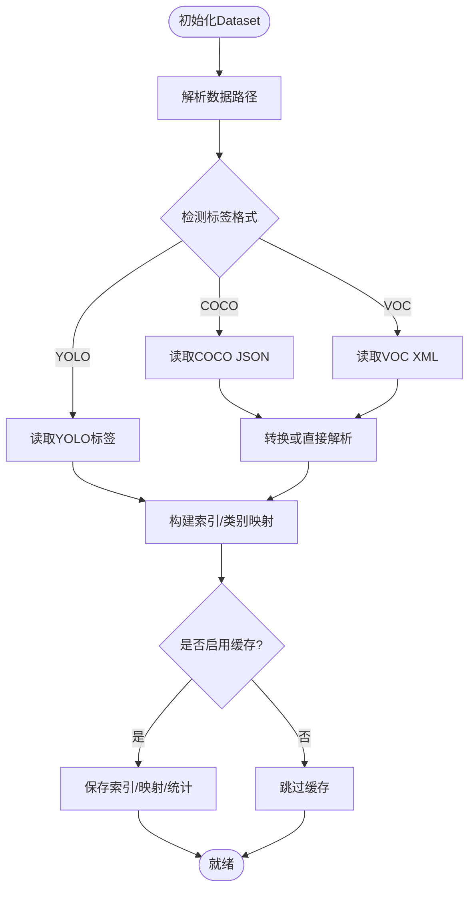
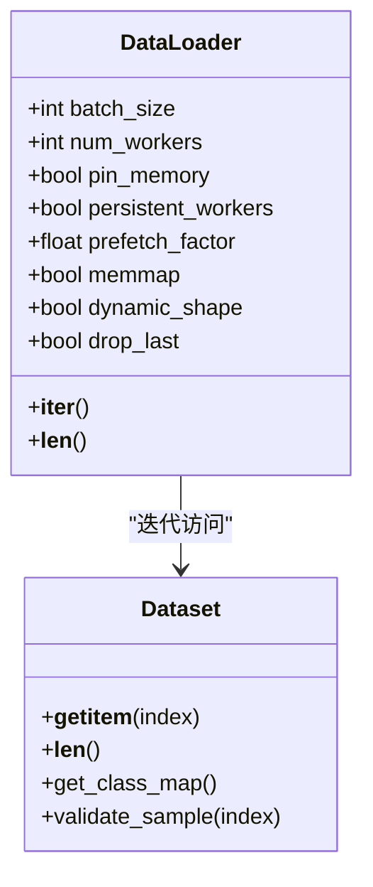
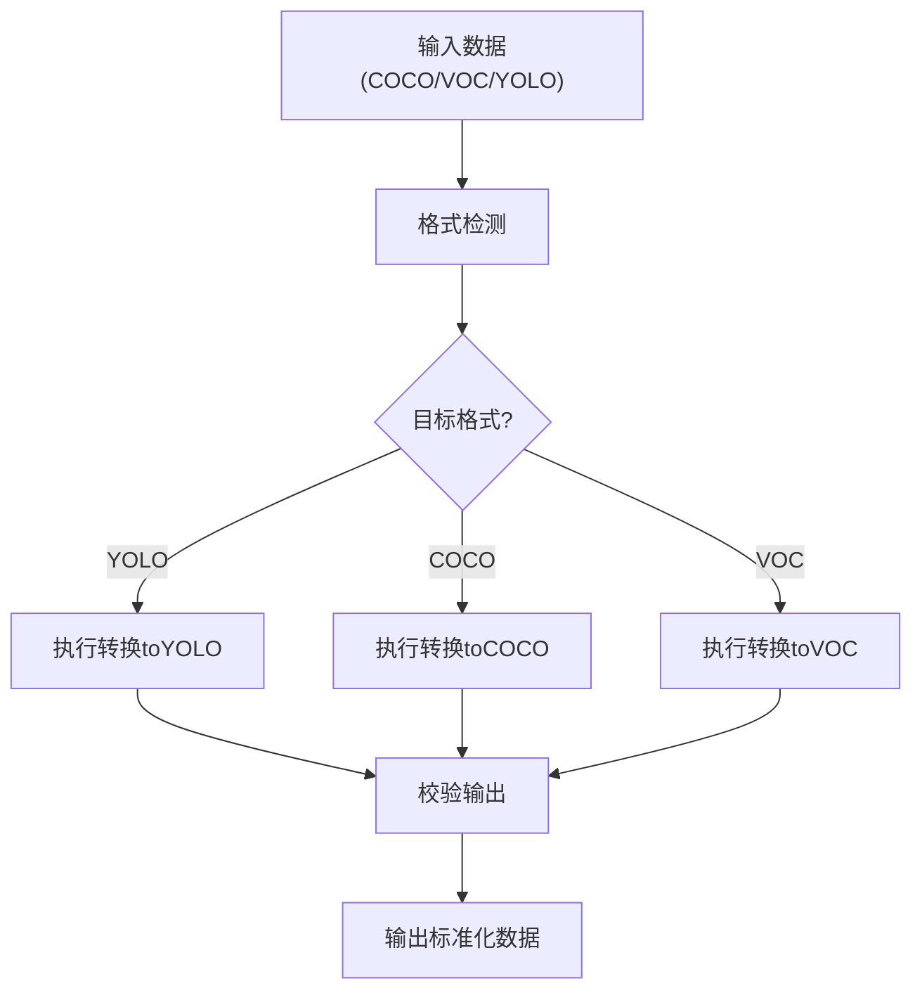
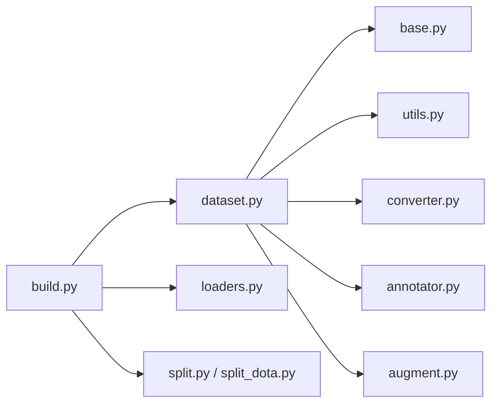

# 数据集管理

<cite>
**Files Referenced in This Document**
- [ultralytics/data/dataset.py](file://ultralytics/data/dataset.py)
- [ultralytics/data/build.py](file://ultralytics/data/build.py)
- [ultralytics/data/loaders.py](file://ultralytics/data/loaders.py)
- [ultralytics/data/base.py](file://ultralytics/data/base.py)
- [ultralytics/data/utils.py](file://ultralytics/data/utils.py)
- [ultralytics/data/annotator.py](file://ultralytics/data/annotator.py)
- [ultralytics/data/augment.py](file://ultralytics/data/augment.py)
- [ultralytics/data/converter.py](file://ultralytics/data/converter.py)
- [ultralytics/data/split.py](file://ultralytics/data/split.py)
- [ultralytics/data/split_dota.py](file://ultralytics/data/split_dota.py)
- [ultralytics/cfg/datasets/index.md](file://ultralytics/cfg/datasets/index.md)
</cite>

## Table of Contents
1. [Introduction](#Introduction)
2. [Project Structure](#Project Structure)
3. [Core Components](#Core Components)
4. [Architecture Overview](#Architecture Overview)
5. [Detailed Component Analysis](#Detailed Component Analysis)
6. [Dependency Analysis](#Dependency Analysis)
7. [Performance Considerations](#Performance Considerations)
8. [Troubleshooting Guide](#Troubleshooting Guide)
9. [Conclusion](#Conclusion)
10. [Appendix](#Appendix)

## Introduction
本文件targetingYOLO-Master的数据集管理API，聚焦于Dataset类andDataLoaders的创建and管理、数据格式Supporting（YOLO、COCO、Pascal VOCetc.）、自定义数据集开发接口、数据Validation工具、缓存机制and性能Optimization策略，Centered onand大规模and分布式环境下的Data Loading实践。DocumentationCentered on代码级implementingfor依据，providesVisualization图示and可操作的配置建议，帮助读者快速构建高效、稳定的TrainingandInference数据管线。

## Project Structure
数据集相关代码集中whileultralytics/dataTable of Contents下，围绕“数据装载—解析—增强—批处理—迭代”的主线组织：
- dataset.py：定义Dataset基类andTasks型数据集Encapsulates，负责路径解析、标签读取、类别映射、索引构建etc.。
- build.py：高层入口，根据配置或参数构造DatasetandDataLoader实例，统一调度多进程、内存映射、缓存etc.选项。
- loaders.py：EncapsulatesPyTorch DataLoaderand自定义采样器、分片、内存映射etc.capabilities。
- base.py：通用基类and公共数据结构，供不同Tasks继承复用。
- utils.py：路径、格式检测、标签校验、类别映射etc.工具函数。
- annotator.py：标注辅助andVisualization、格式转换辅助。
- augment.py：Data Augmentation流水线（几何、色彩、MixUp/Mosaicetc.）。
- converter.py：跨格式转换（such asCOCO↔YOLO、VOC→YOLOetc.）。
- split.py / split_dota.py：数据集划分andDOTA专用切分逻辑。
- cfg/datasets/index.md：Built-in数据集清单andExamples配置说明。

Figure Source
- [ultralytics/data/build.py](file://ultralytics/data/build.py)
- [ultralytics/data/dataset.py](file://ultralytics/data/dataset.py)
- [ultralytics/data/loaders.py](file://ultralytics/data/loaders.py)
- [ultralytics/data/base.py](file://ultralytics/data/base.py)
- [ultralytics/data/utils.py](file://ultralytics/data/utils.py)
- [ultralytics/data/augment.py](file://ultralytics/data/augment.py)
- [ultralytics/data/converter.py](file://ultralytics/data/converter.py)
- [ultralytics/data/annotator.py](file://ultralytics/data/annotator.py)
- [ultralytics/data/split.py](file://ultralytics/data/split.py)
- [ultralytics/data/split_dota.py](file://ultralytics/data/split_dota.py)

Section Source
- [ultralytics/data/dataset.py](file://ultralytics/data/dataset.py)
- [ultralytics/data/build.py](file://ultralytics/data/build.py)
- [ultralytics/data/loaders.py](file://ultralytics/data/loaders.py)
- [ultralytics/data/base.py](file://ultralytics/data/base.py)
- [ultralytics/data/utils.py](file://ultralytics/data/utils.py)
- [ultralytics/data/augment.py](file://ultralytics/data/augment.py)
- [ultralytics/data/converter.py](file://ultralytics/data/converter.py)
- [ultralytics/data/annotator.py](file://ultralytics/data/annotator.py)
- [ultralytics/data/split.py](file://ultralytics/data/split.py)
- [ultralytics/data/split_dota.py](file://ultralytics/data/split_dota.py)
- [ultralytics/cfg/datasets/index.md](file://ultralytics/cfg/datasets/index.md)

## Core Components
- Dataset类
  - 职责：统一数据访问接口；解析数据路径and标签；维护类别映射；构建样本索引；对接增强and批处理。
  - 关键capabilities：
    - 数据路径设置：Supporting绝对/相对路径、子Table of Contents扫描、图像and标签配对。
    - 标签格式解析：自动识别YOLO文本、COCO JSON、Pascal VOC XMLetc.，并归一化内部表示。
    - 类别映射：从配置文件或自动推断生成id↔name映射，保证Training/Inference一致性。
    - 索引构建：建立图像to标注的倒排索引，加速随机访问and过滤。
    - 元数据缓存：Optional持久化索引and统计信息，减少重复IO。
- DataLoaders
  - 职责：基于PyTorch DataLoaderEncapsulates，provides多进程加载、内存映射、动态尺寸、缓存批etc.capabilities。
  - 关键capabilities：
    - 批处理大小and堆叠策略：Supporting固定尺寸and按最大边对齐的动态尺寸。
    - 多进程加载：workers数量、进程间通信开销控制、种子隔离。
    - 内存映射：对超大标签或中间缓存Usesmmap降低内存峰值。
    - 采样and打乱：全局打乱、分层采样、重加权etc.。
    - 错误恢复：单样本异常跳过、重试计数、失败Logging。
- 工具and扩展
  - 格式转换：converter.pyprovidesCOCO↔YOLO、VOC→YOLOetc.转换流程。
  - Data Augmentation：augment.pyprovides几何、色彩、Mixture增强，Supporting可插拔组合。
  - 标注辅助：annotator.pyprovidesVisualization、批量检查、Export辅助。
  - 数据集划分：split.pyandsplit_dota.pyprovides标准划分andDOTA旋转框切分。

Section Source
- [ultralytics/data/dataset.py](file://ultralytics/data/dataset.py)
- [ultralytics/data/build.py](file://ultralytics/data/build.py)
- [ultralytics/data/loaders.py](file://ultralytics/data/loaders.py)
- [ultralytics/data/utils.py](file://ultralytics/data/utils.py)
- [ultralytics/data/converter.py](file://ultralytics/data/converter.py)
- [ultralytics/data/augment.py](file://ultralytics/data/augment.py)
- [ultralytics/data/annotator.py](file://ultralytics/data/annotator.py)
- [ultralytics/data/split.py](file://ultralytics/data/split.py)
- [ultralytics/data/split_dota.py](file://ultralytics/data/split_dota.py)

## Architecture Overview
下图展示从配置to数据流水线的端to端Calls关系：

Figure Source
- [ultralytics/data/build.py](file://ultralytics/data/build.py)
- [ultralytics/data/dataset.py](file://ultralytics/data/dataset.py)
- [ultralytics/data/loaders.py](file://ultralytics/data/loaders.py)
- [ultralytics/data/augment.py](file://ultralytics/data/augment.py)
- [ultralytics/data/utils.py](file://ultralytics/data/utils.py)
- [ultralytics/data/converter.py](file://ultralytics/data/converter.py)

## Detailed Component Analysis

### Dataset类：构造and配置
- 构造要点
  - 数据路径设置：SupportingRoot Directory、images/labels子Table of Contents约定；允许自定义路径前缀and后缀规则。
  - 标签格式解析：优先依据文件后缀and内容特征判断格式；若forCOCO/VOC则按需转换forYOLO内部格式或直接解析。
  - 类别映射：可从外部yaml/json导入，或从标签中自动推断；Supporting别名合并and去重。
  - 索引构建：将图像and标注建立双向索引，便于按ID/名称检索and过滤。
  - 元数据缓存：Optional将索引、类别映射、统计信息写入本地缓存Table of Contents，避免重复计算。
- 常用配置项（概念性）
  - data_root：数据集根路径
  - img_dir / label_dir：图像and标签Table of Contents
  - format：标签格式（yolo/coco/voc）
  - class_mapping：类别映射文件或字典
  - cache_index：是否缓存索引
  - validate_on_load：是否while加载时执行基本校验
- 典型流程
  - 初始化→路径解析→格式检测→标签读取→类别映射→索引构建→缓存落盘

Figure Source
- [ultralytics/data/dataset.py](file://ultralytics/data/dataset.py)
- [ultralytics/data/utils.py](file://ultralytics/data/utils.py)
- [ultralytics/data/converter.py](file://ultralytics/data/converter.py)

Section Source
- [ultralytics/data/dataset.py](file://ultralytics/data/dataset.py)
- [ultralytics/data/utils.py](file://ultralytics/data/utils.py)
- [ultralytics/data/converter.py](file://ultralytics/data/converter.py)

### DataLoaders：创建and管理
- 创建入口
  - Via高层接口传入Dataset实例andTraining/Validation参数，自动选择合适的Data Loading策略。
- 关键配置项（概念性）
  - batch_size：每批样本数
  - num_workers：多进程工作线程数
  - pin_memory：是否Uses锁页内存
  - persistent_workers：是否保持worker常驻
  - prefetch_factor：预取因子
  - memmap：是否对大数组Uses内存映射
  - dynamic_shape：是否启用动态尺寸堆叠
  - drop_last：是否丢弃最后不足一批的样本
- 多进程and内存映射
  - 多进程并行读取and预处理，注意进程间序列化成本and共享内存限制。
  - 内存映射用于超大标签或中间缓存，显著降低内存峰值，但可能增加磁盘IO压力。
- 错误处理and健壮性
  - 单样本异常捕获and跳过，记录失败样本ID，Supporting重试and断点续跑。
  - 进度反馈and超时保护，防止个别样本拖慢整体吞吐。

Figure Source
- [ultralytics/data/loaders.py](file://ultralytics/data/loaders.py)
- [ultralytics/data/dataset.py](file://ultralytics/data/dataset.py)

Section Source
- [ultralytics/data/loaders.py](file://ultralytics/data/loaders.py)
- [ultralytics/data/dataset.py](file://ultralytics/data/dataset.py)

### 数据格式Supportingand转换
- Supporting格式
  - YOLO：txt行级标注，包含类别and归一化坐标。
  - COCO：JSON结构，包含images、annotations、categoriesetc.字段。
  - Pascal VOC：XML标注，包含bndboxetc.边界框信息。
- 转换方法
  - converter.pyprovides统一的转换接口，SupportingCOCO→YOLO、VOC→YOLOetc.。
  - 转换过程包括：类别对齐、坐标归一化、缺失值处理、冗余去除。
- 自动检测and回退
  - 当format未显式指定时，utils.py会尝试根据文件结构and内容推断格式。
  - 若检测to不兼容或缺失字段，给出明确错误Tipsand修复建议。

Figure Source
- [ultralytics/data/converter.py](file://ultralytics/data/converter.py)
- [ultralytics/data/utils.py](file://ultralytics/data/utils.py)

Section Source
- [ultralytics/data/converter.py](file://ultralytics/data/converter.py)
- [ultralytics/data/utils.py](file://ultralytics/data/utils.py)

### 自定义数据集开发接口
- 继承and重写
  - 基于base.pyprovides的通用基类，重写__getitem__and__len__即可接入现有Training/Validation流程。
  - 可while__getitem__中集成特定增强或Post-Processing逻辑。
- 数据Validation工具
  - provides批量校验接口，检查图像存while性、标签完整性、类别一致性、坐标范围合法性etc.。
  - Supporting生成报告andVisualization样例，便于定位问题样本。
- 最佳实践
  - 尽量while__getitem__中只做轻量操作，复杂预处理放while__init__或离线阶段完成。
  - Uses缓存机制存储中间结果，避免重复计算。

Section Source
- [ultralytics/data/base.py](file://ultralytics/data/base.py)
- [ultralytics/data/dataset.py](file://ultralytics/data/dataset.py)
- [ultralytics/data/annotator.py](file://ultralytics/data/annotator.py)

### Data Augmentation流水线
- 增强类型
  - 几何变换：缩放、裁剪、翻转、仿射etc.。
  - 色彩变换：亮度、对比度、饱和度、色调etc.。
  - Mixture增强：Mosaic、MixUp、Copy-Pasteetc.。
- 配置and组合
  - Via配置对象声明增强步骤and概率，Supporting条件增强andTasks差异化。
  - 增强顺序影响最终效果，建议先几何后色彩再Mixture。
- 性能Optimization
  - 向量化操作andNumPy/CPU并行Combining，减少Python循环开销。
  - 对大图采用分块增强或降采样预处理。

Section Source
- [ultralytics/data/augment.py](file://ultralytics/data/augment.py)

### 数据集划分andDOTASupporting
- 标准划分
  - split.pyprovidestrain/val/test比例划分，Supporting分层抽样and交叉Validation。
- DOTA旋转框
  - split_dota.py针对DOTA的旋转框and瓦片切分provides专用逻辑，确保小目标and密集场景的覆盖。

Section Source
- [ultralytics/data/split.py](file://ultralytics/data/split.py)
- [ultralytics/data/split_dota.py](file://ultralytics/data/split_dota.py)

## Dependency Analysis
- Modules耦合
  - build.py作for编排层，依赖dataset.pyandloaders.py，间接Usesutils.py、converter.py、augment.py。
  - dataset.py强依赖utils.pyandbase.py，弱依赖converter.pyandannotator.py。
  - loaders.py依赖dataset.pyand系统级多线程/多进程库。
- Potential Cycles依赖
  - 当前设计Via清晰的层次划分避免循环依赖；新增功能时应遵循“上层编排、下层implementing”的原则。
- External Dependencies
  - PyTorch DataLoader、NumPy、PIL/OpenCV、json/xml解析库etc.。

Figure Source
- [ultralytics/data/build.py](file://ultralytics/data/build.py)
- [ultralytics/data/dataset.py](file://ultralytics/data/dataset.py)
- [ultralytics/data/loaders.py](file://ultralytics/data/loaders.py)
- [ultralytics/data/base.py](file://ultralytics/data/base.py)
- [ultralytics/data/utils.py](file://ultralytics/data/utils.py)
- [ultralytics/data/converter.py](file://ultralytics/data/converter.py)
- [ultralytics/data/annotator.py](file://ultralytics/data/annotator.py)
- [ultralytics/data/augment.py](file://ultralytics/data/augment.py)
- [ultralytics/data/split.py](file://ultralytics/data/split.py)
- [ultralytics/data/split_dota.py](file://ultralytics/data/split_dota.py)

Section Source
- [ultralytics/data/build.py](file://ultralytics/data/build.py)
- [ultralytics/data/dataset.py](file://ultralytics/data/dataset.py)
- [ultralytics/data/loaders.py](file://ultralytics/data/loaders.py)
- [ultralytics/data/base.py](file://ultralytics/data/base.py)
- [ultralytics/data/utils.py](file://ultralytics/data/utils.py)
- [ultralytics/data/converter.py](file://ultralytics/data/converter.py)
- [ultralytics/data/annotator.py](file://ultralytics/data/annotator.py)
- [ultralytics/data/augment.py](file://ultralytics/data/augment.py)
- [ultralytics/data/split.py](file://ultralytics/data/split.py)
- [ultralytics/data/split_dota.py](file://ultralytics/data/split_dota.py)

## Performance Considerations
- 多进程加载
  - Set appropriatelynum_workers，避免过多导致上下文切换开销过大；建议从CPU核数的一半开始调优。
  - Usespersistent_workers减少worker重建成本。
- 内存映射
  - 对超大标签或中间缓存启用memmap，降低内存峰值；注意SSD/NVMe磁盘IObottlenecks。
- 动态尺寸and堆叠
  - 动态尺寸可减少填充浪费，但会增加堆叠复杂度；建议whileGPU显存充足时开启。
- 缓存机制
  - 启用索引and统计缓存，避免重复扫描and解析；定期清理过期缓存。
- 增强开销
  - 将昂贵增强移至离线阶段或降低概率；Uses向量化and并行化提升吞吐。
- 分布式环境
  - while多卡Training中，确保每个进程的Dataset独立且seed隔离，避免重复样本。
  - Uses分布式采样器或分片策略，保证各进程数据分布均衡。

[本节for通用指导，无需列出具体文件来源]

## Troubleshooting Guide
- 常见问题
  - 路径不存while或权限不足：检查data_rootand子Table of Contents权限，确认符号链接有效。
  - 标签格式不匹配：确认format参数and实际格式一致，或Uses自动检测。
  - 类别不一致：确保class_mappingwhile所有进程中一致，避免Training/Inference漂移。
  - 多进程崩溃：查看workerLogging，定位异常样本ID，启用异常跳过and重试。
  - 内存溢出：降低batch_size或num_workers，启用memmap或关闭动态尺寸。
- 诊断工具
  - Usesannotator.py的批量校验andVisualization功能，快速定位问题样本。
  - 利用utils.py的格式检测and校验接口，生成诊断报告。
- 恢复策略
  - 启用断点续跑and失败队列，记录失败样本并单独处理。
  - 对损坏样本进行修复或剔除，更新索引and缓存。

Section Source
- [ultralytics/data/annotator.py](file://ultralytics/data/annotator.py)
- [ultralytics/data/utils.py](file://ultralytics/data/utils.py)
- [ultralytics/data/dataset.py](file://ultralytics/data/dataset.py)
- [ultralytics/data/loaders.py](file://ultralytics/data/loaders.py)

## Conclusion
YOLO-Master的数据集管理APIVia清晰的Modules化设计and丰富的配置选项，provides了从数据解析、格式转换、增强to批处理的全链路capabilities。借助缓存、内存映射and多进程加载，能够while大规模and分布式环境下implementing高吞吐、低延迟的数据供给。建议while实际项目中Combining业务特点调优workers、batch_size、memmapand增强策略，并充分利用ValidationandVisualization工具保障数据质量。

[本节for总结性内容，无需列出具体文件来源]

## Appendix
- Built-in数据集andExamples配置
  - Refer tocfg/datasets/index.md了解官方数据集清单and配置模板。
- 快速上手
  - Usesbuild.py的高层接口，传入数据路径and基本参数即可快速启动Training/Validation。
- 扩展建议
  - 自定义数据集时优先继承base.py，并while__getitem__中保持轻量；复杂预处理离线完成。
  - 新增格式Supporting时，优先whileconverter.py中添加转换逻辑，并whileutils.py中补充格式检测。

Section Source
- [ultralytics/cfg/datasets/index.md](file://ultralytics/cfg/datasets/index.md)
- [ultralytics/data/build.py](file://ultralytics/data/build.py)
- [ultralytics/data/base.py](file://ultralytics/data/base.py)
- [ultralytics/data/converter.py](file://ultralytics/data/converter.py)
- [ultralytics/data/utils.py](file://ultralytics/data/utils.py)