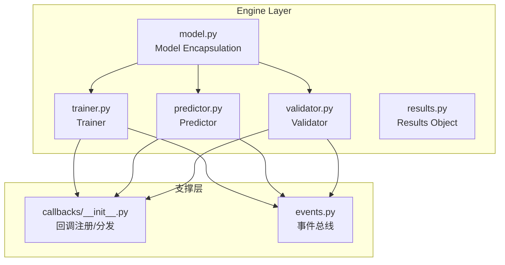
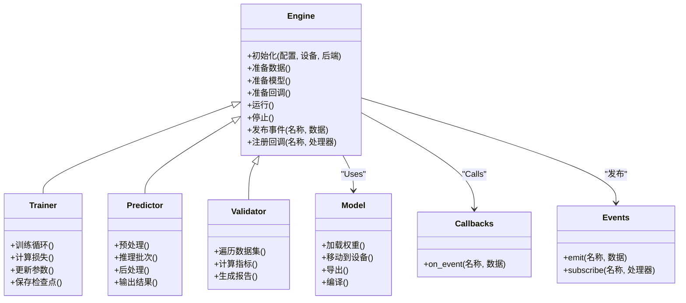
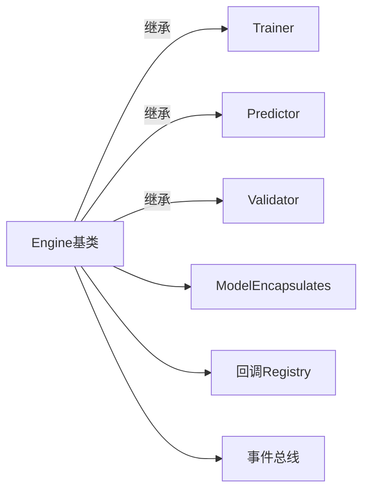
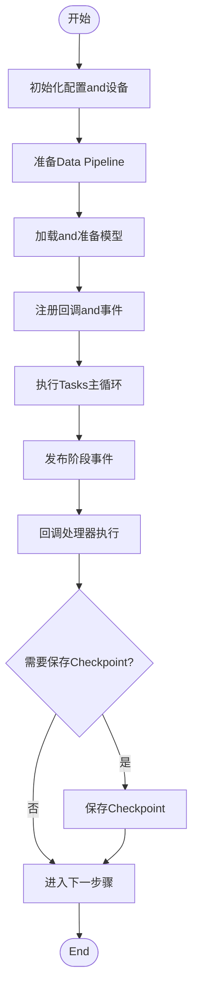

# Engine Base Class API

<cite>
**Files Referenced in This Document**
- [engine/__init__.py](file://ultralytics/engine/__init__.py)
- [engine/model.py](file://ultralytics/engine/model.py)
- [engine/trainer.py](file://ultralytics/engine/trainer.py)
- [engine/predictor.py](file://ultralytics/engine/predictor.py)
- [engine/validator.py](file://ultralytics/engine/validator.py)
- [engine/results.py](file://ultralytics/engine/results.py)
- [utils/callbacks/__init__.py](file://ultralytics/utils/callbacks/__init__.py)
- [utils/events.py](file://ultralytics/utils/events.py)
</cite>

## Table of Contents
1. [Introduction](#Introduction)
2. [Project Structure](#Project Structure)
3. [Core Components](#Core Components)
4. [Architecture Overview](#Architecture Overview)
5. [Detailed Component Analysis](#Detailed Component Analysis)
6. [Dependency Analysis](#Dependency Analysis)
7. [性能and资源管理](#性能and资源管理)
8. [Troubleshooting Guide](#Troubleshooting Guide)
9. [Conclusion](#Conclusion)
10. [Appendix：扩展Engine的自定义开发指南](#Appendix扩展engine的自定义开发指南)

## Introduction
本文件forYOLO-Master中Engine基类系统的APIDocumentation，聚焦于Engine抽象基类的设计模式、核心接口定义，Centered onandTrainer、Predictor、Validator三个主要子类的职责分工。Documentation同时覆盖Engine生命周期管理（初始化、启动、停止）、回调机制and事件处理系统、性能监控and资源管理接口，并provides扩展EngineCentered onSupporting新Tasks类型的实践指南。

## Project Structure
Engine相关代码位于ultralytics/engineTable of Contents下，包含Model Encapsulation、Trainer、Predictor、Validator、Results Objectetc.关键Modules；回调and事件系统位于ultralytics/utils下。

Figure Source
- [engine/model.py:1-200](file://ultralytics/engine/model.py#L1-L200)
- [engine/trainer.py:1-200](file://ultralytics/engine/trainer.py#L1-L200)
- [engine/predictor.py:1-200](file://ultralytics/engine/predictor.py#L1-L200)
- [engine/validator.py:1-200](file://ultralytics/engine/validator.py#L1-L200)
- [engine/results.py:1-200](file://ultralytics/engine/results.py#L1-L200)
- [utils/callbacks/__init__.py:1-200](file://ultralytics/utils/callbacks/__init__.py#L1-L200)
- [utils/events.py:1-200](file://ultralytics/utils/events.py#L1-L200)

Section Source
- [engine/__init__.py:1-200](file://ultralytics/engine/__init__.py#L1-L200)
- [engine/model.py:1-200](file://ultralytics/engine/model.py#L1-L200)
- [engine/trainer.py:1-200](file://ultralytics/engine/trainer.py#L1-L200)
- [engine/predictor.py:1-200](file://ultralytics/engine/predictor.py#L1-L200)
- [engine/validator.py:1-200](file://ultralytics/engine/validator.py#L1-L200)
- [engine/results.py:1-200](file://ultralytics/engine/results.py#L1-L200)
- [utils/callbacks/__init__.py:1-200](file://ultralytics/utils/callbacks/__init__.py#L1-L200)
- [utils/events.py:1-200](file://ultralytics/utils/events.py#L1-L200)

## Core Components
- Engine抽象基类：provides统一的初始化、配置解析、设备and后端选择、Data Loading、Loggingand回调挂载、事件发布、进度条andCheckpoint保存etc.通用capabilities。子类Via重写特定钩子方法implementing具体Tasks逻辑。
- Trainer：负责Training流程编排，包括Optimizerand调度器设置、损失计算、Gradient累积、EMA、Distributed Training控制、Metrics统计and权重保存。
- Predictor：负责Inference流程编排，包括输入预处理、批处理、NMS/Post-Processing、Visualizationand结果序列化。
- Validator：负责Evaluation流程编排，包括数据集遍历、Metrics计算、混淆矩阵/PR曲线生成、结果汇总and报告输出。
- ModelEncapsulates：统一模型加载、Export、编译、设备Migration、参数冻结/解冻、Mixture精度and自动后端选择。
- Results：标准化Inference/Validation结果数据结构，便于Visualization、序列化and下游消费。
- 回调and事件：基于事件总线and回调Registry，while关键阶段触发User可插拔逻辑（such as记录Logging、保存中间结果、断点续训、Monitoring and Alerting）。

Section Source
- [engine/model.py:1-200](file://ultralytics/engine/model.py#L1-L200)
- [engine/trainer.py:1-200](file://ultralytics/engine/trainer.py#L1-L200)
- [engine/predictor.py:1-200](file://ultralytics/engine/predictor.py#L1-L200)
- [engine/validator.py:1-200](file://ultralytics/engine/validator.py#L1-L200)
- [engine/results.py:1-200](file://ultralytics/engine/results.py#L1-L200)
- [utils/callbacks/__init__.py:1-200](file://ultralytics/utils/callbacks/__init__.py#L1-L200)
- [utils/events.py:1-200](file://ultralytics/utils/events.py#L1-L200)

## Architecture Overview
Engine采用“模板方法+事件drivers are installed”的架构：基类定义生命周期骨架，子类填充Tasks细节；while关键节点Via事件总线广播状态变化，回调订阅者执行横切关注点（Logging、监控、存储etc.）。

Figure Source
- [engine/model.py:1-200](file://ultralytics/engine/model.py#L1-L200)
- [engine/trainer.py:1-200](file://ultralytics/engine/trainer.py#L1-L200)
- [engine/predictor.py:1-200](file://ultralytics/engine/predictor.py#L1-L200)
- [engine/validator.py:1-200](file://ultralytics/engine/validator.py#L1-L200)
- [utils/callbacks/__init__.py:1-200](file://ultralytics/utils/callbacks/__init__.py#L1-L200)
- [utils/events.py:1-200](file://ultralytics/utils/events.py#L1-L200)

## Detailed Component Analysis

### Engine抽象基类
- 设计模式
  - 模板方法：定义run生命周期，将“准备数据/模型/回调”和“Tasks主循环”拆分for可覆写钩子。
  - 策略模式：设备and后端选择、Data Loading策略、结果序列化策略可Via配置注入。
  - 观察者模式：事件总线and回调Registry解耦横切逻辑。
- 核心接口
  - 初始化：接收配置、设备、后端、工作Table of Contents、Loggingand回调etc.参数。
  - 生命周期：prepare_data、prepare_model、prepare_callbacks、run、stop。
  - 事件and回调：publish_event、register_callback。
  - 资源管理：设备切换、显存清理、进程/线程池释放。
- 错误处理
  - 对Data Loading失败、模型加载异常、设备不可用etc.情况进行捕获并抛出结构化错误，附带上下文信息。
- 性能特性
  - 批大小自适应、自动Mixture精度、缓存and预取、异步I/OOptional开关。

Section Source
- [engine/model.py:1-200](file://ultralytics/engine/model.py#L1-L200)
- [utils/callbacks/__init__.py:1-200](file://ultralytics/utils/callbacks/__init__.py#L1-L200)
- [utils/events.py:1-200](file://ultralytics/utils/events.py#L1-L200)

### TrainerTrainer
- 职责
  - 构建OptimizerandLearning Rate调度器，执行Training循环，计算损失，Backpropagation，EMA维护，Checkpoint保存，Metrics统计andLogging。
- 关键钩子
  - on_epoch_start/on_epoch_end、on_batch_start/on_batch_end、on_save_checkpoint、on_log_metricsetc.。
- 分布式and容错
  - SupportingDDP/多进程，断点续训，NaN/Inf检测and恢复策略。
- 性能
  - Gradient累积、动态批大小、AMP、数据预取and锁步同步。

Section Source
- [engine/trainer.py:1-200](file://ultralytics/engine/trainer.py#L1-L200)

### PredictorPredictor
- 职责
  - 输入预处理、Batch Inference、NMS/Post-Processing、Visualization、结果序列化and流式InferenceSupporting。
- 关键钩子
  - on_preprocess、on_infer_batch、on_postprocess、on_save_result。
- 性能
  - 批内并行、内存复用、GPU/CPU自动选择、ONNX/TensorRT后端Optional。

Section Source
- [engine/predictor.py:1-200](file://ultralytics/engine/predictor.py#L1-L200)

### ValidatorValidator
- 职责
  - 遍历Validation集，计算mAP/F1/AUCetc.Metrics，生成混淆矩阵andPR曲线，汇总报告。
- 关键钩子
  - on_val_start、on_val_batch、on_val_end、on_save_report。
- 性能
  - 多线程Data Loading、Metrics增量计算、结果缓存。

Section Source
- [engine/validator.py:1-200](file://ultralytics/engine/validator.py#L1-L200)

### ModelEncapsulates
- 职责
  - 统一模型加载、权重恢复、设备Migration、Exportand编译、参数冻结/解冻、Mixture精度and自动后端选择。
- 关键接口
  - load、to_device、export、compile、freeze/unfreeze、half/bfloat16切换。

Section Source
- [engine/model.py:1-200](file://ultralytics/engine/model.py#L1-L200)

### Results ObjectResults
- 职责
  - 标准化Inference/Validation结果的数据结构，provides索引、切片、过滤、Visualizationand序列化接口。
- 关键接口
  - boxes/masks/keypointsetc.字段访问、Confidence Threshold过滤、类别映射、ExportJSON/Numpy。

Section Source
- [engine/results.py:1-200](file://ultralytics/engine/results.py#L1-L200)

### 回调and事件系统
- 事件总线
  - provides事件发布/订阅、命名空间隔离、优先级and去重。
- 回调Registry
  - 按事件名绑定处理器，Supporting一次性and持久订阅，异常隔离and超时保护。
- 典型事件
  - engine.start、engine.stop、epoch.begin/end、batch.begin/end、metrics.log、checkpoint.saveetc.。

Section Source
- [utils/callbacks/__init__.py:1-200](file://ultralytics/utils/callbacks/__init__.py#L1-L200)
- [utils/events.py:1-200](file://ultralytics/utils/events.py#L1-L200)

## Dependency Analysis
- 低耦合高内聚：Engine基类仅依赖抽象接口and事件/回调协议，具体Tasks逻辑由子类implementing。
- External Dependencies
  - 设备and后端：自动选择CPU/GPU/专用加速器。
  - Data Loading：多线程/多进程、缓存and预取。
  - 分布式：DDP通信and同步。
- Potential Cycles依赖
  - Via事件and回调解耦，避免直接强引用导致的循环依赖。

Figure Source
- [engine/model.py:1-200](file://ultralytics/engine/model.py#L1-L200)
- [engine/trainer.py:1-200](file://ultralytics/engine/trainer.py#L1-L200)
- [engine/predictor.py:1-200](file://ultralytics/engine/predictor.py#L1-L200)
- [engine/validator.py:1-200](file://ultralytics/engine/validator.py#L1-L200)
- [utils/callbacks/__init__.py:1-200](file://ultralytics/utils/callbacks/__init__.py#L1-L200)
- [utils/events.py:1-200](file://ultralytics/utils/events.py#L1-L200)

## 性能and资源管理
- 批处理and吞吐
  - 动态批大小、内存复用、零拷贝传输、流水线并行。
- 精度and加速
  - AMP/bfloat16、算子融合、图编译（ONNX/TensorRT）Optional。
- I/Oand数据
  - 预取、缓存、异步读取、磁盘/网络IOOptimization。
- 资源回收
  - 显存清理、句柄关闭、进程池退出、临时文件清理。
- 监控
  - Via回调上报GPU利用率、显存峰值、I/O吞吐、延迟分布。

[This section provides general guidance and does not directly analyze specific files]

## Troubleshooting Guide
- 常见问题
  - 设备不可用或显存不足：检查Device Selectionand批大小，启用AMPand内存复用。
  - Data Loadingbottlenecks：开启预取and多线程，减少解码开销。
  - 分布式同步异常：确认DDP初始化and通信后端，检查NCCL环境变量。
  - 回调异常中断：确保回调函数异常隔离，避免阻塞主流程。
- 定位手段
  - 启用详细Loggingand事件追踪，查看事件时间线and回调耗时。
  - UsesCheckpoint恢复，缩小问题范围。
  - 最小化复现：剥离非必要回调andData Augmentation。

Section Source
- [utils/callbacks/__init__.py:1-200](file://ultralytics/utils/callbacks/__init__.py#L1-L200)
- [utils/events.py:1-200](file://ultralytics/utils/events.py#L1-L200)

## Conclusion
Engine基类Via模板方法and事件drivers are installed，provides了稳定可扩展的Training/Inference/Validation框架。Trainer、Predictor、Validator各司其职，Combined withModelEncapsulatesandResults标准化，形成高内聚、低耦合的系统。借助回调and事件，User可灵活扩展监控、Logging、存储and诊断capabilities，满足多样化Tasks需求。

[This section is summary content and does not directly analyze specific files]

## Appendix：扩展Engine的自定义开发指南
- 目标
  - 新增Tasks类型（such as分割、Pose Estimation、Tracking）时，快速集成toEngine体系。
- 步骤
  - 继承Engine基类，implementing必要钩子：prepare_data、prepare_model、run主体循环。
  - whilerun中合理划分阶段，并while每个阶段发布事件，供回调订阅。
  - UsesModelEncapsulates进行模型加载、设备MigrationandExport。
  - UsesResults标准化输出，确保Visualizationand序列化一致。
  - 注册自定义回调，implementingMetrics上报、中间结果保存、告警etc.。
- 最佳实践
  - 保持回调无副作用and幂etc.，避免长耗时操作。
  - Uses事件命名空间区分不同Tasks域。
  - 对异常进行结构化包装，保留上下文Centered on便定位。
  - 对大对象进行按需加载andand时释放，降低峰值内存。
- Examples流程图（概念）

[本节for概念性说明，不直接分析具体文件]