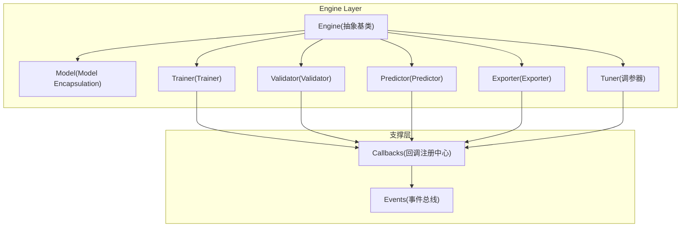
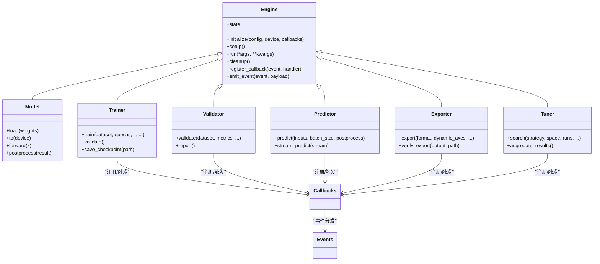
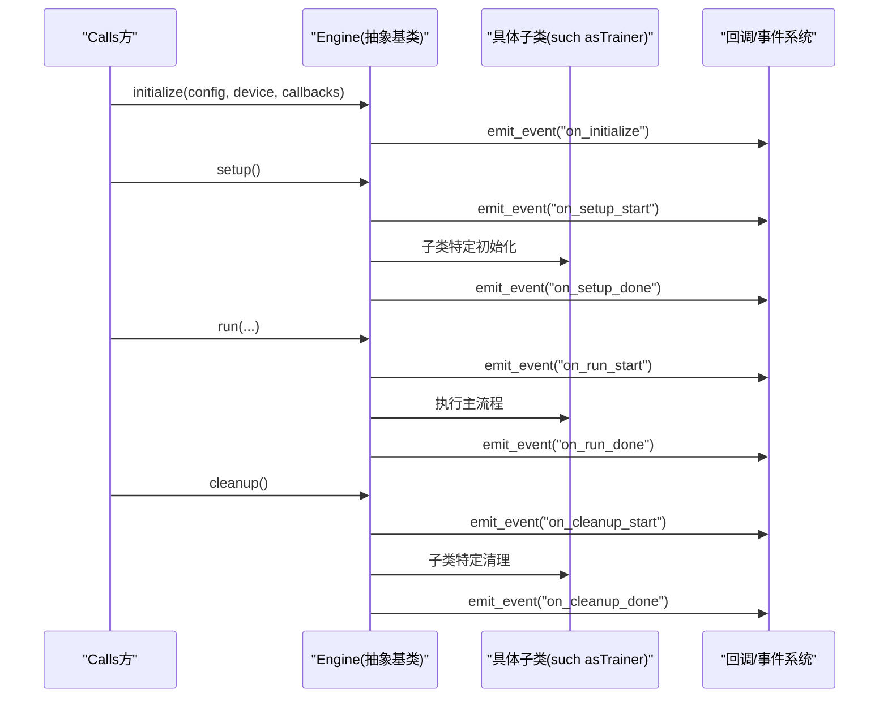
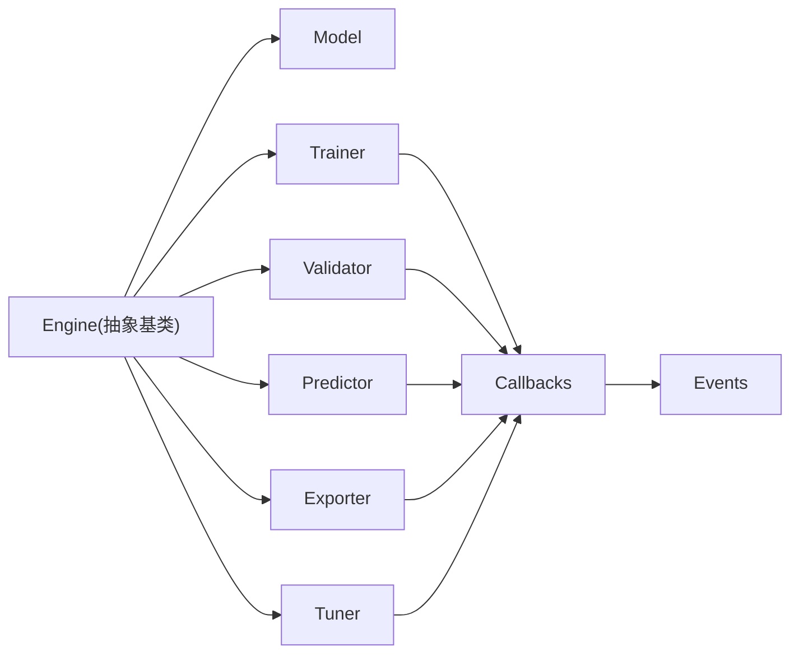

# Engine基类接口

<cite>
**Files Referenced in This Document**
- [engine/__init__.py](file://ultralytics/engine/__init__.py)
- [engine/model.py](file://ultralytics/engine/model.py)
- [engine/trainer.py](file://ultralytics/engine/trainer.py)
- [engine/validator.py](file://ultralytics/engine/validator.py)
- [engine/predictor.py](file://ultralytics/engine/predictor.py)
- [engine/exporter.py](file://ultralytics/engine/exporter.py)
- [engine/tuner.py](file://ultralytics/engine/tuner.py)
- [utils/callbacks/__init__.py](file://ultralytics/utils/callbacks/__init__.py)
- [utils/events.py](file://ultralytics/utils/events.py)
- [tests/test_engine.py](file://tests/test_engine.py)
</cite>

## Table of Contents
1. [Introduction](#Introduction)
2. [Project Structure](#Project Structure)
3. [Core Components](#Core Components)
4. [Architecture Overview](#Architecture Overview)
5. [Detailed Component Analysis](#Detailed Component Analysis)
6. [Dependency Analysis](#Dependency Analysis)
7. [性能考量](#性能考量)
8. [Troubleshooting Guide](#Troubleshooting Guide)
9. [Conclusion](#Conclusion)
10. [Appendix](#Appendix)

## Introduction
本文件forYOLO-Master中Engine抽象基类的权威APIDocumentation，聚焦于：
- 设计模式and抽象接口定义（初始化参数、配置管理、状态管理）
- 生命周期方法（such assetup()、cleanup()etc.）的Calls时机and扩展点
- 回调机制and事件处理系统的注册andUses方式
- 自定义Engine子类的开发指南（必须implementingandOptional重写的方法）
- 错误处理and异常管理的最佳实践
- such as何扩展EngineCentered onSupporting新的Tasks类型and算法implementing

## Project Structure
Engine相关代码位于ultralytics/engine包内，包含Model Encapsulation、Trainer、Validator、Predictor、Exporterand调参器etc.。关键入口and职责such as下：
- engine/__init__.py：对外暴露Engine抽象基类and常用子类
- engine/model.py：Model Encapsulationand统一Inference入口
- engine/trainer.py：Training流程编排and生命周期钩子
- engine/validator.py：Validation流程编排andMetrics收集
- engine/predictor.py：Inference流程编排and批处理
- engine/exporter.py：Model Export流程编排
- engine/tuner.py：超参搜索andOptimization流程编排
- utils/callbacks/__init__.py：回调注册中心
- utils/events.py：事件总线and事件分发

Figure Source
- [engine/__init__.py](file://ultralytics/engine/__init__.py)
- [engine/model.py](file://ultralytics/engine/model.py)
- [engine/trainer.py](file://ultralytics/engine/trainer.py)
- [engine/validator.py](file://ultralytics/engine/validator.py)
- [engine/predictor.py](file://ultralytics/engine/predictor.py)
- [engine/exporter.py](file://ultralytics/engine/exporter.py)
- [engine/tuner.py](file://ultralytics/engine/tuner.py)
- [utils/callbacks/__init__.py](file://ultralytics/utils/callbacks/__init__.py)
- [utils/events.py](file://ultralytics/utils/events.py)

Section Source
- [engine/__init__.py](file://ultralytics/engine/__init__.py)
- [engine/model.py](file://ultralytics/engine/model.py)
- [engine/trainer.py](file://ultralytics/engine/trainer.py)
- [engine/validator.py](file://ultralytics/engine/validator.py)
- [engine/predictor.py](file://ultralytics/engine/predictor.py)
- [engine/exporter.py](file://ultralytics/engine/exporter.py)
- [engine/tuner.py](file://ultralytics/engine/tuner.py)
- [utils/callbacks/__init__.py](file://ultralytics/utils/callbacks/__init__.py)
- [utils/events.py](file://ultralytics/utils/events.py)

## Core Components
本节概述Engine抽象基类and其主要子类的职责边界and协作关系。

- Engine抽象基类
  - provides统一的初始化参数解析、配置加载and校验、设备and后端选择、Loggingand进度条、回调and事件系统接入、资源清理etc.通用capabilities
  - 定义生命周期钩子（such assetup、run、cleanup），供具体Tasks子类覆盖
  - 维护内部状态机（未初始化、已准备、运行中、已完成、已清理etc.），确保可重入and幂etc.性

- Model（Model Encapsulation）
  - 负责模型权重加载、设备Migration、前向计算Encapsulates、结果Post-Processing
  - andEngine解耦，ViaUnified Interface被Trainer/Validator/Predictor/Exporter/Tuner复用

- Trainer（Trainer）
  - 编排Data Loading、Optimizer、损失、Evaluation、Checkpoint保存、Distributed Trainingetc.
  - whileepoch/batch级触发回调and事件

- Validator（Validator）
  - 编排Validation集遍历、Metrics计算、Visualization输出、结果汇总
  - whilestep/epoch级触发回调and事件

- Predictor（Predictor）
  - 编排输入预处理、Batch Inference、NMS/Post-Processing、结果序列化
  - Supporting流式and批处理两种模式

- Exporter（Exporter）
  - 编排Model Exportto多种格式（ONNX/TensorRT/OpenVINOetc.）
  - 执行Export前检查、动态轴设置、Export后Validation

- Tuner（调参器）
  - 编排超参搜索策略、并行/串行执行、结果聚合and报告生成

Section Source
- [engine/model.py](file://ultralytics/engine/model.py)
- [engine/trainer.py](file://ultralytics/engine/trainer.py)
- [engine/validator.py](file://ultralytics/engine/validator.py)
- [engine/predictor.py](file://ultralytics/engine/predictor.py)
- [engine/exporter.py](file://ultralytics/engine/exporter.py)
- [engine/tuner.py](file://ultralytics/engine/tuner.py)

## Architecture Overview
下图展示Engine抽象基类and其子类的继承关系Centered onand它们对回调and事件系统的依赖。

Figure Source
- [engine/__init__.py](file://ultralytics/engine/__init__.py)
- [engine/model.py](file://ultralytics/engine/model.py)
- [engine/trainer.py](file://ultralytics/engine/trainer.py)
- [engine/validator.py](file://ultralytics/engine/validator.py)
- [engine/predictor.py](file://ultralytics/engine/predictor.py)
- [engine/exporter.py](file://ultralytics/engine/exporter.py)
- [engine/tuner.py](file://ultralytics/engine/tuner.py)
- [utils/callbacks/__init__.py](file://ultralytics/utils/callbacks/__init__.py)
- [utils/events.py](file://ultralytics/utils/events.py)

## Detailed Component Analysis

### Engine抽象基类API
- 初始化参数
  - config：配置对象或路径，用于加载默认配置并合并User覆盖项
  - device：目标设备（CPU/GPU/多卡），由Automatic Device Selection逻辑决定
  - callbacks：回调字典或列表，按事件名映射处理器
  - logger：Logging器实例，Supporting控制台/文件/远程上报
  - progress：进度条/Visualization工具实例
- 配置管理
  - provides配置合并、校验、默认值填充、版本兼容性检查
  - Supporting运行时覆盖部分配置键
- 状态管理
  - 内部状态机：未初始化→已准备→运行中→已完成→已清理
  - provides状态查询and转换方法，保证幂etc.and可重入
- 生命周期方法
  - setup()：完成资源分配、模型加载、设备Migration、缓存预热、回调注册
  - run()：执行主流程（Training/Validation/Prediction/Export/调参），由子类implementing具体编排
  - cleanup()：释放显存、关闭文件句柄、清理临时Table of Contents、重置状态
- 回调and事件
  - register_callback(event, handler)：注册事件处理器
  - emit_event(event, payload)：分发事件，Supporting同步/异步处理器
  - Built-in事件包括：on_setup_start、on_setup_done、on_run_start、on_step、on_epoch、on_cleanup_start、on_cleanup_doneetc.

Section Source
- [engine/__init__.py](file://ultralytics/engine/__init__.py)
- [utils/callbacks/__init__.py](file://ultralytics/utils/callbacks/__init__.py)
- [utils/events.py](file://ultralytics/utils/events.py)

### 生命周期方法详解
- setup()
  - 作用：初始化阶段，加载配置、创建/恢复状态、准备IOand设备、注册回调
  - 典型顺序：校验配置→Selecting Device→Load model→构建Data Pipeline→注册回调→预热缓存
  - 幂etc.性：重复Calls应安全，避免重复分配资源
- run()
  - 作用：执行具体Tasks的主循环，由子类implementing
  - 建议：whilerun前后分别emit on_run_start/on_run_done事件，便于监控and统计
- cleanup()
  - 作用：资源回收and状态复位
  - 典型操作：删除临时文件、释放GPU内存、关闭网络/磁盘连接、重置状态机

Figure Source
- [engine/__init__.py](file://ultralytics/engine/__init__.py)
- [engine/trainer.py](file://ultralytics/engine/trainer.py)
- [utils/callbacks/__init__.py](file://ultralytics/utils/callbacks/__init__.py)
- [utils/events.py](file://ultralytics/utils/events.py)

### 回调机制and事件处理系统
- 回调注册中心
  - provides按事件名注册/注销处理器、批量注册、优先级控制
  - Supporting同步and异步处理器，允许抛出异常并由调度器捕获
- 事件总线
  - provides事件发布/订阅、过滤and路由、重试and超时控制
  - Built-in事件命名规范：on_<phase>_<event>，payloadfor结构化字典
- Uses建议
  - 将I/O、Logging、监控、Visualizationetc.横切关注点放入回调
  - 避免while回调中进行耗时计算，必要时异步化
  - 保持回调幂etc.，防止重复触发导致副作用

Section Source
- [utils/callbacks/__init__.py](file://ultralytics/utils/callbacks/__init__.py)
- [utils/events.py](file://ultralytics/utils/events.py)

### 自定义Engine子类开发指南
- 必须implementing的抽象方法
  - run()：implementing具体Tasks的编排逻辑
  - 若涉and数据/模型/Exportetc.复杂流程，建议拆分私有方法并whilerun中组合
- Optional重写的方法
  - setup()：自定义初始化流程（such as特殊设备准备、外部服务连接）
  - cleanup()：自定义清理流程（such as上传中间结果、清理远端资源）
  - _build_dataset()/_build_model()/_build_optimizer()：按需覆盖构建逻辑
  - _step()/_epoch_loop()：细粒度控制Training/Validation步级行for
- 推荐实践
  - whilerun前后emit on_run_start/on_run_done事件
  - while关键节点emit on_step/on_epoch事件，便于监控
  - Uses状态机保护关键段，避免并发访问冲突
  - 所有外部资源获取/释放成对出现，确保cleanup能正确回收

Section Source
- [engine/trainer.py](file://ultralytics/engine/trainer.py)
- [engine/validator.py](file://ultralytics/engine/validator.py)
- [engine/predictor.py](file://ultralytics/engine/predictor.py)
- [engine/exporter.py](file://ultralytics/engine/exporter.py)
- [engine/tuner.py](file://ultralytics/engine/tuner.py)

### 错误处理and异常管理最佳实践
- 异常分类
  - 配置错误：参数缺失/类型不匹配/版本不兼容
  - 资源错误：设备不可用/显存不足/磁盘空间不足
  - 数据错误：数据集损坏/标签格式不一致
  - 运行时错误：Gradient爆炸/NAN/除零/索引越界
- 处理策略
  - whileinitialize/setup阶段进行严格校验，尽早失败
  - whilerun主循环捕获可恢复异常，记录上下文并继续或优雅退出
  - whilecleanup中确保资源释放，即使发生异常也要执行
  - Uses事件系统上报错误事件，便于集中监控and告警
- 调试建议
  - 启用详细Loggingand堆栈Tracking
  - while关键步骤写入Checkpointand中间结果，便于断点复现
  - Uses测试用例覆盖常见错误路径

Section Source
- [tests/test_engine.py](file://tests/test_engine.py)

### 扩展EngineCentered onSupporting新Tasks类型and算法
- 新增Tasks类型
  - 新建子类继承Engine，implementingrun()and必要的构建方法
  - whileinitialize中注册该Tasks类型的配置键and默认值
  - while事件系统中定义新的事件名称，并while合适位置emit
- 集成新算法
  - 将算法核心Encapsulatesfor独立Modules，Via回调或插件机制注入
  - whilesetup中根据配置选择算法implementing，保持run逻辑稳定
  - providesExport/Validation/调参适配，确保全链路可用

Section Source
- [engine/__init__.py](file://ultralytics/engine/__init__.py)
- [utils/callbacks/__init__.py](file://ultralytics/utils/callbacks/__init__.py)
- [utils/events.py](file://ultralytics/utils/events.py)

## Dependency Analysis
Engineand各子类的依赖关系such as下：
- Engine作for抽象基类，被Model/Trainer/Validator/Predictor/Exporter/Tuner继承
- 各子类Via回调注册中心and事件总线进行横切功能扩展
- 配置andDevice Selection由Engine统一管理，降低子类耦合度

Figure Source
- [engine/__init__.py](file://ultralytics/engine/__init__.py)
- [engine/model.py](file://ultralytics/engine/model.py)
- [engine/trainer.py](file://ultralytics/engine/trainer.py)
- [engine/validator.py](file://ultralytics/engine/validator.py)
- [engine/predictor.py](file://ultralytics/engine/predictor.py)
- [engine/exporter.py](file://ultralytics/engine/exporter.py)
- [engine/tuner.py](file://ultralytics/engine/tuner.py)
- [utils/callbacks/__init__.py](file://ultralytics/utils/callbacks/__init__.py)
- [utils/events.py](file://ultralytics/utils/events.py)

Section Source
- [engine/__init__.py](file://ultralytics/engine/__init__.py)
- [utils/callbacks/__init__.py](file://ultralytics/utils/callbacks/__init__.py)
- [utils/events.py](file://ultralytics/utils/events.py)

## 性能考量
- 设备and内存
  - Set appropriatelybatch sizeand预取线程数，避免显存碎片
  - whilesetup中预热模型andData Pipeline，减少首次延迟
- I/Oand存储
  - Uses持久化缓存and增量更新，避免重复下载/解压
  - whilecleanup中and时释放临时文件，避免磁盘膨胀
- 事件and回调
  - 避免while回调中执行阻塞I/O，必要时异步化
  - 对高频事件（such ason_step）进行采样或节流
- 分布式and并行
  - whileTrainer中合理UsesDDP/FSDP，注意Gradient同步and通信开销
  - whileTuner中控制并行度，避免资源争用

[本节for通用指导，无需列出具体文件来源]

## Troubleshooting Guide
- 常见问题
  - 配置加载失败：检查配置文件路径、键名and类型
  - 设备不可用：确认CUDAdrivers are installed、PyTorch后端and权限
  - 显存不足：减小batch size、启用Mixture精度或Gradient累积
  - 数据损坏：校验数据集完整性and标签格式
- 定位手段
  - 启用详细Logging，查看事件序列and堆栈信息
  - while关键步骤写入Checkpoint，断点复现问题
  - Uses最小可复现实例隔离问题范围
- 恢复策略
  - 从最近Checkpoint恢复Training/Validation
  - 回滚配置变更，逐步引入新特性
  - 降级toCPU或单卡模式进行诊断

Section Source
- [tests/test_engine.py](file://tests/test_engine.py)

## Conclusion
Engine抽象基类forYOLO-Masterprovides了统一的初始化、配置、状态、生命周期and扩展点。Via清晰的职责划分and事件/回调机制，开发者可Centered on便捷地扩展新Tasksand算法，同时保持系统稳定性and可观测性。遵循本Documentation的最佳实践，可有效提升开发效率and系统可靠性。

[本节for总结性内容，无需列出具体文件来源]

## Appendix
- 术语表
  - 回调：while特定事件发生时执行的函数或方法
  - 事件：系统状态变化或关键步骤的通知消息
  - 生命周期：对象从创建to销毁的关键阶段
- Refer toimplementing
  - Trainer/Validator/Predictor/Exporter/Tuner的具体implementing可作for扩展Refer to

[本节for补充信息，无需列出具体文件来源]