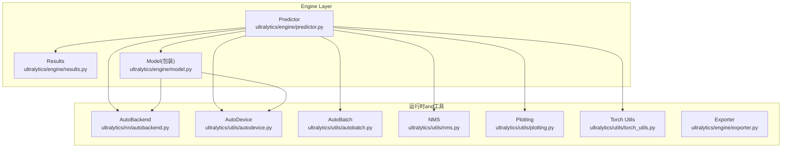
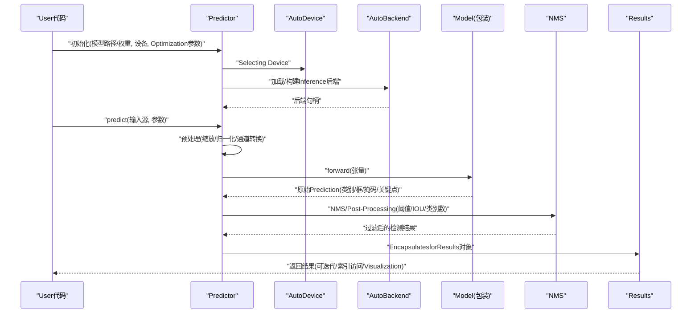
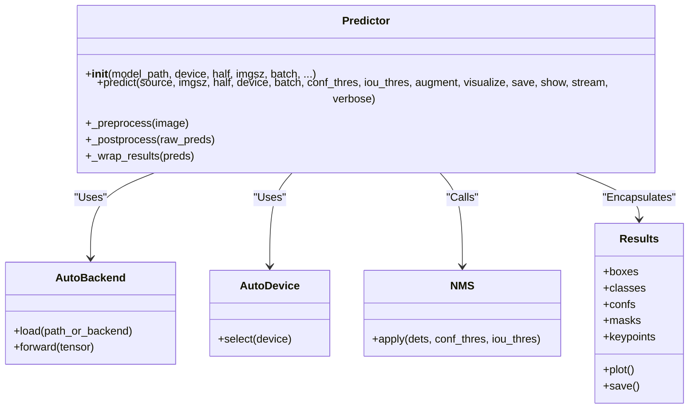
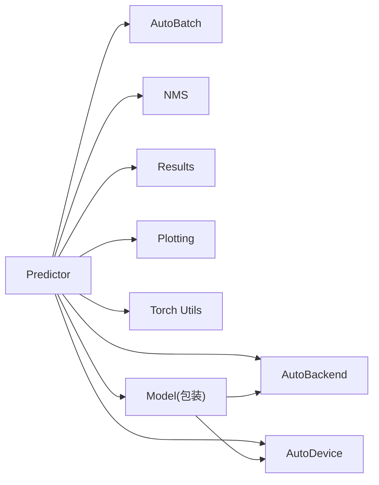

# PredictorPredictorAPI

<cite>
**Files Referenced in This Document**
- [predictor.py](file://ultralytics/engine/predictor.py)
- [results.py](file://ultralytics/engine/results.py)
- [model.py](file://ultralytics/engine/model.py)
- [autobackend.py](file://ultralytics/nn/autobackend.py)
- [autobatch.py](file://ultralytics/utils/autobatch.py)
- [autodevice.py](file://ultralytics/utils/autodevice.py)
- [exporter.py](file://ultralytics/engine/exporter.py)
- [torch_utils.py](file://ultralytics/utils/torch_utils.py)
- [nms.py](file://ultralytics/utils/nms.py)
- [plotting.py](file://ultralytics/utils/plotting.py)
</cite>

## Table of Contents
1. [Introduction](#Introduction)
2. [Project Structure](#Project Structure)
3. [Core Components](#Core Components)
4. [Architecture Overview](#Architecture Overview)
5. [Detailed Component Analysis](#Detailed Component Analysis)
6. [Dependency Analysis](#Dependency Analysis)
7. [Performance Considerations](#Performance Considerations)
8. [Troubleshooting Guide](#Troubleshooting Guide)
9. [Conclusion](#Conclusion)
10. [Appendix](#Appendix)

## Introduction
本文件for YOLO-Master 的 Predictor Predictor的 API Documentation，聚焦于 Predictor 类的Inference执行接口andUses方式。内容涵盖：
- predict() 方法的输入格式Supportingand输出Result Processing
- 模型加载、预热andOptimization配置
- Batch Inferenceand流式Inference的implementing接口
- Inference结果的Encapsulates格式andPost-Processing选项
- 内存管理and资源Optimization配置
- 实时Inference的性能调优技巧and最佳实践
- 自定义Inference流程and预处理/Post-Processing扩展方法

## Project Structure
Predictor 位于Engine Layer，负责将User输入（图像、视频、摄像头etc.）转换for张量、Executing Inference并返回结构化结果。其关键依赖包括自动后端选择、设备管理、自动批大小、NMS 和Post-ProcessingVisualizationetc.Modules。

Figure Source
- [predictor.py](file://ultralytics/engine/predictor.py)
- [results.py](file://ultralytics/engine/results.py)
- [model.py](file://ultralytics/engine/model.py)
- [autobackend.py](file://ultralytics/nn/autobackend.py)
- [autobatch.py](file://ultralytics/utils/autobatch.py)
- [autodevice.py](file://ultralytics/utils/autodedevice.py)
- [nms.py](file://ultralytics/utils/nms.py)
- [plotting.py](file://ultralytics/utils/plotting.py)
- [torch_utils.py](file://ultralytics/utils/torch_utils.py)
- [exporter.py](file://ultralytics/engine/exporter.py)

Section Source
- [predictor.py](file://ultralytics/engine/predictor.py)
- [results.py](file://ultralytics/engine/results.py)
- [model.py](file://ultralytics/engine/model.py)
- [autobackend.py](file://ultralytics/nn/autobackend.py)
- [autobatch.py](file://ultralytics/utils/autobatch.py)
- [autodevice.py](file://ultralytics/utils/autodedevice.py)
- [nms.py](file://ultralytics/utils/nms.py)
- [plotting.py](file://ultralytics/utils/plotting.py)
- [torch_utils.py](file://ultralytics/utils/torch_utils.py)
- [exporter.py](file://ultralytics/engine/exporter.py)

## Core Components
- Predictor：统一Inference入口，负责Data Loading、预处理、模型Calls、Post-Processingand结果Encapsulates。
- Results：Inference结果的数据容器，provides统一的访问接口andVisualizationcapabilities。
- AutoBackend：根据Export格式和设备自动选择最优Inference后端（such as ONNXRuntime、TensorRT、OpenVINO、TorchScript etc.）。
- AutoDevice：Device Selectionand切换（CPU/GPU/CUDA/MPS etc.）。
- AutoBatch：动态批大小计算and调度，提升吞吐。
- NMS：Non-Maximum Suppression，过滤冗余框。
- Plotting：结果Visualization辅助。
- Exporter：Model ExportandOptimization（用于离线Optimizationand部署）。

Section Source
- [predictor.py](file://ultralytics/engine/predictor.py)
- [results.py](file://ultralytics/engine/results.py)
- [autobackend.py](file://ultralytics/nn/autobackend.py)
- [autobatch.py](file://ultralytics/utils/autobatch.py)
- [autodevice.py](file://ultralytics/utils/autodedevice.py)
- [nms.py](file://ultralytics/utils/nms.py)
- [plotting.py](file://ultralytics/utils/plotting.py)
- [exporter.py](file://ultralytics/engine/exporter.py)

## Architecture Overview
下图展示了从UserCallsto结果输出的端to端流程，Centered onand各组件之间的交互关系。

Figure Source
- [predictor.py](file://ultralytics/engine/predictor.py)
- [results.py](file://ultralytics/engine/results.py)
- [autobackend.py](file://ultralytics/nn/autobackend.py)
- [autodevice.py](file://ultralytics/utils/autodedevice.py)
- [nms.py](file://ultralytics/utils/nms.py)
- [model.py](file://ultralytics/engine/model.py)

## Detailed Component Analysis

### Predictor 类and predict() 接口
- 初始化and生命周期
  - Supporting传入模型权重或已Export的Inference后端文件；自动检测设备and后端。
  - 可配置是否启用半精度、固定输入尺寸、动态形状、线程并行etc.。
- predict() 输入格式
  - 单张图像：Supporting PIL.Image、OpenCV 矩阵、numpy 数组、文件路径、URL。
  - 批量输入：列表/生成器形式的多张图像或路径。
  - 视频/摄像头：Via迭代帧implementing流式Inference。
  - 其他：Supporting字典/命名元组etc.结构化输入（若框架暴露相应 loader）。
- predict() 输出
  - 返回 Results 对象的迭代器或列表；每个元素对应一个输入样本。
  - Results provides box、class、conf、mask、keypoints etc.属性访问andVisualization方法。
- 关键参数（Examples说明，具体Centered on源码for准）
  - imgsz：输入尺寸或尺寸列表（Supporting动态形状）。
  - half：是否Uses半精度Inference。
  - device：指定运行设备。
  - batch：批大小；None 时由 AutoBatch 自动计算。
  - conf_thres / iou_thres：NMS 阈值。
  - augment：是否开启测试时增强（TTA）。
  - visualize：是否保存中间特征图用于调试。
  - save / show：是否保存/显示Visualization结果。
  - stream：是否Centered on流式模式返回结果。
  - verbose：Logging级别。
- Typical Usage要点
  - 单图/多图：直接传入图像或路径列表。
  - 视频/摄像头：逐帧Calls predict() 或while循环中迭代。
  - 批量：设置 batch > 1 或Uses DataLoader 风格的输入。

Section Source
- [predictor.py](file://ultralytics/engine/predictor.py)
- [results.py](file://ultralytics/engine/results.py)

#### 类and方法关系图

Figure Source
- [predictor.py](file://ultralytics/engine/predictor.py)
- [results.py](file://ultralytics/engine/results.py)
- [autobackend.py](file://ultralytics/nn/autobackend.py)
- [autodevice.py](file://ultralytics/utils/autodedevice.py)
- [nms.py](file://ultralytics/utils/nms.py)

### 模型加载、预热andOptimization配置
- 模型加载
  - Supporting .pt/.onnx/.engine/.openvino/.tflite etc.格式；AutoBackend 自动选择最优后端。
  - 可Via exporter 提前Exporting to特定后端Centered on获得更好性能。
- 预热（Warmup）
  - 首次Inference通常较慢，建议进行若干次空跑预热Centered on稳定延迟。
  - 可while初始化后Calls一次 dummy predict 完成预热。
- Optimization配置
  - half：启用半精度（需后端Supporting）。
  - imgsz：固定尺寸可减少动态形状开销；必要时Uses动态形状列表。
  - device：优先 GPU/CUDA；while Apple Silicon 上can use MPS。
  - export：Uses Exporter 生成Optimization版本（such as TensorRT、ONNXRuntime、OpenVINO）。

Section Source
- [autobackend.py](file://ultralytics/nn/autobackend.py)
- [exporter.py](file://ultralytics/engine/exporter.py)
- [torch_utils.py](file://ultralytics/utils/torch_utils.py)

### Batch Inferenceand流式Inference
- Batch Inference
  - 设置 batch > 1 或将多张图像打包for列表/生成器传入。
  - AutoBatch 可根据显存/内存自动调整批大小。
- 流式Inference
  - 对视频/摄像头逐帧Calls predict()，或Uses stream=True 获取迭代器。
  - 适合低延迟场景，注意控制预处理/Post-Processing耗时。

Section Source
- [autobatch.py](file://ultralytics/utils/autobatch.py)
- [predictor.py](file://ultralytics/engine/predictor.py)

### Inference结果EncapsulatesandPost-Processing
- 结果Encapsulates
  - Results 对象包含 boxes、classes、confs、masks、keypoints etc.字段。
  - provides plot()/save()/show() etc.便捷方法。
- Post-Processing选项
  - NMS 阈值 conf_thres/iou_thres。
  - 类别数量限制、置信度裁剪、掩码/关键点过滤。
  - Optional TTA（测试时增强）Centered on提升鲁棒性但增加延迟。

Section Source
- [results.py](file://ultralytics/engine/results.py)
- [nms.py](file://ultralytics/utils/nms.py)
- [predictor.py](file://ultralytics/engine/predictor.py)

### 内存管理and资源Optimization
- 设备and精度
  - 合理选择 device and half，避免不必要的跨设备拷贝。
- 批大小and输入尺寸
  - Uses AutoBatch 自动选择；固定 imgsz 减少动态分配。
- 缓存and复用
  - 重用 Predictor 实例，避免重复Load model。
  - 复用输入缓冲区（while流式场景中）。
- 清理and释放
  - and时释放不再Uses的张量and中间结果；必要时显式清空缓存。

Section Source
- [autobatch.py](file://ultralytics/utils/autobatch.py)
- [autodevice.py](file://ultralytics/utils/autodedevice.py)
- [torch_utils.py](file://ultralytics/utils/torch_utils.py)

### 实时Inference Performance调优and最佳实践
- 降低预处理/Post-Processing开销：向量化操作、减少 Python 循环。
- 固定输入尺寸and批大小：减少动态形状带来的额外开销。
- Uses半精度and专用后端：such as TensorRT/OpenVINO/ONNXRuntime。
- 预热and预分配：启动阶段进行若干次 warmup。
- 流水线并行：预处理、Inference、Post-Processing异步化（生产者-消费者队列）。
- 监控and诊断：记录每帧耗时，定位bottlenecks。

[This section provides general guidance and does not directly analyze specific files]

### 自定义Inference流程and扩展点
- 自定义预处理
  - while预处理阶段插入自定义变换（such as ROI 裁剪、颜色校正）。
- 自定义Post-Processing
  - 替换 NMS 策略或添加业务规则（such as区域计数、Trajectory Association）。
- 自定义Visualization
  - 基于 Results.plot() 扩展标注样式或叠加业务信息。
- 集成第三方后端
  - Via AutoBackend 适配新后端或自定义Inference引擎。

Section Source
- [predictor.py](file://ultralytics/engine/predictor.py)
- [results.py](file://ultralytics/engine/results.py)
- [autobackend.py](file://ultralytics/nn/autobackend.py)
- [plotting.py](file://ultralytics/utils/plotting.py)

## Dependency Analysis
Predictor and多个运行时and工具Modules存while强耦合，确保高内聚and低耦合的关键while于清晰的接口契约and稳定的数据结构（Results）。

Figure Source
- [predictor.py](file://ultralytics/engine/predictor.py)
- [results.py](file://ultralytics/engine/results.py)
- [autobackend.py](file://ultralytics/nn/autobackend.py)
- [autobatch.py](file://ultralytics/utils/autobatch.py)
- [autodevice.py](file://ultralytics/utils/autodedevice.py)
- [nms.py](file://ultralytics/utils/nms.py)
- [plotting.py](file://ultralytics/utils/plotting.py)
- [torch_utils.py](file://ultralytics/utils/torch_utils.py)
- [model.py](file://ultralytics/engine/model.py)

Section Source
- [predictor.py](file://ultralytics/engine/predictor.py)
- [results.py](file://ultralytics/engine/results.py)
- [autobackend.py](file://ultralytics/nn/autobackend.py)
- [autobatch.py](file://ultralytics/utils/autobatch.py)
- [autodevice.py](file://ultralytics/utils/autodedevice.py)
- [nms.py](file://ultralytics/utils/nms.py)
- [plotting.py](file://ultralytics/utils/plotting.py)
- [torch_utils.py](file://ultralytics/utils/torch_utils.py)
- [model.py](file://ultralytics/engine/model.py)

## Performance Considerations
- 选择合适的后端andExport格式，Preferhardware acceleration。
- 固定输入尺寸and批大小，减少动态分配and内核编译开销。
- 预热模型and预分配缓冲区，降低首帧延迟。
- Uses半精度and内存池，提高吞吐。
- 采用异步流水线and零拷贝策略，降低 CPU-GPU 同步成本。
- 监控Metrics：FPS、P95/P99 延迟、GPU 利用率、内存峰值。

[This section provides general guidance and does not directly analyze specific files]

## Troubleshooting Guide
- 设备不可用或显存不足
  - 检查 device 选择and half 配置；降低 batch 或 imgsz。
- 后端加载失败
  - 确认Export文件完整且and目标平台兼容；重新Export。
- 结果异常或漏检
  - 调整 conf_thres/iou_thres；检查预处理是否正确；尝试 TTA。
- 延迟抖动
  - 进行预热；固定输入尺寸；避免频繁创建/销毁 Predictor。
- Visualization问题
  - 检查图像维度and通道顺序；确认 Results 字段有效。

Section Source
- [autodevice.py](file://ultralytics/utils/autodedevice.py)
- [autobackend.py](file://ultralytics/nn/autobackend.py)
- [results.py](file://ultralytics/engine/results.py)
- [predictor.py](file://ultralytics/engine/predictor.py)

## Conclusion
Predictor provides了统一、灵活且高性能的Inference接口，Combining AutoBackend、AutoBatch、NMS and Results etc.组件，能够covering from单图to视频流的多场景需求。Via合理的模型加载、预热andOptimization配置，可implementing低延迟and高吞吐的实时Inference。同时，预留的扩展点便于接入自定义预处理/Post-Processing逻辑and第三方后端。

[This section is summary content and does not directly analyze specific files]

## Appendix
- 快速上手
  - 初始化 Predictor，传入模型路径and设备。
  - Calls predict() 传入图像或路径列表。
  - 遍历 Results 对象获取检测结果并进行Visualization或持久化。
- Refer to路径
  - 初始化and predict 主流程：[predictor.py](file://ultralytics/engine/predictor.py)
  - 结果结构andVisualization：[results.py](file://ultralytics/engine/results.py)
  - 后端选择and加载：[autobackend.py](file://ultralytics/nn/autobackend.py)
  - Device Selection：[autodevice.py](file://ultralytics/utils/autodedevice.py)
  - 批大小自适应：[autobatch.py](file://ultralytics/utils/autobatch.py)
  - NMS implementing：[nms.py](file://ultralytics/utils/nms.py)
  - Visualization辅助：[plotting.py](file://ultralytics/utils/plotting.py)
  - 模型包装andCalls：[model.py](file://ultralytics/engine/model.py)
  - ExportandOptimization：[exporter.py](file://ultralytics/engine/exporter.py)
  - 张量and工具函数：[torch_utils.py](file://ultralytics/utils/torch_utils.py)