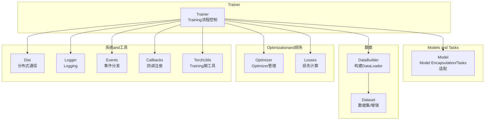
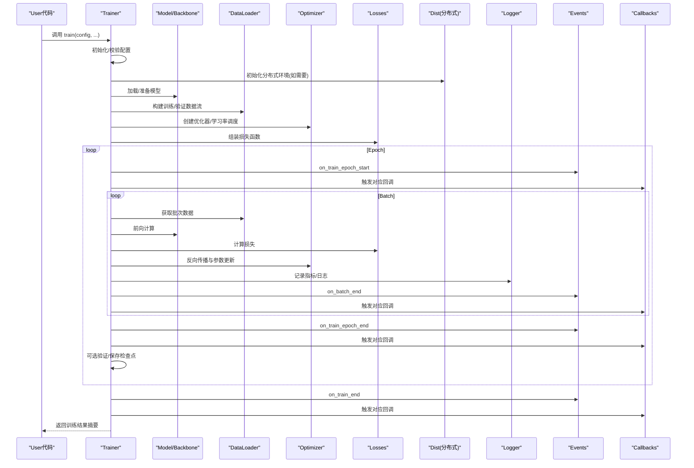
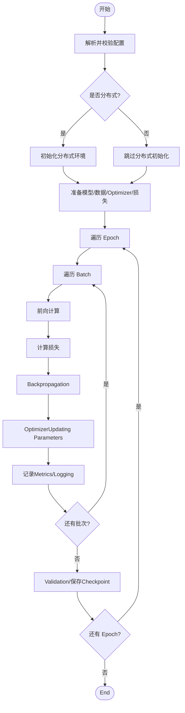
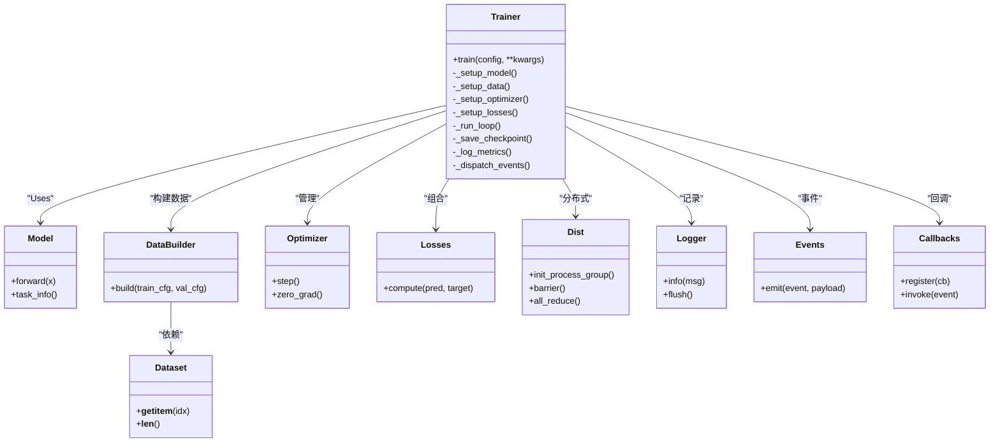

# TrainerTrainerAPI

<cite>
**Files Referenced in This Document**
- [trainer.py](file://ultralytics/engine/trainer.py)
- [model.py](file://ultralytics/engine/model.py)
- [build.py](file://ultralytics/data/build.py)
- [dataset.py](file://ultralytics/data/dataset.py)
- [loss.py](file://ultralytics/utils/loss.py)
- [dist.py](file://ultralytics/utils/dist.py)
- [logger.py](file://ultralytics/utils/logger.py)
- [events.py](file://ultralytics/utils/events.py)
- [callbacks/__init__.py](file://ultralytics/utils/callbacks/__init__.py)
- [torch_utils.py](file://ultralytics/utils/torch_utils.py)
</cite>

## Table of Contents
1. [Introduction](#Introduction)
2. [Project Structure](#Project Structure)
3. [Core Components](#Core Components)
4. [Architecture Overview](#Architecture Overview)
5. [Detailed Component Analysis](#Detailed Component Analysis)
6. [Dependency Analysis](#Dependency Analysis)
7. [性能考量](#性能考量)
8. [Troubleshooting Guide](#Troubleshooting Guide)
9. [Conclusion](#Conclusion)
10. [Appendix](#Appendix)

## Introduction
本文件for YOLO-Master 的 Trainer Trainer API Documentation，聚焦于Training流程控制、配置对象、损失andOptimization、Data Loading、Distributed Training、监控LoggingandCheckpoint保存、Centered onand自定义Training流程and回调扩展。读者可Via本文快速掌握such as何CallsTraining接口、such as何配置Training参数、Centered onandsuch as何扩展和定制Training行for。

## Project Structure
Trainer 位于Engine Layer，负责编排模型、数据、Optimizer、损失、Logging、Checkpointand分布式通信etc.子系统。其关键依赖包括：
- Model EncapsulationandTasks适配（engine/model）
- 数据构建and数据集（data/build, data/dataset）
- Loss FunctionandMetrics（utils/loss, utils/metrics）
- 分布式工具（utils/dist）
- Loggingand事件系统（utils/logger, utils/events）
- 回调注册中心（utils/callbacks）
- Training期常用工具（utils/torch_utils）

Figure Source
- [trainer.py](file://ultralytics/engine/trainer.py)
- [model.py](file://ultralytics/engine/model.py)
- [build.py](file://ultralytics/data/build.py)
- [dataset.py](file://ultralytics/data/dataset.py)
- [loss.py](file://ultralytics/utils/loss.py)
- [dist.py](file://ultralytics/utils/dist.py)
- [logger.py](file://ultralytics/utils/logger.py)
- [events.py](file://ultralytics/utils/events.py)
- [callbacks/__init__.py](file://ultralytics/utils/callbacks/__init__.py)
- [torch_utils.py](file://ultralytics/utils/torch_utils.py)

Section Source
- [trainer.py](file://ultralytics/engine/trainer.py)
- [model.py](file://ultralytics/engine/model.py)
- [build.py](file://ultralytics/data/build.py)
- [dataset.py](file://ultralytics/data/dataset.py)
- [loss.py](file://ultralytics/utils/loss.py)
- [dist.py](file://ultralytics/utils/dist.py)
- [logger.py](file://ultralytics/utils/logger.py)
- [events.py](file://ultralytics/utils/events.py)
- [callbacks/__init__.py](file://ultralytics/utils/callbacks/__init__.py)
- [torch_utils.py](file://ultralytics/utils/torch_utils.py)

## Core Components
- Trainer 类
  - 职责：Training生命周期管理、循环控制、进度条andLogging、Checkpoint保存、分布式协调、回调调度。
  - 入口方法：train()，用于启动一次完整的Training过程。
- TrainingConfig 配置对象
  - 职责：集中管理Training超参、路径、设备、分布式、LoggingandCheckpoint策略etc.。
  - Uses方式：Via构造或从配置文件解析得to，传入 Trainer 初始化或 train() Calls。
- Data Loading器集成
  - 职责：根据配置构建 DataLoader，Supporting多进程、缓存、批处理and动态尺寸etc.。
- 损失andOptimization
  - 职责：组合多Tasks损失、按权重聚合；管理Optimizer、Learning Rate调度andGradient更新。
- Distributed Training
  - 职责：DDP/多进程环境下的同步、广播、归约and错误传播。
- 监控andLogging
  - 职责：TrainingMetrics记录、Visualization后端对接、事件分发and回调触发。
- Checkpointand恢复
  - 职责：周期性保存/加载权重、Optimizer状态、Training进度and随机种子。

Section Source
- [trainer.py](file://ultralytics/engine/trainer.py)
- [model.py](file://ultralytics/engine/model.py)
- [build.py](file://ultralytics/data/build.py)
- [dataset.py](file://ultralytics/data/dataset.py)
- [loss.py](file://ultralytics/utils/loss.py)
- [dist.py](file://ultralytics/utils/dist.py)
- [logger.py](file://ultralytics/utils/logger.py)
- [events.py](file://ultralytics/utils/events.py)
- [callbacks/__init__.py](file://ultralytics/utils/callbacks/__init__.py)
- [torch_utils.py](file://ultralytics/utils/torch_utils.py)

## Architecture Overview
下图展示了 Trainer whileTraining过程中的主要交互：UserCalls train()，Trainer 初始化并装配模型、数据、Optimizerand损失，进入 epoch/batch 循环，执行前向、损失计算、反向andOptimization步骤，并while每个阶段触发回调andLogging。

Figure Source
- [trainer.py](file://ultralytics/engine/trainer.py)
- [model.py](file://ultralytics/engine/model.py)
- [build.py](file://ultralytics/data/build.py)
- [loss.py](file://ultralytics/utils/loss.py)
- [dist.py](file://ultralytics/utils/dist.py)
- [logger.py](file://ultralytics/utils/logger.py)
- [events.py](file://ultralytics/utils/events.py)
- [callbacks/__init__.py](file://ultralytics/utils/callbacks/__init__.py)

## Detailed Component Analysis

### Trainer.train() 方法andTraining循环控制
- 功能概述
  - 接收Training ConfigurationandOptional覆盖参数，完成环境初始化、资源准备、Training循环and收尾工作。
  - Supporting断点续训、早停、Validation周期、Checkpoint策略and进度展示。
- 关键参数类别（Centered on配置对象for主）
  - 数据相关：数据集路径、批大小、Data Augmentation、多进程数、缓存策略etc.。
  - 模型相关：Pre-trained Weights、冻结策略、Mixture精度、编译选项etc.。
  - Optimization相关：Optimizer类型、初始Learning Rate、权重衰减、动量、Learning Rate调度器etc.。
  - Training控制：总轮次、每轮步数、Validation间隔、保存间隔、早停阈值etc.。
  - 分布式相关：进程数、节点信息、端口、后端选择etc.。
  - Loggingand监控：LoggingTable of Contents、Visualization后端、MetricsExport格式etc.。
- Training循环要点
  - Epoch/Batch 双层循环，内部包含数据拉取、前向、损失、反向、Optimization、Metrics统计andLogging。
  - while每个阶段前后触发事件and回调，便于外部扩展。
  - Supporting中断恢复and异常保护，确保Checkpoint一致性。
- 返回值
  - 通常返回Training摘要（含最终Metrics、最佳权重路径、Logging位置etc.）。

Section Source
- [trainer.py](file://ultralytics/engine/trainer.py)
- [events.py](file://ultralytics/utils/events.py)
- [callbacks/__init__.py](file://ultralytics/utils/callbacks/__init__.py)

### TrainingConfig 配置对象
- 作用
  - 统一承载Training所需的所有可配置项，provides默认值、校验and合并逻辑。
- 常见字段分组
  - 路径and输出：数据Root Directory、权重保存Table of Contents、LoggingTable of Contents、实验名etc.。
  - 设备and并行：目标设备、批大小、数据并行线程、内存限制etc.。
  - Models and Tasks：Tasks类型、模型配置、Pre-trained Weights、冻结层etc.。
  - Optimizationand正则：Optimizer、Learning Rate、权重衰减、Gradient裁剪、EMA etc.。
  - 分布式：后端、进程数、节点索引、端口etc.。
  - 监控andCheckpoint：Logging频率、Validation频率、保存策略、自动清理etc.。
- Uses建议
  - 优先Via YAML/JSON 配置加载，再while代码中按需覆盖。
  - 对敏感或易变参数进行严格校验，避免运行时错误。

Section Source
- [trainer.py](file://ultralytics/engine/trainer.py)

### Data Loading器集成and批处理管理
- 构建流程
  - 依据配置解析数据集路径andTasks类型，实例化数据集and增强管线。
  - 构建 DataLoader，设置批大小、多进程、缓存、打乱and持久化 worker。
- 批处理机制
  - Supporting动态尺寸and填充策略，保证 GPU 利用率and显存稳定。
  - OptionalMixture精度andGradient累积，提升吞吐and稳定性。
- 性能Optimization
  - 数据预取、I/O 缓存、NUMA 亲和性、磁盘 IO 调优etc.。

Section Source
- [build.py](file://ultralytics/data/build.py)
- [dataset.py](file://ultralytics/data/dataset.py)
- [trainer.py](file://ultralytics/engine/trainer.py)

### Loss Function计算andGradient更新
- Loss combination
  - 根据Tasks类型and配置组装多Tasks损失，Supporting权重调节and条件启用。
- 反向andOptimization
  - 执行 loss.backward()，由Optimizer执行 step()，必要时进行Gradient裁剪and缩放。
  - Supporting EMA 平滑、Gradient累积andMixture精度加速。
- 数值稳定性
  - 针对 NaN/Inf 检测and回退策略，保障Training鲁棒性。

Section Source
- [loss.py](file://ultralytics/utils/loss.py)
- [trainer.py](file://ultralytics/engine/trainer.py)
- [torch_utils.py](file://ultralytics/utils/torch_utils.py)

### Optimizer管理andLearning Rate调度
- Optimizer
  - 根据配置选择Optimizer，绑定模型参数组，Supporting不同参数组的差异化Learning Rate。
- Learning Rate调度
  - Supporting多种调度策略（余弦、阶梯、多项式etc.），可按 epoch 或 step 更新。
- 状态管理
  - 将Optimizer状态纳入Checkpoint，Supporting断点续训andMigration。

Section Source
- [trainer.py](file://ultralytics/engine/trainer.py)

### Distributed Trainingand多GPU配置
- 模式
  - Supporting单机多卡（DDP）and多机多卡，自动发现设备and进程拓扑。
- 初始化and同步
  - 初始化后端、设置本地 rank/world_size，广播模型and状态。
- 数据并行
  - 数据分片and跨进程归约，保证Metrics一致性andLoad Balancing。
- 容错and诊断
  - 进程崩溃捕获、错误上报and堆栈收集，便于定位问题。

Section Source
- [dist.py](file://ultralytics/utils/dist.py)
- [trainer.py](file://ultralytics/engine/trainer.py)

### Training监控、LoggingandCheckpoint保存
- 监控andLogging
  - Training/ValidationMetrics记录、曲线绘制、结构化LoggingExport。
  - 事件drivers are installed：while关键阶段触发事件，供外部系统订阅。
- Checkpoint
  - 周期性保存权重、Optimizer状态、Training进度and随机种子。
  - Supporting最佳模型标记、自动清理旧Checkpointand版本兼容。
- Visualization后端
  - 对接 TensorBoard、Weights & Biases etc.第三方平台。

Section Source
- [logger.py](file://ultralytics/utils/logger.py)
- [events.py](file://ultralytics/utils/events.py)
- [trainer.py](file://ultralytics/engine/trainer.py)

### 自定义Training流程and回调扩展
- 回调体系
  - 基于事件分发，provides丰富的钩子（epoch/batch 开始/End、Validation、保存etc.）。
  - 可while不修改核心Training逻辑的前提下注入自定义行for。
- Typical Usage
  - 自定义Metrics计算、动态调整超参、while线Visualization、告警and通知。
- 注册方式
  - Via回调注册中心添加自定义回调函数或类。

Section Source
- [callbacks/__init__.py](file://ultralytics/utils/callbacks/__init__.py)
- [events.py](file://ultralytics/utils/events.py)
- [trainer.py](file://ultralytics/engine/trainer.py)

### Training流程图（算法视角）

Figure Source
- [trainer.py](file://ultralytics/engine/trainer.py)
- [dist.py](file://ultralytics/utils/dist.py)
- [logger.py](file://ultralytics/utils/logger.py)

## Dependency Analysis
- Trainer and Model
  - Trainer 依赖 Model EncapsulatesCentered on适配不同Tasks的前向andPost-Processing。
- Trainer and Data
  - Trainer Via DataBuilder 构建 DataLoader，并消费 Dataset provides的样本and标注。
- Trainer and Loss/Optimizer
  - Trainer 组合损失、管理OptimizerandLearning Rate调度，执行反向and更新。
- Trainer and Dist
  - Trainer while分布式模式下协调进程间通信and状态同步。
- Trainer and Logger/Events/Callbacks
  - Trainer Via事件系统触发回调，统一记录LoggingandMetrics。

Figure Source
- [trainer.py](file://ultralytics/engine/trainer.py)
- [model.py](file://ultralytics/engine/model.py)
- [build.py](file://ultralytics/data/build.py)
- [dataset.py](file://ultralytics/data/dataset.py)
- [loss.py](file://ultralytics/utils/loss.py)
- [dist.py](file://ultralytics/utils/dist.py)
- [logger.py](file://ultralytics/utils/logger.py)
- [events.py](file://ultralytics/utils/events.py)
- [callbacks/__init__.py](file://ultralytics/utils/callbacks/__init__.py)

Section Source
- [trainer.py](file://ultralytics/engine/trainer.py)
- [model.py](file://ultralytics/engine/model.py)
- [build.py](file://ultralytics/data/build.py)
- [dataset.py](file://ultralytics/data/dataset.py)
- [loss.py](file://ultralytics/utils/loss.py)
- [dist.py](file://ultralytics/utils/dist.py)
- [logger.py](file://ultralytics/utils/logger.py)
- [events.py](file://ultralytics/utils/events.py)
- [callbacks/__init__.py](file://ultralytics/utils/callbacks/__init__.py)

## 性能考量
- 数据 I/O
  - Set appropriately多进程数and缓存，避免磁盘bottlenecks；Uses持久化 worker 减少重复开销。
- 批大小and显存
  - Combining动态尺寸andGradient累积to balance throughput and memory usage。
- Mixture精度and编译
  - 开启 AMP and torch.compile（若可用）Centered on提升速度。
- 分布式效率
  - 均衡数据分片，避免 straggler；选择合适的后端and通信参数。
- LoggingandCheckpoint
  - 降低高频写入频率，采用异步落盘and增量保存。

[本节for通用指导，无需源码引用]

## Troubleshooting Guide
- 常见问题
  - 分布式初始化失败：检查端口占用、网络连通性and进程数配置。
  - 显存溢出：减小批大小、关闭不必要的Data Augmentation或启用Gradient累积。
  - Training不稳定：检查损失数值范围、Learning Rate过大、NaN/Inf 检测and回退。
  - Logging缺失：确认LoggingTable of Contents权限and后端配置。
- 定位手段
  - 启用详细Loggingand事件追踪，查看最近一次Checkpoint状态。
  - Uses最小复现脚本隔离问题，逐步注释Modules定位。

Section Source
- [logger.py](file://ultralytics/utils/logger.py)
- [events.py](file://ultralytics/utils/events.py)
- [trainer.py](file://ultralytics/engine/trainer.py)

## Conclusion
Trainer provides了完整且可扩展的Training框架，涵盖从配置to执行、从监控to保存的全链路capabilities。Via TrainingConfig 统一管理超参and路径，借助事件and回调implementing灵活扩展，Combined with分布式and性能Optimization策略，可满足从单卡to多机多卡的多样化Training需求。

[本节for总结，无需源码引用]

## Appendix
- 快速上手建议
  - 先Uses默认配置运行基线Training，再逐步替换数据and模型配置。
  - Via回调and事件接入Visualizationand告警，形成闭环反馈。
- Refer toExamples
  - Refer to仓库中的Training脚本and案例，对照本Documentation理解各参数的影响and组合效果。

[本节for补充说明，无需源码引用]