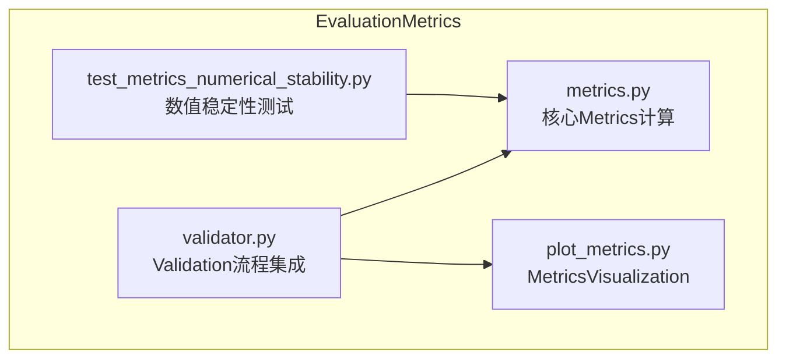
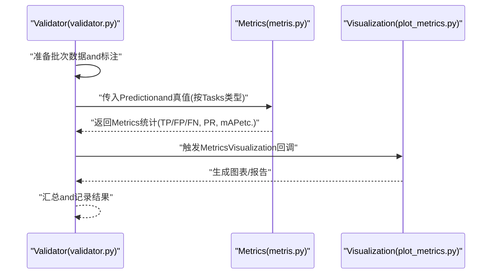
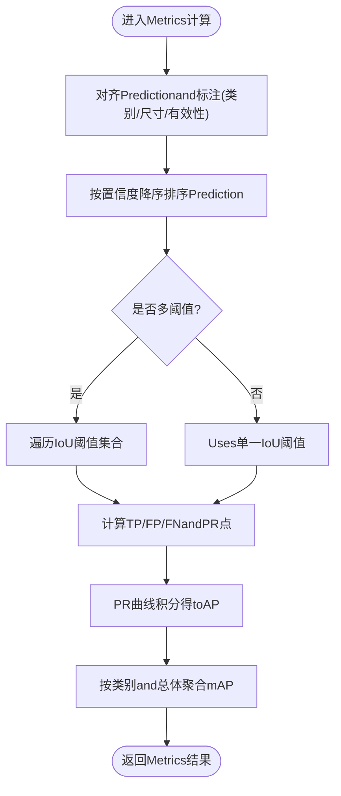
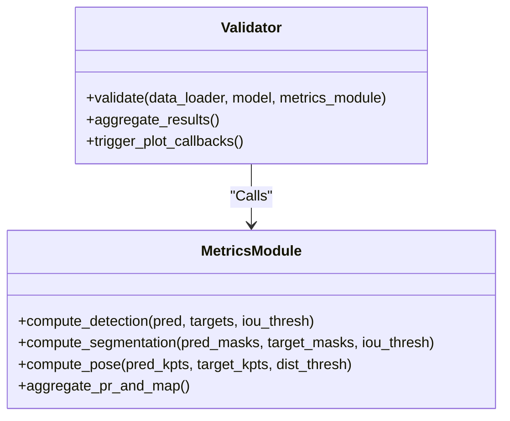
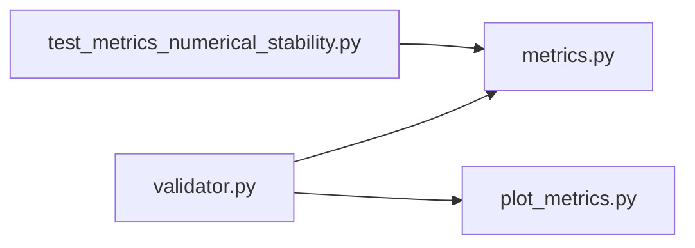

# EvaluationMetricsAPI

<cite>
**Files Referenced in This Document**
- [ultralytics/utils/metrics.py](file://ultralytics/utils/metrics.py)
- [ultralytics/engine/validator.py](file://ultralytics/engine/validator.py)
- [ultralytics/utils/callbacks/plot_metrics.py](file://ultralytics/utils/callbacks/plot_metrics.py)
- [tests/test_metrics_numerical_stability.py](file://tests/test_metrics_numerical_stability.py)
</cite>

## Table of Contents
1. [Introduction](#Introduction)
2. [Project Structure](#Project Structure)
3. [Core Components](#Core Components)
4. [Architecture Overview](#Architecture Overview)
5. [Detailed Component Analysis](#Detailed Component Analysis)
6. [Dependency Analysis](#Dependency Analysis)
7. [Performance Considerations](#Performance Considerations)
8. [Troubleshooting Guide](#Troubleshooting Guide)
9. [Conclusion](#Conclusion)
10. [Appendix](#Appendix)

## Introduction
本文件targetingYOLO-Master的模型EvaluationMetrics工具函数，系统性梳理mAP（平均精度均值）、precision（精确率）、recall（召回率）、F1分数etc.核心Metrics的API接口andimplementing要点。Documentation覆盖Object Detection、Instance Segmentation、Pose Estimationetc.不同Tasks的Metrics差异，解释关键数学原理and工程implementing细节，并provides批量Data processingand内存Optimization的最佳实践，Centered onandVisualizationMetrics结果的辅助函数Uses说明。

## Project Structure
EvaluationMetrics相关代码主要位于Centered on下位置：
- Metrics计算核心：ultralytics/utils/metrics.py
- Validation流程集成：ultralytics/engine/validator.py
- MetricsVisualization：ultralytics/utils/callbacks/plot_metrics.py
- 数值稳定性测试：tests/test_metrics_numerical_stability.py

Figure Source
- [ultralytics/utils/metrics.py](file://ultralytics/utils/metrics.py)
- [ultralytics/engine/validator.py](file://ultralytics/engine/validator.py)
- [ultralytics/utils/callbacks/plot_metrics.py](file://ultralytics/utils/callbacks/plot_metrics.py)
- [tests/test_metrics_numerical_stability.py](file://tests/test_metrics_numerical_stability.py)

Section Source
- [ultralytics/utils/metrics.py](file://ultralytics/utils/metrics.py)
- [ultralytics/engine/validator.py](file://ultralytics/engine/validator.py)
- [ultralytics/utils/callbacks/plot_metrics.py](file://ultralytics/utils/callbacks/plot_metrics.py)
- [tests/test_metrics_numerical_stability.py](file://tests/test_metrics_numerical_stability.py)

## Core Components
- Metrics计算核心（metrics.py）
  - provides各类Tasks的核心Metrics计算函数，包括：
    - Object Detection：mAP@IoU阈值、precision、recall、F1、混淆矩阵、PR曲线etc.
    - Instance Segmentation：基于掩码IoU的mAP、像素级Metrics（such asmIoU）etc.
    - Pose Estimation：关键点匹配and距离阈值下的PCK/APetc.
  - Supporting多类别、多阈值、多尺度（不同IoU阈值集合）的聚合统计
  - 内部维护TP/FP/FN计数、置信度排序、类别对齐、重复Prediction去重etc.逻辑
- Validation流程集成（validator.py）
  - whileValidation循环中CallsMetricsModules，汇总每个batch的结果并累积全局统计
  - 负责将模型输出and标注进行对齐、过滤无效样本、触发Visualization回调
- MetricsVisualization（plot_metrics.py）
  - 生成PR曲线、混淆矩阵图、每类Metrics表格etc.
  - SupportingExport图片andHTML报告，便于离线分析and归档
- 数值稳定性测试（test_metrics_numerical_stability.py）
  - 针对边界条件and极端分布进行回归测试，确保Metrics计算的鲁棒性

Section Source
- [ultralytics/utils/metrics.py](file://ultralytics/utils/metrics.py)
- [ultralytics/engine/validator.py](file://ultralytics/engine/validator.py)
- [ultralytics/utils/callbacks/plot_metrics.py](file://ultralytics/utils/callbacks/plot_metrics.py)
- [tests/test_metrics_numerical_stability.py](file://tests/test_metrics_numerical_stability.py)

## Architecture Overview
下图展示了从ValidatortoMetrics计算再toVisualization的整体数据流and控制流。

Figure Source
- [ultralytics/engine/validator.py](file://ultralytics/engine/validator.py)
- [ultralytics/utils/metrics.py](file://ultralytics/utils/metrics.py)
- [ultralytics/utils/callbacks/plot_metrics.py](file://ultralytics/utils/callbacks/plot_metrics.py)

## Detailed Component Analysis

### Metrics计算核心（metrics.py）
- 设计要点
  - Unified Interface：针对不同Tasksprovides一致的输入约定（Prediction框/掩码/关键点、置信度、类别ID），内部根据Tasks类型选择对应匹配策略
  - 阈值and聚合：Supporting单阈值and多阈值（such asCOCO的[0.50:0.05:0.95]）；按类别and总体两类维度聚合
  - 去重and排序：对同一目标的多次命中采用贪心匹配或匈牙利匹配，依据置信度降序优先保留高置信度Prediction
- 关键Metricsand数学原理
  - precision/recall/F1
    - precision = TP / (TP + FP)
    - recall = TP / (TP + FN)
    - F1 = 2 * precision * recall / (precision + recall)
  - APandmAP
    - APforPR曲线下面积（常用插值法或COCO式严格积分）
    - mAPfor各类AP的平均，或while多IoU阈值下再平均
  - Instance Segmentation
    - Uses掩码IoU替代框IoU，其余流程and检测类似
  - Pose Estimation
    - Centered on关键点距离阈值判定匹配成功，计算每类AP/PCKetc.
- 数据结构and复杂度
  - 典型输入规模：N个Prediction、G个真值、C个类别
  - 匹配阶段复杂度近似O(N·G)，while多类别and多阈值场景下需控制批大小and阈值数量
  - 内存占用andN、G、C成正比，建议分块处理and增量聚合
- 错误处理and边界条件
  - 空Prediction/空真值：返回NaN或零值，避免除零
  - 类别缺失：跳过未出现类别或填充零行
  - 数值稳定性：对极小概率and接近0/1的置信度做裁剪and平滑

Figure Source
- [ultralytics/utils/metrics.py](file://ultralytics/utils/metrics.py)

Section Source
- [ultralytics/utils/metrics.py](file://ultralytics/utils/metrics.py)

### Validation流程集成（validator.py）
- 职责
  - 组织Data Loadingand预处理
  - CallsMetricsModules进行逐批统计，并whileValidationEnd时汇总全局Metrics
  - 触发Visualization回调，保存图表andLogging
- andMetricsModules的交互
  - ViaTasks类型参数选择对应的Metrics函数
  - 将Prediction张量and标注张量按约定格式传递
  - 接收Metrics字典并写入Logging/Callback System

Figure Source
- [ultralytics/engine/validator.py](file://ultralytics/engine/validator.py)
- [ultralytics/utils/metrics.py](file://ultralytics/utils/metrics.py)

Section Source
- [ultralytics/engine/validator.py](file://ultralytics/engine/validator.py)
- [ultralytics/utils/metrics.py](file://ultralytics/utils/metrics.py)

### MetricsVisualization（plot_metrics.py）
- 功能
  - 绘制PR曲线、混淆矩阵热力图、每类Metrics条形图
  - 生成可复用的HTML报告，包含关键Metrics摘要and图表
- Uses方式
  - whileValidation回调中传入Metrics字典and类别名列表
  - 指定输出路径and分辨率，Supporting批量Export
- 注意事项
  - 大量类别时建议分页或采样展示
  - 高分辨率大图可能占用较多内存，建议whileCPU环境或限制并发

Section Source
- [ultralytics/utils/callbacks/plot_metrics.py](file://ultralytics/utils/callbacks/plot_metrics.py)

### 数值稳定性测试（test_metrics_numerical_stability.py）
- 目的
  - Validationwhile极端分布、空集、全负样本、重叠严重etc.场景下的Metrics行for
- 方法
  - 构造边界用例，断言返回值范围and一致性
  - 对比不同阈值集合and类别顺序对最终mAP的影响
- 价值
  - 保障MetricsModuleswhile不同数据集andTraining阶段的鲁棒性

Section Source
- [tests/test_metrics_numerical_stability.py](file://tests/test_metrics_numerical_stability.py)

## Dependency Analysis
- 组件耦合
  - validator.py依赖metrics.py完成Metrics计算，并Via回调机制andplot_metrics.py协作
  - 测试用例直接依赖metrics.py，确保核心算法正确性and稳定性
- External Dependencies
  - 数值计算依赖底层张量库（such asNumPy/Torch），注意dtypeand设备一致性
  - Visualization依赖绘图库（such asMatplotlib），注意字体and后端兼容性

Figure Source
- [ultralytics/engine/validator.py](file://ultralytics/engine/validator.py)
- [ultralytics/utils/metrics.py](file://ultralytics/utils/metrics.py)
- [ultralytics/utils/callbacks/plot_metrics.py](file://ultralytics/utils/callbacks/plot_metrics.py)
- [tests/test_metrics_numerical_stability.py](file://tests/test_metrics_numerical_stability.py)

Section Source
- [ultralytics/engine/validator.py](file://ultralytics/engine/validator.py)
- [ultralytics/utils/metrics.py](file://ultralytics/utils/metrics.py)
- [ultralytics/utils/callbacks/plot_metrics.py](file://ultralytics/utils/callbacks/plot_metrics.py)
- [tests/test_metrics_numerical_stability.py](file://tests/test_metrics_numerical_stability.py)

## Performance Considerations
- 批量处理
  - Set appropriatelybatch size，避免单次处理过多样本导致内存峰值过高
  - 对超大类别数或长尾分布，可采用分桶或分层聚合策略
- 内存Optimization
  - Uses增量聚合：每批计算后释放中间张量，仅保留必要统计
  - 避免复制大对象，尽量原地操作and视图引用
- 计算加速
  - 利用向量化运算andGPU并行，减少Python层循环
  - 对多IoU阈值场景，合并阈值维度Centered on减少重复匹配
- I/OandVisualization
  - 延迟生成大图，仅while需要时渲染
  - Uses异步回调and队列化输出，降低主流程阻塞

## Troubleshooting Guide
- 常见问题
  - MetricsforNaN或异常值：检查空Prediction/空真值分支and除零保护
  - mAP偏低：确认类别映射一致、标签格式正确、IoU阈值设置合理
  - Visualization空白：检查类别名列表长度andMetrics字典键是否匹配
- 定位步骤
  - 打印每批TP/FP/FNand置信度分布，观察匹配质量
  - 缩小阈值集合and类别子集，逐步复现问题
  - 运行数值稳定性测试用例，确认边界条件Via
- 修复建议
  - 增加输入校验and断言，提前捕获非法状态
  - 对极端分布启用平滑and裁剪策略，提升数值稳定性

Section Source
- [tests/test_metrics_numerical_stability.py](file://tests/test_metrics_numerical_stability.py)
- [ultralytics/utils/metrics.py](file://ultralytics/utils/metrics.py)

## Conclusion
YOLO-Master的EvaluationMetrics体系围绕统一的Metrics计算核心构建，CombiningValidation流程andVisualizationModules形成完整的Evaluation闭环。Via合理的批量and内存策略、严格的数值稳定性测试，可while多种Tasks（检测、分割、姿态）上获得稳定可靠的Evaluation结果。建议while实际工程中遵循本文的最佳实践，并Combining具体数据集特性调整阈值and聚合策略。

## Appendix
- APIRefer to（概念性说明）
  - compute_detection(pred_boxes, confidences, labels, targets, iou_thresholds)
    - 输入：Prediction框、置信度、类别标签、真值框、IoU阈值集合
    - 输出：PR曲线、AP、mAP、混淆矩阵etc.
  - compute_segmentation(pred_masks, target_masks, iou_thresholds)
    - 输入：Prediction掩码、真值掩码、IoU阈值集合
    - 输出：掩码IoUdrivers are installed的AP、mAP、像素级Metrics
  - compute_pose(pred_kpts, target_kpts, distance_thresholds)
    - 输入：Prediction关键点、真值关键点、距离阈值集合
    - 输出：关键点匹配AP/PCKetc.
  - aggregate_pr_and_map(pr_points, classes, thresholds)
    - 输入：PR点序列、类别列表、阈值集合
    - 输出：各类APand总体mAP
- Visualization辅助
  - plot_pr_curve(pr_data, class_names, save_path)
  - plot_confusion_matrix(cm, class_names, save_path)
  - generate_report(metrics_dict, output_dir)