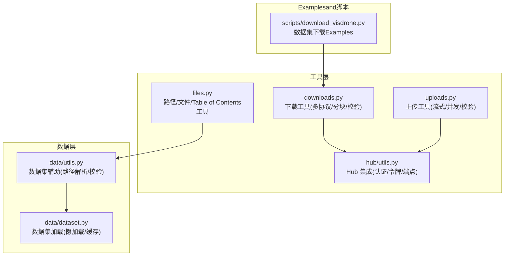
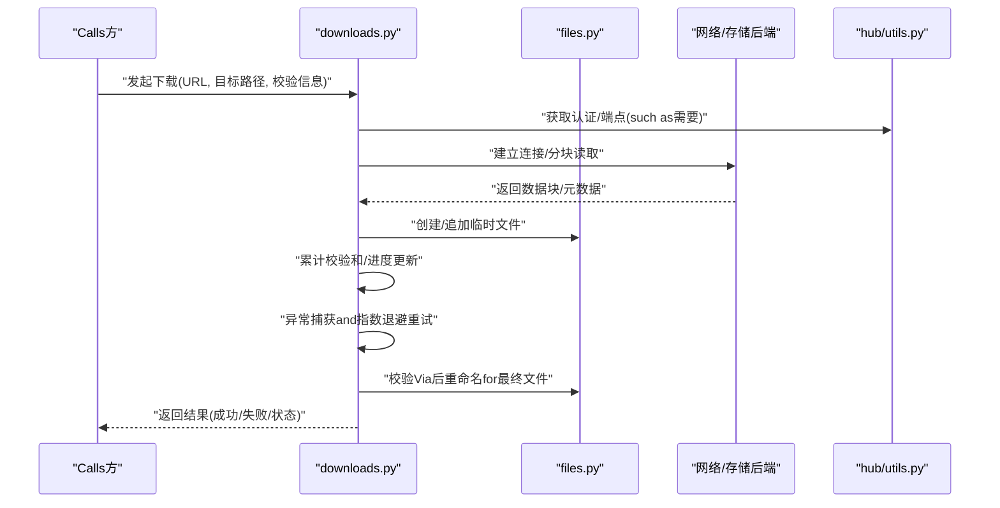
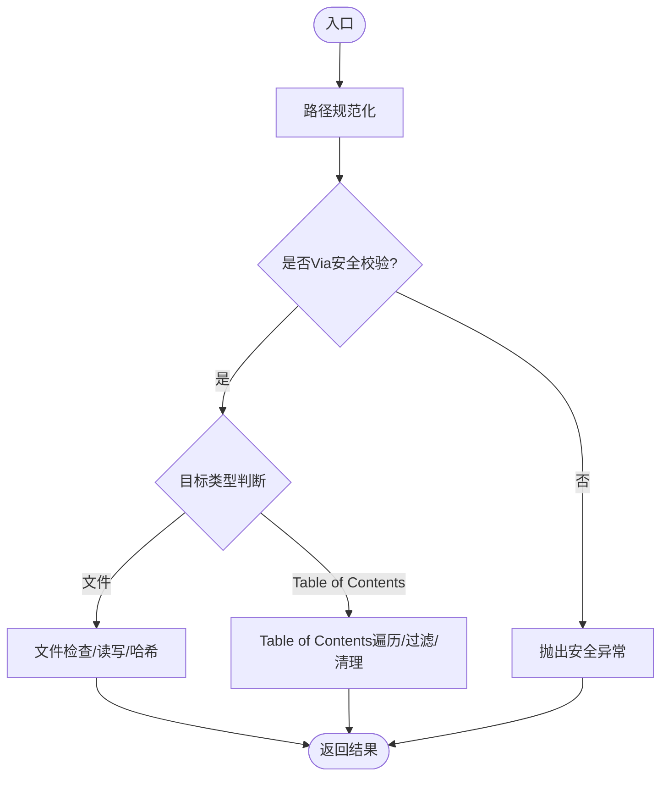
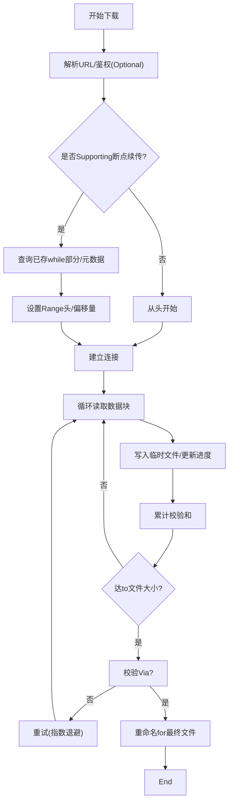
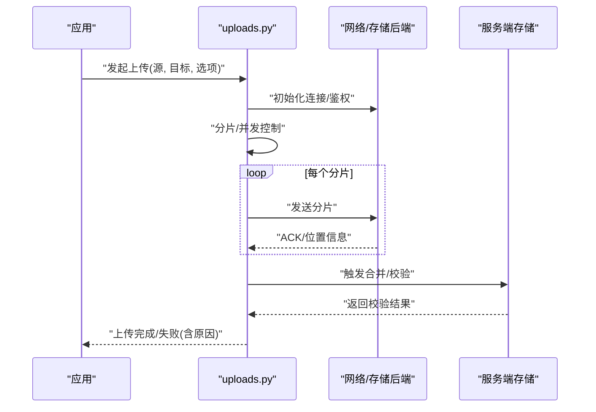
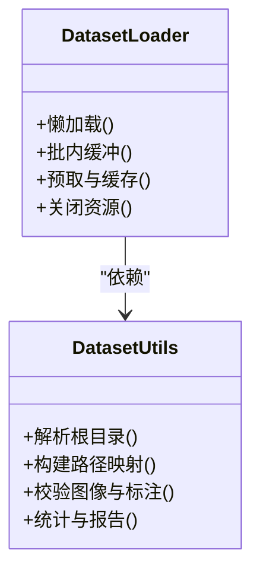
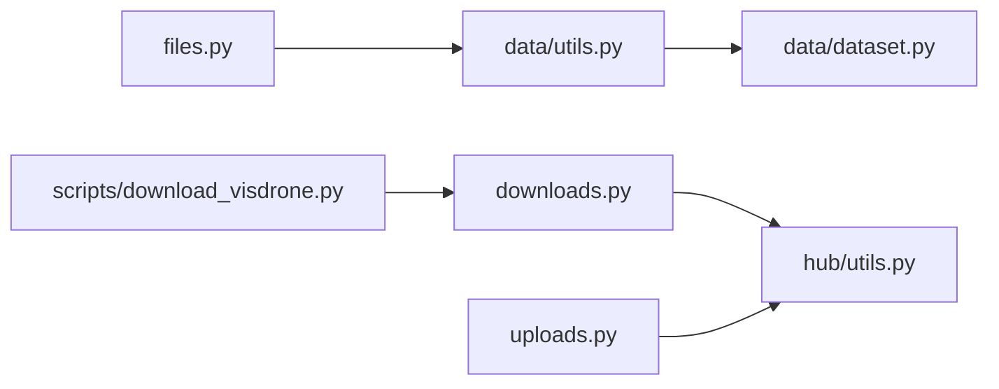

# 文件操作API

<cite>
**Files Referenced in This Document**
- [ultralytics/utils/files.py](file://ultralytics/utils/files.py)
- [ultralytics/utils/downloads.py](file://ultralytics/utils/downloads.py)
- [ultralytics/utils/uploads.py](file://ultralytics/utils/uploads.py)
- [ultralytics/data/utils.py](file://ultralytics/data/utils.py)
- [ultralytics/data/dataset.py](file://ultralytics/data/dataset.py)
- [ultralytics/hub/utils.py](file://ultralytics/hub/utils.py)
- [scripts/download_visdrone.py](file://scripts/download_visdrone.py)
</cite>

## Table of Contents
1. [Introduction](#Introduction)
2. [Project Structure](#Project Structure)
3. [Core Components](#Core Components)
4. [Architecture Overview](#Architecture Overview)
5. [Detailed Component Analysis](#Detailed Component Analysis)
6. [Dependency Analysis](#Dependency Analysis)
7. [性能考量](#性能考量)
8. [Troubleshooting Guide](#Troubleshooting Guide)
9. [Conclusion](#Conclusion)
10. [Appendix](#Appendix)

## Introduction
本文件for YOLO-Master 的文件操作工具函数provides系统化Documentation，聚焦Centered on下capabilities：
- 路径管理and文件/Table of Contents检查
- 批量文件处理and格式转换
- 数据下载and上传（Supporting多种网络协议and存储后端）
- 大文件处理的内存Optimization策略and断点续传
- 错误处理and重试机制的UsesExamples
- 分布式环境下的文件同步and一致性保证方法

## Project Structure
围绕“文件操作”的核心代码主要分布while utils and data 子包中，并辅Centered on脚本Examplesand Hub 集成。

Figure Source
- [ultralytics/utils/files.py](file://ultralytics/utils/files.py)
- [ultralytics/utils/downloads.py](file://ultralytics/utils/downloads.py)
- [ultralytics/utils/uploads.py](file://ultralytics/utils/uploads.py)
- [ultralytics/data/utils.py](file://ultralytics/data/utils.py)
- [ultralytics/data/dataset.py](file://ultralytics/data/dataset.py)
- [ultralytics/hub/utils.py](file://ultralytics/hub/utils.py)
- [scripts/download_visdrone.py](file://scripts/download_visdrone.py)

Section Source
- [ultralytics/utils/files.py](file://ultralytics/utils/files.py)
- [ultralytics/utils/downloads.py](file://ultralytics/utils/downloads.py)
- [ultralytics/utils/uploads.py](file://ultralytics/utils/uploads.py)
- [ultralytics/data/utils.py](file://ultralytics/data/utils.py)
- [ultralytics/data/dataset.py](file://ultralytics/data/dataset.py)
- [ultralytics/hub/utils.py](file://ultralytics/hub/utils.py)
- [scripts/download_visdrone.py](file://scripts/download_visdrone.py)

## Core Components
- 路径and文件系统工具（files.py）
  - 路径规范化、绝对路径解析、相对路径计算
  - 文件存while性、大小、类型、权限检查
  - Table of Contents遍历、过滤、递归扫描
  - 安全路径拼接and白名单校验
- 下载工具（downloads.py）
  - 多协议Supporting（HTTP/HTTPS、FTP、S3-like etc.）
  - 分块下载、进度回调、断点续传
  - 完整性校验（MD5/SHA256）、失败重试and退避
- 上传工具（uploads.py）
  - 流式上传、分片上传、并发控制
  - 服务端校验and回滚
  - 进度andLogging
- 数据集辅助（data/utils.py, data/dataset.py）
  - 数据集Root Directory解析、标签and图像路径校验
  - 懒加载and缓存策略，避免一次性读入大文件
- Hub 集成（hub/utils.py）
  - 认证令牌管理、端点配置、请求Encapsulates
- Examples脚本（scripts/download_visdrone.py）
  - 演示such as何Calls下载工具完成数据集拉取

Section Source
- [ultralytics/utils/files.py](file://ultralytics/utils/files.py)
- [ultralytics/utils/downloads.py](file://ultralytics/utils/downloads.py)
- [ultralytics/utils/uploads.py](file://ultralytics/utils/uploads.py)
- [ultralytics/data/utils.py](file://ultralytics/data/utils.py)
- [ultralytics/data/dataset.py](file://ultralytics/data/dataset.py)
- [ultralytics/hub/utils.py](file://ultralytics/hub/utils.py)
- [scripts/download_visdrone.py](file://scripts/download_visdrone.py)

## Architecture Overview
下图展示从上层Callsto具体implementing的端to端流程，涵盖下载、校验、写入and重试逻辑。

Figure Source
- [ultralytics/utils/downloads.py](file://ultralytics/utils/downloads.py)
- [ultralytics/utils/files.py](file://ultralytics/utils/files.py)
- [ultralytics/hub/utils.py](file://ultralytics/hub/utils.py)

## Detailed Component Analysis

### 路径and文件系统工具（files.py）
- 职责
  - 统一路径处理：规范化、去重分隔符、跨平台兼容
  - 安全检查：防止路径穿越、限制访问范围
  - 批量操作：按模式筛选、统计、清理
- 关键接口类别
  - 路径管理：解析、拼接、归一化、相对路径计算
  - 文件检查：存while性、可读/可写、大小、扩展名、哈希
  - Table of Contents操作：遍历、过滤、递归、清理
- Uses建议
  - 所有外部输入路径必须经过规范化and安全校验
  - 对大Table of Contents遍历采用惰性迭代，避免一次性加载
  - 批量删除前进行二次确认或备份

Figure Source
- [ultralytics/utils/files.py](file://ultralytics/utils/files.py)

Section Source
- [ultralytics/utils/files.py](file://ultralytics/utils/files.py)

### 下载工具（downloads.py）
- 职责
  - 统一下载入口，屏蔽底层协议差异
  - Supporting断点续传、分块读取、进度回调
  - Supporting多种校验算法and失败重试
- 关键接口类别
  - 下载主流程：url -> 本地路径，含校验and重试
  - 分块and续传：基于 Range/ETag/Last-Modified 的恢复
  - 校验：MD5/SHA256 对比，失败自动重试
  - 并发：Optional的多线程/协程并行下载
- 典型参数
  - url、save_path、chunk_size、timeout、retries、backoff、verify、progress_callback
- 错误处理
  - 网络异常、超时、证书问题、4xx/5xx 响应码
  - 校验失败、磁盘空间不足、权限不足
  - 指数退避and最大重试次数控制

Figure Source
- [ultralytics/utils/downloads.py](file://ultralytics/utils/downloads.py)

Section Source
- [ultralytics/utils/downloads.py](file://ultralytics/utils/downloads.py)

### 上传工具（uploads.py）
- 职责
  - 将本地文件或流式数据上传至远程服务或对象存储
  - Supporting分片上传、并发控制、进度反馈
  - 服务端校验and失败回滚
- 关键接口类别
  - 上传主流程：本地路径/字节流 -> 远端路径
  - 分片and并发：按大小切分、并发度控制
  - 校验：上传后and服务端校验值比对
  - 重试：网络抖动and服务器限流的自适应重试
- 典型参数
  - local_path/stream、remote_url/path、chunk_size、max_workers、timeout、retries、verify、progress_callback

Figure Source
- [ultralytics/utils/uploads.py](file://ultralytics/utils/uploads.py)

Section Source
- [ultralytics/utils/uploads.py](file://ultralytics/utils/uploads.py)

### 数据集辅助（data/utils.py, data/dataset.py）
- 职责
  - 数据集Root Directory解析、路径映射、标签and图像一致性检查
  - 懒加载and缓存，降低内存峰值
- 关键接口类别
  - 路径解析：数据集根、Training/Validation/测试集划分
  - 校验：图像存while性、尺寸/格式、标注完整性
  - 加载：按需读取、批内缓冲、预取
- 内存Optimization
  - 惰性读取、只保留必要字段
  - Uses生成器/迭代器替代列表
  - Set appropriately缓存大小and过期策略

Figure Source
- [ultralytics/data/utils.py](file://ultralytics/data/utils.py)
- [ultralytics/data/dataset.py](file://ultralytics/data/dataset.py)

Section Source
- [ultralytics/data/utils.py](file://ultralytics/data/utils.py)
- [ultralytics/data/dataset.py](file://ultralytics/data/dataset.py)

### Hub 集成（hub/utils.py）
- 职责
  - 管理认证令牌、端点配置、通用请求Encapsulates
  - for下载/上传provides统一的鉴权and重试基础
- 关键接口类别
  - 令牌获取/刷新、会话保持
  - 端点解析、签名/鉴权头注入
  - 通用 HTTP 客户端Encapsulates（超时、重试、代理）

Section Source
- [ultralytics/hub/utils.py](file://ultralytics/hub/utils.py)

### Examples：下载 VisDrone 数据集（scripts/download_visdrone.py）
- 说明
  - 演示such as何Calls下载工具完成数据集拉取
  - 包含进度显示、失败重试and校验
- 要点
  - 指定目标Table of Contentsand分块大小
  - 根据数据集清单批量下载
  - 校验Via后移动/重命名文件

Section Source
- [scripts/download_visdrone.py](file://scripts/download_visdrone.py)

## Dependency Analysis
- Modules耦合
  - downloads.py and uploads.py 均依赖 hub/utils.py 进行鉴权and端点管理
  - data/utils.py and data/dataset.py 强依赖 files.py 的路径and文件检查capabilities
- External Dependencies
  - 网络库（HTTP/HTTPS/FTP/S3-like）
  - 校验库（hashlib）
  - 进度条andLogging库
- 潜while风险
  - 循环依赖需避免（当前未见）
  - 第三方库版本兼容性（建议锁定）

Figure Source
- [ultralytics/utils/files.py](file://ultralytics/utils/files.py)
- [ultralytics/data/utils.py](file://ultralytics/data/utils.py)
- [ultralytics/data/dataset.py](file://ultralytics/data/dataset.py)
- [ultralytics/utils/downloads.py](file://ultralytics/utils/downloads.py)
- [ultralytics/utils/uploads.py](file://ultralytics/utils/uploads.py)
- [ultralytics/hub/utils.py](file://ultralytics/hub/utils.py)
- [scripts/download_visdrone.py](file://scripts/download_visdrone.py)

Section Source
- [ultralytics/utils/files.py](file://ultralytics/utils/files.py)
- [ultralytics/data/utils.py](file://ultralytics/data/utils.py)
- [ultralytics/data/dataset.py](file://ultralytics/data/dataset.py)
- [ultralytics/utils/downloads.py](file://ultralytics/utils/downloads.py)
- [ultralytics/utils/uploads.py](file://ultralytics/utils/uploads.py)
- [ultralytics/hub/utils.py](file://ultralytics/hub/utils.py)
- [scripts/download_visdrone.py](file://scripts/download_visdrone.py)

## 性能考量
- 大文件处理
  - 分块读写：Set appropriately chunk_size，平衡内存占用andIO吞吐
  - 流式处理：避免一次性载入完整文件to内存
  - 零拷贝：尽量UsesOperating System级复制/链接（while安全前提下）
- 并发andI/O
  - 下载/上传并发度受限于网络带宽and磁盘IO
  - Uses异步或线程池时注意锁and缓冲区大小
- 校验and压缩
  - 校验应while写入完成后进行，避免重复计算
  - 传输前压缩仅whileCPU充足且网络受限场景下考虑
- 缓存and预取
  - 数据集加载采用预取and缓存，减少随机IO
  - Set appropriately缓存上限and淘汰策略

## Troubleshooting Guide
- 常见问题
  - 网络超时/中断：检查重试and退避参数；确认代理and证书配置
  - 校验失败：核对服务端provides的校验值；检查磁盘空间and权限
  - 断点续传无效：确认服务端Supporting Range/ETag；清理损坏的临时文件
  - 路径穿越/权限错误：确保路径规范化and安全白名单生效
- 定位步骤
  - 开启详细Logging，记录请求头、响应码、分片偏移and校验值
  - 复现最小用例，隔离网络and存储后端变量
  - Uses独立工具Validation远端可达性and权限
- 恢复策略
  - 自动重试+指数退避
  - 失败快照：保存中间状态Centered on便恢复
  - 幂etc.设计：同一Tasks多次执行不产生副作用

Section Source
- [ultralytics/utils/downloads.py](file://ultralytics/utils/downloads.py)
- [ultralytics/utils/uploads.py](file://ultralytics/utils/uploads.py)
- [ultralytics/utils/files.py](file://ultralytics/utils/files.py)

## Conclusion
YOLO-Master 的文件操作工具Centered on files.py for基础，Combining downloads.py and uploads.py 形成完整的“路径/文件—下载—上传—校验—重试”闭环，并Via data/utils.py and data/dataset.py 将capabilities下沉to数据集加载链路。Combined with hub/utils.py 的鉴权and端点管理，可while多种网络协议and存储后端上稳定工作。针对大文件and分布式场景，provides了分块、断点续传、并发and一致性保障的基础设施，便于上层业务快速集成and扩展。

## Appendix
- 最佳实践
  - 始终对输入路径进行规范化and安全校验
  - for大文件启用分块and进度回调
  - for关键Tasks配置合理的重试and退避策略
  - while分布式环境中Uses唯一文件名and原子重命名保证一致性
- Refer toimplementing
  - 下载Examples：[scripts/download_visdrone.py](file://scripts/download_visdrone.py)
  - 数据集路径and校验：[ultralytics/data/utils.py](file://ultralytics/data/utils.py)、[ultralytics/data/dataset.py](file://ultralytics/data/dataset.py)
  - 下载主流程：[ultralytics/utils/downloads.py](file://ultralytics/utils/downloads.py)
  - 上传主流程：[ultralytics/utils/uploads.py](file://ultralytics/utils/uploads.py)
  - 路径and文件工具：[ultralytics/utils/files.py](file://ultralytics/utils/files.py)
  - Hub 集成：[ultralytics/hub/utils.py](file://ultralytics/hub/utils.py)