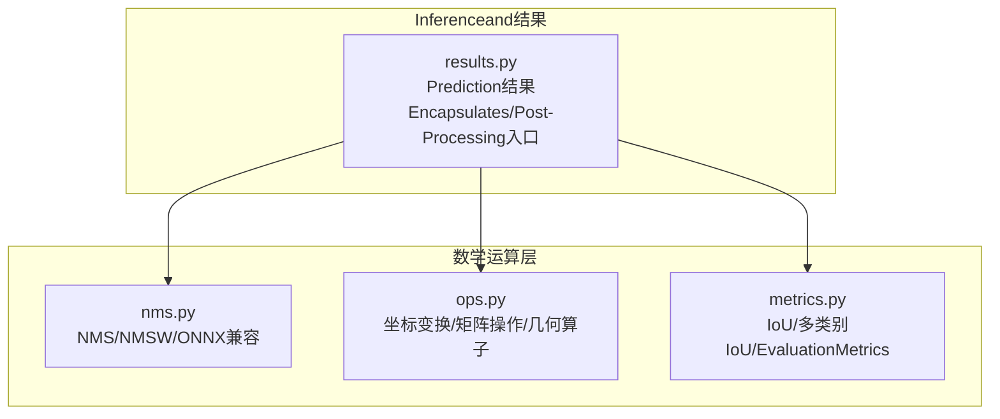
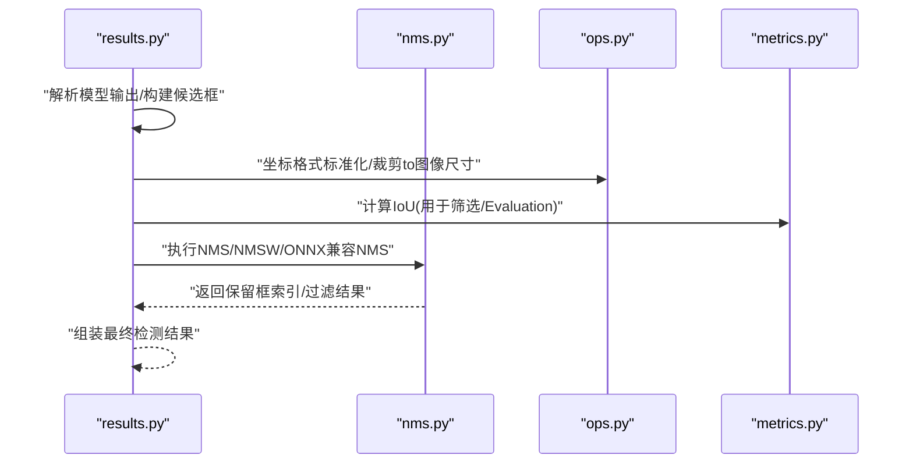
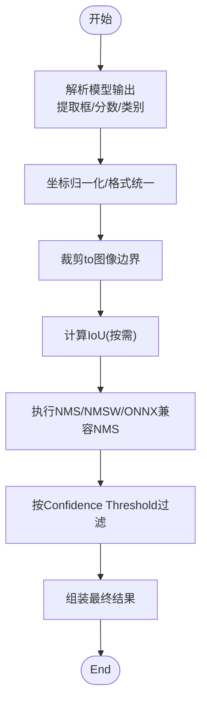
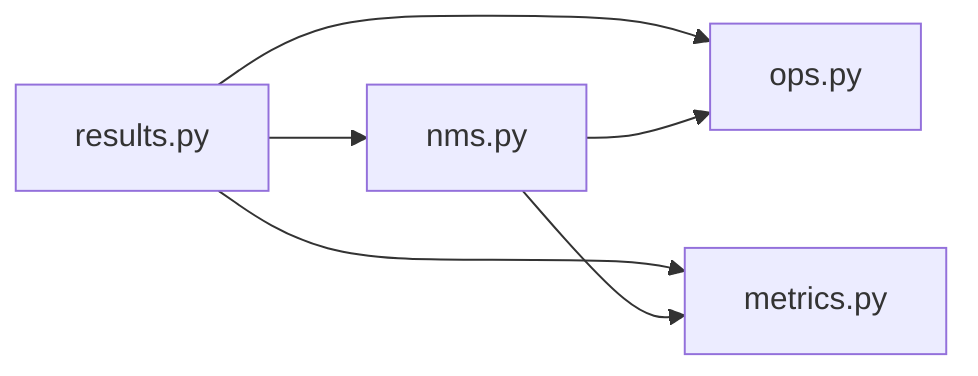

# 数学运算API

<cite>
**Files Referenced in This Document**
- [ultralytics/utils/nms.py](file://ultralytics/utils/nms.py)
- [ultralytics/utils/ops.py](file://ultralytics/utils/ops.py)
- [ultralytics/utils/metrics.py](file://ultralytics/utils/metrics.py)
- [ultralytics/engine/results.py](file://ultralytics/engine/results.py)
</cite>

## Table of Contents
1. [Introduction](#Introduction)
2. [Project Structure](#Project Structure)
3. [Core Components](#Core Components)
4. [Architecture Overview](#Architecture Overview)
5. [Detailed Component Analysis](#Detailed Component Analysis)
6. [Dependency Analysis](#Dependency Analysis)
7. [Performance Considerations](#Performance Considerations)
8. [Troubleshooting Guide](#Troubleshooting Guide)
9. [Conclusion](#Conclusion)
10. [Appendix](#Appendix)

## Introduction
本文件for YOLO-Master 的数学运算工具函数provides系统化Documentation，聚焦Object Detection中的关键算法andimplementing：Non-Maximum Suppression（NMS）、交并比（IoU）计算、坐标变换Centered onand常用矩阵操作。Documentationtargeting不同技术背景的读者，既给出接口说明、参数and返回值约定、UsesExamples路径，也解释算法原理、边界条件and错误处理策略，并provides性能Optimization建议。

## Project Structure
数学运算相关代码主要分布whileCentered on下Modules：
- NMS implementingand变体：ultralytics/utils/nms.py
- 通用几何and张量操作：ultralytics/utils/ops.py
- Metricsand IoU 计算：ultralytics/utils/metrics.py
- Inference结果EncapsulatesandPost-ProcessingCalls：ultralytics/engine/results.py

Figure Source
- [ultralytics/utils/nms.py](file://ultralytics/utils/nms.py)
- [ultralytics/utils/ops.py](file://ultralytics/utils/ops.py)
- [ultralytics/utils/metrics.py](file://ultralytics/utils/metrics.py)
- [ultralytics/engine/results.py](file://ultralytics/engine/results.py)

Section Source
- [ultralytics/utils/nms.py](file://ultralytics/utils/nms.py)
- [ultralytics/utils/ops.py](file://ultralytics/utils/ops.py)
- [ultralytics/utils/metrics.py](file://ultralytics/utils/metrics.py)
- [ultralytics/engine/results.py](file://ultralytics/engine/results.py)

## Core Components
本节概述各组件职责and典型输入输出约定，便于快速定位and集成。

- NMS（Non-Maximum Suppression）
  - 作用：while候选框集合中按置信度排序，抑制重叠度过高的冗余框，保留高质量检测结果。
  - 常见变体：标准NMS、带权重融合的NMS（NMSW）、对Export格式友好的ONNX兼容版本。
  - 典型输入：框坐标、置信度分数、Optional类别索引；Supporting批量and单图两种模式。
  - 典型输出：保留框的索引或过滤后的框集。

- IoU（交并比）计算
  - 作用：衡量两个或多个边界框之间的重叠程度，是NMSandEvaluation的核心度量。
  - Supporting形式：两两IoU、一对多IoU、多类别IoU、旋转框IoUetc.。
  - 典型输入：两组或多组框坐标；可指定坐标格式（such asxyxy、ltwhetc.）。
  - 典型输出：IoU矩阵或标量。

- 坐标变换
  - 作用：while不同表示之间转换，such as中心宽高and左上右下、归一化and像素坐标、旋转角编码etc.。
  - 典型输入：源坐标数组and目标格式标识。
  - 典型输出：目标格式的坐标数组。

- 矩阵and几何操作
  - 作用：批量向量化的几何计算、广播对齐、数值稳定化处理etc.。
  - 典型输入：形状规整的张量或NumPy数组。
  - 典型输出：计算结果张量或布尔掩码。

Section Source
- [ultralytics/utils/nms.py](file://ultralytics/utils/nms.py)
- [ultralytics/utils/ops.py](file://ultralytics/utils/ops.py)
- [ultralytics/utils/metrics.py](file://ultralytics/utils/metrics.py)

## Architecture Overview
下图展示从Inference结果toPost-Processing的Calls关系，Centered onand数学运算Modulessuch as何被统一调度。

Figure Source
- [ultralytics/engine/results.py](file://ultralytics/engine/results.py)
- [ultralytics/utils/nms.py](file://ultralytics/utils/nms.py)
- [ultralytics/utils/ops.py](file://ultralytics/utils/ops.py)
- [ultralytics/utils/metrics.py](file://ultralytics/utils/metrics.py)

## Detailed Component Analysis

### NMS（Non-Maximum Suppression）
- 功能要点
  - 按类别分别进行抑制，避免跨类误抑制。
  - Supporting多种框格式and批量维度，适配不同后端andExport需求。
  - providesONNX友好implementing，便于部署to不Supporting复杂控制流的运行时。
- 典型接口约定
  - 输入：框坐标张量、置信度张量、Optional类别索引、阈值（IoU阈值、Confidence Threshold）、最大输出框数。
  - 输出：保留框的索引或过滤后的框集（含类别and置信度）。
- 算法流程（概念性）
  - 按置信度降序排序
  - 选择最高分框作for当前最佳
  - 计算其and剩余框的IoU，剔除超过阈值的框
  - 重复直至无剩余框或达to最大输出数
- 边界条件and错误处理
  - 空输入或零个候选框：直接返回空结果。
  - 非法坐标（负面积、NaN/Inf）：需提前校验或裁剪，必要时跳过异常样本。
  - 阈值越界：将阈值限制while合理范围（such as[0,1]），并对异常值给出警告或回退策略。
- 性能Optimization
  - 向量化IoU计算，减少Python循环。
  - 分批处理大场景，降低峰值内存。
  - ONNX兼容版采用图内算子替代分支，利于静态图Optimization。
- UsesExamples（路径）
  - Refer to：[ultralytics/engine/results.py](file://ultralytics/engine/results.py) 中对NMS的Calls位置andParameter Passing方式。

Section Source
- [ultralytics/utils/nms.py](file://ultralytics/utils/nms.py)
- [ultralytics/engine/results.py](file://ultralytics/engine/results.py)

### IoU 计算
- 功能要点
  - Supporting多种框格式and批量维度，provides高效的两两/一对多/多类别IoU计算。
  - 可用于NMS内部、Training损失、ValidationEvaluationetc.场景。
- 典型接口约定
  - 输入：两组或多组框坐标、Optional类别维度、坐标格式标识。
  - 输出：IoU矩阵（形状通常for[N×M]或[N×M×C]）。
- 算法流程（概念性）
  - 计算交集区域面积and并集区域面积
  - 比值即forIoU；对退化情况（面积for0）做数值稳定处理
- 边界条件and错误处理
  - 退化框（宽或高for0）：IoU定义for0或根据Tasks约定处理。
  - NaN/Inf：Via裁剪and掩码保证输出有效。
- 性能Optimization
  - 广播机制and向量化implementing，避免显式循环。
  - 针对大批量场景的分块计算Centered on降低内存占用。
- UsesExamples（路径）
  - Refer to：[ultralytics/utils/metrics.py](file://ultralytics/utils/metrics.py) 中的IoU计算函数andCalls点。

Section Source
- [ultralytics/utils/metrics.py](file://ultralytics/utils/metrics.py)

### 坐标变换
- 功能要点
  - while中心-宽高and左上-右下etc.格式间互转；Supporting归一化and像素坐标互转；Supporting旋转角编码。
  - 常andNMS/IoUCombined with，确保前后端一致。
- 典型接口约定
  - 输入：源坐标数组、目标格式标识、Optional缩放因子或图像尺寸。
  - 输出：目标格式的坐标数组。
- 边界条件and错误处理
  - 越界坐标：裁剪至图像范围内。
  - 非法尺寸（<=0）：记录Logging并跳过或置无效标记。
- 性能Optimization
  - 全向量化implementing，利用广播and类型提升减少精度损失。
- UsesExamples（路径）
  - Refer to：[ultralytics/utils/ops.py](file://ultralytics/utils/ops.py) 中的坐标转换函数andCalls点。

Section Source
- [ultralytics/utils/ops.py](file://ultralytics/utils/ops.py)

### 矩阵and几何操作
- 功能要点
  - provides批量几何计算、掩码生成、形状对齐、数值稳定化etc.基础capabilities。
  - 支撑NMSandIoU的高效implementing。
- 典型接口约定
  - 输入：形状规整的张量、掩码、阈值etc.。
  - 输出：计算结果张量或布尔掩码。
- 边界条件and错误处理
  - 形状不匹配：抛出明确错误或自动广播Tips。
  - 数值溢出/下溢：引入epsilon或安全裁剪。
- 性能Optimization
  - Prefer底层库的向量化算子；减少中间拷贝；复用缓冲区。
- UsesExamples（路径）
  - Refer to：[ultralytics/utils/ops.py](file://ultralytics/utils/ops.py) 中的几何and矩阵辅助函数。

Section Source
- [ultralytics/utils/ops.py](file://ultralytics/utils/ops.py)

### 端to端Uses流程（Object DetectionPost-Processing）

Figure Source
- [ultralytics/engine/results.py](file://ultralytics/engine/results.py)
- [ultralytics/utils/nms.py](file://ultralytics/utils/nms.py)
- [ultralytics/utils/ops.py](file://ultralytics/utils/ops.py)
- [ultralytics/utils/metrics.py](file://ultralytics/utils/metrics.py)

## Dependency Analysis
- 耦合关系
  - results.py 作forPost-Processing编排者，依赖 nms.py、ops.py、metrics.py provides的原子capabilities。
  - nms.py 内部可能复用 ops.py 的几何and矩阵操作，并Uses metrics.py 的IoU计算。
- External Dependencies
  - 张量框架（such asPyTorch/TensorRT/ONNXRuntime）的底层算子，影响性能and兼容性。
- 潜while风险
  - 形状广播不一致导致的隐式错误。
  - 不同后端对浮点精度的差异导致IoU/NMS稳定性波动。

Figure Source
- [ultralytics/engine/results.py](file://ultralytics/engine/results.py)
- [ultralytics/utils/nms.py](file://ultralytics/utils/nms.py)
- [ultralytics/utils/ops.py](file://ultralytics/utils/ops.py)
- [ultralytics/utils/metrics.py](file://ultralytics/utils/metrics.py)

Section Source
- [ultralytics/engine/results.py](file://ultralytics/engine/results.py)
- [ultralytics/utils/nms.py](file://ultralytics/utils/nms.py)
- [ultralytics/utils/ops.py](file://ultralytics/utils/ops.py)
- [ultralytics/utils/metrics.py](file://ultralytics/utils/metrics.py)

## Performance Considerations
- 向量化优先：尽量Uses批量and广播，避免逐元素Python循环。
- 内存管理：对大图/高分辨率场景采用分块计算and就地操作，降低峰值内存。
- 数值稳定：whileIoUandNMS中加入小常数epsilon，防止除零andNaN传播。
- 后端适配：ONNX/TensorRT环境下Prefer图内算子，减少动态控制流。
- 缓存and复用：对重复计算的中间结果进行缓存或重用，减少冗余。

## Troubleshooting Guide
- 症状：NMS未过滤任何框
  - 检查IoU阈值是否过小或Confidence Threshold设置不当。
  - 确认框格式and坐标范围是否正确。
- 症状：出现NaN/Inf或崩溃
  - 检查输入数据合法性（负面积、越界坐标）。
  - 增加数值稳定项and安全裁剪。
- 症状：不同后端结果不一致
  - 核对数据类型and精度（float32 vs float16）。
  - 对比ONNXExportand原生implementing的etc.价性。
- 症状：性能bottlenecks
  - 定位热点函数（IoU/NMS），尝试分块或批大小调整。
  - 启用后端加速（such asCUDA/TensorRT）并预热。

Section Source
- [ultralytics/utils/nms.py](file://ultralytics/utils/nms.py)
- [ultralytics/utils/ops.py](file://ultralytics/utils/ops.py)
- [ultralytics/utils/metrics.py](file://ultralytics/utils/metrics.py)
- [ultralytics/engine/results.py](file://ultralytics/engine/results.py)

## Conclusion
YOLO-Master 的数学运算工具Centered onModules化方式组织，围绕NMS、IoU、坐标变换and矩阵操作形成稳定的Post-Processing基座。Via向量化implementing、数值稳定and后端适配，兼顾了准确性and性能。建议while集成时Strictly follow接口约定，关注边界条件and错误处理，并Combining具体部署环境进行性能调优。

## Appendix
- UsesExamples路径
  - NMSCallsandParameter Passing：[ultralytics/engine/results.py](file://ultralytics/engine/results.py)
  - IoU计算and多类别IoU：[ultralytics/utils/metrics.py](file://ultralytics/utils/metrics.py)
  - 坐标变换and几何操作：[ultralytics/utils/ops.py](file://ultralytics/utils/ops.py)
  - NMSimplementingandONNX兼容版本：[ultralytics/utils/nms.py](file://ultralytics/utils/nms.py)