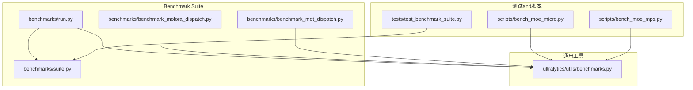
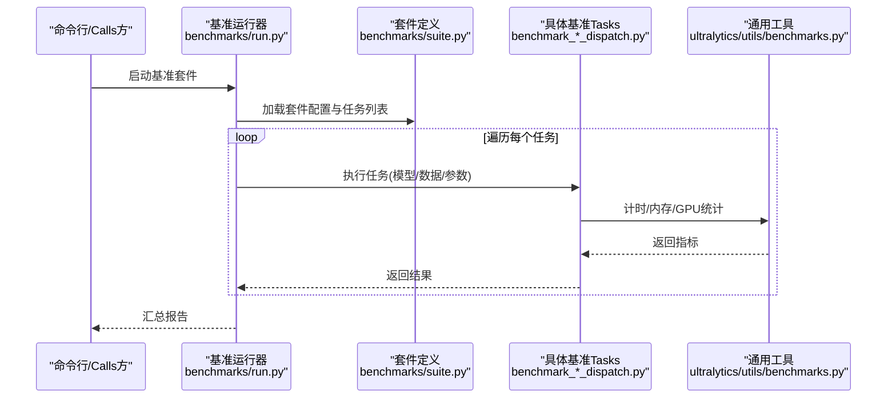
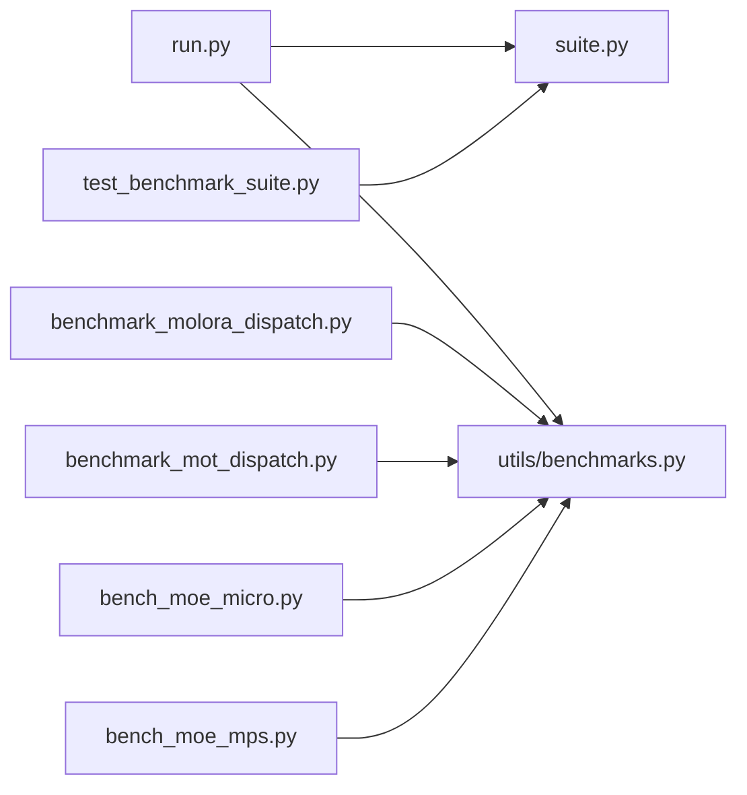

# 性能分析API

<cite>
**Files Referenced in This Document**
- [benchmarks/run.py](file://benchmarks/run.py)
- [benchmarks/suite.py](file://benchmarks/suite.py)
- [benchmarks/benchmark_molora_dispatch.py](file://benchmarks/benchmark_molora_dispatch.py)
- [benchmarks/benchmark_mot_dispatch.py](file://benchmarks/benchmark_mot_dispatch.py)
- [ultralytics/utils/benchmarks.py](file://ultralytics/utils/benchmarks.py)
- [tests/test_benchmark_suite.py](file://tests/test_benchmark_suite.py)
- [scripts/bench_moe_micro.py](file://scripts/bench_moe_micro.py)
- [scripts/bench_moe_mps.py](file://scripts/bench_moe_mps.py)
</cite>

## Table of Contents
1. [Introduction](#Introduction)
2. [Project Structure](#Project Structure)
3. [Core Components](#Core Components)
4. [Architecture Overview](#Architecture Overview)
5. [Detailed Component Analysis](#Detailed Component Analysis)
6. [Dependency Analysis](#Dependency Analysis)
7. [性能考量](#性能考量)
8. [Troubleshooting Guide](#Troubleshooting Guide)
9. [Conclusion](#Conclusion)
10. [Appendix](#Appendix)

## Introduction
本文件targetingYOLO-Master的性能分析and基准测试工具，聚焦Centered on下目标：
- 记录Inference速度、内存UsesandGPU利用率etc.关键Metrics的测量方法
- 说明such as何集成PyTorch ProfilerandCUDA Profiler进行深度剖析
- 解释bottlenecks识别andOptimization建议的生成机制
- provides批量性能测试and结果对比的分析工具用法
- 给出性能回归检测and自动化测试集成的最佳实践
- 展示while生产环境中进行持续性能监控的implementing方案

## Project Structure
仓库中and性能分析相关的代码主要分布whileCentered on下位置：
- benchmarks：Benchmark Suite定义and运行入口
- ultralytics/utils/benchmarks.py：通用基准andMetrics采集工具
- tests/test_benchmark_suite.py：Benchmark Suite的单元测试
- scripts：脚本化微基准（含MPS/MoE场景）

Figure Source
- [benchmarks/run.py](file://benchmarks/run.py)
- [benchmarks/suite.py](file://benchmarks/suite.py)
- [benchmarks/benchmark_molora_dispatch.py](file://benchmarks/benchmark_molora_dispatch.py)
- [benchmarks/benchmark_mot_dispatch.py](file://benchmarks/benchmark_mot_dispatch.py)
- [ultralytics/utils/benchmarks.py](file://ultralytics/utils/benchmarks.py)
- [tests/test_benchmark_suite.py](file://tests/test_benchmark_suite.py)
- [scripts/bench_moe_micro.py](file://scripts/bench_moe_micro.py)
- [scripts/bench_moe_mps.py](file://scripts/bench_moe_mps.py)

Section Source
- [benchmarks/run.py](file://benchmarks/run.py)
- [benchmarks/suite.py](file://benchmarks/suite.py)
- [ultralytics/utils/benchmarks.py](file://ultralytics/utils/benchmarks.py)
- [tests/test_benchmark_suite.py](file://tests/test_benchmark_suite.py)
- [scripts/bench_moe_micro.py](file://scripts/bench_moe_micro.py)
- [scripts/bench_moe_mps.py](file://scripts/bench_moe_mps.py)

## Core Components
- 基准运行器：负责加载套件、调度Tasks、汇总输出
- 套件定义：声明不同Tasks（such asMolOrA路由、MoT路由）的输入、参数andMetrics
- 通用工具：Encapsulates时间/内存/GPU统计、预热、重复采样、异常处理etc.
- 测试and脚本：Validation套件行for、覆盖特定平台或Modules的微基准

Section Source
- [benchmarks/run.py](file://benchmarks/run.py)
- [benchmarks/suite.py](file://benchmarks/suite.py)
- [ultralytics/utils/benchmarks.py](file://ultralytics/utils/benchmarks.py)

## Architecture Overview
下图展示了从“运行入口”to“具体基准implementing”再to“通用工具”的Calls链。

Figure Source
- [benchmarks/run.py](file://benchmarks/run.py)
- [benchmarks/suite.py](file://benchmarks/suite.py)
- [benchmarks/benchmark_molora_dispatch.py](file://benchmarks/benchmark_molora_dispatch.py)
- [benchmarks/benchmark_mot_dispatch.py](file://benchmarks/benchmark_mot_dispatch.py)
- [ultralytics/utils/benchmarks.py](file://ultralytics/utils/benchmarks.py)

## Detailed Component Analysis

### 基准运行器（benchmarks/run.py）
职责
- 解析命令行参数and配置文件
- 初始化并drivers are installed套件执行
- 聚合各Tasks的Metrics并输出报告

关键点
- Supporting多Tasks并行或串行执行策略
- 统一的结果序列化andLogging
- 对异常进行捕获and上报，保证批跑稳定性

Section Source
- [benchmarks/run.py](file://benchmarks/run.py)

### 套件定义（benchmarks/suite.py）
职责
- 声明基准Tasks清单、默认参数and数据集路径
- for不同Tasksprovides统一的接口契约

关键点
- Via配置项控制是否启用某类Tasks
- provides可复用的输入构造and预处理流程
- 便于扩展新Tasks而无需改动运行器

Section Source
- [benchmarks/suite.py](file://benchmarks/suite.py)

### 通用工具（ultralytics/utils/benchmarks.py）
职责
- provides跨平台的性能采集capabilities：时间、内存、GPU占用
- Encapsulates预热、重复采样、统计摘要（均值/方差/分位数）
- 兼容CPU/GPU/CUDA环境，自动选择最优设备

关键点
- 时间测量：包含同步点Centered on避免异步误差
- 内存统计：区分峰值and常驻内存
- GPU统计：while可用时采集利用率and显存占用
- 错误边界：对不可用资源降级处理

Section Source
- [ultralytics/utils/benchmarks.py](file://ultralytics/utils/benchmarks.py)

### 具体基准Tasks
- Molora路由基准（benchmarks/benchmark_molora_dispatch.py）
  - 关注路由分发开销、专家激活比例、通信成本
  - 典型Metrics：每步延迟、吞吐、路由熵、专家负载不均衡度
- MoT路由基准（benchmarks/benchmark_mot_dispatch.py）
  - 关注Tracking场景下的路由and特征复用效率
  - 典型Metrics：帧级延迟、轨迹重建耗时、内存峰值

Section Source
- [benchmarks/benchmark_molora_dispatch.py](file://benchmarks/benchmark_molora_dispatch.py)
- [benchmarks/benchmark_mot_dispatch.py](file://benchmarks/benchmark_mot_dispatch.py)

### 测试and脚本
- 套件测试（tests/test_benchmark_suite.py）
  - 校验套件加载、Tasks枚举、Metrics字段完整性
  - 断言关键阈值，保障基准回归稳定
- 微基准脚本
  - scripts/bench_moe_micro.py：针对MoE子Modules的细粒度基准
  - scripts/bench_moe_mps.py：whileApple MPS后端上的兼容性基准

Section Source
- [tests/test_benchmark_suite.py](file://tests/test_benchmark_suite.py)
- [scripts/bench_moe_micro.py](file://scripts/bench_moe_micro.py)
- [scripts/bench_moe_mps.py](file://scripts/bench_moe_mps.py)

## Dependency Analysis
- 运行器依赖套件定义and通用工具
- 具体Tasks依赖通用工具进行Metrics采集
- 测试覆盖套件and运行器的契约
- 脚本用于快速Validation特定平台/Modules

Figure Source
- [benchmarks/run.py](file://benchmarks/run.py)
- [benchmarks/suite.py](file://benchmarks/suite.py)
- [benchmarks/benchmark_molora_dispatch.py](file://benchmarks/benchmark_molora_dispatch.py)
- [benchmarks/benchmark_mot_dispatch.py](file://benchmarks/benchmark_mot_dispatch.py)
- [ultralytics/utils/benchmarks.py](file://ultralytics/utils/benchmarks.py)
- [tests/test_benchmark_suite.py](file://tests/test_benchmark_suite.py)
- [scripts/bench_moe_micro.py](file://scripts/bench_moe_micro.py)
- [scripts/bench_moe_mps.py](file://scripts/bench_moe_mps.py)

Section Source
- [benchmarks/run.py](file://benchmarks/run.py)
- [benchmarks/suite.py](file://benchmarks/suite.py)
- [ultralytics/utils/benchmarks.py](file://ultralytics/utils/benchmarks.py)
- [tests/test_benchmark_suite.py](file://tests/test_benchmark_suite.py)
- [scripts/bench_moe_micro.py](file://scripts/bench_moe_micro.py)
- [scripts/bench_moe_mps.py](file://scripts/bench_moe_mps.py)

## 性能考量
- 预热and冷启动
  - 首次Load modeland算子编译会带来较大开销，应while正式采样前进行充分预热
- 重复采样and统计稳健性
  - 多次重复采样可降低抖动影响，Recommended to use中位数或分位数作for主Metrics
- 设备and并发
  - 确保GPU空闲且无其他进程干扰；Set appropriatelyBatch Sizeand线程数
- Metrics口径一致性
  - 明确端to端and内核级Metrics的区别，避免误读
- 资源限制
  - while容器或受限环境中，注意显存上限andI/O带宽对吞吐的影响

[本节for通用指导，不涉and具体文件]

## Troubleshooting Guide
常见问题and定位思路
- Metrics缺失或forNaN
  - 检查设备可用性、CUDAdrivers are installedandPyTorch版本匹配
  - 确认预热阶段是否成功完成
- 结果不稳定
  - 增加重复次数，剔除首尾异常样本
  - 固定随机种子and数据顺序
- 内存泄漏迹象
  - 观察峰值and常驻内存差异，必要时释放中间张量
- 平台差异（such asMPS）
  - Uses专用脚本Validation后端兼容性，回退toCPU或CUDACentered on隔离问题

Section Source
- [tests/test_benchmark_suite.py](file://tests/test_benchmark_suite.py)
- [scripts/bench_moe_mps.py](file://scripts/bench_moe_mps.py)

## Conclusion
本性能分析体系Via“运行器+套件+通用工具”的分层设计，provides了可扩展、可复现的基准capabilities。Combining测试and脚本，可whileCIand生产环境中持续EvaluationInference速度、内存andGPU利用情况，并forbottlenecks识别andOptimizationprovides可靠依据。

[本节for总结性内容，不涉and具体文件]

## Appendix

### APIand用法要点
- 运行Benchmark Suite
  - Via运行器加载套件并执行所有Tasks，输出汇总报告
- 新增自定义Tasks
  - while套件中注册Tasks，implementingUnified Interface，复用通用工具进行Metrics采集
- 批量对比and回归检测
  - 将每次运行的结果持久化，比较关键Metrics变化，触发告警或阻断

Section Source
- [benchmarks/run.py](file://benchmarks/run.py)
- [benchmarks/suite.py](file://benchmarks/suite.py)
- [tests/test_benchmark_suite.py](file://tests/test_benchmark_suite.py)

### 集成PyTorch ProfilerandCUDA Profiler的建议
- PyTorch Profiler
  - while关键Inference循环前后开启/关闭Profiler，Export事件追踪文件供后续分析
- CUDA Profiler
  - whileGPU环境下Uses系统级工具采集内核时序and内存访问模式
- 注意事项
  - Profiling会引入额外开销，建议while独立环境and代表性数据上进行
  - 将Profiling结果and常规Metrics关联，避免仅凭单一视图下Conclusion

[本节for概念性指导，不涉and具体文件]

### 生产环境持续监控方案
- 定期执行轻量基准Tasks，记录延迟、吞吐and资源占用
- 建立基线and阈值，当Metrics偏离时触发告警
- 将结果纳入Visualization看板，辅助容量规划and扩容决策

[本节for概念性指导，不涉and具体文件]