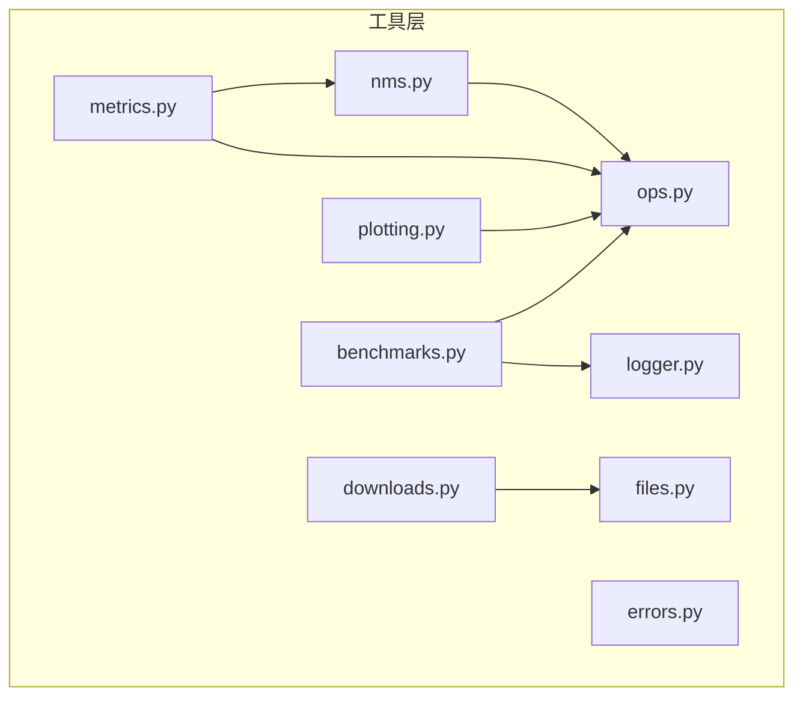
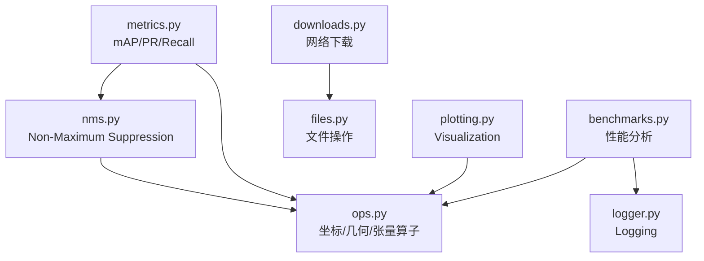
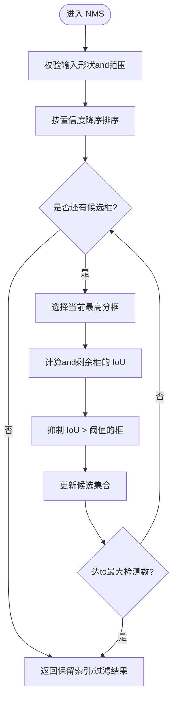
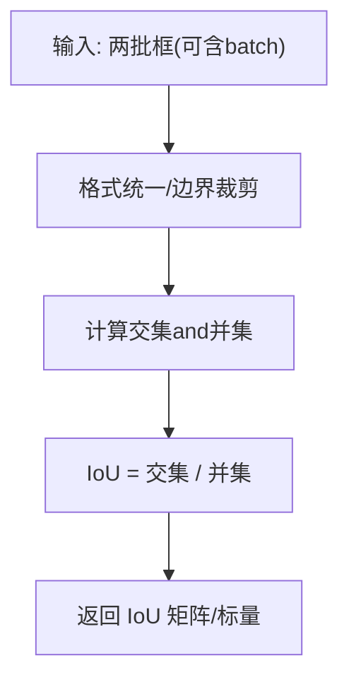
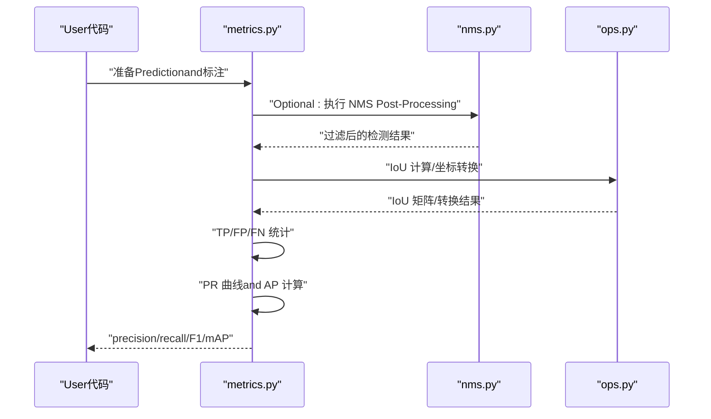
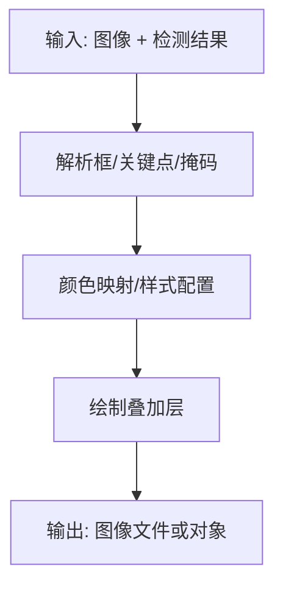
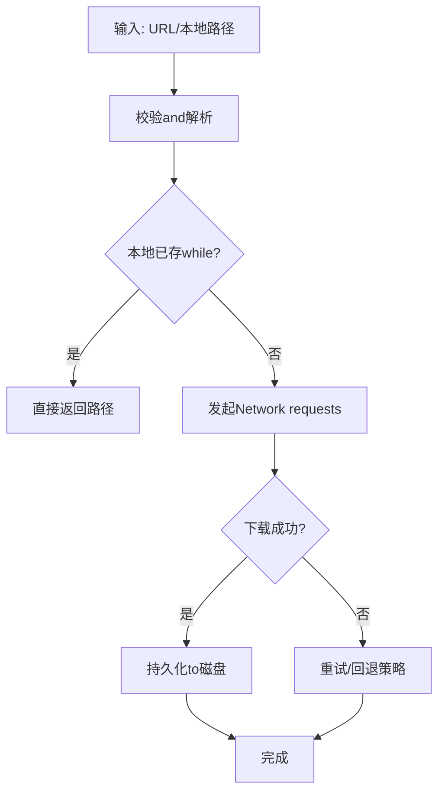
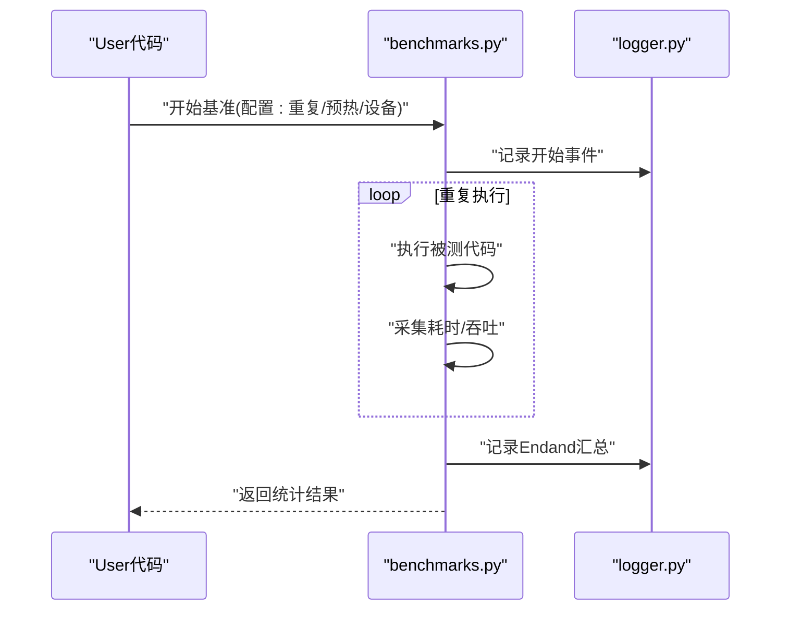
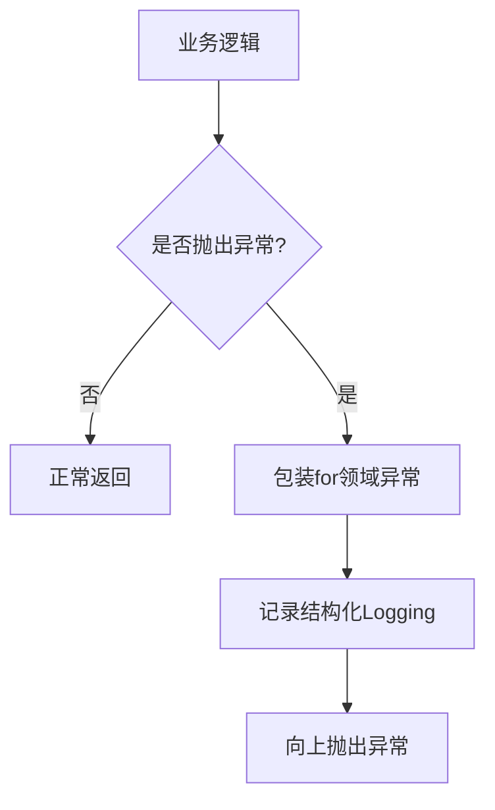
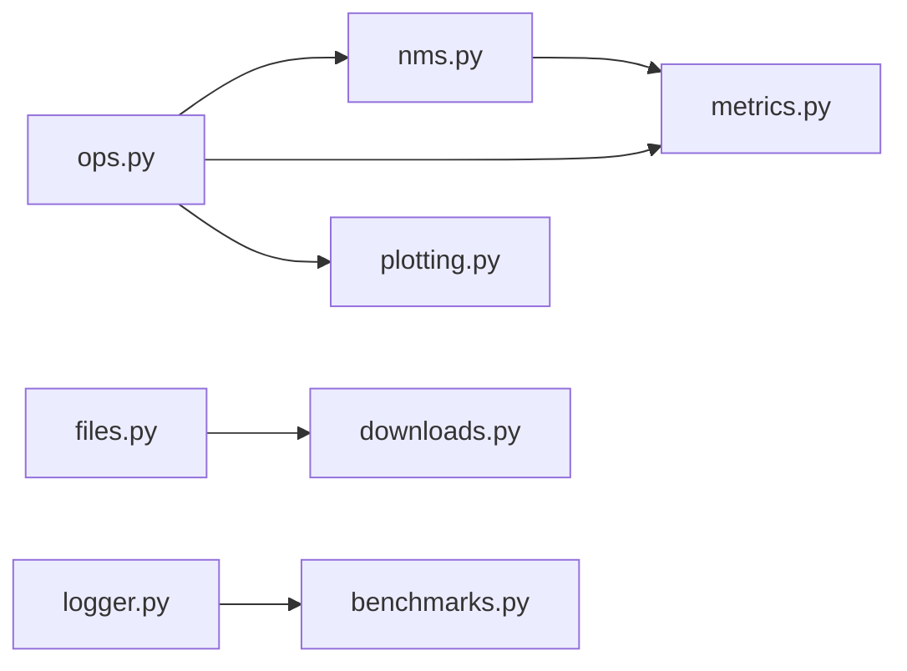

# Utility Functions API

<cite>
**Files Referenced in This Document**
- [ultralytics/utils/nms.py](file://ultralytics/utils/nms.py)
- [ultralytics/utils/metrics.py](file://ultralytics/utils/metrics.py)
- [ultralytics/utils/ops.py](file://ultralytics/utils/ops.py)
- [ultralytics/utils/plotting.py](file://ultralytics/utils/plotting.py)
- [ultralytics/utils/files.py](file://ultralytics/utils/files.py)
- [ultralytics/utils/downloads.py](file://ultralytics/utils/downloads.py)
- [ultralytics/utils/logger.py](file://ultralytics/utils/logger.py)
- [ultralytics/utils/benchmarks.py](file://ultralytics/utils/benchmarks.py)
- [ultralytics/utils/errors.py](file://ultralytics/utils/errors.py)
</cite>

## Table of Contents
1. [Introduction](#Introduction)
2. [Project Structure](#Project Structure)
3. [Core Components](#Core Components)
4. [Architecture Overview](#Architecture Overview)
5. [Detailed Component Analysis](#Detailed Component Analysis)
6. [Dependency Analysis](#Dependency Analysis)
7. [Performance Considerations](#Performance Considerations)
8. [Troubleshooting Guide](#Troubleshooting Guide)
9. [Conclusion](#Conclusion)
10. [Appendix](#Appendix)

## Introduction
本文件for YOLO-Master 的工具函数 API Documentation，聚焦于Centered on下capabilities：
- 核心数学and图像处理：NMS、IoU、坐标变换etc.
- EvaluationMetrics：mAP、precision、recall etc.计算方法and接口
- Visualization工具：结果绘制、图表生成
- 文件操作andNetwork requests辅助
- 性能分析工具接口
- 错误处理andLogging实用函数
- 常用组合Uses模式（Centered on流程图和Calls序列说明）

## Project Structure
工具函数主要分布while ultralytics/utils 下，按职责划分：
- nms.py：Non-Maximum Suppression相关implementing
- metrics.py：检测/分割and other tasksEvaluationMetrics计算
- ops.py：通用张量运算and几何变换
- plotting.py：Visualizationand绘图
- files.py / downloads.py：文件and下载辅助
- logger.py：Logging
- benchmarks.py：性能基准and分析
- errors.py：错误类型and异常处理

Figure Source
- [ultralytics/utils/nms.py](file://ultralytics/utils/nms.py)
- [ultralytics/utils/metrics.py](file://ultralytics/utils/metrics.py)
- [ultralytics/utils/ops.py](file://ultralytics/utils/ops.py)
- [ultralytics/utils/plotting.py](file://ultralytics/utils/plotting.py)
- [ultralytics/utils/files.py](file://ultralytics/utils/files.py)
- [ultralytics/utils/downloads.py](file://ultralytics/utils/downloads.py)
- [ultralytics/utils/logger.py](file://ultralytics/utils/logger.py)
- [ultralytics/utils/benchmarks.py](file://ultralytics/utils/benchmarks.py)
- [ultralytics/utils/errors.py](file://ultralytics/utils/errors.py)

Section Source
- [ultralytics/utils/nms.py](file://ultralytics/utils/nms.py)
- [ultralytics/utils/metrics.py](file://ultralytics/utils/metrics.py)
- [ultralytics/utils/ops.py](file://ultralytics/utils/ops.py)
- [ultralytics/utils/plotting.py](file://ultralytics/utils/plotting.py)
- [ultralytics/utils/files.py](file://ultralytics/utils/files.py)
- [ultralytics/utils/downloads.py](file://ultralytics/utils/downloads.py)
- [ultralytics/utils/logger.py](file://ultralytics/utils/logger.py)
- [ultralytics/utils/benchmarks.py](file://ultralytics/utils/benchmarks.py)
- [ultralytics/utils/errors.py](file://ultralytics/utils/errors.py)

## Core Components
本节概述各Modules的职责and对外暴露的常见接口类别（具体函数名Centered on源码for准）：
- NMS（Non-Maximum Suppression）
  - 目标：对候选框进行去重，保留高置信度且互不重叠的框
  - 典型输入：boxes、scores、iou_threshold、max_det
  - 典型输出：保留索引或过滤后的 boxes/scores
  - Refer to路径：[ultralytics/utils/nms.py](file://ultralytics/utils/nms.py)
- IoU 计算
  - 目标：计算Prediction框and真实框的重叠率
  - 典型输入：两批框坐标（xyxy/xywh etc.）
  - 典型输出：IoU 矩阵或标量
  - Refer to路径：[ultralytics/utils/ops.py](file://ultralytics/utils/ops.py)
- 坐标变换
  - 目标：while xyxy、xywh、中心+宽高、角点etc.不同表示间转换
  - 典型输入：坐标数组、格式标识
  - 典型输出：转换后的坐标数组
  - Refer to路径：[ultralytics/utils/ops.py](file://ultralytics/utils/ops.py)
- EvaluationMetrics（mAP、precision、recall）
  - 目标：根据Predictionand标注计算精度、召回、PR 曲线and mAP
  - 典型输入：Prediction框/掩码、标签、类别映射、阈值列表
  - 典型输出：各类别and总体 precision/recall/F1/mAP
  - Refer to路径：[ultralytics/utils/metrics.py](file://ultralytics/utils/metrics.py)
- Visualization工具
  - 目标：将检测结果绘制to图像上，生成统计图
  - 典型输入：图像、检测结果、类别名、颜色表
  - 典型输出：带标注的图像或图表文件
  - Refer to路径：[ultralytics/utils/plotting.py](file://ultralytics/utils/plotting.py)
- 文件and下载
  - 目标：路径解析、存while性检查、批量下载、断点续传etc.
  - 典型输入：URL/本地路径、保存Table of Contents、并发数
  - 典型输出：本地文件路径或下载状态
  - Refer to路径：[ultralytics/utils/files.py](file://ultralytics/utils/files.py)、[ultralytics/utils/downloads.py](file://ultralytics/utils/downloads.py)
- 性能分析
  - 目标：计时、吞吐统计、内存/GPU 占用采样
  - 典型输入：待测代码块、重复次数、设备信息
  - 典型输出：耗时分布、吞吐、资源Uses摘要
  - Refer to路径：[ultralytics/utils/benchmarks.py](file://ultralytics/utils/benchmarks.py)
- 错误处理andLogging
  - 目标：统一异常类型、结构化Logging、上下文追踪
  - 典型输入：错误码、消息、堆栈信息
  - 典型输出：异常对象、Logging条目
  - Refer to路径：[ultralytics/utils/errors.py](file://ultralytics/utils/errors.py)、[ultralytics/utils/logger.py](file://ultralytics/utils/logger.py)

Section Source
- [ultralytics/utils/nms.py](file://ultralytics/utils/nms.py)
- [ultralytics/utils/metrics.py](file://ultralytics/utils/metrics.py)
- [ultralytics/utils/ops.py](file://ultralytics/utils/ops.py)
- [ultralytics/utils/plotting.py](file://ultralytics/utils/plotting.py)
- [ultralytics/utils/files.py](file://ultralytics/utils/files.py)
- [ultralytics/utils/downloads.py](file://ultralytics/utils/downloads.py)
- [ultralytics/utils/benchmarks.py](file://ultralytics/utils/benchmarks.py)
- [ultralytics/utils/logger.py](file://ultralytics/utils/logger.py)
- [ultralytics/utils/errors.py](file://ultralytics/utils/errors.py)

## Architecture Overview
下图展示工具层之间的依赖关系and数据流向。NMS andMetrics计算依赖底层算子；Metrics计算可能Calls NMS；Visualization依赖算子；基准测试依赖Loggingand算子；下载依赖文件操作。

Figure Source
- [ultralytics/utils/ops.py](file://ultralytics/utils/ops.py)
- [ultralytics/utils/nms.py](file://ultralytics/utils/nms.py)
- [ultralytics/utils/metrics.py](file://ultralytics/utils/metrics.py)
- [ultralytics/utils/plotting.py](file://ultralytics/utils/plotting.py)
- [ultralytics/utils/files.py](file://ultralytics/utils/files.py)
- [ultralytics/utils/downloads.py](file://ultralytics/utils/downloads.py)
- [ultralytics/utils/logger.py](file://ultralytics/utils/logger.py)
- [ultralytics/utils/benchmarks.py](file://ultralytics/utils/benchmarks.py)

## Detailed Component Analysis

### NMS（Non-Maximum Suppression）
- 功能要点
  - 输入通常for boxes、scores、iou_threshold、max_det etc.
  - 内部Via IoU 计算and排序筛选，返回保留索引或过滤后结果
  - Supporting不同框格式（需先转换for统一格式）
- 关键流程
  - 校验输入维度and范围
  - 按分数降序排序
  - 迭代选择高分框并抑制and其 IoU 超过阈值的其余框
  - 达to最大检测数时提前终止
- 复杂度
  - 时间 O(N^2)（朴素implementing），可Via分桶/树结构Optimization
  - 空间 O(N)
- Uses建议
  - 预处理阶段统一坐标格式
  - Set appropriately iou_threshold and max_det 平衡速度and质量
- Refer to路径
  - [ultralytics/utils/nms.py](file://ultralytics/utils/nms.py)
  - [ultralytics/utils/ops.py](file://ultralytics/utils/ops.py)

Figure Source
- [ultralytics/utils/nms.py](file://ultralytics/utils/nms.py)
- [ultralytics/utils/ops.py](file://ultralytics/utils/ops.py)

Section Source
- [ultralytics/utils/nms.py](file://ultralytics/utils/nms.py)
- [ultralytics/utils/ops.py](file://ultralytics/utils/ops.py)

### IoU 计算and坐标变换
- 功能要点
  - provides多种框格式间的相互转换（such as xyxy、xywh、中心+宽高）
  - 计算两批框之间的 IoU 矩阵，Supporting batch 维度
- 关键流程
  - 坐标归一化and边界裁剪
  - 面积计算and交集/并集推导
  - 数值稳定性处理（避免除零）
- 复杂度
  - 坐标转换 O(N)
  - IoU 矩阵 O(N^2)
- Uses建议
  - while NMS 前统一坐标格式
  - 注意浮点误差and越界裁剪
- Refer to路径
  - [ultralytics/utils/ops.py](file://ultralytics/utils/ops.py)

Figure Source
- [ultralytics/utils/ops.py](file://ultralytics/utils/ops.py)

Section Source
- [ultralytics/utils/ops.py](file://ultralytics/utils/ops.py)

### EvaluationMetrics（mAP、precision、recall）
- 功能要点
  - 基于Predictionand标注计算 per-class and overall 的 precision、recall、F1、mAP
  - Supporting多阈值扫描and PR 曲线构建
  - 可and NMS Combined with用于Post-Processing后再Evaluation
- 关键流程
  - 匹配策略：按类别and IoU 阈值判定 TP/FP/FN
  - 累积统计：逐样本累计命中and误检
  - 曲线and积分：插值 PR 曲线并计算 AP，再平均得 mAP
- 复杂度
  - 匹配阶段 O(N^2)（and候选数量相关）
  - 曲线and积分近似线性于阈值数量
- Uses建议
  - Set appropriately IoU 阈值andConfidence Threshold
  - 类别不平衡场景关注 per-class Metrics
- Refer to路径
  - [ultralytics/utils/metrics.py](file://ultralytics/utils/metrics.py)
  - [ultralytics/utils/nms.py](file://ultralytics/utils/nms.py)
  - [ultralytics/utils/ops.py](file://ultralytics/utils/ops.py)

Figure Source
- [ultralytics/utils/metrics.py](file://ultralytics/utils/metrics.py)
- [ultralytics/utils/nms.py](file://ultralytics/utils/nms.py)
- [ultralytics/utils/ops.py](file://ultralytics/utils/ops.py)

Section Source
- [ultralytics/utils/metrics.py](file://ultralytics/utils/metrics.py)
- [ultralytics/utils/nms.py](file://ultralytics/utils/nms.py)
- [ultralytics/utils/ops.py](file://ultralytics/utils/ops.py)

### Visualization工具（结果绘制and图表生成）
- 功能要点
  - 将检测结果（框、关键点、掩码etc.）叠加绘制to图像
  - 生成统计图（such as PR 曲线、损失曲线etc.）
- 关键流程
  - 读取图像and检测结果
  - 颜色映射and字体渲染
  - 写入文件或返回图像对象
- Uses建议
  - 控制绘制密度and透明度，避免遮挡
  - 批量Export时复用颜色表and字体缓存
- Refer to路径
  - [ultralytics/utils/plotting.py](file://ultralytics/utils/plotting.py)
  - [ultralytics/utils/ops.py](file://ultralytics/utils/ops.py)

Figure Source
- [ultralytics/utils/plotting.py](file://ultralytics/utils/plotting.py)
- [ultralytics/utils/ops.py](file://ultralytics/utils/ops.py)

Section Source
- [ultralytics/utils/plotting.py](file://ultralytics/utils/plotting.py)
- [ultralytics/utils/ops.py](file://ultralytics/utils/ops.py)

### 文件操作andNetwork requests辅助
- 功能要点
  - 路径解析、存while性检查、创建Table of Contents、遍历and清理
  - 下载远程权重/数据集，Supporting并发、重试and断点续传
- 关键流程
  - 校验 URL/路径合法性
  - 建立连接and流式写入
  - 失败重试and异常上报
- Uses建议
  - 设置合理的超时and并发上限
  - 对敏感路径做权限校验
- Refer to路径
  - [ultralytics/utils/files.py](file://ultralytics/utils/files.py)
  - [ultralytics/utils/downloads.py](file://ultralytics/utils/downloads.py)

Figure Source
- [ultralytics/utils/files.py](file://ultralytics/utils/files.py)
- [ultralytics/utils/downloads.py](file://ultralytics/utils/downloads.py)

Section Source
- [ultralytics/utils/files.py](file://ultralytics/utils/files.py)
- [ultralytics/utils/downloads.py](file://ultralytics/utils/downloads.py)

### 性能分析工具
- 功能要点
  - 计时器、吞吐统计、GPU/CPU 资源采样
  - 可配置 warmup、重复次数、设备切换
- 关键流程
  - 启动计时and预热
  - 循环执行被测代码
  - 收集耗时、吞吐and资源Metrics
- Uses建议
  - 多次运行取中位数/分位数更稳健
  - 避免while I/O 密集路径中进行纯算力基准
- Refer to路径
  - [ultralytics/utils/benchmarks.py](file://ultralytics/utils/benchmarks.py)
  - [ultralytics/utils/logger.py](file://ultralytics/utils/logger.py)

Figure Source
- [ultralytics/utils/benchmarks.py](file://ultralytics/utils/benchmarks.py)
- [ultralytics/utils/logger.py](file://ultralytics/utils/logger.py)

Section Source
- [ultralytics/utils/benchmarks.py](file://ultralytics/utils/benchmarks.py)
- [ultralytics/utils/logger.py](file://ultralytics/utils/logger.py)

### 错误处理andLogging
- 功能要点
  - 定义统一的异常层次and错误码
  - 结构化Logging输出（级别、上下文、追踪 ID）
- 关键流程
  - 捕获异常并包装for领域异常
  - 记录必要上下文Centered on便定位问题
- Uses建议
  - while关键路径添加 try/catch andLogging
  - 区分警告and错误，避免Logging风暴
- Refer to路径
  - [ultralytics/utils/errors.py](file://ultralytics/utils/errors.py)
  - [ultralytics/utils/logger.py](file://ultralytics/utils/logger.py)

Figure Source
- [ultralytics/utils/errors.py](file://ultralytics/utils/errors.py)
- [ultralytics/utils/logger.py](file://ultralytics/utils/logger.py)

Section Source
- [ultralytics/utils/errors.py](file://ultralytics/utils/errors.py)
- [ultralytics/utils/logger.py](file://ultralytics/utils/logger.py)

## Dependency Analysis
- 耦合关系
  - metrics 强依赖 ops（IoU/坐标）andOptional nms（Post-Processing）
  - plotting 依赖 ops（几何/张量）
  - benchmarks 依赖 ops and logger
  - downloads 依赖 files
- 潜while环依赖
  - 当前设计无直接环依赖；若新增跨Modules回调需谨慎
- External Dependencies
  - 网络库（下载）、文件系统、图形库（绘图）、硬件drivers are installed（GPU/CPU）

Figure Source
- [ultralytics/utils/ops.py](file://ultralytics/utils/ops.py)
- [ultralytics/utils/nms.py](file://ultralytics/utils/nms.py)
- [ultralytics/utils/metrics.py](file://ultralytics/utils/metrics.py)
- [ultralytics/utils/plotting.py](file://ultralytics/utils/plotting.py)
- [ultralytics/utils/files.py](file://ultralytics/utils/files.py)
- [ultralytics/utils/downloads.py](file://ultralytics/utils/downloads.py)
- [ultralytics/utils/logger.py](file://ultralytics/utils/logger.py)
- [ultralytics/utils/benchmarks.py](file://ultralytics/utils/benchmarks.py)

Section Source
- [ultralytics/utils/ops.py](file://ultralytics/utils/ops.py)
- [ultralytics/utils/nms.py](file://ultralytics/utils/nms.py)
- [ultralytics/utils/metrics.py](file://ultralytics/utils/metrics.py)
- [ultralytics/utils/plotting.py](file://ultralytics/utils/plotting.py)
- [ultralytics/utils/files.py](file://ultralytics/utils/files.py)
- [ultralytics/utils/downloads.py](file://ultralytics/utils/downloads.py)
- [ultralytics/utils/logger.py](file://ultralytics/utils/logger.py)
- [ultralytics/utils/benchmarks.py](file://ultralytics/utils/benchmarks.py)

## Performance Considerations
- NMS
  - Prefer向量化implementing；必要时采用分桶或近似方法降低 O(N^2)
  - Set appropriately iou_threshold and max_det 减少无效计算
- IoU and坐标变换
  - 批量计算优于逐样本循环；注意内存布局and数据类型
- Metrics计算
  - 预分配数组、避免频繁复制；对大规模数据分片处理
- Visualization
  - 批量绘制时复用画布and颜色表；关闭不必要的调试信息
- 下载and文件
  - 并发下载限制线程数；启用断点续传提升鲁棒性
- 基准测试
  - 预热模型and设备；多次运行取稳健统计；隔离 I/O 影响

## Troubleshooting Guide
- 常见问题
  - 坐标格式不一致导致 IoU/NMS 异常：确保统一 xyxy/xywh etc.格式
  - 空输入或越界框：增加边界裁剪and空集合分支
  - 下载失败：检查网络、代理、证书and重试策略
  - 绘图乱码：确认字体and编码设置
  - 基准不稳定：增加预热and重复次数，固定随机种子
- 定位手段
  - Uses logger 输出关键中间变量and形状
  - Uses benchmarks 对比前后改动差异
  - 针对Metrics异常，打印 per-class 的 TP/FP/FN 分布

Section Source
- [ultralytics/utils/logger.py](file://ultralytics/utils/logger.py)
- [ultralytics/utils/benchmarks.py](file://ultralytics/utils/benchmarks.py)
- [ultralytics/utils/errors.py](file://ultralytics/utils/errors.py)

## Conclusion
YOLO-Master 的工具函数 API 围绕“算子—算法—Visualization—基础设施”分层组织，具备清晰的职责边界and良好的可Extensibility。Via合理组合 NMS、IoU、坐标变换、Metrics计算andVisualization工具，可快速搭建从InferencePost-Processingto评测and展示的完整流水线。建议while工程实践中Combining错误处理andLogging，并Uses性能分析工具持续Optimization关键路径。

## Appendix
- 常用组合模式
  - InferencePost-Processing：坐标转换 → NMS → Visualization
  - 评测流水线：NMS → IoU 匹配 → Metrics统计 → 图表输出
  - Data Preparation：下载 → 文件校验 → 格式转换 → Visualization抽样
- Refer to路径
  - [ultralytics/utils/ops.py](file://ultralytics/utils/ops.py)
  - [ultralytics/utils/nms.py](file://ultralytics/utils/nms.py)
  - [ultralytics/utils/metrics.py](file://ultralytics/utils/metrics.py)
  - [ultralytics/utils/plotting.py](file://ultralytics/utils/plotting.py)
  - [ultralytics/utils/files.py](file://ultralytics/utils/files.py)
  - [ultralytics/utils/downloads.py](file://ultralytics/utils/downloads.py)
  - [ultralytics/utils/benchmarks.py](file://ultralytics/utils/benchmarks.py)
  - [ultralytics/utils/logger.py](file://ultralytics/utils/logger.py)
  - [ultralytics/utils/errors.py](file://ultralytics/utils/errors.py)