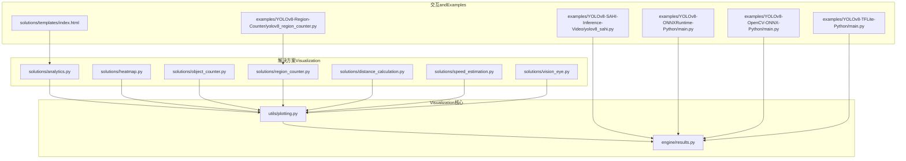
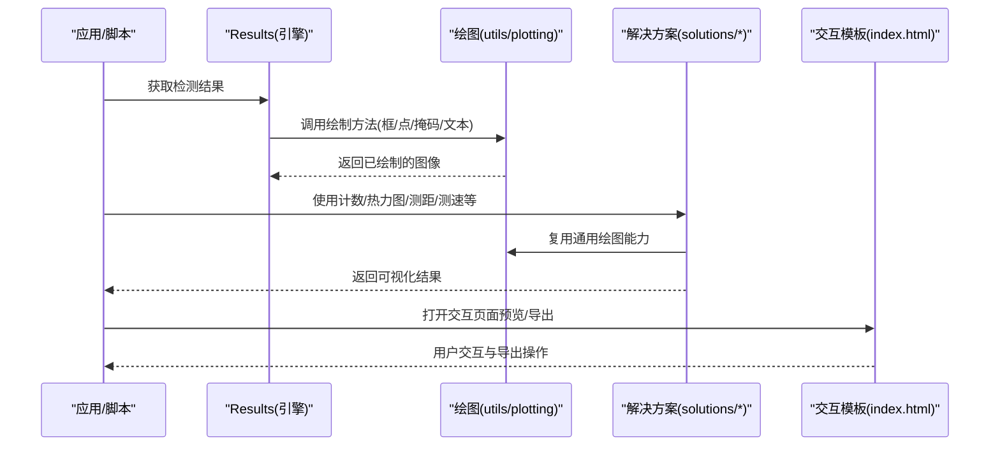
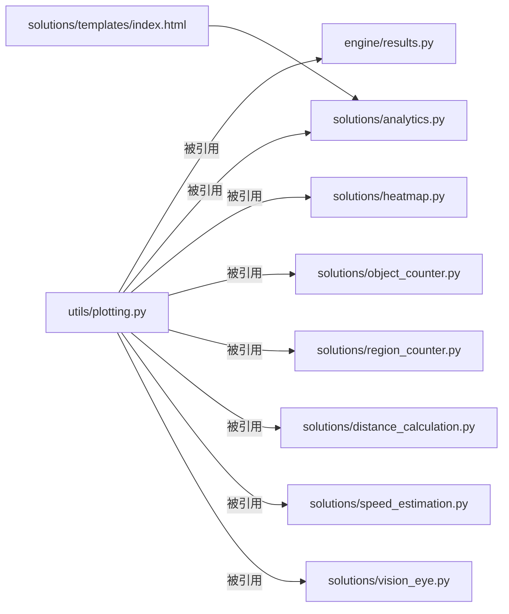

# VisualizationUtilities API

<cite>
**Files Referenced in This Document**
- [ultralytics/utils/plotting.py](file://ultralytics/utils/plotting.py)
- [ultralytics/engine/results.py](file://ultralytics/engine/results.py)
- [ultralytics/solutions/analytics.py](file://ultralytics/solutions/analytics.py)
- [ultralytics/solutions/heatmap.py](file://ultralytics/solutions/heatmap.py)
- [ultralytics/solutions/object_counter.py](file://ultralytics/solutions/object_counter.py)
- [ultralytics/solutions/region_counter.py](file://ultralytics/solutions/region_counter.py)
- [ultralytics/solutions/distance_calculation.py](file://ultralytics/solutions/distance_calculation.py)
- [ultralytics/solutions/speed_estimation.py](file://ultralytics/solutions/speed_estimation.py)
- [ultralytics/solutions/vision_eye.py](file://ultralytics/solutions/vision_eye.py)
- [ultralytics/solutions/templates/index.html](file://ultralytics/solutions/templates/index.html)
- [examples/YOLOv8-SAHI-Inference-Video/yolov8_sahi.py](file://examples/YOLOv8-SAHI-Inference-Video/yolov8_sahi.py)
- [examples/YOLOv8-ONNXRuntime-Python/main.py](file://examples/YOLOv8-ONNXRuntime-Python/main.py)
- [examples/YOLOv8-OpenCV-ONNX-Python/main.py](file://examples/YOLOv8-OpenCV-ONNX-Python/main.py)
- [examples/YOLOv8-TFLite-Python/main.py](file://examples/YOLOv8-TFLite-Python/main.py)
- [examples/YOLOv8-Region-Counter/yolov8_region_counter.py](file://examples/YOLOv8-Region-Counter/yolov8_region_counter.py)
</cite>

## Table of Contents
1. [Introduction](#Introduction)
2. [Project Structure](#Project Structure)
3. [Core Components](#Core Components)
4. [Architecture Overview](#Architecture Overview)
5. [Detailed Component Analysis](#Detailed Component Analysis)
6. [Dependency Analysis](#Dependency Analysis)
7. [Performance Considerations](#Performance Considerations)
8. [Troubleshooting Guide](#Troubleshooting Guide)
9. [Conclusion](#Conclusion)
10. [Appendix](#Appendix)

## Introduction
本文件targetingYOLO-Master的Visualizationcapabilities，聚焦结果绘制and图表生成API：检测结果Visualization、Training曲线绘制、混淆矩阵生成、图像标注（边界框、关键点、掩码叠加）、颜色配置and样式定制、输出格式选项，Centered onand交互式Visualizationand静态图片Export。Documentation同时provides扩展自定义样式的最佳实践andExamples路径，帮助读者快速上手并高效集成to生产流程中。

## Project Structure
Visualization相关代码主要分布whileCentered on下Modules：
- 通用绘图and工具：ultralytics/utils/plotting.py
- InferenceResults Objectand内建绘制：ultralytics/engine/results.py
- 解决方案级Visualization：ultralytics/solutions/*（热力图、计数、测距、测速、视觉之眼etc.）
- 模板and交互页面：ultralytics/solutions/templates/index.html
- Examples脚本：examples/*（展示such as何CallsVisualization接口进行Exportand展示）

Figure Source
- [ultralytics/utils/plotting.py](file://ultralytics/utils/plotting.py)
- [ultralytics/engine/results.py](file://ultralytics/engine/results.py)
- [ultralytics/solutions/analytics.py](file://ultralytics/solutions/analytics.py)
- [ultralytics/solutions/heatmap.py](file://ultralytics/solutions/heatmap.py)
- [ultralytics/solutions/object_counter.py](file://ultralytics/solutions/object_counter.py)
- [ultralytics/solutions/region_counter.py](file://ultralytics/solutions/region_counter.py)
- [ultralytics/solutions/distance_calculation.py](file://ultralytics/solutions/distance_calculation.py)
- [ultralytics/solutions/speed_estimation.py](file://ultralytics/solutions/speed_estimation.py)
- [ultralytics/solutions/vision_eye.py](file://ultralytics/solutions/vision_eye.py)
- [ultralytics/solutions/templates/index.html](file://ultralytics/solutions/templates/index.html)
- [examples/YOLOv8-SAHI-Inference-Video/yolov8_sahi.py](file://examples/YOLOv8-SAHI-Inference-Video/yolov8_sahi.py)
- [examples/YOLOv8-ONNXRuntime-Python/main.py](file://examples/YOLOv8-ONNXRuntime-Python/main.py)
- [examples/YOLOv8-OpenCV-ONNX-Python/main.py](file://examples/YOLOv8-OpenCV-ONNX-Python/main.py)
- [examples/YOLOv8-TFLite-Python/main.py](file://examples/YOLOv8-TFLite-Python/main.py)
- [examples/YOLOv8-Region-Counter/yolov8_region_counter.py](file://examples/YOLOv8-Region-Counter/yolov8_region_counter.py)

Section Source
- [ultralytics/utils/plotting.py](file://ultralytics/utils/plotting.py)
- [ultralytics/engine/results.py](file://ultralytics/engine/results.py)
- [ultralytics/solutions/analytics.py](file://ultralytics/solutions/analytics.py)
- [ultralytics/solutions/heatmap.py](file://ultralytics/solutions/heatmap.py)
- [ultralytics/solutions/object_counter.py](file://ultralytics/solutions/object_counter.py)
- [ultralytics/solutions/region_counter.py](file://ultralytics/solutions/region_counter.py)
- [ultralytics/solutions/distance_calculation.py](file://ultralytics/solutions/distance_calculation.py)
- [ultralytics/solutions/speed_estimation.py](file://ultralytics/solutions/speed_estimation.py)
- [ultralytics/solutions/vision_eye.py](file://ultralytics/solutions/vision_eye.py)
- [ultralytics/solutions/templates/index.html](file://ultralytics/solutions/templates/index.html)
- [examples/YOLOv8-SAHI-Inference-Video/yolov8_sahi.py](file://examples/YOLOv8-SAHI-Inference-Video/yolov8_sahi.py)
- [examples/YOLOv8-ONNXRuntime-Python/main.py](file://examples/YOLOv8-ONNXRuntime-Python/main.py)
- [examples/YOLOv8-OpenCV-ONNX-Python/main.py](file://examples/YOLOv8-OpenCV-ONNX-Python/main.py)
- [examples/YOLOv8-TFLite-Python/main.py](file://examples/YOLOv8-TFLite-Python/main.py)
- [examples/YOLOv8-Region-Counter/yolov8_region_counter.py](file://examples/YOLOv8-Region-Counter/yolov8_region_counter.py)

## Core Components
- 通用绘图and标注（utils/plotting.py）
  - 负责基础图形绘制、颜色映射、字体and样式、坐标变换、边界框/多边形/关键点/掩码叠加etc.通用capabilities。
  - providesTraining曲线绘制、混淆矩阵生成、Metrics图表etc.数据Visualization函数。
- Inference结果Visualization（engine/results.py）
  - whileResults对象上Encapsulates了便捷绘制方法，Supporting将检测结果直接渲染to图像或Exporting toVisualization结果。
- 解决方案Visualization（solutions/*）
  - targeting业务场景的Visualization组件：热力图、目标计数、区域计数、距离计算、速度估计、视觉之眼etc.，内部复用通用绘图capabilities。
- 交互模板（solutions/templates/index.html）
  - provides轻量Web界面用于交互式查看andExport，便于whileNotebook或本地服务中预览。

Section Source
- [ultralytics/utils/plotting.py](file://ultralytics/utils/plotting.py)
- [ultralytics/engine/results.py](file://ultralytics/engine/results.py)
- [ultralytics/solutions/analytics.py](file://ultralytics/solutions/analytics.py)
- [ultralytics/solutions/heatmap.py](file://ultralytics/solutions/heatmap.py)
- [ultralytics/solutions/object_counter.py](file://ultralytics/solutions/object_counter.py)
- [ultralytics/solutions/region_counter.py](file://ultralytics/solutions/region_counter.py)
- [ultralytics/solutions/distance_calculation.py](file://ultralytics/solutions/distance_calculation.py)
- [ultralytics/solutions/speed_estimation.py](file://ultralytics/solutions/speed_estimation.py)
- [ultralytics/solutions/vision_eye.py](file://ultralytics/solutions/vision_eye.py)
- [ultralytics/solutions/templates/index.html](file://ultralytics/solutions/templates/index.html)

## Architecture Overview
下图展示了从“Inference结果”to“Visualization输出”的整体流程，包括通用绘图、Results Object绘制、解决方案组件and交互模板之间的协作关系。

Figure Source
- [ultralytics/engine/results.py](file://ultralytics/engine/results.py)
- [ultralytics/utils/plotting.py](file://ultralytics/utils/plotting.py)
- [ultralytics/solutions/analytics.py](file://ultralytics/solutions/analytics.py)
- [ultralytics/solutions/heatmap.py](file://ultralytics/solutions/heatmap.py)
- [ultralytics/solutions/object_counter.py](file://ultralytics/solutions/object_counter.py)
- [ultralytics/solutions/region_counter.py](file://ultralytics/solutions/region_counter.py)
- [ultralytics/solutions/distance_calculation.py](file://ultralytics/solutions/distance_calculation.py)
- [ultralytics/solutions/speed_estimation.py](file://ultralytics/solutions/speed_estimation.py)
- [ultralytics/solutions/vision_eye.py](file://ultralytics/solutions/vision_eye.py)
- [ultralytics/solutions/templates/index.html](file://ultralytics/solutions/templates/index.html)

## Detailed Component Analysis

### 通用绘图and标注（utils/plotting.py）
- 功能要点
  - 图像标注：边界框绘制、多边形/掩码叠加、关键点标记、文本标签、箭头and连线。
  - 颜色and样式：类别颜色映射、透明度控制、线宽and字体大小、背景色and网格开关。
  - 图表绘制：Training曲线、混淆矩阵、Metrics折线/柱状图etc.。
  - 输出格式：SupportingPNG/JPG/PDF/SVGetc.常见格式，可指定分辨率and质量参数。
- Typical Usage
  - whileResults对象上Calls绘制方法，或直接传入图像and检测数据进行标注。
  - Via样式参数统一调整外观，such as颜色主题、透明度、边框粗细etc.。
  - 批量Export时建议关闭交互显示Centered on提升性能。
- 扩展建议
  - 自定义颜色表：基于类别数量动态生成或加载外部配色方案。
  - 自定义字体and字号：适配不同语言and屏幕密度。
  - 新增视觉元素：such asConfidence Threshold过滤、ID轨迹线、ROI高亮etc.。

Section Source
- [ultralytics/utils/plotting.py](file://ultralytics/utils/plotting.py)

### Inference结果Visualization（engine/results.py）
- 功能要点
  - Results对象Encapsulates了检测结果，并provides便捷的绘制接口，可直接渲染to图像或保存for文件。
  - Supporting多种Tasks类型的Visualization：检测、分割、姿态、Trackingetc.。
- Typical Usage
  - whileInference后对ResultsCalls绘制方法，设置是否显示、是否保存、样式参数etc.。
  - Combining解决方案组件进行增强Visualization（such as叠加热力图或计数信息）。
- 注意事项
  - 大批量处理时建议关闭实时显示，优先写入磁盘。
  - 注意输入图像通道顺序and尺寸一致性。

Section Source
- [ultralytics/engine/results.py](file://ultralytics/engine/results.py)

### 解决方案Visualization（solutions/*）
- analytics.py
  - 聚合分析and统计类Visualization，常用于汇总Metricsand趋势展示。
- heatmap.py
  - 将密集事件或注意力分布Centered on热力图形式叠加to原图上，适合人群密度、关注区域分析。
- object_counter.py
  - 跨线计数、进出统计，适用于人流/车流监控场景。
- region_counter.py
  - 区域命中计数，Supporting多边形ROIand动态更新。
- distance_calculation.py
  - 基于关键点或中心点的距离估算，辅助行for分析。
- speed_estimation.py
  - 基于连续帧位移的速度估计，Combining时间戳and像素尺度换算。
- vision_eye.py
  - provides“视觉之眼”效果，聚焦关键区域或异常检测结果的局部放大视图。
- 交互模板 index.html
  - provides轻量Web界面，Supporting选择视频/图片、切换Visualization层、Export当前帧或片段。

Section Source
- [ultralytics/solutions/analytics.py](file://ultralytics/solutions/analytics.py)
- [ultralytics/solutions/heatmap.py](file://ultralytics/solutions/heatmap.py)
- [ultralytics/solutions/object_counter.py](file://ultralytics/solutions/object_counter.py)
- [ultralytics/solutions/region_counter.py](file://ultralytics/solutions/region_counter.py)
- [ultralytics/solutions/distance_calculation.py](file://ultralytics/solutions/distance_calculation.py)
- [ultralytics/solutions/speed_estimation.py](file://ultralytics/solutions/speed_estimation.py)
- [ultralytics/solutions/vision_eye.py](file://ultralytics/solutions/vision_eye.py)
- [ultralytics/solutions/templates/index.html](file://ultralytics/solutions/templates/index.html)

### Examplesand集成路径
- SAHI切片InferenceVisualization
  - Refer to路径：[examples/YOLOv8-SAHI-Inference-Video/yolov8_sahi.py](file://examples/YOLOv8-SAHI-Inference-Video/yolov8_sahi.py)
  - 说明：演示大图切片Inference后的Visualization拼接andExport。
- ONNX RuntimeInferenceVisualization
  - Refer to路径：[examples/YOLOv8-ONNXRuntime-Python/main.py](file://examples/YOLOv8-ONNXRuntime-Python/main.py)
  - 说明：展示模型Inference后CallsVisualization接口的标准流程。
- OpenCV后端Visualization
  - Refer to路径：[examples/YOLOv8-OpenCV-ONNX-Python/main.py](file://examples/YOLOv8-OpenCV-ONNX-Python/main.py)
  - 说明：利用OpenCV进行图像读取andVisualization输出。
- TFLite端侧InferenceVisualization
  - Refer to路径：[examples/YOLOv8-TFLite-Python/main.py](file://examples/YOLOv8-TFLite-Python/main.py)
  - 说明：端侧部署下的VisualizationandExport策略。
- 区域计数Examples
  - Refer to路径：[examples/YOLOv8-Region-Counter/yolov8_region_counter.py](file://examples/YOLOv8-Region-Counter/yolov8_region_counter.py)
  - 说明：Combiningregion_counter进行ROI计数andVisualization。

Section Source
- [examples/YOLOv8-SAHI-Inference-Video/yolov8_sahi.py](file://examples/YOLOv8-SAHI-Inference-Video/yolov8_sahi.py)
- [examples/YOLOv8-ONNXRuntime-Python/main.py](file://examples/YOLOv8-ONNXRuntime-Python/main.py)
- [examples/YOLOv8-OpenCV-ONNX-Python/main.py](file://examples/YOLOv8-OpenCV-ONNX-Python/main.py)
- [examples/YOLOv8-TFLite-Python/main.py](file://examples/YOLOv8-TFLite-Python/main.py)
- [examples/YOLOv8-Region-Counter/yolov8_region_counter.py](file://examples/YOLOv8-Region-Counter/yolov8_region_counter.py)

## Dependency Analysis
- 耦合and内聚
  - solutions/* 高度依赖 utils/plotting.py 的基础绘制capabilities，保持低耦合、高内聚。
  - engine/results.py 作for结果载体，向上暴露简洁的绘制接口，向下复用通用绘图。
- External Dependencies
  - 图像处理andIO：OpenCV、Pillow、matplotlibetc.（由底层implementing决定）。
  - 交互展示：HTML模板and浏览器渲染。
- Potential Cycles依赖
  - 当前分层清晰，未见明显循环依赖；建议while新增Visualization组件时遵循“先通用后专用”的原则。

Figure Source
- [ultralytics/utils/plotting.py](file://ultralytics/utils/plotting.py)
- [ultralytics/engine/results.py](file://ultralytics/engine/results.py)
- [ultralytics/solutions/analytics.py](file://ultralytics/solutions/analytics.py)
- [ultralytics/solutions/heatmap.py](file://ultralytics/solutions/heatmap.py)
- [ultralytics/solutions/object_counter.py](file://ultralytics/solutions/object_counter.py)
- [ultralytics/solutions/region_counter.py](file://ultralytics/solutions/region_counter.py)
- [ultralytics/solutions/distance_calculation.py](file://ultralytics/solutions/distance_calculation.py)
- [ultralytics/solutions/speed_estimation.py](file://ultralytics/solutions/speed_estimation.py)
- [ultralytics/solutions/vision_eye.py](file://ultralytics/solutions/vision_eye.py)
- [ultralytics/solutions/templates/index.html](file://ultralytics/solutions/templates/index.html)

## Performance Considerations
- 批量Export
  - 关闭实时显示，优先写入磁盘；合并I/O操作减少频繁刷新。
- 分辨率and质量
  - 根据用途选择合适的输出分辨率and压缩质量，避免过大文件影响传输and存储。
- 内存and缓存
  - 大图像and长视频流处理时，采用分块/滑动窗口策略，and时释放中间变量。
- 并行and线程安全
  - 多线程并发绘制时需确保共享资源（such as字体、颜色表）初始化一次且线程安全。

## Troubleshooting Guide
- 常见问题
  - 中文乱码：检查系统字体and绘图库字体配置。
  - 颜色异常：确认颜色空间and通道顺序一致（BGR/RGB）。
  - Export Failure：检查目标路径权限and磁盘空间。
  - 性能bottlenecks：关闭实时显示、降低分辨率、减少不必要的图层叠加。
- 定位建议
  - 逐步缩小范围：先Validation通用绘图函数，再引入解决方案组件。
  - 打印关键参数：such as图像尺寸、类别数、透明度、线宽etc.。
  - Uses最小复现：构造单帧小图and少量检测项进行回归测试。

## Conclusion
YOLO-Master的Visualization体系Centered on通用绘图for核心，向上provides统一的Results绘制接口，向下支撑丰富的解决方案Visualization组件。Via合理的样式配置and输出策略，可while保证可读性的前提下获得高性能的Visualization体验。建议while生产环境中优先采用批量Exportand离线渲染，并Combining交互模板进行快速Validationand调试。

## Appendix

### API概览andUses要点
- 检测结果Visualization
  - 入口：Results对象的绘制方法（见引擎结果Modules）
  - 要点：Supporting框/点/掩码/文本叠加，可配置透明度、线宽、字体大小
  - Refer to：[ultralytics/engine/results.py](file://ultralytics/engine/results.py)
- Training曲线and混淆矩阵
  - 入口：通用绘图Modules中的图表函数（见绘图Modules）
  - 要点：Supporting多Metrics对比、样式定制、Exporting toPNG/PDF/SVG
  - Refer to：[ultralytics/utils/plotting.py](file://ultralytics/utils/plotting.py)
- 图像标注函数
  - 边界框绘制、关键点标记、掩码叠加、连线and箭头
  - Refer to：[ultralytics/utils/plotting.py](file://ultralytics/utils/plotting.py)
- 颜色配置and样式定制
  - 类别颜色映射、透明度、线宽、字体、背景and网格
  - Refer to：[ultralytics/utils/plotting.py](file://ultralytics/utils/plotting.py)
- 输出格式选项
  - PNG/JPG/PDF/SVG，分辨率and质量可调
  - Refer to：[ultralytics/utils/plotting.py](file://ultralytics/utils/plotting.py)
- 交互式Visualizationand静态Export
  - 交互模板：[ultralytics/solutions/templates/index.html](file://ultralytics/solutions/templates/index.html)
  - Examples脚本：参见各examples路径
- 扩展方法and最佳实践
  - 自定义颜色表and字体
  - 新增视觉元素（ID轨迹、ROI高亮、Confidence Threshold过滤）
  - 批量Exportand异步渲染
  - Refer to：[ultralytics/utils/plotting.py](file://ultralytics/utils/plotting.py)、[ultralytics/solutions/templates/index.html](file://ultralytics/solutions/templates/index.html)