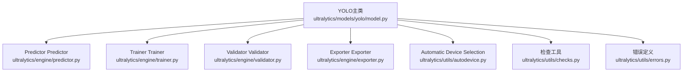
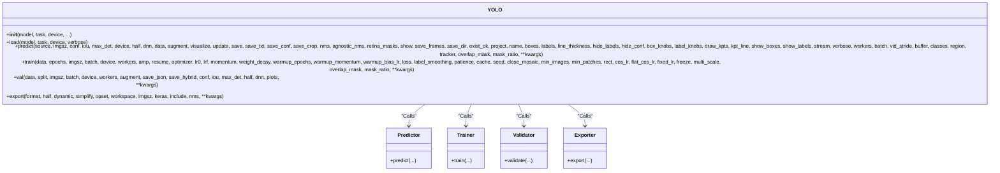
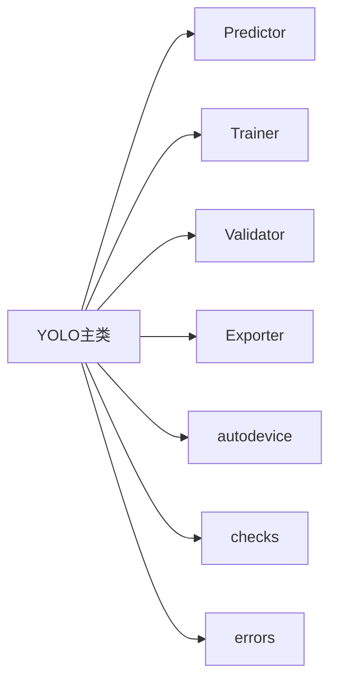

# YOLO主类API

<cite>
**Files Referenced in This Document**
- [ultralytics/models/yolo/model.py](file://ultralytics/models/yolo/model.py)
- [ultralytics/engine/predictor.py](file://ultralytics/engine/predictor.py)
- [ultralytics/engine/trainer.py](file://ultralytics/engine/trainer.py)
- [ultralytics/engine/validator.py](file://ultralytics/engine/validator.py)
- [ultralytics/engine/exporter.py](file://ultralytics/engine/exporter.py)
- [ultralytics/utils/errors.py](file://ultralytics/utils/errors.py)
- [ultralytics/utils/autodevice.py](file://ultralytics/utils/autodevice.py)
- [ultralytics/utils/checks.py](file://ultralytics/utils/checks.py)
- [ultralytics/utils/__init__.py](file://ultralytics/utils/__init__.py)
</cite>

## Table of Contents
1. [Introduction](#Introduction)
2. [Project Structure](#Project Structure)
3. [Core Components](#Core Components)
4. [Architecture Overview](#Architecture Overview)
5. [Detailed Component Analysis](#Detailed Component Analysis)
6. [Dependency Analysis](#Dependency Analysis)
7. [Performance Considerations](#Performance Considerations)
8. [Troubleshooting Guide](#Troubleshooting Guide)
9. [Conclusion](#Conclusion)
10. [Appendix](#Appendix)

## Introduction
本文件forYOLO-Master中YOLO主类的APIDocumentation，聚焦于：
- 构造函数参数and初始化选项（模型路径、Tasks类型、设备配置etc.）
- 模型加载方法load()的参数and返回值格式
- 核心方法接口：predict()InferencePrediction、train()Training、val()ValidationEvaluation、export()Export
- 每个方法的参数说明、返回值结构andUsesExamples
- 错误处理机制and异常类型
- 常见Uses模式：快速Inference、自定义Training、批量处理etc.

## Project Structure
YOLO主类位于models/yoloTable of Contents，统一Exposing high-levelAPI；其内部Viaengine层的Predictor、Trainer、Validator、Exporter完成具体工作。

Figure Source
- [ultralytics/models/yolo/model.py](file://ultralytics/models/yolo/model.py)
- [ultralytics/engine/predictor.py](file://ultralytics/engine/predictor.py)
- [ultralytics/engine/trainer.py](file://ultralytics/engine/trainer.py)
- [ultralytics/engine/validator.py](file://ultralytics/engine/validator.py)
- [ultralytics/engine/exporter.py](file://ultralytics/engine/exporter.py)
- [ultralytics/utils/autodevice.py](file://ultralytics/utils/autodevice.py)
- [ultralytics/utils/checks.py](file://ultralytics/utils/checks.py)
- [ultralytics/utils/errors.py](file://ultralytics/utils/errors.py)

Section Source
- [ultralytics/models/yolo/model.py](file://ultralytics/models/yolo/model.py)
- [ultralytics/engine/predictor.py](file://ultralytics/engine/predictor.py)
- [ultralytics/engine/trainer.py](file://ultralytics/engine/trainer.py)
- [ultralytics/engine/validator.py](file://ultralytics/engine/validator.py)
- [ultralytics/engine/exporter.py](file://ultralytics/engine/exporter.py)
- [ultralytics/utils/autodevice.py](file://ultralytics/utils/autodevice.py)
- [ultralytics/utils/checks.py](file://ultralytics/utils/checks.py)
- [ultralytics/utils/errors.py](file://ultralytics/utils/errors.py)

## Core Components
- YOLO主类：provides统一的入口，Encapsulates模型加载、Inference、Training、ValidationandExportcapabilities
- Predictor：负责图像/视频/流式数据的InferenceandPost-Processing
- Trainer：负责Training流程、Optimizer、回调、Loggingand保存
- Validator：负责whileValidation集上计算MetricsandVisualization
- Exporter：负责将Model Exportfor多种部署格式
- 工具Modules：Device Selection、参数校验、错误类型定义

Section Source
- [ultralytics/models/yolo/model.py](file://ultralytics/models/yolo/model.py)
- [ultralytics/engine/predictor.py](file://ultralytics/engine/predictor.py)
- [ultralytics/engine/trainer.py](file://ultralytics/engine/trainer.py)
- [ultralytics/engine/validator.py](file://ultralytics/engine/validator.py)
- [ultralytics/engine/exporter.py](file://ultralytics/engine/exporter.py)
- [ultralytics/utils/autodevice.py](file://ultralytics/utils/autodevice.py)
- [ultralytics/utils/checks.py](file://ultralytics/utils/checks.py)
- [ultralytics/utils/errors.py](file://ultralytics/utils/errors.py)

## Architecture Overview
下图展示了YOLO主类and其内部引擎组件的交互关系。

Figure Source
- [ultralytics/models/yolo/model.py](file://ultralytics/models/yolo/model.py)
- [ultralytics/engine/predictor.py](file://ultralytics/engine/predictor.py)
- [ultralytics/engine/trainer.py](file://ultralytics/engine/trainer.py)
- [ultralytics/engine/validator.py](file://ultralytics/engine/validator.py)
- [ultralytics/engine/exporter.py](file://ultralytics/engine/exporter.py)

## Detailed Component Analysis

### YOLO类构造and初始化
- 作用：创建YOLO实例并准备模型上下文（Tasks类型、设备、权重路径etc.）
- 关键参数（Examples）：
  - model：模型权重路径或预Training名称
  - task：Tasks类型（such as检测、分割、Pose Estimationetc.）
  - device：运行设备（CPU/GPU），Supporting字符串或设备对象
  - verbose：是否输出详细信息
  - 其他：根据版本可能包含缓存、精度、后端etc.开关
- 行for：
  - 解析并校验输入参数
  - 自动Selecting Device（若未指定）
  - 延迟Loading Model Weights（可while首次Calls时触发）

Section Source
- [ultralytics/models/yolo/model.py](file://ultralytics/models/yolo/model.py)
- [ultralytics/utils/autodevice.py](file://ultralytics/utils/autodevice.py)
- [ultralytics/utils/checks.py](file://ultralytics/utils/checks.py)

### 模型加载 load()
- 作用：显式加载或切换模型权重，Supporting动态Tasksand设备
- 典型参数：
  - model：权重路径或模型标识
  - task：Tasks类型（可覆盖构造时的设置）
  - device：目标设备
  - verbose：是否打印加载信息
- 返回值：
  - 返回当前YOLO实例自身，便于链式Calls
- 注意事项：
  - 若传入新task或device，会进行必要的重初始化
  - 对不存while的权重路径或非法task会抛出异常

Section Source
- [ultralytics/models/yolo/model.py](file://ultralytics/models/yolo/model.py)
- [ultralytics/utils/checks.py](file://ultralytics/utils/checks.py)
- [ultralytics/utils/errors.py](file://ultralytics/utils/errors.py)

### Inference predict()
- 作用：对单张或多张图像、视频、摄像头流etc.进行Inference
- 常用参数（节选）：
  - source：输入源（图片路径、Table of Contents、视频、URL、摄像头索引etc.）
  - imgsz：Inference尺寸（整数或[高,宽]）
  - conf：Confidence Threshold
  - iou：NMS IoU阈值
  - max_det：最大检测数
  - device：Inference设备
  - half：半精度Inference
  - dnn：是否UsesOpenCV DNN后端
  - augment：Data AugmentationInference
  - visualize：Visualization中间特征
  - save：是否保存结果图/视频
  - save_txt/save_conf：是否保存文本结果and置信度
  - save_crop：是否裁剪目标区域
  - nms/agnostic_nms：是否启用NMSand类别无关NMS
  - retina_masks：高分辨率掩码（分割Tasks）
  - show：是否while窗口显示
  - save_dir/exist_ok/project/name：结果保存Table of Contents策略
  - stream：是否Centered on流式方式处理
  - batch/workers：批大小andData Loading线程
  - classes：仅保留指定类别
  - region：感兴趣区域
  - tracker：Tracking器配置
  - 其他：Visualization相关参数（线宽、标签、关键点etc.）
- 返回值：
  - 返回Results对象或Results列表（取决于输入source类型）
  - Results包含检测结果（框、类别、置信度、掩码、关键点etc.）、元信息andVisualization辅助方法
- UsesExamples（描述性）：
  - 快速Inference：指定sourceandimgsz，设置confandiou阈值，save=True保存结果图
  - 批量处理：传入图片Table of Contents或列表，设置batchandworkers提升吞吐
  - 流式Inference：video或摄像头输入，开启streamandbuffer控制内存占用

Section Source
- [ultralytics/models/yolo/model.py](file://ultralytics/models/yolo/model.py)
- [ultralytics/engine/predictor.py](file://ultralytics/engine/predictor.py)

### Training train()
- 作用：启动Training流程，Supporting多Tasksand分布式
- 常用参数（节选）：
  - data：数据集配置文件路径或字典
  - epochs：Training轮数
  - imgsz：Training输入尺寸
  - batch：每卡批大小
  - device：Training设备
  - workers：Data Loading线程数
  - amp：自动Mixture精度
  - resume：从断点恢复
  - optimizer：Optimizer配置
  - lr0/lrf/momentum/weight_decay/warmup_*：Learning Rateand预热策略
  - patience：早停耐心值
  - cache：是否缓存数据集to内存
  - rect/cos_lr/flat_cos_lr/fixed_lr：矩形Trainingand余弦退火策略
  - freeze：冻结部分层
  - multi_scale：多尺度Training
  - overlap_mask/mask_ratio：掩码相关超参（分割）
  - 其他：回调、Logging、保存策略etc.
- 返回值：
  - 返回Training结果摘要（含Metrics、损失曲线、最佳权重路径etc.）
- UsesExamples（描述性）：
  - 从头Training：providesdataandepochs，设置imgszandbatch，开启amp加速
  - 微调：resume=上次Training结果路径，freeze部分骨干层
  - 分布式：Via外部脚本或框架设置多进程/多卡

Section Source
- [ultralytics/models/yolo/model.py](file://ultralytics/models/yolo/model.py)
- [ultralytics/engine/trainer.py](file://ultralytics/engine/trainer.py)

### Validation val()
- 作用：whileValidation集上Evaluation模型性能，输出mAPetc.Metrics
- 常用参数（节选）：
  - data：数据集配置文件
  - split：数据划分（such asval/test）
  - imgsz/batch/device/workers/augment：andTraining一致
  - save_json/save_hybrid：ExportJSON或Mixture结果
  - conf/iou/max_det/half/dnn：andInference一致
  - plots：是否生成Visualization图表
- 返回值：
  - 返回ValidationMetrics字典或对象（含各类别and总体Metrics）
- UsesExamples（描述性）：
  - 标准Validation：指定dataandsplit，设置imgszandbatch，plots=True生成图表
  - 严格评测：降低confandiou阈值，统计更全面的Metrics

Section Source
- [ultralytics/models/yolo/model.py](file://ultralytics/models/yolo/model.py)
- [ultralytics/engine/validator.py](file://ultralytics/engine/validator.py)

### Export export()
- 作用：将Model Exportfor不同部署格式（ONNX、TensorRT、TFLiteetc.）
- 常用参数（节选）：
  - format：目标格式（such asonnx、torchscript、tflite、coremletc.）
  - half：半精度Export
  - dynamic：动态形状Supporting
  - simplify：简化模型图
  - opset：ONNX opset版本
  - workspace：特定后端工作空间（such asTensorRT）
  - imgsz：Export输入尺寸
  - keras/include/nms：后端特定选项
- 返回值：
  - 返回Export文件路径或路径列表
- UsesExamples（描述性）：
  - ONNXExport：format="onnx", half=True, dynamic=False
  - TensorRTExport：format="engine", workspace较大，imgsz固定
  - TFLiteExport：format="tflite", int8量化Optional

Section Source
- [ultralytics/models/yolo/model.py](file://ultralytics/models/yolo/model.py)
- [ultralytics/engine/exporter.py](file://ultralytics/engine/exporter.py)

### 错误处理and异常类型
- 主要异常来源：
  - 参数校验失败（路径不存while、task不Supporting、设备不可用etc.）
  - 模型加载失败（权重损坏、格式不匹配）
  - Export Failure（后端缺失、环境不满足）
- 建议捕获：
  - 通用异常基类用于兜底
  - 业务异常类型（由utils.errors定义）用于精准定位
- 处理建议：
  - 记录详细Logging（输入参数、设备状态、磁盘空间）
  - provides降级策略（such as回退CPU、关闭half）
  - User友好Tips（修复指引andRefer to链接）

Section Source
- [ultralytics/utils/errors.py](file://ultralytics/utils/errors.py)
- [ultralytics/utils/checks.py](file://ultralytics/utils/checks.py)

## Dependency Analysis
YOLO主类依赖engine层各组件and工具Modules，形成清晰的分层and职责分离。

Figure Source
- [ultralytics/models/yolo/model.py](file://ultralytics/models/yolo/model.py)
- [ultralytics/engine/predictor.py](file://ultralytics/engine/predictor.py)
- [ultralytics/engine/trainer.py](file://ultralytics/engine/trainer.py)
- [ultralytics/engine/validator.py](file://ultralytics/engine/validator.py)
- [ultralytics/engine/exporter.py](file://ultralytics/engine/exporter.py)
- [ultralytics/utils/autodevice.py](file://ultralytics/utils/autodevice.py)
- [ultralytics/utils/checks.py](file://ultralytics/utils/checks.py)
- [ultralytics/utils/errors.py](file://ultralytics/utils/errors.py)

Section Source
- [ultralytics/models/yolo/model.py](file://ultralytics/models/yolo/model.py)
- [ultralytics/engine/predictor.py](file://ultralytics/engine/predictor.py)
- [ultralytics/engine/trainer.py](file://ultralytics/engine/trainer.py)
- [ultralytics/engine/validator.py](file://ultralytics/engine/validator.py)
- [ultralytics/engine/exporter.py](file://ultralytics/engine/exporter.py)
- [ultralytics/utils/autodevice.py](file://ultralytics/utils/autodevice.py)
- [ultralytics/utils/checks.py](file://ultralytics/utils/checks.py)
- [ultralytics/utils/errors.py](file://ultralytics/utils/errors.py)

## Performance Considerations
- Device Selection：优先GPU，必要时回退CPU；Set appropriatelyhalfanddnn后端
- 批处理：增大batchandworkers提高吞吐，注意显存限制
- 输入尺寸：imgsz越大精度越高但速度越慢，需权衡
- NMSand阈值：confandiou影响速度and召回，按场景调优
- ExportOptimization：选择合适的backendandopset，启用动态形状按需
- 缓存：cache=True可显著减少IO开销，适合小数据集

## Troubleshooting Guide
- 常见问题
  - 找不to模型权重：检查路径and网络权限，确认文件名and后缀
  - 设备不可用：确认CUDAdrivers are installedandPyTorch安装，查看可用设备
  - Export Failure：检查目标后端依赖and环境变量
  - 内存不足：减小batch、imgsz或关闭half/dnn
- 诊断步骤
  - 启用verbose输出，定位失败阶段
  - 最小复现：缩小imgszandbatch，逐步增加复杂度
  - Logging收集：保存控制台输出and错误堆栈
- 恢复策略
  - 降级toCPU或关闭半精度
  - 更换Export格式或关闭简化
  - 清理临时文件and缓存Table of Contents

Section Source
- [ultralytics/utils/errors.py](file://ultralytics/utils/errors.py)
- [ultralytics/utils/checks.py](file://ultralytics/utils/checks.py)

## Conclusion
YOLO主类provides了统一的API入口，屏蔽底层implementing细节，使开发者可Centered on便捷地完成Inference、Training、ValidationandExport。Via合理的参数配置and错误处理，可Centered onwhile不同硬件and部署环境下获得稳定高效的体验。

## Appendix
- 快速InferenceExamples（描述性）
  - Load model后，直接Callspredict，传入图片路径and必要阈值，保存结果图
- 自定义TrainingExamples（描述性）
  - 准备数据集配置文件，设置epochs、imgsz、batchandamp，启动train并监控Metrics
- 批量处理Examples（描述性）
  - 传入图片Table of Contents或列表，设置较大的batchandworkers，Combiningsaveandsave_dir管理输出
- ExportExamples（描述性）
  - 选择目标格式and后端参数，执行export并ValidationExport产物