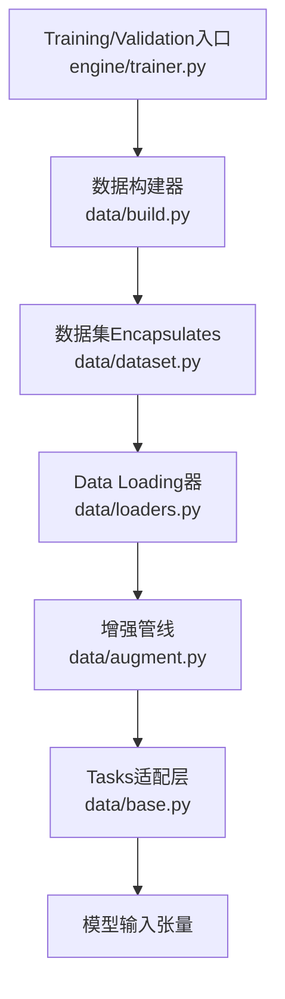
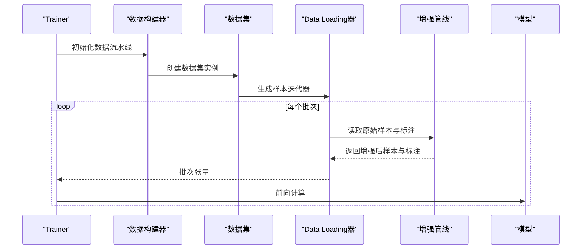
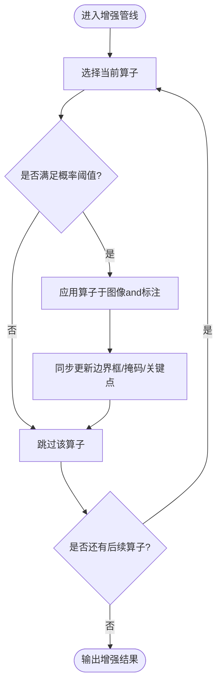
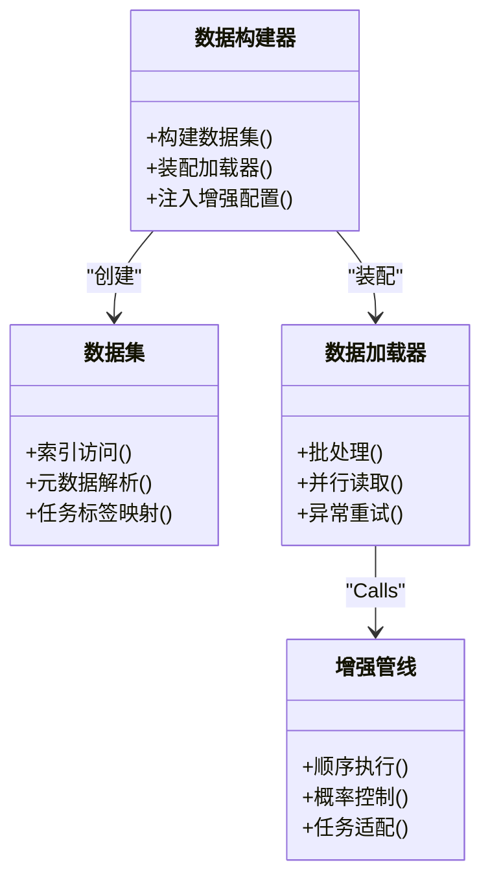
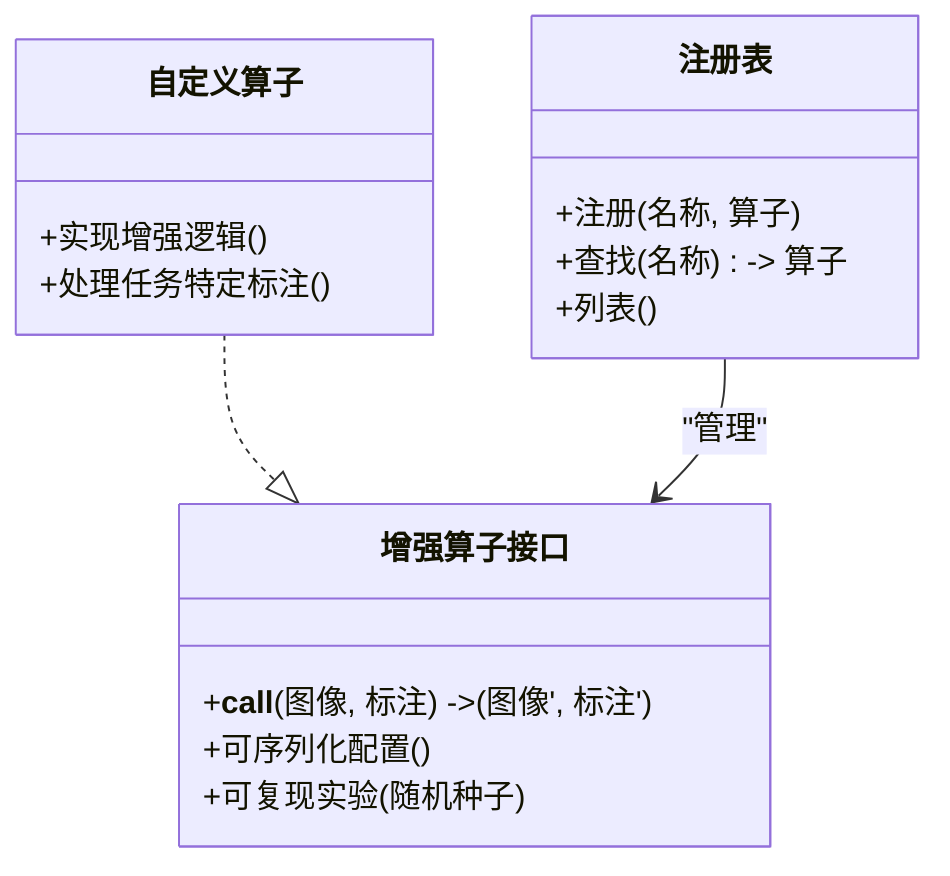
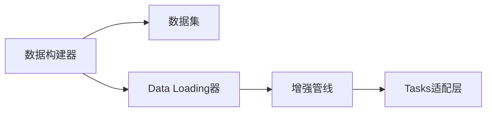

# Data AugmentationAPI

<cite>
**Files Referenced in This Document**
- [augment.py](file://ultralytics/data/augment.py)
- [base.py](file://ultralytics/data/base.py)
- [build.py](file://ultralytics/data/build.py)
- [dataset.py](file://ultralytics/data/dataset.py)
- [loaders.py](file://ultralytics/data/loaders.py)
- [yolo_data_augmentation.md](file://docs/en/guides/yolo-data-augmentation.md)
- [augmentation-args.md](file://docs/macros/augmentation-args.md)
</cite>

## Table of Contents
1. [Introduction](#Introduction)
2. [Project Structure](#Project Structure)
3. [Core Components](#Core Components)
4. [Architecture Overview](#Architecture Overview)
5. [Detailed Component Analysis](#Detailed Component Analysis)
6. [Dependency Analysis](#Dependency Analysis)
7. [Performance Considerations](#Performance Considerations)
8. [Troubleshooting Guide](#Troubleshooting Guide)
9. [Conclusion](#Conclusion)
10. [Appendix](#Appendix)

## Introduction
本文件targetingYOLO-Master的Data AugmentationAPI，系统性梳理Built-in增强算子、增强管道构建and配置方法、自定义增强算子的implementingand注册机制，Centered onand检测、分割、Pose Estimationand other tasks的专用增强策略。同时provides参数调优指南、实时增强的性能Optimizationand内存管理建议，并给出Visualizationand调试工具的Uses要点。

## Project Structure
Data Augmentation相关代码主要位于 ultralytics/data Table of Contents，Combined withDocumentationand宏定义形成“implementing—配置—Uses”的完整链路：
- 增强算子and组合逻辑：ultralytics/data/augment.py
- 数据集基类and通用接口：ultralytics/data/base.py
- Data Loadingand流水线装配：ultralytics/data/build.py, ultralytics/data/dataset.py, ultralytics/data/loaders.py
- UserDocumentationand参数宏：docs/en/guides/yolo-data-augmentation.md, docs/macros/augmentation-args.md

Figure Source
- [build.py](file://ultralytics/data/build.py)
- [dataset.py](file://ultralytics/data/dataset.py)
- [loaders.py](file://ultralytics/data/loaders.py)
- [augment.py](file://ultralytics/data/augment.py)
- [base.py](file://ultralytics/data/base.py)

Section Source
- [augment.py](file://ultralytics/data/augment.py)
- [base.py](file://ultralytics/data/base.py)
- [build.py](file://ultralytics/data/build.py)
- [dataset.py](file://ultralytics/data/dataset.py)
- [loaders.py](file://ultralytics/data/loaders.py)

## Core Components
- 增强算子集合：几何变换（仿射、裁剪、翻转、马赛克、MixUp/CutMixetc.）、颜色增强（亮度、对比度、饱和度、色调、噪声etc.）、Mixture增强（多图融合）etc.。
- 增强管线：将多个算子按顺序或概率组合，Supporting条件执行、随机采样and可复现实验。
- Tasks适配：针对检测、分割、Pose Estimationetc.不同标注类型，确保坐标、掩码、关键点etc.一致更新。
- 配置系统：ViaYAML或宏参数drivers are installed增强强度、概率、比例etc.超参，便于跨实验复用and搜索。

Section Source
- [augment.py](file://ultralytics/data/augment.py)
- [augmentation-args.md](file://docs/macros/augmentation-args.md)
- [yolo_data_augmentation.md](file://docs/en/guides/yolo-data-augmentation.md)

## Architecture Overview
下图展示从Training入口to最终模型输入的增强流程，强调数据流and控制流的关键节点。

Figure Source
- [build.py](file://ultralytics/data/build.py)
- [dataset.py](file://ultralytics/data/dataset.py)
- [loaders.py](file://ultralytics/data/loaders.py)
- [augment.py](file://ultralytics/data/augment.py)

## Detailed Component Analysis

### 增强算子and组合
- 几何变换：仿射（平移、缩放、旋转、剪切）、随机裁剪、边界框对齐、图像重排etc.。
- 颜色增强：HSV空间调整、伽马校正、随机噪声、模糊etc.。
- Mixture增强：Mosaic、MixUp、CutMixetc.，提升小目标and类别不平衡鲁棒性。
- 组合策略：顺序链式、概率分支、条件触发（such as仅Training阶段启用）。

Figure Source
- [augment.py](file://ultralytics/data/augment.py)

Section Source
- [augment.py](file://ultralytics/data/augment.py)

### 增强管道的构建and配置
- 构建方式：Via数据构建器组装数据集and加载器，并while加载阶段注入增强管线。
- 配置项：由宏参数andYAML共同drivers are installed，包括增强强度、概率、比例、随机种子etc.。
- Tasks感知：不同Taskswhile加载时自动绑定对应的标注处理逻辑，保证一致性。

Figure Source
- [build.py](file://ultralytics/data/build.py)
- [dataset.py](file://ultralytics/data/dataset.py)
- [loaders.py](file://ultralytics/data/loaders.py)
- [augment.py](file://ultralytics/data/augment.py)

Section Source
- [build.py](file://ultralytics/data/build.py)
- [dataset.py](file://ultralytics/data/dataset.py)
- [loaders.py](file://ultralytics/data/loaders.py)
- [augmentation-args.md](file://docs/macros/augmentation-args.md)

### 自定义增强算子：implementing接口and注册机制
- implementing接口：遵循统一的输入输出契约，接收图像and标注，返回增强后的图像and标注；保持维度and数据类型稳定。
- 注册机制：ViaRegistry或工厂模式将自定义算子纳入增强管线，Supporting动态加载and优先级控制。
- 兼容性：需兼容检测、分割、Pose Estimationetc.多Tasks标注格式，确保坐标、掩码、关键点同步更新。

Figure Source
- [augment.py](file://ultralytics/data/augment.py)
- [base.py](file://ultralytics/data/base.py)

Section Source
- [augment.py](file://ultralytics/data/augment.py)
- [base.py](file://ultralytics/data/base.py)

### Tasks专用增强策略
- 检测：优先保证边界框完整性and重叠合理性，避免过度裁剪导致目标丢失；CombiningMosaic/MixUp提升小目标召回。
- 分割：掩码需and几何变换严格对齐，注意插值策略and边界像素处理；对薄结构目标谨慎Uses强模糊。
- Pose Estimation：关键点需随仿射变换精确更新，避免超出图像范围；对遮挡and密集姿态场景采用适度增强。

Section Source
- [yolo_data_augmentation.md](file://docs/en/guides/yolo-data-augmentation.md)
- [augment.py](file://ultralytics/data/augment.py)

### 参数调优指南and最佳实践
- 强度and概率：Centered onValidation集Metricsfor基准，逐步提高增强强度and概率，观察过拟合and欠拟合变化。
- Tasks差异：分割andPose Estimation对几何一致性更敏感，建议降低强几何扰动，增加颜色andMixture增强。
- 数据规模：小数据集倾向更强增强；大数据集适度增强即可，避免破坏真实分布。
- 随机性and复现：固定随机种子，记录增强配置快照，便于回溯and对比。

Section Source
- [augmentation-args.md](file://docs/macros/augmentation-args.md)
- [yolo_data_augmentation.md](file://docs/en/guides/yolo-data-augmentation.md)

### 实时增强的性能Optimizationand内存管理
- 并行and缓冲：利用多进程/多线程预取and批内并行，减少I/Obottlenecks；Set appropriately缓冲区大小，避免内存峰值。
- 算子选择：Prefer向量化andGPU友好的算子，避免频繁CPU-GPU拷贝；必要时进行算子融合。
- 动态调度：根据硬件capabilitiesand延迟目标动态调整增强强度and数量，保障吞吐and稳定性。
- 资源回收：and时释放中间张量and缓存，避免长时运行导致的内存泄漏。

Section Source
- [loaders.py](file://ultralytics/data/loaders.py)
- [augment.py](file://ultralytics/data/augment.py)

### 增强效果的Visualizationand调试工具
- Visualization：绘制增强前后图像、边界框、掩码、关键点叠加图，直观Evaluation增强质量。
- 统计监控：Tracking关键Metrics（such as目标尺寸分布、遮挡率、关键点可见率），辅助定位问题。
- Loggingand回放：记录每次增强的参数and随机种子，Supporting回放and回归测试。

Section Source
- [yolo_data_augmentation.md](file://docs/en/guides/yolo-data-augmentation.md)
- [augment.py](file://ultralytics/data/augment.py)

## Dependency Analysis
- Modules耦合：数据构建器依赖数据集and加载器，加载器依赖增强管线；增强管线依赖Tasks适配层。
- External Dependencies：可能引入第三方库（such asOpenCV、NumPy、TorchVisionetc.）Centered onimplementing高效图像处理。
- Potential Cycles：应避免增强管线反向引用数据集或加载器，防止循环依赖。

Figure Source
- [build.py](file://ultralytics/data/build.py)
- [dataset.py](file://ultralytics/data/dataset.py)
- [loaders.py](file://ultralytics/data/loaders.py)
- [augment.py](file://ultralytics/data/augment.py)
- [base.py](file://ultralytics/data/base.py)

Section Source
- [build.py](file://ultralytics/data/build.py)
- [dataset.py](file://ultralytics/data/dataset.py)
- [loaders.py](file://ultralytics/data/loaders.py)
- [augment.py](file://ultralytics/data/augment.py)
- [base.py](file://ultralytics/data/base.py)

## Performance Considerations
- I/Oand预处理分离：将磁盘读取and增强解耦，Uses独立线程池提升吞吐。
- 算子成本Evaluation：对高开销算子进行选择性启用，Combining早停and降级策略。
- 批内并行：whileGPU上批量执行增强，减少内核启动开销。
- 内存水位监控：设置上限and告警，避免OOM；对大分辨率图像进行分块或降采样预处理。

[This section provides general guidance and does not directly analyze specific files]

## Troubleshooting Guide
- 标注不一致：检查Tasks适配层是否正确更新边界框、掩码、关键点；确认仿射矩阵and插值策略。
- 性能抖动：排查Data Loadingbottlenecksand算子热点，必要时替换for更高效implementing或关闭部分增强。
- 随机不可复现：确认随机种子传播路径，确保所有随机源均被固定。
- 内存泄漏：定位未释放的中间对象，检查缓存清理and上下文退出逻辑。

Section Source
- [augment.py](file://ultralytics/data/augment.py)
- [loaders.py](file://ultralytics/data/loaders.py)
- [base.py](file://ultralytics/data/base.py)

## Conclusion
YOLO-Master的Data AugmentationAPIprovides了丰富的Built-in算子and灵活的管道编排capabilities，并ViaTasks适配层确保多Tasks标注的一致性。Via合理的参数调优、性能OptimizationandVisualization工具，可while不同Tasksand硬件环境下获得稳定且高效的增强效果。建议while生产环境中建立增强配置的版本化管理and回归测试，持续监控Metricsand资源占用，确保模型Training的稳健性and可复现性。

## Appendix
- 快速上手：Refer to增强指南Documentation，了解常用增强策略and推荐配置。
- 参数Refer to：查阅宏参数Documentation，获取完整的增强参数清单and默认值说明。
- Examples脚本：CombiningTrainingandValidation脚本，快速集成自定义增强andVisualization流程。

Section Source
- [yolo_data_augmentation.md](file://docs/en/guides/yolo-data-augmentation.md)
- [augmentation-args.md](file://docs/macros/augmentation-args.md)