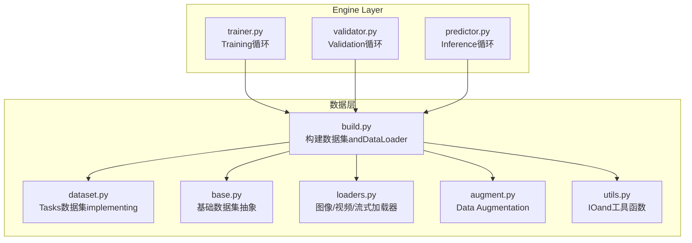
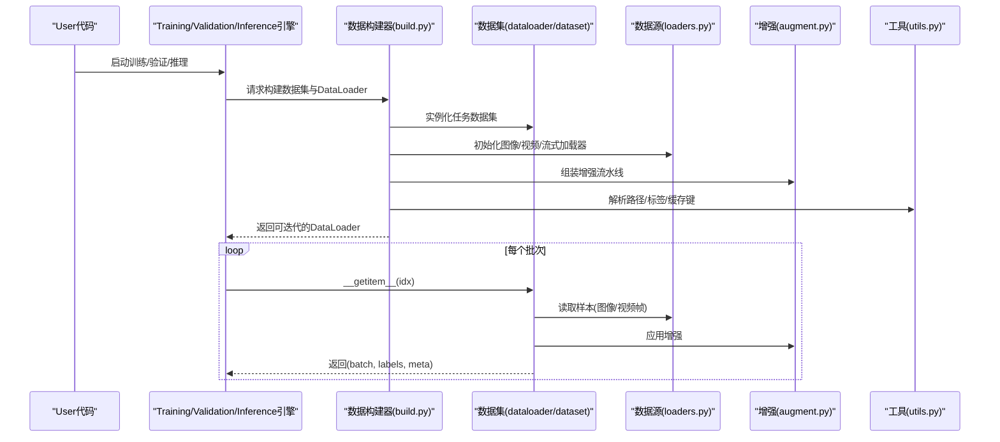
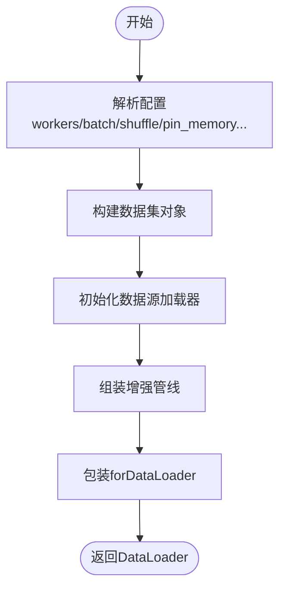
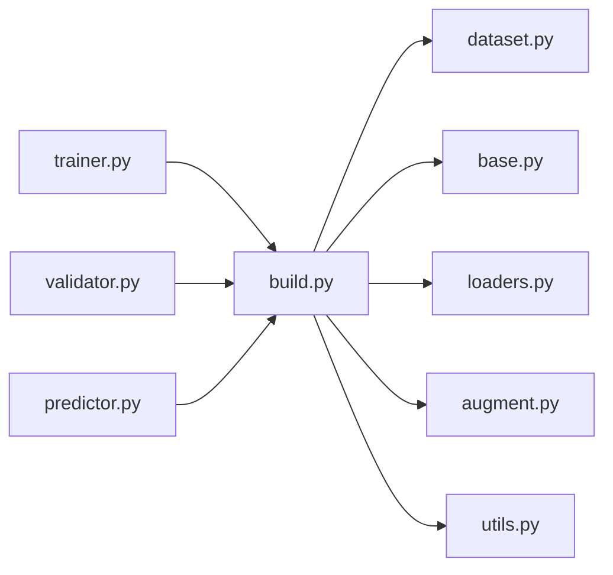

# Data Loading器API

<cite>
**Files Referenced in This Document**
- [ultralytics/data/__init__.py](file://ultralytics/data/__init__.py)
- [ultralytics/data/build.py](file://ultralytics/data/build.py)
- [ultralytics/data/base.py](file://ultralytics/data/base.py)
- [ultralytics/data/dataset.py](file://ultralytics/data/dataset.py)
- [ultralytics/data/loaders.py](file://ultralytics/data/loaders.py)
- [ultralytics/data/augment.py](file://ultralytics/data/augment.py)
- [ultralytics/data/utils.py](file://ultralytics/data/utils.py)
- [ultralytics/engine/trainer.py](file://ultralytics/engine/trainer.py)
- [ultralytics/engine/validator.py](file://ultralytics/engine/validator.py)
- [ultralytics/engine/predictor.py](file://ultralytics/engine/predictor.py)
- [ultralytics/utils/benchmarks.py](file://ultralytics/utils/benchmarks.py)
- [ultralytics/utils/torch_utils.py](file://ultralytics/utils/torch_utils.py)
</cite>

## Table of Contents
1. [Introduction](#Introduction)
2. [Project Structure](#Project Structure)
3. [Core Components](#Core Components)
4. [Architecture Overview](#Architecture Overview)
5. [Detailed Component Analysis](#Detailed Component Analysis)
6. [Dependency Analysis](#Dependency Analysis)
7. [Performance Considerations](#Performance Considerations)
8. [Troubleshooting Guide](#Troubleshooting Guide)
9. [Conclusion](#Conclusion)
10. [Appendix](#Appendix)

## Introduction
本文件for YOLO-Master 的Data Loading器 API provides系统化Documentation，覆盖Centered on下主题：
- DataLoader 的implementing类and配置选项
- 图像、视频、流式数据的加载方法andOptimization策略
- 多进程Data Loading的配置and性能调优
- 自定义数据源的集成接口andAdapter模式
- 数据预取、缓存and内存管理最佳实践
- GPU Data Loadingand CUDA OptimizationUses指南
- 错误处理and重试机制
- Data Loading性能的监控and分析工具

## Project Structure
Data Loading相关代码集中while ultralytics/data 包中，并Via engine 层whileTraining、ValidationandInference流程中被消费。关键入口and职责such as下：
- data/build.py：负责构建数据集and DataLoader（包括多进程、批处理、打乱etc.）
- data/base.py：定义基础数据集抽象and通用capabilities
- data/dataset.py：具体数据集implementing（such as检测、分割、姿态and other tasks的数据集）
- data/loaders.py：图像、视频、流式数据源加载器
- data/augment.py：Data Augmentation管线
- data/utils.py：IO、路径解析、标签格式转换etc.工具
- engine/trainer.py、engine/validator.py、engine/predictor.py：Training/Validation/Inference对Data Loading器的Calls点

Figure Source
- [ultralytics/data/build.py](file://ultralytics/data/build.py)
- [ultralytics/data/dataset.py](file://ultralytics/data/dataset.py)
- [ultralytics/data/base.py](file://ultralytics/data/base.py)
- [ultralytics/data/loaders.py](file://ultralytics/data/loaders.py)
- [ultralytics/data/augment.py](file://ultralytics/data/augment.py)
- [ultralytics/data/utils.py](file://ultralytics/data/utils.py)
- [ultralytics/engine/trainer.py](file://ultralytics/engine/trainer.py)
- [ultralytics/engine/validator.py](file://ultralytics/engine/validator.py)
- [ultralytics/engine/predictor.py](file://ultralytics/engine/predictor.py)

Section Source
- [ultralytics/data/build.py](file://ultralytics/data/build.py)
- [ultralytics/data/dataset.py](file://ultralytics/data/dataset.py)
- [ultralytics/data/base.py](file://ultralytics/data/base.py)
- [ultralytics/data/loaders.py](file://ultralytics/data/loaders.py)
- [ultralytics/data/augment.py](file://ultralytics/data/augment.py)
- [ultralytics/data/utils.py](file://ultralytics/data/utils.py)
- [ultralytics/engine/trainer.py](file://ultralytics/engine/trainer.py)
- [ultralytics/engine/validator.py](file://ultralytics/engine/validator.py)
- [ultralytics/engine/predictor.py](file://ultralytics/engine/predictor.py)

## Core Components
- 数据集构建器（data/build.py）
  - 负责根据Tasks类型and配置创建数据集对象and DataLoader
  - Supporting多进程 worker、批大小、采样策略、Data Augmentation、缓存etc.
- 基础数据集抽象（data/base.py）
  - 定义统一的数据访问协议（索引、长度、getitem etc.）
  - provides通用元Data processingand校验逻辑
- Tasks数据集implementing（data/dataset.py）
  - targeting检测、分割、姿态、Trackingand other tasks的专用数据集
  - Encapsulates标签解析、坐标归一化、类别映射etc.
- 数据源加载器（data/loaders.py）
  - 图像文件夹、视频文件、摄像头/网络流etc.数据源
  - provides统一的迭代接口and帧级处理钩子
- Data Augmentation（data/augment.py）
  - 几何变换、色彩扰动、Mosaic/Copy-Paste etc.
  - and DataLoader 的 worker 并行执行
- 工具函数（data/utils.py）
  - 路径解析、格式转换、批量 IO Optimization、缓存键生成etc.

Section Source
- [ultralytics/data/build.py](file://ultralytics/data/build.py)
- [ultralytics/data/base.py](file://ultralytics/data/base.py)
- [ultralytics/data/dataset.py](file://ultralytics/data/dataset.py)
- [ultralytics/data/loaders.py](file://ultralytics/data/loaders.py)
- [ultralytics/data/augment.py](file://ultralytics/data/augment.py)
- [ultralytics/data/utils.py](file://ultralytics/data/utils.py)

## Architecture Overview
下图展示了从引擎to数据层的Calls链路and数据流向。

Figure Source
- [ultralytics/engine/trainer.py](file://ultralytics/engine/trainer.py)
- [ultralytics/engine/validator.py](file://ultralytics/engine/validator.py)
- [ultralytics/engine/predictor.py](file://ultralytics/engine/predictor.py)
- [ultralytics/data/build.py](file://ultralytics/data/build.py)
- [ultralytics/data/dataset.py](file://ultralytics/data/dataset.py)
- [ultralytics/data/loaders.py](file://ultralytics/data/loaders.py)
- [ultralytics/data/augment.py](file://ultralytics/data/augment.py)
- [ultralytics/data/utils.py](file://ultralytics/data/utils.py)

## Detailed Component Analysis

### 数据构建器（data/build.py）
- 职责
  - 根据Tasksand配置创建数据集and DataLoader
  - 配置多进程 worker、batch size、shuffle、drop_last、pin_memory、prefetch_factor etc.
  - 将Data Augmentationand数据源加载器组合进迭代器
- 关键配置项（Examples）
  - workers：Data Loading进程数
  - batch_size：每批次样本数
  - shuffle：是否打乱顺序
  - pin_memory：是否固定内存Centered on加速GPU传输
  - prefetch_factor：每个worker预取批次数量
  - persistent_workers：持久化workerCentered on减少开销
  - cache_dir：缓存Table of Contents（用于图像/标签缓存）
  - augment：是否启用增强and增强参数
- 典型Calls位置
  - Training/Validation/Inference引擎while初始化阶段Calls构建器获取 DataLoader

Figure Source
- [ultralytics/data/build.py](file://ultralytics/data/build.py)

Section Source
- [ultralytics/data/build.py](file://ultralytics/data/build.py)

### 基础数据集抽象（data/base.py）
- 职责
  - 定义数据集协议：__len__、__getitem__、索引映射、元数据访问
  - provides通用校验、异常捕获andLogging
- 设计要点
  - 子类需implementing样本读取and标注解析
  - 建议implementing缓存键生成Centered on复用已处理样本

Section Source
- [ultralytics/data/base.py](file://ultralytics/data/base.py)

### Tasks数据集implementing（data/dataset.py）
- 职责
  - 针对检测、分割、姿态and other tasksimplementing具体的样本读取and标注解析
  - 处理坐标格式转换、类别映射、边界框有效性检查
- and增强管线协作
  - while __getitem__ 中按需应用增强，保证标签同步变换

Section Source
- [ultralytics/data/dataset.py](file://ultralytics/data/dataset.py)

### 数据源加载器（data/loaders.py）
- Supporting的源类型
  - 图像文件夹：按路径或清单遍历
  - 视频文件：逐帧读取并Optional抽帧
  - 流式数据：摄像头或网络流，Supporting断线重连and缓冲
- 关键特性
  - 统一迭代接口，便于被数据集Encapsulates
  - Optional帧级预处理（缩放、裁剪、格式转换）
  - 流式场景下的丢帧策略and时间戳对齐

Section Source
- [ultralytics/data/loaders.py](file://ultralytics/data/loaders.py)

### Data Augmentation（data/augment.py）
- 常见增强
  - 几何：随机仿射、旋转、翻转、缩放
  - 色彩：亮度、对比度、饱和度、色调
  - 高级：Mosaic、Copy-Paste、MixUp etc.
- and DataLoader 的关系
  - while worker 进程中执行，避免阻塞主线程
  - 可Via配置开关and参数控制强度and概率

Section Source
- [ultralytics/data/augment.py](file://ultralytics/data/augment.py)

### 工具函数（data/utils.py）
- 功能
  - 路径解析、文件存while性检查、扩展名识别
  - 标签格式转换（COCO/YOLO/VOC etc.）
  - 缓存键生成and清理策略
- 性能相关
  - 批量 IO and异步读取建议
  - 大文件分块读取and内存映射

Section Source
- [ultralytics/data/utils.py](file://ultralytics/data/utils.py)

### 引擎集成点（trainer/validator/predictor）
- Training（trainer.py）
  - 构建Training DataLoader，开启 shuffle and增强
  - Combining多卡/分布式时的数据切分and同步
- Validation（validator.py）
  - 构建Validation DataLoader，通常关闭增强，确保确定性
- Inference（predictor.py）
  - 构建Inference DataLoader，可能针对单图/视频/流式输入进行Optimization

Section Source
- [ultralytics/engine/trainer.py](file://ultralytics/engine/trainer.py)
- [ultralytics/engine/validator.py](file://ultralytics/engine/validator.py)
- [ultralytics/engine/predictor.py](file://ultralytics/engine/predictor.py)

## Dependency Analysis
- 耦合关系
  - build.py 强依赖 dataset.py、loaders.py、augment.py、utils.py
  - trainer/validator/predictor Via build.py 间接依赖数据层
- External Dependencies
  - PyTorch DataLoader and其多进程机制
  - OpenCV/PIL 用于图像/视频解码
  - 可能的第三方库（such as DALI）用于 GPU acceleration（见下文“GPU Data Loadingand CUDA Optimization”）

Figure Source
- [ultralytics/engine/trainer.py](file://ultralytics/engine/trainer.py)
- [ultralytics/engine/validator.py](file://ultralytics/engine/validator.py)
- [ultralytics/engine/predictor.py](file://ultralytics/engine/predictor.py)
- [ultralytics/data/build.py](file://ultralytics/data/build.py)
- [ultralytics/data/dataset.py](file://ultralytics/data/dataset.py)
- [ultralytics/data/base.py](file://ultralytics/data/base.py)
- [ultralytics/data/loaders.py](file://ultralytics/data/loaders.py)
- [ultralytics/data/augment.py](file://ultralytics/data/augment.py)
- [ultralytics/data/utils.py](file://ultralytics/data/utils.py)

Section Source
- [ultralytics/data/build.py](file://ultralytics/data/build.py)
- [ultralytics/data/dataset.py](file://ultralytics/data/dataset.py)
- [ultralytics/data/base.py](file://ultralytics/data/base.py)
- [ultralytics/data/loaders.py](file://ultralytics/data/loaders.py)
- [ultralytics/data/augment.py](file://ultralytics/data/augment.py)
- [ultralytics/data/utils.py](file://ultralytics/data/utils.py)
- [ultralytics/engine/trainer.py](file://ultralytics/engine/trainer.py)
- [ultralytics/engine/validator.py](file://ultralytics/engine/validator.py)
- [ultralytics/engine/predictor.py](file://ultralytics/engine/predictor.py)

## Performance Considerations
- 多进程Data Loading
  - Set appropriately workers 数量（通常for CPU 核心数的 1/2~1）
  - Uses persistent_workers 减少进程重启开销
  - 对于小数据集，适当降低 workers Centered on避免进程间通信bottlenecks
- 预取and批处理
  - 调整 prefetch_factor 平衡内存and吞吐
  - 增大 batch_size 提升 GPU 利用率，但需关注显存占用
- 内存and缓存
  - 启用图像/标签缓存（cache_dir），减少重复 IO
  - Uses pin_memory=True 加速主机to设备数据传输
- Data Augmentation
  - while worker 中执行增强，避免阻塞主线程
  - 对高分辨率图像采用渐进式增强或先缩放再增强
- GPU Data Loadingand CUDA Optimization
  - Prefer pin_memory and非阻塞拷贝
  - 若环境Supporting，可考虑Uses NVIDIA DALI 进行 GPU 端解码and增强（Refer toDocumentation中的 nvidia-dali 指南）
- 监控and分析
  - UsesBuilt-in基准工具EvaluationData Loading吞吐and延迟
  - Combining系统监控（CPU/GPU/IO）定位bottlenecks

Section Source
- [ultralytics/utils/benchmarks.py](file://ultralytics/utils/benchmarks.py)
- [ultralytics/utils/torch_utils.py](file://ultralytics/utils/torch_utils.py)

## Troubleshooting Guide
- 常见问题
  - 数据缺失或路径错误：检查 utils 的路径解析and存while性校验
  - 标签格式不一致：确认标签转换逻辑and类别映射
  - 多进程崩溃：查看 worker Loggingand异常堆栈，必要时降低 workers
  - 流式数据中断：implementing断线重连and缓冲策略
- 错误处理and重试
  - while数据源加载器中捕获 IO 异常并实施指数退避重试
  - 对损坏样本进行跳过and计数统计，避免中断Training
- 调试技巧
  - 启用详细Logging输出，记录样本索引and元数据
  - Uses最小复现数据集快速定位问题

Section Source
- [ultralytics/data/utils.py](file://ultralytics/data/utils.py)
- [ultralytics/data/loaders.py](file://ultralytics/data/loaders.py)

## Conclusion
YOLO-Master 的Data Loading体系Centered on build.py for核心，围绕 base.py 的抽象协议，Combining dataset.py 的Tasksimplementingand loaders.py 的多源加载capabilities，形成可扩展、高性能的Data Pipeline。Via合理的多进程配置、预取and缓存策略，Centered onand GPU Optimization手段，可while不同硬件环境下获得稳定高效的吞吐表现。建议while工程实践中Combining监控工具持续Evaluationand调优。

## Appendix
- 自定义数据源集成接口（Adapter模式）
  - 目标：while不修改核心数据层的前提下接入新的数据源（such as数据库、云存储、专有格式）
  - 步骤
    - implementing统一迭代协议（__iter__、__next__、__len__）
    - provides样本标准化方法（图像张量、标注格式、元数据）
    - while build.py 中注册新加载器，并while数据集构造时选择
  - 注意事项
    - 保持线程安全and进程安全
    - implementing错误恢复and重试
    - provides缓存键Centered on复用已处理样本
- GPU Data Loadingand CUDA OptimizationUses指南
  - 启用 pin_memory and非阻塞传输
  - while worker 中完成 CPU 侧预处理，减少主线程压力
  - 若条件允许，Uses DALI while GPU 上执行解码and增强
- 数据预取、缓存and内存管理最佳实践
  - Set appropriately prefetch_factor and batch_size
  - Uses cache_dir 缓存图像and标签，定期清理过期缓存
  - 监控内存峰值，避免 OOM
- Data Loading性能监控and分析工具
  - Uses benchmarks.py provides的基准脚本测量吞吐and延迟
  - Combining torch_utils.py 的工具函数进行设备and内存状态检查