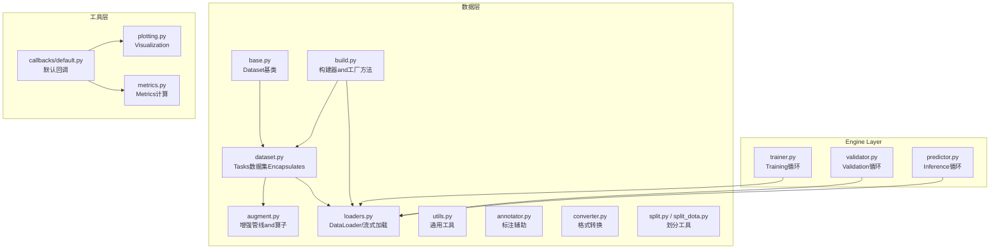
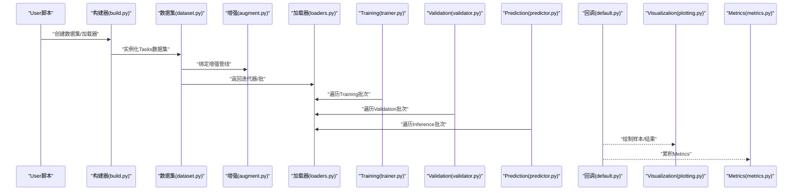
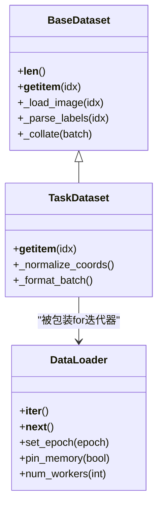
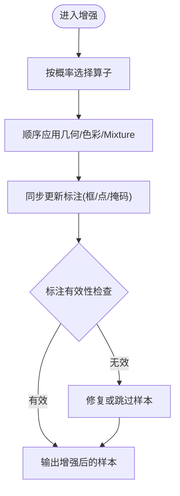
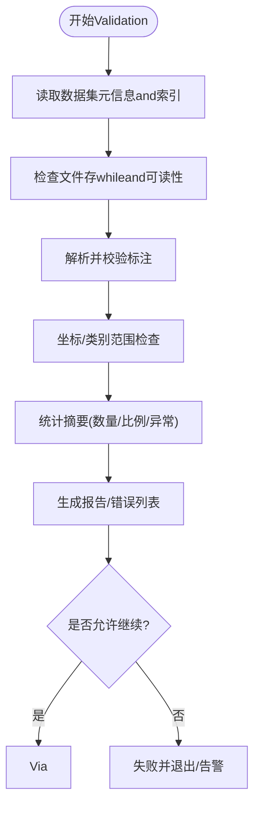
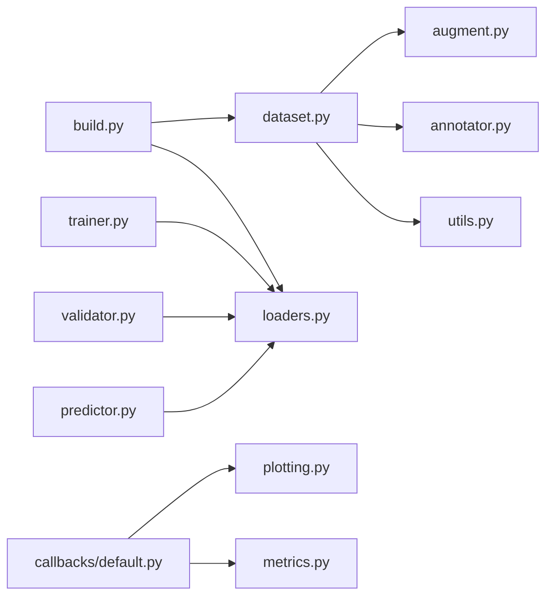

# Data Processing API

<cite>
**Files Referenced in This Document**
- [ultralytics/data/__init__.py](file://ultralytics/data/__init__.py)
- [ultralytics/data/base.py](file://ultralytics/data/base.py)
- [ultralytics/data/dataset.py](file://ultralytics/data/dataset.py)
- [ultralytics/data/build.py](file://ultralytics/data/build.py)
- [ultralytics/data/loaders.py](file://ultralytics/data/loaders.py)
- [ultralytics/data/augment.py](file://ultralytics/data/augment.py)
- [ultralytics/data/annotator.py](file://ultralytics/data/annotator.py)
- [ultralytics/data/utils.py](file://ultralytics/data/utils.py)
- [ultralytics/data/converter.py](file://ultralytics/data/converter.py)
- [ultralytics/data/split.py](file://ultralytics/data/split.py)
- [ultralytics/data/split_dota.py](file://ultralytics/data/split_dota.py)
- [ultralytics/engine/trainer.py](file://ultralytics/engine/trainer.py)
- [ultralytics/engine/validator.py](file://ultralytics/engine/validator.py)
- [ultralytics/engine/predictor.py](file://ultralytics/engine/predictor.py)
- [ultralytics/utils/callbacks/default.py](file://ultralytics/utils/callbacks/default.py)
- [ultralytics/utils/plotting.py](file://ultralytics/utils/plotting.py)
- [ultralytics/utils/metrics.py](file://ultralytics/utils/metrics.py)
</cite>

## Table of Contents
1. [Introduction](#Introduction)
2. [Project Structure](#Project Structure)
3. [Core Components](#Core Components)
4. [Architecture Overview](#Architecture Overview)
5. [Detailed Component Analysis](#Detailed Component Analysis)
6. [Dependency Analysis](#Dependency Analysis)
7. [Performance Considerations](#Performance Considerations)
8. [Troubleshooting Guide](#Troubleshooting Guide)
9. [Conclusion](#Conclusion)
10. [Appendix](#Appendix)

## Introduction
本文件targetingYOLO-Master的Data Processing API，系统化梳理数据集加载and管理、Data Augmentation管道构建and自定义增强算子、数据Validationand质量检查、MultimodalData processing接口规范、缓存and预处理Optimization、分布式Data Loadingand并行配置、自定义数据格式集成Centered onandVisualizationand探索工具etc.关键主题。DocumentationCentered on代码级implementingfor依据，provides架构图、流程图andCalls序列图，帮助读者快速定位并正确Uses相关接口。

## Project Structure
Data processing子系统位于 ultralytics/data 下，围绕“数据源抽象—数据集Encapsulates—增强流水线—构建器—加载器”的层次组织；Training/Validation/Prediction流程Via engine 层消费 DataLoader；VisualizationandMetricswhile utils 中provides支撑。

Figure Source
- [ultralytics/data/base.py](file://ultralytics/data/base.py)
- [ultralytics/data/dataset.py](file://ultralytics/data/dataset.py)
- [ultralytics/data/augment.py](file://ultralytics/data/augment.py)
- [ultralytics/data/loaders.py](file://ultralytics/data/loaders.py)
- [ultralytics/data/build.py](file://ultralytics/data/build.py)
- [ultralytics/engine/trainer.py](file://ultralytics/engine/trainer.py)
- [ultralytics/engine/validator.py](file://ultralytics/engine/validator.py)
- [ultralytics/engine/predictor.py](file://ultralytics/engine/predictor.py)
- [ultralytics/utils/callbacks/default.py](file://ultralytics/utils/callbacks/default.py)
- [ultralytics/utils/plotting.py](file://ultralytics/utils/plotting.py)
- [ultralytics/utils/metrics.py](file://ultralytics/utils/metrics.py)

Section Source
- [ultralytics/data/__init__.py](file://ultralytics/data/__init__.py)
- [ultralytics/data/base.py](file://ultralytics/data/base.py)
- [ultralytics/data/dataset.py](file://ultralytics/data/dataset.py)
- [ultralytics/data/build.py](file://ultralytics/data/build.py)
- [ultralytics/data/loaders.py](file://ultralytics/data/loaders.py)
- [ultralytics/data/augment.py](file://ultralytics/data/augment.py)
- [ultralytics/data/annotator.py](file://ultralytics/data/annotator.py)
- [ultralytics/data/utils.py](file://ultralytics/data/utils.py)
- [ultralytics/data/converter.py](file://ultralytics/data/converter.py)
- [ultralytics/data/split.py](file://ultralytics/data/split.py)
- [ultralytics/data/split_dota.py](file://ultralytics/data/split_dota.py)
- [ultralytics/engine/trainer.py](file://ultralytics/engine/trainer.py)
- [ultralytics/engine/validator.py](file://ultralytics/engine/validator.py)
- [ultralytics/engine/predictor.py](file://ultralytics/engine/predictor.py)
- [ultralytics/utils/callbacks/default.py](file://ultralytics/utils/callbacks/default.py)
- [ultralytics/utils/plotting.py](file://ultralytics/utils/plotting.py)
- [ultralytics/utils/metrics.py](file://ultralytics/utils/metrics.py)

## Core Components
- 数据集基类andTasksEncapsulates：定义统一的数据访问协议andTasks相关的索引、标签解析and批组装逻辑。
- 增强管线：组合多种图像and标注变换，Supporting随机化、概率控制and可插拔扩展。
- 构建器and工厂：根据配置或路径自动选择合适的数据集类型and加载策略。
- 加载器：provides多线程/多进程、内存映射、预取and批处理的 DataLoader capabilities。
- 工具and转换器：标注校验、格式转换、数据集划分、统计and诊断。
- 引擎集成：Training/Validation/Prediction循环Via构建器获取数据流，并while回调中触发VisualizationandLogging。

Section Source
- [ultralytics/data/base.py](file://ultralytics/data/base.py)
- [ultralytics/data/dataset.py](file://ultralytics/data/dataset.py)
- [ultralytics/data/augment.py](file://ultralytics/data/augment.py)
- [ultralytics/data/build.py](file://ultralytics/data/build.py)
- [ultralytics/data/loaders.py](file://ultralytics/data/loaders.py)
- [ultralytics/data/utils.py](file://ultralytics/data/utils.py)
- [ultralytics/data/converter.py](file://ultralytics/data/converter.py)
- [ultralytics/data/split.py](file://ultralytics/data/split.py)
- [ultralytics/data/split_dota.py](file://ultralytics/data/split_dota.py)

## Architecture Overview
下图展示从高层入口toData Loadingand增强的端to端Calls链，Centered onandVisualizationandMetrics的接入点。

Figure Source
- [ultralytics/data/build.py](file://ultralytics/data/build.py)
- [ultralytics/data/dataset.py](file://ultralytics/data/dataset.py)
- [ultralytics/data/augment.py](file://ultralytics/data/augment.py)
- [ultralytics/data/loaders.py](file://ultralytics/data/loaders.py)
- [ultralytics/engine/trainer.py](file://ultralytics/engine/trainer.py)
- [ultralytics/engine/validator.py](file://ultralytics/engine/validator.py)
- [ultralytics/engine/predictor.py](file://ultralytics/engine/predictor.py)
- [ultralytics/utils/callbacks/default.py](file://ultralytics/utils/callbacks/default.py)
- [ultralytics/utils/plotting.py](file://ultralytics/utils/plotting.py)
- [ultralytics/utils/metrics.py](file://ultralytics/utils/metrics.py)

## Detailed Component Analysis

### 数据集and加载器（Dataset/DataLoader）
- 职责分工
  - base.py：定义数据集基类and通用协议（索引、长度、元信息、批组装钩子）。
  - dataset.py：targeting具体Tasks的Encapsulates（such as检测、分割、姿态etc.），负责标签解析、坐标归一化、类别映射and批内对齐。
  - loaders.py：implementing高效迭代器，Supporting多进程、预取、内存映射and动态批大小策略。
  - build.py：根据路径/配置推断Tasks类型and数据格式，返回合适的 Dataset/DataLoader 实例。
- Typical Usage
  - Via构建器传入数据Root Directory或配置文件，获得可直接用于Training/Validation/Prediction的可迭代对象。
  - whileTraining/Validation/Prediction循环中按批次消费数据，内部完成增强、填充and堆叠。
- 关键特性
  - 多进程安全and锁粒度控制。
  - Optional的缓存and懒加载策略。
  - 对异常样本的容错and跳过机制。

Figure Source
- [ultralytics/data/base.py](file://ultralytics/data/base.py)
- [ultralytics/data/dataset.py](file://ultralytics/data/dataset.py)
- [ultralytics/data/loaders.py](file://ultralytics/data/loaders.py)

Section Source
- [ultralytics/data/base.py](file://ultralytics/data/base.py)
- [ultralytics/data/dataset.py](file://ultralytics/data/dataset.py)
- [ultralytics/data/loaders.py](file://ultralytics/data/loaders.py)
- [ultralytics/data/build.py](file://ultralytics/data/build.py)

### Data Augmentation管线and自定义增强
- 管线组成
  - 基础几何变换（缩放、裁剪、翻转、仿射etc.）。
  - 色彩and噪声增强（亮度、对比度、模糊、马赛克、MixUp/CutMixetc.）。
  - 标注一致性维护：所有变换需同步更新边界框、关键点、掩码etc.Multimodal标注。
- 构建方式
  - Via配置或函数式API组合多个算子，Supporting概率、强度参数and条件分支。
  - 可whileTraining阶段启用，whileValidation/Inference阶段关闭或降级。
- 自定义增强算子
  - 遵循统一的输入输出契约（图像张量+标注字典），保证可组合性。
  - 建议implementing确定性版本Centered on便调试，并provides随机种子控制。
  - while增强Registry中声明，便于构建器发现and序列化。

Figure Source
- [ultralytics/data/augment.py](file://ultralytics/data/augment.py)
- [ultralytics/data/annotator.py](file://ultralytics/data/annotator.py)
- [ultralytics/data/utils.py](file://ultralytics/data/utils.py)

Section Source
- [ultralytics/data/augment.py](file://ultralytics/data/augment.py)
- [ultralytics/data/annotator.py](file://ultralytics/data/annotator.py)
- [ultralytics/data/utils.py](file://ultralytics/data/utils.py)

### 数据Validationand质量检查
- 目标
  - while加载前/后对图像完整性、标注格式、坐标范围、类别ID合法性进行检查。
  - 统计分布and异常值检测，生成报告供后续清洗。
- 主要capabilities
  - 标注解析and校验（含DOTAetc.旋转框场景）。
  - 图像可读性and尺寸一致性检查。
  - 类别映射and缺失类别Tips。
  - Export问题清单and修复建议。
- 集成点
  - while构建数据集时Optional择开启严格模式。
  - whileTraining/Validation前执行一次全量扫描，失败则中止或告警。

Figure Source
- [ultralytics/data/utils.py](file://ultralytics/data/utils.py)
- [ultralytics/data/annotator.py](file://ultralytics/data/annotator.py)
- [ultralytics/data/split.py](file://ultralytics/data/split.py)
- [ultralytics/data/split_dota.py](file://ultralytics/data/split_dota.py)

Section Source
- [ultralytics/data/utils.py](file://ultralytics/data/utils.py)
- [ultralytics/data/annotator.py](file://ultralytics/data/annotator.py)
- [ultralytics/data/split.py](file://ultralytics/data/split.py)
- [ultralytics/data/split_dota.py](file://ultralytics/data/split_dota.py)

### MultimodalData processing接口规范
- Supporting内容
  - 图像and文本联合（例such as开放词汇/描述型标注）、图像and关键点/掩码/旋转框etc.多标注并存。
  - 不同模态的坐标/语义空间对齐and批内对齐策略。
- 设计要点
  - while数据集 __getitem__ 中返回统一的结构化样本（包含图像and各模态标注字段）。
  - 增强管线需具备Multimodal同步更新capabilities。
  - 构建器根据Tasks类型自动装配对应处理器。
- 集成方式
  - Via配置声明Multimodal字段and对齐规则。
  - while增强and批组装阶段保持各模态的一致性。

Section Source
- [ultralytics/data/dataset.py](file://ultralytics/data/dataset.py)
- [ultralytics/data/augment.py](file://ultralytics/data/augment.py)
- [ultralytics/data/build.py](file://ultralytics/data/build.py)

### 数据缓存and预处理Optimization
- 缓存策略
  - 图像解码缓存、标注解析缓存、增强结果缓存（Optional）。
  - 基于路径哈希的键空间，避免重复IOand计算。
- 预取and并行
  - 多进程Data Loading、线程池解码、GPU pin_memory。
  - 动态批大小and形状自适应Centered on减少填充开销。
- 存储介质
  - 本地SSD优先；大样本可考虑内存映射或分块读取。
- 监控and调优
  - Via回调记录I/O耗时、CPU/GPU利用率、队列长度。
  - 针对bottlenecks调整 num_workers、prefetch_factor、cache_size etc.参数。

Section Source
- [ultralytics/data/loaders.py](file://ultralytics/data/loaders.py)
- [ultralytics/data/build.py](file://ultralytics/data/build.py)
- [ultralytics/utils/callbacks/default.py](file://ultralytics/utils/callbacks/default.py)

### 分布式Data Loadingand并行处理
- 并行模型
  - 多进程 DataLoader Combined with多卡Training，每进程独立数据子集。
  - Uses全局随机种子and epoch 感知采样，确保跨进程一致性and无偏覆盖。
- 通信and同步
  - Training侧由引擎负责Gradient同步；数据侧仅做分发and聚合。
  - 注意共享内存and锁的Uses，避免进程间竞争。
- 配置项
  - 进程数、预取深度、内存锁定、采样策略（有放回/无放回）。
  - 断点续训时的数据状态恢复and一致性保证。

Section Source
- [ultralytics/data/loaders.py](file://ultralytics/data/loaders.py)
- [ultralytics/engine/trainer.py](file://ultralytics/engine/trainer.py)

### 自定义数据格式集成指南
- 步骤概览
  - 继承数据集基类，implementing索引and样本加载逻辑。
  - implementing标注解析and坐标/类别规范化。
  - 将新格式注册to构建器，使其能自动识别and实例化。
  - 若涉and特殊增强，需while增强管线中provides对应的同步更新逻辑。
- 注意事项
  - 保持and现有契约一致的输入输出结构。
  - provides最小可用Examplesand测试用例。
  - while质量检查中增加对新格式的校验规则。

Section Source
- [ultralytics/data/base.py](file://ultralytics/data/base.py)
- [ultralytics/data/dataset.py](file://ultralytics/data/dataset.py)
- [ultralytics/data/build.py](file://ultralytics/data/build.py)
- [ultralytics/data/augment.py](file://ultralytics/data/augment.py)
- [ultralytics/data/utils.py](file://ultralytics/data/utils.py)

### 数据Visualizationand探索工具
- Visualization
  - 样本绘制（图像叠加框/关键点/掩码/旋转框）。
  - Training/Validation过程中的中间结果and统计图。
- 探索
  - 类别分布、尺寸分布、长尾分析。
  - 异常样本定位andExport。
- 集成点
  - Via回调whileTraining/Validation阶段触发Visualization。
  - provides离线探索脚本andJupyter友好接口。

Section Source
- [ultralytics/utils/plotting.py](file://ultralytics/utils/plotting.py)
- [ultralytics/utils/callbacks/default.py](file://ultralytics/utils/callbacks/default.py)
- [ultralytics/utils/metrics.py](file://ultralytics/utils/metrics.py)

## Dependency Analysis
- Modules耦合
  - 构建器依赖数据集and加载器，解耦了上层引擎and底层数据细节。
  - 增强管线and标注工具强耦合，需保持一致的坐标/类别约定。
  - Engine Layer仅依赖构建器暴露的迭代器，降低耦合度。
- External Dependencies
  - 图像处理库、数值计算库、Visualization工具etc.。
- 潜while风险
  - 多进程共享大对象导致的内存膨胀。
  - 自定义增强未正确同步标注引发的Training不稳定。

Figure Source
- [ultralytics/data/build.py](file://ultralytics/data/build.py)
- [ultralytics/data/dataset.py](file://ultralytics/data/dataset.py)
- [ultralytics/data/loaders.py](file://ultralytics/data/loaders.py)
- [ultralytics/data/augment.py](file://ultralytics/data/augment.py)
- [ultralytics/data/annotator.py](file://ultralytics/data/annotator.py)
- [ultralytics/data/utils.py](file://ultralytics/data/utils.py)
- [ultralytics/engine/trainer.py](file://ultralytics/engine/trainer.py)
- [ultralytics/engine/validator.py](file://ultralytics/engine/validator.py)
- [ultralytics/engine/predictor.py](file://ultralytics/engine/predictor.py)
- [ultralytics/utils/callbacks/default.py](file://ultralytics/utils/callbacks/default.py)
- [ultralytics/utils/plotting.py](file://ultralytics/utils/plotting.py)
- [ultralytics/utils/metrics.py](file://ultralytics/utils/metrics.py)

## Performance Considerations
- I/Obottlenecks
  - 提高磁盘吞吐（SSD/NVMe），Set appropriately num_workers and prefetch_factor。
  - Uses pin_memory 减少主机-GPU拷贝时间。
- CPUbottlenecks
  - 将昂贵增强移至GPU或Uses更快的近似算法。
  - 批量解码and向量化操作。
- GPUbottlenecks
  - 减少不必要的转置and复制，尽量while连续内存上操作。
  - Uses半精度andMixture精度（and数据无关但影响整体吞吐）。
- 监控
  - 利用回调收集I/O、CPU、GPU、队列长度etc.Metrics，定位热点。

[This section provides general guidance and does not directly analyze specific files]

## Troubleshooting Guide
- 常见问题
  - 数据损坏或路径错误：检查文件存while性and权限。
  - 标注越界或类别非法：运行质量检查并修复。
  - 多进程崩溃：检查共享内存and锁，减少进程数或禁用部分增强。
  - 显存不足：减小 batch size、关闭部分增强或启用Gradient累积。
- 定位手段
  - 开启严格模式and详细Logging。
  - UsesVisualizationExport问题样本。
  - 逐步关闭增强Centered on定位问题算子。

Section Source
- [ultralytics/data/utils.py](file://ultralytics/data/utils.py)
- [ultralytics/data/annotator.py](file://ultralytics/data/annotator.py)
- [ultralytics/utils/callbacks/default.py](file://ultralytics/utils/callbacks/default.py)

## Conclusion
YOLO-Master的Data Processing APICentered on清晰的层次and可扩展的设计，覆盖了从Data Loading、增强、ValidationtoVisualizationandOptimization的完整链路。Via构建器and标准契约，User可Centered on快速集成自定义数据格式and增强算子，并while分布式环境下获得稳定高效的Training体验。建议while工程实践中Combining质量检查andVisualization，持续监控数据健康度and系统性能。

[This section is summary content and does not directly analyze specific files]

## Appendix
- 术语
  - 数据集：对原始样本and标注的统一抽象。
  - 增强：对图像and标注进行随机或确定性变换Centered on提升鲁棒性。
  - 构建器：根据配置或路径自动装配数据集and加载器的工厂。
  - 加载器：provides高效迭代and批处理的迭代器。
- Refer to入口
  - 构建and加载：见构建器and加载器文件。
  - 增强and标注：见增强and标注工具文件。
  - ValidationandVisualization：见工具and回调文件。

[本节for补充说明，不直接分析具体文件]