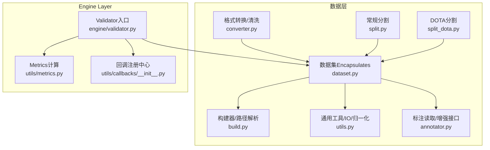
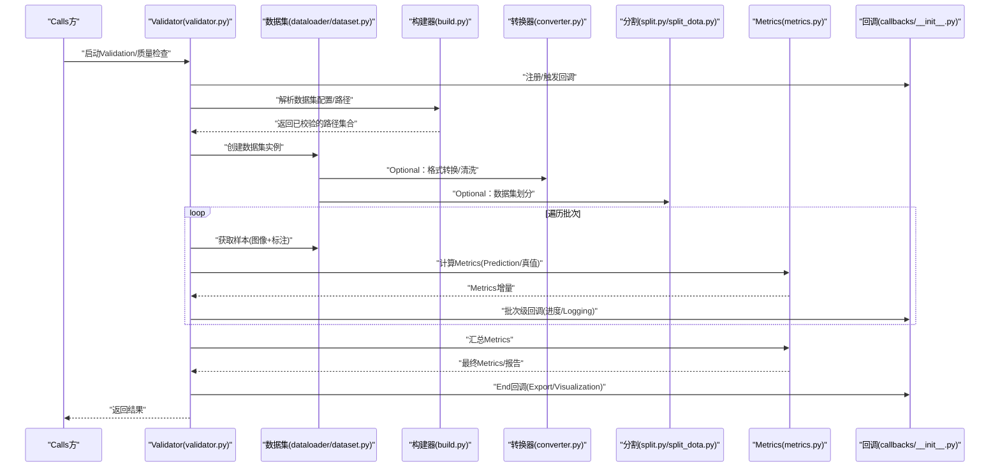
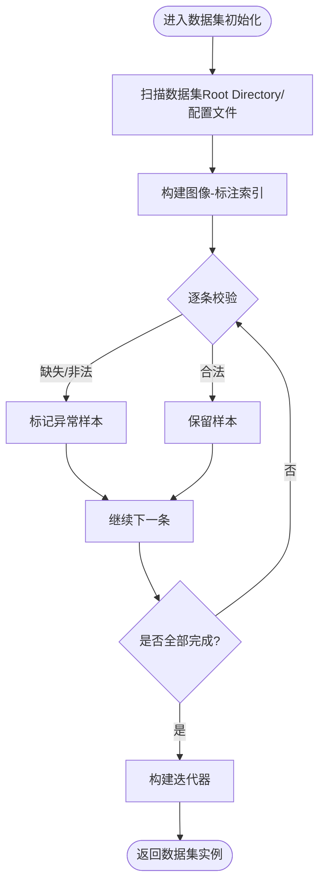
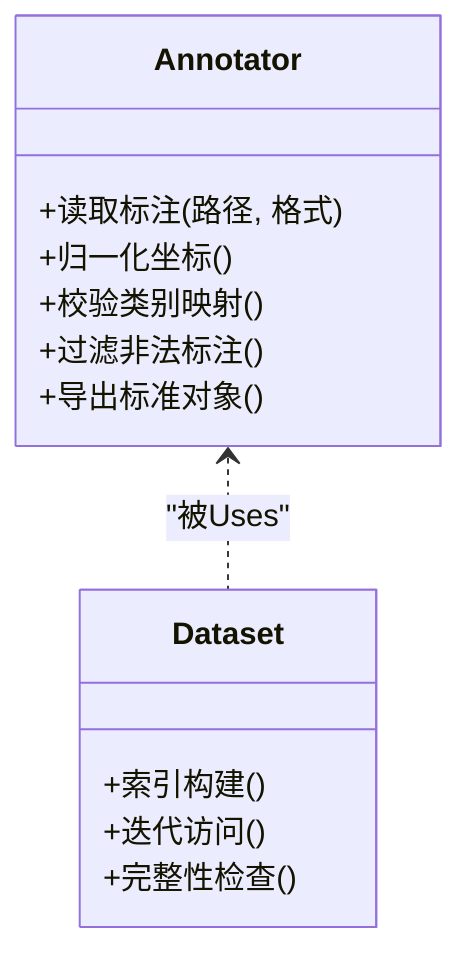
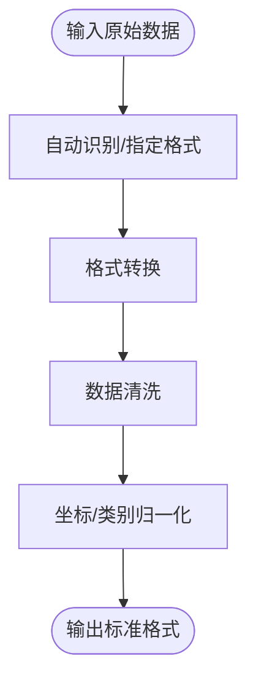
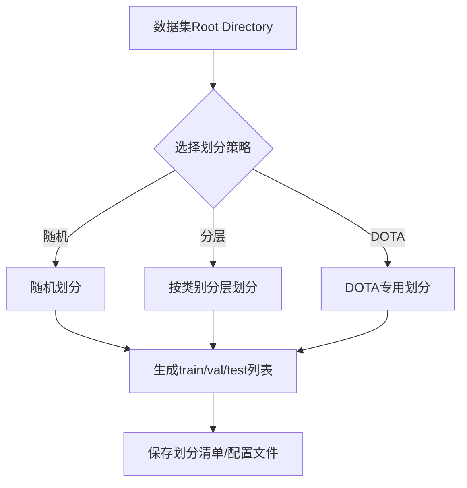
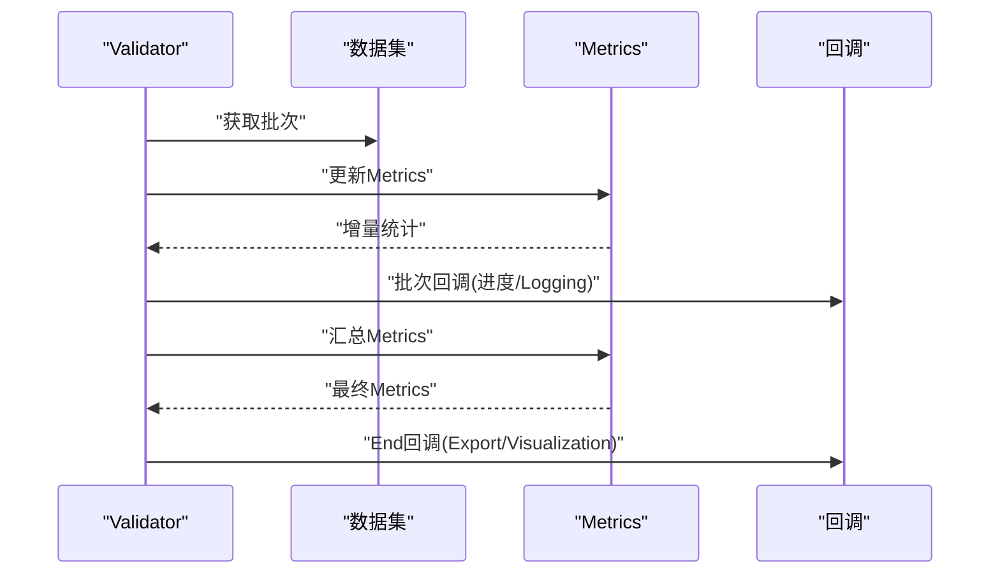
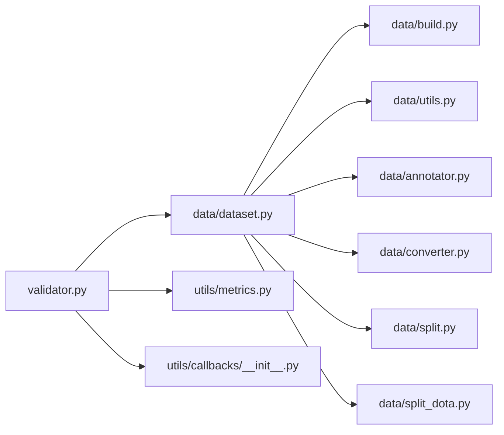

# 数据ValidationAPI

<cite>
**Files Referenced in This Document**
- [ultralytics/data/dataset.py](file://ultralytics/data/dataset.py)
- [ultralytics/data/build.py](file://ultralytics/data/build.py)
- [ultralytics/data/utils.py](file://ultralytics/data/utils.py)
- [ultralytics/data/annotator.py](file://ultralytics/data/annotator.py)
- [ultralytics/data/split.py](file://ultralytics/data/split.py)
- [ultralytics/data/split_dota.py](file://ultralytics/data/split_dota.py)
- [ultralytics/data/converter.py](file://ultralytics/data/converter.py)
- [ultralytics/engine/validator.py](file://ultralytics/engine/validator.py)
- [ultralytics/utils/metrics.py](file://ultralytics/utils/metrics.py)
- [ultralytics/utils/callbacks/__init__.py](file://ultralytics/utils/callbacks/__init__.py)
- [tests/test_validator_helpers.py](file://tests/test_validator_helpers.py)
</cite>

## Table of Contents
1. [Introduction](#Introduction)
2. [Project Structure](#Project Structure)
3. [Core Components](#Core Components)
4. [Architecture Overview](#Architecture Overview)
5. [Detailed Component Analysis](#Detailed Component Analysis)
6. [Dependency Analysis](#Dependency Analysis)
7. [Performance Considerations](#Performance Considerations)
8. [Troubleshooting Guide](#Troubleshooting Guide)
9. [Conclusion](#Conclusion)
10. [Appendix](#Appendix)

## Introduction
本文件for YOLO-Master 数据Validation API 的权威Documentation，聚焦于标注数据的完整性检查、一致性校验、格式转换and清洗、数据集分割and划分、质量EvaluationMetricsand报告生成、批量并行处理配置、版本管理and变更追踪，Centered onand结果VisualizationandExport。内容基于仓库中Data Loading、Validation、度量and工具Modules的implementing进行系统化梳理，帮助Uses者构建稳定可靠的数据流水线。

## Project Structure
围绕数据Validation相关capabilities，代码主要分布whileCentered on下Modules：
- Data Loadingand校验：ultralytics/data/*
- 引擎Validation流程：ultralytics/engine/validator.py
- Metrics计算and统计：ultralytics/utils/metrics.py
- 回调and事件：ultralytics/utils/callbacks/*
- 测试用例（辅助理解行for）：tests/test_validator_helpers.py

Figure Source
- [ultralytics/data/dataset.py](file://ultralytics/data/dataset.py)
- [ultralytics/data/build.py](file://ultralytics/data/build.py)
- [ultralytics/data/utils.py](file://ultralytics/data/utils.py)
- [ultralytics/data/annotator.py](file://ultralytics/data/annotator.py)
- [ultralytics/data/converter.py](file://ultralytics/data/converter.py)
- [ultralytics/data/split.py](file://ultralytics/data/split.py)
- [ultralytics/data/split_dota.py](file://ultralytics/data/split_dota.py)
- [ultralytics/engine/validator.py](file://ultralytics/engine/validator.py)
- [ultralytics/utils/metrics.py](file://ultralytics/utils/metrics.py)
- [ultralytics/utils/callbacks/__init__.py](file://ultralytics/utils/callbacks/__init__.py)

Section Source
- [ultralytics/data/dataset.py](file://ultralytics/data/dataset.py)
- [ultralytics/data/build.py](file://ultralytics/data/build.py)
- [ultralytics/data/utils.py](file://ultralytics/data/utils.py)
- [ultralytics/data/annotator.py](file://ultralytics/data/annotator.py)
- [ultralytics/data/converter.py](file://ultralytics/data/converter.py)
- [ultralytics/data/split.py](file://ultralytics/data/split.py)
- [ultralytics/data/split_dota.py](file://ultralytics/data/split_dota.py)
- [ultralytics/engine/validator.py](file://ultralytics/engine/validator.py)
- [ultralytics/utils/metrics.py](file://ultralytics/utils/metrics.py)
- [ultralytics/utils/callbacks/__init__.py](file://ultralytics/utils/callbacks/__init__.py)

## Core Components
- 数据集Encapsulatesand校验
  - 负责解析数据集描述、索引图像and标注、执行基础完整性检查（such as文件存while性、类别映射一致性、边界框范围etc.）。
  - provides迭代接口供Validator消费，Supporting按需加载and缓存策略。
- 构建器and路径解析
  - 统一解析数据集配置文件或Table of Contents结构，将相对路径转换for绝对路径，并做预检。
- 标注读取and增强接口
  - 抽象不同格式的标注读取逻辑，provides统一的标注对象模型；同时暴露增强管线接口。
- 格式转换and清洗
  - provides常见格式（such as COCO/YOLO/VOC etc.）之间的转换and清洗capabilities，包括坐标归一化、重复项去重、非法值过滤etc.。
- 数据集分割and划分
  - provides随机/分层/空间感知的Training/Validation/测试集划分，Supporting DOTA etc.特殊Tasks。
- Validator入口
  - 编排Data Loading、Inference/Evaluation、Metrics汇总and报告输出；Via回调机制扩展Logging、Visualizationand告警。
- Metrics计算
  - implementing精度、召回、mAP、混淆矩阵、PR曲线etc.常用检测Metrics的计算and聚合。
- Callback System
  - while关键阶段触发事件（such as开始/End、批次完成、错误发生），便于记录、监控andExport。

Section Source
- [ultralytics/data/dataset.py](file://ultralytics/data/dataset.py)
- [ultralytics/data/build.py](file://ultralytics/data/build.py)
- [ultralytics/data/utils.py](file://ultralytics/data/utils.py)
- [ultralytics/data/annotator.py](file://ultralytics/data/annotator.py)
- [ultralytics/data/converter.py](file://ultralytics/data/converter.py)
- [ultralytics/data/split.py](file://ultralytics/data/split.py)
- [ultralytics/data/split_dota.py](file://ultralytics/data/split_dota.py)
- [ultralytics/engine/validator.py](file://ultralytics/engine/validator.py)
- [ultralytics/utils/metrics.py](file://ultralytics/utils/metrics.py)
- [ultralytics/utils/callbacks/__init__.py](file://ultralytics/utils/callbacks/__init__.py)

## Architecture Overview
下图展示了数据Validation端to端流程：从Data Preparation（转换/清洗/分割）toValidation执行（加载/Evaluation/Metrics）再to报告andVisualization输出。

Figure Source
- [ultralytics/engine/validator.py](file://ultralytics/engine/validator.py)
- [ultralytics/data/dataset.py](file://ultralytics/data/dataset.py)
- [ultralytics/data/build.py](file://ultralytics/data/build.py)
- [ultralytics/data/converter.py](file://ultralytics/data/converter.py)
- [ultralytics/data/split.py](file://ultralytics/data/split.py)
- [ultralytics/data/split_dota.py](file://ultralytics/data/split_dota.py)
- [ultralytics/utils/metrics.py](file://ultralytics/utils/metrics.py)
- [ultralytics/utils/callbacks/__init__.py](file://ultralytics/utils/callbacks/__init__.py)

## Detailed Component Analysis

### Data Loadingand完整性检查
- 职责
  - 解析数据集描述，建立图像and标注的索引关系。
  - 执行完整性检查：文件存while性、尺寸有效性、标注格式合法性、类别IDand名称映射一致性、边界框越界/退化检测etc.。
- 关键流程
  - 初始化时扫描Table of Contents/配置文件，收集候选样本。
  - 对每个样本进行元数据校验and异常标记。
  - 对外暴露迭代器，按批次返回标准化后的样本。
- 典型问题定位
  - 缺失文件、标注for空、类别不while字典中、坐标越界、重复标注etc.。

Figure Source
- [ultralytics/data/dataset.py](file://ultralytics/data/dataset.py)
- [ultralytics/data/build.py](file://ultralytics/data/build.py)
- [ultralytics/data/utils.py](file://ultralytics/data/utils.py)

Section Source
- [ultralytics/data/dataset.py](file://ultralytics/data/dataset.py)
- [ultralytics/data/build.py](file://ultralytics/data/build.py)
- [ultralytics/data/utils.py](file://ultralytics/data/utils.py)

### 标注读取and一致性Validation
- 职责
  - 统一读取多种标注格式，转换for内部一致表示。
  - 执行一致性Validation：类别IDand名称映射、坐标归一化、多边形/关键点数量校验、重叠/包含关系检查etc.。
- 关键点
  - 标注读取器and增强接口解耦，便于扩展新格式。
  - 一致性规则可配置，Supporting严格/宽松模式。

Figure Source
- [ultralytics/data/annotator.py](file://ultralytics/data/annotator.py)
- [ultralytics/data/dataset.py](file://ultralytics/data/dataset.py)

Section Source
- [ultralytics/data/annotator.py](file://ultralytics/data/annotator.py)
- [ultralytics/data/dataset.py](file://ultralytics/data/dataset.py)

### 格式转换and数据清洗
- 职责
  - provides跨格式转换（such as COCO/YOLO/VOC etc.）and清洗capabilities。
  - 清洗规则包括：去重、空框移除、越界裁剪、类别合并/别名替换、坐标归一化、冗余字段清理etc.。
- Applicable Scenarios
  - 数据Migration、历史数据治理、跨团队协作时的格式对齐。

Figure Source
- [ultralytics/data/converter.py](file://ultralytics/data/converter.py)
- [ultralytics/data/utils.py](file://ultralytics/data/utils.py)

Section Source
- [ultralytics/data/converter.py](file://ultralytics/data/converter.py)
- [ultralytics/data/utils.py](file://ultralytics/data/utils.py)

### 数据集分割and划分
- 职责
  - providesTraining/Validation/测试集的自动化划分，Supporting随机、分层、按Table of Contents结构etc.多种策略。
  - 针对 DOTA etc.旋转框Tasksprovides专用分割逻辑。
- 注意事项
  - 保证类别分布均衡（分层策略）。
  - 控制随机种子Centered on保证可复现性。
  - 大目标/小目标比例可控。

Figure Source
- [ultralytics/data/split.py](file://ultralytics/data/split.py)
- [ultralytics/data/split_dota.py](file://ultralytics/data/split_dota.py)

Section Source
- [ultralytics/data/split.py](file://ultralytics/data/split.py)
- [ultralytics/data/split_dota.py](file://ultralytics/data/split_dota.py)

### Validator入口andMetrics汇总
- 职责
  - 编排Data Loading、模型Inference（若涉and）、Metrics计算、结果汇总and报告输出。
  - Via回调机制while关键节点触发Logging、Visualizationand告警。
- Metrics
  - 精度、召回、mAP、混淆矩阵、PR曲线etc.。
- 报告
  - 结构化Metrics、分类型统计、阈值敏感分析、Visualization图Export。

Figure Source
- [ultralytics/engine/validator.py](file://ultralytics/engine/validator.py)
- [ultralytics/utils/metrics.py](file://ultralytics/utils/metrics.py)
- [ultralytics/utils/callbacks/__init__.py](file://ultralytics/utils/callbacks/__init__.py)

Section Source
- [ultralytics/engine/validator.py](file://ultralytics/engine/validator.py)
- [ultralytics/utils/metrics.py](file://ultralytics/utils/metrics.py)
- [ultralytics/utils/callbacks/__init__.py](file://ultralytics/utils/callbacks/__init__.py)

### 批量Data processingand并行化配置
- 要点
  - 利用Data Loading器的批大小、线程数、进程数etc.参数提升吞吐。
  - Combining回调进行进度Trackingand错误隔离，避免单点失败影响整体。
  - 对于大规模数据，建议开启缓存and预取，减少I/Obottlenecks。
- 建议
  - 根据硬件资源调整并发度，避免内存溢出。
  - 对异常样本进行快速失败and重试策略。

Section Source
- [ultralytics/data/dataset.py](file://ultralytics/data/dataset.py)
- [ultralytics/data/build.py](file://ultralytics/data/build.py)
- [ultralytics/utils/callbacks/__init__.py](file://ultralytics/utils/callbacks/__init__.py)

### 数据版本管理and变更追踪
- 思路
  - Centered on不可变方式保存每次转换/清洗/划分的产物，附带元数据（时间戳、操作者、参数、哈希）。
  - Uses轻量级清单文件或版本标签管理数据集快照。
  - while回调中记录关键步骤的审计信息，便于回溯。
- 实践
  - for每次运行生成唯一ID，关联所有中间产物and最终报告。
  - 对比不同版本的Metrics差异，形成变更影响Evaluation。

Section Source
- [ultralytics/utils/callbacks/__init__.py](file://ultralytics/utils/callbacks/__init__.py)
- [ultralytics/data/build.py](file://ultralytics/data/build.py)

### 结果VisualizationandExport
- capabilities
  - Metrics表格、PR曲线、混淆矩阵、分类型统计图。
  - Exporting to JSON/CSV/HTML etc.格式，便于归档and分享。
- 集成
  - Via回调whileValidationEnd时触发Export流程。
  - Supporting自定义Export模板and主题。

Section Source
- [ultralytics/utils/metrics.py](file://ultralytics/utils/metrics.py)
- [ultralytics/utils/callbacks/__init__.py](file://ultralytics/utils/callbacks/__init__.py)

## Dependency Analysis
- 耦合and内聚
  - 数据集Modules高内聚，Encapsulates了路径解析、索引构建、完整性检查。
  - Validator低耦合地依赖数据集andMetrics，Via回调扩展功能。
- External Dependencies
  - I/O、数值计算、绘图库由底层工具andMetricsModules统一管理。
- Potential Cycles依赖
  - 当前设计避免循环导入，各Modules职责清晰。

Figure Source
- [ultralytics/engine/validator.py](file://ultralytics/engine/validator.py)
- [ultralytics/data/dataset.py](file://ultralytics/data/dataset.py)
- [ultralytics/data/build.py](file://ultralytics/data/build.py)
- [ultralytics/data/utils.py](file://ultralytics/data/utils.py)
- [ultralytics/data/annotator.py](file://ultralytics/data/annotator.py)
- [ultralytics/data/converter.py](file://ultralytics/data/converter.py)
- [ultralytics/data/split.py](file://ultralytics/data/split.py)
- [ultralytics/data/split_dota.py](file://ultralytics/data/split_dota.py)
- [ultralytics/utils/metrics.py](file://ultralytics/utils/metrics.py)
- [ultralytics/utils/callbacks/__init__.py](file://ultralytics/utils/callbacks/__init__.py)

Section Source
- [ultralytics/engine/validator.py](file://ultralytics/engine/validator.py)
- [ultralytics/data/dataset.py](file://ultralytics/data/dataset.py)
- [ultralytics/utils/metrics.py](file://ultralytics/utils/metrics.py)
- [ultralytics/utils/callbacks/__init__.py](file://ultralytics/utils/callbacks/__init__.py)

## Performance Considerations
- I/OOptimization
  - 启用数据缓存、预取and多线程/多进程加载。
  - Set appropriately批大小，平衡吞吐and内存占用。
- 计算Optimization
  - Metrics增量计算避免全量重算。
  - 对大图/高分辨率图像采用缩放and分块策略。
- 稳定性
  - 异常样本快速失败and重试，避免阻塞整体流程。
  - Uses确定性随机种子保证可复现性。

[This section provides general guidance and does not directly analyze specific files]

## Troubleshooting Guide
- 常见问题
  - 标注缺失或格式错误：检查 annotator 读取逻辑and converter 清洗规则。
  - 类别不一致：核对类别映射and别名表。
  - 坐标越界/退化：启用严格校验并输出异常清单。
  - 划分不均：调整分层策略或增加采样权重。
- 调试手段
  - Uses回调打印关键路径and统计信息。
  - 借助测试用例理解预期行forand边界条件。

Section Source
- [ultralytics/data/annotator.py](file://ultralytics/data/annotator.py)
- [ultralytics/data/converter.py](file://ultralytics/data/converter.py)
- [ultralytics/data/split.py](file://ultralytics/data/split.py)
- [tests/test_validator_helpers.py](file://tests/test_validator_helpers.py)

## Conclusion
YOLO-Master 的数据Validation体系Centered on数据集Encapsulatesfor核心，Combined with构建器、标注读取、转换清洗、分割划分、ValidatorandMetrics计算，形成了完整的数据质量保障闭环。Via回调机制可扩展Logging、VisualizationandExportcapabilities，满足生产环境对稳定性、可追溯性and可观测性的要求。建议while工程实践中引入版本化管理and变更追踪，确保数据演进的透明and可控。

[本节for总结，不直接分析具体文件]

## Appendix
- 术语
  - 完整性检查：确保数据文件and标注存while且格式正确。
  - 一致性Validation：确保类别映射、坐标范围、标注语义一致。
  - 格式转换：while不同标注格式之间进行etc.价转换。
  - 数据清洗：去除噪声、修复错误、规范化字段。
  - 数据集划分：按策略生成Training/Validation/测试子集。
  - Metrics汇总：计算并聚合各类EvaluationMetrics。
  - 回调：while关键阶段触发的扩展点，用于记录、告警andExport。

[本节for概念说明，不直接分析具体文件]