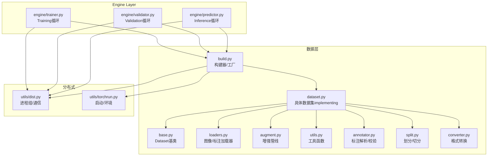
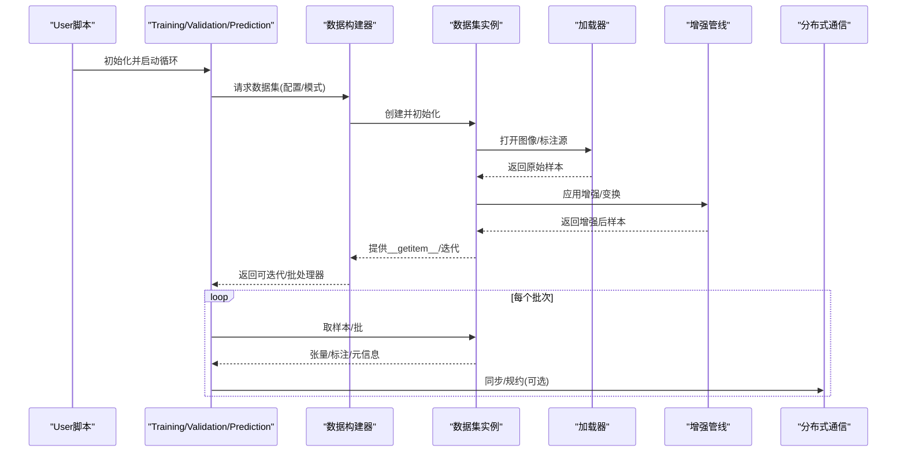
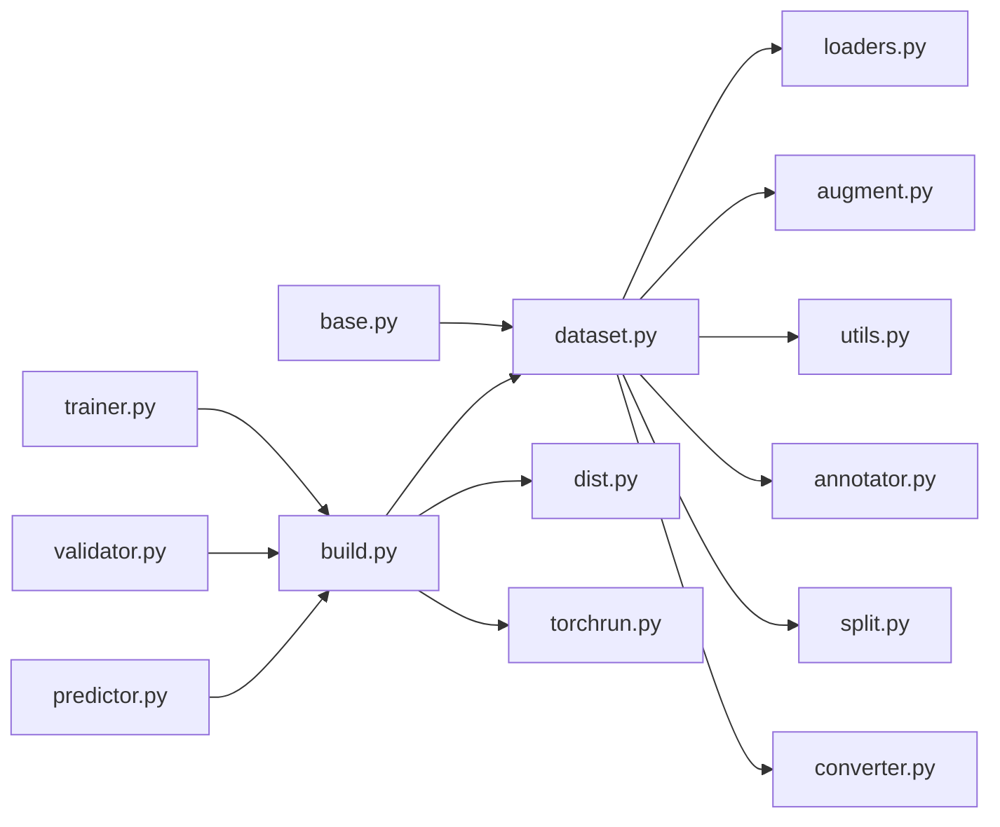

# 数据集API

<cite>
**Files Referenced in This Document**
- [ultralytics/data/base.py](file://ultralytics/data/base.py)
- [ultralytics/data/dataset.py](file://ultralytics/data/dataset.py)
- [ultralytics/data/build.py](file://ultralytics/data/build.py)
- [ultralytics/data/loaders.py](file://ultralytics/data/loaders.py)
- [ultralytics/data/augment.py](file://ultralytics/data/augment.py)
- [ultralytics/data/utils.py](file://ultralytics/data/utils.py)
- [ultralytics/data/annotator.py](file://ultralytics/data/annotator.py)
- [ultralytics/data/split.py](file://ultralytics/data/split.py)
- [ultralytics/data/converter.py](file://ultralytics/data/converter.py)
- [ultralytics/engine/trainer.py](file://ultralytics/engine/trainer.py)
- [ultralytics/engine/validator.py](file://ultralytics/engine/validator.py)
- [ultralytics/engine/predictor.py](file://ultralytics/engine/predictor.py)
- [ultralytics/utils/dist.py](file://ultralytics/utils/dist.py)
- [ultralytics/utils/torchrun.py](file://ultralytics/utils/torchrun.py)
</cite>

## Table of Contents
1. [Introduction](#Introduction)
2. [Project Structure](#Project Structure)
3. [Core Components](#Core Components)
4. [Architecture Overview](#Architecture Overview)
5. [Detailed Component Analysis](#Detailed Component Analysis)
6. [Dependency Analysis](#Dependency Analysis)
7. [Performance Considerations](#Performance Considerations)
8. [Troubleshooting Guide](#Troubleshooting Guide)
9. [Conclusion](#Conclusion)
10. [Appendix](#Appendix)

## Introduction
本文件targetingYOLO-Master的数据集API，系统性梳理Dataset基类and具体implementing、Data Loadingand索引管理、批处理机制、Supporting的数据格式（COCO/YOLO/VOCetc.）and自定义格式集成方法、数据Validationand质量检查接口、MultimodalData processingand配置、缓存策略and性能Optimization、分布式Data Loading配置andExamples，Centered onand预处理/Post-Processing的扩展点。DocumentationCentered on代码级事实for依据，辅Centered onVisualization图示帮助理解。

## Project Structure
数据集相关代码集中while ultralytics/data Modules，Combined with engine 层whileTraining/Validation/Prediction流程中消费数据；分布式capabilities由 utils/dist and torchrun provides支撑。

Figure Source
- [ultralytics/data/base.py](file://ultralytics/data/base.py)
- [ultralytics/data/dataset.py](file://ultralytics/data/dataset.py)
- [ultralytics/data/build.py](file://ultralytics/data/build.py)
- [ultralytics/data/loaders.py](file://ultralytics/data/loaders.py)
- [ultralytics/data/augment.py](file://ultralytics/data/augment.py)
- [ultralytics/data/utils.py](file://ultralytics/data/utils.py)
- [ultralytics/data/annotator.py](file://ultralytics/data/annotator.py)
- [ultralytics/data/split.py](file://ultralytics/data/split.py)
- [ultralytics/data/converter.py](file://ultralytics/data/converter.py)
- [ultralytics/engine/trainer.py](file://ultralytics/engine/trainer.py)
- [ultralytics/engine/validator.py](file://ultralytics/engine/validator.py)
- [ultralytics/engine/predictor.py](file://ultralytics/engine/predictor.py)
- [ultralytics/utils/dist.py](file://ultralytics/utils/dist.py)
- [ultralytics/utils/torchrun.py](file://ultralytics/utils/torchrun.py)

Section Source
- [ultralytics/data/base.py](file://ultralytics/data/base.py)
- [ultralytics/data/dataset.py](file://ultralytics/data/dataset.py)
- [ultralytics/data/build.py](file://ultralytics/data/build.py)
- [ultralytics/data/loaders.py](file://ultralytics/data/loaders.py)
- [ultralytics/data/augment.py](file://ultralytics/data/augment.py)
- [ultralytics/data/utils.py](file://ultralytics/data/utils.py)
- [ultralytics/data/annotator.py](file://ultralytics/data/annotator.py)
- [ultralytics/data/split.py](file://ultralytics/data/split.py)
- [ultralytics/data/converter.py](file://ultralytics/data/converter.py)
- [ultralytics/engine/trainer.py](file://ultralytics/engine/trainer.py)
- [ultralytics/engine/validator.py](file://ultralytics/engine/validator.py)
- [ultralytics/engine/predictor.py](file://ultralytics/engine/predictor.py)
- [ultralytics/utils/dist.py](file://ultralytics/utils/dist.py)
- [ultralytics/utils/torchrun.py](file://ultralytics/utils/torchrun.py)

## Core Components
- Dataset基类：定义统一的数据访问契约（索引、长度、单样本获取、迭代协议），并Encapsulates通用逻辑such as路径解析、元信息暴露、Optional的缓存and打乱策略。
- 具体数据集implementing：针对检测/分割/姿态/分类/语义/Trackingand other tasks的具体implementing，负责解析不同标注格式、构建索引、组织批次输出。
- 构建器/工厂：根据配置或参数选择合适的数据集类型and加载器，组装增强、采样、批处理流水线。
- 加载器：负责从磁盘/内存/流式源读取图像and标注，进行解码、归一化、尺寸变换etc.基础操作。
- 增强管线：provides几何/色彩/遮挡/Mixtureetc.增强算子，Supporting按Tasks定制。
- 工具and注解：provides路径/标签解析、格式校验、统计、切分、转换etc.辅助capabilities。
- 引擎集成：Training/Validation/Predictionwhile各自的循环中Calls构建器and数据集，drivers are installed数据供给。

Section Source
- [ultralytics/data/base.py](file://ultralytics/data/base.py)
- [ultralytics/data/dataset.py](file://ultralytics/data/dataset.py)
- [ultralytics/data/build.py](file://ultralytics/data/build.py)
- [ultralytics/data/loaders.py](file://ultralytics/data/loaders.py)
- [ultralytics/data/augment.py](file://ultralytics/data/augment.py)
- [ultralytics/data/utils.py](file://ultralytics/data/utils.py)
- [ultralytics/data/annotator.py](file://ultralytics/data/annotator.py)
- [ultralytics/engine/trainer.py](file://ultralytics/engine/trainer.py)
- [ultralytics/engine/validator.py](file://ultralytics/engine/validator.py)
- [ultralytics/engine/predictor.py](file://ultralytics/engine/predictor.py)

## Architecture Overview
下图展示从引擎to数据层的端to端数据流，包括分布式环境下的进程角色and数据供给路径。

Figure Source
- [ultralytics/engine/trainer.py](file://ultralytics/engine/trainer.py)
- [ultralytics/engine/validator.py](file://ultralytics/engine/validator.py)
- [ultralytics/engine/predictor.py](file://ultralytics/engine/predictor.py)
- [ultralytics/data/build.py](file://ultralytics/data/build.py)
- [ultralytics/data/dataset.py](file://ultralytics/data/dataset.py)
- [ultralytics/data/loaders.py](file://ultralytics/data/loaders.py)
- [ultralytics/data/augment.py](file://ultralytics/data/augment.py)
- [ultralytics/utils/dist.py](file://ultralytics/utils/dist.py)

## Detailed Component Analysis

### Dataset基类and契约
- 职责
  - 定义统一的索引访问and迭代协议，暴露长度、键空间、元信息。
  - Encapsulates路径解析、类别映射、标注解析入口、Optional缓存and打乱。
  - for子类provides通用的错误处理、Loggingand调试钩子。
- 关键接口
  - 索引访问：Via整数索引或键获取单条样本。
  - 迭代协议：Supportingfor遍历and切片。
  - 元信息：类别表、Tasks类型、统计信息etc.只读属性。
  - 生命周期：初始化、关闭资源、清理缓存。
- 设计要点
  - 延迟加载：按需读取图像and标注，避免一次性载入大集合。
  - 线程安全：while多线程DataLoader场景下保证并发安全。
  - 可扩展：预留增强、过滤、重采样、Multimodal Fusionetc.扩展点。

Section Source
- [ultralytics/data/base.py](file://ultralytics/data/base.py)

### 具体数据集implementing
- 职责
  - 解析特定Tasksand格式的标注（COCO/YOLO/VOCetc.）。
  - 构建内部索引（图像-标注映射、类别ID映射、边界框/掩码/关键点etc.）。
  - 组织批次数据结构，确保and模型输入契约一致。
- 典型capabilities
  - 多格式解析：自动识别或显式指定格式，统一转换for内部表示。
  - 索引管理：维护高效查找结构，Supporting快速随机访问and范围查询。
  - 批处理：按Tasks需求打包图像、目标、掩码、关键点、轨迹IDetc.。
  - 过滤and裁剪：依据尺寸、缺失标注、类别阈值etc.进行预过滤。
- 扩展点
  - 新增Tasks：继承基类并implementingTasks特定的__getitem__and批打包。
  - 新增格式：注册新的解析器并while构建阶段路由。

Section Source
- [ultralytics/data/dataset.py](file://ultralytics/data/dataset.py)

### 构建器and工厂
- 职责
  - 根据配置/命令行参数选择数据集类型、加载器、增强策略and批处理策略。
  - 组合Data Pipeline：加载→增强→批处理→分发。
  - 注入分布式上下文（进程数、每进程样本数、洗牌策略）。
- 关键流程
  - 解析配置：Tasks类型、数据路径、类别表、增强参数、批大小、工作进程数。
  - 实例化：创建数据集对象and加载器，必要时包装for可迭代器。
  - 校验：对路径、类别、标注一致性进行预检。

Section Source
- [ultralytics/data/build.py](file://ultralytics/data/build.py)

### 加载器and数据源
- 职责
  - 从文件系统/内存/网络源读取图像and标注文件。
  - 解码图像、读取文本/JSON/XML标注、坐标归一化、通道顺序调整。
  - provides统一的样本接口供上层Uses。
- 特性
  - 懒加载and缓存：可按需缓存图像/标注Centered on减少IO压力。
  - 错误恢复：跳过损坏文件并记录告警。
  - 多源聚合：Supporting合并多个Table of Contents或清单文件。

Section Source
- [ultralytics/data/loaders.py](file://ultralytics/data/loaders.py)

### 增强管线
- 职责
  - provides几何变换、色彩扰动、遮挡、MixUp/CutMix、Mosaicetc.增强。
  - 按Tasks选择性启用（例such as分割需要同时变换掩码，姿态需同步关键点）。
- 设计
  - 可组合：将多个算子串成Pipeline，Supporting概率控制and参数调度。
  - 可插拔：新增增强算子只需遵循Unified Interface。

Section Source
- [ultralytics/data/augment.py](file://ultralytics/data/augment.py)

### 工具、注解and校验
- 工具函数
  - 路径解析、类别映射、坐标格式转换、尺寸对齐、统计摘要。
- 注解解析
  - 解析COCO JSON、YOLO txt、VOC XMLetc.格式，生成内部统一结构。
- 质量检查
  - 标注完整性（缺失文件、越界坐标、重复类别）、统计分布、异常值检测。
- 切分and转换
  - 数据集划分（train/val/test）、格式互转（COCO↔YOLO↔VOC）。

Section Source
- [ultralytics/data/utils.py](file://ultralytics/data/utils.py)
- [ultralytics/data/annotator.py](file://ultralytics/data/annotator.py)
- [ultralytics/data/split.py](file://ultralytics/data/split.py)
- [ultralytics/data/converter.py](file://ultralytics/data/converter.py)

### 引擎集成and数据消费
- Training/Validation/Prediction循环
  - Via构建器获取数据集and迭代器，whileepoch内批量拉取数据。
  - whileValidation/Evaluation阶段可能触发额外的质量检查andMetrics计算。
- 分布式
  - while多进程环境下，各进程独立持有数据集副本，按全局批大小and进程数分配样本。
  - Via分布式通信进行Gradient规约或结果汇总。

Section Source
- [ultralytics/engine/trainer.py](file://ultralytics/engine/trainer.py)
- [ultralytics/engine/validator.py](file://ultralytics/engine/validator.py)
- [ultralytics/engine/predictor.py](file://ultralytics/engine/predictor.py)
- [ultralytics/utils/dist.py](file://ultralytics/utils/dist.py)

## Dependency Analysis
- 耦合and内聚
  - dataset.py 强依赖 base.py 的契约；build.py 作for装配中心，低耦合地组合各组件。
  - loaders.py and annotator.py 专注I/Oand解析，utils.py provides跨Modules复用capabilities。
- External Dependencies
  - 分布式依赖 utils/dist and torchrun provides的进程组and环境变量。
- Potential Cycles
  - 当前分层清晰，未见直接循环导入；若新增功能需注意保持单向依赖。

Figure Source
- [ultralytics/data/base.py](file://ultralytics/data/base.py)
- [ultralytics/data/dataset.py](file://ultralytics/data/dataset.py)
- [ultralytics/data/build.py](file://ultralytics/data/build.py)
- [ultralytics/data/loaders.py](file://ultralytics/data/loaders.py)
- [ultralytics/data/augment.py](file://ultralytics/data/augment.py)
- [ultralytics/data/utils.py](file://ultralytics/data/utils.py)
- [ultralytics/data/annotator.py](file://ultralytics/data/annotator.py)
- [ultralytics/data/split.py](file://ultralytics/data/split.py)
- [ultralytics/data/converter.py](file://ultralytics/data/converter.py)
- [ultralytics/engine/trainer.py](file://ultralytics/engine/trainer.py)
- [ultralytics/engine/validator.py](file://ultralytics/engine/validator.py)
- [ultralytics/engine/predictor.py](file://ultralytics/engine/predictor.py)
- [ultralytics/utils/dist.py](file://ultralytics/utils/dist.py)
- [ultralytics/utils/torchrun.py](file://ultralytics/utils/torchrun.py)

## Performance Considerations
- IOand缓存
  - Prefer懒加载and本地缓存，减少重复解码and磁盘访问。
  - Set appropriately工作进程数，平衡CPU核数and磁盘吞吐。
- 批处理and内存
  - 动态批大小and变长序列时注意填充策略，避免过多无效计算。
  - and时释放中间张量，避免峰值内存过高。
- 增强开销
  - 将昂贵增强置于Training阶段，Validation/Inference禁用或降级。
  - Uses向量化/并行化增强算子，减少Python循环。
- 分布式
  - Set appropriately每进程样本数，避免负载不均。
  - 利用共享内存或预取降低主进程bottlenecks。

[This section provides general guidance and does not directly analyze specific files]

## Troubleshooting Guide
- 常见错误
  - 路径不存while或权限不足：检查数据Root Directoryand子Table of Contents结构。
  - 标注格式不一致：Uses转换器或校验工具统一格式。
  - 类别映射错误：确认类别表and配置文件一致。
  - 损坏图像/文件：启用跳过and告警，定位并修复。
- 诊断步骤
  - 最小复现：用极小子集运行Training/Validation，逐步扩大范围。
  - 打印元信息：查看数据集长度、类别分布、样本尺寸。
  - 隔离增强：关闭增强Centered on判断是否由增强引起。
  - 分布式隔离：单进程Validation后再扩展to多进程。

Section Source
- [ultralytics/data/utils.py](file://ultralytics/data/utils.py)
- [ultralytics/data/annotator.py](file://ultralytics/data/annotator.py)
- [ultralytics/data/converter.py](file://ultralytics/data/converter.py)
- [ultralytics/data/split.py](file://ultralytics/data/split.py)

## Conclusion
YOLO-Master的数据集APICentered on清晰的基类契约for核心，Combining构建器and加载器implementing了高内聚、低耦合的数据管线。其Supporting主流标注格式并provides丰富的扩展点，便于接入自定义格式andMultimodal数据。Via合理的缓存、增强and分布式配置，可while大规模数据场景下获得稳定高效的TrainingandInference体验。

[This section is summary content and does not directly analyze specific files]

## Appendix

### Supporting的数据格式and集成方法
- Built-inSupporting
  - COCO：JSON标注，包含图像、类别、目标、分割/关键点etc.字段。
  - YOLO：txt标注，每行一个目标，含类别and归一化坐标。
  - VOC：XML标注，包含边界框and类别信息。
- 自定义格式集成
  - 新增解析器：whileannotator或converter中implementing新格式的读取and内部结构转换。
  - 注册路由：while构建器中根据配置或文件后缀选择对应解析器。
  - 单元测试：覆盖边界情况and异常路径，确保鲁棒性。

Section Source
- [ultralytics/data/annotator.py](file://ultralytics/data/annotator.py)
- [ultralytics/data/converter.py](file://ultralytics/data/converter.py)
- [ultralytics/data/build.py](file://ultralytics/data/build.py)

### 数据Validationand质量检查API
- Validation项
  - 文件存while性and可读性、标注完整性、坐标合法性、类别有效性、重复/冲突检测。
- 统计and报告
  - 类别分布、尺寸分布、缺失率、异常值比例。
- 自动化修复建议
  - 自动剔除无效样本、补全缺失字段、修正越界坐标。

Section Source
- [ultralytics/data/utils.py](file://ultralytics/data/utils.py)
- [ultralytics/data/annotator.py](file://ultralytics/data/annotator.py)

### Multimodal数据集处理and配置
- 处理思路
  - while__getitem__中并行加载图像and文本/音频/视频帧etc.Multimodal数据。
  - while增强阶段仅对相应模态应用变换，保持模态间对齐。
  - while批打包中将Multimodal张量and元信息一起返回，供模型融合Modules消费。
- 配置选项
  - 模态开关、对齐策略、缺失模态处理、缓存粒度。

Section Source
- [ultralytics/data/dataset.py](file://ultralytics/data/dataset.py)
- [ultralytics/data/augment.py](file://ultralytics/data/augment.py)

### 数据缓存策略and性能Optimization
- 缓存层级
  - 图像缓存：解码后的图像矩阵缓存。
  - 标注缓存：解析后的结构化标注缓存。
  - 增强缓存：对确定性增强结果进行缓存（谨慎Uses）。
- Optimization技巧
  - 预取and异步IO：提前准备下一批数据。
  - 内存映射：超大文件采用mmap减少拷贝。
  - 批内排序：按尺寸分组减少填充浪费。

Section Source
- [ultralytics/data/loaders.py](file://ultralytics/data/loaders.py)
- [ultralytics/data/utils.py](file://ultralytics/data/utils.py)

### 分布式Data Loading配置andExamples
- 配置要点
  - 进程总数、每进程样本数、洗牌策略、种子固定。
  - 数据分区：按样本索引均匀划分，避免跨进程重复。
- UsesExamples（概念流程）
  - 初始化分布式环境 → 构建数据集（传入分布式参数） → 进入Training/Validation循环 → 收集结果并规约。

Section Source
- [ultralytics/utils/dist.py](file://ultralytics/utils/dist.py)
- [ultralytics/utils/torchrun.py](file://ultralytics/utils/torchrun.py)
- [ultralytics/data/build.py](file://ultralytics/data/build.py)

### 数据预处理andPost-Processing扩展点
- 预处理扩展点
  - 自定义增强算子：implementingUnified Interface并注册to增强管线。
  - 自定义加载器：对接云存储、数据库或流式数据源。
- Post-Processing扩展点
  - 自定义批打包：适配特殊模型输入要求。
  - 自定义校验器：whileValidation阶段插入额外检查或Export中间产物。

Section Source
- [ultralytics/data/augment.py](file://ultralytics/data/augment.py)
- [ultralytics/data/loaders.py](file://ultralytics/data/loaders.py)
- [ultralytics/data/dataset.py](file://ultralytics/data/dataset.py)