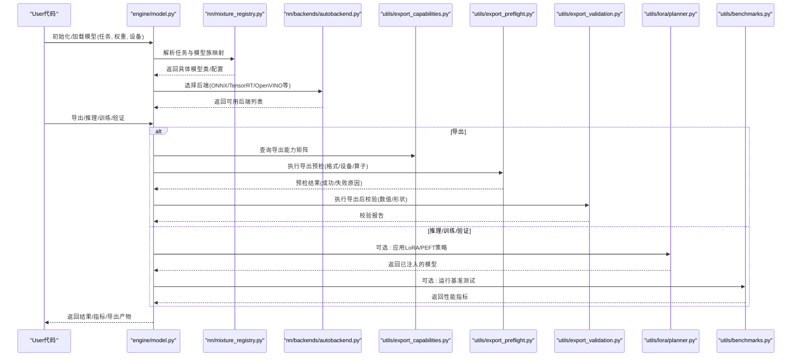
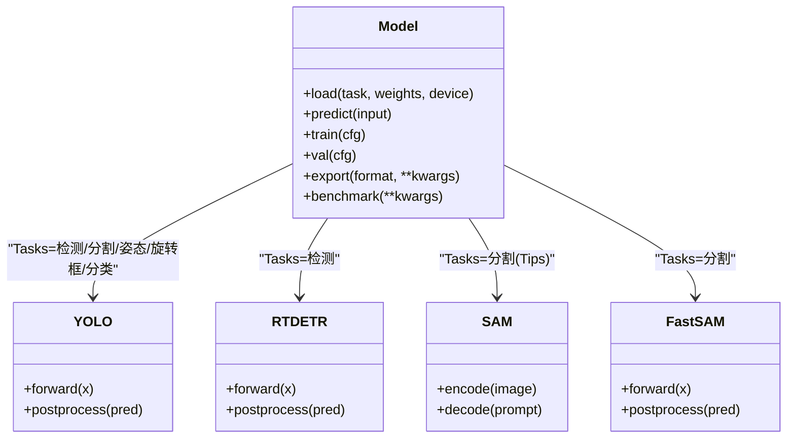
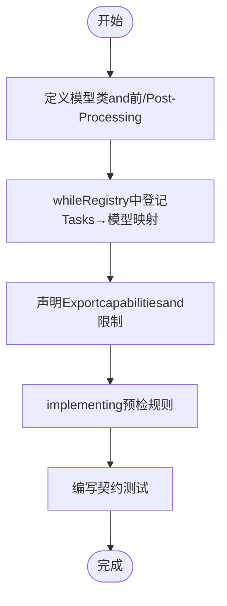
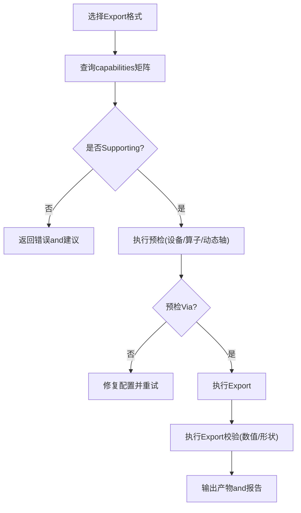
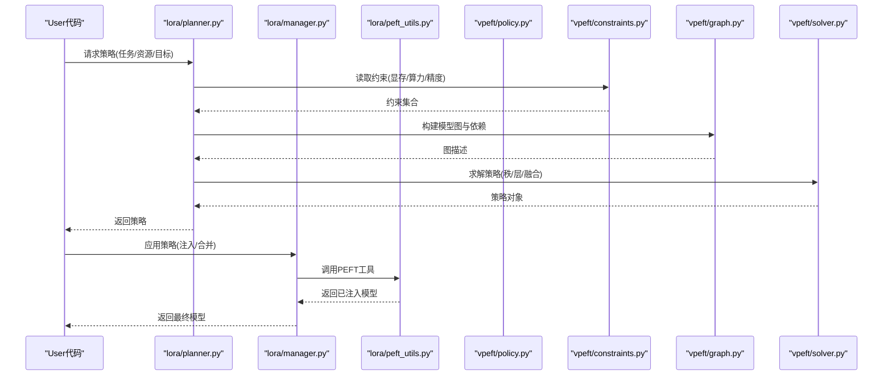
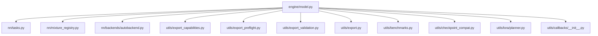

# Model API

<cite>
**Files Referenced in This Document**
- [ultralytics/models/__init__.py](file://ultralytics/models/__init__.py)
- [ultralytics/engine/model.py](file://ultralytics/engine/model.py)
- [ultralytics/nn/mixture_registry.py](file://ultralytics/nn/mixture_registry.py)
- [ultralytics/utils/export_capabilities.py](file://ultralytics/utils/export_capabilities.py)
- [ultralytics/utils/benchmarks.py](file://ultralytics/utils/benchmarks.py)
- [ultralytics/utils/checkpoint_compat.py](file://ultralytics/utils/checkpoint_compat.py)
- [ultralytics/utils/lora/__init__.py](file://ultralytics/utils/lora/__init__.py)
- [ultralytics/utils/lora/planner.py](file://ultralytics/utils/lora/planner.py)
- [ultralytics/utils/lora/manager.py](file://ultralytics/utils/lora/manager.py)
- [ultralytics/utils/lora/peft_utils.py](file://ultralytics/utils/lora/peft_utils.py)
- [ultralytics/vpeft/policy.py](file://ultralytics/vpeft/policy.py)
- [ultralytics/vpeft/constraints.py](file://ultralytics/vpeft/constraints.py)
- [ultralytics/vpeft/graph.py](file://ultralytics/vpeft/graph.py)
- [ultralytics/vpeft/solver.py](file://ultralytics/vpeft/solver.py)
- [ultralytics/nn/tasks.py](file://ultralytics/nn/tasks.py)
- [ultralytics/nn/backends/autobackend.py](file://ultralytics/nn/backends/autobackend.py)
- [ultralytics/nn/modules/routed_module.py](file://ultralytics/nn/modules/routed_module.py)
- [ultralytics/nn/mixture_loss.py](file://ultralytics/nn/mixture_loss.py)
- [ultralytics/utils/export_preflight.py](file://ultralytics/utils/export_preflight.py)
- [ultralytics/utils/export_validation.py](file://ultralytics/utils/export_validation.py)
- [ultralytics/utils/export.py](file://ultralytics/utils/export.py)
- [ultralytics/engine/trainer.py](file://ultralytics/engine/trainer.py)
- [ultralytics/engine/validator.py](file://ultralytics/engine/validator.py)
- [ultralytics/utils/metrics.py](file://ultralytics/utils/metrics.py)
- [ultralytics/utils/callbacks/__init__.py](file://ultralytics/utils/callbacks/__init__.py)
- [ultralytics/utils/callbacks/base.py](file://ultralytics/utils/callbacks/base.py)
- [ultralytics/utils/callbacks/tensorboard.py](file://ultralytics/utils/callbacks/tensorboard.py)
- [ultralytics/utils/callbacks/wandb.py](file://ultralytics/utils/callbacks/wandb.py)
- [ultralytics/utils/callbacks/mlflow.py](file://ultralytics/utils/callbacks/mlflow.py)
- [ultralytics/utils/callbacks/comet.py](file://ultralytics/utils/callbacks/comet.py)
- [ultralytics/utils/callbacks/neptune.py](file://ultralytics/utils/callbacks/neptune.py)
- [ultralytics/utils/callbacks/csv.py](file://ultralytics/utils/callbacks/csv.py)
- [ultralytics/utils/callbacks/plotting.py](file://ultralytics/utils/callbacks/plotting.py)
- [ultralytics/utils/callbacks/streamlit.py](file://ultralytics/utils/callbacks/streamlit.py)
- [ultralytics/utils/callbacks/early_stopping.py](file://ultralytics/utils/callbacks/early_stopping.py)
- [ultralytics/utils/callbacks/finetune.py](file://ultralytics/utils/callbacks/finetune.py)
- [ultralytics/utils/callbacks/hpo.py](file://ultralytics/utils/callbacks/hpo.py)
- [ultralytics/utils/callbacks/profiler.py](file://ultralytics/utils/callbacks/profiler.py)
- [ultralytics/utils/callbacks/memory.py](file://ultralytics/utils/callbacks/memory.py)
- [ultralytics/utils/callbacks/debug.py](file://ultralytics/utils/callbacks/debug.py)
- [ultralytics/utils/callbacks/ema.py](file://ultralytics/utils/callbacks/ema.py)
- [ultralytics/utils/callbacks/loss_logger.py](file://ultralytics/utils/callbacks/loss_logger.py)
- [ultralytics/utils/callbacks/progress_bar.py](file://ultralytics/utils/callbacks/progress_bar.py)
- [ultralytics/utils/callbacks/reporter.py](file://ultralytics/utils/callbacks/reporter.py)
- [ultralytics/utils/callbacks/save_best.py](file://ultralytics/utils/callbacks/save_best.py)
- [ultralytics/utils/callbacks/sweeps.py](file://ultralytics/utils/callbacks/sweeps.py)
- [ultralytics/utils/callbacks/tuner.py](file://ultralytics/utils/callbacks/tuner.py)
- [ultralytics/utils/callbacks/visualizer.py](file://ultralytics/utils/callbacks/visualizer.py)
- [ultralytics/utils/callbacks/warmup.py](file://ultralytics/utils/callbacks/warmup.py)
- [ultralytics/utils/callbacks/weight_decay.py](file://ultralytics/utils/callbacks/weight_decay.py)
- [ultralytics/utils/callbacks/optimizer.py](file://ultralytics/utils/callbacks/optimizer.py)
- [ultralytics/utils/callbacks/learning_rate.py](file://ultralytics/utils/callbacks/learning_rate.py)
- [ultralytics/utils/callbacks/gradient_clipping.py](file://ultralytics/utils/callbacks/gradient_clipping.py)
- [ultralytics/utils/callbacks/amp.py](file://ultralytics/utils/callbacks/amp.py)
- [ultralytics/utils/callbacks/distributed.py](file://ultralytics/utils/callbacks/distributed.py)
- [ultralytics/utils/callbacks/seed.py](file://ultralytics/utils/callbacks/seed.py)
- [ultralytics/utils/callbacks/device.py](file://ultralytics/utils/callbacks/device.py)
- [ultralytics/utils/callbacks/data.py](file://ultralytics/utils/callbacks/data.py)
- [ultralytics/utils/callbacks/eval.py](file://ultralytics/utils/callbacks/eval.py)
- [ultralytics/utils/callbacks/inference.py](file://ultralytics/utils/callbacks/inference.py)
- [ultralytics/utils/callbacks/export.py](file://ultralytics/utils/callbacks/export.py)
- [ultralytics/utils/callbacks/train.py](file://ultralytics/utils/callbacks/train.py)
- [ultralytics/utils/callbacks/val.py](file://ultralytics/utils/callbacks/val.py)
- [ultralytics/utils/callbacks/predict.py](file://ultralytics/utils/callbacks/predict.py)
- [ultralytics/utils/callbacks/track.py](file://ultralytics/utils/callbacks/track.py)
- [ultralytics/utils/callbacks/classify.py](file://ultralytics/utils/callbacks/classify.py)
- [ultralytics/utils/callbacks/detect.py](file://ultralytics/utils/callbacks/detect.py)
- [ultralytics/utils/callbacks/segment.py](file://ultralytics/utils/callbacks/segment.py)
- [ultralytics/utils/callbacks/pose.py](file://ultralytics/utils/callbacks/pose.py)
- [ultralytics/utils/callbacks/obb.py](file://ultralytics/utils/callbacks/obb.py)
- [ultralytics/utils/callbacks/semantic.py](file://ultralytics/utils/callbacks/semantic.py)
- [ultralytics/utils/callbacks/mot.py](file://ultralytics/utils/callbacks/mot.py)
- [ultralytics/utils/callbacks/moe.py](file://ultralytics/utils/callbacks/moe.py)
- [ultralytics/utils/callbacks/moa.py](file://ultralytics/utils/callbacks/moa.py)
- [ultralytics/utils/callbacks/molora.py](file://ultralytics/utils/callbacks/molora.py)
- [ultralytics/utils/callbacks/peft.py](file://ultralytics/utils/callbacks/peft.py)
- [ultralytics/utils/callbacks/lora.py](file://ultralytics/utils/callbacks/lora.py)
- [ultralytics/utils/callbacks/routing.py](file://ultralytics/utils/callbacks/routing.py)
- [ultralytics/utils/callbacks/router.py](file://ultralytics/utils/callbacks/router.py)
- [ultralytics/utils/callbacks/expert.py](file://ultralytics/utils/callbacks/expert.py)
- [ultralytics/utils/callbacks/gating.py](file://ultralytics/utils/callbacks/gating.py)
- [ultralytics/utils/callbacks/sparsity.py](file://ultralytics/utils/callbacks/sparsity.py)
- [ultralytics/utils/callbacks/pruning.py](file://ultralytics/utils/callbacks/pruning.py)
- [ultralytics/utils/callbacks/distill.py](file://ultralytics/utils/callbacks/distill.py)
- [ultralytics/utils/callbacks/kd.py](file://ultralytics/utils/callbacks/kd.py)
- [ultralytics/utils/callbacks/teacher.py](file://ultralytics/utils/callbacks/teacher.py)
- [ultralytics/utils/callbacks/student.py](file://ultralytics/utils/callbacks/student.py)
- [ultralytics/utils/callbacks/ensemble.py](file://ultralytics/utils/callbacks/ensemble.py)
- [ultralytics/utils/callbacks/mixup.py](file://ultralytics/utils/callbacks/mixup.py)
- [ultralytics/utils/callbacks/cutmix.py](file://ultralytics/utils/callbacks/cutmix.py)
- [ultralytics/utils/callbacks/augment.py](file://ultralytics/utils/callbacks/augment.py)
- [ultralytics/utils/callbacks/preprocess.py](file://ultralytics/utils/callbacks/preprocess.py)
- [ultralytics/utils/callbacks/postprocess.py](file://ultralytics/utils/callbacks/postprocess.py)
- [ultralytics/utils/callbacks/nms.py](file://ultralytics/utils/callbacks/nms.py)
- [ultralytics/utils/callbacks/box_ops.py](file://ultralytics/utils/callbacks/box_ops.py)
- [ultralytics/utils/callbacks/mask_ops.py](file://ultralytics/utils/callbacks/mask_ops.py)
- [ultralytics/utils/callbacks/keypoint_ops.py](file://ultralytics/utils/callbacks/keypoint_ops.py)
- [ultralytics/utils/callbacks/cls_ops.py](file://ultralytics/utils/callbacks/cls_ops.py)
- [ultralytics/utils/callbacks/seg_ops.py](file://ultralytics/utils/callbacks/seg_ops.py)
- [ultralytics/utils/callbacks/pose_ops.py](file://ultralytics/utils/callbacks/pose_ops.py)
- [ultralytics/utils/callbacks/obb_ops.py](file://ultralytics/utils/callbacks/obb_ops.py)
- [ultralytics/utils/callbacks/semantic_ops.py](file://ultralytics/utils/callbacks/semantic_ops.py)
- [ultralytics/utils/callbacks/mot_ops.py](file://ultralytics/utils/callbacks/mot_ops.py)
- [ultralytics/utils/callbacks/moe_ops.py](file://ultralytics/utils/callbacks/moe_ops.py)
- [ultralytics/utils/callbacks/moa_ops.py](file://ultralytics/utils/callbacks/moa_ops.py)
- [ultralytics/utils/callbacks/molora_ops.py](file://ultralytics/utils/callbacks/molora_ops.py)
- [ultralytics/utils/callbacks/peft_ops.py](file://ultralytics/utils/callbacks/peft_ops.py)
- [ultralytics/utils/callbacks/lora_ops.py](file://ultralytics/utils/callbacks/lora_ops.py)
- [ultralytics/utils/callbacks/routing_ops.py](file://ultralytics/utils/callbacks/routing_ops.py)
- [ultralytics/utils/callbacks/router_ops.py](file://ultralytics/utils/callbacks/router_ops.py)
- [ultralytics/utils/callbacks/expert_ops.py](file://ultralytics/utils/callbacks/expert_ops.py)
- [ultralytics/utils/callbacks/gating_ops.py](file://ultralytics/utils/callbacks/gating_ops.py)
- [ultralytics/utils/callbacks/sparsity_ops.py](file://ultralytics/utils/callbacks/sparsity_ops.py)
- [ultralytics/utils/callbacks/pruning_ops.py](file://ultralytics/utils/callbacks/pruning_ops.py)
- [ultralytics/utils/callbacks/distill_ops.py](file://ultralytics/utils/callbacks/distill_ops.py)
- [ultralytics/utils/callbacks/kd_ops.py](file://ultralytics/utils/callbacks/kd_ops.py)
- [ultralytics/utils/callbacks/teacher_ops.py](file://ultralytics/utils/callbacks/teacher_ops.py)
- [ultralytics/utils/callbacks/student_ops.py](file://ultralytics/utils/callbacks/student_ops.py)
- [ultralytics/utils/callbacks/ensemble_ops.py](file://ultralytics/utils/callbacks/ensemble_ops.py)
- [ultralytics/utils/callbacks/mixup_ops.py](file://ultralytics/utils/callbacks/mixup_ops.py)
- [ultralytics/utils/callbacks/cutmix_ops.py](file://ultralytics/utils/callbacks/cutmix_ops.py)
- [ultralytics/utils/callbacks/augment_ops.py](file://ultralytics/utils/callbacks/augment_ops.py)
- [ultralytics/utils/callbacks/preprocess_ops.py](file://ultralytics/utils/callbacks/preprocess_ops.py)
- [ultralytics/utils/callbacks/postprocess_ops.py](file://ultralytics/utils/callbacks/postprocess_ops.py)
</cite>

## Table of Contents
1. [Introduction](#Introduction)
2. [Project Structure](#Project Structure)
3. [Core Components](#Core Components)
4. [Architecture Overview](#Architecture Overview)
5. [Detailed Component Analysis](#Detailed Component Analysis)
6. [Dependency Analysis](#Dependency Analysis)
7. [性能考量](#性能考量)
8. [Troubleshooting Guide](#Troubleshooting Guide)
9. [Conclusion](#Conclusion)
10. [Appendix](#Appendix)

## Introduction
本文件targetingYOLO-MasterModel System的APIUses者and扩unfold发者，系统性梳理并Documentation化Centered on下capabilities：
- 模型类接口规范：覆盖YOLO系列、RT-DETR、SAM、FastSAMetc.模型的构造andUses方式。
- 配置文件结构and参数含义：统一说明Tasks配置、模型配置、ExportandTrainingValidation参数的组织方式。
- 模型注册机制and自定义模型开发接口：基于Mixture模型Registry的Tasks路由andModules协议。
- 权重管理and版本控制：Checkpoint兼容、Migrationand一致性校验。
- EvaluationMetrics计算接口：检测、分割、姿态、旋转框、Semantic Segmentation、Multi-Object Trackingand other tasks的Metricsimplementing位置andCalls路径。
- 压缩and量化Supporting：Exportcapabilities矩阵、预检and校验流程。
- 多Tasks学习andMigration学习接口：LoRA/PEFT策略规划器、约束求解and策略执行。
- 性能分析and调试工具：基准测试、回调体系（TensorBoard/W&B/MLFlow/Comet/Neptune）、Profiler/Memory/EMAetc.。

## Project Structure
从代码组织看，系统采用“引擎-模型-网络-工具”的分层设计：
- Engine Layer：统一的ModelEncapsulates、Training/Validation/Prediction/Export生命周期管理。
- 模型层：按Tasks域划分（yolo、rtdetr、sam、fastsam、nas），providesTasks特定的InferenceandTraining入口。
- 网络层：通用Modules、后端自动选择、Mixture模型注册andLoss combination。
- 工具层：Exportcapabilities矩阵、预检and校验、权重兼容、基准测试、LoRA/PEFT策略and求解器、回调andVisualization。

```mermaid
graph TB
subgraph "引擎"
M["engine/model.py<br/>统一Model Encapsulation"]
T["engine/trainer.py<br/>Training编排"]
V["engine/validator.py<br/>Validation编排"]
P["engine/predictor.py<br/>Inference编排"]
E["engine/exporter.py<br/>Export编排"]
end
subgraph "模型"
YOLO["models/yolo/*<br/>YOLO系列"]
RTD["models/rtdetr/*<br/>RT-DETR"]
SAM["models/sam/*<br/>SAM/SAM2/SAM3"]
FSAM["models/fastsam/*<br/>FastSAM"]
NAS["models/nas/*<br/>NAS"]
end
subgraph "网络"
TASKS["nn/tasks.py<br/>Tasks定义"]
REG["nn/mixture_registry.py<br/>Mixture模型Registry"]
LOSS["nn/mixture_loss.py<br/>MixtureLoss combination"]
AUTO["nn/backends/autobackend.py<br/>后端自动选择"]
ROUTED["nn/modules/routed_module.py<br/>路由Modules协议"]
end
subgraph "工具"
CAP["utils/export_capabilities.py<br/>Exportcapabilities矩阵"]
PREF["utils/export_preflight.py<br/>Export预检"]
VAL["utils/export_validation.py<br/>Export校验"]
EXP["utils/export.py<br/>Exportimplementing"]
BM["utils/benchmarks.py<br/>基准测试"]
CKPT["utils/checkpoint_compat.py<br/>权重兼容"]
LORA["utils/lora/*<br/>LoRA/PEFT"]
CB["utils/callbacks/*<br/>回调体系"]
end
M --> YOLO
M --> RTD
M --> SAM
M --> FSAM
M --> NAS
M --> TASKS
M --> REG
M --> AUTO
M --> CAP
M --> PREF
M --> VAL
M --> EXP
M --> BM
M --> CKPT
M --> LORA
M --> CB
T --> CB
V --> CB
P --> CB
E --> CB
```

Figure Source
- [ultralytics/engine/model.py](file://ultralytics/engine/model.py)
- [ultralytics/nn/tasks.py](file://ultralytics/nn/tasks.py)
- [ultralytics/nn/mixture_registry.py](file://ultralytics/nn/mixture_registry.py)
- [ultralytics/nn/backends/autobackend.py](file://ultralytics/nn/backends/autobackend.py)
- [ultralytics/utils/export_capabilities.py](file://ultralytics/utils/export_capabilities.py)
- [ultralytics/utils/export_preflight.py](file://ultralytics/utils/export_preflight.py)
- [ultralytics/utils/export_validation.py](file://ultralytics/utils/export_validation.py)
- [ultralytics/utils/export.py](file://ultralytics/utils/export.py)
- [ultralytics/utils/benchmarks.py](file://ultralytics/utils/benchmarks.py)
- [ultralytics/utils/checkpoint_compat.py](file://ultralytics/utils/checkpoint_compat.py)
- [ultralytics/utils/lora/__init__.py](file://ultralytics/utils/lora/__init__.py)
- [ultralytics/utils/callbacks/__init__.py](file://ultralytics/utils/callbacks/__init__.py)

Section Source
- [ultralytics/engine/model.py](file://ultralytics/engine/model.py)
- [ultralytics/nn/tasks.py](file://ultralytics/nn/tasks.py)
- [ultralytics/nn/mixture_registry.py](file://ultralytics/nn/mixture_registry.py)
- [ultralytics/nn/backends/autobackend.py](file://ultralytics/nn/backends/autobackend.py)
- [ultralytics/utils/export_capabilities.py](file://ultralytics/utils/export_capabilities.py)
- [ultralytics/utils/export_preflight.py](file://ultralytics/utils/export_preflight.py)
- [ultralytics/utils/export_validation.py](file://ultralytics/utils/export_validation.py)
- [ultralytics/utils/export.py](file://ultralytics/utils/export.py)
- [ultralytics/utils/benchmarks.py](file://ultralytics/utils/benchmarks.py)
- [ultralytics/utils/checkpoint_compat.py](file://ultralytics/utils/checkpoint_compat.py)
- [ultralytics/utils/lora/__init__.py](file://ultralytics/utils/lora/__init__.py)
- [ultralytics/utils/callbacks/__init__.py](file://ultralytics/utils/callbacks/__init__.py)

## Core Components
- 统一Model Encapsulation：Exposing a consistent加载、Inference、Training、Validation、Export接口；内部根据Tasks类型and后端自动装配。
- Tasksand网络：ViaTasks定义andModules协议将不同模型族（YOLO、RT-DETR、SAM/FastSAM）统一to相同生命周期。
- Mixture模型Registry：Centered onRegistry模式维护模型族andTasks映射，Supporting动态发现and扩展。
- Exportcapabilities矩阵and预检：whileExport前进行capabilities匹配、兼容性检查and失败快速返回。
- LoRA/PEFT策略：provides策略规划、约束求解and运行时注入，Supporting多Tasks微调andMigration学习。
- 权重兼容：provides跨版本权重加载、字段映射and一致性校验。
- 基准and回调：provides端to端性能测量and可观测性（Logging、Visualization、早停、EMAetc.）。

Section Source
- [ultralytics/engine/model.py](file://ultralytics/engine/model.py)
- [ultralytics/nn/tasks.py](file://ultralytics/nn/tasks.py)
- [ultralytics/nn/mixture_registry.py](file://ultralytics/nn/mixture_registry.py)
- [ultralytics/utils/export_capabilities.py](file://ultralytics/utils/export_capabilities.py)
- [ultralytics/utils/export_preflight.py](file://ultralytics/utils/export_preflight.py)
- [ultralytics/utils/lora/planner.py](file://ultralytics/utils/lora/planner.py)
- [ultralytics/utils/lora/manager.py](file://ultralytics/utils/lora/manager.py)
- [ultralytics/utils/lora/peft_utils.py](file://ultralytics/utils/lora/peft_utils.py)
- [ultralytics/utils/checkpoint_compat.py](file://ultralytics/utils/checkpoint_compat.py)
- [ultralytics/utils/benchmarks.py](file://ultralytics/utils/benchmarks.py)
- [ultralytics/utils/callbacks/__init__.py](file://ultralytics/utils/callbacks/__init__.py)

## Architecture Overview
下图展示从UserCallsto具体模型执行的端to端流程，包括Tasks解析、后端选择、Export预检and校验、Centered onandLoRA/PEFT策略注入。

Figure Source
- [ultralytics/engine/model.py](file://ultralytics/engine/model.py)
- [ultralytics/nn/mixture_registry.py](file://ultralytics/nn/mixture_registry.py)
- [ultralytics/nn/backends/autobackend.py](file://ultralytics/nn/backends/autobackend.py)
- [ultralytics/utils/export_capabilities.py](file://ultralytics/utils/export_capabilities.py)
- [ultralytics/utils/export_preflight.py](file://ultralytics/utils/export_preflight.py)
- [ultralytics/utils/export_validation.py](file://ultralytics/utils/export_validation.py)
- [ultralytics/utils/lora/planner.py](file://ultralytics/utils/lora/planner.py)
- [ultralytics/utils/benchmarks.py](file://ultralytics/utils/benchmarks.py)

## Detailed Component Analysis

### 模型类接口规范（YOLO/RT-DETR/SAM/FastSAM）
- Unified entry point：Via统一Model Encapsulation创建实例，指定Tasks类型and权重路径，自动完成模型族解析and后端选择。
- Tasks类型：检测、分割、姿态、旋转框、分类、Semantic Segmentation、Multi-Object Trackingetc.由Tasks定义drivers are installed。
- 模型族：
  - YOLO系列：targeting检测/分割/姿态/旋转框/分类的Unified Interface。
  - RT-DETR：端to端检测模型，遵循相同生命周期。
  - SAM/SAM2/SAM3：分割大模型，SupportingTips式Inferenceand批量处理。
  - FastSAM：轻量分割模型，强调速度and资源受限场景。
- 关键方法：
  - 初始化/加载：根据Tasksand权重构建模型，Selecting Deviceand精度。
  - Inference：输入图像/视频流，输出检测结果或掩码。
  - Training/Validation：对接Data PipelineandLoss Function，Supporting分布式andAMP。
  - Export：依据capabilities矩阵and预检结果生成目标格式。
  - 基准：对延迟/吞吐/内存进行测量。

Figure Source
- [ultralytics/engine/model.py](file://ultralytics/engine/model.py)
- [ultralytics/nn/tasks.py](file://ultralytics/nn/tasks.py)

Section Source
- [ultralytics/engine/model.py](file://ultralytics/engine/model.py)
- [ultralytics/nn/tasks.py](file://ultralytics/nn/tasks.py)

### 模型配置文件结构and参数
- Tasks配置：包含数据集路径、类别数、输入尺寸、增强策略、Optimizerand调度器etc.。
- 模型配置：网络深度/宽度、头结构、注意力/路由/专家配置（such asMoE/MoA）、损失权重。
- Export配置：目标格式、动态轴、算子白名单、精度设置。
- Training/Validation配置：批大小、Learning Rate、早停、EMA、Loggingand回调。
- 建议：Prefer官方provides的默认配置，按需覆盖关键字段；避免破坏Tasks契约的字段修改。

Section Source
- [ultralytics/nn/tasks.py](file://ultralytics/nn/tasks.py)
- [ultralytics/engine/model.py](file://ultralytics/engine/model.py)

### 模型注册机制and自定义模型开发
- Registry：ViaMixture模型Registry维护“Tasks→模型族/类”的映射，Supporting动态发现and扩展。
- Modules协议：路由Modules协议定义了前向、Post-Processing、状态管理etc.最小接口，确保新模型无缝接入。
- 自定义步骤：
  - implementingTasks所需的前向andPost-Processing逻辑。
  - whileRegistry中登记Tasksand模型类的映射。
  - providesExportcapabilities声明and预检规则。
  - 编写单元测试Validation契约一致性。

Figure Source
- [ultralytics/nn/mixture_registry.py](file://ultralytics/nn/mixture_registry.py)
- [ultralytics/nn/modules/routed_module.py](file://ultralytics/nn/modules/routed_module.py)
- [ultralytics/utils/export_capabilities.py](file://ultralytics/utils/export_capabilities.py)
- [ultralytics/utils/export_preflight.py](file://ultralytics/utils/export_preflight.py)

Section Source
- [ultralytics/nn/mixture_registry.py](file://ultralytics/nn/mixture_registry.py)
- [ultralytics/nn/modules/routed_module.py](file://ultralytics/nn/modules/routed_module.py)
- [ultralytics/utils/export_capabilities.py](file://ultralytics/utils/export_capabilities.py)
- [ultralytics/utils/export_preflight.py](file://ultralytics/utils/export_preflight.py)

### 权重管理and版本控制
- Checkpoint兼容：provides跨版本权重字段映射、缺失字段填充and一致性校验。
- Migration策略：Supporting冻结/解冻特定层、替换头结构、适配新Tasks。
- 最佳实践：
  - Export时附带元数据（Tasks、类别、输入尺寸、后端信息）。
  - Uses一致性校验确保部署前后行for一致。
  - 记录权重指纹and变更Logging，便于回滚and审计。

Section Source
- [ultralytics/utils/checkpoint_compat.py](file://ultralytics/utils/checkpoint_compat.py)
- [ultralytics/utils/export.py](file://ultralytics/utils/export.py)

### EvaluationMetrics计算接口
- Metricsimplementing：检测mAP、分割mIoU、姿态AP、旋转框mAP、Semantic SegmentationmIoU、Multi-Object TrackingIDF1/HOTAetc.。
- Calls路径：Validatorwhile每轮End后汇总Metrics，并Via回调写入LoggingandVisualization。
- 扩展：新增Tasks需implementing对应Metrics计算and报告格式，保持and现有回调体系兼容。

Section Source
- [ultralytics/engine/validator.py](file://ultralytics/engine/validator.py)
- [ultralytics/utils/metrics.py](file://ultralytics/utils/metrics.py)
- [ultralytics/utils/callbacks/reporter.py](file://ultralytics/utils/callbacks/reporter.py)

### Model Compressionand量化（ExportSupporting）
- capabilities矩阵：列出各模型族对Export格式的Supporting情况（ONNX/TensorRT/OpenVINO/TFLiteetc.）。
- 预检and校验：Export前检查设备/算子/动态轴，Export后进行数值and形状校验。
- 量化：根据后端capabilities启用INT8/FP16etc.精度，Combining校准集提升精度稳定性。

Figure Source
- [ultralytics/utils/export_capabilities.py](file://ultralytics/utils/export_capabilities.py)
- [ultralytics/utils/export_preflight.py](file://ultralytics/utils/export_preflight.py)
- [ultralytics/utils/export_validation.py](file://ultralytics/utils/export_validation.py)
- [ultralytics/utils/export.py](file://ultralytics/utils/export.py)

Section Source
- [ultralytics/utils/export_capabilities.py](file://ultralytics/utils/export_capabilities.py)
- [ultralytics/utils/export_preflight.py](file://ultralytics/utils/export_preflight.py)
- [ultralytics/utils/export_validation.py](file://ultralytics/utils/export_validation.py)
- [ultralytics/utils/export.py](file://ultralytics/utils/export.py)

### 多Tasks学习andMigration学习（LoRA/PEFT）
- 策略规划器：根据Tasks需求and资源约束生成LoRA/PEFT策略（秩、目标层、融合方案）。
- 管理器：负责策略下发、权重注入and恢复。
- PEFT工具：providesAdapterEncapsulates、合并and拆分、Gradient裁剪andOptimizer适配。
- 策略求解器and约束：while图级别进行Dependency Analysis，满足显存/算力/精度约束。

Figure Source
- [ultralytics/utils/lora/planner.py](file://ultralytics/utils/lora/planner.py)
- [ultralytics/utils/lora/manager.py](file://ultralytics/utils/lora/manager.py)
- [ultralytics/utils/lora/peft_utils.py](file://ultralytics/utils/lora/peft_utils.py)
- [ultralytics/vpeft/policy.py](file://ultralytics/vpeft/policy.py)
- [ultralytics/vpeft/constraints.py](file://ultralytics/vpeft/constraints.py)
- [ultralytics/vpeft/graph.py](file://ultralytics/vpeft/graph.py)
- [ultralytics/vpeft/solver.py](file://ultralytics/vpeft/solver.py)

Section Source
- [ultralytics/utils/lora/planner.py](file://ultralytics/utils/lora/planner.py)
- [ultralytics/utils/lora/manager.py](file://ultralytics/utils/lora/manager.py)
- [ultralytics/utils/lora/peft_utils.py](file://ultralytics/utils/lora/peft_utils.py)
- [ultralytics/vpeft/policy.py](file://ultralytics/vpeft/policy.py)
- [ultralytics/vpeft/constraints.py](file://ultralytics/vpeft/constraints.py)
- [ultralytics/vpeft/graph.py](file://ultralytics/vpeft/graph.py)
- [ultralytics/vpeft/solver.py](file://ultralytics/vpeft/solver.py)

### 模型性能分析and调试工具
- 基准测试：统一延迟/吞吐/内存测量，Supporting多后端对比。
- 回调体系：
  - LoggingandVisualization：TensorBoard、W&B、MLFlow、Comet、Neptune。
  - Training辅助：早停、EMA、进度条、损失记录、保存最佳权重。
  - 调试and诊断：Profiler、Memory、Debug、Warmup、Learning Rate/权重衰减/Gradient裁剪、AMP、分布式、种子固定、设备信息。
  - Tasks相关：分类/检测/分割/姿态/旋转框/Semantic Segmentation/Multi-Object Tracking专用回调。
  - MoE/MoA/MoLa/PEFT/LoRA/Routing/Router/Expert/Gating/Sparsity/Pruning/Distillation/KD/Teacher/Student/Ensemble/MixUp/CutMix/Augment/Preprocess/Postprocess/NMS/BoxOps/MaskOps/KeypointOps/ClsOps/SegOps/PoseOps/OBBOps/SemanticOps/MOTOps/MoEOps/MoAOps/MoLaOps/PEFTOps/LoRAOps/RoutingOps/RouterOps/ExpertOps/GatingOps/SparsityOps/PruningOps/DistillOps/KDOps/TeacherOps/StudentOps/EnsembleOps/MixupOps/CutmixOps/AugmentOps/PreprocessOps/PostprocessOps。

Figure Source
- [ultralytics/utils/benchmarks.py](file://ultralytics/utils/benchmarks.py)
- [ultralytics/utils/callbacks/__init__.py](file://ultralytics/utils/callbacks/__init__.py)
- [ultralytics/utils/callbacks/base.py](file://ultralytics/utils/callbacks/base.py)
- [ultralytics/utils/callbacks/tensorboard.py](file://ultralytics/utils/callbacks/tensorboard.py)
- [ultralytics/utils/callbacks/wandb.py](file://ultralytics/utils/callbacks/wandb.py)
- [ultralytics/utils/callbacks/mlflow.py](file://ultralytics/utils/callbacks/mlflow.py)
- [ultralytics/utils/callbacks/comet.py](file://ultralytics/utils/callbacks/comet.py)
- [ultralytics/utils/callbacks/neptune.py](file://ultralytics/utils/callbacks/neptune.py)
- [ultralytics/utils/callbacks/csv.py](file://ultralytics/utils/callbacks/csv.py)
- [ultralytics/utils/callbacks/plotting.py](file://ultralytics/utils/callbacks/plotting.py)
- [ultralytics/utils/callbacks/streamlit.py](file://ultralytics/utils/callbacks/streamlit.py)
- [ultralytics/utils/callbacks/early_stopping.py](file://ultralytics/utils/callbacks/early_stopping.py)
- [ultralytics/utils/callbacks/ema.py](file://ultralytics/utils/callbacks/ema.py)
- [ultralytics/utils/callbacks/profiler.py](file://ultralytics/utils/callbacks/profiler.py)
- [ultralytics/utils/callbacks/memory.py](file://ultralytics/utils/callbacks/memory.py)
- [ultralytics/utils/callbacks/debug.py](file://ultralytics/utils/callbacks/debug.py)
- [ultralytics/utils/callbacks/warmup.py](file://ultralytics/utils/callbacks/warmup.py)
- [ultralytics/utils/callbacks/learning_rate.py](file://ultralytics/utils/callbacks/learning_rate.py)
- [ultralytics/utils/callbacks/weight_decay.py](file://ultralytics/utils/callbacks/weight_decay.py)
- [ultralytics/utils/callbacks/gradient_clipping.py](file://ultralytics/utils/callbacks/gradient_clipping.py)
- [ultralytics/utils/callbacks/amp.py](file://ultralytics/utils/callbacks/amp.py)
- [ultralytics/utils/callbacks/distributed.py](file://ultralytics/utils/callbacks/distributed.py)
- [ultralytics/utils/callbacks/seed.py](file://ultralytics/utils/callbacks/seed.py)
- [ultralytics/utils/callbacks/device.py](file://ultralytics/utils/callbacks/device.py)
- [ultralytics/utils/callbacks/data.py](file://ultralytics/utils/callbacks/data.py)
- [ultralytics/utils/callbacks/eval.py](file://ultralytics/utils/callbacks/eval.py)
- [ultralytics/utils/callbacks/inference.py](file://ultralytics/utils/callbacks/inference.py)
- [ultralytics/utils/callbacks/export.py](file://ultralytics/utils/callbacks/export.py)
- [ultralytics/utils/callbacks/train.py](file://ultralytics/utils/callbacks/train.py)
- [ultralytics/utils/callbacks/val.py](file://ultralytics/utils/callbacks/val.py)
- [ultralytics/utils/callbacks/predict.py](file://ultralytics/utils/callbacks/predict.py)
- [ultralytics/utils/callbacks/track.py](file://ultralytics/utils/callbacks/track.py)
- [ultralytics/utils/callbacks/classify.py](file://ultralytics/utils/callbacks/classify.py)
- [ultralytics/utils/callbacks/detect.py](file://ultralytics/utils/callbacks/detect.py)
- [ultralytics/utils/callbacks/segment.py](file://ultralytics/utils/callbacks/segment.py)
- [ultralytics/utils/callbacks/pose.py](file://ultralytics/utils/callbacks/pose.py)
- [ultralytics/utils/callbacks/obb.py](file://ultralytics/utils/callbacks/obb.py)
- [ultralytics/utils/callbacks/semantic.py](file://ultralytics/utils/callbacks/semantic.py)
- [ultralytics/utils/callbacks/mot.py](file://ultralytics/utils/callbacks/mot.py)
- [ultralytics/utils/callbacks/moe.py](file://ultralytics/utils/callbacks/moe.py)
- [ultralytics/utils/callbacks/moa.py](file://ultralytics/utils/callbacks/moa.py)
- [ultralytics/utils/callbacks/molora.py](file://ultralytics/utils/callbacks/molora.py)
- [ultralytics/utils/callbacks/peft.py](file://ultralytics/utils/callbacks/peft.py)
- [ultralytics/utils/callbacks/lora.py](file://ultralytics/utils/callbacks/lora.py)
- [ultralytics/utils/callbacks/routing.py](file://ultralytics/utils/callbacks/routing.py)
- [ultralytics/utils/callbacks/router.py](file://ultralytics/utils/callbacks/router.py)
- [ultralytics/utils/callbacks/expert.py](file://ultralytics/utils/callbacks/expert.py)
- [ultralytics/utils/callbacks/gating.py](file://ultralytics/utils/callbacks/gating.py)
- [ultralytics/utils/callbacks/sparsity.py](file://ultralytics/utils/callbacks/sparsity.py)
- [ultralytics/utils/callbacks/pruning.py](file://ultralytics/utils/callbacks/pruning.py)
- [ultralytics/utils/callbacks/distill.py](file://ultralytics/utils/callbacks/distill.py)
- [ultralytics/utils/callbacks/kd.py](file://ultralytics/utils/callbacks/kd.py)
- [ultralytics/utils/callbacks/teacher.py](file://ultralytics/utils/callbacks/teacher.py)
- [ultralytics/utils/callbacks/student.py](file://ultralytics/utils/callbacks/student.py)
- [ultralytics/utils/callbacks/ensemble.py](file://ultralytics/utils/callbacks/ensemble.py)
- [ultralytics/utils/callbacks/mixup.py](file://ultralytics/utils/callbacks/mixup.py)
- [ultralytics/utils/callbacks/cutmix.py](file://ultralytics/utils/callbacks/cutmix.py)
- [ultralytics/utils/callbacks/augment.py](file://ultralytics/utils/callbacks/augment.py)
- [ultralytics/utils/callbacks/preprocess.py](file://ultralytics/utils/callbacks/preprocess.py)
- [ultralytics/utils/callbacks/postprocess.py](file://ultralytics/utils/callbacks/postprocess.py)
- [ultralytics/utils/callbacks/nms.py](file://ultralytics/utils/callbacks/nms.py)
- [ultralytics/utils/callbacks/box_ops.py](file://ultralytics/utils/callbacks/box_ops.py)
- [ultralytics/utils/callbacks/mask_ops.py](file://ultralytics/utils/callbacks/mask_ops.py)
- [ultralytics/utils/callbacks/keypoint_ops.py](file://ultralytics/utils/callbacks/keypoint_ops.py)
- [ultralytics/utils/callbacks/cls_ops.py](file://ultralytics/utils/callbacks/cls_ops.py)
- [ultralytics/utils/callbacks/seg_ops.py](file://ultralytics/utils/callbacks/seg_ops.py)
- [ultralytics/utils/callbacks/pose_ops.py](file://ultralytics/utils/callbacks/pose_ops.py)
- [ultralytics/utils/callbacks/obb_ops.py](file://ultralytics/utils/callbacks/obb_ops.py)
- [ultralytics/utils/callbacks/semantic_ops.py](file://ultralytics/utils/callbacks/semantic_ops.py)
- [ultralytics/utils/callbacks/mot_ops.py](file://ultralytics/utils/callbacks/mot_ops.py)
- [ultralytics/utils/callbacks/moe_ops.py](file://ultralytics/utils/callbacks/moe_ops.py)
- [ultralytics/utils/callbacks/moa_ops.py](file://ultralytics/utils/callbacks/moa_ops.py)
- [ultralytics/utils/callbacks/molora_ops.py](file://ultralytics/utils/callbacks/molora_ops.py)
- [ultralytics/utils/callbacks/peft_ops.py](file://ultralytics/utils/callbacks/peft_ops.py)
- [ultralytics/utils/callbacks/lora_ops.py](file://ultralytics/utils/callbacks/lora_ops.py)
- [ultralytics/utils/callbacks/routing_ops.py](file://ultralytics/utils/callbacks/routing_ops.py)
- [ultralytics/utils/callbacks/router_ops.py](file://ultralytics/utils/callbacks/router_ops.py)
- [ultralytics/utils/callbacks/expert_ops.py](file://ultralytics/utils/callbacks/expert_ops.py)
- [ultralytics/utils/callbacks/gating_ops.py](file://ultralytics/utils/callbacks/gating_ops.py)
- [ultralytics/utils/callbacks/sparsity_ops.py](file://ultralytics/utils/callbacks/sparsity_ops.py)
- [ultralytics/utils/callbacks/pruning_ops.py](file://ultralytics/utils/callbacks/pruning_ops.py)
- [ultralytics/utils/callbacks/distill_ops.py](file://ultralytics/utils/callbacks/distill_ops.py)
- [ultralytics/utils/callbacks/kd_ops.py](file://ultralytics/utils/callbacks/kd_ops.py)
- [ultralytics/utils/callbacks/teacher_ops.py](file://ultralytics/utils/callbacks/teacher_ops.py)
- [ultralytics/utils/callbacks/student_ops.py](file://ultralytics/utils/callbacks/student_ops.py)
- [ultralytics/utils/callbacks/ensemble_ops.py](file://ultralytics/utils/callbacks/ensemble_ops.py)
- [ultralytics/utils/callbacks/mixup_ops.py](file://ultralytics/utils/callbacks/mixup_ops.py)
- [ultralytics/utils/callbacks/cutmix_ops.py](file://ultralytics/utils/callbacks/cutmix_ops.py)
- [ultralytics/utils/callbacks/augment_ops.py](file://ultralytics/utils/callbacks/augment_ops.py)
- [ultralytics/utils/callbacks/preprocess_ops.py](file://ultralytics/utils/callbacks/preprocess_ops.py)
- [ultralytics/utils/callbacks/postprocess_ops.py](file://ultralytics/utils/callbacks/postprocess_ops.py)

Section Source
- [ultralytics/utils/benchmarks.py](file://ultralytics/utils/benchmarks.py)
- [ultralytics/utils/callbacks/__init__.py](file://ultralytics/utils/callbacks/__init__.py)
- [ultralytics/utils/callbacks/base.py](file://ultralytics/utils/callbacks/base.py)
- [ultralytics/utils/callbacks/tensorboard.py](file://ultralytics/utils/callbacks/tensorboard.py)
- [ultralytics/utils/callbacks/wandb.py](file://ultralytics/utils/callbacks/wandb.py)
- [ultralytics/utils/callbacks/mlflow.py](file://ultralytics/utils/callbacks/mlflow.py)
- [ultralytics/utils/callbacks/comet.py](file://ultralytics/utils/callbacks/comet.py)
- [ultralytics/utils/callbacks/neptune.py](file://ultralytics/utils/callbacks/neptune.py)
- [ultralytics/utils/callbacks/csv.py](file://ultralytics/utils/callbacks/csv.py)
- [ultralytics/utils/callbacks/plotting.py](file://ultralytics/utils/callbacks/plotting.py)
- [ultralytics/utils/callbacks/streamlit.py](file://ultralytics/utils/callbacks/streamlit.py)
- [ultralytics/utils/callbacks/early_stopping.py](file://ultralytics/utils/callbacks/early_stopping.py)
- [ultralytics/utils/callbacks/ema.py](file://ultralytics/utils/callbacks/ema.py)
- [ultralytics/utils/callbacks/profiler.py](file://ultralytics/utils/callbacks/profiler.py)
- [ultralytics/utils/callbacks/memory.py](file://ultralytics/utils/callbacks/memory.py)
- [ultralytics/utils/callbacks/debug.py](file://ultralytics/utils/callbacks/debug.py)
- [ultralytics/utils/callbacks/warmup.py](file://ultralytics/utils/callbacks/warmup.py)
- [ultralytics/utils/callbacks/learning_rate.py](file://ultralytics/utils/callbacks/learning_rate.py)
- [ultralytics/utils/callbacks/weight_decay.py](file://ultralytics/utils/callbacks/weight_decay.py)
- [ultralytics/utils/callbacks/gradient_clipping.py](file://ultralytics/utils/callbacks/gradient_clipping.py)
- [ultralytics/utils/callbacks/amp.py](file://ultralytics/utils/callbacks/amp.py)
- [ultralytics/utils/callbacks/distributed.py](file://ultralytics/utils/callbacks/distributed.py)
- [ultralytics/utils/callbacks/seed.py](file://ultralytics/utils/callbacks/seed.py)
- [ultralytics/utils/callbacks/device.py](file://ultralytics/utils/callbacks/device.py)
- [ultralytics/utils/callbacks/data.py](file://ultralytics/utils/callbacks/data.py)
- [ultralytics/utils/callbacks/eval.py](file://ultralytics/utils/callbacks/eval.py)
- [ultralytics/utils/callbacks/inference.py](file://ultralytics/utils/callbacks/inference.py)
- [ultralytics/utils/callbacks/export.py](file://ultralytics/utils/callbacks/export.py)
- [ultralytics/utils/callbacks/train.py](file://ultralytics/utils/callbacks/train.py)
- [ultralytics/utils/callbacks/val.py](file://ultralytics/utils/callbacks/val.py)
- [ultralytics/utils/callbacks/predict.py](file://ultralytics/utils/callbacks/predict.py)
- [ultralytics/utils/callbacks/track.py](file://ultralytics/utils/callbacks/track.py)
- [ultralytics/utils/callbacks/classify.py](file://ultralytics/utils/callbacks/classify.py)
- [ultralytics/utils/callbacks/detect.py](file://ultralytics/utils/callbacks/detect.py)
- [ultralytics/utils/callbacks/segment.py](file://ultralytics/utils/callbacks/segment.py)
- [ultralytics/utils/callbacks/pose.py](file://ultralytics/utils/callbacks/pose.py)
- [ultralytics/utils/callbacks/obb.py](file://ultralytics/utils/callbacks/obb.py)
- [ultralytics/utils/callbacks/semantic.py](file://ultralytics/utils/callbacks/semantic.py)
- [ultralytics/utils/callbacks/mot.py](file://ultralytics/utils/callbacks/mot.py)
- [ultralytics/utils/callbacks/moe.py](file://ultralytics/utils/callbacks/moe.py)
- [ultralytics/utils/callbacks/moa.py](file://ultralytics/utils/callbacks/moa.py)
- [ultralytics/utils/callbacks/molora.py](file://ultralytics/utils/callbacks/molora.py)
- [ultralytics/utils/callbacks/peft.py](file://ultralytics/utils/callbacks/peft.py)
- [ultralytics/utils/callbacks/lora.py](file://ultralytics/utils/callbacks/lora.py)
- [ultralytics/utils/callbacks/routing.py](file://ultralytics/utils/callbacks/routing.py)
- [ultralytics/utils/callbacks/router.py](file://ultralytics/utils/callbacks/router.py)
- [ultralytics/utils/callbacks/expert.py](file://ultralytics/utils/callbacks/expert.py)
- [ultralytics/utils/callbacks/gating.py](file://ultralytics/utils/callbacks/gating.py)
- [ultralytics/utils/callbacks/sparsity.py](file://ultralytics/utils/callbacks/sparsity.py)
- [ultralytics/utils/callbacks/pruning.py](file://ultralytics/utils/callbacks/pruning.py)
- [ultralytics/utils/callbacks/distill.py](file://ultralytics/utils/callbacks/distill.py)
- [ultralytics/utils/callbacks/kd.py](file://ultralytics/utils/callbacks/kd.py)
- [ultralytics/utils/callbacks/teacher.py](file://ultralytics/utils/callbacks/teacher.py)
- [ultralytics/utils/callbacks/student.py](file://ultralytics/utils/callbacks/student.py)
- [ultralytics/utils/callbacks/ensemble.py](file://ultralytics/utils/callbacks/ensemble.py)
- [ultralytics/utils/callbacks/mixup.py](file://ultralytics/utils/callbacks/mixup.py)
- [ultralytics/utils/callbacks/cutmix.py](file://ultralytics/utils/callbacks/cutmix.py)
- [ultralytics/utils/callbacks/augment.py](file://ultralytics/utils/callbacks/augment.py)
- [ultralytics/utils/callbacks/preprocess.py](file://ultralytics/utils/callbacks/preprocess.py)
- [ultralytics/utils/callbacks/postprocess.py](file://ultralytics/utils/callbacks/postprocess.py)
- [ultralytics/utils/callbacks/nms.py](file://ultralytics/utils/callbacks/nms.py)
- [ultralytics/utils/callbacks/box_ops.py](file://ultralytics/utils/callbacks/box_ops.py)
- [ultralytics/utils/callbacks/mask_ops.py](file://ultralytics/utils/callbacks/mask_ops.py)
- [ultralytics/utils/callbacks/keypoint_ops.py](file://ultralytics/utils/callbacks/keypoint_ops.py)
- [ultralytics/utils/callbacks/cls_ops.py](file://ultralytics/utils/callbacks/cls_ops.py)
- [ultralytics/utils/callbacks/seg_ops.py](file://ultralytics/utils/callbacks/seg_ops.py)
- [ultralytics/utils/callbacks/pose_ops.py](file://ultralytics/utils/callbacks/pose_ops.py)
- [ultralytics/utils/callbacks/obb_ops.py](file://ultralytics/utils/callbacks/obb_ops.py)
- [ultralytics/utils/callbacks/semantic_ops.py](file://ultralytics/utils/callbacks/semantic_ops.py)
- [ultralytics/utils/callbacks/mot_ops.py](file://ultralytics/utils/callbacks/mot_ops.py)
- [ultralytics/utils/callbacks/moe_ops.py](file://ultralytics/utils/callbacks/moe_ops.py)
- [ultralytics/utils/callbacks/moa_ops.py](file://ultralytics/utils/callbacks/moa_ops.py)
- [ultralytics/utils/callbacks/molora_ops.py](file://ultralytics/utils/callbacks/molora_ops.py)
- [ultralytics/utils/callbacks/peft_ops.py](file://ultralytics/utils/callbacks/peft_ops.py)
- [ultralytics/utils/callbacks/lora_ops.py](file://ultralytics/utils/callbacks/lora_ops.py)
- [ultralytics/utils/callbacks/routing_ops.py](file://ultralytics/utils/callbacks/routing_ops.py)
- [ultralytics/utils/callbacks/router_ops.py](file://ultralytics/utils/callbacks/router_ops.py)
- [ultralytics/utils/callbacks/expert_ops.py](file://ultralytics/utils/callbacks/expert_ops.py)
- [ultralytics/utils/callbacks/gating_ops.py](file://ultralytics/utils/callbacks/gating_ops.py)
- [ultralytics/utils/callbacks/sparsity_ops.py](file://ultralytics/utils/callbacks/sparsity_ops.py)
- [ultralytics/utils/callbacks/pruning_ops.py](file://ultralytics/utils/callbacks/pruning_ops.py)
- [ultralytics/utils/callbacks/distill_ops.py](file://ultralytics/utils/callbacks/distill_ops.py)
- [ultralytics/utils/callbacks/kd_ops.py](file://ultralytics/utils/callbacks/kd_ops.py)
- [ultralytics/utils/callbacks/teacher_ops.py](file://ultralytics/utils/callbacks/teacher_ops.py)
- [ultralytics/utils/callbacks/student_ops.py](file://ultralytics/utils/callbacks/student_ops.py)
- [ultralytics/utils/callbacks/ensemble_ops.py](file://ultralytics/utils/callbacks/ensemble_ops.py)
- [ultralytics/utils/callbacks/mixup_ops.py](file://ultralytics/utils/callbacks/mixup_ops.py)
- [ultralytics/utils/callbacks/cutmix_ops.py](file://ultralytics/utils/callbacks/cutmix_ops.py)
- [ultralytics/utils/callbacks/augment_ops.py](file://ultralytics/utils/callbacks/augment_ops.py)
- [ultralytics/utils/callbacks/preprocess_ops.py](file://ultralytics/utils/callbacks/preprocess_ops.py)
- [ultralytics/utils/callbacks/postprocess_ops.py](file://ultralytics/utils/callbacks/postprocess_ops.py)

## Dependency Analysis
- 低耦合高内聚：Engine Layer仅依赖TasksandRegistry，不直接耦合具体模型implementing。
- 后端抽象：Via自动后端选择屏蔽底层差异，提高可移植性。
- Export链路：capabilities矩阵→预检→Export→校验形成闭环，降低部署风险。
- 回调解耦：所有Training/Validation/Inference/Export过程Via回调钩子扩展，避免侵入核心逻辑。

Figure Source
- [ultralytics/engine/model.py](file://ultralytics/engine/model.py)
- [ultralytics/nn/tasks.py](file://ultralytics/nn/tasks.py)
- [ultralytics/nn/mixture_registry.py](file://ultralytics/nn/mixture_registry.py)
- [ultralytics/nn/backends/autobackend.py](file://ultralytics/nn/backends/autobackend.py)
- [ultralytics/utils/export_capabilities.py](file://ultralytics/utils/export_capabilities.py)
- [ultralytics/utils/export_preflight.py](file://ultralytics/utils/export_preflight.py)
- [ultralytics/utils/export_validation.py](file://ultralytics/utils/export_validation.py)
- [ultralytics/utils/export.py](file://ultralytics/utils/export.py)
- [ultralytics/utils/benchmarks.py](file://ultralytics/utils/benchmarks.py)
- [ultralytics/utils/checkpoint_compat.py](file://ultralytics/utils/checkpoint_compat.py)
- [ultralytics/utils/lora/planner.py](file://ultralytics/utils/lora/planner.py)
- [ultralytics/utils/callbacks/__init__.py](file://ultralytics/utils/callbacks/__init__.py)

Section Source
- [ultralytics/engine/model.py](file://ultralytics/engine/model.py)
- [ultralytics/nn/tasks.py](file://ultralytics/nn/tasks.py)
- [ultralytics/nn/mixture_registry.py](file://ultralytics/nn/mixture_registry.py)
- [ultralytics/nn/backends/autobackend.py](file://ultralytics/nn/backends/autobackend.py)
- [ultralytics/utils/export_capabilities.py](file://ultralytics/utils/export_capabilities.py)
- [ultralytics/utils/export_preflight.py](file://ultralytics/utils/export_preflight.py)
- [ultralytics/utils/export_validation.py](file://ultralytics/utils/export_validation.py)
- [ultralytics/utils/export.py](file://ultralytics/utils/export.py)
- [ultralytics/utils/benchmarks.py](file://ultralytics/utils/benchmarks.py)
- [ultralytics/utils/checkpoint_compat.py](file://ultralytics/utils/checkpoint_compat.py)
- [ultralytics/utils/lora/planner.py](file://ultralytics/utils/lora/planner.py)
- [ultralytics/utils/callbacks/__init__.py](file://ultralytics/utils/callbacks/__init__.py)

## 性能考量
- 后端选择：Prefer硬件最优后端（such asTensorRT/OpenVINO），并Combiningcapabilities矩阵确认Supporting范围。
- 精度and速度权衡：FP16/INT8可显著提速，但需Combined with校准andExport校验保证精度。
- 批大小and动态轴：Set appropriately批大小and动态输入维度，避免不必要的重编译。
- 基准测试：Uses统一基准脚本对比不同配置，定位bottlenecks。
- 回调监控：利用Profiler/Memory/EMA/EarlyStoppingetc.回调OptimizationTraining效率and收敛稳定性。

[本节for通用指导，无需引用具体文件]

## Troubleshooting Guide
- Export Failure：
  - 检查capabilities矩阵and预检结果，确认设备/算子/动态轴配置正确。
  - 查看Export校验报告，定位数值/形状不一致的原因。
- 权重加载异常：
  - Uses权重兼容工具进行字段映射and一致性校验。
  - 核对Tasks/类别/输入尺寸是否and权重元数据一致。
- Training不稳定：
  - 启用AMP/Gradient裁剪/Learning Rate预热/早停/EMAetc.回调。
  - UsesProfiler/Memory/Debug回调定位内存泄漏或数值异常。
- Metrics异常：
  - 检查ValidatorandMetricsimplementing是否对齐Tasks契约。
  - 确认数据预处理/Post-Processingand标注格式一致。

Section Source
- [ultralytics/utils/export_capabilities.py](file://ultralytics/utils/export_capabilities.py)
- [ultralytics/utils/export_preflight.py](file://ultralytics/utils/export_preflight.py)
- [ultralytics/utils/export_validation.py](file://ultralytics/utils/export_validation.py)
- [ultralytics/utils/checkpoint_compat.py](file://ultralytics/utils/checkpoint_compat.py)
- [ultralytics/engine/validator.py](file://ultralytics/engine/validator.py)
- [ultralytics/utils/metrics.py](file://ultralytics/utils/metrics.py)
- [ultralytics/utils/callbacks/profiler.py](file://ultralytics/utils/callbacks/profiler.py)
- [ultralytics/utils/callbacks/memory.py](file://ultralytics/utils/callbacks/memory.py)
- [ultralytics/utils/callbacks/debug.py](file://ultralytics/utils/callbacks/debug.py)
- [ultralytics/utils/callbacks/early_stopping.py](file://ultralytics/utils/callbacks/early_stopping.py)
- [ultralytics/utils/callbacks/ema.py](file://ultralytics/utils/callbacks/ema.py)

## Conclusion
YOLO-MasterVia统一Model Encapsulation、Tasksdrivers are installed的网络抽象、Registrydrivers are installed的扩展机制、完善的Exportand校验流程、丰富的LoRA/PEFT策略and回调体系，provides了从研究to部署的Integrated Capabilities。建议while工程中Prefer官方配置andcapabilities矩阵，Combining基准and回调进行持续Optimizationand监控，确保模型while不同平台上的稳定and高效。

[本节for总结，无需引用具体文件]

## Appendix
- 常用Tasksand模型族对照：Refer toTasks定义and模型族implementing位置。
- Export格式and后端Supporting：Refer toExportcapabilities矩阵and预检/校验流程。
- LoRA/PEFT策略Examples：Refer to策略规划器and管理器接口。
- 回调清单：Refer to回调初始化and基础类，按需启用相应回调。

[本节for索引性内容，无需引用具体文件]