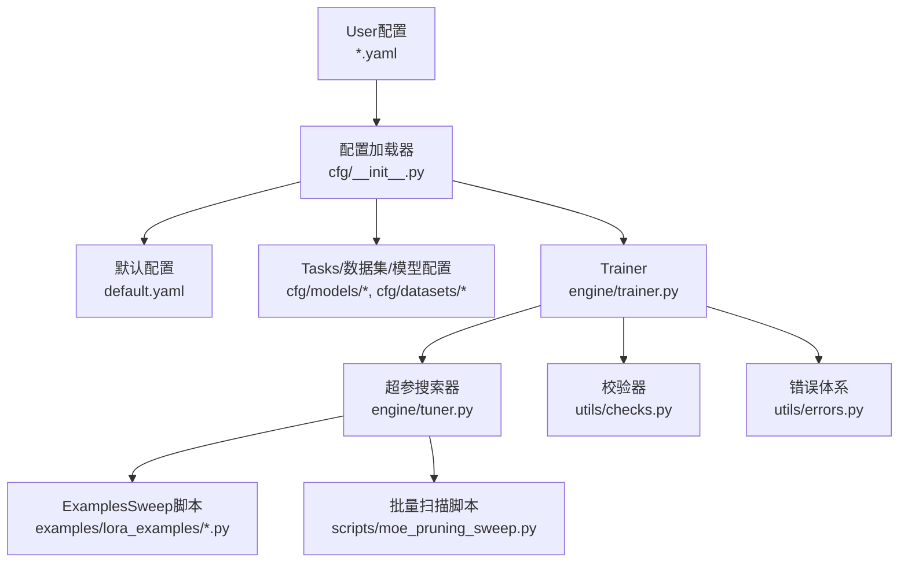
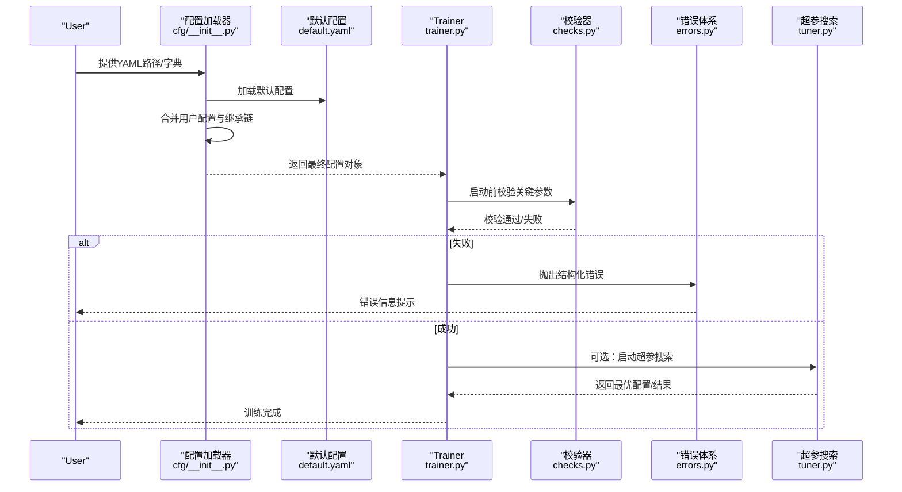
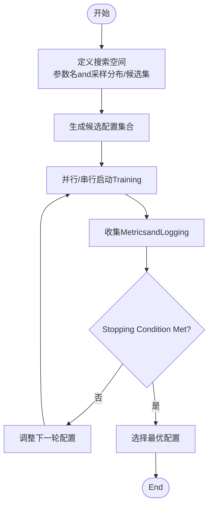
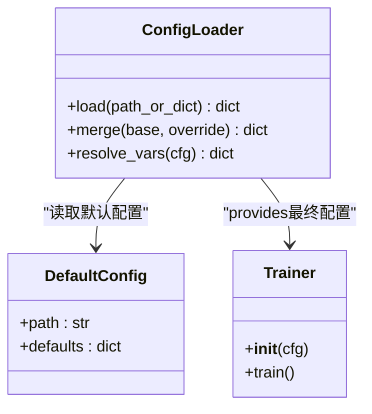
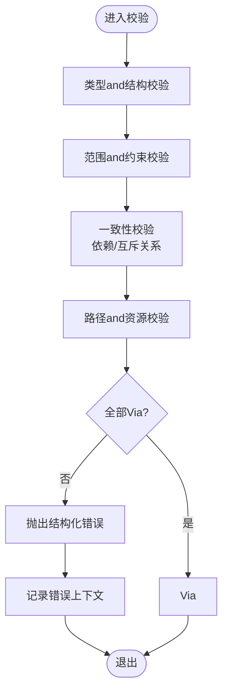
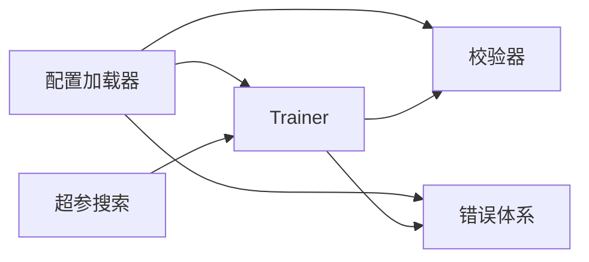

# 模型配置API

<cite>
**Files Referenced in This Document**
- [ultralytics/cfg/default.yaml](file://ultralytics/cfg/default.yaml)
- [ultralytics/cfg/__init__.py](file://ultralytics/cfg/__init__.py)
- [ultralytics/engine/trainer.py](file://ultralytics/engine/trainer.py)
- [ultralytics/engine/tuner.py](file://ultralytics/engine/tuner.py)
- [ultralytics/utils/checks.py](file://ultralytics/utils/checks.py)
- [ultralytics/utils/errors.py](file://ultralytics/utils/errors.py)
- [examples/lora_examples/yolo11_lora.yaml](file://examples/lora_examples/yolo11_lora.yaml)
- [examples/lora_examples/run_yolo_master_lora_rank_sweep.py](file://examples/lora_examples/run_yolo_master_lora_rank_sweep.py)
- [scripts/moe_pruning_sweep.py](file://scripts/moe_pruning_sweep.py)
- [tests/test_default_config_integrity.py](file://tests/test_default_config_integrity.py)
- [tests/test_mixture_config_resolution.py](file://tests/test_mixture_config_resolution.py)
</cite>

## Table of Contents
1. [Introduction](#Introduction)
2. [Project Structure](#Project Structure)
3. [Core Components](#Core Components)
4. [Architecture Overview](#Architecture Overview)
5. [Detailed Component Analysis](#Detailed Component Analysis)
6. [Dependency Analysis](#Dependency Analysis)
7. [Performance Considerations](#Performance Considerations)
8. [Troubleshooting Guide](#Troubleshooting Guide)
9. [Conclusion](#Conclusion)
10. [Appendix](#Appendix)

## Introduction
本文件targeting“模型配置API”，系统化说明YAML配置文件的结构and语法规范、参数含义and默认值、超参数调优and自动化搜索接口、配置的继承and组合机制、环境特定配置的优先级and覆盖规则、配置Validationand错误处理机制，并provides模板and最佳实践ExamplesCentered onandVisualization/编辑工具接口建议。Documentation内容基于仓库中实际implementingand测试用例进行归纳总结，确保可追溯and可复现。

## Project Structure
and模型配置相关的代码主要分布whileCentered on下位置：
- 配置定义and加载：ultralytics/cfg
- Training流程对配置的解析and应用：ultralytics/engine/trainer.py
- 超参搜索and自动调优：ultralytics/engine/tuner.py
- 配置校验and通用检查：ultralytics/utils/checks.py
- 错误类型and异常体系：ultralytics/utils/errors.py
- Examples配置andSweep脚本：examples/lora_examples/*.yaml, examples/lora_examples/run_yolo_master_lora_rank_sweep.py
- 批量扫描and实验脚本：scripts/moe_pruning_sweep.py
- 配置完整性and解析测试：tests/test_default_config_integrity.py, tests/test_mixture_config_resolution.py

Figure Source
- [ultralytics/cfg/__init__.py](file://ultralytics/cfg/__init__.py)
- [ultralytics/cfg/default.yaml](file://ultralytics/cfg/default.yaml)
- [ultralytics/engine/trainer.py](file://ultralytics/engine/trainer.py)
- [ultralytics/engine/tuner.py](file://ultralytics/engine/tuner.py)
- [ultralytics/utils/checks.py](file://ultralytics/utils/checks.py)
- [ultralytics/utils/errors.py](file://ultralytics/utils/errors.py)
- [examples/lora_examples/run_yolo_master_lora_rank_sweep.py](file://examples/lora_examples/run_yolo_master_lora_rank_sweep.py)
- [scripts/moe_pruning_sweep.py](file://scripts/moe_pruning_sweep.py)

Section Source
- [ultralytics/cfg/default.yaml](file://ultralytics/cfg/default.yaml)
- [ultralytics/cfg/__init__.py](file://ultralytics/cfg/__init__.py)
- [ultralytics/engine/trainer.py](file://ultralytics/engine/trainer.py)
- [ultralytics/engine/tuner.py](file://ultralytics/engine/tuner.py)
- [ultralytics/utils/checks.py](file://ultralytics/utils/checks.py)
- [ultralytics/utils/errors.py](file://ultralytics/utils/errors.py)
- [examples/lora_examples/run_yolo_master_lora_rank_sweep.py](file://examples/lora_examples/run_yolo_master_lora_rank_sweep.py)
- [scripts/moe_pruning_sweep.py](file://scripts/moe_pruning_sweep.py)

## Core Components
- 配置加载and合并：负责读取Userprovides的YAML、合并默认配置、解析继承关系and变量替换，并输出最终配置对象供TrainerUses。
- Trainer集成：whileTraining生命周期各阶段（初始化、数据构建、Optimizer/调度器创建、回调注册etc.）消费配置项。
- 超参搜索：ViaTuner或外部Sweep脚本drivers are installed多组配置并行/串行执行，收集Metrics并选择最优。
- 校验and错误：while加载后对关键参数进行范围、类型and一致性校验，失败时抛出结构化错误Centered on便定位。

Section Source
- [ultralytics/cfg/__init__.py](file://ultralytics/cfg/__init__.py)
- [ultralytics/engine/trainer.py](file://ultralytics/engine/trainer.py)
- [ultralytics/engine/tuner.py](file://ultralytics/engine/tuner.py)
- [ultralytics/utils/checks.py](file://ultralytics/utils/checks.py)
- [ultralytics/utils/errors.py](file://ultralytics/utils/errors.py)

## Architecture Overview
下图展示了从YAMLtoTraining执行的端to端流程，包括继承、合并、校验and搜索的交互。

Figure Source
- [ultralytics/cfg/__init__.py](file://ultralytics/cfg/__init__.py)
- [ultralytics/cfg/default.yaml](file://ultralytics/cfg/default.yaml)
- [ultralytics/engine/trainer.py](file://ultralytics/engine/trainer.py)
- [ultralytics/engine/tuner.py](file://ultralytics/engine/tuner.py)
- [ultralytics/utils/checks.py](file://ultralytics/utils/checks.py)
- [ultralytics/utils/errors.py](file://ultralytics/utils/errors.py)

## Detailed Component Analysis

### YAML配置文件结构and语法规范
- 基本语法
  - Supporting键值对、嵌套字典、列表、布尔、数值、字符串etc.标准YAML类型。
  - Supporting引用and继承：可Via特殊字段引用基础配置，形成层次化组合。
  - Supporting变量占位符and环境变量注入：可while配置中引用环境变量或内部变量，便于跨环境复用。
- 典型顶层键
  - Tasks相关：such asTasks类型、输入尺寸、类别数etc.。
  - 数据相关：数据集路径、划分比例、增强策略etc.。
  - 模型相关：网络结构、通道数、深度/宽度系数、头配置etc.。
  - Training相关：Learning Rate、Batch Size、Optimizer、调度器、损失权重etc.。
  - Export/Inference相关：目标格式、精度、动态轴etc.。
  - Logging/保存：输出Table of Contents、Logging级别、断点续训etc.。
- 继承and组合
  - Via继承字段指定父配置路径，子配置仅声明差异项，减少重复。
  - 多个继承层级按顺序合并，后声明的键覆盖先声明的键。
- 变量and环境
  - Uses占位符语法引用环境变量或内部变量，避免硬编码路径and敏感信息。
  - 建议whileCI/CD或不同设备环境中Via环境变量覆盖关键路径and资源限制。

Section Source
- [ultralytics/cfg/default.yaml](file://ultralytics/cfg/default.yaml)
- [ultralytics/cfg/__init__.py](file://ultralytics/cfg/__init__.py)

### 可配置参数清单and取值范围
- 参数分类
  - 数据类：数据集Root Directory、图像尺寸、类别映射、增强开关etc.。
  - 模型类：Backbone Network、颈部、头部、通道/深度缩放、注意力/路由开关etc.。
  - Training类：Optimizer类型and超参、Learning Rate调度、损失权重、早停条件、EMAetc.。
  - Export/Inference类：Export格式、量化、动态维度、NMS阈值etc.。
  - 系统类：Device Selection、批大小、工作进程、随机种子、Loggingand保存路径etc.。
- 默认值and范围
  - 默认值来源于默认配置andModules内建默认；具体数值Centered on默认配置for准。
  - 取值范围由校验逻辑约束，超出范围将触发错误。
- 推荐实践
  - 优先修改高层语义键（such as“Tasks”、“模型规模”），避免直接改动底层implementing细节。
  - Uses继承组织多套配置（开发/测试/生产），并Via环境变量覆盖差异。

Section Source
- [ultralytics/cfg/default.yaml](file://ultralytics/cfg/default.yaml)
- [ultralytics/utils/checks.py](file://ultralytics/utils/checks.py)

### 超参数调优and自动化搜索接口
- TunerBuilt-in接口
  - ViaTunerEncapsulates搜索空间、目标函数andEvaluationMetrics，Supporting网格/随机/贝叶斯etc.策略（取决于后端）。
  - Supporting并发执行and结果聚合，输出最优配置and对应Metrics。
- 外部Sweep脚本
  - Examples脚本演示such as何构造多组配置并批量运行，适合自定义搜索策略and复杂依赖。
  - 可andDistributed TrainingCombining，提升搜索效率。
- andTrainer的集成
  - Trainer接受Tuner生成的配置，并while每次迭代中重新实例化所需组件。
  - 搜索过程中可复用同一份数据and模型定义，仅变更超参。

Section Source
- [ultralytics/engine/tuner.py](file://ultralytics/engine/tuner.py)
- [examples/lora_examples/run_yolo_master_lora_rank_sweep.py](file://examples/lora_examples/run_yolo_master_lora_rank_sweep.py)
- [scripts/moe_pruning_sweep.py](file://scripts/moe_pruning_sweep.py)

### 配置继承and组合机制
- 继承链解析
  - 从当前配置向上查找父配置，递归合并，直至无父配置for止。
  - 合并策略for浅层覆盖：同层字典键按声明顺序覆盖，列表通常拼接或覆盖（取决于字段语义）。
- 变量替换
  - while合并完成后进行变量替换，Supporting环境变量and内部变量引用。
- 组合模式
  - 可将通用片段（such asData Augmentation、Logging、Export）抽离for独立配置，再Via继承组合toTasks配置中。

Figure Source
- [ultralytics/cfg/__init__.py](file://ultralytics/cfg/__init__.py)
- [ultralytics/cfg/default.yaml](file://ultralytics/cfg/default.yaml)
- [ultralytics/engine/trainer.py](file://ultralytics/engine/trainer.py)

Section Source
- [ultralytics/cfg/__init__.py](file://ultralytics/cfg/__init__.py)
- [ultralytics/cfg/default.yaml](file://ultralytics/cfg/default.yaml)

### 环境特定配置的优先级and覆盖规则
- 优先级顺序（从高to低）
  - 运行时传入的参数（命令行/Calls方显式覆盖）
  - UserYAML中的显式键
  - 继承链中后声明的配置
  - 默认配置
  - 环境变量（若配置中引用了环境变量）
- 覆盖规则
  - 同层键严格覆盖；嵌套字典需保持结构一致，否则可能产生未定义行for。
  - 列表字段的行for取决于具体implementing，常见for覆盖或拼接，应Refer to相应字段的校验逻辑。
- 最佳实践
  - 将易变的环境相关项（路径、设备、批大小）放入环境变量，避免修改核心配置。
  - Uses最小化的覆盖配置，保留大部分默认值，降低维护成本。

Section Source
- [ultralytics/cfg/__init__.py](file://ultralytics/cfg/__init__.py)
- [ultralytics/cfg/default.yaml](file://ultralytics/cfg/default.yaml)

### 配置Validationand错误处理机制
- 校验时机
  - 加载后立即进行必要校验（类型、范围、一致性），尽早失败Centered on减少后续开销。
- 校验内容
  - 必填字段存while性、数值范围、互斥/依赖关系、路径有效性、设备可用性、Exportcapabilities矩阵匹配etc.。
- 错误处理
  - 统一Via错误体系抛出结构化异常，包含错误码、上下文信息and修复建议。
  - Trainer捕获并记录详细Logging，便于定位问题。

Figure Source
- [ultralytics/utils/checks.py](file://ultralytics/utils/checks.py)
- [ultralytics/utils/errors.py](file://ultralytics/utils/errors.py)

Section Source
- [ultralytics/utils/checks.py](file://ultralytics/utils/checks.py)
- [ultralytics/utils/errors.py](file://ultralytics/utils/errors.py)

### 配置文件模板and最佳实践Examples
- 模板建议
  - 基础模板：包含Tasks、数据、模型、Training、Export、系统六大块，留空待填。
  - Tasks模板：针对检测、分割、姿态、Trackingand other tasksprovides专用键集。
  - 环境模板：开发/测试/生产三套，仅覆盖差异项。
- 最佳实践
  - Uses继承减少重复，保持单一事实源。
  - 将敏感信息and易变项外置for环境变量。
  - whileCI中运行配置完整性测试，防止漂移。
  - for每个重要配置添加注释and变更记录。

Section Source
- [ultralytics/cfg/default.yaml](file://ultralytics/cfg/default.yaml)
- [examples/lora_examples/yolo11_lora.yaml](file://examples/lora_examples/yolo11_lora.yaml)
- [tests/test_default_config_integrity.py](file://tests/test_default_config_integrity.py)

### Visualizationand编辑工具接口
- 建议接口
  - 配置SchemaExport：将配置键、类型、默认值、描述Exporting toJSON Schema，便于前端渲染表单。
  - while线编辑器：基于Schema生成表单，Supporting实时校验and预览。
  - 对比andDiff：展示多版本配置差异，辅助回归分析。
  - 导入/Export：SupportingYAMLandJSON互转，兼容现有工作流。
- 集成方式
  - Via配置加载器暴露Schemaand校验API，供Web服务或桌面工具Calls。
  - andTuner/Sweep集成，implementing“所见即所得”的超参探索。

[本节for概念性设计，不直接分析具体文件]

## Dependency Analysis
- 组件耦合
  - 配置加载器依赖默认配置and继承链解析逻辑。
  - Trainer强依赖配置对象，贯穿整个Training生命周期。
  - 校验器and错误体系被多处复用，保证一致的健壮性。
  - 超参搜索andTrainer解耦，Via配置对象传递变更。
- External Dependencies
  - YAML解析库、环境变量访问、文件系统操作、分布式通信（Optional）。
- 循环依赖
  - 应避免配置加载器andTrainer之间的双向依赖，采用单向依赖（加载器→Trainer）。

Figure Source
- [ultralytics/cfg/__init__.py](file://ultralytics/cfg/__init__.py)
- [ultralytics/engine/trainer.py](file://ultralytics/engine/trainer.py)
- [ultralytics/utils/checks.py](file://ultralytics/utils/checks.py)
- [ultralytics/utils/errors.py](file://ultralytics/utils/errors.py)
- [ultralytics/engine/tuner.py](file://ultralytics/engine/tuner.py)

Section Source
- [ultralytics/cfg/__init__.py](file://ultralytics/cfg/__init__.py)
- [ultralytics/engine/trainer.py](file://ultralytics/engine/trainer.py)
- [ultralytics/utils/checks.py](file://ultralytics/utils/checks.py)
- [ultralytics/utils/errors.py](file://ultralytics/utils/errors.py)
- [ultralytics/engine/tuner.py](file://ultralytics/engine/tuner.py)

## Performance Considerations
- 配置加载开销
  - 大型继承链and大量变量替换会增加加载时间，建议控制继承深度and变量数量。
- 校验成本
  - 全量校验while首次加载时执行，后续复用配置对象，避免重复计算。
- 搜索效率
  - Set appropriately并发度and早停策略，利用缓存and增量更新减少重复Training。
- 内存占用
  - 避免while配置中嵌入大对象或冗余数据，必要时Uses外部引用。

[本节provides一般性指导，不直接分析具体文件]

## Troubleshooting Guide
- 常见问题
  - 键不存while或拼写错误：检查Schemaand default configurations，确认键名正确。
  - 类型不符或范围越界：查看校验错误信息，修正数值或类型。
  - 路径无效或权限不足：确认绝对路径and读写权限。
  - 继承冲突：检查覆盖顺序and嵌套结构一致性。
  - 环境变量缺失：确保运行环境已设置必需变量。
- 定位方法
  - 启用详细Logging，观察配置加载and校验阶段的输出。
  - Uses最小化配置逐步还原，定位问题所while字段。
  - 借助配置Diff工具对比基线and变更。

Section Source
- [ultralytics/utils/checks.py](file://ultralytics/utils/checks.py)
- [ultralytics/utils/errors.py](file://ultralytics/utils/errors.py)
- [tests/test_default_config_integrity.py](file://tests/test_default_config_integrity.py)

## Conclusion
本API围绕“YAML配置+继承合并+变量替换+严格校验”的核心范式，provides了可扩展、可组合、可Validation的配置体系。Combined withTunerandSweep脚本，可implementing高效的超参搜索and实验管理。遵循本文的最佳实践and故障排查建议，可显著提升配置的可维护性and稳定性。

[This section is summary content and does not directly analyze specific files]

## Appendix
- 术语
  - 继承：Via父配置派生子配置，减少重复。
  - 合并：将多份配置按优先级融合for最终配置。
  - 变量替换：while配置中引用环境变量或内部变量。
  - 校验：对配置进行类型、范围and一致性检查。
- Refer toimplementing
  - 默认配置and继承解析：见配置加载器and default configurations。
  - Trainer集成：见Trainer中对配置的读取andUses。
  - 超参搜索：见TunerandExamplesSweep脚本。
  - 校验and错误：见校验器and错误体系。

Section Source
- [ultralytics/cfg/__init__.py](file://ultralytics/cfg/__init__.py)
- [ultralytics/cfg/default.yaml](file://ultralytics/cfg/default.yaml)
- [ultralytics/engine/trainer.py](file://ultralytics/engine/trainer.py)
- [ultralytics/engine/tuner.py](file://ultralytics/engine/tuner.py)
- [ultralytics/utils/checks.py](file://ultralytics/utils/checks.py)
- [ultralytics/utils/errors.py](file://ultralytics/utils/errors.py)