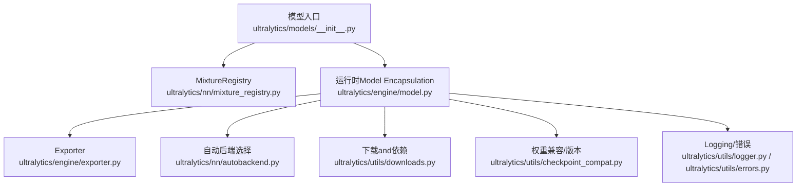
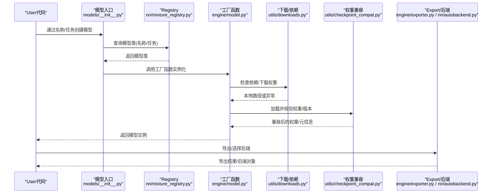
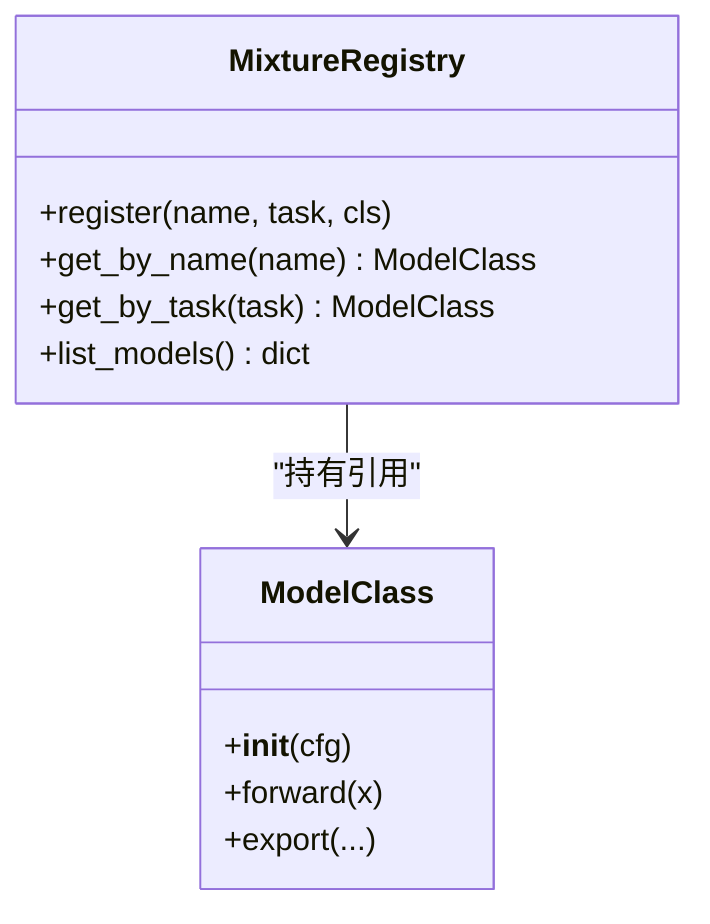
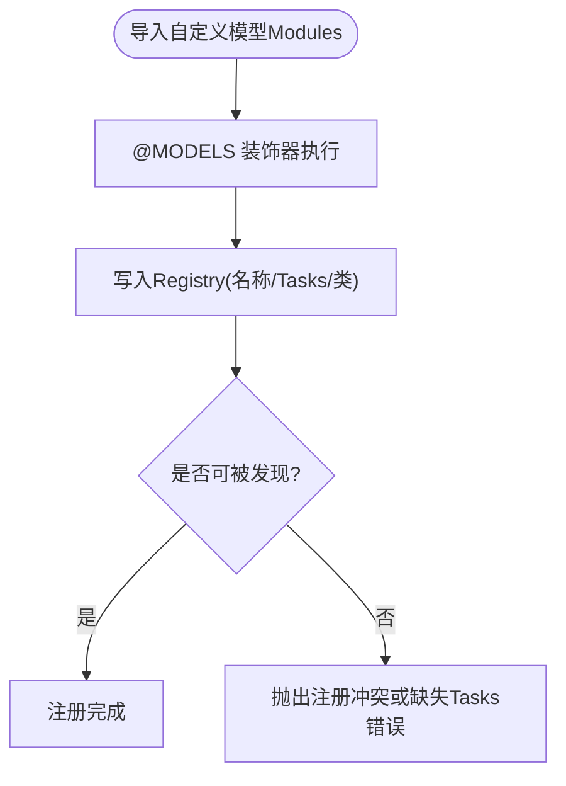
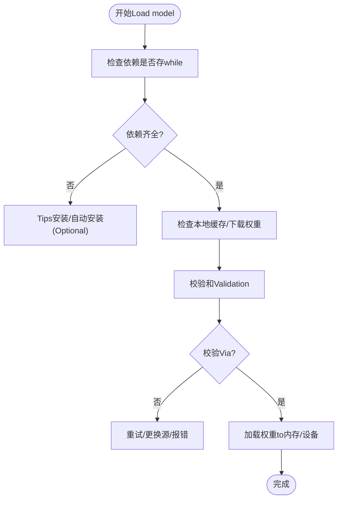
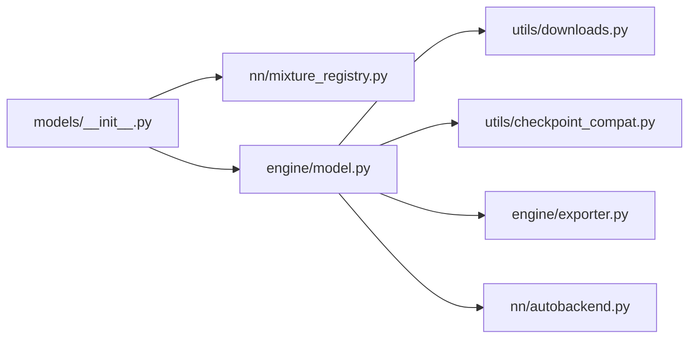

# 模型注册机制API

<cite>
**Files Referenced in This Document**
- [ultralytics/models/__init__.py](file://ultralytics/models/__init__.py)
- [ultralytics/nn/mixture_registry.py](file://ultralytics/nn/mixture_registry.py)
- [tests/test_mixture_model_registry.py](file://tests/test_mixture_model_registry.py)
- [ultralytics/utils/downloads.py](file://ultralytics/utils/downloads.py)
- [ultralytics/utils/checkpoint_compat.py](file://ultralytics/utils/checkpoint_compat.py)
- [ultralytics/engine/model.py](file://ultralytics/engine/model.py)
- [ultralytics/engine/exporter.py](file://ultralytics/engine/exporter.py)
- [ultralytics/nn/autobackend.py](file://ultralytics/nn/autobackend.py)
- [ultralytics/utils/logger.py](file://ultralytics/utils/logger.py)
- [ultralytics/utils/errors.py](file://ultralytics/utils/errors.py)
</cite>

## Table of Contents
1. [Introduction](#Introduction)
2. [Project Structure](#Project Structure)
3. [Core Components](#Core Components)
4. [Architecture Overview](#Architecture Overview)
5. [Detailed Component Analysis](#Detailed Component Analysis)
6. [Dependency Analysis](#Dependency Analysis)
7. [Performance Considerations](#Performance Considerations)
8. [Troubleshooting Guide](#Troubleshooting Guide)
9. [Conclusion](#Conclusion)
10. [Appendix](#Appendix)

## Introduction
本文件targeting“模型注册机制API”，系统性说明模型类的注册and发现、装饰器Uses方式、自定义模型的注册流程and命名规范、配置文件解析and校验、工厂函数接口、版本管理and兼容性检查、依赖检查and自动下载、缓存策略and内存管理，Centered onand调试and诊断工具接口。DocumentationCentered on代码级implementingfor依据，辅Centered onVisualization图示，帮助读者快速理解并扩展模型注册体系。

## Project Structure
围绕模型注册and发现的核心路径位于Centered on下Modules：
- 模型入口and统一装配：ultralytics/models/__init__.py
- Mixture专家（Mixture）Registry：ultralytics/nn/mixture_registry.py
- 运行时Model Encapsulationand加载：ultralytics/engine/model.py
- Exportand后端选择：ultralytics/engine/exporter.py、ultralytics/nn/autobackend.py
- 下载and依赖：ultralytics/utils/downloads.py
- 权重兼容and版本：ultralytics/utils/checkpoint_compat.py
- Loggingand错误：ultralytics/utils/logger.py、ultralytics/utils/errors.py
- 测试用例：tests/test_mixture_model_registry.py

Figure Source
- [ultralytics/models/__init__.py](file://ultralytics/models/__init__.py)
- [ultralytics/nn/mixture_registry.py](file://ultralytics/nn/mixture_registry.py)
- [ultralytics/engine/model.py](file://ultralytics/engine/model.py)
- [ultralytics/engine/exporter.py](file://ultralytics/engine/exporter.py)
- [ultralytics/nn/autobackend.py](file://ultralytics/nn/autobackend.py)
- [ultralytics/utils/downloads.py](file://ultralytics/utils/downloads.py)
- [ultralytics/utils/checkpoint_compat.py](file://ultralytics/utils/checkpoint_compat.py)
- [ultralytics/utils/logger.py](file://ultralytics/utils/logger.py)
- [ultralytics/utils/errors.py](file://ultralytics/utils/errors.py)

Section Source
- [ultralytics/models/__init__.py](file://ultralytics/models/__init__.py)
- [ultralytics/nn/mixture_registry.py](file://ultralytics/nn/mixture_registry.py)
- [ultralytics/engine/model.py](file://ultralytics/engine/model.py)
- [ultralytics/engine/exporter.py](file://ultralytics/engine/exporter.py)
- [ultralytics/nn/autobackend.py](file://ultralytics/nn/autobackend.py)
- [ultralytics/utils/downloads.py](file://ultralytics/utils/downloads.py)
- [ultralytics/utils/checkpoint_compat.py](file://ultralytics/utils/checkpoint_compat.py)
- [ultralytics/utils/logger.py](file://ultralytics/utils/logger.py)
- [ultralytics/utils/errors.py](file://ultralytics/utils/errors.py)

## Core Components
- 模型Registry（MixtureRegistry）
  - 负责维护Tasksto模型类映射、别名and元数据，provides按名称或Tasks查找模型类的capabilities。
  - Supporting装饰器式注册，便于while导入时完成自动发现。
- 模型入口装配器
  - 统一对外暴露的模型创建入口，内部根据配置或名称解析to具体模型类，并Calls工厂方法实例化。
- 运行时Model Encapsulation（Model）
  - 负责权重加载、设备放置、Inference/Training/Validation生命周期、Exportand后端选择、依赖检查and下载、缓存and内存管理。
- 权重兼容and版本管理
  - provides权重格式探测、向后兼容转换、版本约束检查etc.capabilities。
- 下载and依赖
  - provides远程资源下载、断点续传、校验和校验、失败重试etc.。
- Loggingand错误
  - 统一的Logging输出and异常类型定义，贯穿注册、加载、Export全流程。

Section Source
- [ultralytics/nn/mixture_registry.py](file://ultralytics/nn/mixture_registry.py)
- [ultralytics/models/__init__.py](file://ultralytics/models/__init__.py)
- [ultralytics/engine/model.py](file://ultralytics/engine/model.py)
- [ultralytics/utils/checkpoint_compat.py](file://ultralytics/utils/checkpoint_compat.py)
- [ultralytics/utils/downloads.py](file://ultralytics/utils/downloads.py)
- [ultralytics/utils/logger.py](file://ultralytics/utils/logger.py)
- [ultralytics/utils/errors.py](file://ultralytics/utils/errors.py)

## Architecture Overview
下图展示了从UserCallsto模型实例化的关键路径，包括注册、发现、工厂创建、依赖检查and下载、权重加载and兼容处理、Centered onandExportand后端选择。

Figure Source
- [ultralytics/models/__init__.py](file://ultralytics/models/__init__.py)
- [ultralytics/nn/mixture_registry.py](file://ultralytics/nn/mixture_registry.py)
- [ultralytics/engine/model.py](file://ultralytics/engine/model.py)
- [ultralytics/utils/downloads.py](file://ultralytics/utils/downloads.py)
- [ultralytics/utils/checkpoint_compat.py](file://ultralytics/utils/checkpoint_compat.py)
- [ultralytics/engine/exporter.py](file://ultralytics/engine/exporter.py)
- [ultralytics/nn/autobackend.py](file://ultralytics/nn/autobackend.py)

## Detailed Component Analysis

### 模型Registry（MixtureRegistry）
- 职责
  - 维护“Tasks→模型类”、“名称→模型类”的双向映射。
  - provides按名称或Tasks查找模型类的方法。
  - Supporting装饰器式注册，使模型类while导入时自动加入Registry。
- 关键接口（概念性描述）
  - 注册：将模型类and其Tasks/别名绑定。
  - 查找：根据名称或Tasks获取模型类。
  - 列表：列出已注册的模型名andTasks。
- 设计要点
  - 线程安全：Registry应while多进程/多线程环境下安全访问。
  - 幂etc.：重复注册同一名称应覆盖或报错，需明确策略。
  - 可扩展：Supporting动态插件式扩展，无需修改核心逻辑。

Figure Source
- [ultralytics/nn/mixture_registry.py](file://ultralytics/nn/mixture_registry.py)

Section Source
- [ultralytics/nn/mixture_registry.py](file://ultralytics/nn/mixture_registry.py)
- [tests/test_mixture_model_registry.py](file://tests/test_mixture_model_registry.py)

### @MODELS 装饰器and模型发现
- 作用
  - while模型类定义处Via装饰器声明其Tasksand别名，自动完成注册。
- Uses方法
  - while自定义模型类上应用装饰器，指定Tasks标识andOptional别名。
  - 确保包含该类的Modules被导入，Centered on便装饰器生效。
- 命名规范
  - 名称建议采用小写短横线风格，避免特殊字符。
  - Tasks标识应and系统Built-inTasks一致，保证可被发现。
- 发现机制
  - Modules导入即触发装饰器执行，将模型类写入Registry。
  - 可ViaRegistry枚举所有已注册模型，用于UI展示或CLI命令补全。

Figure Source
- [ultralytics/nn/mixture_registry.py](file://ultralytics/nn/mixture_registry.py)

Section Source
- [ultralytics/nn/mixture_registry.py](file://ultralytics/nn/mixture_registry.py)
- [tests/test_mixture_model_registry.py](file://tests/test_mixture_model_registry.py)

### 自定义模型注册流程and命名规范
- 注册流程
  - 定义模型类，implementing必要接口（初始化、前向、Exportetc.）。
  - Uses装饰器声明Tasksand别名。
  - 确保Modules被导入，完成自动注册。
- 命名规范
  - 名称唯一且稳定，避免andBuilt-in模型冲突。
  - Tasks标识遵循系统约定，便于路由and分发。
- 最佳实践
  - while包初始化中显式导入自定义模型Modules，保证装饰器执行。
  - for模型provides清晰的元数据（作者、版本、适用Tasks），便于治理and审计。

Section Source
- [ultralytics/nn/mixture_registry.py](file://ultralytics/nn/mixture_registry.py)
- [tests/test_mixture_model_registry.py](file://tests/test_mixture_model_registry.py)

### 模型配置文件解析andValidation
- 解析过程
  - 读取YAML/字典配置，合并默认配置andUser覆盖项。
  - 对关键字段进行类型and范围校验，缺失必填字段时报错。
- Validation规则
  - Tasks一致性：配置中的Tasks必须and模型类声明的Tasks匹配。
  - 输入维度：图像尺寸、通道数etc.需满足模型要求。
  - Export选项：目标格式、Optimization级别etc.需受控。
- 错误处理
  - 对非法配置抛出结构化错误，附带修复建议。

Section Source
- [ultralytics/engine/model.py](file://ultralytics/engine/model.py)
- [ultralytics/utils/errors.py](file://ultralytics/utils/errors.py)

### 模型工厂函数接口
- 职责
  - 根据名称或Tasks解析模型类，构建实例，并执行必要的初始化（设备、权重、后端）。
- 主要参数（概念性）
  - 名称/Tasks：定位模型类。
  - 配置：模型超参andTasks设置。
  - 权重路径：Pre-trained Weights或微调权重。
  - 设备：CPU/GPU/其他后端。
  - Export/后端：是否立即Export或选择最优后端。
- 返回值
  - 返回已初始化的模型实例，可直接用于Inference/Training/Validation/Export。

Section Source
- [ultralytics/engine/model.py](file://ultralytics/engine/model.py)
- [ultralytics/models/__init__.py](file://ultralytics/models/__init__.py)

### 版本管理and兼容性检查
- 版本信息
  - 模型权重and配置中包含版本元数据，用于前后兼容判断。
- 兼容性检查
  - 检测权重格式变更、字段缺失/新增、数值精度变化etc.。
  - 必要时执行自动Migration或TipsUser更新。
- 回退策略
  - 当检测to不兼容时，尝试降级或给出明确的升级指引。

Section Source
- [ultralytics/utils/checkpoint_compat.py](file://ultralytics/utils/checkpoint_compat.py)
- [ultralytics/engine/model.py](file://ultralytics/engine/model.py)

### 依赖检查and自动下载
- 依赖检查
  - 启动时扫描所需External Dependencies（such as特定后端库、量化引擎）。
  - 若缺失则记录警告或阻止运行，视策略而定。
- 自动下载
  - 根据模型ID或URL拉取权重and配置文件。
  - Supporting校验和Validation、断点续传、失败重试and超时控制。
- 缓存位置
  - 下载内容持久化至本地缓存Table of Contents，避免重复下载。

Figure Source
- [ultralytics/utils/downloads.py](file://ultralytics/utils/downloads.py)
- [ultralytics/engine/model.py](file://ultralytics/engine/model.py)

Section Source
- [ultralytics/utils/downloads.py](file://ultralytics/utils/downloads.py)
- [ultralytics/engine/model.py](file://ultralytics/engine/model.py)

### 缓存策略and内存管理
- 缓存策略
  - 模型类andRegistry：进程内常驻，避免重复解析。
  - 权重文件：磁盘缓存，按哈希去重。
  - 后端对象：按需创建and复用，减少初始化开销。
- 内存管理
  - 显式释放：provides卸载接口，清理GPU/CPU缓存。
  - 惰性加载：仅while首次Uses时加载权重。
  - Batch Inference：共享中间张量缓冲区，降低分配频率。

Section Source
- [ultralytics/engine/model.py](file://ultralytics/engine/model.py)
- [ultralytics/nn/autobackend.py](file://ultralytics/nn/autobackend.py)

### 调试and诊断工具接口
- Logging
  - 统一Logging输出，Supporting分级and格式化，便于追踪注册、加载、Export流程。
- 诊断
  - 打印模型图、节点统计、后端选择原因。
  - Export前自检：检查输入形状、数据类型、算子Supporting。
- 错误上报
  - 结构化错误信息，包含上下文and修复建议。

Section Source
- [ultralytics/utils/logger.py](file://ultralytics/utils/logger.py)
- [ultralytics/utils/errors.py](file://ultralytics/utils/errors.py)
- [ultralytics/engine/exporter.py](file://ultralytics/engine/exporter.py)

## Dependency Analysis
- 组件耦合
  - 模型入口依赖Registryand工厂函数。
  - 工厂函数依赖下载、权重兼容、后端选择。
  - Exporter依赖后端选择and模型实例。
- Potential Cycles
  - Registry不应反向依赖工厂函数，避免循环导入。
- External Dependencies
  - 网络下载、磁盘IO、设备drivers are installedetc.。

Figure Source
- [ultralytics/models/__init__.py](file://ultralytics/models/__init__.py)
- [ultralytics/nn/mixture_registry.py](file://ultralytics/nn/mixture_registry.py)
- [ultralytics/engine/model.py](file://ultralytics/engine/model.py)
- [ultralytics/utils/downloads.py](file://ultralytics/utils/downloads.py)
- [ultralytics/utils/checkpoint_compat.py](file://ultralytics/utils/checkpoint_compat.py)
- [ultralytics/engine/exporter.py](file://ultralytics/engine/exporter.py)
- [ultralytics/nn/autobackend.py](file://ultralytics/nn/autobackend.py)

Section Source
- [ultralytics/models/__init__.py](file://ultralytics/models/__init__.py)
- [ultralytics/nn/mixture_registry.py](file://ultralytics/nn/mixture_registry.py)
- [ultralytics/engine/model.py](file://ultralytics/engine/model.py)
- [ultralytics/utils/downloads.py](file://ultralytics/utils/downloads.py)
- [ultralytics/utils/checkpoint_compat.py](file://ultralytics/utils/checkpoint_compat.py)
- [ultralytics/engine/exporter.py](file://ultralytics/engine/exporter.py)
- [ultralytics/nn/autobackend.py](file://ultralytics/nn/autobackend.py)

## Performance Considerations
- Registry查询应forO(1)哈希查找，避免线性扫描。
- 权重加载采用懒加载and分块读取，降低首启延迟。
- 后端选择基于硬件特征and算子Supporting，避免不必要的转换。
- Export阶段启用并行and批处理，提升吞吐。

[本节for通用指导，不涉and具体文件分析]

## Troubleshooting Guide
- 常见问题
  - 模型未找to：确认名称/Tasks是否正确，Modules是否导入。
  - 权重不兼容：检查版本元数据，执行兼容转换或更新权重。
  - 依赖缺失：安装所需后端库或启用相应功能开关。
  - 下载失败：检查网络、代理、校验和；启用重试and换源。
- 诊断步骤
  - 开启详细Logging，查看注册、加载、Export各阶段输出。
  - Uses诊断接口打印模型图and后端选择原因。
  - 复现最小Examples，隔离问题范围。

Section Source
- [ultralytics/utils/logger.py](file://ultralytics/utils/logger.py)
- [ultralytics/utils/errors.py](file://ultralytics/utils/errors.py)
- [ultralytics/engine/model.py](file://ultralytics/engine/model.py)
- [ultralytics/engine/exporter.py](file://ultralytics/engine/exporter.py)

## Conclusion
本注册机制Via装饰器drivers are installed的自动发现、集中式Registryand工厂函数装配，implementing了模型的高内聚and低耦合。Combined with权重兼容、依赖检查and自动下载、缓存and内存管理、Centered onand完善的Loggingand诊断工具，形成了完整的模型生命周期管理capabilities。建议while扩展新模型时Strictly follow命名andTasks规范，并whileModules初始化中显式导入，Centered on确保注册生效。

[本节for总结，不涉and具体文件分析]

## Appendix
- 术语
  - Tasks：模型所解决的视觉Tasks类别（such as检测、分割、姿态etc.）。
  - 别名：模型名称的替代写法，便于兼容历史用法。
  - 后端：Inference或Export的具体implementing（such asONNXRuntime、TensorRTetc.）。
- Refer to
  - 测试用例可用于ValidationRegistry行forand边界条件。

Section Source
- [tests/test_mixture_model_registry.py](file://tests/test_mixture_model_registry.py)