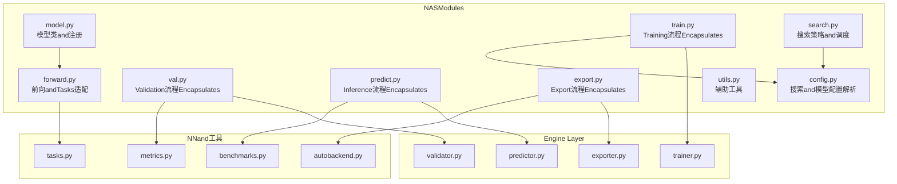
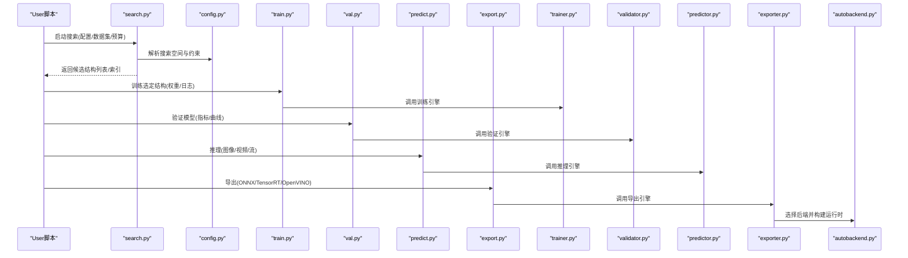
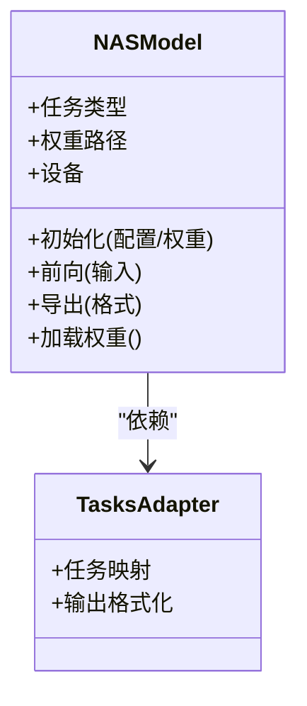
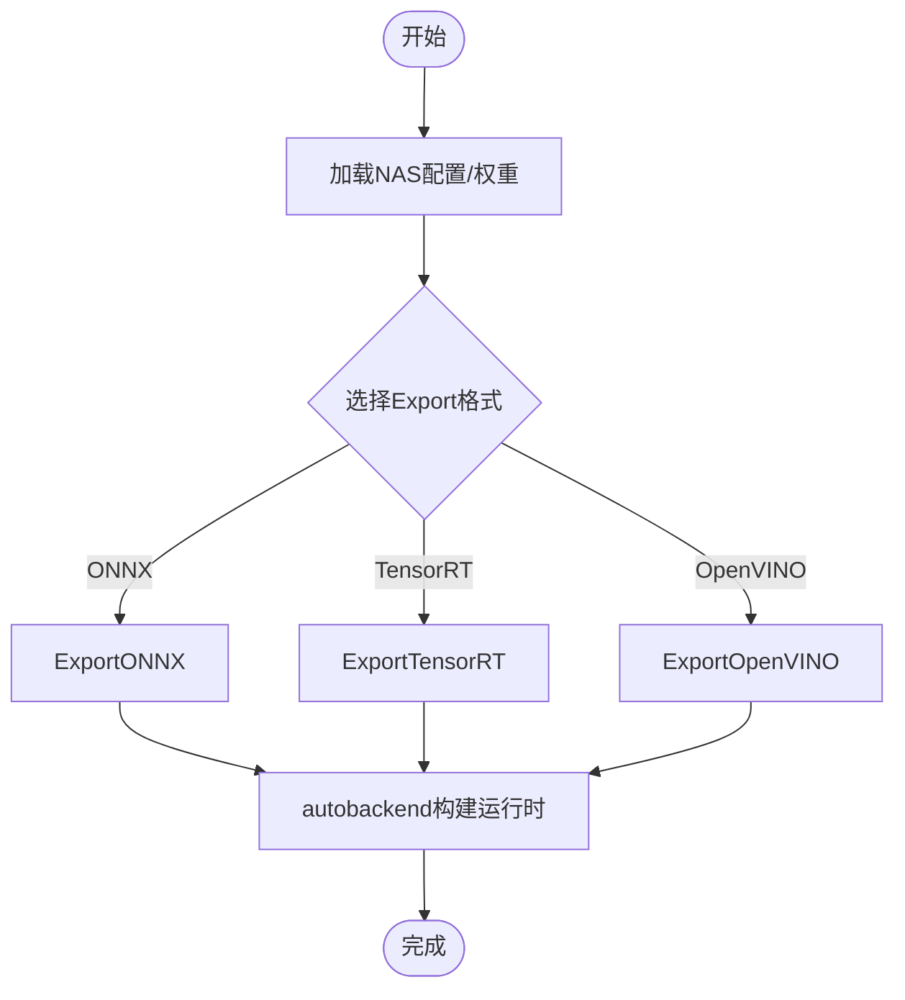
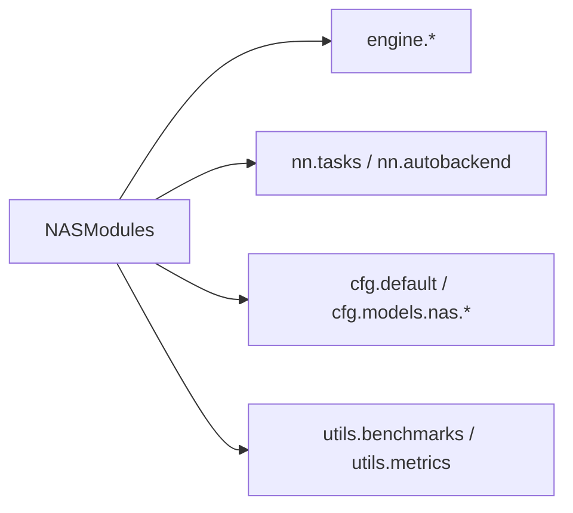

# NASModel API

<cite>
**Files Referenced in This Document**
- [ultralytics/models/nas/__init__.py](file://ultralytics/models/nas/__init__.py)
- [ultralytics/models/nas/model.py](file://ultralytics/models/nas/model.py)
- [ultralytics/models/nas/forward.py](file://ultralytics/models/nas/forward.py)
- [ultralytics/models/nas/export.py](file://ultralytics/models/nas/export.py)
- [ultralytics/models/nas/train.py](file://ultralytics/models/nas/train.py)
- [ultralytics/models/nas/val.py](file://ultralytics/models/nas/val.py)
- [ultralytics/models/nas/predict.py](file://ultralytics/models/nas/predict.py)
- [ultralytics/models/nas/search.py](file://ultralytics/models/nas/search.py)
- [ultralytics/models/nas/config.py](file://ultralytics/models/nas/config.py)
- [ultralytics/models/nas/utils.py](file://ultralytics/models/nas/utils.py)
- [ultralytics/engine/trainer.py](file://ultralytics/engine/trainer.py)
- [ultralytics/engine/validator.py](file://ultralytics/engine/validator.py)
- [ultralytics/engine/predictor.py](file://ultralytics/engine/predictor.py)
- [ultralytics/engine/exporter.py](file://ultralytics/engine/exporter.py)
- [ultralytics/nn/tasks.py](file://ultralytics/nn/tasks.py)
- [ultralytics/nn/autobackend.py](file://ultralytics/nn/autobackend.py)
- [ultralytics/utils/benchmarks.py](file://ultralytics/utils/benchmarks.py)
- [ultralytics/utils/metrics.py](file://ultralytics/utils/metrics.py)
- [ultralytics/cfg/default.yaml](file://ultralytics/cfg/default.yaml)
- [ultralytics/cfg/models/nas/yolo_nas_s.yaml](file://ultralytics/cfg/models/nas/yolo_nas_s.yaml)
- [ultralytics/cfg/models/nas/yolo_nas_m.yaml](file://ultralytics/cfg/models/nas/yolo_nas_m.yaml)
- [ultralytics/cfg/models/nas/yolo_nas_l.yaml](file://ultralytics/cfg/models/nas/yolo_nas_l.yaml)
- [examples/YOLOv8-ONNXRuntime-Python/main.py](file://examples/YOLOv8-ONNXRuntime-Python/main.py)
</cite>

## Table of Contents
1. [Introduction](#Introduction)
2. [Project Structure](#Project Structure)
3. [Core Components](#Core Components)
4. [Architecture Overview](#Architecture Overview)
5. [Detailed Component Analysis](#Detailed Component Analysis)
6. [Dependency Analysis](#Dependency Analysis)
7. [性能考量](#性能考量)
8. [Troubleshooting Guide](#Troubleshooting Guide)
9. [Conclusion](#Conclusion)
10. [Appendix](#Appendix)

## Introduction
本文件targetingNAS（神经架构搜索）模型whileYOLO-Master中的APIandUses方式，聚焦Centered on下目标：
- 解释NAS的基本原理and其whileYOLO-Master中的implementing要点
- 记录NAS模型的Training、Inference、Exportand部署接口
- 说明搜索结果的管理方法and最佳实践
- 对比NASand传统YOLO的差异and优势
- provides性能EvaluationandOptimization建议

## Project Structure
NASModules位于ultralytics/models/nas下，围绕“搜索—Training—Validation—Prediction—Export”的完整链路组织。关键入口包括：
- 模型定义and注册：model.py、__init__.py
- 前向andTasks适配：forward.py、tasks.py
- Training/Validation/Prediction：train.py、val.py、predict.py
- Exportand后端兼容：export.py、autobackend.py
- 搜索策略and配置：search.py、config.py、默认配置andNAS YAML
- 工具and基准：utils.py、benchmarks.py、metrics.py

Figure Source
- [ultralytics/models/nas/model.py](file://ultralytics/models/nas/model.py)
- [ultralytics/models/nas/forward.py](file://ultralytics/models/nas/forward.py)
- [ultralytics/models/nas/train.py](file://ultralytics/models/nas/train.py)
- [ultralytics/models/nas/val.py](file://ultralytics/models/nas/val.py)
- [ultralytics/models/nas/predict.py](file://ultralytics/models/nas/predict.py)
- [ultralytics/models/nas/export.py](file://ultralytics/models/nas/export.py)
- [ultralytics/models/nas/search.py](file://ultralytics/models/nas/search.py)
- [ultralytics/models/nas/config.py](file://ultralytics/models/nas/config.py)
- [ultralytics/models/nas/utils.py](file://ultralytics/models/nas/utils.py)
- [ultralytics/engine/trainer.py](file://ultralytics/engine/trainer.py)
- [ultralytics/engine/validator.py](file://ultralytics/engine/validator.py)
- [ultralytics/engine/predictor.py](file://ultralytics/engine/predictor.py)
- [ultralytics/engine/exporter.py](file://ultralytics/engine/exporter.py)
- [ultralytics/nn/tasks.py](file://ultralytics/nn/tasks.py)
- [ultralytics/nn/autobackend.py](file://ultralytics/nn/autobackend.py)
- [ultralytics/utils/benchmarks.py](file://ultralytics/utils/benchmarks.py)
- [ultralytics/utils/metrics.py](file://ultralytics/utils/metrics.py)

Section Source
- [ultralytics/models/nas/__init__.py](file://ultralytics/models/nas/__init__.py)
- [ultralytics/models/nas/model.py](file://ultralytics/models/nas/model.py)
- [ultralytics/models/nas/forward.py](file://ultralytics/models/nas/forward.py)
- [ultralytics/models/nas/train.py](file://ultralytics/models/nas/train.py)
- [ultralytics/models/nas/val.py](file://ultralytics/models/nas/val.py)
- [ultralytics/models/nas/predict.py](file://ultralytics/models/nas/predict.py)
- [ultralytics/models/nas/export.py](file://ultralytics/models/nas/export.py)
- [ultralytics/models/nas/search.py](file://ultralytics/models/nas/search.py)
- [ultralytics/models/nas/config.py](file://ultralytics/models/nas/config.py)
- [ultralytics/models/nas/utils.py](file://ultralytics/models/nas/utils.py)

## Core Components
- 模型类and注册：负责NAS模型实例化、权重加载、Tasks类型识别andUnified Interface暴露
- 前向andTasks适配：将NAS结构and通用检测/分割and other tasks对齐，输出标准格式
- Training/Validation/Prediction/Export：分别Encapsulates对应生命周期，对接Engine Layertrainer/validator/predictor/exporter
- 搜索策略and配置：管理搜索空间、候选结构、EvaluationMetricsand结果归档
- 工具and基准：provides常用算子、Metrics计算and性能基准capabilities

Section Source
- [ultralytics/models/nas/model.py](file://ultralytics/models/nas/model.py)
- [ultralytics/models/nas/forward.py](file://ultralytics/models/nas/forward.py)
- [ultralytics/models/nas/train.py](file://ultralytics/models/nas/train.py)
- [ultralytics/models/nas/val.py](file://ultralytics/models/nas/val.py)
- [ultralytics/models/nas/predict.py](file://ultralytics/models/nas/predict.py)
- [ultralytics/models/nas/export.py](file://ultralytics/models/nas/export.py)
- [ultralytics/models/nas/search.py](file://ultralytics/models/nas/search.py)
- [ultralytics/models/nas/config.py](file://ultralytics/models/nas/config.py)
- [ultralytics/models/nas/utils.py](file://ultralytics/models/nas/utils.py)

## Architecture Overview
NASwhileYOLO-Master中Via“配置drivers are installed+引擎集成”的方式工作：
- UserViaNAS YAML或默认配置指定搜索空间andTasks
- 搜索阶段生成候选结构并保存for中间权重/配置
- Training/Validation/Prediction/Export复用Engine Layer，保证and常规YOLO一致的Uses体验
- Export后由autobackend自动选择最优后端（such asONNX/TensorRT/OpenVINOetc.）

Figure Source
- [ultralytics/models/nas/search.py](file://ultralytics/models/nas/search.py)
- [ultralytics/models/nas/config.py](file://ultralytics/models/nas/config.py)
- [ultralytics/models/nas/train.py](file://ultralytics/models/nas/train.py)
- [ultralytics/models/nas/val.py](file://ultralytics/models/nas/val.py)
- [ultralytics/models/nas/predict.py](file://ultralytics/models/nas/predict.py)
- [ultralytics/models/nas/export.py](file://ultralytics/models/nas/export.py)
- [ultralytics/engine/trainer.py](file://ultralytics/engine/trainer.py)
- [ultralytics/engine/validator.py](file://ultralytics/engine/validator.py)
- [ultralytics/engine/predictor.py](file://ultralytics/engine/predictor.py)
- [ultralytics/engine/exporter.py](file://ultralytics/engine/exporter.py)
- [ultralytics/nn/autobackend.py](file://ultralytics/nn/autobackend.py)

## Detailed Component Analysis

### 模型类and注册（model.py）
- 职责：providesNAS模型的统一构造接口、权重加载、设备放置、Tasks类型推断
- 关键点：
  - Supporting从YAML或Pre-trained Weights初始化
  - andnn.tasks对齐，确保输出符合YOLO系列规范
  - 暴露and常规YOLO一致的load/predict/val/train方法

Figure Source
- [ultralytics/models/nas/model.py](file://ultralytics/models/nas/model.py)
- [ultralytics/nn/tasks.py](file://ultralytics/nn/tasks.py)

Section Source
- [ultralytics/models/nas/model.py](file://ultralytics/models/nas/model.py)
- [ultralytics/nn/tasks.py](file://ultralytics/nn/tasks.py)

### 前向andTasks适配（forward.py）
- 职责：将NAS内部表示转换for标准检测/分割and other tasks的张量输出
- 关键点：
  - 处理多尺度特征融合and解码
  - andNMS、Post-Processing逻辑解耦，便于不同后端Optimization

Section Source
- [ultralytics/models/nas/forward.py](file://ultralytics/models/nas/forward.py)
- [ultralytics/nn/tasks.py](file://ultralytics/nn/tasks.py)

### Training流程（train.py）
- 职责：EncapsulatesNAS模型的Training过程，对接engine.trainer
- 关键点：
  - Supporting从搜索得to的候选结构继续微调
  - 可Combining默认配置and自定义超参
  - TrainingLoggingandCheckpoint遵循YOLO标准路径

Section Source
- [ultralytics/models/nas/train.py](file://ultralytics/models/nas/train.py)
- [ultralytics/engine/trainer.py](file://ultralytics/engine/trainer.py)
- [ultralytics/cfg/default.yaml](file://ultralytics/cfg/default.yaml)

### Validation流程（val.py）
- 职责：执行Validation，计算mAP、精度、召回etc.Metrics
- 关键点：
  - andengine.validator对接
  - 输出andVisualization遵循YOLO标准

Section Source
- [ultralytics/models/nas/val.py](file://ultralytics/models/nas/val.py)
- [ultralytics/engine/validator.py](file://ultralytics/engine/validator.py)
- [ultralytics/utils/metrics.py](file://ultralytics/utils/metrics.py)

### Inference流程（predict.py）
- 职责：provides端to端Inference接口，Supporting图像/视频/流
- 关键点：
  - andengine.predictor对接
  - Automatic Device Selectionand批处理
  - OptionalPost-ProcessingandVisualization

Section Source
- [ultralytics/models/nas/predict.py](file://ultralytics/models/nas/predict.py)
- [ultralytics/engine/predictor.py](file://ultralytics/engine/predictor.py)
- [ultralytics/utils/benchmarks.py](file://ultralytics/utils/benchmarks.py)

### Export流程（export.py）
- 职责：将NASModel ExportforONNX/TensorRT/OpenVINOetc.格式
- 关键点：
  - andengine.exporter对接
  - 自动选择最优后端（autobackend）
  - Supporting动态形状and静态形状Export

Figure Source
- [ultralytics/models/nas/export.py](file://ultralytics/models/nas/export.py)
- [ultralytics/engine/exporter.py](file://ultralytics/engine/exporter.py)
- [ultralytics/nn/autobackend.py](file://ultralytics/nn/autobackend.py)

Section Source
- [ultralytics/models/nas/export.py](file://ultralytics/models/nas/export.py)
- [ultralytics/engine/exporter.py](file://ultralytics/engine/exporter.py)
- [ultralytics/nn/autobackend.py](file://ultralytics/nn/autobackend.py)

### 搜索策略and配置（search.py, config.py）
- 职责：定义搜索空间、EvaluationMetrics、预算控制and结果归档
- 关键点：
  - Supporting基于性能的早期停止and剪枝
  - 结果Centered on结构化形式保存，便于后续比较and复现
  - and default configurations和NAS YAML联动

Section Source
- [ultralytics/models/nas/search.py](file://ultralytics/models/nas/search.py)
- [ultralytics/models/nas/config.py](file://ultralytics/models/nas/config.py)

### 工具and基准（utils.py, benchmarks.py, metrics.py）
- 职责：provides常用工具函数、性能基准andMetrics计算
- 关键点：
  - 统一的Metrics口径，便于跨模型比较
  - 基准测试覆盖延迟、吞吐and资源占用

Section Source
- [ultralytics/models/nas/utils.py](file://ultralytics/models/nas/utils.py)
- [ultralytics/utils/benchmarks.py](file://ultralytics/utils/benchmarks.py)
- [ultralytics/utils/metrics.py](file://ultralytics/utils/metrics.py)

## Dependency Analysis
NASModules对Engine LayerandNN层的依赖清晰且单向，避免循环依赖：
- NASModules依赖engine（trainer/validator/predictor/exporter）
- forwardandtasks耦合紧密，但Via接口隔离
- exportandautobackend协作，形成稳定的Export链路

Figure Source
- [ultralytics/models/nas/model.py](file://ultralytics/models/nas/model.py)
- [ultralytics/models/nas/forward.py](file://ultralytics/models/nas/forward.py)
- [ultralytics/models/nas/export.py](file://ultralytics/models/nas/export.py)
- [ultralytics/engine/trainer.py](file://ultralytics/engine/trainer.py)
- [ultralytics/engine/validator.py](file://ultralytics/engine/validator.py)
- [ultralytics/engine/predictor.py](file://ultralytics/engine/predictor.py)
- [ultralytics/engine/exporter.py](file://ultralytics/engine/exporter.py)
- [ultralytics/nn/tasks.py](file://ultralytics/nn/tasks.py)
- [ultralytics/nn/autobackend.py](file://ultralytics/nn/autobackend.py)
- [ultralytics/cfg/default.yaml](file://ultralytics/cfg/default.yaml)
- [ultralytics/cfg/models/nas/yolo_nas_s.yaml](file://ultralytics/cfg/models/nas/yolo_nas_s.yaml)
- [ultralytics/cfg/models/nas/yolo_nas_m.yaml](file://ultralytics/cfg/models/nas/yolo_nas_m.yaml)
- [ultralytics/cfg/models/nas/yolo_nas_l.yaml](file://ultralytics/cfg/models/nas/yolo_nas_l.yaml)
- [ultralytics/utils/benchmarks.py](file://ultralytics/utils/benchmarks.py)
- [ultralytics/utils/metrics.py](file://ultralytics/utils/metrics.py)

Section Source
- [ultralytics/models/nas/model.py](file://ultralytics/models/nas/model.py)
- [ultralytics/models/nas/forward.py](file://ultralytics/models/nas/forward.py)
- [ultralytics/models/nas/export.py](file://ultralytics/models/nas/export.py)
- [ultralytics/engine/trainer.py](file://ultralytics/engine/trainer.py)
- [ultralytics/engine/validator.py](file://ultralytics/engine/validator.py)
- [ultralytics/engine/predictor.py](file://ultralytics/engine/predictor.py)
- [ultralytics/engine/exporter.py](file://ultralytics/engine/exporter.py)
- [ultralytics/nn/tasks.py](file://ultralytics/nn/tasks.py)
- [ultralytics/nn/autobackend.py](file://ultralytics/nn/autobackend.py)
- [ultralytics/cfg/default.yaml](file://ultralytics/cfg/default.yaml)
- [ultralytics/cfg/models/nas/yolo_nas_s.yaml](file://ultralytics/cfg/models/nas/yolo_nas_s.yaml)
- [ultralytics/cfg/models/nas/yolo_nas_m.yaml](file://ultralytics/cfg/models/nas/yolo_nas_m.yaml)
- [ultralytics/cfg/models/nas/yolo_nas_l.yaml](file://ultralytics/cfg/models/nas/yolo_nas_l.yaml)
- [ultralytics/utils/benchmarks.py](file://ultralytics/utils/benchmarks.py)
- [ultralytics/utils/metrics.py](file://ultralytics/utils/metrics.py)

## 性能考量
- Export Backends选择：Preferautobackend自动选择最优后端，减少手动调优成本
- 动态/静态形状：根据部署场景选择合适的Export模式，平衡灵活性and性能
- Metrics口径：统一Usesmetricsandbenchmarks，确保可比性
- 资源监控：关注GPU/CPU内存占用and显存峰值，必要时调整batch sizeand输入分辨率

[This section provides general guidance and does not directly analyze specific files]

## Troubleshooting Guide
- 权重加载失败：确认权重路径andTasks类型匹配；检查NAS YAMLand default configurations一致性
- Export报错：核对Export格式and后端版本兼容性；查看autobackendLogging定位问题
- Inference异常：检查输入尺寸and动态范围；确认NMSandPost-Processing参数设置
- Training不稳定：调整Learning RateandData Augmentation；观察损失曲线andGradient范数

Section Source
- [ultralytics/models/nas/model.py](file://ultralytics/models/nas/model.py)
- [ultralytics/models/nas/export.py](file://ultralytics/models/nas/export.py)
- [ultralytics/nn/autobackend.py](file://ultralytics/nn/autobackend.py)
- [ultralytics/engine/trainer.py](file://ultralytics/engine/trainer.py)
- [ultralytics/engine/predictor.py](file://ultralytics/engine/predictor.py)

## Conclusion
NASwhileYOLO-Master中Centered on“配置drivers are installed+引擎集成”的方式无缝融入现有工作流。through a unifiedTraining/Validation/Prediction/Export接口，User可Centered on快速完成从搜索to部署的全流程。推荐Preferautobackendand标准Metrics体系，Centered on获得稳定且可复现的性能表现。

[This section is summary content and does not directly analyze specific files]

## Appendix

### NAS基本原理andwhileYOLO-Master中的implementing要点
- 搜索空间：包含Backbone Network宽度、深度、分支结构、融合方式etc.维度
- EvaluationMetrics：Centered onValidation集mAPfor核心，辅Centered on延迟and资源占用
- 结果管理：按结构索引保存权重and配置，便于回溯and对比
- andYOLO集成：Viatasksandengine层保持接口一致，降低Migration成本

[本节for概念性内容，不直接分析具体文件]

### Uses指南（TrainingandInference）
- Training：
  - 准备数据集andNAS YAML配置
  - 运行Training流程，产出权重andLogging
  - Refer toExamples脚本了解命令行and参数
- Inference：
  - 加载权重and配置
  - CallsInference接口进行图像/视频/流处理
  - Refer toExamples脚本了解基本用法

Section Source
- [ultralytics/models/nas/train.py](file://ultralytics/models/nas/train.py)
- [ultralytics/models/nas/predict.py](file://ultralytics/models/nas/predict.py)
- [examples/YOLOv8-ONNXRuntime-Python/main.py](file://examples/YOLOv8-ONNXRuntime-Python/main.py)

### 搜索结果管理and部署
- 结果归档：按结构ID/索引组织权重and配置，附带ValidationMetricsand元数据
- 部署流程：Exporting toONNX/TensorRT/OpenVINO，Usesautobackend构建运行时
- 版本管理：保留历史版本and对比报告，便于回滚and审计

Section Source
- [ultralytics/models/nas/search.py](file://ultralytics/models/nas/search.py)
- [ultralytics/models/nas/export.py](file://ultralytics/models/nas/export.py)
- [ultralytics/nn/autobackend.py](file://ultralytics/nn/autobackend.py)

### NASand传统YOLO的差异and优势
- 差异：
  - NAS强调结构搜索and自动化设计，传统YOLO侧重固定结构的工程Optimization
  - NAS需要额外的搜索andEvaluation阶段，传统YOLO可直接Trainingand部署
- 优势：
  - 针对特定Tasks/数据分布可能获得更优的结构
  - while精度and效率之间provides更灵活的权衡

[本节for概念性内容，不直接分析具体文件]

### 性能EvaluationandOptimization建议
- Evaluation：
  - Uses统一Metrics体系（mAP、延迟、吞吐）
  - while不同硬件上重复测试，确保稳定性
- Optimization：
  - 调整Export模式（动态/静态形状）
  - 利用autobackend选择最优后端
  - CombiningData Augmentationand正则化提升泛化

Section Source
- [ultralytics/utils/benchmarks.py](file://ultralytics/utils/benchmarks.py)
- [ultralytics/utils/metrics.py](file://ultralytics/utils/metrics.py)
- [ultralytics/nn/autobackend.py](file://ultralytics/nn/autobackend.py)