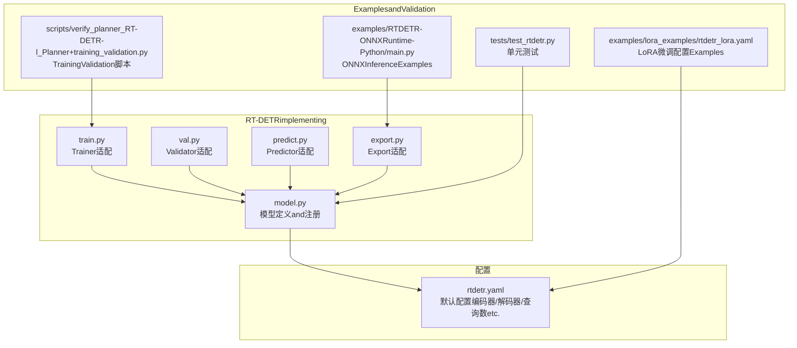
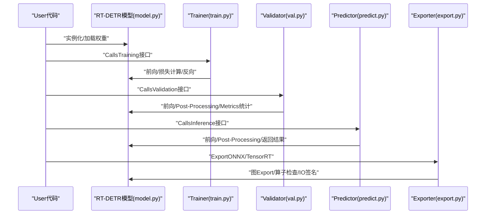
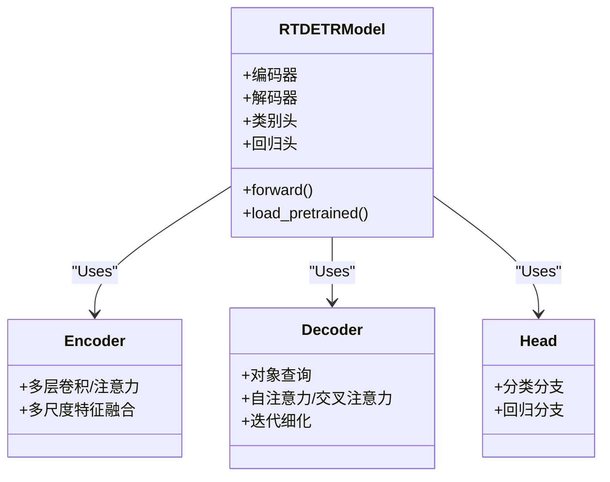
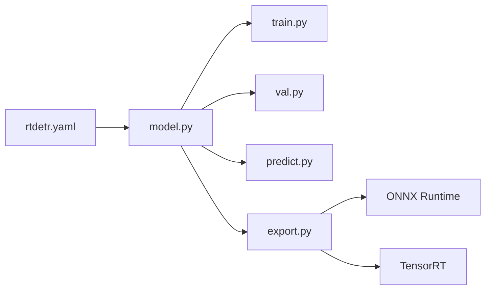

# RT-DETRModel API

<cite>
**Files Referenced in This Document**
- [ultralytics/models/rtdetr/model.py](file://ultralytics/models/rtdetr/model.py)
- [ultralytics/models/rtdetr/train.py](file://ultralytics/models/rtdetr/train.py)
- [ultralytics/models/rtdetr/val.py](file://ultralytics/models/rtdetr/val.py)
- [ultralytics/models/rtdetr/predict.py](file://ultralytics/models/rtdetr/predict.py)
- [ultralytics/models/rtdetr/export.py](file://ultralytics/models/rtdetr/export.py)
- [ultralytics/cfg/models/rtdetr/rtdetr.yaml](file://ultralytics/cfg/models/rtdetr/rtdetr.yaml)
- [examples/RTDETR-ONNXRuntime-Python/main.py](file://examples/RTDETR-ONNXRuntime-Python/main.py)
- [examples/lora_examples/rtdetr_lora.yaml](file://examples/lora_examples/rtdetr_lora.yaml)
- [scripts/verify_planner_RT-DETR-l_Planner+training_validation.py](file://scripts/verify_planner_RT-DETR-l_Planner+training_validation.py)
- [tests/test_rtdetr.py](file://tests/test_rtdetr.py)
</cite>

## Table of Contents
1. [Introduction](#Introduction)
2. [Project Structure](#Project Structure)
3. [Core Components](#Core Components)
4. [Architecture Overview](#Architecture Overview)
5. [Detailed Component Analysis](#Detailed Component Analysis)
6. [Dependency Analysis](#Dependency Analysis)
7. [性能考量](#性能考量)
8. [Troubleshooting Guide](#Troubleshooting Guide)
9. [Conclusion](#Conclusion)
10. [Appendix](#Appendix)

## Introduction
本文件targetingUsesand扩展RT-DETR（基于Transformer的Object Detection）的开发者，provides从模型构造、Training、InferencetoExport的完整APIDocumentation。内容涵盖：
- TransformerObject Detection原理and配置要点（编码器、解码器、查询数量etc.）
- Pre-trained Weights加载andUses
- while不同数据集上的Training流程and超参数调优建议
- andYOLO Series Models的差异and选择指南
- Export至ONNX、TensorRTetc.格式的接口说明
- 性能基准测试and对比分析方法

## Project Structure
RT-DETRwhile仓库中的implementing位于ultralytics/models/rtdetrTable of Contents，配套配置文件位于ultralytics/cfg/models/rtdetr。ExamplesandValidation脚本分别位于examples和scripts/testsTable of Contents。

Figure Source
- [ultralytics/models/rtdetr/model.py](file://ultralytics/models/rtdetr/model.py)
- [ultralytics/models/rtdetr/train.py](file://ultralytics/models/rtdetr/train.py)
- [ultralytics/models/rtdetr/val.py](file://ultralytics/models/rtdetr/val.py)
- [ultralytics/models/rtdetr/predict.py](file://ultralytics/models/rtdetr/predict.py)
- [ultralytics/models/rtdetr/export.py](file://ultralytics/models/rtdetr/export.py)
- [ultralytics/cfg/models/rtdetr/rtdetr.yaml](file://ultralytics/cfg/models/rtdetr/rtdetr.yaml)
- [examples/RTDETR-ONNXRuntime-Python/main.py](file://examples/RTDETR-ONNXRuntime-Python/main.py)
- [examples/lora_examples/rtdetr_lora.yaml](file://examples/lora_examples/rtdetr_lora.yaml)
- [scripts/verify_planner_RT-DETR-l_Planner+training_validation.py](file://scripts/verify_planner_RT-DETR-l_Planner+training_validation.py)
- [tests/test_rtdetr.py](file://tests/test_rtdetr.py)

Section Source
- [ultralytics/models/rtdetr/model.py](file://ultralytics/models/rtdetr/model.py)
- [ultralytics/cfg/models/rtdetr/rtdetr.yaml](file://ultralytics/cfg/models/rtdetr/rtdetr.yaml)

## Core Components
- 模型定义and注册：负责构建RT-DETR网络、初始化编码器/解码器、设置类别数and查询数量etc.关键参数。
- Trainer适配：将RT-DETR接入统一Training框架，SupportingData Loading、损失计算、Optimizerand调度器、EMAetc.。
- Validator适配：providesmAPetc.MetricsEvaluation、阈值扫描、NMSPost-ProcessingandVisualization输出。
- Predictor适配：EncapsulatesPrediction流程，包括预处理、前向传播、Post-Processingand结果解析。
- Export适配：对接Export管线，生成ONNX/TensorRTetc.格式并校验输入输出契约。

Section Source
- [ultralytics/models/rtdetr/model.py](file://ultralytics/models/rtdetr/model.py)
- [ultralytics/models/rtdetr/train.py](file://ultralytics/models/rtdetr/train.py)
- [ultralytics/models/rtdetr/val.py](file://ultralytics/models/rtdetr/val.py)
- [ultralytics/models/rtdetr/predict.py](file://ultralytics/models/rtdetr/predict.py)
- [ultralytics/models/rtdetr/export.py](file://ultralytics/models/rtdetr/export.py)

## Architecture Overview
RT-DETR采用“编码器-解码器”的Transformer架构进行端to端Object Detection。编码器对图像特征进行多尺度编码；解码器Via可学习的对象查询and自注意力/交叉Attention Mechanism迭代细化候选框and类别概率，最终经去重and阈值筛选得to检测结果。

Figure Source
- [ultralytics/models/rtdetr/model.py](file://ultralytics/models/rtdetr/model.py)
- [ultralytics/models/rtdetr/train.py](file://ultralytics/models/rtdetr/train.py)
- [ultralytics/models/rtdetr/val.py](file://ultralytics/models/rtdetr/val.py)
- [ultralytics/models/rtdetr/predict.py](file://ultralytics/models/rtdetr/predict.py)
- [ultralytics/models/rtdetr/export.py](file://ultralytics/models/rtdetr/export.py)

## Detailed Component Analysis

### 模型构造and配置（model.py + rtdetr.yaml）
- 关键配置项（来自配置文件）：
  - 编码器/解码器层数、隐藏维度、注意力头数
  - 对象查询数量（影响候选框上限and计算量）
  - 类别数、分类and回归分支结构
  - 位置编码、归一化策略、激活函数
- 构造流程：
  - 读取配置并实例化编码器/解码器
  - 初始化类别头and边界框回归头
  - Optional：加载Pre-trained Weights或冻结部分Modules
- 复杂度and容量：
  - 查询数量线性影响解码器计算and显存占用
  - 编码器深度and通道数决定特征表达capabilitiesand速度权衡

Section Source
- [ultralytics/models/rtdetr/model.py](file://ultralytics/models/rtdetr/model.py)
- [ultralytics/cfg/models/rtdetr/rtdetr.yaml](file://ultralytics/cfg/models/rtdetr/rtdetr.yaml)

#### 类关系图（概念映射）

Figure Source
- [ultralytics/models/rtdetr/model.py](file://ultralytics/models/rtdetr/model.py)

### Training接口（train.py）
- Training入口：
  - 接收数据集路径、Batch Size、Learning Rate、轮次etc.参数
  - 自动构建Data Pipeline、Loss Function、OptimizerandLearning Rate调度器
- Training循环：
  - 前向计算、损失分解（分类/回归/匹配）、Backpropagation
  - EMA权重更新、Logging、Checkpoint保存
- 分布式andMixture精度：
  - SupportingDDP/AMPetc.加速特性（由上层引擎注入）

Section Source
- [ultralytics/models/rtdetr/train.py](file://ultralytics/models/rtdetr/train.py)

### Validation接口（val.py）
- Validation流程：
  - Batch Inference、NMSPost-Processing、Confidence Threshold扫描
  - 计算mAP、precision、recalletc.Metrics
- 输出：
  - Metrics汇总、混淆矩阵、PR曲线、Visualization结果

Section Source
- [ultralytics/models/rtdetr/val.py](file://ultralytics/models/rtdetr/val.py)

### Inference接口（predict.py）
- Inference流程：
  - Image Preprocessing（缩放、归一化）
  - 模型前向、解码器输出解析、NMS过滤
  - 返回边界框、类别、置信度andOptional掩码/关键点
- 集成方式：
  - 可直接CallsPrediction方法或while服务中EncapsulatesforREST/gRPC接口

Section Source
- [ultralytics/models/rtdetr/predict.py](file://ultralytics/models/rtdetr/predict.py)

### Export接口（export.py）
- Supporting的Export格式：
  - ONNX（静态/动态形状）
  - TensorRT（FP16/INT8校准）
  - 其他后端（such asOpenVINO/TFLite，视平台capabilities）
- Export步骤：
  - 图追踪/符号执行、算子兼容性检查
  - 生成模型文件and输入输出签名
  - Optional：量化andOptimization选项

Section Source
- [ultralytics/models/rtdetr/export.py](file://ultralytics/models/rtdetr/export.py)

### Pre-trained Weights加载andUses
- 加载方式：
  - Via模型构造函数传入权重路径或名称
  - Supporting部分权重加载and冻结策略
- Uses建议：
  - 小数据集优先微调高层Modules
  - 大Tasks可全参微调并CombiningData Augmentation

Section Source
- [ultralytics/models/rtdetr/model.py](file://ultralytics/models/rtdetr/model.py)

### LoRA微调Examples（rtdetr_lora.yaml）
- 用途：
  - 针对特定领域数据快速适配，降低全参微调成本
- 关键设置：
  - LoRA秩、目标Modules选择、Learning Rateand正则化
- Refer toExamples：
  - 配置文件and运行脚本见ExamplesTable of Contents

Section Source
- [examples/lora_examples/rtdetr_lora.yaml](file://examples/lora_examples/rtdetr_lora.yaml)

### ONNXInferenceExamples（main.py）
- 流程：
  - 加载ONNX模型、准备输入张量、Executing Inference
  - 解析输出并进行Visualization
- Applicable Scenarios：
  - 跨语言部署、服务端Inference、边缘设备

Section Source
- [examples/RTDETR-ONNXRuntime-Python/main.py](file://examples/RTDETR-ONNXRuntime-Python/main.py)

### TrainingValidation脚本（verify_planner_RT-DETR-l_Planner+training_validation.py）
- 作用：
  - 复现实验、ValidationTraining流程and配置一致性
- 关注点：
  - 数据路径、超参数、随机种子、结果收敛性

Section Source
- [scripts/verify_planner_RT-DETR-l_Planner+training_validation.py](file://scripts/verify_planner_RT-DETR-l_Planner+training_validation.py)

### 单元测试（test_rtdetr.py）
- 覆盖范围：
  - 模型构造、前向形状、Export契约、数值稳定性
- 目的：
  - 保障版本升级and重构时的行for一致

Section Source
- [tests/test_rtdetr.py](file://tests/test_rtdetr.py)

## Dependency Analysis
- 内部依赖：
  - model.pyfor核心，被train/val/predict/export复用
  - rtdetr.yamlprovides默认超参and结构定义
- External Dependencies：
  - Deep Learning Framework（PyTorch）
  - Export工具链（ONNX Runtime、TensorRTetc.）
  - Data processingandVisualization工具

Figure Source
- [ultralytics/models/rtdetr/model.py](file://ultralytics/models/rtdetr/model.py)
- [ultralytics/models/rtdetr/train.py](file://ultralytics/models/rtdetr/train.py)
- [ultralytics/models/rtdetr/val.py](file://ultralytics/models/rtdetr/val.py)
- [ultralytics/models/rtdetr/predict.py](file://ultralytics/models/rtdetr/predict.py)
- [ultralytics/models/rtdetr/export.py](file://ultralytics/models/rtdetr/export.py)
- [ultralytics/cfg/models/rtdetr/rtdetr.yaml](file://ultralytics/cfg/models/rtdetr/rtdetr.yaml)

## 性能考量
- 查询数量：
  - 增大可提高召回但增加延迟and显存；需Combining数据集密度调整
- 编码器深度and通道：
  - 更深的编码器提升小Object Detection，但Training/Inference时间增长
- 批大小andMixture精度：
  - 提高吞吐，注意Gradient累积and数值稳定
- NMSand阈值：
  - 阈值过高会漏检，过低会增加误检；建议按Tasks做阈值扫描
- ExportOptimization：
  - TensorRT FP16/INT8可显著降延迟；需确保算子兼容and校准集质量

[This section provides general guidance and does not directly analyze specific files]

## Troubleshooting Guide
- 常见错误：
  - 形状不匹配：检查输入尺寸and动态形状设置
  - 算子不Supporting：Export时查看警告，必要时降级或替换算子
  - 内存溢出：减小批大小、查询数量或启用Mixture精度
- 定位方法：
  - 打印中间张量形状and数值范围
  - Uses最小可复现脚本and固定随机种子
  - 对比ValidatorandPredictor的输出一致性

Section Source
- [tests/test_rtdetr.py](file://tests/test_rtdetr.py)
- [ultralytics/models/rtdetr/export.py](file://ultralytics/models/rtdetr/export.py)

## Conclusion
RT-DETRwhile本仓库中Centered onModules化方式集成于统一Training/Inference/Export框架，具备清晰的APIand可扩展的配置体系。Via合理调节查询数量、编码器规模andExportOptimization，可while精度and效率间取得良好平衡。Combined withLoRA微调and标准化Validation流程，可高效落地to多样化业务场景。

[本节for总结，不直接分析具体文件]

## Appendix

### TransformerObject Detection原理and配置要点
- 原理要点：
  - 编码器提取多尺度特征
  - 解码器Centered on对象查询，Via注意力交互逐步细化
  - 二分匹配损失将Predictionand真实框对齐
- 配置要点：
  - 查询数量、编码器/解码器层数、隐藏维、注意力头数
  - 类别数、分类/回归分支结构、位置编码策略

Section Source
- [ultralytics/cfg/models/rtdetr/rtdetr.yaml](file://ultralytics/cfg/models/rtdetr/rtdetr.yaml)
- [ultralytics/models/rtdetr/model.py](file://ultralytics/models/rtdetr/model.py)

### Pre-trained Weights加载andUses
- 加载接口：
  - Via模型构造参数指定权重路径或名称
- Uses建议：
  - 冻结底层编码器进行轻量微调
  - 全参微调时降低初始Learning Rate并Uses余弦退火

Section Source
- [ultralytics/models/rtdetr/model.py](file://ultralytics/models/rtdetr/model.py)

### 不同数据集的Training流程and超参数调优建议
- 流程：
  - 准备数据集and标签格式
  - 配置数据路径、类别数、输入尺寸
  - 启动Training、监控Metrics、保存最佳权重
- 调优建议：
  - 小目标密集场景：增大查询数量、加深编码器
  - 实时场景：减少查询数量、Uses更浅编码器andExportOptimization
  - 数据不平衡：调整损失权重and采样策略

Section Source
- [ultralytics/models/rtdetr/train.py](file://ultralytics/models/rtdetr/train.py)
- [ultralytics/models/rtdetr/val.py](file://ultralytics/models/rtdetr/val.py)

### andYOLO Series Models的差异and选择指南
- 差异：
  - RT-DETRfor端to端Transformer架构，无需锚框and复杂Post-Processing
  - YOLO系列多for单阶段Anchor-Free/Anchor-Based检测，强调速度and工程Optimization
- 选择：
  - 需要更强泛化and小目标capabilities：优先考虑RT-DETR
  - 极致延迟and资源受限：优先考虑YOLO系列

[本节for概念性对比，不直接分析具体文件]

### ExporttoONNX、TensorRTetc.格式
- ONNX：
  - 静态/动态形状、算子兼容性检查、输入输出签名
- TensorRT：
  - FP16/INT8量化、校准集准备、引擎构建and缓存
- Validation：
  - Export前后数值一致性、形状and类型契约

Section Source
- [ultralytics/models/rtdetr/export.py](file://ultralytics/models/rtdetr/export.py)
- [examples/RTDETR-ONNXRuntime-Python/main.py](file://examples/RTDETR-ONNXRuntime-Python/main.py)

### 性能基准测试and对比分析方法
- 方法：
  - 固定输入尺寸and批大小，测量吞吐and延迟
  - while不同硬件上重复实验，记录能耗and温度
  - 对比不同Export格式and量化策略的效果
- Metrics：
  - mAP、FPS、显存占用、CPU/GPU利用率

[This section provides general guidance and does not directly analyze specific files]