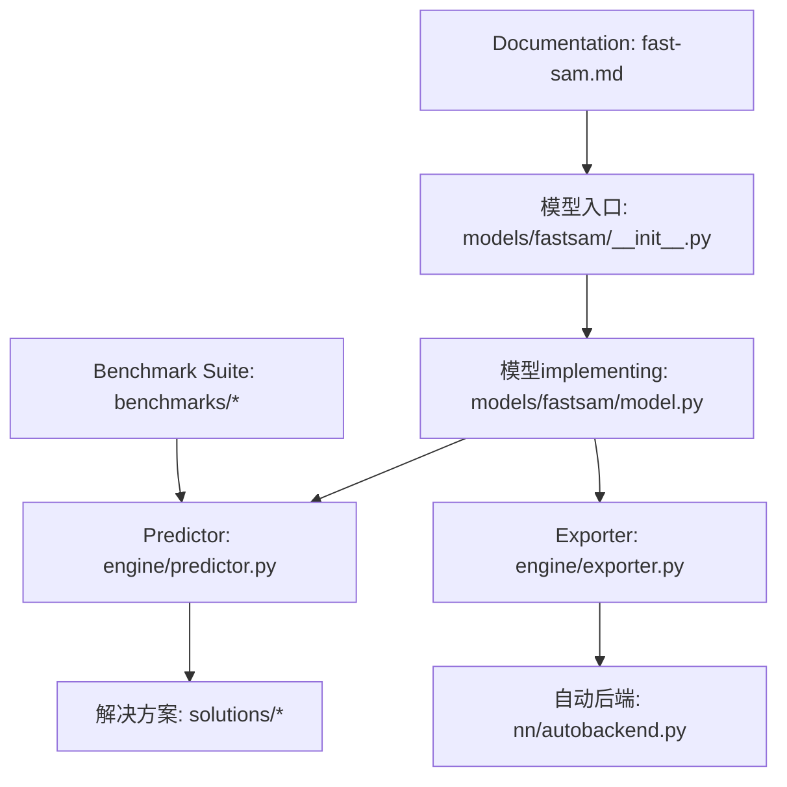
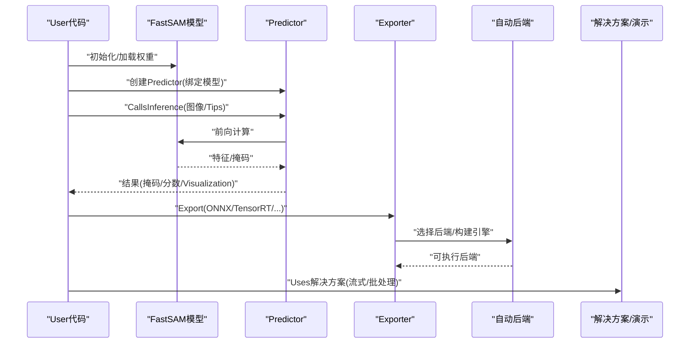
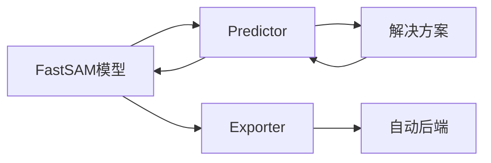

# FastSAM轻量级API

<cite>
**Files Referenced in This Document**
- [fastsam.md](file://docs/en/models/fast-sam.md)
- [__init__.py](file://ultralytics/models/fastsam/__init__.py)
- [model.py](file://ultralytics/models/fastsam/model.py)
- [predictor.py](file://ultralytics/engine/predictor.py)
- [exporter.py](file://ultralytics/engine/exporter.py)
- [autobackend.py](file://ultralytics/nn/autobackend.py)
- [benchmark_molora_dispatch.py](file://benchmarks/benchmark_molora_dispatch.py)
- [run.py](file://benchmarks/run.py)
- [suite.py](file://benchmarks/suite.py)
- [solutions.py](file://ultralytics/solutions/solutions.py)
- [streamlit_inference.py](file://ultralytics/solutions/streamlit_inference.py)
</cite>

## Table of Contents
1. [Introduction](#Introduction)
2. [Project Structure](#Project Structure)
3. [Core Components](#Core Components)
4. [Architecture Overview](#Architecture Overview)
5. [Detailed Component Analysis](#Detailed Component Analysis)
6. [Dependency Analysis](#Dependency Analysis)
7. [性能and轻量化Optimization](#性能and轻量化Optimization)
8. [部署and适配指南](#部署and适配指南)
9. [Quick Start](#Quick Start)
10. [基准测试and结果](#基准测试and结果)
11. [故障排查](#故障排查)
12. [Conclusion](#Conclusion)

## Introduction
FastSAM是targeting实时分割的轻量化方案，While maintainingand标准SAM API风格一致的前提下，Via更轻量的模型结构andInference路径Optimization，显著降低延迟并提升吞吐。其设计理念强调：
- 轻量化优先：更小参数、更低计算量，适配移动端and边缘设备
- 兼容易用：尽量复用标准SAM的Uses习惯and接口风格
- 可部署性：provides多后端Exportand自动后端选择capabilities，便于Cross-Platform Deployment
- 可Extensibility：and工程化流水线（Predictor、Exporter、解决方案）无缝集成

本文件聚焦于FastSAM的初始化、加载、Inference接口，Centered onandand标准SAM的兼容性差异；同时给出实时分割的性能Optimization技巧、部署方案、移动端/边缘适配方法、精度and速度权衡策略和模型选择指南，并providesQuick StartExamplesand基准测试说明。

## Project Structure
FastSAM相关代码主要位于Centered on下位置：
- 模型定义and入口：ultralytics/models/fastsam
- Engine Layer：ultralytics/engine（Predictor、Exporter）
- 自动后端：ultralytics/nn/autobackend.py
- Documentation and References：docs/en/models/fast-sam.md
- Benchmark Suite：benchmarks（用于统一评测流程）
- 解决方案and演示：ultralytics/solutions（含流式Inferenceetc.）

Figure Source
- [fastsam.md](file://docs/en/models/fast-sam.md)
- [__init__.py](file://ultralytics/models/fastsam/__init__.py)
- [model.py](file://ultralytics/models/fastsam/model.py)
- [predictor.py](file://ultralytics/engine/predictor.py)
- [exporter.py](file://ultralytics/engine/exporter.py)
- [autobackend.py](file://ultralytics/nn/autobackend.py)
- [solutions.py](file://ultralytics/solutions/solutions.py)
- [benchmark_molora_dispatch.py](file://benchmarks/benchmark_molora_dispatch.py)
- [run.py](file://benchmarks/run.py)
- [suite.py](file://benchmarks/suite.py)

Section Source
- [fastsam.md](file://docs/en/models/fast-sam.md)
- [__init__.py](file://ultralytics/models/fastsam/__init__.py)
- [model.py](file://ultralytics/models/fastsam/model.py)
- [predictor.py](file://ultralytics/engine/predictor.py)
- [exporter.py](file://ultralytics/engine/exporter.py)
- [autobackend.py](file://ultralytics/nn/autobackend.py)
- [solutions.py](file://ultralytics/solutions/solutions.py)
- [benchmark_molora_dispatch.py](file://benchmarks/benchmark_molora_dispatch.py)
- [run.py](file://benchmarks/run.py)
- [suite.py](file://benchmarks/suite.py)

## Core Components
- 模型Entry and Registration：负责暴露FastSAM的类名、默认权重and配置解析，便于统一加载
- 模型implementing：EncapsulatesFastSAM的前向逻辑、Tips处理and掩码生成
- Predictor：将模型接入统一的Inference管线，Supporting批量、Device Selection、Post-ProcessingandVisualization
- Exporter：将PyTorchModel ExportforONNX/TensorRT/TFLiteetc.格式，Combined with自动后端进行加速
- 自动后端：根据目标环境and可用库自动选择最优执行后端
- 解决方案：provides开箱即用的实时分割应用模板（such as流式Inference）

Section Source
- [__init__.py](file://ultralytics/models/fastsam/__init__.py)
- [model.py](file://ultralytics/models/fastsam/model.py)
- [predictor.py](file://ultralytics/engine/predictor.py)
- [exporter.py](file://ultralytics/engine/exporter.py)
- [autobackend.py](file://ultralytics/nn/autobackend.py)
- [solutions.py](file://ultralytics/solutions/solutions.py)

## Architecture Overview
FastSAMwhile工程上遵循“模型-Predictor-Exporter-自动后端”的分层设计，上层Centered onUnified Interface对外provides服务，底层Via自动后端适配不同硬件and运行时。

Figure Source
- [model.py](file://ultralytics/models/fastsam/model.py)
- [predictor.py](file://ultralytics/engine/predictor.py)
- [exporter.py](file://ultralytics/engine/exporter.py)
- [autobackend.py](file://ultralytics/nn/autobackend.py)
- [solutions.py](file://ultralytics/solutions/solutions.py)

## Detailed Component Analysis

### 模型Entry and Registration
- 职责：providesFastSAM的统一访问点，包含类名、默认权重路径、配置键etc.元信息，便于高层Modules按名称加载
- 关键点：
  - and模型Registry集成，确保可Via通用接口实例化
  - 暴露默认权重and配置，简化上手体验
  - andPredictor/Exporter约定一致的输入输出契约

Section Source
- [__init__.py](file://ultralytics/models/fastsam/__init__.py)

### 模型implementing
- 职责：implementingFastSAM的核心前向逻辑，包括图像编码、Tips融合、掩码解码andPost-Processing
- 关键点：
  - 轻量化设计：减少冗余计算、精简通道/分辨率、Optimization注意力或卷积结构
  - Tips接口：Supporting点/框/文本etc.Tips类型（具体Centered on模型implementingfor准）
  - 输出规范：返回掩码、置信度、边界框etc.结构化结果，便于下游Uses

Section Source
- [model.py](file://ultralytics/models/fastsam/model.py)

### PredictorandInference管线
- 职责：将模型接入统一Inference框架，负责预处理、设备管理、批处理、Post-ProcessingandVisualization
- 关键点：
  - 设备and精度：自动选择CPU/GPU/Mixture精度，Supporting动态形状and批大小
  - Post-Processing：NMS、阈值过滤、掩码细化
  - Visualization：绘制掩码、边界框、关键点etc.

Section Source
- [predictor.py](file://ultralytics/engine/predictor.py)

### Exporterand自动后端
- 职责：将Training好的PyTorchModel Exportfor目标格式，并while运行时自动选择最优后端
- 关键点：
  - Export格式：ONNX、TensorRT、TFLiteetc.（Centered on实际Supportingfor准）
  - 自动后端：根据环境检测可用库and硬件特性，选择最佳执行路径
  - 兼容性：保证Export前后数值一致性，provides校验工具

Section Source
- [exporter.py](file://ultralytics/engine/exporter.py)
- [autobackend.py](file://ultralytics/nn/autobackend.py)

### 解决方案and演示
- 职责：provides开箱即用的实时分割应用模板，such as流式视频Inference、交互式标注辅助etc.
- 关键点：
  - 流式Inference：低延迟处理连续帧
  - Visualization：叠加掩码、统计Metrics
  - 可扩展：易于替换模型and后端

Section Source
- [solutions.py](file://ultralytics/solutions/solutions.py)
- [streamlit_inference.py](file://ultralytics/solutions/streamlit_inference.py)

## Dependency Analysis
FastSAM对上层依赖PredictorandExporter，对下层依赖自动后端and具体算子implementing。整体耦合度适中，Modules化清晰。

Figure Source
- [model.py](file://ultralytics/models/fastsam/model.py)
- [predictor.py](file://ultralytics/engine/predictor.py)
- [exporter.py](file://ultralytics/engine/exporter.py)
- [autobackend.py](file://ultralytics/nn/autobackend.py)
- [solutions.py](file://ultralytics/solutions/solutions.py)

Section Source
- [model.py](file://ultralytics/models/fastsam/model.py)
- [predictor.py](file://ultralytics/engine/predictor.py)
- [exporter.py](file://ultralytics/engine/exporter.py)
- [autobackend.py](file://ultralytics/nn/autobackend.py)
- [solutions.py](file://ultralytics/solutions/solutions.py)

## 性能and轻量化Optimization
- 模型层面
  - 减小网络深度/宽度，采用高效卷积/注意力替代
  - 降低特征图分辨率或Uses多尺度融合策略
  - 量化感知Training或后Training量化（INT8）
- Inference层面
  - Uses自动后端选择最优执行路径（TensorRT/ONNX Runtime/TFLite）
  - 批处理and内存池复用，避免频繁分配
  - 预取and异步I/O，减少Data Preparation开销
- Post-ProcessingOptimization
  - 阈值自适应and早停策略
  - 掩码细化仅while高分区域执行
- 精度-速度权衡
  - 小模型+高阈值：更快但可能漏检
  - 大模型+低阈值：更准但更慢
  - 建议基于业务场景做网格搜索，平衡mAPandFPS

[This section provides general guidance and does not directly analyze specific files]

## 部署and适配指南
- 服务器端
  - 推荐TensorRT/ONNX Runtime，Combining自动后端选择
  - Containerized Deployment，固定依赖版本，启用CUDA/cuDNNOptimization
- 移动端
  - TFLite/NCNN/MNNetc.后端，注意输入尺寸and量化
  - 控制内存占用，避免大图高分辨率
- 边缘设备
  - Jetson/树莓派/EdgeTPUetc.，需针对设备特性调参
  - Uses专用Export链路and校准数据集
- 云端服务
  - 微服务化，GPU/CPU混部，弹性扩缩容
  - 监控延迟and吞吐，设置超时and重试

[This section provides general guidance and does not directly analyze specific files]

## Quick Start
Centered on下for典型Uses步骤（概念性描述，不包含具体代码）：
- 安装and导入：Installing Dependencies并导入FastSAM模型andPredictor
- 初始化模型：指定权重路径或从仓库拉取默认权重
- 创建Predictor：绑定模型and设备（CPU/GPU），Optional精度and批大小
- Inference：传入图像andTips（点/框/文本），获取掩码and分数
- Visualization：绘制掩码and边界框，保存或展示结果
- Export：Exporting toONNX/TensorRT/TFLite，并while目标设备上运行

Section Source
- [fastsam.md](file://docs/en/models/fast-sam.md)
- [__init__.py](file://ultralytics/models/fastsam/__init__.py)
- [model.py](file://ultralytics/models/fastsam/model.py)
- [predictor.py](file://ultralytics/engine/predictor.py)
- [exporter.py](file://ultralytics/engine/exporter.py)
- [autobackend.py](file://ultralytics/nn/autobackend.py)

## 基准测试and结果
- Benchmark Suite：Uses统一基准脚本and套件定义，覆盖不同设备and后端
- 关键Metrics：延迟（ms）、吞吐（FPS）、显存/内存占用、精度（mAP/mIoU）
- 运行方式：Via基准运行脚本and套件配置文件执行端to端评测
- 结果解读：对比不同模型尺寸、后端and量化策略的效果

Section Source
- [benchmark_molora_dispatch.py](file://benchmarks/benchmark_molora_dispatch.py)
- [run.py](file://benchmarks/run.py)
- [suite.py](file://benchmarks/suite.py)

## 故障排查
- 常见问题
  - 权重加载失败：检查路径and权限，确认权重完整性
  - 后端不可用：确认已安装对应库（such asTensorRT/ONNX Runtime/TFLite）
  - 显存不足：降低输入尺寸、批大小或启用半精度
  - Export Failure：检查算子Supporting情况，必要时降级toONNX
- 调试建议
  - 打印设备and后端信息，Validation自动后端选择是否符合预期
  - 逐步关闭Optimization（such as量化/编译）定位bottlenecks
  - UsesBenchmark Suite复现实验条件，确保可比性

Section Source
- [autobackend.py](file://ultralytics/nn/autobackend.py)
- [exporter.py](file://ultralytics/engine/exporter.py)
- [predictor.py](file://ultralytics/engine/predictor.py)

## Conclusion
FastSAMCentered on轻量化forCore Objective，While maintainingand标准SAM相近的Uses体验，显著提升了实时分割的效率and可部署性。Via模型结构Optimization、自动后端选择and工程化集成，FastSAM能够灵活适配服务器、移动端and边缘设备。建议while具体项目中依据业务需求进行精度-速度权衡and模型选型，并Combining基准测试持续Evaluationand迭代。