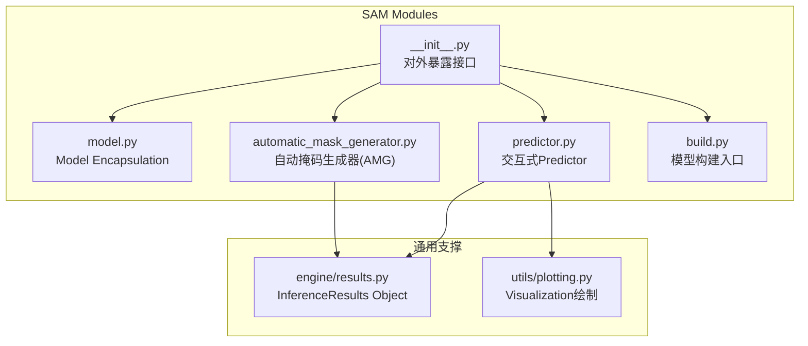
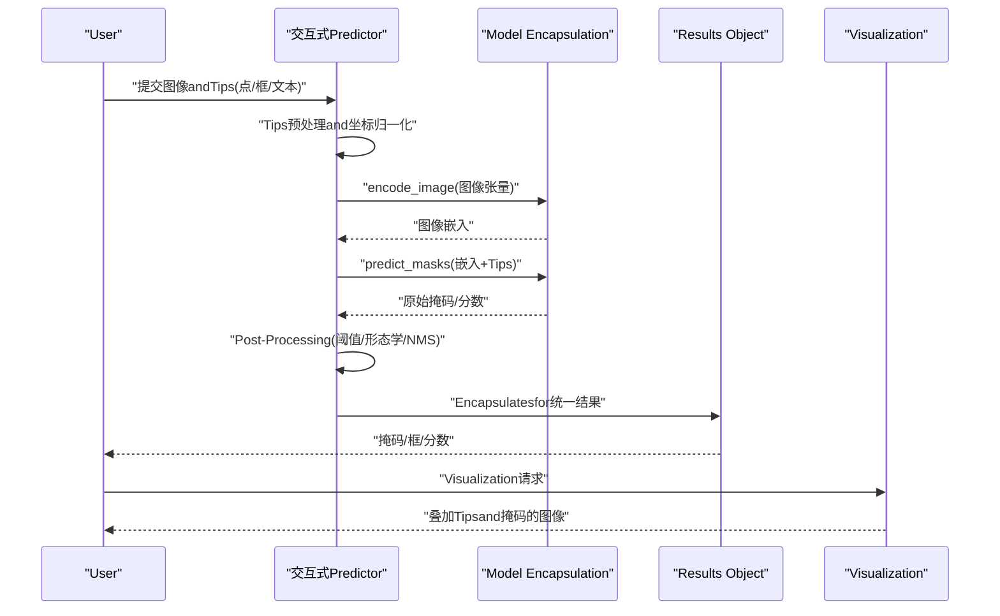
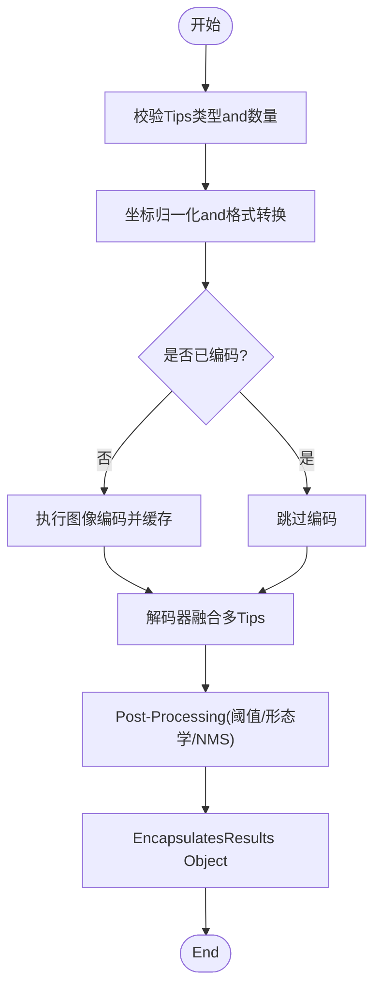
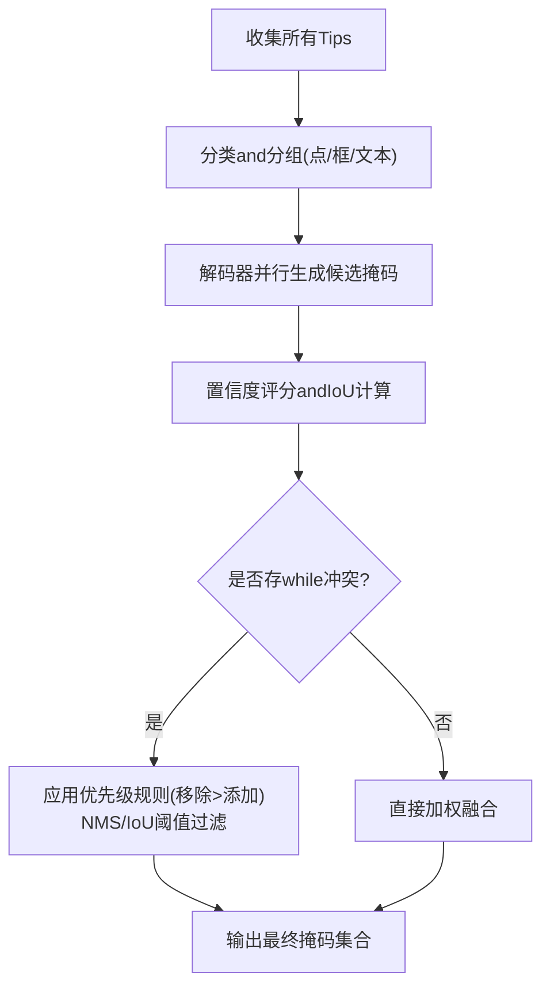
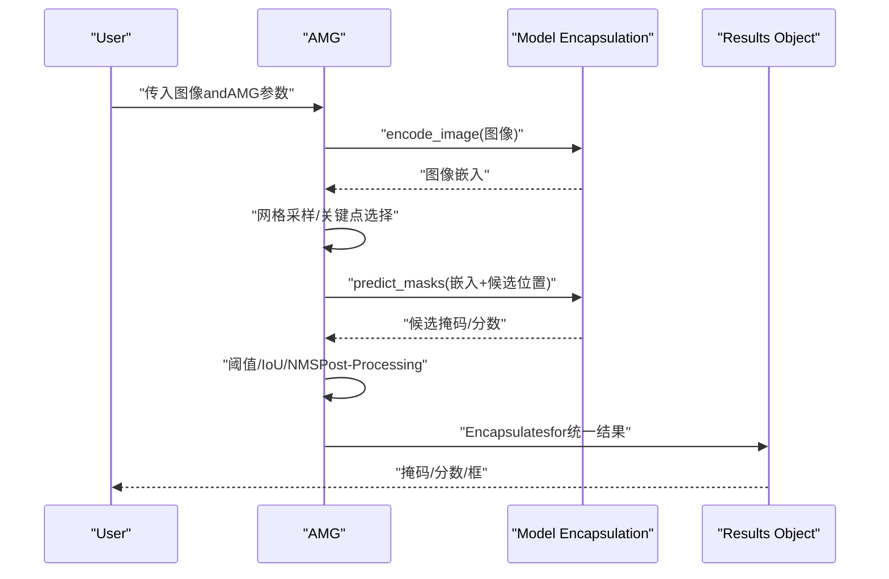
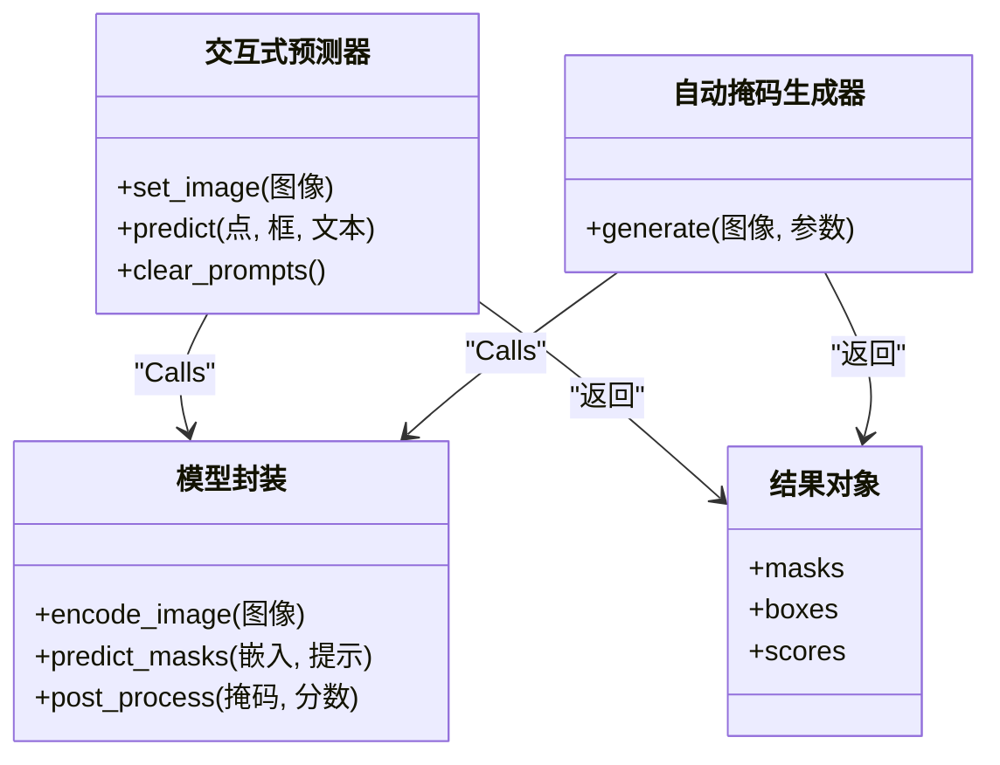
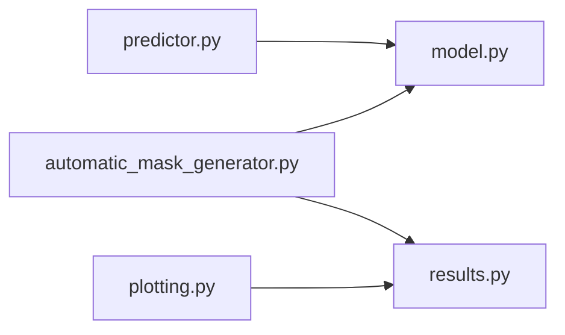

# 交互式Tips接口

<cite>
**Files Referenced in This Document**
- [ultralytics/models/sam/model.py](file://ultralytics/models/sam/model.py)
- [ultralytics/models/sam/predictor.py](file://ultralytics/models/sam/predictor.py)
- [ultralytics/models/sam/automatic_mask_generator.py](file://ultralytics/models/sam/automatic_mask_generator.py)
- [ultralytics/models/sam/build.py](file://ultralytics/models/sam/build.py)
- [ultralytics/models/sam/__init__.py](file://ultralytics/models/sam/__init__.py)
- [ultralytics/engine/results.py](file://ultralytics/engine/results.py)
- [ultralytics/utils/plotting.py](file://ultralytics/utils/plotting.py)
</cite>

## Table of Contents
1. [Introduction](#Introduction)
2. [Project Structure](#Project Structure)
3. [Core Components](#Core Components)
4. [Architecture Overview](#Architecture Overview)
5. [Detailed Component Analysis](#Detailed Component Analysis)
6. [Dependency Analysis](#Dependency Analysis)
7. [性能考量](#性能考量)
8. [Troubleshooting Guide](#Troubleshooting Guide)
9. [Conclusion](#Conclusion)
10. [Appendix](#Appendix)

## Introduction
本文件targetingUses SAM（Segment Anything Model）交互式Tips接口的开发者，系统梳理点Tips、框Tips、文本Tipsetc.交互方式，说明坐标系统and格式要求、预处理方法、自动掩码生成器（AMG）的Usesand参数配置、多Tips融合and冲突解决机制、Tips质量Evaluationand结果Validation方法，并给出复杂场景下的设计策略and最佳实践。Documentation同时provides丰富的交互式分割Examplesand调试技巧，帮助读者快速上手并稳定落地。

## Project Structure
SAM 相关代码位于 models/sam 子Modules中，包含Model Encapsulation、Predictor、自动掩码生成器Centered onand构建入口；Inference结果andVisualization分别由 engine/results and utils/plotting providesSupporting。

Figure Source
- [ultralytics/models/sam/model.py](file://ultralytics/models/sam/model.py)
- [ultralytics/models/sam/predictor.py](file://ultralytics/models/sam/predictor.py)
- [ultralytics/models/sam/automatic_mask_generator.py](file://ultralytics/models/sam/automatic_mask_generator.py)
- [ultralytics/models/sam/build.py](file://ultralytics/models/sam/build.py)
- [ultralytics/models/sam/__init__.py](file://ultralytics/models/sam/__init__.py)
- [ultralytics/engine/results.py](file://ultralytics/engine/results.py)
- [ultralytics/utils/plotting.py](file://ultralytics/utils/plotting.py)

Section Source
- [ultralytics/models/sam/model.py](file://ultralytics/models/sam/model.py)
- [ultralytics/models/sam/predictor.py](file://ultralytics/models/sam/predictor.py)
- [ultralytics/models/sam/automatic_mask_generator.py](file://ultralytics/models/sam/automatic_mask_generator.py)
- [ultralytics/models/sam/build.py](file://ultralytics/models/sam/build.py)
- [ultralytics/models/sam/__init__.py](file://ultralytics/models/sam/__init__.py)
- [ultralytics/engine/results.py](file://ultralytics/engine/results.py)
- [ultralytics/utils/plotting.py](file://ultralytics/utils/plotting.py)

## Core Components
- Model Encapsulation：负责加载权重、设备管理、图像编码and解码流程编排。
- 交互式Predictor：接收点/框/文本etc.Tips，Calls编码器and解码器生成掩码，Supporting多Tips融合and迭代修正。
- 自动掩码生成器（AMG）：基于图像特征自动生成候选掩码，用于批量标注或弱监督场景。
- 构建入口：统一创建模型实例，屏蔽底层implementing差异。
- Results Object：标准化返回的掩码、边界框、分数etc.信息，便于后续处理andVisualization。
- Visualization：将掩码、Tips点/框叠加to原图，辅助调试and展示。

Section Source
- [ultralytics/models/sam/model.py](file://ultralytics/models/sam/model.py)
- [ultralytics/models/sam/predictor.py](file://ultralytics/models/sam/predictor.py)
- [ultralytics/models/sam/automatic_mask_generator.py](file://ultralytics/models/sam/automatic_mask_generator.py)
- [ultralytics/models/sam/build.py](file://ultralytics/models/sam/build.py)
- [ultralytics/engine/results.py](file://ultralytics/engine/results.py)
- [ultralytics/utils/plotting.py](file://ultralytics/utils/plotting.py)

## Architecture Overview
下图展示了从User输入to最终掩码输出的端to端流程，包括Tips预处理、图像编码、解码器融合、Post-ProcessingandVisualization。

Figure Source
- [ultralytics/models/sam/predictor.py](file://ultralytics/models/sam/predictor.py)
- [ultralytics/models/sam/model.py](file://ultralytics/models/sam/model.py)
- [ultralytics/engine/results.py](file://ultralytics/engine/results.py)
- [ultralytics/utils/plotting.py](file://ultralytics/utils/plotting.py)

## Detailed Component Analysis

### 交互式Predictor（点/框/文本Tips）
- 功能要点
  - Supporting点Tips、框Tips、文本Tips三类交互方式。
  - 对Tips进行预处理：坐标归一化、类型校验、去重and排序。
  - 多Tips融合：while解码阶段聚合多个Tips信号，提升鲁棒性。
  - 迭代修正：允许追加/删除TipsCentered on逐步完善分割。
- 关键流程
  - 输入校验and预处理
  - 图像编码（一次性计算，缓存复用）
  - 解码器融合（按Tips类型加权/投票）
  - Post-Processing（阈值、连通域、NMS）
  - 结果EncapsulatesandVisualization
- 复杂度and性能
  - 图像编码一次计算，多次Tips可复用，显著降低延迟。
  - 多Tips融合增加少量计算开销，但能显著提升精度。

Figure Source
- [ultralytics/models/sam/predictor.py](file://ultralytics/models/sam/predictor.py)
- [ultralytics/models/sam/model.py](file://ultralytics/models/sam/model.py)

Section Source
- [ultralytics/models/sam/predictor.py](file://ultralytics/models/sam/predictor.py)
- [ultralytics/models/sam/model.py](file://ultralytics/models/sam/model.py)

#### Tips坐标系统and格式要求
- 坐标系约定
  - 像素坐标系：原点位于左上角，x 向右递增，y 向下递增。
  - 归一化坐标：范围通常for [0,1]，对应图像宽高比例。
- 点Tips
  - 格式：二维数组，形状 (N, 2)，N for点数。
  - 值域：若for像素坐标，需确保while图像范围内；若for归一化坐标，需while [0,1]。
- 框Tips
  - 格式：二维数组，形状 (K, 4)。
  - 顺序：常见for [x_min, y_min, x_max, y_max] 或中心+宽高，具体Centered on接口定义for准。
  - 约束：x_min ≤ x_max，y_min ≤ y_max；建议避免退化框（面积for零）。
- 文本Tips
  - 输入：字符串或词表索引序列。
  - 语义：描述目标类别或属性，需and模型Training时的语言空间对齐。
- 预处理方法
  - 越界裁剪：将坐标限制while图像边界内。
  - 重复剔除：去除重复点/框，必要时保留最近一次Tips。
  - 排序and分组：按类型分组，便于解码器差异化处理。

Section Source
- [ultralytics/models/sam/predictor.py](file://ultralytics/models/sam/predictor.py)

#### 多Tips融合and冲突解决
- 融合策略
  - 解码器级融合：将不同Tips映射to同一潜空间，Via注意力/门控机制聚合。
  - 评分融合：对各Tips生成的掩码进行置信度加权合并。
- 冲突解决
  - 正负Tips互斥：当存while“添加”和“移除”两类Tips时，优先满足移除区域。
  - 重叠抑制：对高度重叠的候选掩码执行 NMS 或 IoU 阈值筛选。
  - 一致性检查：对文本Tipsand几何Tips不一致的情况，采用降级策略（such as仅用几何Tips）。

Figure Source
- [ultralytics/models/sam/predictor.py](file://ultralytics/models/sam/predictor.py)

Section Source
- [ultralytics/models/sam/predictor.py](file://ultralytics/models/sam/predictor.py)

### 自动掩码生成器（AMG）
- Applicable Scenarios
  - 批量无Tips分割、弱监督数据生成、探索性分析。
- 工作流程
  - 图像编码 → 网格采样/关键点检测 → 掩码生成 → Post-Processingand筛选 → 结果Encapsulates。
- 关键参数
  - 网格大小/步长：控制候选区域密度。
  - 掩码阈值：过滤低置信度掩码。
  - IoU 阈值：抑制重复掩码。
  - 最大掩码数：限制输出规模。
- 输出
  - 掩码列表、对应分数、Optional边界框。

Figure Source
- [ultralytics/models/sam/automatic_mask_generator.py](file://ultralytics/models/sam/automatic_mask_generator.py)
- [ultralytics/models/sam/model.py](file://ultralytics/models/sam/model.py)
- [ultralytics/engine/results.py](file://ultralytics/engine/results.py)

Section Source
- [ultralytics/models/sam/automatic_mask_generator.py](file://ultralytics/models/sam/automatic_mask_generator.py)
- [ultralytics/models/sam/model.py](file://ultralytics/models/sam/model.py)
- [ultralytics/engine/results.py](file://ultralytics/engine/results.py)

### Model Encapsulationand构建入口
- Model Encapsulation
  - 负责图像编码缓存、Tipsto潜空间的映射、掩码解码andPost-Processing。
- 构建入口
  - provides统一的模型初始化接口，Supporting权重路径、Device Selectionand精度设置。

Figure Source
- [ultralytics/models/sam/model.py](file://ultralytics/models/sam/model.py)
- [ultralytics/models/sam/predictor.py](file://ultralytics/models/sam/predictor.py)
- [ultralytics/models/sam/automatic_mask_generator.py](file://ultralytics/models/sam/automatic_mask_generator.py)
- [ultralytics/engine/results.py](file://ultralytics/engine/results.py)

Section Source
- [ultralytics/models/sam/model.py](file://ultralytics/models/sam/model.py)
- [ultralytics/models/sam/predictor.py](file://ultralytics/models/sam/predictor.py)
- [ultralytics/models/sam/automatic_mask_generator.py](file://ultralytics/models/sam/automatic_mask_generator.py)
- [ultralytics/models/sam/build.py](file://ultralytics/models/sam/build.py)
- [ultralytics/models/sam/__init__.py](file://ultralytics/models/sam/__init__.py)
- [ultralytics/engine/results.py](file://ultralytics/engine/results.py)

## Dependency Analysis
- 内部依赖
  - predictor 依赖 model 进行编码/解码。
  - automatic_mask_generator 依赖 model and results。
  - plotting 依赖 results 进行Visualization。
- External Dependencies
  - 张量运算库（such as PyTorch）、图像处理库（such as OpenCV/PIL）。
- 耦合and内聚
  - predictor and model 高内聚，职责清晰。
  - results 作for统一数据结构，降低下游耦合。

Figure Source
- [ultralytics/models/sam/predictor.py](file://ultralytics/models/sam/predictor.py)
- [ultralytics/models/sam/model.py](file://ultralytics/models/sam/model.py)
- [ultralytics/models/sam/automatic_mask_generator.py](file://ultralytics/models/sam/automatic_mask_generator.py)
- [ultralytics/engine/results.py](file://ultralytics/engine/results.py)
- [ultralytics/utils/plotting.py](file://ultralytics/utils/plotting.py)

Section Source
- [ultralytics/models/sam/predictor.py](file://ultralytics/models/sam/predictor.py)
- [ultralytics/models/sam/model.py](file://ultralytics/models/sam/model.py)
- [ultralytics/models/sam/automatic_mask_generator.py](file://ultralytics/models/sam/automatic_mask_generator.py)
- [ultralytics/engine/results.py](file://ultralytics/engine/results.py)
- [ultralytics/utils/plotting.py](file://ultralytics/utils/plotting.py)

## 性能考量
- 图像编码缓存：一次编码，多次Tips复用，显著降低延迟。
- 批处理and异步：对批量图像可采用批处理策略，Combining异步 I/O 提升吞吐。
- 内存Optimization：and时释放中间张量，避免大图长时间驻留显存。
- Post-Processing调参：Set appropriately阈值and IoU 阈值，减少冗余掩码。
- Device Selection：GPU acceleration编码and解码，CPU 仅用于轻量Tasks。

[This section provides general guidance and does not directly analyze specific files]

## Troubleshooting Guide
- 常见问题
  - 坐标越界：Tips点/框超出图像范围导致异常。
  - 空Tips：未provides任何Tips导致解码失败。
  - 文本不匹配：文本Tipsand模型语言空间不一致，导致语义偏差。
  - 掩码过多/过少：阈值或 IoU 参数不当。
- 定位步骤
  - 打印Tips预处理后的坐标and类型。
  - 检查图像尺寸and设备状态。
  - 观察中间嵌入and候选掩码分布。
  - 调整阈值and IoU 阈值，对比前后效果。
- Visualization辅助
  - Uses绘图工具叠加Tips点/框and掩码，直观判断问题所while。

Section Source
- [ultralytics/models/sam/predictor.py](file://ultralytics/models/sam/predictor.py)
- [ultralytics/utils/plotting.py](file://ultralytics/utils/plotting.py)

## Conclusion
SAM 交互式Tips接口Via点/框/文本etc.MultimodalTips，Combining图像编码缓存and解码器融合，implementing了高效且灵活的分割体验。Combined with AMG 可while无Tips场景下快速获得高质量候选掩码。遵循本文的坐标规范、预处理流程andPost-Processing策略，可while复杂场景中稳定落地。建议while实际项目中CombiningVisualizationandMetricsEvaluation持续Optimization参数andTips策略。

[本节for总结，不直接分析具体文件]

## Appendix

### 编程接口速查
- 交互式Predictor
  - set_image(image): 设置图像并缓存编码。
  - predict(points=None, boxes=None, text=None): 根据Tips生成掩码。
  - clear_prompts(): 清空历史Tips，重置状态。
- 自动掩码生成器
  - generate(image, params): 基于参数生成候选掩码。
- Results Object
  - masks: 二值掩码数组。
  - boxes: 对应边界框。
  - scores: 掩码置信度。

Section Source
- [ultralytics/models/sam/predictor.py](file://ultralytics/models/sam/predictor.py)
- [ultralytics/models/sam/automatic_mask_generator.py](file://ultralytics/models/sam/automatic_mask_generator.py)
- [ultralytics/engine/results.py](file://ultralytics/engine/results.py)

### Tips设计and最佳实践
- 点Tips
  - while目标中心附近放置多点，覆盖主要区域。
  - 对于细长目标，沿轮廓均匀布点。
- 框Tips
  - 尽量贴合目标外轮廓，避免过大背景引入噪声。
  - 对遮挡目标，Uses多个小框组合。
- 文本Tips
  - Uses简洁明确的类别名，避免歧义。
  - and几何Tips联合Uses，提高一致性。
- 多Tips融合
  - 先粗后精：先用框定位，再用点细化。
  - 冲突优先：移除Tips优先于添加Tips。
- 结果Validation
  - Uses IoU and Dice 系数Evaluation掩码质量。
  - 人工抽检关键样本，关注边缘细节。

[本节for概念性内容，不直接分析具体文件]

### 调试技巧
- 打印中间变量：Tips预处理后的坐标、图像嵌入维度、候选掩码数量。
- Visualization叠加：while原图上绘制Tips点/框and掩码轮廓，快速定位问题。
- 参数扫描：对阈值and IoU 阈值进行网格搜索，观察Metrics变化。
- Logging：记录每次交互的Tips内容and结果摘要，便于回溯。

Section Source
- [ultralytics/utils/plotting.py](file://ultralytics/utils/plotting.py)
- [ultralytics/models/sam/predictor.py](file://ultralytics/models/sam/predictor.py)