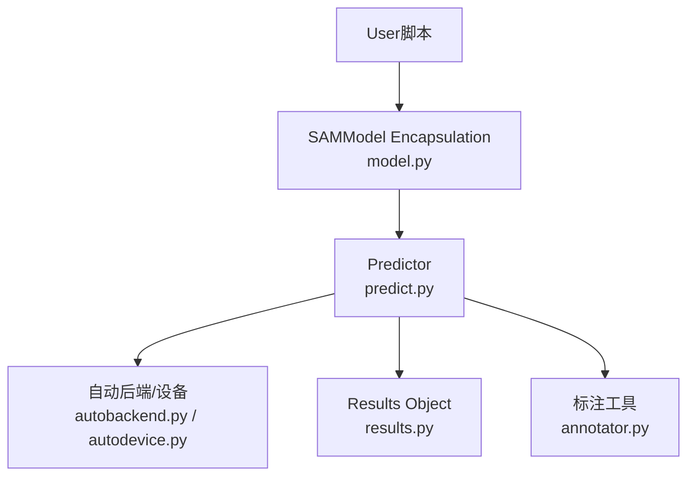
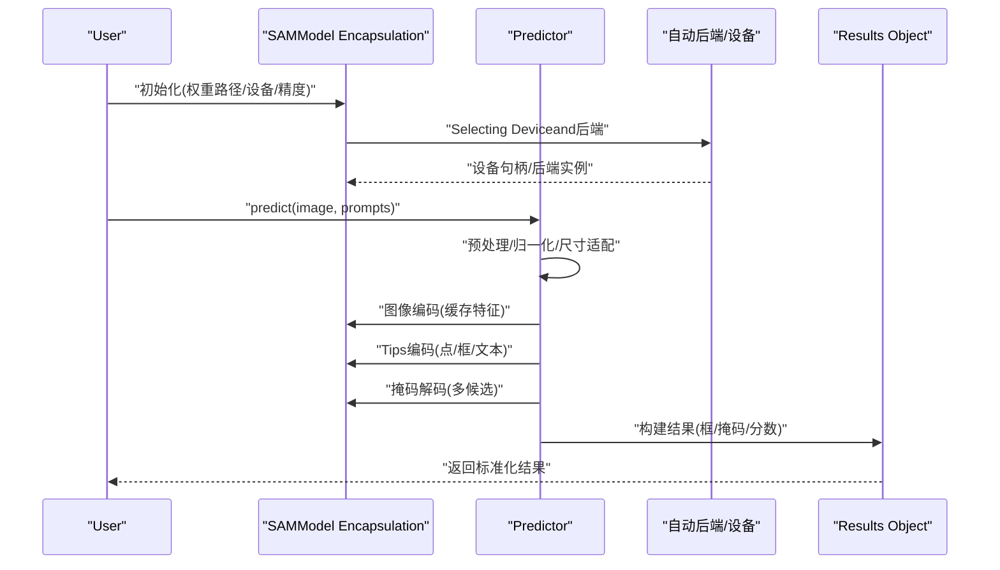
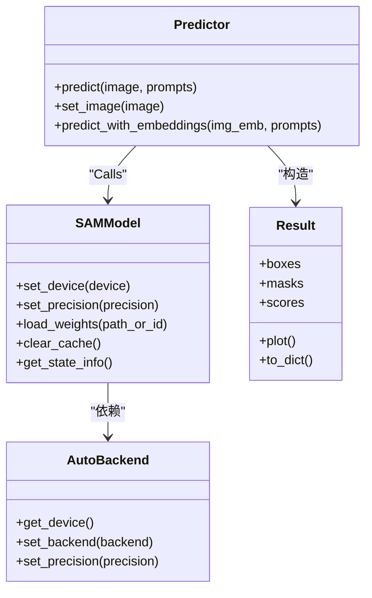
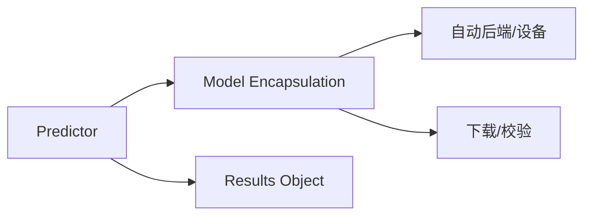

# SAMCore API接口

<cite>
**Files Referenced in This Document**
- [ultralytics/models/sam/model.py](file://ultralytics/models/sam/model.py)
- [ultralytics/models/sam/predict.py](file://ultralytics/models/sam/predict.py)
- [ultralytics/models/sam/__init__.py](file://ultralytics/models/sam/__init__.py)
- [ultralytics/nn/autobackend.py](file://ultralytics/nn/autobackend.py)
- [ultralytics/utils/autodevice.py](file://ultralytics/utils/autodevice.py)
- [ultralytics/utils/checks.py](file://ultralytics/utils/checks.py)
- [ultralytics/utils/downloads.py](file://ultralytics/utils/downloads.py)
- [ultralytics/engine/predictor.py](file://ultralytics/engine/predictor.py)
- [ultralytics/engine/results.py](file://ultralytics/engine/results.py)
- [ultralytics/models/sam/annotator.py](file://ultralytics/models/sam/annotator.py)
</cite>

## Table of Contents
1. [Introduction](#Introduction)
2. [Project Structure](#Project Structure)
3. [Core Components](#Core Components)
4. [Architecture Overview](#Architecture Overview)
5. [Detailed Component Analysis](#Detailed Component Analysis)
6. [Dependency Analysis](#Dependency Analysis)
7. [性能and内存Optimization](#性能and内存Optimization)
8. [Troubleshooting Guide](#Troubleshooting Guide)
9. [Conclusion](#Conclusion)
10. [Appendix：UsesExamples路径](#AppendixUsesExamples路径)

## Introduction
本文件targetingSegment Anything Model（SAM）while仓库中的Core API，聚焦于模型初始化、权重加载and配置、设备分配and内存Optimization策略，Centered onand图像编码器、Tips编码器and掩码解码器的接口规范。Documentation同时覆盖基础Prediction接口的参数and返回值格式、不同分辨率输入的处理方式、错误处理机制，并provides可复用的代码Examples路径，帮助读者快速上手并高效部署。

## Project Structure
SAM相关implementing位于ultralytics/models/samTable of Contents下，并Via统一引擎进行Inference编排。关键入口and职责such as下：
- Model Encapsulationand对外暴露：provides统一的模型类and便捷方法
- Predictor：负责预处理、编码、解码andPost-Processing的完整流程
- 自动后端andDevice Selection：根据环境自动选择最优执行后端and设备
- Results Object：标准化返回的检测结果andVisualizationcapabilities
- 标注工具：辅助生成Visualization标注

Figure Source
- [ultralytics/models/sam/model.py](file://ultralytics/models/sam/model.py)
- [ultralytics/models/sam/predict.py](file://ultralytics/models/sam/predict.py)
- [ultralytics/nn/autobackend.py](file://ultralytics/nn/autobackend.py)
- [ultralytics/utils/autodevice.py](file://ultralytics/utils/autodevice.py)
- [ultralytics/engine/results.py](file://ultralytics/engine/results.py)
- [ultralytics/models/sam/annotator.py](file://ultralytics/models/sam/annotator.py)

Section Source
- [ultralytics/models/sam/model.py](file://ultralytics/models/sam/model.py)
- [ultralytics/models/sam/predict.py](file://ultralytics/models/sam/predict.py)
- [ultralytics/nn/autobackend.py](file://ultralytics/nn/autobackend.py)
- [ultralytics/utils/autodevice.py](file://ultralytics/utils/autodevice.py)
- [ultralytics/engine/results.py](file://ultralytics/engine/results.py)
- [ultralytics/models/sam/annotator.py](file://ultralytics/models/sam/annotator.py)

## Core Components
- Model Encapsulation类
  - 负责模型权重加载、设备放置、缓存特征图、对外暴露便捷接口（such as点/框Tips分割）
  - 内部组合图像编码器、Tips编码器and掩码解码器
- Predictor
  - 完成输入预处理、图像编码、Tips编码、掩码解码、Post-Processingand结果组装
  - Supporting批量Tips、多尺度输入、动态批处理etc.高级特性
- 自动后端and设备
  - 自动检测可用设备（CPU/GPU/MPSetc.），选择合适后端（such asONNX/TensorRT/OpenVINOetc.）
  - 管理精度、编译选项and内存布局
- Results Object
  - 标准化输出：边界框、类别、置信度、掩码、关键点etc.
  - providesVisualizationandExportcapabilities
- 标注工具
  - 将Prediction结果渲染to图像上，便于调试and展示

Section Source
- [ultralytics/models/sam/model.py](file://ultralytics/models/sam/model.py)
- [ultralytics/models/sam/predict.py](file://ultralytics/models/sam/predict.py)
- [ultralytics/nn/autobackend.py](file://ultralytics/nn/autobackend.py)
- [ultralytics/utils/autodevice.py](file://ultralytics/utils/autodevice.py)
- [ultralytics/engine/results.py](file://ultralytics/engine/results.py)
- [ultralytics/models/sam/annotator.py](file://ultralytics/models/sam/annotator.py)

## Architecture Overview
下图展示了从UserCallsto最终输出的端to端流程，包括权重加载、设备分配、编码/解码and结果返回。

Figure Source
- [ultralytics/models/sam/model.py](file://ultralytics/models/sam/model.py)
- [ultralytics/models/sam/predict.py](file://ultralytics/models/sam/predict.py)
- [ultralytics/nn/autobackend.py](file://ultralytics/nn/autobackend.py)
- [ultralytics/utils/autodevice.py](file://ultralytics/utils/autodevice.py)
- [ultralytics/engine/results.py](file://ultralytics/engine/results.py)

## Detailed Component Analysis

### Model Encapsulation类（初始化、加载and配置）
- 初始化and配置
  - SupportingVia权重路径或预Training标识初始化
  - 可指定设备（自动或手动）、精度（fp32/fp16/bf16）、是否启用缓存
  - Optional加载特定Tasks头或冻结部分子Modules
- 权重管理
  - 优先本地权重；若缺失则触发下载流程
  - 校验权重完整性，失败时回退或抛出明确异常
- 设备分配
  - 基于当前环境自动选择最佳设备；也可强制指定
  - 对大型张量采用按需Migrationand复用策略，避免重复拷贝
- 缓存策略
  - 图像特征图缓存：同一图像多次Tips共享编码结果
  - Tips缓存：相同Tips类型and坐标可复用中间表示
- 典型接口
  - 设置设备and精度
  - 加载/切换权重
  - 清理缓存释放显存
  - 获取模型状态信息（设备、精度、版本etc.）

Section Source
- [ultralytics/models/sam/model.py](file://ultralytics/models/sam/model.py)
- [ultralytics/utils/downloads.py](file://ultralytics/utils/downloads.py)
- [ultralytics/utils/checks.py](file://ultralytics/utils/checks.py)
- [ultralytics/utils/autodevice.py](file://ultralytics/utils/autodevice.py)

### Predictor（预处理、编码、解码andPost-Processing）
- 输入预处理
  - Supporting多种输入源（路径、数组、视频帧）
  - 归一化、尺寸缩放、填充and对齐
- 图像编码
  - 一次性编码整图，输出高分辨率特征图
  - Supporting批内共享编码Centered on加速多图场景
- Tips编码
  - 点Tips：二维坐标、标签（前景/背景）
  - 框Tips：左上/右下坐标
  - 文本Tips（若启用）：经文本编码器映射for嵌入
- 掩码解码
  - Combining图像特征andTips嵌入，生成多候选掩码
  - 输出掩码质量评分，按阈值过滤
- Post-Processing
  - 掩码上采样至原图尺寸
  - OptionalNMS/形态学操作
  - andResults Object对接，统一字段and类型
- 典型接口
  - predict(image, points=None, boxes=None, labels=None, text=None, ...)
  - set_image(image) + predict_with_embeddings(...)

Section Source
- [ultralytics/models/sam/predict.py](file://ultralytics/models/sam/predict.py)
- [ultralytics/engine/results.py](file://ultralytics/engine/results.py)

### 自动后端and设备（设备分配and内存Optimization）
- Device Selection
  - 自动探测GPU/CPU/MPS可用性，选择最高优先级可用设备
  - Supporting多卡环境下的设备绑定and可见性控制
- 后端选择
  - 根据权重格式and目标平台选择最优后端（原生PyTorch/ONNX/TensorRT/OpenVINOetc.）
  - Supporting精度转换and算子融合
- 内存Optimization
  - 延迟加载、分块计算、Gradient关闭（Inference模式）
  - 显存碎片整理and缓存回收
- 典型接口
  - get_device()
  - set_backend(backend)
  - set_precision(precision)

Section Source
- [ultralytics/nn/autobackend.py](file://ultralytics/nn/autobackend.py)
- [ultralytics/utils/autodevice.py](file://ultralytics/utils/autodevice.py)

### Results Object（标准化输出andVisualization）
- 字段说明
  - 边界框、类别、置信度、掩码、关键点、轨迹ID（若适用）
- 访问方式
  - 属性访问and索引切片
  - 迭代遍历单个样本或批次
- VisualizationandExport
  - 绘制框/掩码/关键点
  - ExportJSON/Numpy/图像叠加

Section Source
- [ultralytics/engine/results.py](file://ultralytics/engine/results.py)
- [ultralytics/models/sam/annotator.py](file://ultralytics/models/sam/annotator.py)

### 类关系图（代码级）

Figure Source
- [ultralytics/models/sam/model.py](file://ultralytics/models/sam/model.py)
- [ultralytics/models/sam/predict.py](file://ultralytics/models/sam/predict.py)
- [ultralytics/nn/autobackend.py](file://ultralytics/nn/autobackend.py)
- [ultralytics/engine/results.py](file://ultralytics/engine/results.py)

## Dependency Analysis
- Modules耦合
  - Model Encapsulation依赖自动后端andDevice Selection，解耦具体执行细节
  - Predictor聚合模型capabilities，屏蔽底层差异
  - Results Object独立于模型implementing，便于替换and扩展
- External Dependencies
  - 权重下载and校验
  - 设备and后端探测
- Potential Cycles依赖
  - Via分层and接口隔离避免直接循环引用

Figure Source
- [ultralytics/models/sam/model.py](file://ultralytics/models/sam/model.py)
- [ultralytics/models/sam/predict.py](file://ultralytics/models/sam/predict.py)
- [ultralytics/nn/autobackend.py](file://ultralytics/nn/autobackend.py)
- [ultralytics/utils/downloads.py](file://ultralytics/utils/downloads.py)
- [ultralytics/utils/checks.py](file://ultralytics/utils/checks.py)
- [ultralytics/engine/results.py](file://ultralytics/engine/results.py)

## 性能and内存Optimization
- 输入分辨率and批处理
  - 合理选择输入尺寸，平衡精度and速度
  - Uses固定尺寸或最小填充减少重排开销
  - 开启批内共享图像编码，降低重复计算
- 设备and精度
  - PreferGPU；while受限设备上Uses半精度
  - 选择合适的后端（such asTensorRT/OpenVINO）Centered on获得更高吞吐
- 缓存and复用
  - 对静态图像提前编码并缓存
  - 重用Tips嵌入，避免重复编码
- 内存管理
  - Inference模式关闭Gradient
  - and时清理大对象and缓存
  - 监控显存占用，必要时分批处理

[This section provides general guidance and does not directly analyze specific files]

## Troubleshooting Guide
- 常见错误and定位
  - 权重缺失或损坏：检查下载and校验逻辑，确认网络and权限
  - 设备不可用：Validationdrivers are installedand环境变量，回退toCPU
  - 形状不匹配：核对输入尺寸andTips坐标范围
  - 显存不足：降低分辨率、关闭高精度、减少批大小
- 诊断建议
  - 打印设备and后端信息
  - 记录输入尺寸andTips数量
  - 逐步禁用功能（such as文本Tips）定位bottlenecks
- Loggingand断言
  - 关注关键断言and异常堆栈
  - Uses最小可复现ExamplesValidation问题

Section Source
- [ultralytics/utils/checks.py](file://ultralytics/utils/checks.py)
- [ultralytics/utils/downloads.py](file://ultralytics/utils/downloads.py)
- [ultralytics/utils/autodevice.py](file://ultralytics/utils/autodevice.py)

## Conclusion
through a unifiedModel EncapsulationandPredictor抽象，SAMwhile该仓库中provides了易用的分割capabilities。借助自动后端andDevice Selection、缓存and精度Optimization，可while多平台上获得良好的性能and稳定性。遵循本Documentation的接口规范andOptimization建议，可快速集成并稳定运行。

[This section is summary content and does not directly analyze specific files]

## Appendix：UsesExamples路径
Centered on下for可直接Refer to的Examples文件路径（不含代码片段）：
- 基本初始化andPrediction
  - [examples/YOLOv8-Segmentation-ONNXRuntime-Python/main.py](file://examples/YOLOv8-Segmentation-ONNXRuntime-Python/main.py)
- 交互式分割/标注
  - [examples/YOLO-Master-Cross-Platform-Edge-Deployment/python/...](file://examples/YOLO-Master-Cross-Platform-Edge-Deployment/python/)
- Visualizationand结果Export
  - [ultralytics/models/sam/annotator.py](file://ultralytics/models/sam/annotator.py)
  - [ultralytics/engine/results.py](file://ultralytics/engine/results.py)

[本节仅列出路径，不包含代码内容]