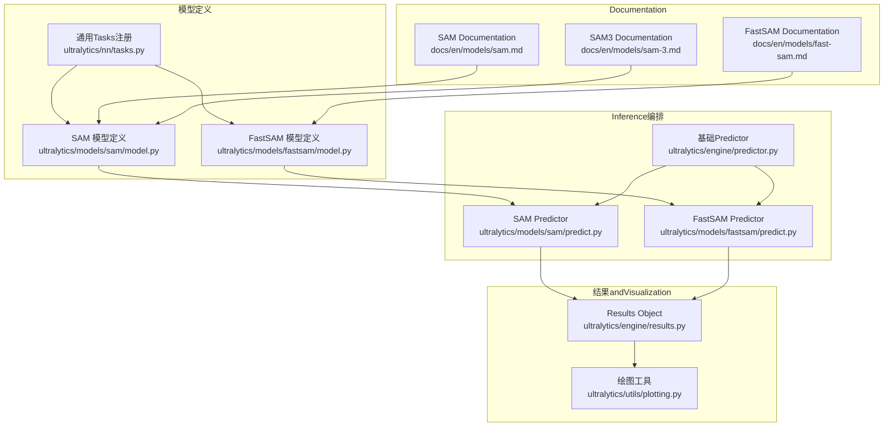
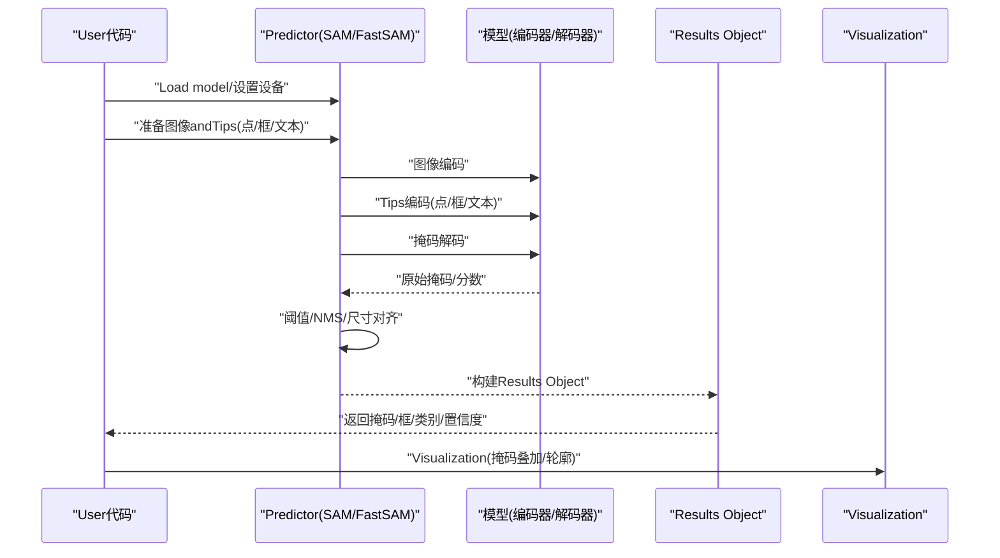
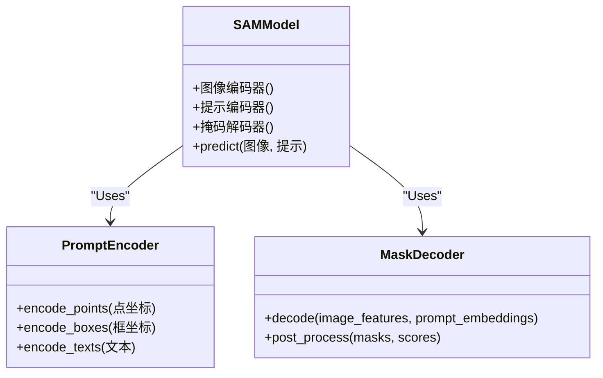
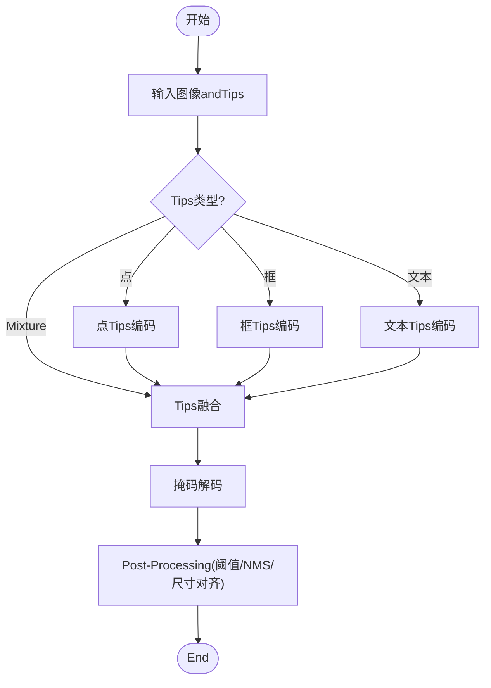
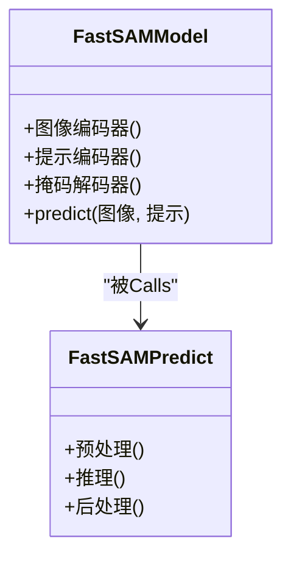
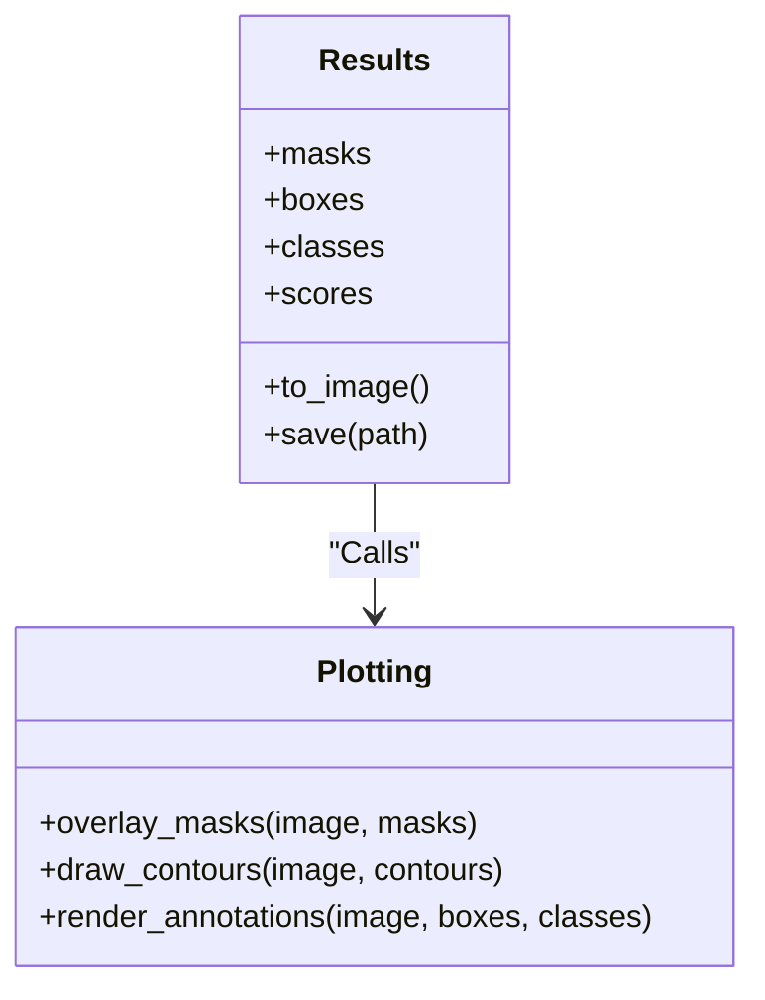
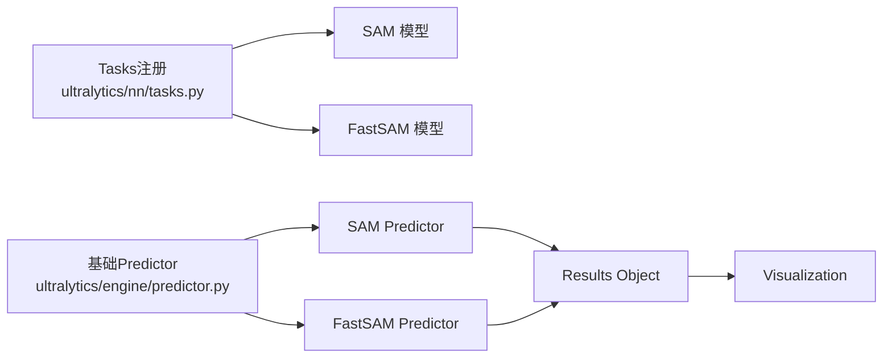

# SAM Segmentation Model API

<cite>
**Files Referenced in This Document**
- [ultralytics/models/sam/model.py](file://ultralytics/models/sam/model.py)
- [ultralytics/models/sam/predict.py](file://ultralytics/models/sam/predict.py)
- [ultralytics/models/sam/__init__.py](file://ultralytics/models/sam/__init__.py)
- [ultralytics/models/fastsam/model.py](file://ultralytics/models/fastsam/model.py)
- [ultralytics/models/fastsam/predict.py](file://ultralytics/models/fastsam/predict.py)
- [ultralytics/models/fastsam/__init__.py](file://ultralytics/models/fastsam/__init__.py)
- [ultralytics/nn/tasks.py](file://ultralytics/nn/tasks.py)
- [ultralytics/engine/predictor.py](file://ultralytics/engine/predictor.py)
- [ultralytics/engine/results.py](file://ultralytics/engine/results.py)
- [ultralytics/utils/plotting.py](file://ultralytics/utils/plotting.py)
- [docs/en/models/sam.md](file://docs/en/models/sam.md)
- [docs/en/models/fast-sam.md](file://docs/en/models/fast-sam.md)
- [docs/en/models/sam-3.md](file://docs/en/models/sam-3.md)
</cite>

## Table of Contents
1. [Introduction](#Introduction)
2. [Project Structure](#Project Structure)
3. [Core Components](#Core Components)
4. [Architecture Overview](#Architecture Overview)
5. [Detailed Component Analysis](#Detailed Component Analysis)
6. [Dependency Analysis](#Dependency Analysis)
7. [性能and部署建议](#性能and部署建议)
8. [Troubleshooting Guide](#Troubleshooting Guide)
9. [Conclusion](#Conclusion)
10. [Appendix：常用场景and接口速查](#Appendix常用场景and接口速查)

## Introduction
本文件targetingUses Segment Anything Model（SAM）and FastSAM 的开发者，provides统一的 API Documentationand实践指南。内容覆盖：
- SAM 的图像编码器、Tips编码器、掩码解码器的Calls方式
- 点Tips、框Tips、文本Tipsetc.交互方式的编程接口
- SAM3 新架构特性and改进要点
- FastSAM 轻量级版本的 API Uses说明
- Instance Segmentation、交互式分割、零样本分割etc.典型场景用法
- 模型权重管理and多语言Supporting
- 分割结果Visualization and Post-Processing操作
- 自定义Tips生成and模型微调接口说明

## Project Structure
本项目将 SAM and FastSAM 作for独立模型族集成while统一Inference框架中，遵循“模型定义 + Predictor + Results Object”的分层组织方式：
- 模型定义：Encapsulates网络结构andTasks头
- Predictor：负责预处理、Inference流程编排、Post-Processing
- Results Object：统一EncapsulatesPrediction输出（掩码、边界框、类别、置信度etc.）
- Documentation：provides各模型的官方说明andExamples

Figure Source
- [ultralytics/models/sam/model.py](file://ultralytics/models/sam/model.py)
- [ultralytics/models/fastsam/model.py](file://ultralytics/models/fastsam/model.py)
- [ultralytics/nn/tasks.py](file://ultralytics/nn/tasks.py)
- [ultralytics/engine/predictor.py](file://ultralytics/engine/predictor.py)
- [ultralytics/models/sam/predict.py](file://ultralytics/models/sam/predict.py)
- [ultralytics/models/fastsam/predict.py](file://ultralytics/models/fastsam/predict.py)
- [ultralytics/engine/results.py](file://ultralytics/engine/results.py)
- [ultralytics/utils/plotting.py](file://ultralytics/utils/plotting.py)
- [docs/en/models/sam.md](file://docs/en/models/sam.md)
- [docs/en/models/fast-sam.md](file://docs/en/models/fast-sam.md)
- [docs/en/models/sam-3.md](file://docs/en/models/sam-3.md)

Section Source
- [ultralytics/models/sam/model.py](file://ultralytics/models/sam/model.py)
- [ultralytics/models/fastsam/model.py](file://ultralytics/models/fastsam/model.py)
- [ultralytics/nn/tasks.py](file://ultralytics/nn/tasks.py)
- [ultralytics/engine/predictor.py](file://ultralytics/engine/predictor.py)
- [ultralytics/models/sam/predict.py](file://ultralytics/models/sam/predict.py)
- [ultralytics/models/fastsam/predict.py](file://ultralytics/models/fastsam/predict.py)
- [ultralytics/engine/results.py](file://ultralytics/engine/results.py)
- [ultralytics/utils/plotting.py](file://ultralytics/utils/plotting.py)
- [docs/en/models/sam.md](file://docs/en/models/sam.md)
- [docs/en/models/fast-sam.md](file://docs/en/models/fast-sam.md)
- [docs/en/models/sam-3.md](file://docs/en/models/sam-3.md)

## Core Components
- SAM 模型定义：Encapsulates图像编码器、Tips编码器、掩码解码器Centered onandTasks头；对外暴露统一的Prediction接口。
- FastSAM 模型定义：轻量化版本，侧重速度and资源占用平衡，保留点/框Tipscapabilities。
- Predictor：负责输入预处理、Tips编码、解码器Inference、NMS/阈值过滤、结果组装。
- Results Object：统一Encapsulates掩码、边界框、类别、置信度、元数据，并providesVisualization方法。
- 绘图工具：provides掩码叠加、轮廓绘制、标注渲染etc.实用函数。

Section Source
- [ultralytics/models/sam/model.py](file://ultralytics/models/sam/model.py)
- [ultralytics/models/fastsam/model.py](file://ultralytics/models/fastsam/model.py)
- [ultralytics/models/sam/predict.py](file://ultralytics/models/sam/predict.py)
- [ultralytics/models/fastsam/predict.py](file://ultralytics/models/fastsam/predict.py)
- [ultralytics/engine/results.py](file://ultralytics/engine/results.py)
- [ultralytics/utils/plotting.py](file://ultralytics/utils/plotting.py)

## Architecture Overview
下图展示从User输入to最终Visualization的端to端流程，包括Tips类型and关键Modules交互。

Figure Source
- [ultralytics/models/sam/predict.py](file://ultralytics/models/sam/predict.py)
- [ultralytics/models/fastsam/predict.py](file://ultralytics/models/fastsam/predict.py)
- [ultralytics/models/sam/model.py](file://ultralytics/models/sam/model.py)
- [ultralytics/models/fastsam/model.py](file://ultralytics/models/fastsam/model.py)
- [ultralytics/engine/results.py](file://ultralytics/engine/results.py)
- [ultralytics/utils/plotting.py](file://ultralytics/utils/plotting.py)

## Detailed Component Analysis

### SAM 模型and接口规范
- 图像编码器：接收高分辨率图像，提取全局特征图，用于后续Tips融合and掩码生成。
- Tips编码器：Supporting点Tips、框Tips、文本Tipsetc.多种交互形式，将Tips映射for可融合的Tips向量。
- 掩码解码器：Combining图像特征andTips向量，生成高质量实例掩码and对应置信度。
- Prediction接口：统一Encapsulates上述三个子Modules，provides批处理、设备管理、内存Optimizationetc.capabilities。

Figure Source
- [ultralytics/models/sam/model.py](file://ultralytics/models/sam/model.py)

Section Source
- [ultralytics/models/sam/model.py](file://ultralytics/models/sam/model.py)
- [docs/en/models/sam.md](file://docs/en/models/sam.md)

#### 交互Tips编程接口
- 点Tips：传入二维点坐标列表，Supporting单点或多点组合，常用于交互式选择目标区域。
- 框Tips：传入矩形框坐标，适合快速定位目标范围。
- 文本Tips：传入自然语言描述，由文本编码器转换forTips向量，implementing零样本分割。
- MixtureTips：可同时传入多种Tips类型，模型内部进行融合后再解码掩码。

Figure Source
- [ultralytics/models/sam/predict.py](file://ultralytics/models/sam/predict.py)
- [ultralytics/models/sam/model.py](file://ultralytics/models/sam/model.py)

Section Source
- [ultralytics/models/sam/predict.py](file://ultralytics/models/sam/predict.py)
- [ultralytics/models/sam/model.py](file://ultralytics/models/sam/model.py)

### FastSAM 轻量级版本 API
- 设计目标：while保证质量的前提下降低计算量and显存占用，提升Inference速度。
- capabilities范围：Supporting点Tips、框Tips；文本Tipscapabilities视具体implementing而定。
- Applicable Scenarios：边缘设备、实时应用、大规模Batch Inference。

Figure Source
- [ultralytics/models/fastsam/model.py](file://ultralytics/models/fastsam/model.py)
- [ultralytics/models/fastsam/predict.py](file://ultralytics/models/fastsam/predict.py)

Section Source
- [ultralytics/models/fastsam/model.py](file://ultralytics/models/fastsam/model.py)
- [ultralytics/models/fastsam/predict.py](file://ultralytics/models/fastsam/predict.py)
- [docs/en/models/fast-sam.md](file://docs/en/models/fast-sam.md)

### SAM3 新架构特性and改进
- 架构升级：针对编码器/解码器效率and精度进行Optimization，增强Tips融合策略。
- MultimodalTips：强化文本Tipscapabilities，provides更稳定的零样本分割效果。
- InferenceOptimization：引入更高效的特征复用and缓存机制，减少重复计算。
- 兼容性：保持and现有 SAM/FastSAM 接口一致，便于平滑Migration。

Section Source
- [docs/en/models/sam-3.md](file://docs/en/models/sam-3.md)
- [ultralytics/models/sam/model.py](file://ultralytics/models/sam/model.py)

### Results ObjectandVisualization
- Results Object：统一Encapsulates掩码、边界框、类别、置信度、元数据，并provides访问andExport方法。
- Visualization：Supporting掩码叠加、轮廓绘制、标注渲染，便于调试and展示。

Figure Source
- [ultralytics/engine/results.py](file://ultralytics/engine/results.py)
- [ultralytics/utils/plotting.py](file://ultralytics/utils/plotting.py)

Section Source
- [ultralytics/engine/results.py](file://ultralytics/engine/results.py)
- [ultralytics/utils/plotting.py](file://ultralytics/utils/plotting.py)

## Dependency Analysis
- 模型定义依赖TasksRegistry，确保不同模型while统一框架下运行。
- Predictor依赖基础Predictor，继承通用预处理、设备管理、批处理逻辑。
- Results ObjectandVisualizationModules解耦，便于扩展新的Visualization样式或Export格式。

Figure Source
- [ultralytics/nn/tasks.py](file://ultralytics/nn/tasks.py)
- [ultralytics/engine/predictor.py](file://ultralytics/engine/predictor.py)
- [ultralytics/models/sam/predict.py](file://ultralytics/models/sam/predict.py)
- [ultralytics/models/fastsam/predict.py](file://ultralytics/models/fastsam/predict.py)
- [ultralytics/engine/results.py](file://ultralytics/engine/results.py)
- [ultralytics/utils/plotting.py](file://ultralytics/utils/plotting.py)

Section Source
- [ultralytics/nn/tasks.py](file://ultralytics/nn/tasks.py)
- [ultralytics/engine/predictor.py](file://ultralytics/engine/predictor.py)
- [ultralytics/models/sam/predict.py](file://ultralytics/models/sam/predict.py)
- [ultralytics/models/fastsam/predict.py](file://ultralytics/models/fastsam/predict.py)
- [ultralytics/engine/results.py](file://ultralytics/engine/results.py)
- [ultralytics/utils/plotting.py](file://ultralytics/utils/plotting.py)

## 性能and部署建议
- Device Selection：Prefer GPU acceleration，CPU 模式下适当降低分辨率andBatch Size。
- 批处理：对静态数据集采用批处理Centered on提升吞吐；交互式场景建议单张InferenceCentered on降低延迟。
- TipsOptimization：合理选择Tips数量and类型，避免过多点Tips导致解码器负担增加。
- Post-Processing参数：根据应用场景调整阈值and NMS 参数，平衡召回and误检。
- Exportand部署：Combining ONNX/TensorRT/OpenVINO etc.后端进行部署Optimization，Refer to平台Documentation。

[This section provides general guidance and does not directly analyze specific files]

## Troubleshooting Guide
- 加载失败：检查模型路径and权重完整性，确认设备可用性and内存充足。
- Tips格式错误：核对点/框/文本Tips的维度and顺序，确保and模型期望一致。
- 结果异常：检查阈值and NMS 参数，必要时调整Centered on改善分割质量。
- Visualization问题：确认图像尺寸and掩码尺寸对齐，避免叠加错位。

Section Source
- [ultralytics/models/sam/predict.py](file://ultralytics/models/sam/predict.py)
- [ultralytics/models/fastsam/predict.py](file://ultralytics/models/fastsam/predict.py)
- [ultralytics/engine/results.py](file://ultralytics/engine/results.py)
- [ultralytics/utils/plotting.py](file://ultralytics/utils/plotting.py)

## Conclusion
through a unified模型定义andPredictor架构，SAM and FastSAM while本项目中provides了稳定且易用的分割 API。Combining点/框/文本Tipsand强大的Visualizationcapabilities，可满足Instance Segmentation、交互式分割、零样本分割etc.多类场景需求。SAM3 的架构改进进一步提升了效率and精度，而 FastSAM 则for资源受限环境provides了高效替代方案。

[This section is summary content and does not directly analyze specific files]

## Appendix：常用场景and接口速查
- Instance Segmentation：Uses框Tips或自动检测后的框作for输入，Combined with阈值and NMS 得to实例掩码。
- 交互式分割：逐步添加点Tips，动态更新掩码，适用于精细标注and编辑。
- 零样本分割：Uses文本Tips描述目标类别，无需Training即可分割未知类别。
- 权重管理：集中管理Pre-trained Weightsand本地缓存，Supporting多模型切换and版本控制。
- 多语言Supporting：文本TipsSupporting多语言输入，需确保文本编码器的语言覆盖范围。
- 自定义Tips生成：基于领域知识或外部模型生成高质量Tips，提升分割稳定性。
- 模型微调：利用 PEFT/LoRA etc.技术对特定Tasks进行微调，注意Tips分布and数据配比。

Section Source
- [docs/en/models/sam.md](file://docs/en/models/sam.md)
- [docs/en/models/fast-sam.md](file://docs/en/models/fast-sam.md)
- [docs/en/models/sam-3.md](file://docs/en/models/sam-3.md)
- [ultralytics/models/sam/model.py](file://ultralytics/models/sam/model.py)
- [ultralytics/models/fastsam/model.py](file://ultralytics/models/fastsam/model.py)
- [ultralytics/models/sam/predict.py](file://ultralytics/models/sam/predict.py)
- [ultralytics/models/fastsam/predict.py](file://ultralytics/models/fastsam/predict.py)
- [ultralytics/engine/results.py](file://ultralytics/engine/results.py)
- [ultralytics/utils/plotting.py](file://ultralytics/utils/plotting.py)