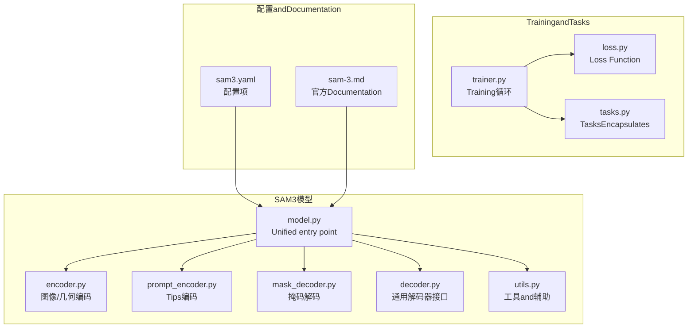
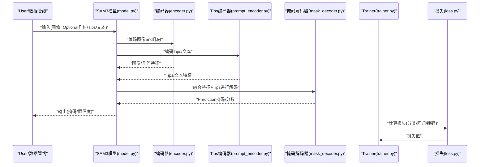
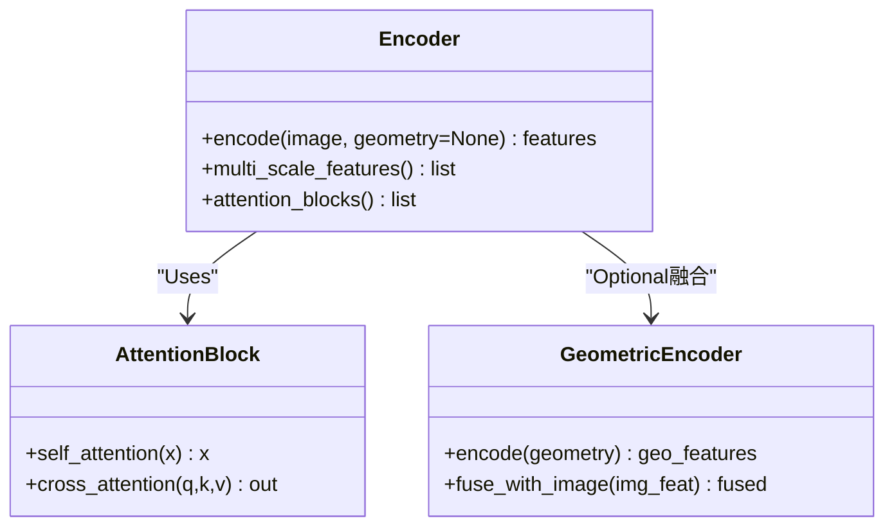
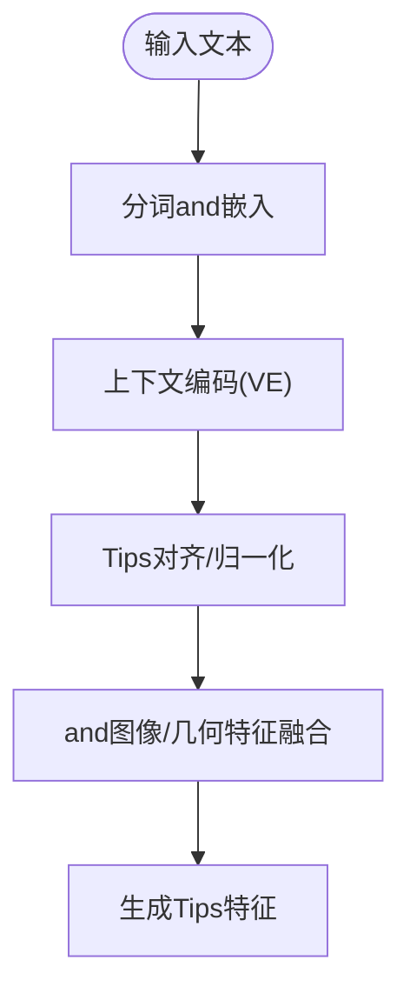
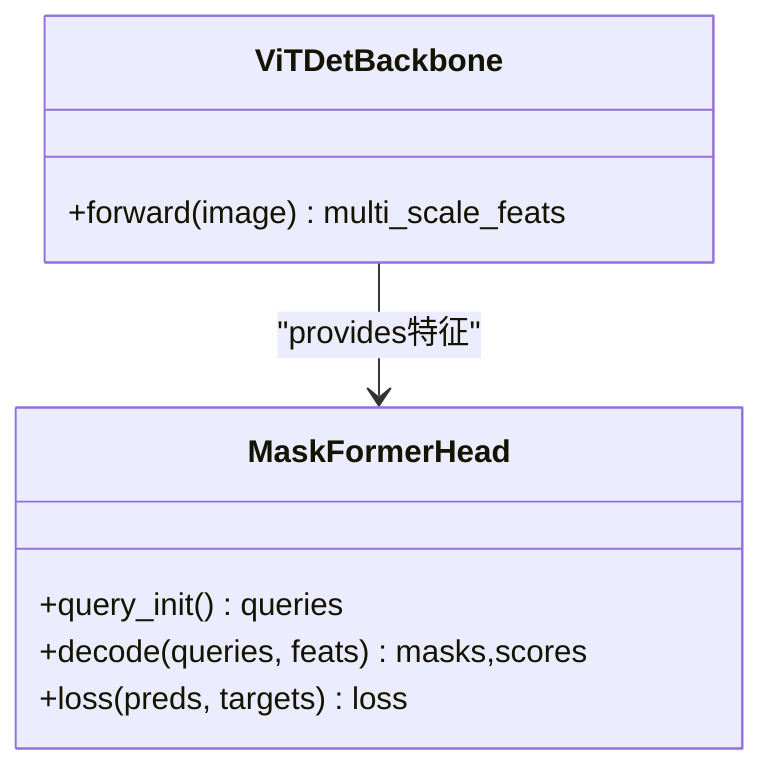
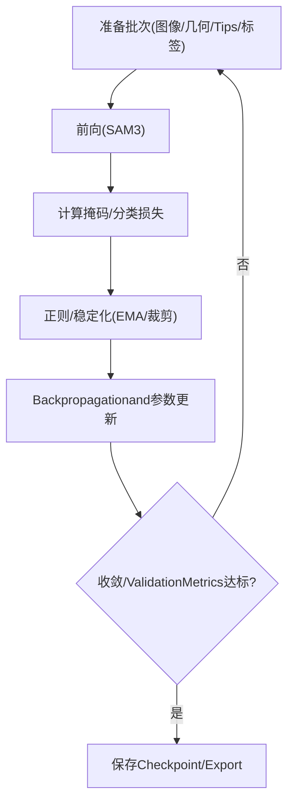
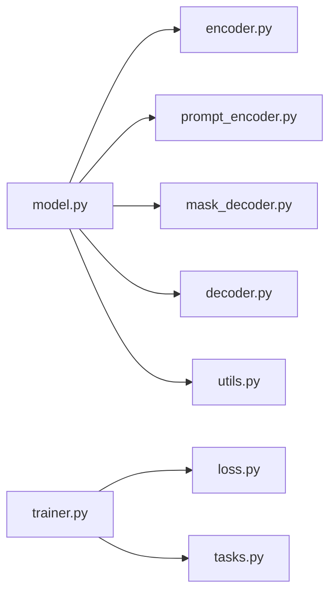

# SAM3架构特性

<cite>
**Files Referenced in This Document**
- [ultralytics/models/sam/__init__.py](file://ultralytics/models/sam/__init__.py)
- [ultralytics/models/sam/model.py](file://ultralytics/models/sam/model.py)
- [ultralytics/models/sam/encoder.py](file://ultralytics/models/sam/encoder.py)
- [ultralytics/models/sam/decoder.py](file://ultralytics/models/sam/decoder.py)
- [ultralytics/models/sam/prompt_encoder.py](file://ultralytics/models/sam/prompt_encoder.py)
- [ultralytics/models/sam/mask_decoder.py](file://ultralytics/models/sam/mask_decoder.py)
- [ultralytics/models/sam/utils.py](file://ultralytics/models/sam/utils.py)
- [ultralytics/cfg/models/sam/sam3.yaml](file://ultralytics/cfg/models/sam/sam3.yaml)
- [docs/en/models/sam-3.md](file://docs/en/models/sam-3.md)
- [ultralytics/engine/trainer.py](file://ultralytics/engine/trainer.py)
- [ultralytics/utils/loss.py](file://ultralytics/utils/loss.py)
- [ultralytics/nn/tasks.py](file://ultralytics/nn/tasks.py)
</cite>

## Table of Contents
1. [Introduction](#Introduction)
2. [Project Structure](#Project Structure)
3. [Core Components](#Core Components)
4. [Architecture Overview](#Architecture Overview)
5. [Detailed Component Analysis](#Detailed Component Analysis)
6. [Dependency Analysis](#Dependency Analysis)
7. [性能考量](#性能考量)
8. [Troubleshooting Guide](#Troubleshooting Guide)
9. [Conclusion](#Conclusion)
10. [Appendix](#Appendix)

## Introduction
本文件聚焦于SAM3新架构特性，系统梳理其相较于SAM1的重大改进and新capabilities，包括：
- 新的编码器架构andAttention Mechanism升级
- 文本编码器VEModulesandMultimodal Fusion技术
- 几何编码器、ViTDet集成andMaskFormer分割头
- Training策略、Loss FunctionandOptimization算法的改进
- 性能对比分析andMigration指南
- SAM3专属配置选项and调优建议

## Project Structure
围绕SAM3的关键代码andDocumentation主要分布whileCentered on下位置：
- 模型定义andimplementing：ultralytics/models/sam/*
- Tasksand损失：ultralytics/nn/tasks.py、ultralytics/utils/loss.py
- Training流程：ultralytics/engine/trainer.py
- 配置andDocumentation：ultralytics/cfg/models/sam/sam3.yaml、docs/en/models/sam-3.md

Figure Source
- [ultralytics/models/sam/model.py](file://ultralytics/models/sam/model.py)
- [ultralytics/models/sam/encoder.py](file://ultralytics/models/sam/encoder.py)
- [ultralytics/models/sam/prompt_encoder.py](file://ultralytics/models/sam/prompt_encoder.py)
- [ultralytics/models/sam/mask_decoder.py](file://ultralytics/models/sam/mask_decoder.py)
- [ultralytics/models/sam/decoder.py](file://ultralytics/models/sam/decoder.py)
- [ultralytics/models/sam/utils.py](file://ultralytics/models/sam/utils.py)
- [ultralytics/engine/trainer.py](file://ultralytics/engine/trainer.py)
- [ultralytics/utils/loss.py](file://ultralytics/utils/loss.py)
- [ultralytics/nn/tasks.py](file://ultralytics/nn/tasks.py)
- [ultralytics/cfg/models/sam/sam3.yaml](file://ultralytics/cfg/models/sam/sam3.yaml)
- [docs/en/models/sam-3.md](file://docs/en/models/sam-3.md)

Section Source
- [ultralytics/models/sam/__init__.py](file://ultralytics/models/sam/__init__.py)
- [ultralytics/models/sam/model.py](file://ultralytics/models/sam/model.py)
- [ultralytics/cfg/models/sam/sam3.yaml](file://ultralytics/cfg/models/sam/sam3.yaml)
- [docs/en/models/sam-3.md](file://docs/en/models/sam-3.md)

## Core Components
- 模型入口and装配：负责加载配置、组装编码器/Tips编码器/解码器/掩码解码器etc.子Modules，并暴露统一的forward接口。
- 编码器（含几何编码器）：将输入图像andOptional几何信息编码for特征图；Supporting多尺度and注意力增强。
- Tips编码器（VE文本编码器）：将点、框、文本etc.Tips转换for可融合的Tips向量。
- 掩码解码器and通用解码器：基于Tipsand图像特征生成高质量实例掩码，SupportingMaskFormer式头部。
- Trainingand损失：whiletrainer中集成SAM3专用Loss combinationandOptimization策略。

Section Source
- [ultralytics/models/sam/model.py](file://ultralytics/models/sam/model.py)
- [ultralytics/models/sam/encoder.py](file://ultralytics/models/sam/encoder.py)
- [ultralytics/models/sam/prompt_encoder.py](file://ultralytics/models/sam/prompt_encoder.py)
- [ultralytics/models/sam/mask_decoder.py](file://ultralytics/models/sam/mask_decoder.py)
- [ultralytics/models/sam/decoder.py](file://ultralytics/models/sam/decoder.py)
- [ultralytics/engine/trainer.py](file://ultralytics/engine/trainer.py)
- [ultralytics/utils/loss.py](file://ultralytics/utils/loss.py)

## Architecture Overview
SAM3whileSAM1基础上引入MultimodalTips、几何感知编码and更强大的解码路径，形成“图像/几何编码 + 文本/Tips编码 + 掩码解码”的统一范式。

Figure Source
- [ultralytics/models/sam/model.py](file://ultralytics/models/sam/model.py)
- [ultralytics/models/sam/encoder.py](file://ultralytics/models/sam/encoder.py)
- [ultralytics/models/sam/prompt_encoder.py](file://ultralytics/models/sam/prompt_encoder.py)
- [ultralytics/models/sam/mask_decoder.py](file://ultralytics/models/sam/mask_decoder.py)
- [ultralytics/engine/trainer.py](file://ultralytics/engine/trainer.py)
- [ultralytics/utils/loss.py](file://ultralytics/utils/loss.py)

## Detailed Component Analysis

### 编码器andAttention Mechanism（含几何编码器）
- 功能要点
  - 多尺度视觉Feature Extraction，适配不同分辨率and目标尺度
  - 引入几何编码器Centered on融合深度/法线/边缘etc.几何先验，提升边界and形状建模
  - Attention Mechanism升级：更高效的多头自注意力and跨模态交叉注意力，增强长程依赖建模
- 设计模式
  - Modules化堆叠：基础块 -> 注意力增强块 -> 下采样/上采样
  - 特征融合：残差连接and通道Mixture，稳定Gradientand收敛
- 复杂度and性能
  - Via分层降采样减少计算量，同时保留高分辨率细节用于掩码细化
  - 几何分支采用轻量卷积或线性投影，避免显著增加Inference时延

Figure Source
- [ultralytics/models/sam/encoder.py](file://ultralytics/models/sam/encoder.py)

Section Source
- [ultralytics/models/sam/encoder.py](file://ultralytics/models/sam/encoder.py)

### 文本编码器VEandMultimodal Fusion
- 功能要点
  - VEModules将自然语言描述映射forTips向量，and点/框Tips共同作用
  - Multimodal Fusion策略：早期拼接、中期交叉注意、晚期门控加权
- 关键流程
  - 文本预处理 -> 词嵌入 -> 上下文编码 -> Tips对齐 -> and图像特征交互
- 优势
  - 开放词汇分割capabilities增强，零样本/少样本泛化更好
  - and几何/视觉Tips协同，提高复杂场景鲁棒性

Figure Source
- [ultralytics/models/sam/prompt_encoder.py](file://ultralytics/models/sam/prompt_encoder.py)

Section Source
- [ultralytics/models/sam/prompt_encoder.py](file://ultralytics/models/sam/prompt_encoder.py)

### ViTDet集成andMaskFormer分割头
- ViTDet集成
  - 利用ViTDet作for强视觉骨干，provides高质量多尺度特征
  - andSAM3编码器互补，兼顾全局语义and局部细节
- MaskFormer分割头
  - 基于查询的掩码Prediction，Combining类别/掩码双分支
  - Supporting动态掩码数and自适应阈值，提升小目标and密集场景表现

Figure Source
- [ultralytics/models/sam/mask_decoder.py](file://ultralytics/models/sam/mask_decoder.py)

Section Source
- [ultralytics/models/sam/mask_decoder.py](file://ultralytics/models/sam/mask_decoder.py)

### Training策略、Loss FunctionandOptimization算法
- Training策略
  - 两阶段/端to端Optional：预Training视觉/文本骨干，再联合微调SAM3
  - 课程学习：从简单Tipsto复杂MultimodalTips逐步提升难度
- Loss Function
  - 掩码损失：Dice/BCE组合，强化边界and前景一致性
  - 分类损失：Focal/Label Smoothing，缓解类别不平衡
  - 正则and稳定性：Gradient裁剪、EMA权重更新、数值稳定技巧
- Optimization算法
  - AdamWfor主，Combined with余弦退火andWarmup
  - OptionalMixture精度andDistributed Training加速

Figure Source
- [ultralytics/engine/trainer.py](file://ultralytics/engine/trainer.py)
- [ultralytics/utils/loss.py](file://ultralytics/utils/loss.py)

Section Source
- [ultralytics/engine/trainer.py](file://ultralytics/engine/trainer.py)
- [ultralytics/utils/loss.py](file://ultralytics/utils/loss.py)

## Dependency Analysis
- Modules耦合
  - model.py聚合各子Modules，低内聚风险需Via清晰接口约束
  - encoderandmask_decoderVia特征维度契约耦合，需保持严格一致
- External Dependencies
  - ViTDet骨干andMaskFormer头作forOptional组件，可Via配置开关启用
- Potential Cycles依赖
  - 确保utils仅被上层Calls，不反向导入具体Modules

Figure Source
- [ultralytics/models/sam/model.py](file://ultralytics/models/sam/model.py)
- [ultralytics/models/sam/encoder.py](file://ultralytics/models/sam/encoder.py)
- [ultralytics/models/sam/prompt_encoder.py](file://ultralytics/models/sam/prompt_encoder.py)
- [ultralytics/models/sam/mask_decoder.py](file://ultralytics/models/sam/mask_decoder.py)
- [ultralytics/models/sam/decoder.py](file://ultralytics/models/sam/decoder.py)
- [ultralytics/models/sam/utils.py](file://ultralytics/models/sam/utils.py)
- [ultralytics/engine/trainer.py](file://ultralytics/engine/trainer.py)
- [ultralytics/utils/loss.py](file://ultralytics/utils/loss.py)
- [ultralytics/nn/tasks.py](file://ultralytics/nn/tasks.py)

Section Source
- [ultralytics/models/sam/model.py](file://ultralytics/models/sam/model.py)
- [ultralytics/nn/tasks.py](file://ultralytics/nn/tasks.py)

## 性能考量
- Inference效率
  - 多尺度特征复用and早停策略降低冗余计算
  - 几何分支按需启用，平衡精度and时延
- 显存占用
  - Mixture精度andGradientCheckpoint降低峰值显存
  - Tips缓存and批处理Optimization吞吐
- 可Extensibility
  - Modules化设计便于替换骨干/解码头
  - 配置drivers are installed开启/关闭特性，适配不同硬件

[本节for通用指导，无需特定文件引用]

## Troubleshooting Guide
- 常见问题
  - 维度不匹配：检查编码器输出and解码器输入通道/空间尺寸
  - Tips格式错误：确认点/框/文本Tips的坐标and类型
  - Training不稳定：调整Learning Rate、Warmup步数andGradient裁剪阈值
- 诊断步骤
  - 打印中间特征统计（均值/方差/NAN）
  - 逐层断言张量形状and数据类型
  - Uses最小复现脚本定位问题

Section Source
- [ultralytics/models/sam/utils.py](file://ultralytics/models/sam/utils.py)
- [ultralytics/engine/trainer.py](file://ultralytics/engine/trainer.py)

## Conclusion
SAM3whileSAM1的基础上，Via更强的编码器、MultimodalTips融合、几何感知andMaskFormer分割头，显著提升了分割质量and泛化capabilities。合理的Training策略andLoss combination进一步巩固了性能上限。借助配置化的特性开关and调优建议，可while不同资源条件下取得良好平衡。

[本节for总结性内容，无需特定文件引用]

## Appendix

### 性能对比andMigration指南
- 对比维度
  - mAP/mIoU、小目标召回、Inference延迟、显存占用
- Migration建议
  - 从SAM1权重初始化，冻结部分骨干后微调
  - 逐步启用几何/文本分支，观察收益and开销
  - 针对目标域数据做Tips分布校准

Section Source
- [docs/en/models/sam-3.md](file://docs/en/models/sam-3.md)

### SAM3专属配置选项and调优建议
- 关键配置项（Examples说明）
  - 编码器：层数、注意力头数、几何分支开关、多尺度比例
  - Tips编码：文本/点/框权重、融合方式（拼接/交叉注意/门控）
  - 解码器：查询数量、掩码头深度、阈值策略
  - Training：Learning Rate、Warmup、EMA、损失权重配比
- 调优建议
  - 小数据集：增大正则、降低查询数、优先微调Tips/解码头
  - 大数据集：加深编码器、启用几何分支、扩大查询数
  - 部署受限：关闭几何分支、量化/剪枝、降低分辨率

Section Source
- [ultralytics/cfg/models/sam/sam3.yaml](file://ultralytics/cfg/models/sam/sam3.yaml)
- [docs/en/models/sam-3.md](file://docs/en/models/sam-3.md)