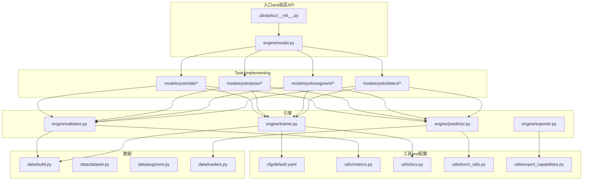
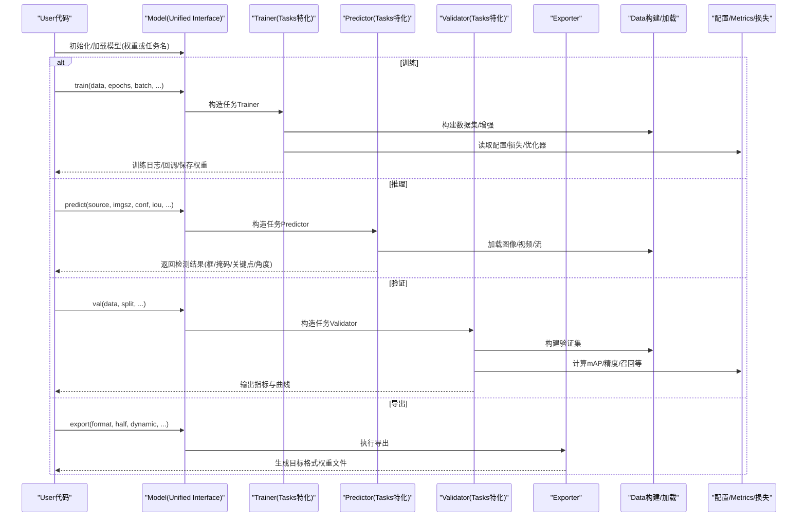
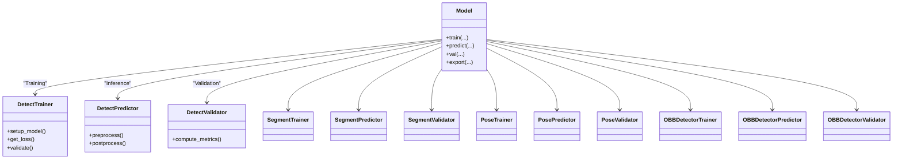
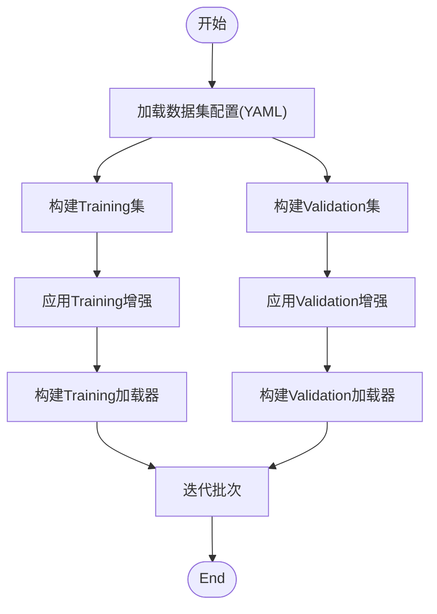
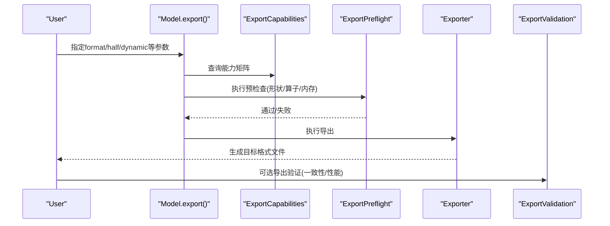
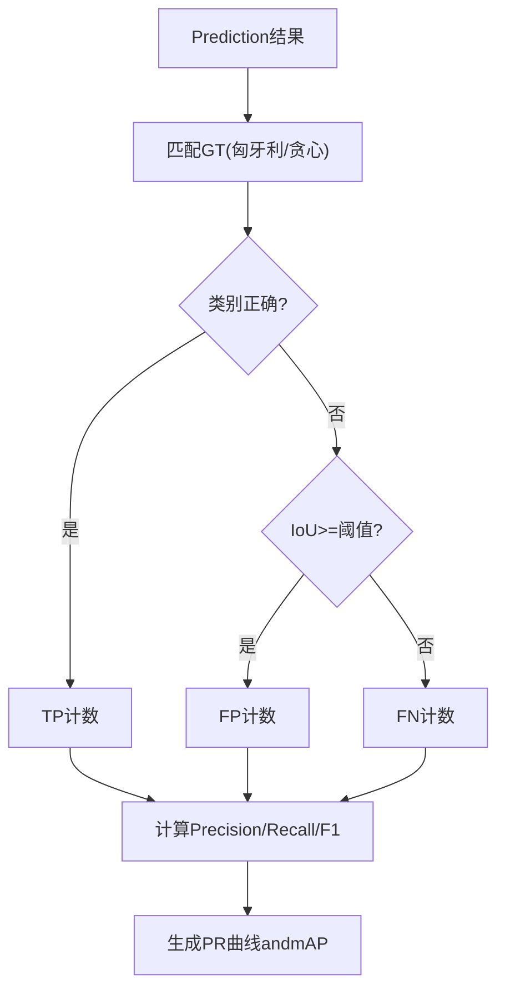
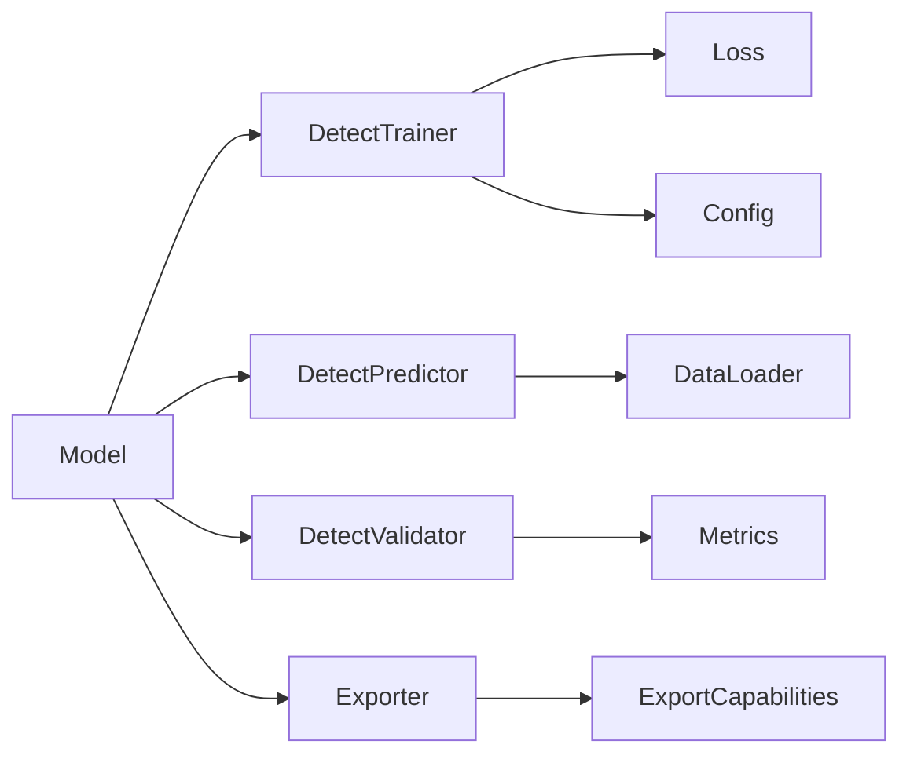

# YOLOModel API

<cite>
**Files Referenced in This Document**
- [ultralytics/__init__.py](file://ultralytics/__init__.py)
- [ultralytics/engine/model.py](file://ultralytics/engine/model.py)
- [ultralytics/engine/trainer.py](file://ultralytics/engine/trainer.py)
- [ultralytics/engine/predictor.py](file://ultralytics/engine/predictor.py)
- [ultralytics/engine/validator.py](file://ultralytics/engine/validator.py)
- [ultralytics/engine/exporter.py](file://ultralytics/engine/exporter.py)
- [ultralytics/models/yolo/model.py](file://ultralytics/models/yolo/model.py)
- [ultralytics/models/yolo/detect/trainer.py](file://ultralytics/models/yolo/detect/trainer.py)
- [ultralytics/models/yolo/detect/predictor.py](file://ultralytics/models/yolo/detect/predictor.py)
- [ultralytics/models/yolo/detect/val.py](file://ultralytics/models/yolo/detect/val.py)
- [ultralytics/models/yolo/segment/trainer.py](file://ultralytics/models/yolo/segment/trainer.py)
- [ultralytics/models/yolo/segment/predictor.py](file://ultralytics/models/yolo/segment/predictor.py)
- [ultralytics/models/yolo/segment/val.py](file://ultralytics/models/yolo/segment/val.py)
- [ultralytics/models/yolo/pose/trainer.py](file://ultralytics/models/yolo/pose/trainer.py)
- [ultralytics/models/yolo/pose/predictor.py](file://ultralytics/models/yolo/pose/predictor.py)
- [ultralytics/models/yolo/pose/val.py](file://ultralytics/models/yolo/pose/val.py)
- [ultralytics/models/yolo/obb/trainer.py](file://ultralytics/models/yolo/obb/trainer.py)
- [ultralytics/models/yolo/obb/predictor.py](file://ultralytics/models/yolo/obb/predictor.py)
- [ultralytics/models/yolo/obb/val.py](file://ultralytics/models/yolo/obb/val.py)
- [ultralytics/cfg/default.yaml](file://ultralytics/cfg/default.yaml)
- [ultralytics/utils/metrics.py](file://ultralytics/utils/metrics.py)
- [ultralytics/utils/loss.py](file://ultralytics/utils/loss.py)
- [ultralytics/utils/torch_utils.py](file://ultralytics/utils/torch_utils.py)
- [ultralytics/utils/checkpoint_compat.py](file://ultralytics/utils/checkpoint_compat.py)
- [ultralytics/utils/export_capabilities.py](file://ultralytics/utils/export_capabilities.py)
- [ultralytics/utils/export_preflight.py](file://ultralytics/utils/export_preflight.py)
- [ultralytics/utils/export_validation.py](file://ultralytics/utils/export_validation.py)
- [ultralytics/data/build.py](file://ultralytics/data/build.py)
- [ultralytics/data/base.py](file://ultralytics/data/base.py)
- [ultralytics/data/augment.py](file://ultralytics/data/augment.py)
- [ultralytics/data/dataset.py](file://ultralytics/data/dataset.py)
- [ultralytics/data/loaders.py](file://ultralytics/data/loaders.py)
- [ultralytics/data/annotator.py](file://ultralytics/data/annotator.py)
- [ultralytics/data/converter.py](file://ultralytics/data/converter.py)
- [ultralytics/data/split.py](file://ultralytics/data/split.py)
- [ultralytics/data/split_dota.py](file://ultralytics/data/split_dota.py)
- [ultralytics/data/utils.py](file://ultralytics/data/utils.py)
- [ultralytics/nn/tasks.py](file://ultralytics/nn/tasks.py)
- [ultralytics/nn/autobackend.py](file://ultralytics/nn/autobackend.py)
- [ultralytics/nn/mixture_loss.py](file://ultralytics/nn/mixture_loss.py)
- [ultralytics/nn/mixture_registry.py](file://ultralytics/nn/mixture_registry.py)
- [ultralytics/nn/text_model.py](file://ultralytics/nn/text_model.py)
- [ultralytics/optim/muon.py](file://ultralytics/optim/muon.py)
- [ultralytics/hub/session.py](file://ultralytics/hub/session.py)
- [ultralytics/hub/auth.py](file://ultralytics/hub/auth.py)
- [ultralytics/hub/utils.py](file://ultralytics/hub/utils.py)
- [examples/tutorial.ipynb](file://examples/tutorial.ipynb)
- [examples/object_counting.ipynb](file://examples/object_counting.ipynb)
- [examples/object_tracking.ipynb](file://examples/object_tracking.ipynb)
- [examples/hub.ipynb](file://examples/hub.ipynb)
- [scripts/smoke_test_coco2017.py](file://scripts/smoke_test_coco2017.py)
- [scripts/quick_train_verify.py](file://scripts/quick_train_verify.py)
</cite>

## Table of Contents
1. [Introduction](#Introduction)
2. [Project Structure](#Project Structure)
3. [Core Components](#Core Components)
4. [Architecture Overview](#Architecture Overview)
5. [Detailed Component Analysis](#Detailed Component Analysis)
6. [Dependency Analysis](#Dependency Analysis)
7. [性能and最佳实践](#性能and最佳实践)
8. [Troubleshooting Guide](#Troubleshooting Guide)
9. [Conclusion](#Conclusion)
10. [Appendix：Tasksand配置Refer to](#AppendixTasksand配置Refer to)

## Introduction
本文件targetingUsesYOLO Series Models的开发者，系统化梳理YOLOv8、YOLOv10、YOLOv11、YOLOv12etc.模型的Python接口规范，覆盖模型初始化、Training、Inference、Export全流程；详细说明检测、分割、Pose Estimation、旋转Object Detection（OBB）etc.不同Tasks的APIUses方法；解释模型配置文件结构and参数含义（网络架构、Loss Function、Optimizer设置）；说明权重加载and保存接口；provides批量处理and实时Inference的最佳实践；并给出EvaluationMetrics计算方法and结果解析。Documentation同时包含自定义数据集的Training流程and配置方法，帮助读者快速上手and深入定制。

## Project Structure
The repository adopts a modular layered organization：
- ultralytics：Core Library，包含模型定义、引擎（Training/Validation/Prediction/Export）、数据管线、工具集、Tracking器、解决方案etc.。
- models/yolo：按Tasks划分的YOLOimplementing（detect/segment/pose/obb），各自包含trainer/predictor/val。
- engine：通用Training/Validation/Prediction/Export引擎，Encapsulates生命周期and设备管理。
- data：Data Loading、增强、格式转换、切分etc.。
- nn：网络Modules、Tasks头、Mixture专家相关、文本模型etc.。
- utils：Metrics、损失、Exportcapabilities、预检、Validation、Torch工具、分布式、Loggingetc.。
- cfg：默认配置and数据集/模型配置。
- examples：教程andExamples脚本。
- scripts：复现、Validation、基准脚本。

Figure Source
- [ultralytics/__init__.py](file://ultralytics/__init__.py)
- [ultralytics/engine/model.py](file://ultralytics/engine/model.py)
- [ultralytics/models/yolo/detect/trainer.py](file://ultralytics/models/yolo/detect/trainer.py)
- [ultralytics/models/yolo/segment/trainer.py](file://ultralytics/models/yolo/segment/trainer.py)
- [ultralytics/models/yolo/pose/trainer.py](file://ultralytics/models/yolo/pose/trainer.py)
- [ultralytics/models/yolo/obb/trainer.py](file://ultralytics/models/yolo/obb/trainer.py)
- [ultralytics/engine/trainer.py](file://ultralytics/engine/trainer.py)
- [ultralytics/engine/predictor.py](file://ultralytics/engine/predictor.py)
- [ultralytics/engine/validator.py](file://ultralytics/engine/validator.py)
- [ultralytics/engine/exporter.py](file://ultralytics/engine/exporter.py)
- [ultralytics/data/build.py](file://ultralytics/data/build.py)
- [ultralytics/data/dataset.py](file://ultralytics/data/dataset.py)
- [ultralytics/data/augment.py](file://ultralytics/data/augment.py)
- [ultralytics/data/loaders.py](file://ultralytics/data/loaders.py)
- [ultralytics/cfg/default.yaml](file://ultralytics/cfg/default.yaml)
- [ultralytics/utils/metrics.py](file://ultralytics/utils/metrics.py)
- [ultralytics/utils/loss.py](file://ultralytics/utils/loss.py)
- [ultralytics/utils/export_capabilities.py](file://ultralytics/utils/export_capabilities.py)

Section Source
- [ultralytics/__init__.py](file://ultralytics/__init__.py)
- [ultralytics/engine/model.py](file://ultralytics/engine/model.py)
- [ultralytics/cfg/default.yaml](file://ultralytics/cfg/default.yaml)

## Core Components
- 统一模型接口：Via高层API创建/Load model，自动识别Tasks类型（检测/分割/姿态/OBB），并providestrain/predict/val/exportetc.方法。
- Tasks特定Trainer/Predictor/Validator：不同Tasks继承通用引擎，注入Tasks特定的损失、Metrics、Post-Processing逻辑。
- 数据管线：Supporting多种标注格式and数据集结构，Built-in增强策略，适配多尺度and批处理。
- Export系统：将PyTorchModel ExportforONNX/TensorRT/OpenVINO/TFLiteetc.，具备capabilities矩阵and预检查。
- 工具and配置：默认配置、Metrics计算、Loss Function、Torch工具、权重兼容etc.。

Section Source
- [ultralytics/engine/model.py](file://ultralytics/engine/model.py)
- [ultralytics/models/yolo/detect/trainer.py](file://ultralytics/models/yolo/detect/trainer.py)
- [ultralytics/models/yolo/segment/trainer.py](file://ultralytics/models/yolo/segment/trainer.py)
- [ultralytics/models/yolo/pose/trainer.py](file://ultralytics/models/yolo/pose/trainer.py)
- [ultralytics/models/yolo/obb/trainer.py](file://ultralytics/models/yolo/obb/trainer.py)
- [ultralytics/engine/trainer.py](file://ultralytics/engine/trainer.py)
- [ultralytics/engine/predictor.py](file://ultralytics/engine/predictor.py)
- [ultralytics/engine/validator.py](file://ultralytics/engine/validator.py)
- [ultralytics/engine/exporter.py](file://ultralytics/engine/exporter.py)
- [ultralytics/data/build.py](file://ultralytics/data/build.py)
- [ultralytics/utils/metrics.py](file://ultralytics/utils/metrics.py)
- [ultralytics/utils/loss.py](file://ultralytics/utils/loss.py)
- [ultralytics/utils/export_capabilities.py](file://ultralytics/utils/export_capabilities.py)

## Architecture Overview
下图展示从UserCallsto具体Tasksimplementing的端to端流程，包括Training、Inference、ValidationandExport。

Figure Source
- [ultralytics/engine/model.py](file://ultralytics/engine/model.py)
- [ultralytics/engine/trainer.py](file://ultralytics/engine/trainer.py)
- [ultralytics/engine/predictor.py](file://ultralytics/engine/predictor.py)
- [ultralytics/engine/validator.py](file://ultralytics/engine/validator.py)
- [ultralytics/engine/exporter.py](file://ultralytics/engine/exporter.py)
- [ultralytics/data/build.py](file://ultralytics/data/build.py)
- [ultralytics/utils/metrics.py](file://ultralytics/utils/metrics.py)
- [ultralytics/utils/loss.py](file://ultralytics/utils/loss.py)

## Detailed Component Analysis

### 统一模型接口（Model）
- 职责：对外暴露统一的初始化、Training、Inference、Validation、Export接口；内部根据Tasks类型路由至对应Trainer/Predictor/Validator。
- 关键capabilities：
  - 模型初始化and权重加载：Supporting从本地路径或Tasks名称加载，自动选择Tasksand配置。
  - Training：EncapsulatesTrainer生命周期，Supporting断点续训、回调、Logging。
  - Inference：EncapsulatesPredictor，Supporting单图/视频/流、动态尺寸、置信度/NMS阈值控制。
  - Validation：EncapsulatesValidator，输出mAP、PR曲线、混淆矩阵etc.。
  - Export：EncapsulatesExporter，CombiningExportcapabilities矩阵and预检查，生成目标格式。
- 典型Calls路径：
  - 初始化/加载：[ultralytics/engine/model.py](file://ultralytics/engine/model.py)
  - Training入口：[ultralytics/engine/trainer.py](file://ultralytics/engine/trainer.py)
  - Inference入口：[ultralytics/engine/predictor.py](file://ultralytics/engine/predictor.py)
  - Validation入口：[ultralytics/engine/validator.py](file://ultralytics/engine/validator.py)
  - Export入口：[ultralytics/engine/exporter.py](file://ultralytics/engine/exporter.py)

Section Source
- [ultralytics/engine/model.py](file://ultralytics/engine/model.py)
- [ultralytics/engine/trainer.py](file://ultralytics/engine/trainer.py)
- [ultralytics/engine/predictor.py](file://ultralytics/engine/predictor.py)
- [ultralytics/engine/validator.py](file://ultralytics/engine/validator.py)
- [ultralytics/engine/exporter.py](file://ultralytics/engine/exporter.py)

### Tasks特化组件（Detect/Segment/Pose/OBB）
- 检测（Detect）
  - Trainer：定义检测损失、Training循环、Metrics计算。
  - Predictor：前向+Post-Processing（NMS、置信度过滤）。
  - Validator：计算mAP、PR曲线、混淆矩阵。
- Instance Segmentation（Segment）
  - while检测基础上增加掩码分支and掩码损失。
- Pose Estimation（Pose）
  - while检测基础上增加关键点分支and关键点损失。
- 旋转Object Detection（OBB）
  - while检测基础上引入角度回归and旋转NMS。

Figure Source
- [ultralytics/models/yolo/detect/trainer.py](file://ultralytics/models/yolo/detect/trainer.py)
- [ultralytics/models/yolo/detect/predictor.py](file://ultralytics/models/yolo/detect/predictor.py)
- [ultralytics/models/yolo/detect/val.py](file://ultralytics/models/yolo/detect/val.py)
- [ultralytics/models/yolo/segment/trainer.py](file://ultralytics/models/yolo/segment/trainer.py)
- [ultralytics/models/yolo/segment/predictor.py](file://ultralytics/models/yolo/segment/predictor.py)
- [ultralytics/models/yolo/segment/val.py](file://ultralytics/models/yolo/segment/val.py)
- [ultralytics/models/yolo/pose/trainer.py](file://ultralytics/models/yolo/pose/trainer.py)
- [ultralytics/models/yolo/pose/predictor.py](file://ultralytics/models/yolo/pose/predictor.py)
- [ultralytics/models/yolo/pose/val.py](file://ultralytics/models/yolo/pose/val.py)
- [ultralytics/models/yolo/obb/trainer.py](file://ultralytics/models/yolo/obb/trainer.py)
- [ultralytics/models/yolo/obb/predictor.py](file://ultralytics/models/yolo/obb/predictor.py)
- [ultralytics/models/yolo/obb/val.py](file://ultralytics/models/yolo/obb/val.py)

Section Source
- [ultralytics/models/yolo/detect/trainer.py](file://ultralytics/models/yolo/detect/trainer.py)
- [ultralytics/models/yolo/segment/trainer.py](file://ultralytics/models/yolo/segment/trainer.py)
- [ultralytics/models/yolo/pose/trainer.py](file://ultralytics/models/yolo/pose/trainer.py)
- [ultralytics/models/yolo/obb/trainer.py](file://ultralytics/models/yolo/obb/trainer.py)

### 数据管线（Data Build/Augment/Loaders）
- 数据构建：根据数据集配置文件（such asYAML）构建Training/Validation/测试集，Supporting多格式标注。
- Data Augmentation：Built-in几何and色彩增强，SupportingMosaic、MixUp、随机裁剪、缩放etc.。
- Data Loading：高效迭代器，Supporting多进程、缓存、动态尺寸。
- 标注转换：provides常见格式（COCO/VOC/YOLO）之间的转换工具。
- 切分：Supporting常规切分andDOTAetc.遥感数据集的瓦片切分。

Figure Source
- [ultralytics/data/build.py](file://ultralytics/data/build.py)
- [ultralytics/data/augment.py](file://ultralytics/data/augment.py)
- [ultralytics/data/loaders.py](file://ultralytics/data/loaders.py)
- [ultralytics/data/dataset.py](file://ultralytics/data/dataset.py)
- [ultralytics/data/converter.py](file://ultralytics/data/converter.py)
- [ultralytics/data/split.py](file://ultralytics/data/split.py)
- [ultralytics/data/split_dota.py](file://ultralytics/data/split_dota.py)

Section Source
- [ultralytics/data/build.py](file://ultralytics/data/build.py)
- [ultralytics/data/augment.py](file://ultralytics/data/augment.py)
- [ultralytics/data/loaders.py](file://ultralytics/data/loaders.py)
- [ultralytics/data/dataset.py](file://ultralytics/data/dataset.py)
- [ultralytics/data/converter.py](file://ultralytics/data/converter.py)
- [ultralytics/data/split.py](file://ultralytics/data/split.py)
- [ultralytics/data/split_dota.py](file://ultralytics/data/split_dota.py)

### Export系统（Exporterandcapabilities矩阵）
- capabilities矩阵：声明各模型对Export格式的Supporting情况（such asONNX/TensorRT/OpenVINO/TFLite）。
- 预检查：whileExport前进行兼容性检查（输入形状、算子Supporting、内存需求）。
- Export流程：PyTorch -> 中间表示 -> 目标后端Optimizationand序列化。
- Validation：Export后校验数值一致性and时延/吞吐对比。

Figure Source
- [ultralytics/engine/exporter.py](file://ultralytics/engine/exporter.py)
- [ultralytics/utils/export_capabilities.py](file://ultralytics/utils/export_capabilities.py)
- [ultralytics/utils/export_preflight.py](file://ultralytics/utils/export_preflight.py)
- [ultralytics/utils/export_validation.py](file://ultralytics/utils/export_validation.py)

Section Source
- [ultralytics/engine/exporter.py](file://ultralytics/engine/exporter.py)
- [ultralytics/utils/export_capabilities.py](file://ultralytics/utils/export_capabilities.py)
- [ultralytics/utils/export_preflight.py](file://ultralytics/utils/export_preflight.py)
- [ultralytics/utils/export_validation.py](file://ultralytics/utils/export_validation.py)

### Metricsand损失（Metrics/Loss）
- Metrics：mAP@IoU=0.50~0.95、Precision、Recall、F1、混淆矩阵、PR曲线etc.。
- 损失：分类损失、定位损失、掩码损失、关键点损失、旋转损失etc.，Supporting组合and权重调节。
- Torch工具：Mixture精度、Gradient累积、分布式通信etc.。

Figure Source
- [ultralytics/utils/metrics.py](file://ultralytics/utils/metrics.py)
- [ultralytics/utils/loss.py](file://ultralytics/utils/loss.py)
- [ultralytics/utils/torch_utils.py](file://ultralytics/utils/torch_utils.py)

Section Source
- [ultralytics/utils/metrics.py](file://ultralytics/utils/metrics.py)
- [ultralytics/utils/loss.py](file://ultralytics/utils/loss.py)
- [ultralytics/utils/torch_utils.py](file://ultralytics/utils/torch_utils.py)

## Dependency Analysis
- 耦合and内聚：
  - Unified InterfaceandTasks特化组件之间松耦合，Via工厂/Routing Mechanism解耦。
  - 数据管线andTasks组件Via抽象接口交互，便于替换增强策略and加载器。
- External Dependencies：
  - PyTorch生态（TorchScript/ONNX/TensorRT/OpenVINO/TFLite）。
  - VisualizationandLogging（TensorBoard/CSV/JSON）。
- Potential Cycles依赖：
  - 避免whileTasks组件中直接导入上层Unified Interface，应Via回调/事件机制解耦。

Figure Source
- [ultralytics/engine/model.py](file://ultralytics/engine/model.py)
- [ultralytics/models/yolo/detect/trainer.py](file://ultralytics/models/yolo/detect/trainer.py)
- [ultralytics/models/yolo/detect/predictor.py](file://ultralytics/models/yolo/detect/predictor.py)
- [ultralytics/models/yolo/detect/val.py](file://ultralytics/models/yolo/detect/val.py)
- [ultralytics/utils/loss.py](file://ultralytics/utils/loss.py)
- [ultralytics/cfg/default.yaml](file://ultralytics/cfg/default.yaml)
- [ultralytics/data/loaders.py](file://ultralytics/data/loaders.py)
- [ultralytics/utils/metrics.py](file://ultralytics/utils/metrics.py)
- [ultralytics/engine/exporter.py](file://ultralytics/engine/exporter.py)
- [ultralytics/utils/export_capabilities.py](file://ultralytics/utils/export_capabilities.py)

Section Source
- [ultralytics/engine/model.py](file://ultralytics/engine/model.py)
- [ultralytics/models/yolo/detect/trainer.py](file://ultralytics/models/yolo/detect/trainer.py)
- [ultralytics/models/yolo/detect/predictor.py](file://ultralytics/models/yolo/detect/predictor.py)
- [ultralytics/models/yolo/detect/val.py](file://ultralytics/models/yolo/detect/val.py)
- [ultralytics/utils/loss.py](file://ultralytics/utils/loss.py)
- [ultralytics/cfg/default.yaml](file://ultralytics/cfg/default.yaml)
- [ultralytics/data/loaders.py](file://ultralytics/data/loaders.py)
- [ultralytics/utils/metrics.py](file://ultralytics/utils/metrics.py)
- [ultralytics/engine/exporter.py](file://ultralytics/engine/exporter.py)
- [ultralytics/utils/export_capabilities.py](file://ultralytics/utils/export_capabilities.py)

## 性能and最佳实践
- 批量处理
  - Set appropriatelybatch sizeCentered onto balance throughput and memory usage；Uses动态尺寸时注意对齐and填充开销。
  - 启用数据预取and多进程加载，减少I/Obottlenecks。
- 实时Inference
  - 固定输入尺寸Centered on减少重分配；Uses半精度and后端Optimization（TensorRT/OpenVINO）。
  - 调整置信度andNMS阈值，降低Post-Processing耗时。
- Training加速
  - Mixture精度Training、Gradient累积、分布式并行（DDP）。
  - 选择合适的OptimizerandLearning Rate调度策略。
- ExportOptimization
  - 依据capabilities矩阵选择合适格式；Export前进行预检查and数值Validation。
  - 针对部署平台开启相应Optimization选项（such asINT8量化、静态形状）。

[This section provides general guidance and does not directly analyze specific files]

## Troubleshooting Guide
- 权重加载and保存
  - 检查权重版本and模型配置是否兼容；必要时Uses权重兼容工具进行Migration。
  - 确认保存路径权限and磁盘空间。
- Export Failure
  - 查看Exportcapabilities矩阵and预检查结果，确认算子Supportingand输入形状。
  - UsesExportValidation工具进行一致性检查。
- Training异常
  - 检查数据路径and标注格式；确认数据集配置YAML字段完整。
  - 监控损失发散andGradient爆炸，适当调整Learning Rateand正则化。
- Inference错误
  - 核对输入图像尺寸and预处理步骤；确保设备（CPU/GPU）可用。
  - 调整NMSandConfidence Threshold，避免漏检/误检。

Section Source
- [ultralytics/utils/checkpoint_compat.py](file://ultralytics/utils/checkpoint_compat.py)
- [ultralytics/utils/export_capabilities.py](file://ultralytics/utils/export_capabilities.py)
- [ultralytics/utils/export_preflight.py](file://ultralytics/utils/export_preflight.py)
- [ultralytics/utils/export_validation.py](file://ultralytics/utils/export_validation.py)
- [ultralytics/data/build.py](file://ultralytics/data/build.py)
- [ultralytics/engine/predictor.py](file://ultralytics/engine/predictor.py)
- [ultralytics/engine/trainer.py](file://ultralytics/engine/trainer.py)

## Conclusion
本文件系统化梳理了YOLO Series Models的Python接口and工程化实践，涵盖从模型初始化、Training、Inference、Export的全链路，Centered onand检测、分割、Pose Estimation、旋转Object Detection的Tasks差异。Via理解Unified InterfaceandTasks特化组件的关系、数据管线andExport系统的协作方式，并Combining性能and排错建议，读者可高效完成从原型to部署的端to端开发。

[This section is summary content and does not directly analyze specific files]

## Appendix：Tasksand配置Refer to

### 模型初始化and权重加载/保存
- 初始化/加载
  - ViaUnified Interface传入权重路径或Tasks名称，自动选择Tasksand配置。
  - Supporting从云端Hub加载（需认证and会话管理）。
- 保存
  - Training过程中定期保存checkpoint；Supporting断点续训。
  - Export时将模型转换for目标格式并保存。

Section Source
- [ultralytics/engine/model.py](file://ultralytics/engine/model.py)
- [ultralytics/hub/session.py](file://ultralytics/hub/session.py)
- [ultralytics/hub/auth.py](file://ultralytics/hub/auth.py)
- [ultralytics/hub/utils.py](file://ultralytics/hub/utils.py)

### TrainingAPIand配置
- Training入口
  - ViaUnified Interface的train方法启动Training，传入数据集配置、超参、设备、回调etc.。
- 配置文件
  - 默认配置位于默认YAML；可按Tasks覆盖网络架构、损失权重、Optimizer、Learning Rate调度etc.。
- 自定义数据集
  - 准备YAML配置文件，定义类别、路径、Training/Validation集划分；必要时Uses数据转换器进行格式转换。
  - Uses数据切分工具进行瓦片切分（such as遥感场景）。

Section Source
- [ultralytics/engine/trainer.py](file://ultralytics/engine/trainer.py)
- [ultralytics/cfg/default.yaml](file://ultralytics/cfg/default.yaml)
- [ultralytics/data/build.py](file://ultralytics/data/build.py)
- [ultralytics/data/converter.py](file://ultralytics/data/converter.py)
- [ultralytics/data/split.py](file://ultralytics/data/split.py)
- [ultralytics/data/split_dota.py](file://ultralytics/data/split_dota.py)

### InferenceAPIandPost-Processing
- Inference入口
  - ViaUnified Interface的predict方法Executing Inference，Supporting图像/视频/流输入。
- Post-Processing
  - 检测：NMS、置信度过滤、类别映射。
  - 分割：掩码解码and合成。
  - 姿态：关键点解码andVisualization。
  - OBB：旋转框解码and旋转NMS。

Section Source
- [ultralytics/engine/predictor.py](file://ultralytics/engine/predictor.py)
- [ultralytics/models/yolo/detect/predictor.py](file://ultralytics/models/yolo/detect/predictor.py)
- [ultralytics/models/yolo/segment/predictor.py](file://ultralytics/models/yolo/segment/predictor.py)
- [ultralytics/models/yolo/pose/predictor.py](file://ultralytics/models/yolo/pose/predictor.py)
- [ultralytics/models/yolo/obb/predictor.py](file://ultralytics/models/yolo/obb/predictor.py)

### ValidationAPIandMetrics解析
- Validation入口
  - ViaUnified Interface的val方法执行Validation，输出mAP、PR曲线、混淆矩阵etc.。
- Metrics计算
  - mAP@IoU范围、Precision/Recall/F1、类别级Metrics。
- 结果解析
  - CombiningVisualizationandLogging分析，定位弱类and难例。

Section Source
- [ultralytics/engine/validator.py](file://ultralytics/engine/validator.py)
- [ultralytics/utils/metrics.py](file://ultralytics/utils/metrics.py)

### ExportAPIand后端集成
- Export入口
  - ViaUnified Interface的export方法指定目标格式andOptimization选项。
- capabilitiesand预检查
  - 依据capabilities矩阵and预检查结果选择合适格式。
- Validationand部署
  - UsesExportValidation工具进行一致性检查；集成to部署框架（ONNXRuntime/TensorRT/OpenVINO/TFLite）。

Section Source
- [ultralytics/engine/exporter.py](file://ultralytics/engine/exporter.py)
- [ultralytics/utils/export_capabilities.py](file://ultralytics/utils/export_capabilities.py)
- [ultralytics/utils/export_preflight.py](file://ultralytics/utils/export_preflight.py)
- [ultralytics/utils/export_validation.py](file://ultralytics/utils/export_validation.py)

### Examplesand脚本Refer to
- 教程andExamples
  - 入门教程、对象计数、对象Tracking、HubUsesetc.。
- 快速Validation
  - COCO2017冒烟测试、快速TrainingValidation脚本。

Section Source
- [examples/tutorial.ipynb](file://examples/tutorial.ipynb)
- [examples/object_counting.ipynb](file://examples/object_counting.ipynb)
- [examples/object_tracking.ipynb](file://examples/object_tracking.ipynb)
- [examples/hub.ipynb](file://examples/hub.ipynb)
- [scripts/smoke_test_coco2017.py](file://scripts/smoke_test_coco2017.py)
- [scripts/quick_train_verify.py](file://scripts/quick_train_verify.py)