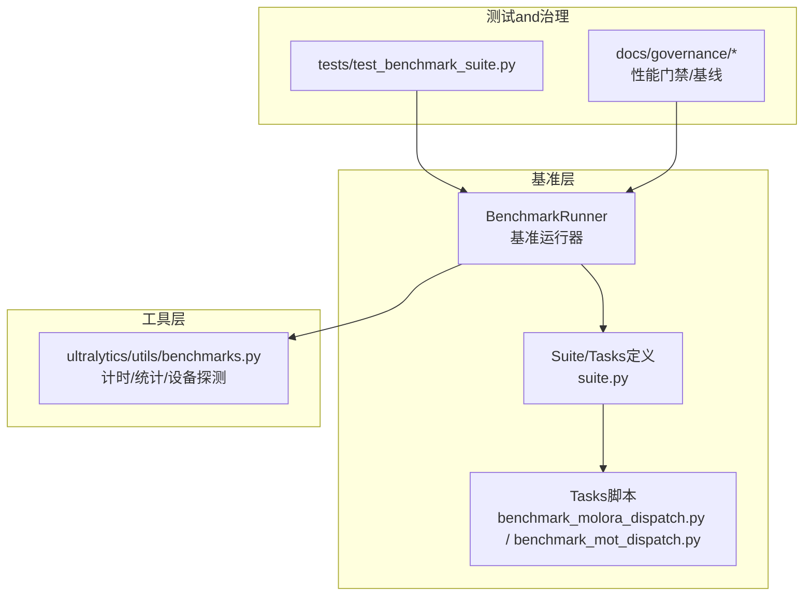
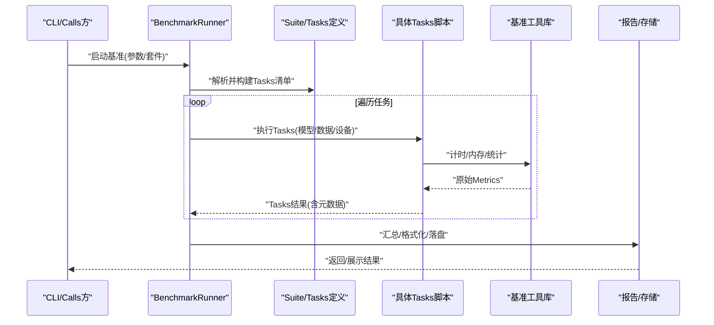
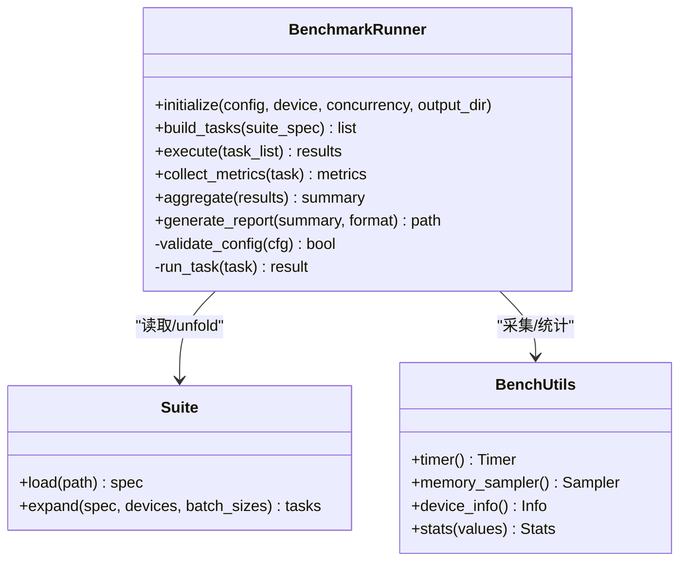
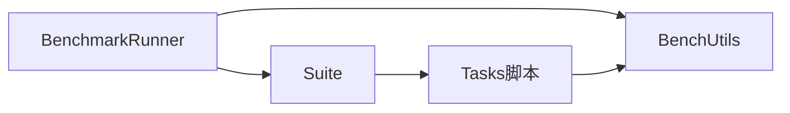

# 基准测试API

<cite>
**Files Referenced in This Document**
- [benchmarks/run.py](file://benchmarks/run.py)
- [benchmarks/suite.py](file://benchmarks/suite.py)
- [benchmarks/benchmark_molora_dispatch.py](file://benchmarks/benchmark_molora_dispatch.py)
- [benchmarks/benchmark_mot_dispatch.py](file://benchmarks/benchmark_mot_dispatch.py)
- [ultralytics/utils/benchmarks.py](file://ultralytics/utils/benchmarks.py)
- [tests/test_benchmark_suite.py](file://tests/test_benchmark_suite.py)
- [docs/governance/performance-gates.md](file://docs/governance/performance-gates.md)
- [docs/governance/baseline-20260716.md](file://docs/governance/baseline-20260716.md)
</cite>

## Table of Contents
1. [Introduction](#Introduction)
2. [Project Structure](#Project Structure)
3. [Core Components](#Core Components)
4. [Architecture Overview](#Architecture Overview)
5. [Detailed Component Analysis](#Detailed Component Analysis)
6. [Dependency Analysis](#Dependency Analysis)
7. [性能考量](#性能考量)
8. [Troubleshooting Guide](#Troubleshooting Guide)
9. [Conclusion](#Conclusion)
10. [Appendix](#Appendix)

## Introduction
本文件for YOLO-Master 基准测试 API 的权威Documentation，聚焦于 BenchmarkRunner 类and其相关Benchmark Suiteand工具。内容涵盖：
- 接口and方法说明：性能吞吐、内存Uses分析and延迟测量
- 多硬件平台配置andOptimization策略
- 测试结果数据结构and报告生成格式
- 自定义基准用例开发指南
- 分布式and并行执行方法
- 性能回归检测and自动化集成
- 结果Visualizationand对比分析
- 生产环境性能监控最佳实践

## Project Structure
基准测试相关代码主要分布whileCentered on下位置：
- benchmarks：基准运行入口、套件编排and特定Tasks基准脚本
- ultralytics/utils/benchmarks.py：通用基准工具（计时、统计、设备探测etc.）
- tests/test_benchmark_suite.py：Benchmark Suite单元测试
- docs/governance：性能门禁、基线管理and治理规范

Figure Source
- [benchmarks/run.py:1-200](file://benchmarks/run.py#L1-L200)
- [benchmarks/suite.py:1-200](file://benchmarks/suite.py#L1-L200)
- [ultralytics/utils/benchmarks.py:1-200](file://ultralytics/utils/benchmarks.py#L1-L200)
- [tests/test_benchmark_suite.py:1-200](file://tests/test_benchmark_suite.py#L1-L200)
- [docs/governance/performance-gates.md:1-200](file://docs/governance/performance-gates.md#L1-L200)

Section Source
- [benchmarks/run.py:1-200](file://benchmarks/run.py#L1-L200)
- [benchmarks/suite.py:1-200](file://benchmarks/suite.py#L1-L200)
- [ultralytics/utils/benchmarks.py:1-200](file://ultralytics/utils/benchmarks.py#L1-L200)
- [tests/test_benchmark_suite.py:1-200](file://tests/test_benchmark_suite.py#L1-L200)
- [docs/governance/performance-gates.md:1-200](file://docs/governance/performance-gates.md#L1-L200)

## Core Components
- BenchmarkRunner：基准测试统一运行器，负责加载套件、调度Tasks、采集Metrics、汇总and输出报告。
- Suite/Tasks定义：Centered on声明式方式描述基准Tasks（模型、数据集、硬件、批大小、预热轮次、重复次数etc.）。
- 专用基准脚本：针对 MoRA/MoE 路由分发and MOT 场景的专项基准implementing。
- 通用工具库：provides高精度计时、统计聚合、设备capabilities探测、内存采样etc.基础capabilities。

Section Source
- [benchmarks/run.py:1-200](file://benchmarks/run.py#L1-L200)
- [benchmarks/suite.py:1-200](file://benchmarks/suite.py#L1-L200)
- [ultralytics/utils/benchmarks.py:1-200](file://ultralytics/utils/benchmarks.py#L1-L200)

## Architecture Overview
下图展示了从“基准入口”to“Tasks执行”再to“结果输出”的整体流程，Centered onand各组件间的依赖关系。

Figure Source
- [benchmarks/run.py:1-200](file://benchmarks/run.py#L1-L200)
- [benchmarks/suite.py:1-200](file://benchmarks/suite.py#L1-L200)
- [ultralytics/utils/benchmarks.py:1-200](file://ultralytics/utils/benchmarks.py#L1-L200)

## Detailed Component Analysis

### BenchmarkRunner 类
- 职责
  - 加载and校验Benchmark Suite配置
  - 按设备/并发/批大小etc.维度unfoldTasks矩阵
  - 执行预热、正式测试、收集Metrics
  - 聚合统计、生成结构化报告
- 关键方法and行for
  - 初始化：接收套件、设备、并发度、输出路径etc.参数
  - 构建Tasks：根据配置生成可执行的Tasks列表
  - 执行引擎：串行或并行执行Tasks，Supporting失败重试and超时控制
  - Metrics采集：Via工具库进行时间、吞吐、内存、GPU/CPU利用率etc.采集
  - 报告生成：将结果序列化for JSON/CSV/HTML etc.格式，并写入指定Table of Contents
- 错误处理
  - 捕获底层异常并记录上下文（模型、数据集、设备、参数）
  - 对不可恢复错误进行快速失败，避免污染后续Tasks
  - 对可恢复错误进行重试或降级执行

Figure Source
- [benchmarks/run.py:1-200](file://benchmarks/run.py#L1-L200)
- [benchmarks/suite.py:1-200](file://benchmarks/suite.py#L1-L200)
- [ultralytics/utils/benchmarks.py:1-200](file://ultralytics/utils/benchmarks.py#L1-L200)

Section Source
- [benchmarks/run.py:1-200](file://benchmarks/run.py#L1-L200)
- [benchmarks/suite.py:1-200](file://benchmarks/suite.py#L1-L200)
- [ultralytics/utils/benchmarks.py:1-200](file://ultralytics/utils/benchmarks.py#L1-L200)

### 套件andTasks定义（Suite）
- 套件文件：集中管理不同Tasks、模型、数据集、超参and设备组合
- Tasksunfold：根据设备、批大小、并发度etc.维度自动生成Tasks矩阵
- 典型字段
  - Tasks名、模型权重、数据集路径
  - 输入分辨率、批大小、Inference模式（精度/后端）
  - 预热轮次、重复次数、随机种子
  - 资源限制（显存阈值、超时）
- 扩展点：新增Tasks只需while套件中声明，无需修改运行器

Section Source
- [benchmarks/suite.py:1-200](file://benchmarks/suite.py#L1-L200)

### 专用基准脚本
- MoRA/MoE 路由分发基准：Evaluation路由选择开销、专家激活分布、稀疏性带来的收益
- MOT 场景基准：whileMulti-Object Tracking场景下Evaluation端to端延迟and吞吐

Section Source
- [benchmarks/benchmark_molora_dispatch.py:1-200](file://benchmarks/benchmark_molora_dispatch.py#L1-L200)
- [benchmarks/benchmark_mot_dispatch.py:1-200](file://benchmarks/benchmark_mot_dispatch.py#L1-L200)

### 通用基准工具（ultralytics/utils/benchmarks.py）
- 计时器：高精度计时、分阶段计时（预处理/Inference/Post-Processing）
- 统计聚合：均值、方差、P50/P90/P99、置信区间
- 设备探测：CPU/GPU/NPU 信息、drivers are installed版本、可用显存
- 内存采样：峰值内存、分配/释放曲线
- 并发控制：线程/进程池、队列限流、背压

Section Source
- [ultralytics/utils/benchmarks.py:1-200](file://ultralytics/utils/benchmarks.py#L1-L200)

### 单元测试and契约Validation
- 覆盖要点
  - 套件解析andTasksunfold正确性
  - Metrics采集稳定性and边界条件
  - 报告序列化and反序列化
  - 失败路径and重试逻辑
- 断言and期望
  - Metrics范围合理性检查
  - 报告字段完整性校验

Section Source
- [tests/test_benchmark_suite.py:1-200](file://tests/test_benchmark_suite.py#L1-L200)

## Dependency Analysis
- 内部依赖
  - BenchmarkRunner 依赖 Suite and工具库
  - 专用基准脚本依赖工具库and运行时环境
- External Dependencies
  - Deep Learning Framework（PyTorch/TensorRT/OpenVINO etc.）
  - 系统工具（nvidia-smi、top、perf etc.）
- Potential Cycles依赖
  - Via分层设计避免：运行器不直接依赖具体Tasksimplementing，仅Via接口交互

Figure Source
- [benchmarks/run.py:1-200](file://benchmarks/run.py#L1-L200)
- [benchmarks/suite.py:1-200](file://benchmarks/suite.py#L1-L200)
- [ultralytics/utils/benchmarks.py:1-200](file://ultralytics/utils/benchmarks.py#L1-L200)

Section Source
- [benchmarks/run.py:1-200](file://benchmarks/run.py#L1-L200)
- [benchmarks/suite.py:1-200](file://benchmarks/suite.py#L1-L200)
- [ultralytics/utils/benchmarks.py:1-200](file://ultralytics/utils/benchmarks.py#L1-L200)

## 性能考量
- 预热and冷启动
  - 首次Load modeland算子编译开销较大，需设置足够预热轮次
  - 建议预热后丢弃前若干轮结果再统计
- 重复次数and统计稳健性
  - 增加重复次数Centered on降低抖动影响，Combining P90/P99 观察尾部延迟
- 批大小and并发度
  - 小批更关注延迟，大批更关注吞吐；Set appropriately并发避免资源争用
- 设备and后端
  - GPU：Prefer TensorRT/ONNX Runtime 加速
  - CPU：启用多线程and向量化Optimization
  - NPU/边缘设备：遵循厂商推荐Exportand部署流程
- 内存and缓存
  - 关闭不必要的Loggingand中间张量保存
  - 复用 DataLoader and模型实例Centered on减少重建开销

[This section provides general guidance and does not directly analyze specific files]

## Troubleshooting Guide
- 常见问题
  - 显存不足：降低批大小、减少并发、关闭调试输出
  - 结果不稳定：增加预热and重复次数，固定随机种子
  - 设备不可用：检查drivers are installedand后端安装，确认设备枚举
  - 报告缺失：检查输出Table of Contents权限and磁盘空间
- 定位手段
  - 开启详细Logging，记录Tasks元数据and异常堆栈
  - Uses工具库的设备信息and内存采样辅助定位bottlenecks
  - Via单元测试复现最小用例

Section Source
- [tests/test_benchmark_suite.py:1-200](file://tests/test_benchmark_suite.py#L1-L200)
- [ultralytics/utils/benchmarks.py:1-200](file://ultralytics/utils/benchmarks.py#L1-L200)

## Conclusion
BenchmarkRunner provides了统一的基准测试入口and可扩展的Tasks体系，Combined with工具库可implementing跨硬件平台的性能、内存and延迟Evaluation。Via套件化配置and标准化报告，便于持续集成and回归检测。建议while生产环境中Combining性能门禁and基线管理，形成闭环的性能保障机制。

[This section is summary content and does not directly analyze specific files]

## Appendix

### 接口and方法速查（BenchmarkRunner）
- initialize(config, device, concurrency, output_dir)
- build_tasks(suite_spec)
- execute(task_list)
- collect_metrics(task)
- aggregate(results)
- generate_report(summary, format)
- validate_config(cfg)
- run_task(task)

Section Source
- [benchmarks/run.py:1-200](file://benchmarks/run.py#L1-L200)

### 套件字段Refer to（Examples）
- Tasks名、模型权重、数据集路径
- 输入分辨率、批大小、Inference模式
- 预热轮次、重复次数、随机种子
- 资源限制（显存阈值、超时）

Section Source
- [benchmarks/suite.py:1-200](file://benchmarks/suite.py#L1-L200)

### 测试结果数据结构（建议）
- Tasks元数据：名称、模型、数据集、设备、批大小、并发度、后端
- Metrics集合：
  - 延迟：均值、P50、P90、P99、标准差
  - 吞吐：FPS、样本/秒
  - 内存：峰值、平均、分配曲线摘要
  - 资源：CPU/GPU/NPU 利用率、温度、功耗（Optional）
- 质量Metrics（such as适用）：mAP、IoU、Tracking Metricsetc.
- 环境and版本：框架版本、drivers are installed、内核、CUDA/ROCm 版本
- 时间戳and哈希：运行时间、模型/配置哈希

Section Source
- [benchmarks/run.py:1-200](file://benchmarks/run.py#L1-L200)
- [ultralytics/utils/benchmarks.py:1-200](file://ultralytics/utils/benchmarks.py#L1-L200)

### 报告生成格式
- JSON：结构化结果，便于自动化消费
- CSV：表格化结果，便于人工审阅and二次分析
- HTML：Visualization概览，包含图表and关键Metrics

Section Source
- [benchmarks/run.py:1-200](file://benchmarks/run.py#L1-L200)

### 自定义基准用例开发指南
- 步骤
  - 新建Tasks脚本，继承或复用工具库的计时and统计capabilities
  - while套件中声明Tasksand参数矩阵
  - 本地ValidationVia后提交至 CI
- 注意事项
  - 明确输入输出契约，保证可复现
  - Set appropriately预热and重复次数
  - 记录必要的环境and版本信息

Section Source
- [benchmarks/benchmark_molora_dispatch.py:1-200](file://benchmarks/benchmark_molora_dispatch.py#L1-L200)
- [benchmarks/benchmark_mot_dispatch.py:1-200](file://benchmarks/benchmark_mot_dispatch.py#L1-L200)
- [benchmarks/suite.py:1-200](file://benchmarks/suite.py#L1-L200)

### 分布式and并行执行
- 单机并行：基于线程/进程池并发执行Tasks，注意资源隔离
- 多机分布式：按设备/节点划分Tasks，统一汇聚结果
- 容错and重试：失败Tasks自动重试，记录失败原因and上下文

Section Source
- [benchmarks/run.py:1-200](file://benchmarks/run.py#L1-L200)
- [ultralytics/utils/benchmarks.py:1-200](file://ultralytics/utils/benchmarks.py#L1-L200)

### 性能回归检测and自动化集成
- 基线管理：维护历史基线and阈值，新结果and之对比
- 门禁规则：关键Metrics低于阈值则阻断合并
- CI 集成：每次提交触发Benchmark Suite，产出报告并归档

Section Source
- [docs/governance/performance-gates.md:1-200](file://docs/governance/performance-gates.md#L1-L200)
- [docs/governance/baseline-20260716.md:1-200](file://docs/governance/baseline-20260716.md#L1-L200)

### Visualizationand对比分析
- 趋势图：延迟/吞吐随时间变化
- 箱线图：不同批大小/并发下的延迟分布
- 雷达图：多Tasks综合表现对比
- 差异热力图：不同后端/精度的性能差异

Section Source
- [benchmarks/run.py:1-200](file://benchmarks/run.py#L1-L200)

### 生产环境性能监控最佳实践
- 持续采集：定期运行轻量级基准，监控关键Metrics
- 告警策略：阈值越界触发告警，附带上下文信息
- 容量规划：依据吞吐and延迟目标规划资源
- 变更管控：模型/配置变更必须Via基准门禁

Section Source
- [docs/governance/performance-gates.md:1-200](file://docs/governance/performance-gates.md#L1-L200)
- [docs/governance/baseline-20260716.md:1-200](file://docs/governance/baseline-20260716.md#L1-L200)