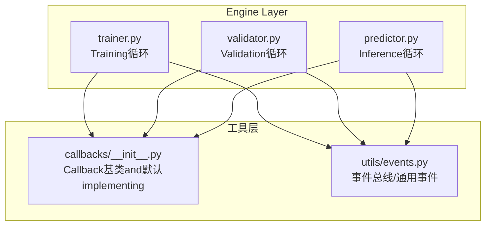
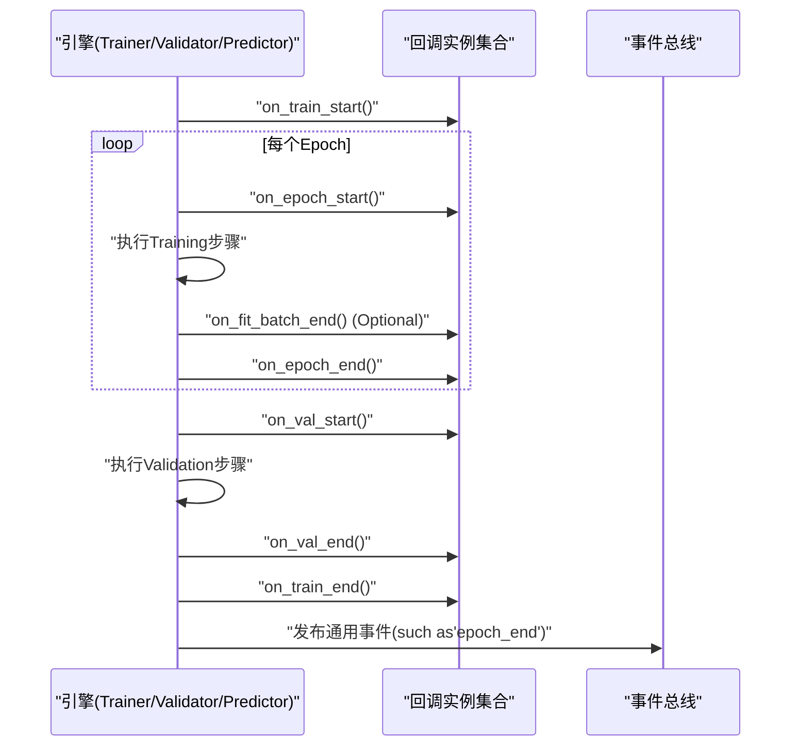
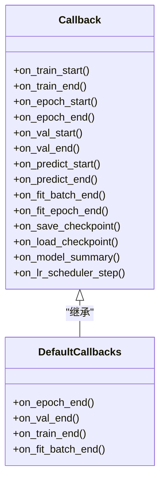
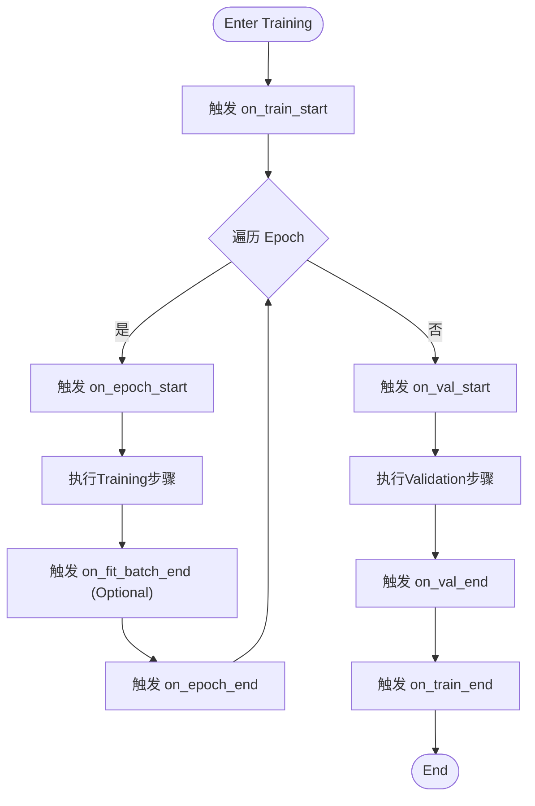
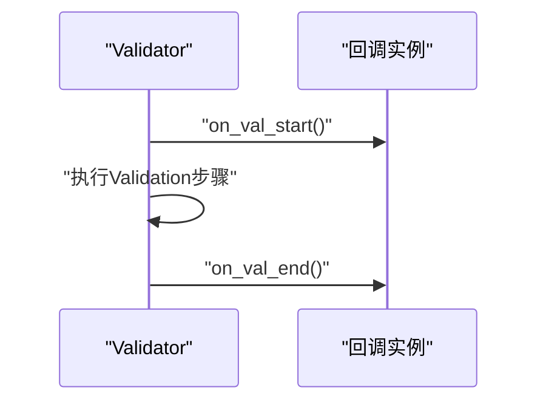
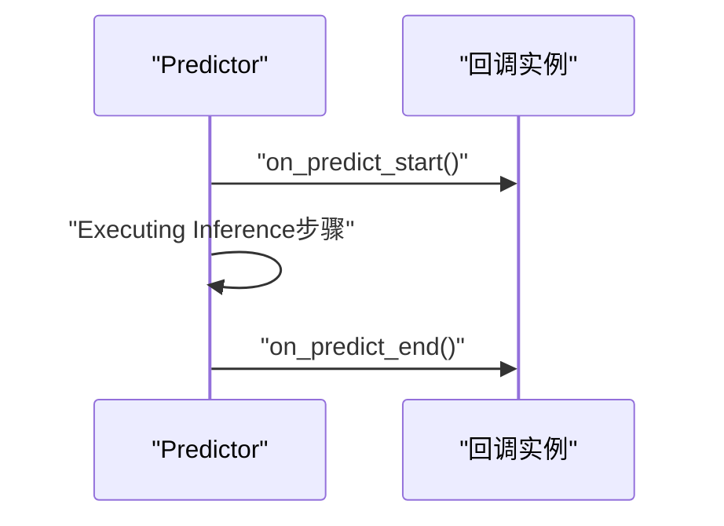
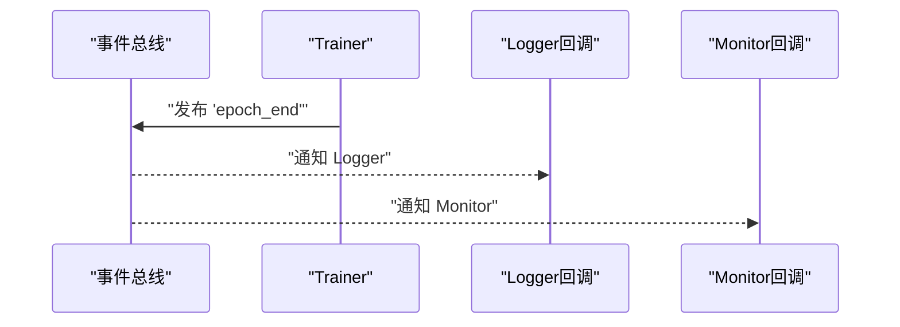
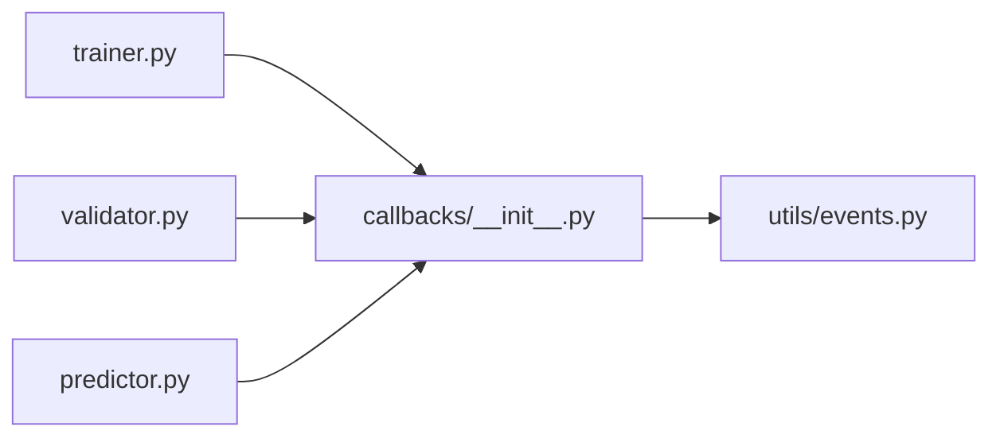

# 回调基类and核心接口

<cite>
**Files Referenced in This Document**
- [callbacks.py](file://ultralytics/utils/callbacks/__init__.py)
- [trainer.py](file://ultralytics/engine/trainer.py)
- [validator.py](file://ultralytics/engine/validator.py)
- [predictor.py](file://ultralytics/engine/predictor.py)
- [events.py](file://ultralytics/utils/events.py)
</cite>

## Table of Contents
1. [Introduction](#Introduction)
2. [Project Structure](#Project Structure)
3. [Core Components](#Core Components)
4. [Architecture Overview](#Architecture Overview)
5. [Detailed Component Analysis](#Detailed Component Analysis)
6. [Dependency Analysis](#Dependency Analysis)
7. [Performance Considerations](#Performance Considerations)
8. [Troubleshooting Guide](#Troubleshooting Guide)
9. [Conclusion](#Conclusion)
10. [Appendix](#Appendix)

## Introduction
本文件targetingYOLO-Master的Callback System，聚焦于Callback基类and其whileTraining、Validation、Predictionetc.阶段的生命周期钩子。Documentation将解释：
- Callback基类的核心接口设计（such ason_train_start、on_epoch_end、on_val_endetc.）
- 回调注册机制、事件系统架构and执行顺序
- 自定义回调的开发模式（继承、状态管理、错误处理）
- 回调间通信的数据结构and传递方式
- provides完整的代码Examples路径，帮助快速上手

## Project Structure
回调相关代码主要位于Centered on下Modules：
- 回调基类and默认implementing：ultralytics/utils/callbacks/__init__.py
- Training流程触发点：ultralytics/engine/trainer.py
- Validation流程触发点：ultralytics/engine/validator.py
- Inference流程触发点：ultralytics/engine/predictor.py
- 事件总线and通用事件：ultralytics/utils/events.py

Figure Source
- [trainer.py](file://ultralytics/engine/trainer.py)
- [validator.py](file://ultralytics/engine/validator.py)
- [predictor.py](file://ultralytics/engine/predictor.py)
- [callbacks.py](file://ultralytics/utils/callbacks/__init__.py)
- [events.py](file://ultralytics/utils/events.py)

Section Source
- [callbacks.py](file://ultralytics/utils/callbacks/__init__.py)
- [trainer.py](file://ultralytics/engine/trainer.py)
- [validator.py](file://ultralytics/engine/validator.py)
- [predictor.py](file://ultralytics/engine/predictor.py)
- [events.py](file://ultralytics/utils/events.py)

## Core Components
- Callback基类：定义Training/Validation/Inference生命周期钩子的标准接口，供User或Built-in扩展继承implementing。典型钩子包括：
  - on_train_start/on_train_end：Training开始/End
  - on_epoch_start/on_epoch_end：每轮开始/End
  - on_val_start/on_val_end：Validation开始/End
  - on_predict_start/on_predict_end：Inference开始/End
  - on_fit_epoch_end/on_fit_batch_end：拟合过程中的细粒度钩子（若存while）
  - on_save_checkpoint/on_load_checkpoint：Checkpoint保存/加载
  - on_model_summary/on_lr_scheduler_step：模型摘要/Learning Rate调度步骤
- 默认回调implementing：providesLogging、进度条、Metrics汇总、Visualizationetc.基础capabilities
- 事件系统：through a unified事件总线分发通用事件，便于跨Modules解耦通信

Section Source
- [callbacks.py](file://ultralytics/utils/callbacks/__init__.py)
- [events.py](file://ultralytics/utils/events.py)

## Architecture Overview
Callback SystemandEngine Layer的交互遵循“Calls者触发 + 回调订阅”的模式：
- 引擎while关键阶段主动Calls回调方法（such ason_epoch_end）
- 回调可访问当前上下文（模型、Optimizer、数据、Metricsetc.），并Optional择修改行for或记录信息
- 事件系统作for补充，用于非侵入式通知（such as外部监控、遥测）

Figure Source
- [trainer.py](file://ultralytics/engine/trainer.py)
- [validator.py](file://ultralytics/engine/validator.py)
- [predictor.py](file://ultralytics/engine/predictor.py)
- [callbacks.py](file://ultralytics/utils/callbacks/__init__.py)
- [events.py](file://ultralytics/utils/events.py)

## Detailed Component Analysis

### Callback基类and默认implementing
- 职责
  - 定义统一的回调接口，确保不同回调具备一致的生命周期方法签名
  - provides空implementing或默认行for，降低User自定义成本
  - 暴露上下文访问capabilities（such as模型、配置、Metrics字典etc.）
- 关键接口（Examples）
  - on_train_start/on_train_end
  - on_epoch_start/on_epoch_end
  - on_val_start/on_val_end
  - on_predict_start/on_predict_end
  - on_fit_batch_end/on_fit_epoch_end（若存while）
  - on_save_checkpoint/on_load_checkpoint
  - on_model_summary/on_lr_scheduler_step
- 默认implementing
  - 打印进度、记录Metrics、生成Visualization图、写入Loggingetc.

Figure Source
- [callbacks.py](file://ultralytics/utils/callbacks/__init__.py)

Section Source
- [callbacks.py](file://ultralytics/utils/callbacks/__init__.py)

### Training流程中的回调触发点
- TrainerwhileCentered on下位置触发回调：
  - Training开始前：on_train_start
  - 每轮前/后：on_epoch_start / on_epoch_end
  - 批次级（Optional）：on_fit_batch_end
  - Validation前后：on_val_start / on_val_end
  - TrainingEnd后：on_train_end
  - Checkpoint保存/加载：on_save_checkpoint / on_load_checkpoint
  - Learning Rate更新：on_lr_scheduler_step
- 参数规范
  - 各钩子通常接收当前上下文对象（包含模型、Optimizer、Data Loading器、Metrics字典、配置etc.）
  - 具体字段名Centered on实际implementingfor准，建议Via查看对应文件的函数签名确认

Figure Source
- [trainer.py](file://ultralytics/engine/trainer.py)
- [callbacks.py](file://ultralytics/utils/callbacks/__init__.py)

Section Source
- [trainer.py](file://ultralytics/engine/trainer.py)
- [callbacks.py](file://ultralytics/utils/callbacks/__init__.py)

### Validation流程中的回调触发点
- ValidatorwhileValidation前后触发on_val_start/on_val_end
- 可andTrainer共享同一套回调实例，保证Metrics记录andVisualization的一致性

Figure Source
- [validator.py](file://ultralytics/engine/validator.py)
- [callbacks.py](file://ultralytics/utils/callbacks/__init__.py)

Section Source
- [validator.py](file://ultralytics/engine/validator.py)
- [callbacks.py](file://ultralytics/utils/callbacks/__init__.py)

### Inference流程中的回调触发点
- PredictorwhileInference前后触发on_predict_start/on_predict_end
- 可用于批量结果收集、Visualization、Exportetc.

Figure Source
- [predictor.py](file://ultralytics/engine/predictor.py)
- [callbacks.py](file://ultralytics/utils/callbacks/__init__.py)

Section Source
- [predictor.py](file://ultralytics/engine/predictor.py)
- [callbacks.py](file://ultralytics/utils/callbacks/__init__.py)

### 事件系统and回调通信
- 事件总线provides通用事件发布/订阅机制，适合跨Modules解耦通信
- 常见事件包括：epoch_end、val_end、train_end、checkpoint_savedetc.
- 回调可Via事件订阅获取全局状态变化，避免强耦合

Figure Source
- [events.py](file://ultralytics/utils/events.py)
- [trainer.py](file://ultralytics/engine/trainer.py)

Section Source
- [events.py](file://ultralytics/utils/events.py)
- [trainer.py](file://ultralytics/engine/trainer.py)

### 自定义回调开发指南
- 继承模式
  - 从Callback基类继承，按需重写生命周期方法
  - 保持方法签名and基类一致，避免破坏引擎Calls链
- 状态管理
  - Uses实例属性存储临时状态（such as累计Metrics、缓存结果）
  - 注意while多进程/分布式场景下的线程安全and状态同步
- 错误处理
  - 捕获异常并记录Logging，避免中断主流程
  - 对关键操作进行幂etc.性设计，Supporting重试and恢复
- 回调间通信
  - Via共享上下文对象（由引擎注入）读取/写入必要信息
  - Uses事件总线发布/订阅通用事件，减少直接依赖
- 最佳实践
  - 轻量优先：避免while回调中执行耗时I/O或复杂计算
  - 可插拔：Via配置开关控制是否启用某回调
  - 可观测：输出结构化Logging，便于追踪问题

Section Source
- [callbacks.py](file://ultralytics/utils/callbacks/__init__.py)
- [events.py](file://ultralytics/utils/events.py)

### 完整代码Examples（路径指引）
- 创建基础回调类
  - Refer to路径：[自定义回调Examples](file://ultralytics/utils/callbacks/__init__.py)
  - 说明：while该文件中找to默认回调implementing，复制并重写所需钩子方法
- 注册回调toTrainer
  - Refer to路径：[Trainer初始化and回调注册](file://ultralytics/engine/trainer.py)
  - 说明：whileTrainer构造或配置阶段添加自定义回调实例
- 订阅事件
  - Refer to路径：[事件订阅Examples](file://ultralytics/utils/events.py)
  - 说明：while回调中订阅通用事件，implementing跨Modules通信

Section Source
- [callbacks.py](file://ultralytics/utils/callbacks/__init__.py)
- [trainer.py](file://ultralytics/engine/trainer.py)
- [events.py](file://ultralytics/utils/events.py)

## Dependency Analysis
- 组件耦合
  - Engine Layer（Trainer/Validator/Predictor）依赖回调接口，但不关心具体implementing
  - 回调依赖引擎注入的上下文对象，Centered onand事件总线provides的通用事件
- External Dependencies
  - Logging、Visualization、Metrics计算etc.第三方库应while回调内部按需引入，避免污染核心路径
- Potential Cycles依赖
  - 回调不应反向导入引擎核心逻辑，应保持单向依赖

Figure Source
- [trainer.py](file://ultralytics/engine/trainer.py)
- [validator.py](file://ultralytics/engine/validator.py)
- [predictor.py](file://ultralytics/engine/predictor.py)
- [callbacks.py](file://ultralytics/utils/callbacks/__init__.py)
- [events.py](file://ultralytics/utils/events.py)

Section Source
- [trainer.py](file://ultralytics/engine/trainer.py)
- [validator.py](file://ultralytics/engine/validator.py)
- [predictor.py](file://ultralytics/engine/predictor.py)
- [callbacks.py](file://ultralytics/utils/callbacks/__init__.py)
- [events.py](file://ultralytics/utils/events.py)

## Performance Considerations
- 回调执行开销
  - 避免while高频钩子（such ason_fit_batch_end）中进行重I/O或复杂计算
  - Uses批处理聚合策略，降低LoggingandVisualization频率
- 并发and并行
  - 多进程环境下，确保回调的状态读写是线程安全的
  - 必要时Uses锁或队列进行同步
- 内存占用
  - and时释放中间结果，避免长期持有大对象引用
- 可观测性
  - Uses异步Logging或缓冲写入，减少对Training主循环的影响

## Troubleshooting Guide
- 常见问题
  - 回调未触发：检查引擎是否while相应阶段Calls了对应钩子
  - 参数缺失：核对回调方法签名and引擎传入的上下文对象字段
  - 状态不一致：while多进程场景中确认状态同步机制
- 定位技巧
  - while回调开头打印关键上下文字段，确认数据流
  - Uses事件总线发布调试事件，辅助定位问题
- 恢复策略
  - 对关键操作增加try/except，记录异常堆栈并继续运行
  - Supporting断点续训时，确保Checkpoint保存/加载回调正确工作

Section Source
- [callbacks.py](file://ultralytics/utils/callbacks/__init__.py)
- [events.py](file://ultralytics/utils/events.py)

## Conclusion
YOLO-Master的Callback Systemthrough a unified基类接口and事件总线，implementing了高度可扩展的Training/Validation/Inference生命周期管理。开发者可基于Callback基类快速构建自定义回调，Combining事件系统implementing松耦合的Modules通信。遵循轻量、可观测、线程安全etc.最佳实践，可有效提升系统的稳定性and可维护性。

## Appendix
- 术语表
  - 回调：while特定生命周期阶段被Calls的扩展点
  - 事件：Modules间解耦通信的消息机制
  - 上下文：引擎注入给回调的对象，包含当前Training/Validation/Inference状态
- Refer to路径
  - 回调基类and默认implementing：[回调Modules](file://ultralytics/utils/callbacks/__init__.py)
  - Training触发点：[Trainer](file://ultralytics/engine/trainer.py)
  - Validation触发点：[Validator](file://ultralytics/engine/validator.py)
  - Inference触发点：[Predictor](file://ultralytics/engine/predictor.py)
  - 事件总线：[事件Modules](file://ultralytics/utils/events.py)