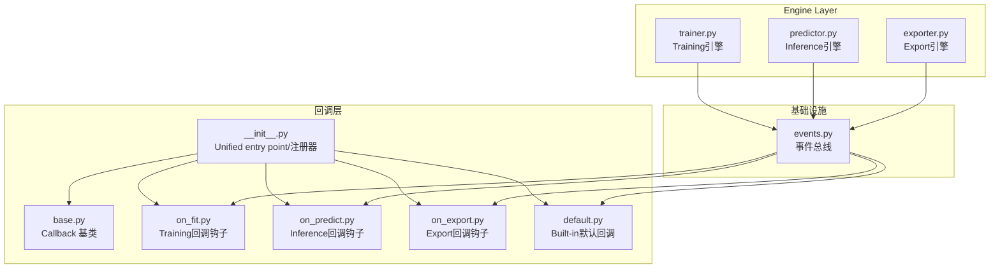
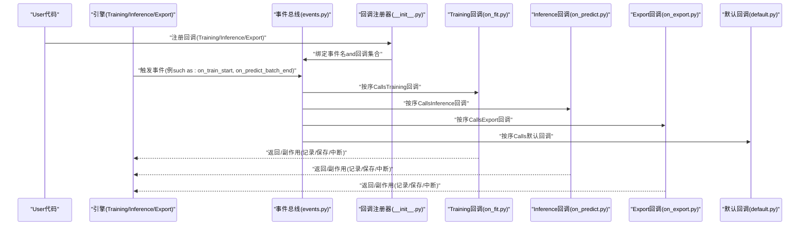
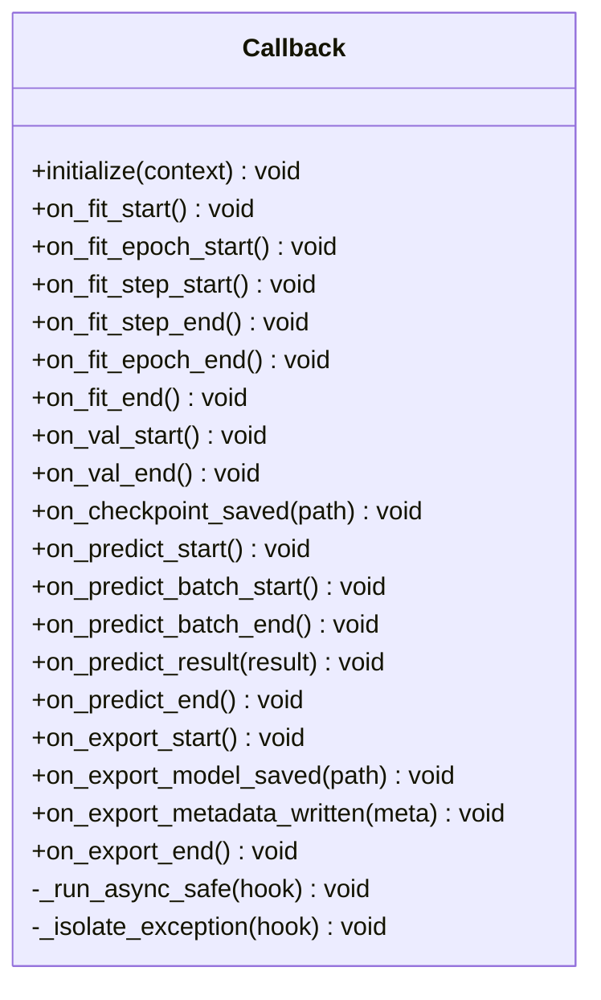
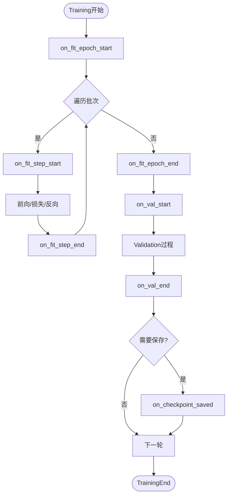
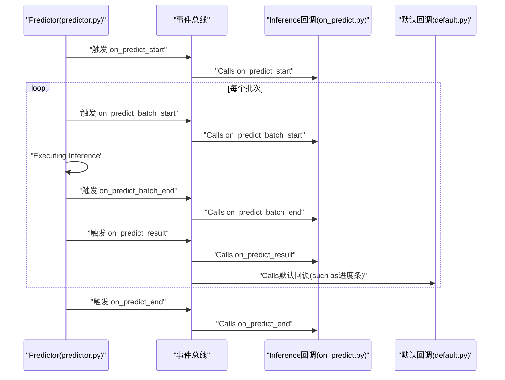
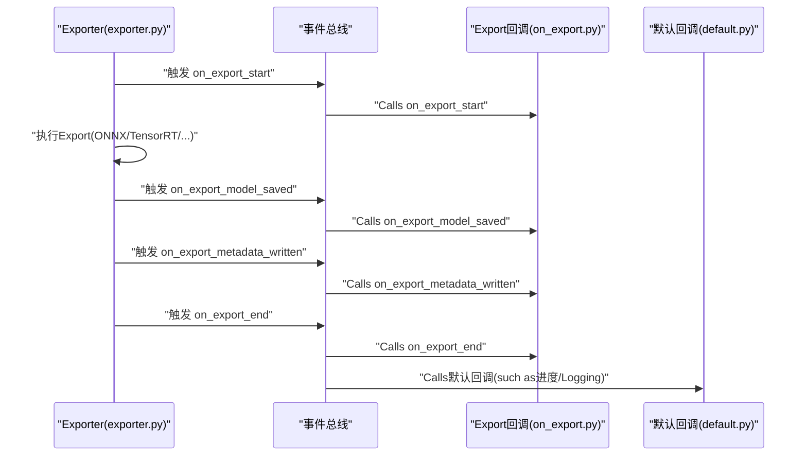
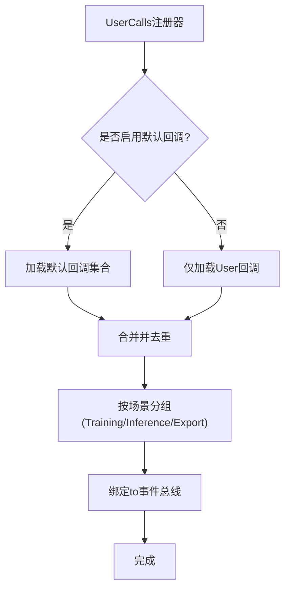
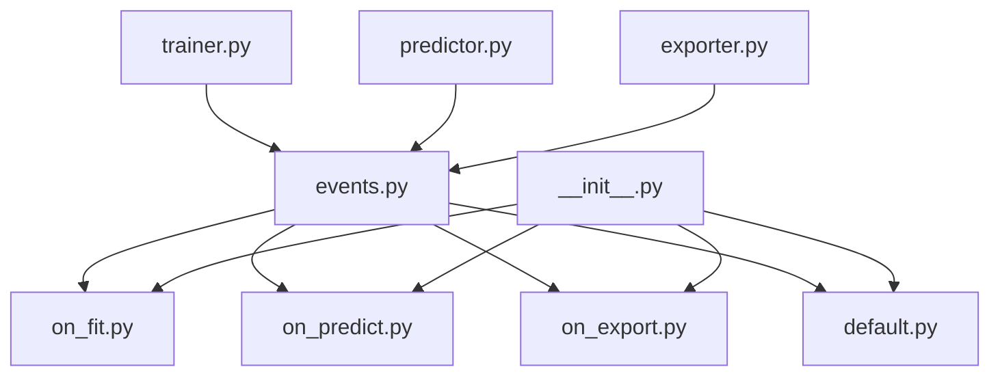

# Callback System API

<cite>
**Files Referenced in This Document**
- [callbacks/__init__.py](file://ultralytics/utils/callbacks/__init__.py)
- [callbacks/base.py](file://ultralytics/utils/callbacks/base.py)
- [callbacks/default.py](file://ultralytics/utils/callbacks/default.py)
- [callbacks/on_fit.py](file://ultralytics/utils/callbacks/on_fit.py)
- [callbacks/on_predict.py](file://ultralytics/utils/callbacks/on_predict.py)
- [callbacks/on_export.py](file://ultralytics/utils/callbacks/on_export.py)
- [engine/trainer.py](file://ultralytics/engine/trainer.py)
- [engine/predictor.py](file://ultralytics/engine/predictor.py)
- [engine/exporter.py](file://ultralytics/engine/exporter.py)
- [utils/events.py](file://ultralytics/utils/events.py)
</cite>

## Table of Contents
1. [Introduction](#Introduction)
2. [Project Structure](#Project Structure)
3. [Core Components](#Core Components)
4. [Architecture Overview](#Architecture Overview)
5. [Detailed Component Analysis](#Detailed Component Analysis)
6. [Dependency Analysis](#Dependency Analysis)
7. [Performance Considerations](#Performance Considerations)
8. [Troubleshooting Guide](#Troubleshooting Guide)
9. [Conclusion](#Conclusion)
10. [Appendix](#Appendix)

## Introduction
本文件for YOLO-Master 的Callback System API provides完整Documentation，覆盖 Callback 基类接口规范and生命周期方法、Training/Inference/Export三类回调的implementing模式、回调注册机制and事件触发顺序、自定义回调开发指南and最佳实践、Built-in回调功能andUses方法（Logging、监控、模型保存etc.）、回调间通信and数据传递方式、异步回调and错误处理Examples，Centered onand调试and测试工具方法。

## Project Structure
Callback System位于 ultralytics/utils/callbacks Table of Contents下，按“场景”划分Modules：
- base.py：定义统一的回调基类and通用capabilities
- default.py：Built-in默认回调implementing（such asLogging、进度、Checkpointetc.）
- on_fit.py：Training阶段回调钩子
- on_predict.py：Inference阶段回调钩子
- on_export.py：Export阶段回调钩子
- __init__.py：Unified entry pointand便捷注册器

引擎侧while trainer.py、predictor.py、exporter.py 中Via事件总线分发回调事件，确保解耦and可Extensibility。

Figure Source
- [callbacks/base.py](file://ultralytics/utils/callbacks/base.py)
- [callbacks/on_fit.py](file://ultralytics/utils/callbacks/on_fit.py)
- [callbacks/on_predict.py](file://ultralytics/utils/callbacks/on_predict.py)
- [callbacks/on_export.py](file://ultralytics/utils/callbacks/on_export.py)
- [callbacks/default.py](file://ultralytics/utils/callbacks/default.py)
- [callbacks/__init__.py](file://ultralytics/utils/callbacks/__init__.py)
- [engine/trainer.py](file://ultralytics/engine/trainer.py)
- [engine/predictor.py](file://ultralytics/engine/predictor.py)
- [engine/exporter.py](file://ultralytics/engine/exporter.py)
- [utils/events.py](file://ultralytics/utils/events.py)

Section Source
- [callbacks/__init__.py](file://ultralytics/utils/callbacks/__init__.py)
- [callbacks/base.py](file://ultralytics/utils/callbacks/base.py)
- [callbacks/default.py](file://ultralytics/utils/callbacks/default.py)
- [callbacks/on_fit.py](file://ultralytics/utils/callbacks/on_fit.py)
- [callbacks/on_predict.py](file://ultralytics/utils/callbacks/on_predict.py)
- [callbacks/on_export.py](file://ultralytics/utils/callbacks/on_export.py)
- [engine/trainer.py](file://ultralytics/engine/trainer.py)
- [engine/predictor.py](file://ultralytics/engine/predictor.py)
- [engine/exporter.py](file://ultralytics/engine/exporter.py)
- [utils/events.py](file://ultralytics/utils/events.py)

## Core Components
- Callback 基类
  - 职责：定义所有回调的Unified Interfaceand生命周期方法；provides上下文访问、状态共享、异常隔离andOptional异步执行capabilities。
  - 关键capabilities：
    - 生命周期钩子：Training前/后、每步/每轮、Validation前后、Export前后etc.
    - 上下文访问：读取当前运行配置、模型句柄、设备信息、Results Object
    - 状态共享：Via共享字典或事件载荷进行跨回调通信
    - 异常隔离：单个回调异常不影响主流程
    - 异步Supporting：可声明式标记异步钩子，由调度器安全执行
- 场景化回调集
  - Training回调（on_fit）：Learning Rate调度、Metrics记录、Checkpoint保存、早停、Visualizationetc.
  - Inference回调（on_predict）：批处理统计、结果落盘、Visualization、延迟/吞吐采集
  - Export回调（on_export）：格式校验、中间产物归档、Export报告生成
- 事件总线
  - 职责：集中管理事件名、订阅者列表、分发顺序andParameter Passing；保证回调and引擎解耦
- 统一Entry and Registration器
  - 职责：provides add_callback/remove_callbacks/clear_callbacks etc.便捷方法；负责将User回调and默认回调合并并注册to事件总线

Section Source
- [callbacks/base.py](file://ultralytics/utils/callbacks/base.py)
- [callbacks/on_fit.py](file://ultralytics/utils/callbacks/on_fit.py)
- [callbacks/on_predict.py](file://ultralytics/utils/callbacks/on_predict.py)
- [callbacks/on_export.py](file://ultralytics/utils/callbacks/on_export.py)
- [callbacks/default.py](file://ultralytics/utils/callbacks/default.py)
- [callbacks/__init__.py](file://ultralytics/utils/callbacks/__init__.py)
- [utils/events.py](file://ultralytics/utils/events.py)

## Architecture Overview
Callback Systemand引擎Via事件总线松耦合交互。引擎while关键阶段触发事件，事件总线按注册顺序Calls已注册的回调实例。

Figure Source
- [engine/trainer.py](file://ultralytics/engine/trainer.py)
- [engine/predictor.py](file://ultralytics/engine/predictor.py)
- [engine/exporter.py](file://ultralytics/engine/exporter.py)
- [utils/events.py](file://ultralytics/utils/events.py)
- [callbacks/__init__.py](file://ultralytics/utils/callbacks/__init__.py)
- [callbacks/on_fit.py](file://ultralytics/utils/callbacks/on_fit.py)
- [callbacks/on_predict.py](file://ultralytics/utils/callbacks/on_predict.py)
- [callbacks/on_export.py](file://ultralytics/utils/callbacks/on_export.py)
- [callbacks/default.py](file://ultralytics/utils/callbacks/default.py)

## Detailed Component Analysis

### Callback 基类and生命周期
- 设计要点
  - 统一抽象：所有回调继承自基类，获得一致的初始化、上下文注入、异常隔离andOptional异步执行
  - 生命周期钩子命名约定：Centered on on_ 开头，按阶段细分（such as on_fit_epoch_start、on_predict_batch_end、on_export_model_saved）
  - 上下文对象：包含当前运行配置、模型引用、设备、批次索引、Results Objectetc.
  - 中断控制：部分钩子可Via返回值或上下文标志提前终止流程（such as早停）
- 典型钩子（Training）
  - 开始/End：on_fit_start、on_fit_end
  - 轮次：on_fit_epoch_start、on_fit_epoch_end
  - 步骤：on_fit_step_start、on_fit_step_end
  - Validation：on_val_start、on_val_end
  - Checkpoint：on_checkpoint_saved
- 典型钩子（Inference）
  - 开始/End：on_predict_start、on_predict_end
  - 批次：on_predict_batch_start、on_predict_batch_end
  - 结果：on_predict_result
- 典型钩子（Export）
  - 开始/End：on_export_start、on_export_end
  - 模型：on_export_model_saved
  - 元数据：on_export_metadata_written

Figure Source
- [callbacks/base.py](file://ultralytics/utils/callbacks/base.py)

Section Source
- [callbacks/base.py](file://ultralytics/utils/callbacks/base.py)

### Training回调（on_fit）
- 职责
  - Learning Rate调度：while epoch/step 边界更新Optimizer LR
  - Metrics记录：聚合 loss/mAP/精度etc.Metrics，写入Logging或外部系统
  - Checkpoint保存：按策略保存权重andOptimizer状态
  - 早停：根据ValidationMetrics判断是否提前EndTraining
  - Visualization：绘制曲线、输出摘要
- 事件触发顺序（简化）
  - on_fit_start → on_fit_epoch_start → on_fit_step_start → on_fit_step_end × N → on_fit_epoch_end → on_val_start → on_val_end → on_checkpoint_saved → ... → on_fit_end

Figure Source
- [callbacks/on_fit.py](file://ultralytics/utils/callbacks/on_fit.py)
- [engine/trainer.py](file://ultralytics/engine/trainer.py)

Section Source
- [callbacks/on_fit.py](file://ultralytics/utils/callbacks/on_fit.py)
- [engine/trainer.py](file://ultralytics/engine/trainer.py)

### Inference回调（on_predict）
- 职责
  - 批处理统计：收集耗时、吞吐、内存占用
  - 结果落盘：保存检测结果、Visualization图、视频流帧
  - 质量门控：阈值过滤、NMS Post-Processing统计
  - 诊断：分布Drift Detection、置信度直方图
- 事件触发顺序（简化）
  - on_predict_start → on_predict_batch_start → Inference → on_predict_batch_end → on_predict_result → ... → on_predict_end

Figure Source
- [engine/predictor.py](file://ultralytics/engine/predictor.py)
- [callbacks/on_predict.py](file://ultralytics/utils/callbacks/on_predict.py)
- [callbacks/default.py](file://ultralytics/utils/callbacks/default.py)
- [utils/events.py](file://ultralytics/utils/events.py)

Section Source
- [callbacks/on_predict.py](file://ultralytics/utils/callbacks/on_predict.py)
- [engine/predictor.py](file://ultralytics/engine/predictor.py)

### Export回调（on_export）
- 职责
  - 前置校验：输入模型/算子/后端兼容性检查
  - 中间产物归档：保存中间 IR、配置文件、版本信息
  - 后置报告：生成Export报告、度量and警告
- 事件触发顺序（简化）
  - on_export_start → Export流程 → on_export_model_saved → on_export_metadata_written → on_export_end

Figure Source
- [engine/exporter.py](file://ultralytics/engine/exporter.py)
- [callbacks/on_export.py](file://ultralytics/utils/callbacks/on_export.py)
- [callbacks/default.py](file://ultralytics/utils/callbacks/default.py)
- [utils/events.py](file://ultralytics/utils/events.py)

Section Source
- [callbacks/on_export.py](file://ultralytics/utils/callbacks/on_export.py)
- [engine/exporter.py](file://ultralytics/engine/exporter.py)

### 回调注册机制and事件触发顺序
- 注册流程
  - UserViaUnified entry point添加自定义回调；若未显式禁用，默认回调会被自动注册
  - 注册器将回调按优先级分组（Training/Inference/Export），并绑定to事件总线
- 触发顺序
  - 同一事件下，默认回调优先于User回调（或反之，取决于注册顺序）
  - 事件总线保证顺序稳定且可插拔
- 取消and清理
  - Supporting移除指定回调或清空全部回调，避免资源泄漏

Figure Source
- [callbacks/__init__.py](file://ultralytics/utils/callbacks/__init__.py)
- [callbacks/default.py](file://ultralytics/utils/callbacks/default.py)
- [utils/events.py](file://ultralytics/utils/events.py)

Section Source
- [callbacks/__init__.py](file://ultralytics/utils/callbacks/__init__.py)
- [callbacks/default.py](file://ultralytics/utils/callbacks/default.py)
- [utils/events.py](file://ultralytics/utils/events.py)

### Built-in回调功能andUses方法
- Logging
  - whileTraining/Inference/Export各阶段输出结构化Logging，便于追踪and回放
- 进度显示
  - 基于事件drivers are installed更新进度条，避免阻塞主流程
- Checkpoint保存
  - 按策略保存权重andOptimizer状态，Supporting断点续训
- Metrics汇总
  - 聚合Training/ValidationMetrics，生成报表或推送至监控系统
- Uses建议
  - Via注册器按需启用/禁用特定Built-in回调
  - Combining事件上下文中的路径/文件名，避免硬编码

Section Source
- [callbacks/default.py](file://ultralytics/utils/callbacks/default.py)

### 回调间通信and数据传递
- 事件载荷
  - 事件触发时附带上下文对象（such as batch_index、result、model、config）
- 共享状态
  - Via共享字典或回调实例属性进行轻量级状态共享
- 注意事项
  - 避免while回调中持有大对象强引用，防止内存泄漏
  - 多线程/多进程环境下注意线程安全and序列化

Section Source
- [callbacks/base.py](file://ultralytics/utils/callbacks/base.py)
- [utils/events.py](file://ultralytics/utils/events.py)

### 异步回调and错误处理
- 异步回调
  - 对 I/O 密集型操作（网络上传、远程Logging、Visualization渲染）采用异步钩子，避免阻塞Training/Inference
  - 由调度器统一执行，保证异常隔离and顺序可控
- 错误处理
  - 单个回调异常被捕获并记录，不中断主流程
  - provides重试/降级策略（such as本地缓存失败的网络写入）
- Examples思路
  - 异步：while on_predict_batch_end 中异步写入结果to对象存储
  - 错误处理：while on_fit_epoch_end 中记录异常Metrics并继续Training

Section Source
- [callbacks/base.py](file://ultralytics/utils/callbacks/base.py)
- [utils/events.py](file://ultralytics/utils/events.py)

### 自定义回调开发指南and最佳实践
- 开发步骤
  - 继承基类，implementing所需生命周期钩子
  - while on_fit/on_predict/on_export 对应文件中组织钩子，保持职责单一
  - Via注册器注册回调，必要时调整优先级
- 最佳实践
  - 幂etc.性：回调应可重复执行而不产生副作用累积
  - 轻量计算：避免while高频钩子中进行重型计算
  - 资源管理：and时释放文件句柄、网络连接
  - 可观测性：输出结构化LoggingandMetrics，便于定位问题
- 常见陷阱
  - while回调中修改模型权重需格外谨慎，确保andTraining流程一致
  - 避免while回调中直接访问全局变量，Prefer上下文对象

Section Source
- [callbacks/base.py](file://ultralytics/utils/callbacks/base.py)
- [callbacks/on_fit.py](file://ultralytics/utils/callbacks/on_fit.py)
- [callbacks/on_predict.py](file://ultralytics/utils/callbacks/on_predict.py)
- [callbacks/on_export.py](file://ultralytics/utils/callbacks/on_export.py)
- [callbacks/__init__.py](file://ultralytics/utils/callbacks/__init__.py)

### 调试and测试回调的工具方法
- 断点andLogging
  - while关键钩子内插入断点，观察上下文对象and事件载荷
  - Uses结构化Logging输出关键字段（时间戳、事件名、批次号、Metrics）
- 单元测试
  - 构造最小上下文，模拟事件触发，Validation回调行for
  - Uses事件总线 mock，Validation回调注册/移除逻辑
- 集成测试
  - while小型数据集上运行Training/Inference/Export，端to端Validation回调效果
- 性能剖析
  - 针对高频钩子进行耗时分析，识别bottlenecks并Optimization

Section Source
- [callbacks/base.py](file://ultralytics/utils/callbacks/base.py)
- [utils/events.py](file://ultralytics/utils/events.py)

## Dependency Analysis
- 组件耦合
  - 回调层andEngine LayerVia事件总线解耦，降低耦合度，提升可维护性
  - 默认回调andUser回调while同一注册体系下，便于统一管理
- External Dependencies
  - 事件总线作for基础设施，provides稳定的事件分发and订阅capabilities
- Potential Cycles依赖
  - 回调不应反向依赖引擎内部implementing细节，避免循环导入

Figure Source
- [engine/trainer.py](file://ultralytics/engine/trainer.py)
- [engine/predictor.py](file://ultralytics/engine/predictor.py)
- [engine/exporter.py](file://ultralytics/engine/exporter.py)
- [utils/events.py](file://ultralytics/utils/events.py)
- [callbacks/on_fit.py](file://ultralytics/utils/callbacks/on_fit.py)
- [callbacks/on_predict.py](file://ultralytics/utils/callbacks/on_predict.py)
- [callbacks/on_export.py](file://ultralytics/utils/callbacks/on_export.py)
- [callbacks/default.py](file://ultralytics/utils/callbacks/default.py)
- [callbacks/__init__.py](file://ultralytics/utils/callbacks/__init__.py)

Section Source
- [engine/trainer.py](file://ultralytics/engine/trainer.py)
- [engine/predictor.py](file://ultralytics/engine/predictor.py)
- [engine/exporter.py](file://ultralytics/engine/exporter.py)
- [utils/events.py](file://ultralytics/utils/events.py)
- [callbacks/__init__.py](file://ultralytics/utils/callbacks/__init__.py)

## Performance Considerations
- 减少高频钩子中的计算量，必要时Uses异步或批量写入
- 避免while回调中频繁创建大对象，复用缓冲区and连接池
- Set appropriatelyLogging级别，避免过多 IO 影响吞吐
- 对磁盘/网络写入进行缓冲and合并，降低系统Calls次数

[本节for通用指导，无需具体文件分析]

## Troubleshooting Guide
- 常见问题
  - 回调未触发：检查注册器是否正确绑定事件名and回调集合
  - 回调顺序不符合预期：确认注册顺序and优先级设置
  - 内存泄漏：检查回调中是否持有长生命周期对象引用
  - 异步异常吞没：查看异步调度器的错误Loggingand重试策略
- 定位技巧
  - while事件总线中添加调试Logging，打印事件名and回调栈
  - Uses最小复现用例，逐步缩小范围
  - 对比默认回调and自定义回调的行for差异

Section Source
- [callbacks/__init__.py](file://ultralytics/utils/callbacks/__init__.py)
- [utils/events.py](file://ultralytics/utils/events.py)

## Conclusion
YOLO-Master 的Callback Systemthrough a unified基类and事件总线，implementing了Training/Inference/Export全链路的可扩展钩子机制。开发者可Centered onCentered on低侵入的方式扩展Logging、监控、保存、Visualizationetc.功能，并Via异步and异常隔离保障稳定性。遵循本Documentation的接口规范and实践建议，能够快速构建高质量的可观测性and工程化capabilities。

[本节for总结，无需具体文件分析]

## Appendix
- 术语
  - 回调：while特定事件发生时执行的函数或方法
  - 事件总线：集中管理事件订阅and分发的基础设施
  - 上下文：事件触发时附带的运行时信息对象
- Refer to路径
  - 基类and生命周期：[callbacks/base.py](file://ultralytics/utils/callbacks/base.py)
  - Training回调：[callbacks/on_fit.py](file://ultralytics/utils/callbacks/on_fit.py)
  - Inference回调：[callbacks/on_predict.py](file://ultralytics/utils/callbacks/on_predict.py)
  - Export回调：[callbacks/on_export.py](file://ultralytics/utils/callbacks/on_export.py)
  - 默认回调：[callbacks/default.py](file://ultralytics/utils/callbacks/default.py)
  - 注册器：[callbacks/__init__.py](file://ultralytics/utils/callbacks/__init__.py)
  - 事件总线：[utils/events.py](file://ultralytics/utils/events.py)
  - 引擎集成：[engine/trainer.py](file://ultralytics/engine/trainer.py)、[engine/predictor.py](file://ultralytics/engine/predictor.py)、[engine/exporter.py](file://ultralytics/engine/exporter.py)