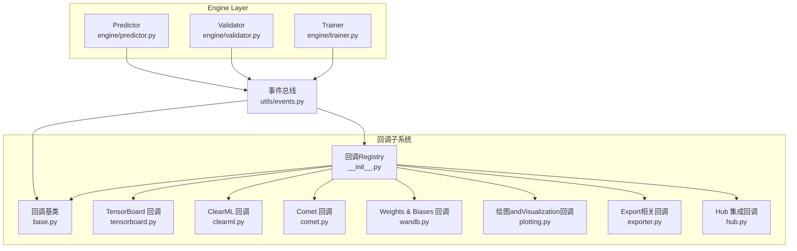
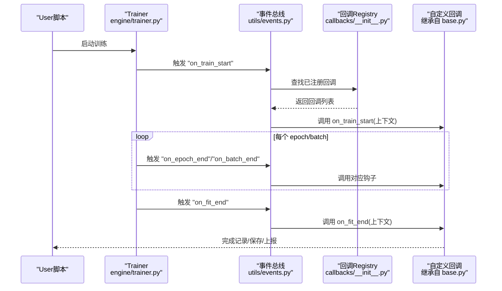
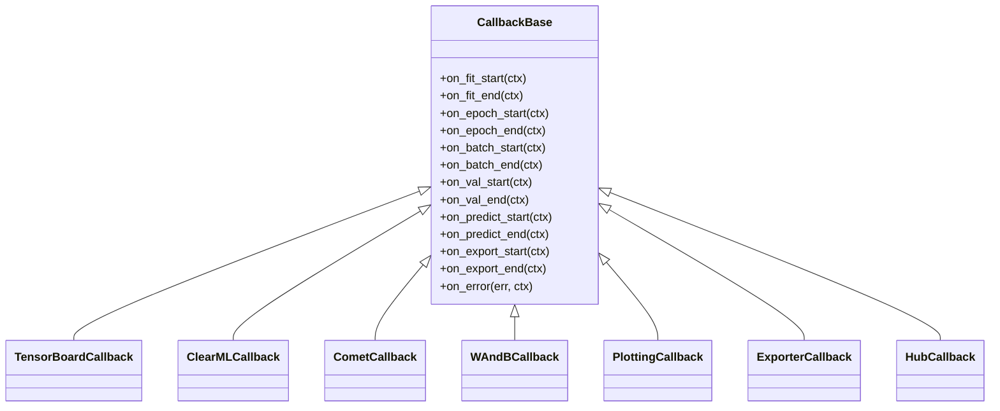
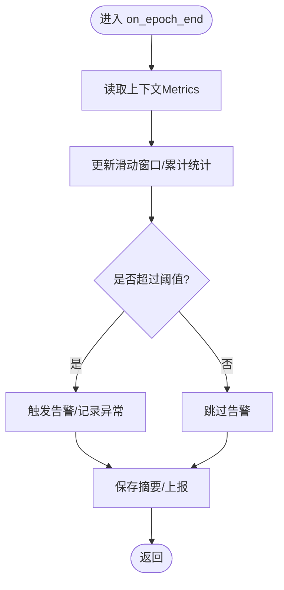
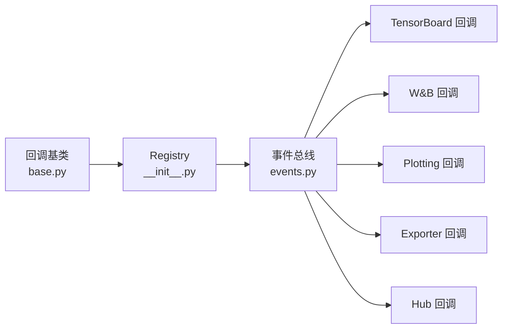

# 自定义回调开发指南

<cite>
**Files Referenced in This Document**
- [ultralytics/utils/callbacks/__init__.py](file://ultralytics/utils/callbacks/__init__.py)
- [ultralytics/utils/callbacks/base.py](file://ultralytics/utils/callbacks/base.py)
- [ultralytics/utils/callbacks/tensorboard.py](file://ultralytics/utils/callbacks/tensorboard.py)
- [ultralytics/utils/callbacks/clearml.py](file://ultralytics/utils/callbacks/clearml.py)
- [ultralytics/utils/callbacks/comet.py](file://ultralytics/utils/callbacks/comet.py)
- [ultralytics/utils/callbacks/wandb.py](file://ultralytics/utils/callbacks/wandb.py)
- [ultralytics/utils/callbacks/plotting.py](file://ultralytics/utils/callbacks/plotting.py)
- [ultralytics/utils/callbacks/exporter.py](file://ultralytics/utils/callbacks/exporter.py)
- [ultralytics/utils/callbacks/hub.py](file://ultralytics/utils/callbacks/hub.py)
- [ultralytics/engine/trainer.py](file://ultralytics/engine/trainer.py)
- [ultralytics/engine/validator.py](file://ultralytics/engine/validator.py)
- [ultralytics/engine/predictor.py](file://ultralytics/engine/predictor.py)
- [ultralytics/utils/events.py](file://ultralytics/utils/events.py)
</cite>

## Table of Contents
1. [Introduction](#Introduction)
2. [Project Structure](#Project Structure)
3. [Core Components](#Core Components)
4. [Architecture Overview](#Architecture Overview)
5. [Detailed Component Analysis](#Detailed Component Analysis)
6. [Dependency Analysis](#Dependency Analysis)
7. [性能考量](#性能考量)
8. [Troubleshooting Guide](#Troubleshooting Guide)
9. [Conclusion](#Conclusion)
10. [Appendix](#Appendix)

## Introduction
本指南targeting希望while YOLO-Master 中扩展Training、ValidationandInference生命周期的开发者，provides从零开始implementing“自定义回调”的完整路径。内容涵盖：
- such as何继承基类并implementing必需andOptional钩子方法
- 常见场景模板：Training监控、数据Visualization、模型分析、自动化测试
- 状态管理、配置Parameter Passing、and其他组件集成方式
- 调试技巧、性能测试and单元测试编写方法
- 最佳实践、常见问题andMigration建议
- 丰富的代码模板andRefer toimplementing（Centered on源码路径引用形式给出）

## Project Structure
YOLO-Master 的Callback System位于 utils/callbacks Table of Contents，由统一的Registryand事件总线drivers are installed，被Engine Layer（trainer/validator/predictor）while关键生命周期点Calls。

Figure Source
- [ultralytics/utils/callbacks/__init__.py](file://ultralytics/utils/callbacks/__init__.py)
- [ultralytics/utils/callbacks/base.py](file://ultralytics/utils/callbacks/base.py)
- [ultralytics/utils/callbacks/tensorboard.py](file://ultralytics/utils/callbacks/tensorboard.py)
- [ultralytics/utils/callbacks/clearml.py](file://ultralytics/utils/callbacks/clearml.py)
- [ultralytics/utils/callbacks/comet.py](file://ultralytics/utils/callbacks/comet.py)
- [ultralytics/utils/callbacks/wandb.py](file://ultralytics/utils/callbacks/wandb.py)
- [ultralytics/utils/callbacks/plotting.py](file://ultralytics/utils/callbacks/plotting.py)
- [ultralytics/utils/callbacks/exporter.py](file://ultralytics/utils/callbacks/exporter.py)
- [ultralytics/utils/callbacks/hub.py](file://ultralytics/utils/callbacks/hub.py)
- [ultralytics/engine/trainer.py](file://ultralytics/engine/trainer.py)
- [ultralytics/engine/validator.py](file://ultralytics/engine/validator.py)
- [ultralytics/engine/predictor.py](file://ultralytics/engine/predictor.py)
- [ultralytics/utils/events.py](file://ultralytics/utils/events.py)

Section Source
- [ultralytics/utils/callbacks/__init__.py](file://ultralytics/utils/callbacks/__init__.py)
- [ultralytics/utils/callbacks/base.py](file://ultralytics/utils/callbacks/base.py)
- [ultralytics/utils/callbacks/tensorboard.py](file://ultralytics/utils/callbacks/tensorboard.py)
- [ultralytics/utils/callbacks/clearml.py](file://ultralytics/utils/callbacks/clearml.py)
- [ultralytics/utils/callbacks/comet.py](file://ultralytics/utils/callbacks/comet.py)
- [ultralytics/utils/callbacks/wandb.py](file://ultralytics/utils/callbacks/wandb.py)
- [ultralytics/utils/callbacks/plotting.py](file://ultralytics/utils/callbacks/plotting.py)
- [ultralytics/utils/callbacks/exporter.py](file://ultralytics/utils/callbacks/exporter.py)
- [ultralytics/utils/callbacks/hub.py](file://ultralytics/utils/callbacks/hub.py)
- [ultralytics/engine/trainer.py](file://ultralytics/engine/trainer.py)
- [ultralytics/engine/validator.py](file://ultralytics/engine/validator.py)
- [ultralytics/engine/predictor.py](file://ultralytics/engine/predictor.py)
- [ultralytics/utils/events.py](file://ultralytics/utils/events.py)

## Core Components
- 回调基类：定义统一的生命周期钩子接口and默认空implementing，供User继承扩展。
- 回调Registry：集中管理Built-in回调的加载and实例化，Supporting按名称或类型注册。
- 事件总线：whileTraining/Validation/Inference的关键阶段触发事件，将上下文对象传递给已注册的回调。
- Built-in回调Examples：TensorBoard、ClearML、Comet、W&B、绘图、Export、Hub etc.，覆盖Logging、Visualization、Exportand平台集成。

Section Source
- [ultralytics/utils/callbacks/base.py](file://ultralytics/utils/callbacks/base.py)
- [ultralytics/utils/callbacks/__init__.py](file://ultralytics/utils/callbacks/__init__.py)
- [ultralytics/utils/events.py](file://ultralytics/utils/events.py)
- [ultralytics/utils/callbacks/tensorboard.py](file://ultralytics/utils/callbacks/tensorboard.py)
- [ultralytics/utils/callbacks/clearml.py](file://ultralytics/utils/callbacks/clearml.py)
- [ultralytics/utils/callbacks/comet.py](file://ultralytics/utils/callbacks/comet.py)
- [ultralytics/utils/callbacks/wandb.py](file://ultralytics/utils/callbacks/wandb.py)
- [ultralytics/utils/callbacks/plotting.py](file://ultralytics/utils/callbacks/plotting.py)
- [ultralytics/utils/callbacks/exporter.py](file://ultralytics/utils/callbacks/exporter.py)
- [ultralytics/utils/callbacks/hub.py](file://ultralytics/utils/callbacks/hub.py)

## Architecture Overview
下图展示了Callback SystemwhileTraining流程中的Calls时序and数据流向。

Figure Source
- [ultralytics/engine/trainer.py](file://ultralytics/engine/trainer.py)
- [ultralytics/utils/events.py](file://ultralytics/utils/events.py)
- [ultralytics/utils/callbacks/__init__.py](file://ultralytics/utils/callbacks/__init__.py)
- [ultralytics/utils/callbacks/base.py](file://ultralytics/utils/callbacks/base.py)

## Detailed Component Analysis

### 回调基类and生命周期钩子
- 基类职责
  - 定义标准钩子方法（such asTraining开始/End、每轮开始/End、批次开始/End、Validation前后、Export前后、错误处理etc.）。
  - provides默认空implementing，确保未覆盖的方法不会中断主流程。
  - 暴露通用工具（such as访问上下文对象、配置、设备信息etc.）。
- 常用钩子分类
  - Training期：on_fit_start/on_fit_end、on_epoch_start/on_epoch_end、on_batch_start/on_batch_end、on_train_end。
  - Validation期：on_val_start/on_val_end、on_val_batch_start/on_val_batch_end。
  - Inference期：on_predict_start/on_predict_end、on_predict_batch_start/on_predict_batch_end。
  - Export期：on_export_start/on_export_end。
  - 错误and恢复：on_error、on_resume。
- 设计要点
  - 钩子方法应幂etc.且无副作用（除非显式用于保存/上报）。
  - 避免阻塞 I/O；必要时异步或批量落盘。
  - Via上下文对象读取当前状态（epoch、batch、Metrics、模型句柄etc.），不要直接耦合内部变量名。

Section Source
- [ultralytics/utils/callbacks/base.py](file://ultralytics/utils/callbacks/base.py)
- [ultralytics/utils/events.py](file://ultralytics/utils/events.py)

### 回调Registryand事件总线
- Registry
  - 负责发现、加载和实例化回调（包括Built-inandUser自定义）。
  - Supporting按名称或类型注册，便于外部扩展。
- 事件总线
  - while引擎各阶段广播事件，附带上下文对象。
  - 保证回调执行顺序稳定，Supporting异常隔离and错误传播策略。

Section Source
- [ultralytics/utils/callbacks/__init__.py](file://ultralytics/utils/callbacks/__init__.py)
- [ultralytics/utils/events.py](file://ultralytics/utils/events.py)

### Built-in回调Refer toimplementing
- TensorBoard 回调：记录损失、Metrics、图像、直方图etc.。
- ClearML/Comet/W&B 回调：对接第三方实验Tracking平台。
- 绘图回调：生成Training曲线、混淆矩阵、PR 曲线etc.Visualization结果。
- Export回调：whileExport前后进行额外检查或记录。
- Hub 回调：and云端平台同步权重、元数据and报告。

Section Source
- [ultralytics/utils/callbacks/tensorboard.py](file://ultralytics/utils/callbacks/tensorboard.py)
- [ultralytics/utils/callbacks/clearml.py](file://ultralytics/utils/callbacks/clearml.py)
- [ultralytics/utils/callbacks/comet.py](file://ultralytics/utils/callbacks/comet.py)
- [ultralytics/utils/callbacks/wandb.py](file://ultralytics/utils/callbacks/wandb.py)
- [ultralytics/utils/callbacks/plotting.py](file://ultralytics/utils/callbacks/plotting.py)
- [ultralytics/utils/callbacks/exporter.py](file://ultralytics/utils/callbacks/exporter.py)
- [ultralytics/utils/callbacks/hub.py](file://ultralytics/utils/callbacks/hub.py)

### 自定义回调开发步骤（从入门to进阶）
- 步骤一：继承基类
  - 新建类继承回调基类，按需覆盖所需钩子。
- 步骤二：implementing最小可用版本
  - 至少覆盖 on_fit_start and on_fit_end，用于初始化and收尾。
- 步骤三：接入事件上下文
  - 从上下文读取 epoch、batch、Metrics、模型句柄etc.，避免硬编码。
- 步骤四：注册回调
  - ViaRegistry将自定义回调加入运行期回调列表。
- 步骤五：配置Parameter Passing
  - Uses配置对象或构造参数传入可调超参（such as采样频率、阈值、输出路径）。
- 步骤六：状态管理
  - while回调内维护轻量状态（such as累计计数、窗口统计），注意跨进程/分布式一致性。
- 步骤七：集成外部系统
  - 对接Logging、Visualization、告警、模型仓库etc.，遵循幂etc.and重试策略。
- 步骤八：测试and回归
  - 编写单测and端to端用例，覆盖正常路径and异常路径。

Section Source
- [ultralytics/utils/callbacks/base.py](file://ultralytics/utils/callbacks/base.py)
- [ultralytics/utils/callbacks/__init__.py](file://ultralytics/utils/callbacks/__init__.py)
- [ultralytics/utils/events.py](file://ultralytics/utils/events.py)

### 典型场景模板andRefer toimplementing

#### 场景一：Training监控（Metrics采集and告警）
- 目标：while每轮/每批End时采集Metrics，计算滑动平均，超过阈值触发告警。
- 关键点：
  - while on_epoch_end/on_batch_end 中读取Metrics。
  - Uses线程安全的数据结构维护状态。
  - 告警逻辑可复用现有通知通道或写入本地文件。
- Refer toimplementing路径：
  - [ultralytics/utils/callbacks/tensorboard.py](file://ultralytics/utils/callbacks/tensorboard.py)
  - [ultralytics/utils/callbacks/wandb.py](file://ultralytics/utils/callbacks/wandb.py)

Section Source
- [ultralytics/utils/callbacks/tensorboard.py](file://ultralytics/utils/callbacks/tensorboard.py)
- [ultralytics/utils/callbacks/wandb.py](file://ultralytics/utils/callbacks/wandb.py)

#### 场景二：数据Visualization（Training曲线and样本图）
- 目标：绘制损失曲线、类别精度、样本检测图。
- 关键点：
  - while on_epoch_end 聚合Metrics并绘图。
  - while on_val_batch_end 抽取少量样本进行Visualization。
  - 控制 IO 频率，避免拖慢Training。
- Refer toimplementing路径：
  - [ultralytics/utils/callbacks/plotting.py](file://ultralytics/utils/callbacks/plotting.py)
  - [ultralytics/utils/callbacks/tensorboard.py](file://ultralytics/utils/callbacks/tensorboard.py)

Section Source
- [ultralytics/utils/callbacks/plotting.py](file://ultralytics/utils/callbacks/plotting.py)
- [ultralytics/utils/callbacks/tensorboard.py](file://ultralytics/utils/callbacks/tensorboard.py)

#### 场景三：模型分析（Gradient/激活/稀疏度）
- 目标：定期统计Gradient范数、激活分布、专家路由稀疏度etc.。
- 关键点：
  - while on_batch_end 或 on_epoch_end 收集统计量。
  - Uses直方图/散点图/热力图呈现。
  - 对大规模模型采用采样Centered on降低开销。
- Refer toimplementing路径：
  - [ultralytics/utils/callbacks/tensorboard.py](file://ultralytics/utils/callbacks/tensorboard.py)
  - [ultralytics/utils/callbacks/plotting.py](file://ultralytics/utils/callbacks/plotting.py)

Section Source
- [ultralytics/utils/callbacks/tensorboard.py](file://ultralytics/utils/callbacks/tensorboard.py)
- [ultralytics/utils/callbacks/plotting.py](file://ultralytics/utils/callbacks/plotting.py)

#### 场景四：自动化测试（断言and门禁）
- 目标：whileValidation阶段自动断言Metrics阈值，失败则中止Training或标记构建失败。
- 关键点：
  - while on_val_end 读取ValidationMetrics并断言。
  - Combining CI 环境输出结构化报告。
- Refer toimplementing路径：
  - [ultralytics/engine/validator.py](file://ultralytics/engine/validator.py)
  - [ultralytics/utils/callbacks/plotting.py](file://ultralytics/utils/callbacks/plotting.py)

Section Source
- [ultralytics/engine/validator.py](file://ultralytics/engine/validator.py)
- [ultralytics/utils/callbacks/plotting.py](file://ultralytics/utils/callbacks/plotting.py)

#### 场景五：Export前Post-Processing（格式校验and签名）
- 目标：whileExport前检查模型状态，Export后生成校验摘要。
- 关键点：
  - while on_export_start/on_export_end 插入钩子。
  - 记录Export参数、哈希、尺寸etc.信息。
- Refer toimplementing路径：
  - [ultralytics/utils/callbacks/exporter.py](file://ultralytics/utils/callbacks/exporter.py)

Section Source
- [ultralytics/utils/callbacks/exporter.py](file://ultralytics/utils/callbacks/exporter.py)

#### 场景六：平台集成（Hub/远程存储）
- 目标：将权重、Logging、报告上传至云端或远端存储。
- 关键点：
  - while on_fit_end/on_val_end 触发上传。
  - 处理网络异常and重试。
- Refer toimplementing路径：
  - [ultralytics/utils/callbacks/hub.py](file://ultralytics/utils/callbacks/hub.py)

Section Source
- [ultralytics/utils/callbacks/hub.py](file://ultralytics/utils/callbacks/hub.py)

### targeting对象结构图（回调体系）

Figure Source
- [ultralytics/utils/callbacks/base.py](file://ultralytics/utils/callbacks/base.py)
- [ultralytics/utils/callbacks/tensorboard.py](file://ultralytics/utils/callbacks/tensorboard.py)
- [ultralytics/utils/callbacks/clearml.py](file://ultralytics/utils/callbacks/clearml.py)
- [ultralytics/utils/callbacks/comet.py](file://ultralytics/utils/callbacks/comet.py)
- [ultralytics/utils/callbacks/wandb.py](file://ultralytics/utils/callbacks/wandb.py)
- [ultralytics/utils/callbacks/plotting.py](file://ultralytics/utils/callbacks/plotting.py)
- [ultralytics/utils/callbacks/exporter.py](file://ultralytics/utils/callbacks/exporter.py)
- [ultralytics/utils/callbacks/hub.py](file://ultralytics/utils/callbacks/hub.py)

### 复杂逻辑流程图（Metrics采集and阈值告警）

Figure Source
- [ultralytics/utils/callbacks/base.py](file://ultralytics/utils/callbacks/base.py)
- [ultralytics/utils/callbacks/tensorboard.py](file://ultralytics/utils/callbacks/tensorboard.py)

## Dependency Analysis
- 低耦合高内聚
  - 回调仅依赖事件总线and上下文对象，不直接侵入引擎内部implementing。
- 直接依赖
  - 回调Registry依赖基类and具体回调implementing。
  - 事件总线依赖RegistryCentered on分发事件。
- Potential Cycles依赖
  - 应避免回调反向依赖引擎内部Modules；such as需访问模型，请Via上下文provides的只读接口。
- External Dependencies
  - 第三方库（such as tensorboard、wandb、clearml、comet）仅while对应回调中引入，降低主包体积and导入成本。

Figure Source
- [ultralytics/utils/callbacks/base.py](file://ultralytics/utils/callbacks/base.py)
- [ultralytics/utils/callbacks/__init__.py](file://ultralytics/utils/callbacks/__init__.py)
- [ultralytics/utils/events.py](file://ultralytics/utils/events.py)
- [ultralytics/utils/callbacks/tensorboard.py](file://ultralytics/utils/callbacks/tensorboard.py)
- [ultralytics/utils/callbacks/wandb.py](file://ultralytics/utils/callbacks/wandb.py)
- [ultralytics/utils/callbacks/plotting.py](file://ultralytics/utils/callbacks/plotting.py)
- [ultralytics/utils/callbacks/exporter.py](file://ultralytics/utils/callbacks/exporter.py)
- [ultralytics/utils/callbacks/hub.py](file://ultralytics/utils/callbacks/hub.py)

Section Source
- [ultralytics/utils/callbacks/base.py](file://ultralytics/utils/callbacks/base.py)
- [ultralytics/utils/callbacks/__init__.py](file://ultralytics/utils/callbacks/__init__.py)
- [ultralytics/utils/events.py](file://ultralytics/utils/events.py)

## 性能考量
- 减少 I/O 频率：合并写入、批量上报、延迟落盘。
- 采样and降采样：对高频事件（such as batch 级）进行采样。
- 避免阻塞：Uses异步队列或后台线程处理耗时Tasks。
- 内存占用：and时释放中间结果，避免累积大对象。
- 多进程/分布式：确保状态一致性and锁粒度合理。

[本节for通用指导，无需源码引用]

## Troubleshooting Guide
- 常见问题
  - 回调未触发：检查Registry是否正确加载、事件名称是否匹配。
  - 上下文缺失字段：确认事件版本and上下文结构，避免硬编码字段名。
  - 性能退化：定位耗时钩子，增加采样或异步处理。
  - 并发冲突：for共享状态加锁或Uses线程安全容器。
  - 第三方库导入失败：按需导入，provides降级路径。
- 调试技巧
  - while on_error 钩子中打印堆栈and上下文快照。
  - Uses轻量Logging框架，按级别过滤。
  - 针对关键路径添加断言and快速失败。
- 单元测试
  - 模拟事件上下文，Validation回调行forand边界条件。
  - Uses小数据集and短Training步数进行回归测试。
  - 隔离External Dependencies（网络、磁盘），Uses mock 或内存文件系统。

Section Source
- [ultralytics/utils/callbacks/base.py](file://ultralytics/utils/callbacks/base.py)
- [ultralytics/utils/events.py](file://ultralytics/utils/events.py)

## Conclusion
Via继承回调基类并利用事件总线，开发者可Centered onCentered on最小侵入的方式扩展 YOLO-Master 的Training、ValidationandInferencecapabilities。遵循幂etc.、低耦合、可观测and可测试的原则，能够构建出稳定高效的自定义回调生态。

[本节for总结性内容，无需源码引用]

## Appendix

### 开发清单and最佳实践
- 明确职责：一个回调只做一件事，保持单一职责。
- 幂etc.设计：重复Calls不应改变业务状态。
- configuration-first：所有可调参数Via配置对象注入。
- 优雅降级：External Dependencies不可用is available, fall back to本地记录。
- Documentation完善：for钩子方法and配置项补充说明andExamples。

[本节for通用指导，无需源码引用]

### Migration指南（从旧版回调机制）
- 识别旧钩子and新钩子的映射关系。
- 逐步替换回调implementing，先覆盖 on_fit_start/on_fit_end Validation链路。
- Uses事件名称对照表核对兼容性。
- while CI 中增加回归用例，确保行for一致。

[本节for通用指导，无需源码引用]