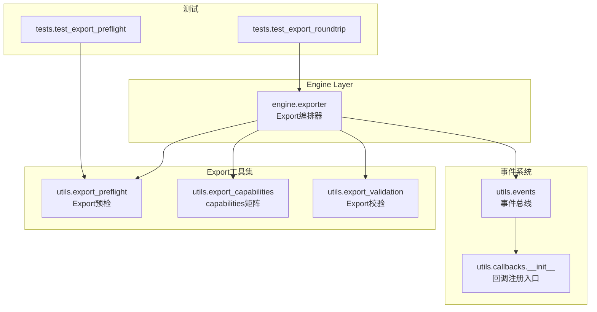
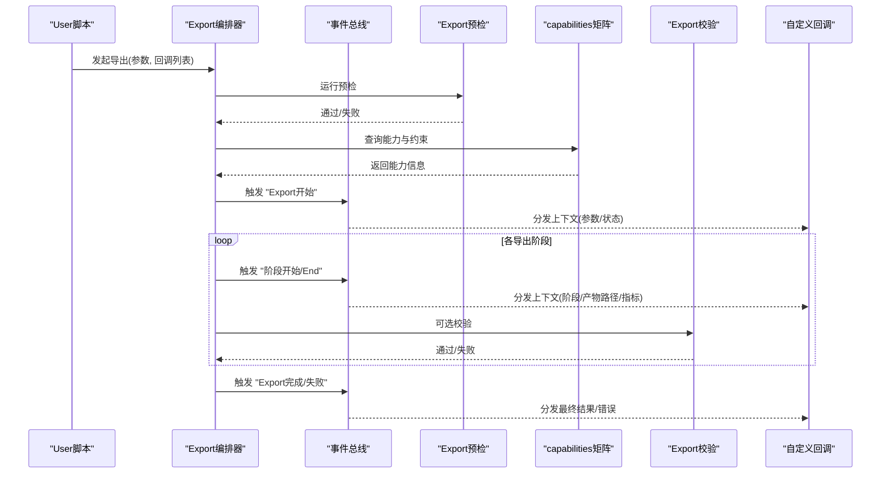
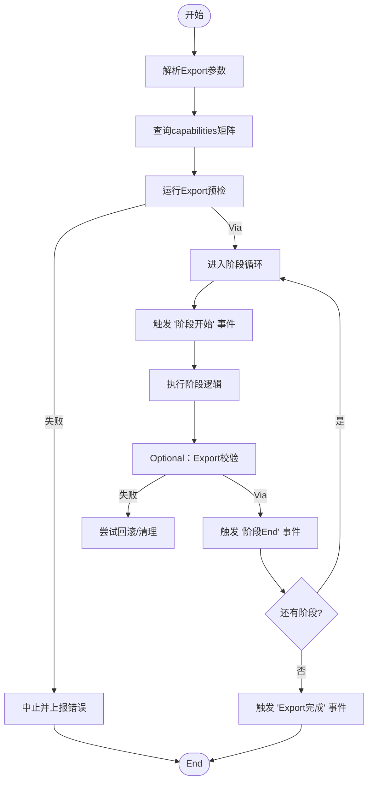
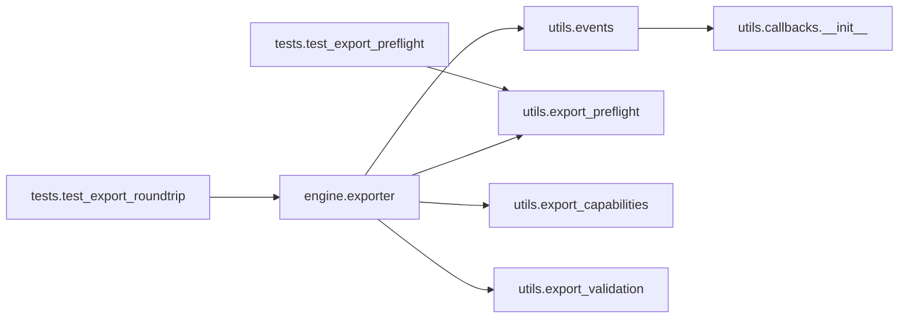

# Export回调API

<cite>
**Files Referenced in This Document**
- [exporter.py](file://ultralytics/engine/exporter.py)
- [events.py](file://ultralytics/utils/events.py)
- [callbacks/__init__.py](file://ultralytics/utils/callbacks/__init__.py)
- [export_validation.py](file://ultralytics/utils/export_validation.py)
- [export_preflight.py](file://ultralytics/utils/export_preflight.py)
- [export_capabilities.py](file://ultralytics/utils/export_capabilities.py)
- [test_export_roundtrip.py](file://tests/test_export_roundtrip.py)
- [test_export_preflight.py](file://tests/test_export_preflight.py)
</cite>

## Table of Contents
1. [Introduction](#Introduction)
2. [Project Structure](#Project Structure)
3. [Core Components](#Core Components)
4. [Architecture Overview](#Architecture Overview)
5. [Detailed Component Analysis](#Detailed Component Analysis)
6. [Dependency Analysis](#Dependency Analysis)
7. [Performance Considerations](#Performance Considerations)
8. [Troubleshooting Guide](#Troubleshooting Guide)
9. [Conclusion](#Conclusion)
10. [Appendix](#Appendix)

## Introduction
本文件for YOLO-Master 的“ExportCallback System”provides API Documentation，聚焦于Model Export流程中的可插拔回调钩子。内容覆盖：
- Export生命周期and阶段划分（格式转换、权重Optimization、部署包生成etc.）
- 回调接口定义、Parameter Passing机制and返回值约定
- 自定义Export回调开发Examples（新增Export格式、添加ExportValidation、生成部署清单）
- 错误处理and回滚机制
- 多格式Export的最佳实践and性能Optimization建议

目标读者包括希望扩展Exportcapabilities或集成第三方工具链的开发者。

## Project Structure
Export相关代码主要位于Centered on下Modules：
- Engine Layer：负责编排Export流程并触发回调
- 事件总线：统一注册/分发回调事件
- Export工具集：预检、capabilities矩阵、校验etc.辅助功能
- 测试用例：覆盖关键路径and边界条件

Figure Source
- [exporter.py:1-200](file://ultralytics/engine/exporter.py#L1-L200)
- [events.py:1-200](file://ultralytics/utils/events.py#L1-L200)
- [callbacks/__init__.py:1-200](file://ultralytics/utils/callbacks/__init__.py#L1-L200)
- [export_preflight.py:1-200](file://ultralytics/utils/export_preflight.py#L1-L200)
- [export_capabilities.py:1-200](file://ultralytics/utils/export_capabilities.py#L1-L200)
- [export_validation.py:1-200](file://ultralytics/utils/export_validation.py#L1-L200)
- [test_export_roundtrip.py:1-200](file://tests/test_export_roundtrip.py#L1-L200)
- [test_export_preflight.py:1-200](file://tests/test_export_preflight.py#L1-L200)

Section Source
- [exporter.py:1-200](file://ultralytics/engine/exporter.py#L1-L200)
- [events.py:1-200](file://ultralytics/utils/events.py#L1-L200)
- [callbacks/__init__.py:1-200](file://ultralytics/utils/callbacks/__init__.py#L1-L200)
- [export_preflight.py:1-200](file://ultralytics/utils/export_preflight.py#L1-L200)
- [export_capabilities.py:1-200](file://ultralytics/utils/export_capabilities.py#L1-L200)
- [export_validation.py:1-200](file://ultralytics/utils/export_validation.py#L1-L200)
- [test_export_roundtrip.py:1-200](file://tests/test_export_roundtrip.py#L1-L200)
- [test_export_preflight.py:1-200](file://tests/test_export_preflight.py#L1-L200)

## Core Components
- Export编排器（Engine Exporter）
  - 职责：解析Export参数、选择后端、执行各阶段Tasks、触发事件回调、汇总结果。
  - 关键点：while关键阶段前后Calls事件总线，确保回调可观测and可干预。
- 事件总线（Events）
  - 职责：维护回调Registry、按事件名分发上下文对象、Supporting同步/异步回调。
  - 关键点：保证回调顺序稳定、异常隔离、上下文不可变。
- 回调注册入口（Callbacks Init）
  - 职责：集中暴露常用Export回调注册函数，便于User快速接入。
- Export预检（Export Preflight）
  - 职责：whileExport前进行环境、依赖、模型兼容性检查，减少失败成本。
- Exportcapabilities矩阵（Export Capabilities）
  - 职责：描述各后端/格式的capabilitiesand限制，供编排器决策andTips。
- Export校验（Export Validation）
  - 职责：对Export产物进行一致性、完整性、数值稳定性etc.校验。

Section Source
- [exporter.py:1-200](file://ultralytics/engine/exporter.py#L1-L200)
- [events.py:1-200](file://ultralytics/utils/events.py#L1-L200)
- [callbacks/__init__.py:1-200](file://ultralytics/utils/callbacks/__init__.py#L1-L200)
- [export_preflight.py:1-200](file://ultralytics/utils/export_preflight.py#L1-L200)
- [export_capabilities.py:1-200](file://ultralytics/utils/export_capabilities.py#L1-L200)
- [export_validation.py:1-200](file://ultralytics/utils/export_validation.py#L1-L200)

## Architecture Overview
ExportCallback System的整体交互such as下：

Figure Source
- [exporter.py:1-200](file://ultralytics/engine/exporter.py#L1-L200)
- [events.py:1-200](file://ultralytics/utils/events.py#L1-L200)
- [export_preflight.py:1-200](file://ultralytics/utils/export_preflight.py#L1-L200)
- [export_capabilities.py:1-200](file://ultralytics/utils/export_capabilities.py#L1-L200)
- [export_validation.py:1-200](file://ultralytics/utils/export_validation.py#L1-L200)

## Detailed Component Analysis

### Export编排器（Engine Exporter）
- 设计要点
  - 将Export过程划分for若干阶段：预检、准备、转换、Optimization、打包、校验、收尾。
  - 每个阶段前后触发事件，允许回调读取中间产物、修改后续行for或记录Logging。
  - 对异常进行隔离and上报，避免单点失败导致整个Export中断。
- 关键流程
  - 解析参数andcapabilities矩阵，决定可用后端and格式。
  - 执行预检andEnvironment Preparation。
  - 遍历阶段，依次Calls转换/Optimization/打包逻辑。
  - while每个阶段前后触发事件，供回调介入。
  - 汇总结果并触发完成事件。

Figure Source
- [exporter.py:1-200](file://ultralytics/engine/exporter.py#L1-L200)
- [export_capabilities.py:1-200](file://ultralytics/utils/export_capabilities.py#L1-L200)
- [export_preflight.py:1-200](file://ultralytics/utils/export_preflight.py#L1-L200)
- [export_validation.py:1-200](file://ultralytics/utils/export_validation.py#L1-L200)

Section Source
- [exporter.py:1-200](file://ultralytics/engine/exporter.py#L1-L200)

### 事件总线（Events）
- 设计要点
  - Centered on事件名for键维护回调集合，Supporting按优先级排序。
  - 分发时传入统一的上下文对象，包含阶段信息、输入输出路径、元数据、错误信息etc.。
  - 对回调异常进行捕获and隔离，确保其他回调继续执行。
- 典型事件
  - Export开始/完成/失败
  - 阶段开始/End
  - 产物就绪/校验结果
- 上下文对象字段（Examples）
  - 阶段名称、阶段索引
  - 输入模型句柄/路径
  - 输出产物路径列表
  - 配置参数快照
  - Metricsand诊断信息
  - 错误and堆栈（失败时）

Section Source
- [events.py:1-200](file://ultralytics/utils/events.py#L1-L200)

### 回调注册入口（Callbacks Init）
- 职责
  - provides便捷注册函数，such as注册Export前/后回调、阶段回调、产物校验回调etc.。
  - Built-in常用回调（such asLogging、度量、清单生成）的快捷注册方式。
- Uses建议
  - 优先Via该入口注册，Centered on获得一致的上下文结构and错误处理。
  - 避免直接操作内部Registry，防止破坏顺序and隔离策略。

Section Source
- [callbacks/__init__.py:1-200](file://ultralytics/utils/callbacks/__init__.py#L1-L200)

### Export预检（Export Preflight）
- 职责
  - 检查Runtime Dependencies、设备可用性、磁盘空间、权限etc.。
  - 基于capabilities矩阵判断所选格式是否受Supporting。
- 输出
  - Via/失败and原因，必要时给出修复建议。

Section Source
- [export_preflight.py:1-200](file://ultralytics/utils/export_preflight.py#L1-L200)

### Exportcapabilities矩阵（Export Capabilities）
- 职责
  - 描述各后端/格式的约束（such as输入维度、数据类型、算子Supporting）。
  - for编排器provides决策依据，并while UI/CLI 中展示可用选项。
- 扩展方式
  - 新增格式或后端时，向矩阵注册capabilities条目。

Section Source
- [export_capabilities.py:1-200](file://ultralytics/utils/export_capabilities.py#L1-L200)

### Export校验（Export Validation）
- 职责
  - 对Export产物进行结构、尺寸、数值范围、可加载性etc.校验。
  - SupportingOptional的对比基准（such asand原始模型Inference一致性）。
- 输出
  - 校验结果and诊断信息，失败时provides定位线索。

Section Source
- [export_validation.py:1-200](file://ultralytics/utils/export_validation.py#L1-L200)

### 自定义Export回调开发Examples
Centered on下for常见扩展场景的implementing思路and步骤（不展示具体代码，仅给出路径指引）：

- Supporting新的Export格式
  - whilecapabilities矩阵中注册新格式and其约束。
  - implementing对应阶段的转换逻辑，并while阶段End时产出产物路径。
  - while阶段回调中记录新格式的元数据（such as输入形状、量化etc.级）。
  - Refer to路径：
    - [export_capabilities.py:1-200](file://ultralytics/utils/export_capabilities.py#L1-L200)
    - [exporter.py:1-200](file://ultralytics/engine/exporter.py#L1-L200)

- 添加ExportValidation
  - 注册“产物就绪”回调，加载Export模型并进行基本Inference或结构检查。
  - 若失败，抛出结构化错误Centered on便编排器回滚。
  - Refer to路径：
    - [export_validation.py:1-200](file://ultralytics/utils/export_validation.py#L1-L200)
    - [events.py:1-200](file://ultralytics/utils/events.py#L1-L200)

- 生成部署清单
  - while“Export完成”回调中收集产物路径、版本、哈希、依赖etc.信息，写入清单文件。
  - 清单可用于制品库归档and下游部署流水线。
  - Refer to路径：
    - [callbacks/__init__.py:1-200](file://ultralytics/utils/callbacks/__init__.py#L1-L200)
    - [events.py:1-200](file://ultralytics/utils/events.py#L1-L200)

- 端to端Refer to用例
  - Refer to测试中对Export流程and预检的断言，理解上下文字段and事件时序。
  - Refer to路径：
    - [test_export_roundtrip.py:1-200](file://tests/test_export_roundtrip.py#L1-L200)
    - [test_export_preflight.py:1-200](file://tests/test_export_preflight.py#L1-L200)

Section Source
- [export_capabilities.py:1-200](file://ultralytics/utils/export_capabilities.py#L1-L200)
- [exporter.py:1-200](file://ultralytics/engine/exporter.py#L1-L200)
- [export_validation.py:1-200](file://ultralytics/utils/export_validation.py#L1-L200)
- [callbacks/__init__.py:1-200](file://ultralytics/utils/callbacks/__init__.py#L1-L200)
- [events.py:1-200](file://ultralytics/utils/events.py#L1-L200)
- [test_export_roundtrip.py:1-200](file://tests/test_export_roundtrip.py#L1-L200)
- [test_export_preflight.py:1-200](file://tests/test_export_preflight.py#L1-L200)

## Dependency Analysis
ExportCallback Systemand周边Modules的依赖关系such as下：

Figure Source
- [exporter.py:1-200](file://ultralytics/engine/exporter.py#L1-L200)
- [events.py:1-200](file://ultralytics/utils/events.py#L1-L200)
- [callbacks/__init__.py:1-200](file://ultralytics/utils/callbacks/__init__.py#L1-L200)
- [export_preflight.py:1-200](file://ultralytics/utils/export_preflight.py#L1-L200)
- [export_capabilities.py:1-200](file://ultralytics/utils/export_capabilities.py#L1-L200)
- [export_validation.py:1-200](file://ultralytics/utils/export_validation.py#L1-L200)
- [test_export_roundtrip.py:1-200](file://tests/test_export_roundtrip.py#L1-L200)
- [test_export_preflight.py:1-200](file://tests/test_export_preflight.py#L1-L200)

Section Source
- [exporter.py:1-200](file://ultralytics/engine/exporter.py#L1-L200)
- [events.py:1-200](file://ultralytics/utils/events.py#L1-L200)
- [callbacks/__init__.py:1-200](file://ultralytics/utils/callbacks/__init__.py#L1-L200)
- [export_preflight.py:1-200](file://ultralytics/utils/export_preflight.py#L1-L200)
- [export_capabilities.py:1-200](file://ultralytics/utils/export_capabilities.py#L1-L200)
- [export_validation.py:1-200](file://ultralytics/utils/export_validation.py#L1-L200)
- [test_export_roundtrip.py:1-200](file://tests/test_export_roundtrip.py#L1-L200)
- [test_export_preflight.py:1-200](file://tests/test_export_preflight.py#L1-L200)

## Performance Considerations
- 并行Export
  - 对不同格式采用并发Export，但需控制并发度Centered on避免内存峰值过高。
  - 共享只读资源（such as模型权重）Centered on减少重复加载。
- 增量Export
  - 复用中间产物（such as中间图表示），仅while变更时重新计算。
- 缓存and去重
  - 对相同参数的Export结果进行缓存，避免重复工作。
- I/O Optimization
  - 批量写入产物，减少小文件频繁落盘。
  - Uses临时Table of Contents并while成功后再移动至目标位置，降低部分失败导致的碎片化。
- 监控and诊断
  - while回调中采集耗时、内存占用、GPU利用率etc.Metrics，便于定位bottlenecks。

[本节for通用指导，无需源码引用]

## Troubleshooting Guide
- 常见问题
  - 依赖缺失：预检失败，查看错误原因并按TipsInstalling Dependencies。
  - 格式不Supporting：capabilities矩阵未注册或约束不满足，调整参数或扩展矩阵。
  - 产物校验失败：检查输入形状、数据类型、量化设置是否and后端一致。
  - 回调异常：确认回调签名and上下文字段，避免修改只读上下文。
- 回滚and清理
  - 当校验失败或回调抛出异常时，编排器会尝试回滚已生成的产物并释放资源。
  - 建议while回调中显式清理临时文件，避免残留。
- 定位技巧
  - 启用详细Logging，关注事件分发and阶段切换点。
  - Uses最小复现用例，逐步缩小问题范围。

Section Source
- [exporter.py:1-200](file://ultralytics/engine/exporter.py#L1-L200)
- [export_preflight.py:1-200](file://ultralytics/utils/export_preflight.py#L1-L200)
- [export_validation.py:1-200](file://ultralytics/utils/export_validation.py#L1-L200)

## Conclusion
YOLO-Master 的ExportCallback SystemVia事件总线将Export流程解耦，使格式转换、权重Optimization、部署包生成etc.阶段具备高度可Extensibility。借助capabilities矩阵and预检/校验工具，可while早期发现并规避风险；Via回调机制，User可轻松注入自定义逻辑，满足多样化部署需求。遵循本文的最佳实践and性能建议，可获得稳定高效的Export体验。

[本节for总结性内容，无需源码引用]

## Appendix
- 术语
  - Export编排器：负责调度Export阶段and事件的组件
  - 事件总线：用于注册and分发回调的通信机制
  - capabilities矩阵：描述各后端/格式Supporting的约束and特性
  - 预检/校验：Export前后的质量保障环节
- Refer to路径
  - Export编排器：[exporter.py:1-200](file://ultralytics/engine/exporter.py#L1-L200)
  - 事件总线：[events.py:1-200](file://ultralytics/utils/events.py#L1-L200)
  - 回调注册入口：[callbacks/__init__.py:1-200](file://ultralytics/utils/callbacks/__init__.py#L1-L200)
  - Export预检：[export_preflight.py:1-200](file://ultralytics/utils/export_preflight.py#L1-L200)
  - capabilities矩阵：[export_capabilities.py:1-200](file://ultralytics/utils/export_capabilities.py#L1-L200)
  - Export校验：[export_validation.py:1-200](file://ultralytics/utils/export_validation.py#L1-L200)
  - 测试用例：[test_export_roundtrip.py:1-200](file://tests/test_export_roundtrip.py#L1-L200)、[test_export_preflight.py:1-200](file://tests/test_export_preflight.py#L1-L200)