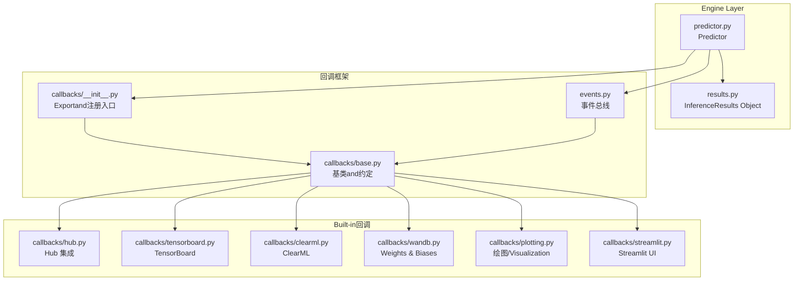
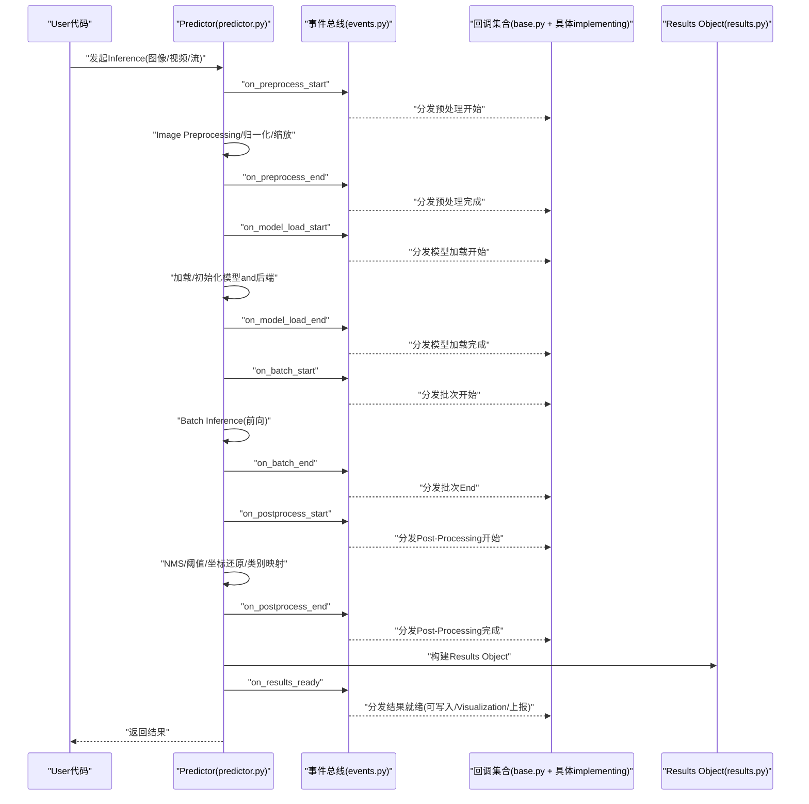
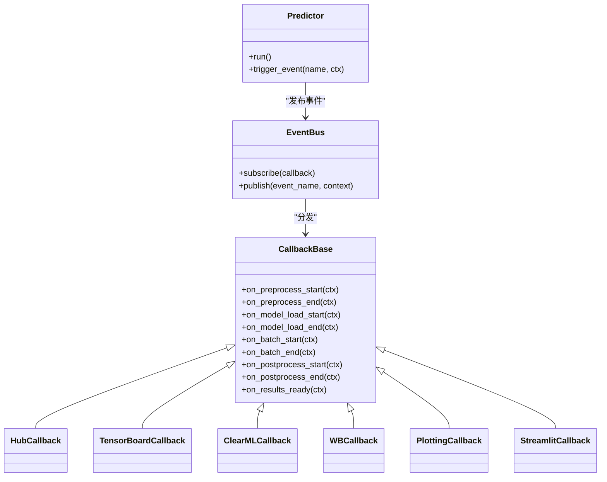

# Inference回调API

<cite>
**Files Referenced in This Document**
- [ultralytics/engine/predictor.py](file://ultralytics/engine/predictor.py)
- [ultralytics/utils/callbacks/__init__.py](file://ultralytics/utils/callbacks/__init__.py)
- [ultralytics/utils/callbacks/base.py](file://ultralytics/utils/callbacks/base.py)
- [ultralytics/utils/callbacks/hub.py](file://ultralytics/utils/callbacks/hub.py)
- [ultralytics/utils/callbacks/tensorboard.py](file://ultralytics/utils/callbacks/tensorboard.py)
- [ultralytics/utils/callbacks/clearml.py](file://ultralytics/utils/callbacks/clearml.py)
- [ultralytics/utils/callbacks/wandb.py](file://ultralytics/utils/callbacks/wandb.py)
- [ultralytics/utils/callbacks/plotting.py](file://ultralytics/utils/callbacks/plotting.py)
- [ultralytics/utils/callbacks/streamlit.py](file://ultralytics/utils/callbacks/streamlit.py)
- [ultralytics/utils/events.py](file://ultralytics/utils/events.py)
- [ultralytics/engine/results.py](file://ultralytics/engine/results.py)
</cite>

## Table of Contents
1. [Introduction](#Introduction)
2. [Project Structure](#Project Structure)
3. [Core Components](#Core Components)
4. [Architecture Overview](#Architecture Overview)
5. [Detailed Component Analysis](#Detailed Component Analysis)
6. [Dependency Analysis](#Dependency Analysis)
7. [性能考量](#性能考量)
8. [Troubleshooting Guide](#Troubleshooting Guide)
9. [Conclusion](#Conclusion)
10. [Appendix](#Appendix)

## Introduction
本文件for YOLO-Master InferenceCallback System的权威 API Documentation，聚焦于Inference阶段的钩子机制and扩展点。内容覆盖：
- Inference生命周期中的关键阶段：Image Preprocessing、模型加载、Batch Inference、结果Post-Processingetc.
- Built-in回调：Hub 集成、平台特定Optimization、Visualizationand监控（TensorBoard/ClearML/W&B）、流式 UI（Streamlit）etc.
- 自定义Inference回调开发指南：实时处理、流式Inference、内存管理Optimization
- 错误处理and异常恢复机制
- 性能分析and调试工具Uses方法

## Project Structure
andInference回调相关的代码主要分布whileCentered on下Modules：
- 引擎侧：Predictor负责编排Inference流程并触发事件
- 回调框架：统一的事件注册、分发and执行
- Built-in回调：Hub、Visualization、监控、UI etc.
- 事件总线：统一的时序and上下文传递

Figure Source
- [ultralytics/engine/predictor.py](file://ultralytics/engine/predictor.py)
- [ultralytics/utils/callbacks/__init__.py](file://ultralytics/utils/callbacks/__init__.py)
- [ultralytics/utils/callbacks/base.py](file://ultralytics/utils/callbacks/base.py)
- [ultralytics/utils/events.py](file://ultralytics/utils/events.py)
- [ultralytics/utils/callbacks/hub.py](file://ultralytics/utils/callbacks/hub.py)
- [ultralytics/utils/callbacks/tensorboard.py](file://ultralytics/utils/callbacks/tensorboard.py)
- [ultralytics/utils/callbacks/clearml.py](file://ultralytics/utils/callbacks/clearml.py)
- [ultralytics/utils/callbacks/wandb.py](file://ultralytics/utils/callbacks/wandb.py)
- [ultralytics/utils/callbacks/plotting.py](file://ultralytics/utils/callbacks/plotting.py)
- [ultralytics/utils/callbacks/streamlit.py](file://ultralytics/utils/callbacks/streamlit.py)
- [ultralytics/engine/results.py](file://ultralytics/engine/results.py)

Section Source
- [ultralytics/engine/predictor.py](file://ultralytics/engine/predictor.py)
- [ultralytics/utils/callbacks/__init__.py](file://ultralytics/utils/callbacks/__init__.py)
- [ultralytics/utils/callbacks/base.py](file://ultralytics/utils/callbacks/base.py)
- [ultralytics/utils/events.py](file://ultralytics/utils/events.py)
- [ultralytics/utils/callbacks/hub.py](file://ultralytics/utils/callbacks/hub.py)
- [ultralytics/utils/callbacks/tensorboard.py](file://ultralytics/utils/callbacks/tensorboard.py)
- [ultralytics/utils/callbacks/clearml.py](file://ultralytics/utils/callbacks/clearml.py)
- [ultralytics/utils/callbacks/wandb.py](file://ultralytics/utils/callbacks/wandb.py)
- [ultralytics/utils/callbacks/plotting.py](file://ultralytics/utils/callbacks/plotting.py)
- [ultralytics/utils/callbacks/streamlit.py](file://ultralytics/utils/callbacks/streamlit.py)
- [ultralytics/engine/results.py](file://ultralytics/engine/results.py)

## Core Components
- Predictor（Predictor）
  - 职责：组织输入、调度预处理、Calls模型、执行Post-Processing、生成Results Object、触发事件
  - 关键点：while关键阶段Via事件总线发出“开始/End”事件，供回调订阅
- 回调基类and约定
  - 职责：定义回调接口、参数约定、生命周期顺序、异常隔离策略
  - 关键点：provides统一的 on_xxx 方法命名规范and上下文对象
- 事件总线（Events）
  - 职责：维护订阅者列表、按序分发事件、携带上下文数据
  - 关键点：Supporting同步/异步场景下的可靠分发and错误隔离
- Results Object（Results）
  - 职责：Encapsulates单帧或批次的检测结果、元信息、Visualization辅助
  - 关键点：作forPost-ProcessingandVisualization回调的输入载体

Section Source
- [ultralytics/engine/predictor.py](file://ultralytics/engine/predictor.py)
- [ultralytics/utils/callbacks/base.py](file://ultralytics/utils/callbacks/base.py)
- [ultralytics/utils/events.py](file://ultralytics/utils/events.py)
- [ultralytics/engine/results.py](file://ultralytics/engine/results.py)

## Architecture Overview
下图展示了从输入to输出的完整Inference路径，Centered onand各阶段触发的回调钩子位置。

Figure Source
- [ultralytics/engine/predictor.py](file://ultralytics/engine/predictor.py)
- [ultralytics/utils/events.py](file://ultralytics/utils/events.py)
- [ultralytics/utils/callbacks/base.py](file://ultralytics/utils/callbacks/base.py)
- [ultralytics/engine/results.py](file://ultralytics/engine/results.py)

## Detailed Component Analysis

### Predictorand事件触发点
- 预处理阶段
  - 触发事件：预处理开始/End
  - 典型用途：Logging、Metrics采集、缓存预热、设备切换Tips
- 模型加载阶段
  - 触发事件：模型加载开始/End
  - 典型用途：权重校验、平台Optimization开关、显存统计
- Batch Inference阶段
  - 触发事件：批次开始/End
  - 典型用途：吞吐/延迟统计、队列长度监控、动态批大小调整
- Post-Processing阶段
  - 触发事件：Post-Processing开始/End
  - 典型用途：NMS 耗时、阈值调优、结果过滤统计
- 结果就绪
  - 触发事件：结果就绪
  - 典型用途：持久化、推送下游服务、Visualization渲染、追踪关联

Section Source
- [ultralytics/engine/predictor.py](file://ultralytics/engine/predictor.py)
- [ultralytics/utils/events.py](file://ultralytics/utils/events.py)

### 回调基类and约定
- 命名约定
  - Uses on_阶段名 的方法名，such as on_preprocess_start、on_batch_end etc.
- 上下文对象
  - 每个回调方法接收统一上下文，包含阶段标识、时间戳、配置、中间数据引用etc.
- 异常隔离
  - 单个回调异常不应中断主流程；框架捕获并记录，继续执行后续回调
- 生命周期顺序
  - 严格保证：预处理 → 模型加载 → Batch Inference → Post-Processing → 结果就绪

Section Source
- [ultralytics/utils/callbacks/base.py](file://ultralytics/utils/callbacks/base.py)

### Built-in回调一览
- Hub 集成（hub.py）
  - 功能：上传/下载模型、遥测、版本对齐、权限校验
  - 适用阶段：模型加载、结果上报
- TensorBoard（tensorboard.py）
  - 功能：记录Inference时延、吞吐、分布直方图
  - 适用阶段：批次开始/End、结果就绪
- ClearML（clearml.py）
  - 功能：实验Tracking、Metrics归档、工件保存
  - 适用阶段：模型加载、结果就绪
- Weights & Biases（wandb.py）
  - 功能：while线监控、图表绘制、对比分析
  - 适用阶段：批次、结果
- 绘图/Visualization（plotting.py）
  - 功能：框/掩码/关键点绘制、叠加显示
  - 适用阶段：结果就绪
- Streamlit UI（streamlit.py）
  - 功能：实时预览、交互控制
  - 适用阶段：结果就绪、流式更新

Section Source
- [ultralytics/utils/callbacks/hub.py](file://ultralytics/utils/callbacks/hub.py)
- [ultralytics/utils/callbacks/tensorboard.py](file://ultralytics/utils/callbacks/tensorboard.py)
- [ultralytics/utils/callbacks/clearml.py](file://ultralytics/utils/callbacks/clearml.py)
- [ultralytics/utils/callbacks/wandb.py](file://ultralytics/utils/callbacks/wandb.py)
- [ultralytics/utils/callbacks/plotting.py](file://ultralytics/utils/callbacks/plotting.py)
- [ultralytics/utils/callbacks/streamlit.py](file://ultralytics/utils/callbacks/streamlit.py)

### 自定义Inference回调开发指南
- 基本步骤
  - 继承回调基类，implementing所需 on_xxx 方法
  - whilePredictor中注册回调实例
  - while回调中读取上下文，进行业务逻辑（Logging、Metrics、存储、渲染etc.）
- 实时处理
  - 建议while on_batch_end and on_results_ready 之间插入轻量计算
  - 避免阻塞 I/O，必要时Uses异步或线程池
- 流式Inference
  - 利用 on_preprocess_start/on_postprocess_end 对帧级数据进行缓冲and合并
  - Combining on_results_ready 做增量输出
- 内存管理Optimization
  - and时释放中间张量引用，避免while回调中持有大图/大矩阵
  - while on_batch_end 清理一次性缓存
- Examples要点（Centered on路径代替代码）
  - Refer to：[ultralytics/utils/callbacks/base.py](file://ultralytics/utils/callbacks/base.py)
  - 注册方式Refer to：[ultralytics/utils/callbacks/__init__.py](file://ultralytics/utils/callbacks/__init__.py)

Section Source
- [ultralytics/utils/callbacks/base.py](file://ultralytics/utils/callbacks/base.py)
- [ultralytics/utils/callbacks/__init__.py](file://ultralytics/utils/callbacks/__init__.py)

### 错误处理and异常恢复机制
- 回调内异常
  - 被框架捕获并记录，不影响其他回调and主流程
- 阶段失败
  - 若某阶段抛出不可恢复异常，Predictor将中止并向上抛出，便于上层重试或降级
- 建议实践
  - while on_model_load_start 中进行预检（权重存while性、格式校验）
  - while on_batch_end 收集错误样本，用于离线诊断
  - while on_results_ready 中对空结果进行兜底处理

Section Source
- [ultralytics/utils/callbacks/base.py](file://ultralytics/utils/callbacks/base.py)
- [ultralytics/engine/predictor.py](file://ultralytics/engine/predictor.py)

### 性能分析and调试工具
- Metrics采集
  - while on_batch_start/on_batch_end 计算端to端时延and吞吐
  - while on_preprocess_end/on_postprocess_end 细分阶段耗时
- Visualization
  - Uses plotting 回调进行结果Visualization
  - Uses streamlit 回调进行实时预览
- 监控and追踪
  - Uses tensorboard/clearml/wandb 回调记录Metricsand工件
- 定位问题
  - while on_model_load_start 打印后端信息and设备状态
  - while on_results_ready 输出置信度分布and类别占比

Section Source
- [ultralytics/utils/callbacks/tensorboard.py](file://ultralytics/utils/callbacks/tensorboard.py)
- [ultralytics/utils/callbacks/clearml.py](file://ultralytics/utils/callbacks/clearml.py)
- [ultralytics/utils/callbacks/wandb.py](file://ultralytics/utils/callbacks/wandb.py)
- [ultralytics/utils/callbacks/plotting.py](file://ultralytics/utils/callbacks/plotting.py)
- [ultralytics/utils/callbacks/streamlit.py](file://ultralytics/utils/callbacks/streamlit.py)

## Dependency Analysis
- 耦合and内聚
  - Predictor仅依赖事件总线and回调基类，保持高内聚低耦合
  - 各Built-in回调独立implementing，互不依赖，便于替换and组合
- External Dependencies
  - Hub、TensorBoard、ClearML、W&B、Streamlit 均forOptional Dependencies，按需启用
- Potential Cycles依赖
  - Via事件总线解耦，避免直接相互引用

Figure Source
- [ultralytics/engine/predictor.py](file://ultralytics/engine/predictor.py)
- [ultralytics/utils/events.py](file://ultralytics/utils/events.py)
- [ultralytics/utils/callbacks/base.py](file://ultralytics/utils/callbacks/base.py)
- [ultralytics/utils/callbacks/hub.py](file://ultralytics/utils/callbacks/hub.py)
- [ultralytics/utils/callbacks/tensorboard.py](file://ultralytics/utils/callbacks/tensorboard.py)
- [ultralytics/utils/callbacks/clearml.py](file://ultralytics/utils/callbacks/clearml.py)
- [ultralytics/utils/callbacks/wandb.py](file://ultralytics/utils/callbacks/wandb.py)
- [ultralytics/utils/callbacks/plotting.py](file://ultralytics/utils/callbacks/plotting.py)
- [ultralytics/utils/callbacks/streamlit.py](file://ultralytics/utils/callbacks/streamlit.py)

Section Source
- [ultralytics/engine/predictor.py](file://ultralytics/engine/predictor.py)
- [ultralytics/utils/events.py](file://ultralytics/utils/events.py)
- [ultralytics/utils/callbacks/base.py](file://ultralytics/utils/callbacks/base.py)

## 性能考量
- 减少回调开销
  - 仅while必要阶段启用昂贵操作（such as网络上报、磁盘写入）
  - 批量聚合Metrics，降低采样频率
- 并行and异步
  - 对 I/O 密集型Tasks采用异步或线程池，避免阻塞Inference主线程
- 内存友好
  - 避免while回调中复制大对象；尽量Uses视图或索引访问
  - and时释放临时变量，避免峰值内存膨胀
- 设备亲和
  - while模型加载阶段选择最优后端and精度，减少运行时转换

## Troubleshooting Guide
- 常见问题
  - 回调未触发：检查事件名称and订阅是否正确
  - 结果异常：while on_results_ready 中打印置信度and数量统计
  - 性能退化：while on_batch_start/end 记录时延，定位bottlenecks阶段
- 定位手段
  - 开启详细Logging，记录上下文关键字段
  - UsesVisualization回调快速确认检测质量
  - 借助监控回调对比不同配置的效果

Section Source
- [ultralytics/utils/callbacks/base.py](file://ultralytics/utils/callbacks/base.py)
- [ultralytics/utils/callbacks/plotting.py](file://ultralytics/utils/callbacks/plotting.py)
- [ultralytics/utils/callbacks/tensorboard.py](file://ultralytics/utils/callbacks/tensorboard.py)

## Conclusion
YOLO-Master 的InferenceCallback SystemVia事件drivers are installedand统一基类，provides了稳定、可扩展的扩展点。开发者可while预处理、模型加载、Batch Inference、Post-Processingand结果就绪etc.阶段灵活注入逻辑，Combined withBuilt-in回调implementing监控、Visualizationand平台Optimization。遵循本文的开发and排障建议，可获得更好的性能and可观测性。

## Appendix
- 常用事件清单（命名约定）
  - on_preprocess_start / on_preprocess_end
  - on_model_load_start / on_model_load_end
  - on_batch_start / on_batch_end
  - on_postprocess_start / on_postprocess_end
  - on_results_ready
- 推荐实践
  - 最小化回调副作用，确保幂etc.and可重入
  - 对网络and磁盘操作设置超时and重试
  - while测试环境Validation回调稳定性and资源占用