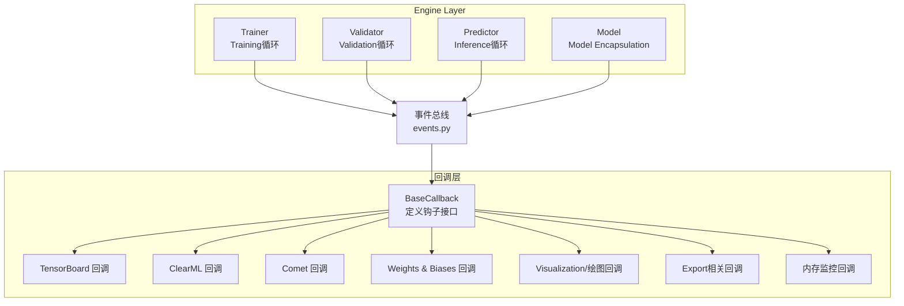
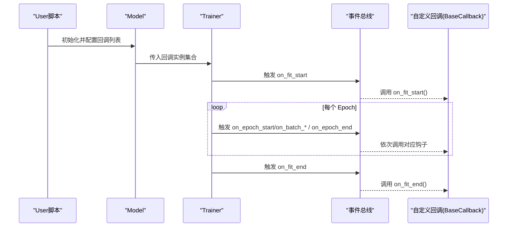
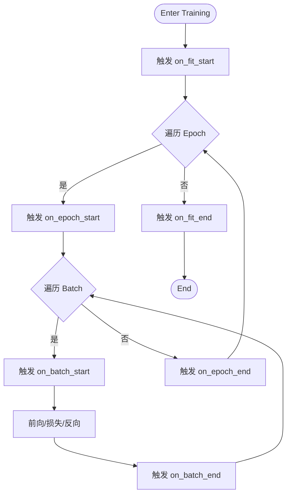
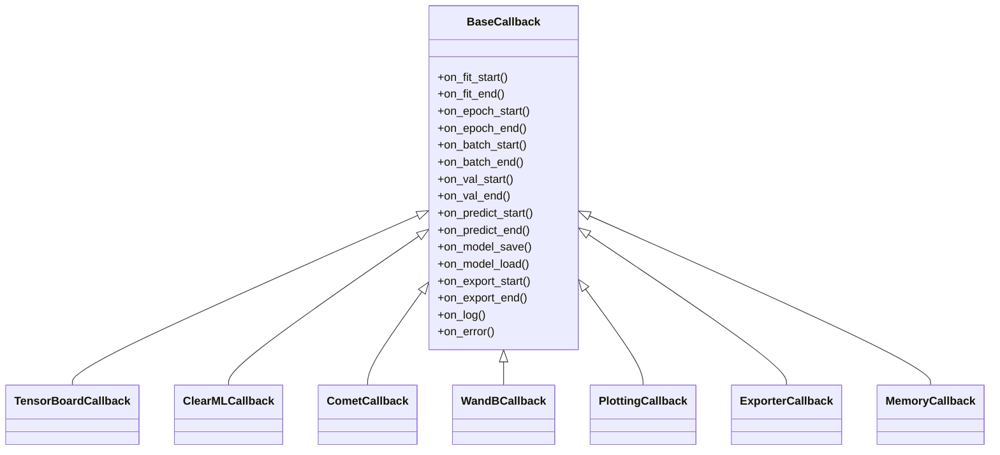

# 自定义回调开发

<cite>
**Files Referenced in This Document**
- [ultralytics/utils/callbacks/__init__.py](file://ultralytics/utils/callbacks/__init__.py)
- [ultralytics/utils/callbacks/base.py](file://ultralytics/utils/callbacks/base.py)
- [ultralytics/utils/callbacks/tensorboard.py](file://ultralytics/utils/callbacks/tensorboard.py)
- [ultralytics/utils/callbacks/clearml.py](file://ultralytics/utils/callbacks/clearml.py)
- [ultralytics/utils/callbacks/comet.py](file://ultralytics/utils/callbacks/comet.py)
- [ultralytics/utils/callbacks/wandb.py](file://ultralytics/utils/callbacks/wandb.py)
- [ultralytics/utils/callbacks/plotting.py](file://ultralytics/utils/callbacks/plotting.py)
- [ultralytics/utils/callbacks/exporter.py](file://ultralytics/utils/callbacks/exporter.py)
- [ultralytics/utils/callbacks/mem.py](file://ultralytics/utils/callbacks/mem.py)
- [ultralytics/utils/events.py](file://ultralytics/utils/events.py)
- [ultralytics/engine/trainer.py](file://ultralytics/engine/trainer.py)
- [ultralytics/engine/validator.py](file://ultralytics/engine/validator.py)
- [ultralytics/engine/predictor.py](file://ultralytics/engine/predictor.py)
- [ultralytics/engine/model.py](file://ultralytics/engine/model.py)
</cite>

## Table of Contents
1. [Introduction](#Introduction)
2. [Project Structure](#Project Structure)
3. [Core Components](#Core Components)
4. [Architecture Overview](#Architecture Overview)
5. [Detailed Component Analysis](#Detailed Component Analysis)
6. [Dependency Analysis](#Dependency Analysis)
7. [Performance Considerations](#Performance Considerations)
8. [Troubleshooting Guide](#Troubleshooting Guide)
9. [Conclusion](#Conclusion)
10. [Appendix](#Appendix)

## Introduction
本指南targeting希望while YOLO-Master 中扩展TrainingandInference流程的开发者，系统讲解such as何基于 BaseCallback implementing自定义回调。内容覆盖：
- 回调生命周期钩子、事件触发机制and异步处理模式
- Parameter Passingand状态管理最佳实践
- 常见场景Examples：自定义Metrics计算、动态Learning Rate调整、模型Checkpoint管理
- 性能Optimization、内存管理and错误处理
- 调试and测试方法

## Project Structure
YOLO-Master 的回调体系位于 ultralytics/utils/callbacks Table of Contents，采用“基类 + Built-inimplementing + 注册入口”的组织方式；Training、ValidationandPrediction引擎while关键阶段through a unified事件总线分发回调事件。

Figure Source
- [ultralytics/utils/callbacks/base.py](file://ultralytics/utils/callbacks/base.py)
- [ultralytics/utils/callbacks/tensorboard.py](file://ultralytics/utils/callbacks/tensorboard.py)
- [ultralytics/utils/callbacks/clearml.py](file://ultralytics/utils/callbacks/clearml.py)
- [ultralytics/utils/callbacks/comet.py](file://ultralytics/utils/callbacks/comet.py)
- [ultralytics/utils/callbacks/wandb.py](file://ultralytics/utils/callbacks/wandb.py)
- [ultralytics/utils/callbacks/plotting.py](file://ultralytics/utils/callbacks/plotting.py)
- [ultralytics/utils/callbacks/exporter.py](file://ultralytics/utils/callbacks/exporter.py)
- [ultralytics/utils/callbacks/mem.py](file://ultralytics/utils/callbacks/mem.py)
- [ultralytics/utils/events.py](file://ultralytics/utils/events.py)
- [ultralytics/engine/trainer.py](file://ultralytics/engine/trainer.py)
- [ultralytics/engine/validator.py](file://ultralytics/engine/validator.py)
- [ultralytics/engine/predictor.py](file://ultralytics/engine/predictor.py)
- [ultralytics/engine/model.py](file://ultralytics/engine/model.py)

Section Source
- [ultralytics/utils/callbacks/__init__.py](file://ultralytics/utils/callbacks/__init__.py)
- [ultralytics/utils/callbacks/base.py](file://ultralytics/utils/callbacks/base.py)
- [ultralytics/utils/events.py](file://ultralytics/utils/events.py)
- [ultralytics/engine/trainer.py](file://ultralytics/engine/trainer.py)
- [ultralytics/engine/validator.py](file://ultralytics/engine/validator.py)
- [ultralytics/engine/predictor.py](file://ultralytics/engine/predictor.py)
- [ultralytics/engine/model.py](file://ultralytics/engine/model.py)

## Core Components
- BaseCallback：所有回调的抽象基类，定义标准钩子（such as on_train_start、on_epoch_end、on_fit_end etc.），并provides统一的上下文访问capabilities（模型、Optimizer、Logging、设备、配置etc.）。
- 事件总线（events）：集中派发回调事件，确保Training/Validation/Prediction各阶段对回调的统一Calls。
- Built-in回调：TensorBoard、ClearML、Comet、W&B、绘图、Export、内存监控etc.，均继承自 BaseCallback。
- 引擎集成：Trainer/Validator/Predictor/Model while关键节点触发事件，drivers are installed回调执行。

Section Source
- [ultralytics/utils/callbacks/base.py](file://ultralytics/utils/callbacks/base.py)
- [ultralytics/utils/events.py](file://ultralytics/utils/events.py)
- [ultralytics/utils/callbacks/tensorboard.py](file://ultralytics/utils/callbacks/tensorboard.py)
- [ultralytics/utils/callbacks/clearml.py](file://ultralytics/utils/callbacks/clearml.py)
- [ultralytics/utils/callbacks/comet.py](file://ultralytics/utils/callbacks/comet.py)
- [ultralytics/utils/callbacks/wandb.py](file://ultralytics/utils/callbacks/wandb.py)
- [ultralytics/utils/callbacks/plotting.py](file://ultralytics/utils/callbacks/plotting.py)
- [ultralytics/utils/callbacks/exporter.py](file://ultralytics/utils/callbacks/exporter.py)
- [ultralytics/utils/callbacks/mem.py](file://ultralytics/utils/callbacks/mem.py)
- [ultralytics/engine/trainer.py](file://ultralytics/engine/trainer.py)
- [ultralytics/engine/validator.py](file://ultralytics/engine/validator.py)
- [ultralytics/engine/predictor.py](file://ultralytics/engine/predictor.py)
- [ultralytics/engine/model.py](file://ultralytics/engine/model.py)

## Architecture Overview
下图展示了从引擎to回调的生命周期Calls链，Centered onand事件分发路径。

Figure Source
- [ultralytics/engine/trainer.py](file://ultralytics/engine/trainer.py)
- [ultralytics/utils/events.py](file://ultralytics/utils/events.py)
- [ultralytics/utils/callbacks/base.py](file://ultralytics/utils/callbacks/base.py)

## Detailed Component Analysis

### 基类and钩子设计
- 设计要点
  - 所有回调需继承 BaseCallback，并while需要时覆写相应钩子方法。
  - 钩子命名遵循 on_<阶段>_<动作> 约定，便于理解and组合。
  - 回调内部可Via上下文对象访问当前Training状态（such as epoch、batch、loss、metrics、device、cfg etc.）。
- 典型钩子
  - Training：on_fit_start、on_fit_end、on_epoch_start、on_epoch_end、on_batch_start、on_batch_end
  - Validation：on_val_start、on_val_end、on_val_batch_start、on_val_batch_end
  - Inference：on_predict_start、on_predict_end、on_predict_batch_*
  - 通用：on_model_save、on_model_load、on_export_start、on_export_end、on_log、on_error etc.

Section Source
- [ultralytics/utils/callbacks/base.py](file://ultralytics/utils/callbacks/base.py)

### 事件分发and生命周期
- 事件总线负责将引擎阶段的信号广播给所有已注册的回调。
- 引擎whileCentered on下关键点触发事件：
  - Training开始/End、每轮开始/End、每批开始/End
  - Validation开始/End、每批开始/End
  - Inference开始/End、每批开始/End
  - 模型保存/加载、Export开始/End、Logging、异常捕获etc.

Figure Source
- [ultralytics/engine/trainer.py](file://ultralytics/engine/trainer.py)
- [ultralytics/utils/events.py](file://ultralytics/utils/events.py)

Section Source
- [ultralytics/utils/events.py](file://ultralytics/utils/events.py)
- [ultralytics/engine/trainer.py](file://ultralytics/engine/trainer.py)

### Parameter Passingand状态管理
- Parameter Passing
  - Via构造函数注入External Dependencies（such as存储后端、阈值、采样策略etc.）。
  - Via回调上下文读取运行时信息（epoch、step、loss、metrics、device、cfg etc.）。
- 状态管理
  - Uses实例属性维护跨批次/跨轮次的累计统计量（such as滑动平均、历史曲线、计数器etc.）。
  - 注意线程安全：while多进程/分布式环境下，避免共享可变状态或加锁保护。
  - 清理资源：while on_fit_end 或 on_error 中释放句柄、关闭连接、清空缓存。

Section Source
- [ultralytics/utils/callbacks/base.py](file://ultralytics/utils/callbacks/base.py)

### 异步处理模式
- 若回调涉and I/O（网络上传、磁盘写入、远程 API Calls），建议：
  - while on_batch_end/on_epoch_end 中提交异步Tasks，避免阻塞主Training循环。
  - Uses队列缓冲高频事件，批量落盘或上报。
  - while on_fit_end etc.待未完成的Tasks完成并处理异常。

Section Source
- [ultralytics/utils/callbacks/base.py](file://ultralytics/utils/callbacks/base.py)

### 实战Examples一：自定义Metrics计算
- 目标：while每步/每轮后计算额外Metrics（such as类别精度、IoU 分位数、长尾分布统计etc.），并持久化。
- 步骤
  - 继承 BaseCallback，覆写 on_batch_end 或 on_epoch_end。
  - 从上下文获取Predictionand标签，计算Metrics并更新累计状态。
  - while on_epoch_end 汇总并记录（本地文件或远端服务）。
- 注意事项
  - 控制计算开销，必要时降采样或Uses近似算法。
  - 避免while GPU 上频繁同步，尽量while CPU 侧聚合。

Section Source
- [ultralytics/utils/callbacks/base.py](file://ultralytics/utils/callbacks/base.py)

### 实战Examples二：动态Learning Rate调整
- 目标：根据Validation集Metrics或Training损失趋势动态调整Learning Rate。
- 步骤
  - 覆写 on_epoch_end，读取ValidationMetricsand当前Learning Rate。
  - 根据策略（such as早停、余弦退火、自适应衰减）计算新Learning Rate。
  - Via上下文provides的Optimizer接口设置新的Learning Rate。
- 注意事项
  - 仅whileValidation可用时触发，避免过拟合噪声。
  - 记录Learning Rate变化轨迹Centered on便复现and分析。

Section Source
- [ultralytics/utils/callbacks/base.py](file://ultralytics/utils/callbacks/base.py)

### 实战Examples三：模型Checkpoint管理
- 目标：按策略保存最佳/最近模型，Supporting断点续训and版本回溯。
- 步骤
  - 覆写 on_epoch_end 或 on_fit_end，依据Metrics选择保存时机。
  - Uses统一路径and命名规范，保留必要元数据（配置、时间戳、Metrics）。
  - while on_fit_end 进行归档或清理旧权重。
- 注意事项
  - 大模型保存耗时，可Combining异步and增量保存策略。
  - 多卡环境下确保仅主进程写入。

Section Source
- [ultralytics/utils/callbacks/base.py](file://ultralytics/utils/callbacks/base.py)

### Built-in回调Refer to
- TensorBoard：记录损失、Metrics、超参、图结构etc.。
- ClearML/Comet/W&B：实验追踪andVisualization。
- Plotting：绘制Training曲线、混淆矩阵、PR 曲线etc.。
- Exporter：Export前后钩子，用于Export产物校验andDocumentation生成。
- Mem：监控显存/CPU 内存峰值and趋势。

Section Source
- [ultralytics/utils/callbacks/tensorboard.py](file://ultralytics/utils/callbacks/tensorboard.py)
- [ultralytics/utils/callbacks/clearml.py](file://ultralytics/utils/callbacks/clearml.py)
- [ultralytics/utils/callbacks/comet.py](file://ultralytics/utils/callbacks/comet.py)
- [ultralytics/utils/callbacks/wandb.py](file://ultralytics/utils/callbacks/wandb.py)
- [ultralytics/utils/callbacks/plotting.py](file://ultralytics/utils/callbacks/plotting.py)
- [ultralytics/utils/callbacks/exporter.py](file://ultralytics/utils/callbacks/exporter.py)
- [ultralytics/utils/callbacks/mem.py](file://ultralytics/utils/callbacks/mem.py)

## Dependency Analysis
- 耦合关系
  - Engine Layer（Trainer/Validator/Predictor/Model）依赖事件总线，不直接感知具体回调implementing。
  - 回调层仅依赖 BaseCallback and事件总线，保持低耦合and高内聚。
- External Dependencies
  - 第三方Logging/追踪库（TensorBoard、ClearML、Comet、W&B）按需引入，避免冷启动开销。
- 潜while风险
  - 回调间共享全局状态可能导致竞态条件，应尽量避免或Via线程安全容器管理。
  - 大量回调同时执行可能拖慢Training，需Evaluation开销and必要性。

Figure Source
- [ultralytics/utils/callbacks/base.py](file://ultralytics/utils/callbacks/base.py)
- [ultralytics/utils/callbacks/tensorboard.py](file://ultralytics/utils/callbacks/tensorboard.py)
- [ultralytics/utils/callbacks/clearml.py](file://ultralytics/utils/callbacks/clearml.py)
- [ultralytics/utils/callbacks/comet.py](file://ultralytics/utils/callbacks/comet.py)
- [ultralytics/utils/callbacks/wandb.py](file://ultralytics/utils/callbacks/wandb.py)
- [ultralytics/utils/callbacks/plotting.py](file://ultralytics/utils/callbacks/plotting.py)
- [ultralytics/utils/callbacks/exporter.py](file://ultralytics/utils/callbacks/exporter.py)
- [ultralytics/utils/callbacks/mem.py](file://ultralytics/utils/callbacks/mem.py)

Section Source
- [ultralytics/utils/callbacks/__init__.py](file://ultralytics/utils/callbacks/__init__.py)
- [ultralytics/utils/callbacks/base.py](file://ultralytics/utils/callbacks/base.py)

## Performance Considerations
- 减少同步and拷贝
  - 避免while高频钩子中进行昂贵的 GPU-CPU 同步。
  - 优先while CPU 侧聚合Metrics，再批量写入。
- 批量化and去抖
  - 对Logging/上传操作进行批处理and去抖，降低 I/O 压力。
- 选择性启用
  - 根据环境（是否 GPU、是否分布式）动态启用重型回调。
- 内存管理
  - and时释放中间结果，避免累积引用导致 OOM。
  - Uses弱引用或池化对象复用昂贵资源。
- 异步and并发
  - 将 I/O 放入独立线程/协程，主循环只负责调度。
  - 限制并发度，防止打满磁盘或网络带宽。

[本节for通用指导，无需特定文件来源]

## Troubleshooting Guide
- 常见问题
  - 回调未触发：确认回调已正确注册且未被过滤；检查事件名称and钩子名匹配。
  - Training变慢：定位耗时回调，禁用非必要回调或改for异步。
  - 内存泄漏：检查是否while回调中持有大图/张量引用；while合适钩子中显式释放。
  - 分布式不一致：确保仅主进程执行写操作；避免共享非线程安全状态。
- 诊断工具
  - Uses内存监控回调观察峰值and趋势。
  - 开启详细Logging，记录关键钩子进入/退出时间and异常堆栈。
  - 最小化复现实例：仅启用一个自定义回调，逐步增加复杂度。

Section Source
- [ultralytics/utils/callbacks/mem.py](file://ultralytics/utils/callbacks/mem.py)
- [ultralytics/utils/callbacks/base.py](file://ultralytics/utils/callbacks/base.py)

## Conclusion
Via BaseCallback and事件总线，YOLO-Master provides了灵活、可扩展的TrainingandInference增强机制。开发者可while不侵入核心逻辑的前提下，implementingMetrics计算、Learning Rate调度、Checkpoint管理etc.多样化需求。遵循性能and稳定性最佳实践，可获得稳定高效的扩展体验。

[本节for总结性内容，无需特定文件来源]

## Appendix

### 快速上手清单
- 新建回调类，继承 BaseCallback
- 覆写所需钩子（such as on_epoch_end、on_fit_end）
- while构造中注入External Dependencies（存储、阈值、策略etc.）
- while on_fit_start 初始化状态，while on_fit_end 清理资源
- while引擎初始化时注册回调实例
- 先while小数据集Validation功能and性能，再扩展to全量数据

Section Source
- [ultralytics/utils/callbacks/base.py](file://ultralytics/utils/callbacks/base.py)

### 常用钩子速查
- Training：on_fit_start、on_fit_end、on_epoch_start、on_epoch_end、on_batch_start、on_batch_end
- Validation：on_val_start、on_val_end、on_val_batch_start、on_val_batch_end
- Inference：on_predict_start、on_predict_end、on_predict_batch_start、on_predict_batch_end
- 通用：on_model_save、on_model_load、on_export_start、on_export_end、on_log、on_error

Section Source
- [ultralytics/utils/callbacks/base.py](file://ultralytics/utils/callbacks/base.py)