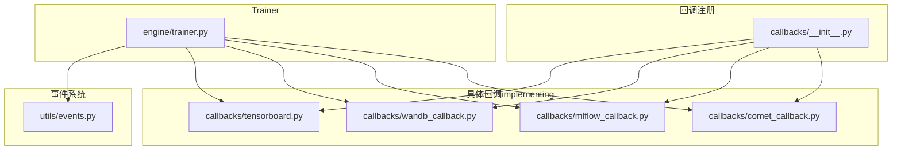
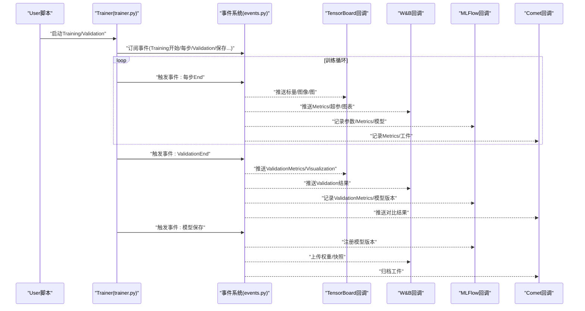
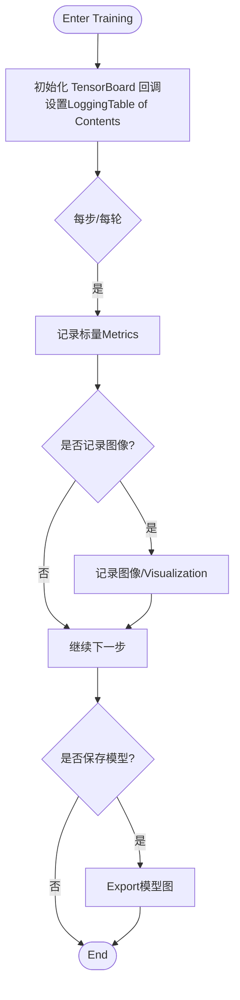
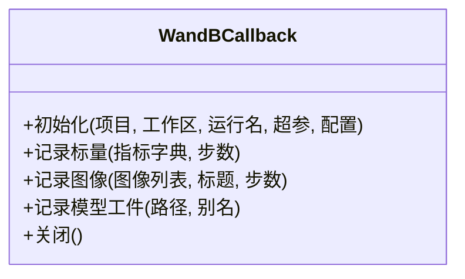
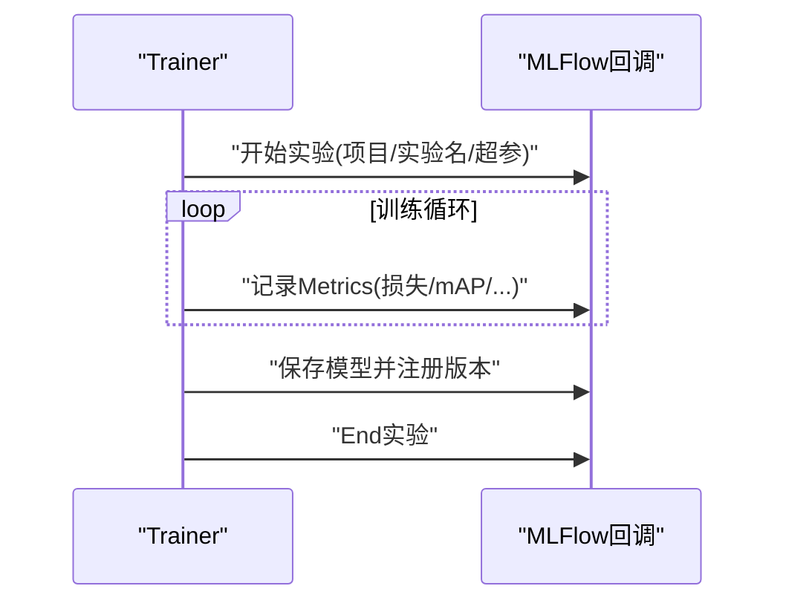
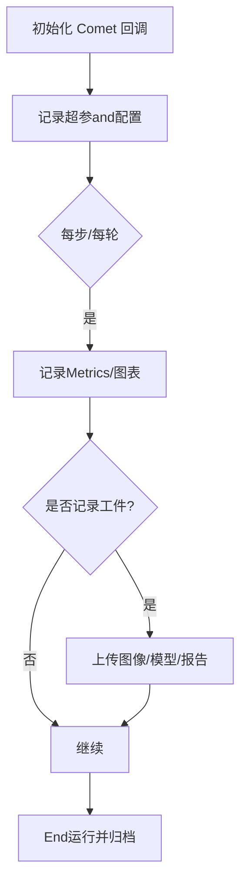
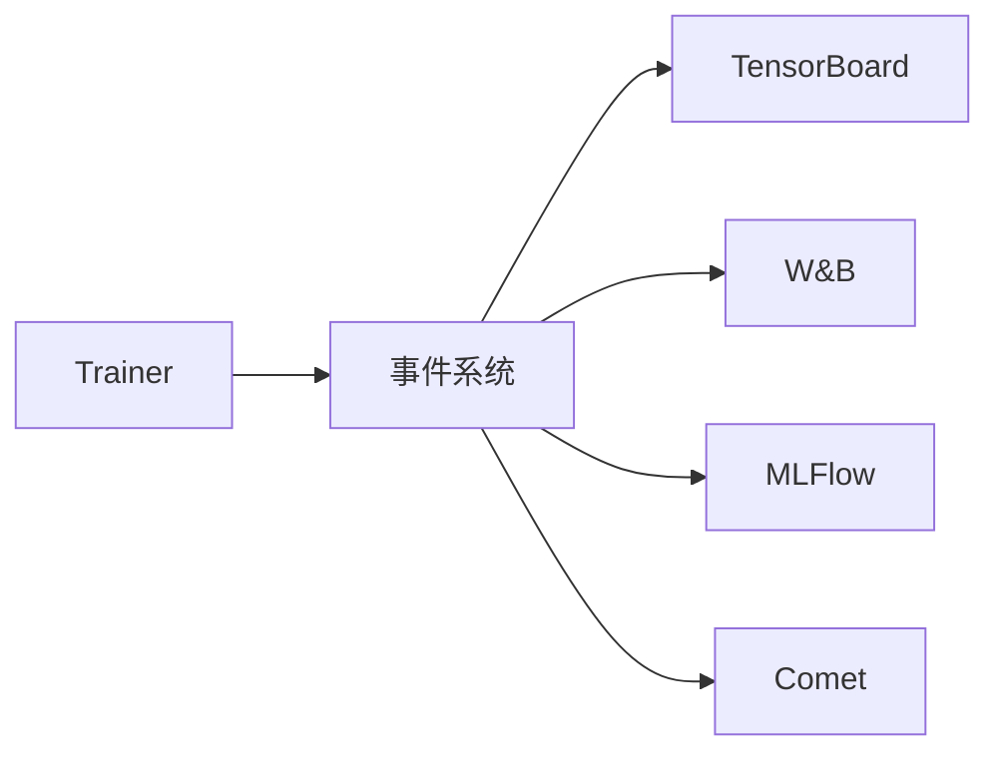
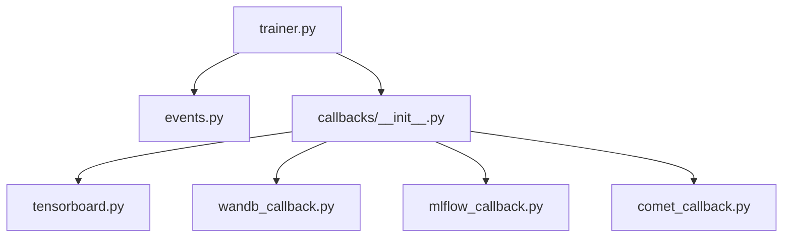

# Logging回调

<cite>
**Files Referenced in This Document**
- [callbacks.py](file://ultralytics/utils/callbacks/__init__.py)
- [tensorboard.py](file://ultralytics/utils/callbacks/tensorboard.py)
- [wandb_callback.py](file://ultralytics/utils/callbacks/wandb_callback.py)
- [mlflow_callback.py](file://ultralytics/utils/callbacks/mlflow_callback.py)
- [comet_callback.py](file://ultralytics/utils/callbacks/comet_callback.py)
- [trainer.py](file://ultralytics/engine/trainer.py)
- [events.py](file://ultralytics/utils/events.py)
</cite>

## Table of Contents
1. [Introduction](#Introduction)
2. [Project Structure](#Project Structure)
3. [Core Components](#Core Components)
4. [Architecture Overview](#Architecture Overview)
5. [Detailed Component Analysis](#Detailed Component Analysis)
6. [Dependency Analysis](#Dependency Analysis)
7. [性能考量](#性能考量)
8. [Troubleshooting Guide](#Troubleshooting Guide)
9. [Conclusion](#Conclusion)
10. [Appendix](#Appendix)

## Introduction
本文件for YOLO-Master 的“LoggingCallback System”provides详细的 API Documentation，聚焦Centered on下集成：
- TensorBoard 集成回调：标量Metrics、图像Visualization、模型图展示etc.高级功能
- Weights & Biases（W&B）监控回调：配置选项and实验Tracking
- MLFlow 实验管理回调：项目组织、参数记录and模型版本控制
- Comet.ml 集成回调：实时协作and结果对比

目标读者包括希望系统化UsesTraining期/Validation期Logging的EngineersandResearchers。DocumentationCentered on代码级事实for依据，辅Centered on流程图and时序图帮助理解Calls链and数据流。

## Project Structure
YOLO-Master 将各类Logging工具Encapsulatesfor“回调”，whileTrainer生命周期中按事件触发。关键位置such as下：
- 回调注册入口：位于 utils/callbacks 包初始化处，负责Export并统一注册各Logging回调
- 具体implementing：每个Logging工具一个独立Modules（such as tensorboard.py、wandb_callback.py、mlflow_callback.py、comet_callback.py）
- Trainer集成：engine/trainer.py whileTraining流程中订阅事件并Calls对应回调
- 事件总线：utils/events.py 定义事件常量and分发机制

Figure Source
- [callbacks.py:1-200](file://ultralytics/utils/callbacks/__init__.py#L1-L200)
- [tensorboard.py:1-200](file://ultralytics/utils/callbacks/tensorboard.py#L1-L200)
- [wandb_callback.py:1-200](file://ultralytics/utils/callbacks/wandb_callback.py#L1-L200)
- [mlflow_callback.py:1-200](file://ultralytics/utils/callbacks/mlflow_callback.py#L1-L200)
- [comet_callback.py:1-200](file://ultralytics/utils/callbacks/comet_callback.py#L1-L200)
- [trainer.py:1-200](file://ultralytics/engine/trainer.py#L1-L200)
- [events.py:1-200](file://ultralytics/utils/events.py#L1-L200)

Section Source
- [callbacks.py:1-200](file://ultralytics/utils/callbacks/__init__.py#L1-L200)
- [trainer.py:1-200](file://ultralytics/engine/trainer.py#L1-L200)
- [events.py:1-200](file://ultralytics/utils/events.py#L1-L200)

## Core Components
- 回调注册中心（__init__.py）
  - 职责：集中Export并注册 TensorBoard、W&B、MLFlow、Comet etc.回调；对外暴露统一的启用开关或默认策略
  - 关键点：根据运行环境或User配置决定是否加载特定后端；避免未Installing Dependencies导致导入失败
- Trainer集成（trainer.py）
  - 职责：whileTraining/Validation/Prediction的关键阶段订阅事件，并将Metrics、图像、模型图etc.数据推送给已注册的回调
  - 关键点：事件drivers are installed，解耦业务逻辑andLogging输出；Supporting多后端并行写入
- 事件系统（events.py）
  - 职责：定义事件名称and语义（such asTraining开始、每步End、ValidationEnd、模型保存etc.），供回调订阅
  - 关键点：保证回调顺序and幂etc.性；provides扩展点Centered on便新增回调类型

Section Source
- [callbacks.py:1-200](file://ultralytics/utils/callbacks/__init__.py#L1-L200)
- [trainer.py:1-200](file://ultralytics/engine/trainer.py#L1-L200)
- [events.py:1-200](file://ultralytics/utils/events.py#L1-L200)

## Architecture Overview
下图展示了TrainerVia事件系统调度各Logging回调的整体交互。

Figure Source
- [trainer.py:1-200](file://ultralytics/engine/trainer.py#L1-L200)
- [events.py:1-200](file://ultralytics/utils/events.py#L1-L200)
- [tensorboard.py:1-200](file://ultralytics/utils/callbacks/tensorboard.py#L1-L200)
- [wandb_callback.py:1-200](file://ultralytics/utils/callbacks/wandb_callback.py#L1-L200)
- [mlflow_callback.py:1-200](file://ultralytics/utils/callbacks/mlflow_callback.py#L1-L200)
- [comet_callback.py:1-200](file://ultralytics/utils/callbacks/comet_callback.py#L1-L200)

## Detailed Component Analysis

### TensorBoard 集成回调
- capabilities概览
  - 标量Metrics：损失、Learning Rate、mAP、PR曲线etc.随步数/轮次变化
  - 图像Visualization：Training/Validation样本、Prediction框、热力图、混淆矩阵截图etc.
  - 模型图展示：计算图/子图Export，便于结构审查
- Typical Usage要点
  - whileTraining前启用 TensorBoard 回调，指定LoggingTable of Contents
  - while每步/每轮End时自动记录标量and图像
  - while模型保存时Export图结构（Optional）
- 注意事项
  - 大图像批量记录可能影响 IO and网络（若远程存储）
  - 建议按需采样图像，避免过多冗余

Figure Source
- [tensorboard.py:1-200](file://ultralytics/utils/callbacks/tensorboard.py#L1-L200)
- [trainer.py:1-200](file://ultralytics/engine/trainer.py#L1-L200)
- [events.py:1-200](file://ultralytics/utils/events.py#L1-L200)

Section Source
- [tensorboard.py:1-200](file://ultralytics/utils/callbacks/tensorboard.py#L1-L200)

### Weights & Biases（W&B）监控回调
- capabilities概览
  - 实验Tracking：项目/工作区/运行名、超参数、Metrics、图表、媒体工件
  - 实时监控：while线面板查看Training进度and诊断信息
  - 协作and对比：团队共享、A/B 对比、历史回归
- 配置项要点
  - 项目and工作区命名、运行名称、标签
  - 是否开启离线模式、同步频率、最大工件大小
  - 是否记录模型权重and中间产物
- 最佳实践
  - for每次实验创建独立运行，附带可复现的超参and数据路径
  - 合理控制图像/视频记录频率，避免体积膨胀

Figure Source
- [wandb_callback.py:1-200](file://ultralytics/utils/callbacks/wandb_callback.py#L1-L200)

Section Source
- [wandb_callback.py:1-200](file://ultralytics/utils/callbacks/wandb_callback.py#L1-L200)

### MLFlow 实验管理回调
- capabilities概览
  - 项目组织：按项目分组实验，Supporting标签and描述
  - 参数记录：超参数、数据集路径、Training Configuration
  - Metrics记录：Training/ValidationMetrics、自定义度量
  - 模型版本控制：保存模型元数据and权重，注册模型版本
- 典型流程
  - 启动实验 -> 记录超参and配置 -> 每步/每轮记录Metrics -> 保存模型并注册版本 -> End实验
- 注意事项
  - 模型注册需确保后端存储可用（本地/对象存储）
  - 建议for不同Tasks/数据集划分不同实验

Figure Source
- [mlflow_callback.py:1-200](file://ultralytics/utils/callbacks/mlflow_callback.py#L1-L200)
- [trainer.py:1-200](file://ultralytics/engine/trainer.py#L1-L200)

Section Source
- [mlflow_callback.py:1-200](file://ultralytics/utils/callbacks/mlflow_callback.py#L1-L200)

### Comet.ml 集成回调
- capabilities概览
  - 实时协作：多人同时查看同一运行，评论and标注
  - 结果对比：跨运行对比Metrics、Visualizationand工件
  - 工件管理：图像、模型、报告etc.一键归档
- Uses要点
  - 初始化时设置 API Key、项目and运行名
  - 按需记录图像and模型工件，控制同步频率
  - 利用标签and注释进行团队协作and检索

Figure Source
- [comet_callback.py:1-200](file://ultralytics/utils/callbacks/comet_callback.py#L1-L200)

Section Source
- [comet_callback.py:1-200](file://ultralytics/utils/callbacks/comet_callback.py#L1-L200)

### 概念性总览
Centered on下for不绑定具体文件的通用工作流示意，用于帮助理解Logging回调whileTraining中的角色。

[此图for概念性说明，无需Figure Source]

## Dependency Analysis
- 耦合and内聚
  - 回调Modules之间相互独立，内聚于各自后端 SDK
  - Trainer仅依赖事件系统and回调接口，保持松耦合
- External Dependencies
  - TensorBoard、W&B、MLFlow、Comet 均forOptional第三方库；回调注册中心应做存while性检查and优雅降级
- Potential Cycles依赖
  - 当前设计Via事件系统解耦，未见直接循环导入风险

Figure Source
- [trainer.py:1-200](file://ultralytics/engine/trainer.py#L1-L200)
- [events.py:1-200](file://ultralytics/utils/events.py#L1-L200)
- [callbacks.py:1-200](file://ultralytics/utils/callbacks/__init__.py#L1-L200)
- [tensorboard.py:1-200](file://ultralytics/utils/callbacks/tensorboard.py#L1-L200)
- [wandb_callback.py:1-200](file://ultralytics/utils/callbacks/wandb_callback.py#L1-L200)
- [mlflow_callback.py:1-200](file://ultralytics/utils/callbacks/mlflow_callback.py#L1-L200)
- [comet_callback.py:1-200](file://ultralytics/utils/callbacks/comet_callback.py#L1-L200)

Section Source
- [callbacks.py:1-200](file://ultralytics/utils/callbacks/__init__.py#L1-L200)
- [trainer.py:1-200](file://ultralytics/engine/trainer.py#L1-L200)
- [events.py:1-200](file://ultralytics/utils/events.py#L1-L200)

## 性能考量
- I/O and网络
  - 大量图像/视频记录会显著增加磁盘/网络压力，建议采样and压缩
  - 对远端服务（W&B/MLFlow/Comet）的频繁写入可能成forbottlenecks，应调整同步频率
- CPU/GPU 占用
  - 回调执行应while非关键路径，避免阻塞Training主循环
- 存储成本
  - 模型工件and中间产物应按需保留，定期清理旧运行

[本节for通用指导，无需Section Source]

## Troubleshooting Guide
- 常见症状and定位
  - 无Logging输出：检查回调是否被正确注册and启用；确认后端依赖已安装
  - Metrics缺失：核对事件订阅是否正确；确认Metrics键名一致
  - 图像/模型未上传：检查权限、网络and存储空间；确认工件路径有效
- 快速自检清单
  - 确认Trainer已订阅相关事件
  - 确认回调初始化参数（项目/运行名/Table of Contents）正确
  - 观察控制台是否有后端 SDK 的错误堆栈
  - 降低记录频率或关闭非必要VisualizationCentered on隔离问题

Section Source
- [trainer.py:1-200](file://ultralytics/engine/trainer.py#L1-L200)
- [callbacks.py:1-200](file://ultralytics/utils/callbacks/__init__.py#L1-L200)

## Conclusion
YOLO-Master 的LoggingCallback SystemCentered on事件drivers are installedfor核心，将Training流程and多种Logging后端解耦。TensorBoard 适合本地快速调试andVisualization；W&B 擅长while线协作and实验追踪；MLFlow provides完善的实验管理and模型版本控制；Comet 则强化团队协作and结果对比。建议根据团队工作流and基础设施选择单一或组合方案，并Via回调注册中心统一管理。

[本节for总结性内容，无需Section Source]

## Appendix
- 术语
  - 回调：whileTraining生命周期特定事件触发的函数/类实例
  - 工件：图像、模型、报告etc.可归档的数据产物
  - 事件：Training过程中的关键节点（开始、每步、Validation、保存etc.）
- Refer to路径
  - 回调注册入口：[callbacks/__init__.py](file://ultralytics/utils/callbacks/__init__.py)
  - Trainer集成：[engine/trainer.py](file://ultralytics/engine/trainer.py)
  - 事件系统：[utils/events.py](file://ultralytics/utils/events.py)
  - 各回调implementing：
    - [callbacks/tensorboard.py](file://ultralytics/utils/callbacks/tensorboard.py)
    - [callbacks/wandb_callback.py](file://ultralytics/utils/callbacks/wandb_callback.py)
    - [callbacks/mlflow_callback.py](file://ultralytics/utils/callbacks/mlflow_callback.py)
    - [callbacks/comet_callback.py](file://ultralytics/utils/callbacks/comet_callback.py)