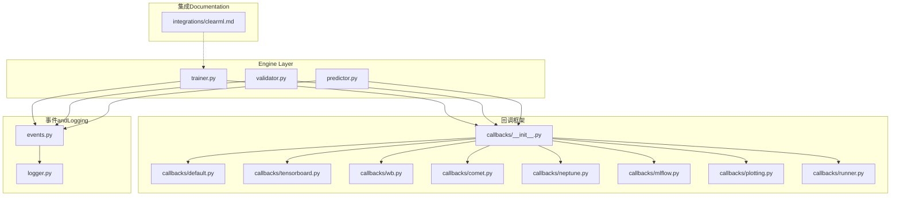
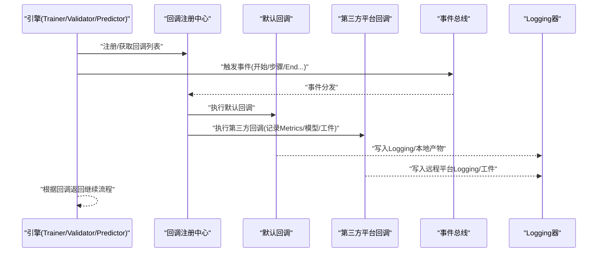
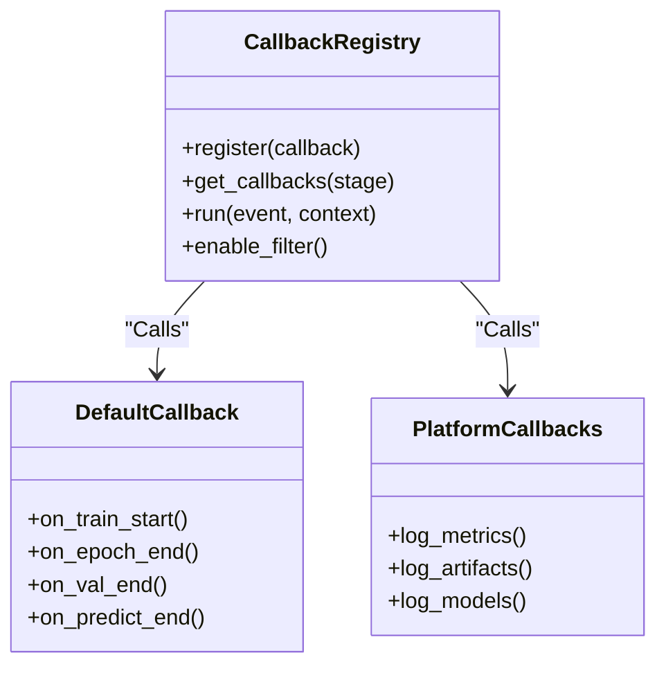
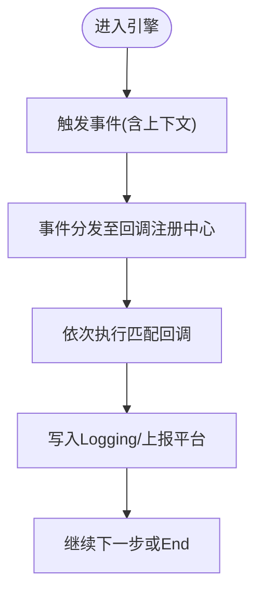
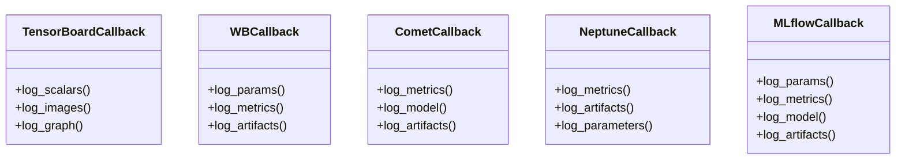
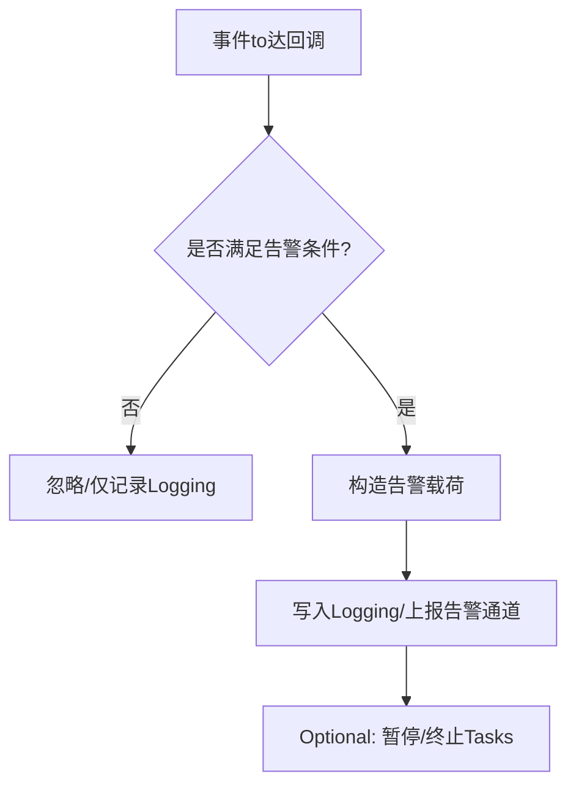
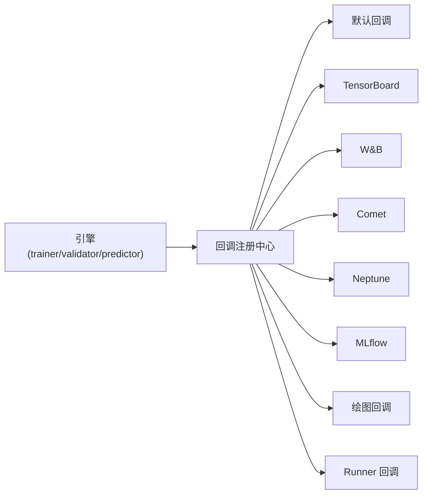

# Monitoring and Alerting回调

<cite>
**Files Referenced in This Document**
- [clearml.md](file://docs/en/integrations/clearml.md)
- [callbacks/__init__.py](file://ultralytics/utils/callbacks/__init__.py)
- [callbacks/default.py](file://ultralytics/utils/callbacks/default.py)
- [callbacks/tensorboard.py](file://ultralytics/utils/callbacks/tensorboard.py)
- [callbacks/wb.py](file://ultralytics/utils/callbacks/wb.py)
- [callbacks/comet.py](file://ultralytics/utils/callbacks/comet.py)
- [callbacks/neptune.py](file://ultralytics/utils/callbacks/neptune.py)
- [callbacks/mlflow.py](file://ultralytics/utils/callbacks/mlflow.py)
- [callbacks/plotting.py](file://ultralytics/utils/callbacks/plotting.py)
- [callbacks/runner.py](file://ultralytics/utils/callbacks/runner.py)
- [engine/trainer.py](file://ultralytics/engine/trainer.py)
- [engine/validator.py](file://ultralytics/engine/validator.py)
- [engine/predictor.py](file://ultralytics/engine/predictor.py)
- [utils/events.py](file://ultralytics/utils/events.py)
- [utils/logger.py](file://ultralytics/utils/logger.py)
</cite>

## Table of Contents
1. [Introduction](#Introduction)
2. [Project Structure](#Project Structure)
3. [Core Components](#Core Components)
4. [Architecture Overview](#Architecture Overview)
5. [Detailed Component Analysis](#Detailed Component Analysis)
6. [Dependency Analysis](#Dependency Analysis)
7. [Performance Considerations](#Performance Considerations)
8. [Troubleshooting Guide](#Troubleshooting Guide)
9. [Conclusion](#Conclusion)
10. [Appendix](#Appendix)

## Introduction
本文件for YOLO-Master 的“监控and告警回调”体系provides系统化 API Documentation，重点覆盖：
- ClearML 实验管理and监控回调的Uses方式、capabilities边界and集成要点
- Training/Validation/Prediction生命周期中的事件drivers are installed回调机制
- 系统资源监控、性能Metrics收集and异常告警路径
- Visualization展示方法and自定义告警规则配置建议
- 生产环境部署and运维最佳实践

说明：本仓库包含 ClearML 集成Documentationand通用回调基础设施。针对 ClearML 的具体参数and字段，请Centered on官方Documentationfor准；本文件聚焦于while YOLO-Master 中such as何启用、扩展and编排这些capabilities。

## Project Structure
YOLO-Master 的监控and告警相关代码主要分布whileCentered on下位置：
- 集成Documentation：docs/en/integrations/clearml.md
- 回调框架：ultralytics/utils/callbacks/*（默认implementing、第三方平台对接、绘图etc.）
- 引擎触发点：ultralytics/engine/{trainer, validator, predictor}.py
- 事件andLogging：ultralytics/utils/events.py、ultralytics/utils/logger.py

Figure Source
- [trainer.py](file://ultralytics/engine/trainer.py)
- [validator.py](file://ultralytics/engine/validator.py)
- [predictor.py](file://ultralytics/engine/predictor.py)
- [callbacks/__init__.py](file://ultralytics/utils/callbacks/__init__.py)
- [callbacks/default.py](file://ultralytics/utils/callbacks/default.py)
- [callbacks/tensorboard.py](file://ultralytics/utils/callbacks/tensorboard.py)
- [callbacks/wb.py](file://ultralytics/utils/callbacks/wb.py)
- [callbacks/comet.py](file://ultralytics/utils/callbacks/comet.py)
- [callbacks/neptune.py](file://ultralytics/utils/callbacks/neptune.py)
- [callbacks/mlflow.py](file://ultralytics/utils/callbacks/mlflow.py)
- [callbacks/plotting.py](file://ultralytics/utils/callbacks/plotting.py)
- [callbacks/runner.py](file://ultralytics/utils/callbacks/runner.py)
- [events.py](file://ultralytics/utils/events.py)
- [logger.py](file://ultralytics/utils/logger.py)
- [clearml.md](file://docs/en/integrations/clearml.md)

Section Source
- [clearml.md](file://docs/en/integrations/clearml.md)
- [callbacks/__init__.py](file://ultralytics/utils/callbacks/__init__.py)
- [callbacks/default.py](file://ultralytics/utils/callbacks/default.py)
- [callbacks/tensorboard.py](file://ultralytics/utils/callbacks/tensorboard.py)
- [callbacks/wb.py](file://ultralytics/utils/callbacks/wb.py)
- [callbacks/comet.py](file://ultralytics/utils/callbacks/comet.py)
- [callbacks/neptune.py](file://ultralytics/utils/callbacks/neptune.py)
- [callbacks/mlflow.py](file://ultralytics/utils/callbacks/mlflow.py)
- [callbacks/plotting.py](file://ultralytics/utils/callbacks/plotting.py)
- [callbacks/runner.py](file://ultralytics/utils/callbacks/runner.py)
- [events.py](file://ultralytics/utils/events.py)
- [logger.py](file://ultralytics/utils/logger.py)
- [trainer.py](file://ultralytics/engine/trainer.py)
- [validator.py](file://ultralytics/engine/validator.py)
- [predictor.py](file://ultralytics/engine/predictor.py)

## Core Components
- 回调注册中心：负责加载、排序and分发回调实例，Unified entry point位于回调包初始化处。
- 默认回调：Built-in基础行for（such as进度打印、结果保存、绘图etc.）。
- 第三方平台回调：TensorBoard、Weights & Biases、Comet、Neptune、MLflow etc.。
- 事件总线：定义并广播Training/Validation/Prediction过程中的关键事件。
- Logging器：结构化输出运行期信息，便于聚合and检索。
- 集成Documentation：ClearML 集成说明，指导such as何while工程中启用and配置。

Section Source
- [callbacks/__init__.py](file://ultralytics/utils/callbacks/__init__.py)
- [callbacks/default.py](file://ultralytics/utils/callbacks/default.py)
- [callbacks/tensorboard.py](file://ultralytics/utils/callbacks/tensorboard.py)
- [callbacks/wb.py](file://ultralytics/utils/callbacks/wb.py)
- [callbacks/comet.py](file://ultralytics/utils/callbacks/comet.py)
- [callbacks/neptune.py](file://ultralytics/utils/callbacks/neptune.py)
- [callbacks/mlflow.py](file://ultralytics/utils/callbacks/mlflow.py)
- [callbacks/plotting.py](file://ultralytics/utils/callbacks/plotting.py)
- [callbacks/runner.py](file://ultralytics/utils/callbacks/runner.py)
- [events.py](file://ultralytics/utils/events.py)
- [logger.py](file://ultralytics/utils/logger.py)
- [clearml.md](file://docs/en/integrations/clearml.md)

## Architecture Overview
下图展示了从引擎to回调再to外部平台的Calls链路and数据流向。

Figure Source
- [trainer.py](file://ultralytics/engine/trainer.py)
- [validator.py](file://ultralytics/engine/validator.py)
- [predictor.py](file://ultralytics/engine/predictor.py)
- [callbacks/__init__.py](file://ultralytics/utils/callbacks/__init__.py)
- [callbacks/default.py](file://ultralytics/utils/callbacks/default.py)
- [callbacks/tensorboard.py](file://ultralytics/utils/callbacks/tensorboard.py)
- [callbacks/wb.py](file://ultralytics/utils/callbacks/wb.py)
- [callbacks/comet.py](file://ultralytics/utils/callbacks/comet.py)
- [callbacks/neptune.py](file://ultralytics/utils/callbacks/neptune.py)
- [callbacks/mlflow.py](file://ultralytics/utils/callbacks/mlflow.py)
- [callbacks/plotting.py](file://ultralytics/utils/callbacks/plotting.py)
- [callbacks/runner.py](file://ultralytics/utils/callbacks/runner.py)
- [events.py](file://ultralytics/utils/events.py)
- [logger.py](file://ultralytics/utils/logger.py)

## Detailed Component Analysis

### 回调注册中心and生命周期
- 职责
  - 集中管理回调实例的创建、排序and执行顺序
  - 将引擎事件映射to具体回调方法
  - provides统一的 enable/disable 开关and过滤条件
- 关键点
  - Via初始化入口完成回调发现and装配
  - Supporting按阶段（Training/Validation/Prediction）选择性启用
  - 对异常进行隔离，避免单个回调失败影响主流程

Figure Source
- [callbacks/__init__.py](file://ultralytics/utils/callbacks/__init__.py)
- [callbacks/default.py](file://ultralytics/utils/callbacks/default.py)
- [callbacks/tensorboard.py](file://ultralytics/utils/callbacks/tensorboard.py)
- [callbacks/wb.py](file://ultralytics/utils/callbacks/wb.py)
- [callbacks/comet.py](file://ultralytics/utils/callbacks/comet.py)
- [callbacks/neptune.py](file://ultralytics/utils/callbacks/neptune.py)
- [callbacks/mlflow.py](file://ultralytics/utils/callbacks/mlflow.py)
- [callbacks/plotting.py](file://ultralytics/utils/callbacks/plotting.py)
- [callbacks/runner.py](file://ultralytics/utils/callbacks/runner.py)

Section Source
- [callbacks/__init__.py](file://ultralytics/utils/callbacks/__init__.py)
- [callbacks/default.py](file://ultralytics/utils/callbacks/default.py)
- [callbacks/runner.py](file://ultralytics/utils/callbacks/runner.py)

### 事件总线andLogging
- 事件类型
  - Training：开始、每步、每轮、End、错误
  - Validation：开始、每批、End、错误
  - Prediction：开始、每批、End、错误
- Logging
  - 结构化输出，便于下游采集and告警
  - Supporting分级and过滤，减少噪声

Figure Source
- [events.py](file://ultralytics/utils/events.py)
- [logger.py](file://ultralytics/utils/logger.py)
- [callbacks/__init__.py](file://ultralytics/utils/callbacks/__init__.py)

Section Source
- [events.py](file://ultralytics/utils/events.py)
- [logger.py](file://ultralytics/utils/logger.py)

### 第三方平台回调（Examples）
- TensorBoard：记录标量、图像、直方图、模型图etc.
- Weights & Biases：实验追踪、超参对比、协作看板
- Comet / Neptune / MLflow：Metrics、工件、模型版本化and回溯
- 绘图回调：生成Training曲线、混淆矩阵、PR 曲线etc.

Figure Source
- [callbacks/tensorboard.py](file://ultralytics/utils/callbacks/tensorboard.py)
- [callbacks/wb.py](file://ultralytics/utils/callbacks/wb.py)
- [callbacks/comet.py](file://ultralytics/utils/callbacks/comet.py)
- [callbacks/neptune.py](file://ultralytics/utils/callbacks/neptune.py)
- [callbacks/mlflow.py](file://ultralytics/utils/callbacks/mlflow.py)

Section Source
- [callbacks/tensorboard.py](file://ultralytics/utils/callbacks/tensorboard.py)
- [callbacks/wb.py](file://ultralytics/utils/callbacks/wb.py)
- [callbacks/comet.py](file://ultralytics/utils/callbacks/comet.py)
- [callbacks/neptune.py](file://ultralytics/utils/callbacks/neptune.py)
- [callbacks/mlflow.py](file://ultralytics/utils/callbacks/mlflow.py)

### ClearML 集成要点
- Refer toDocumentation：请查阅 ClearML 集成DocumentationCentered on了解安装、认证、工作空间andTasks管理etc.细节
- while YOLO-Master 中启用 ClearML 的一般流程
  - 安装并配置 ClearML SDK and环境变量
  - whileTraining/Validation/Prediction入口中启用 ClearML 回调（若Uses默认回调集合）
  - Via回调记录关键Metrics、工件and模型快照
  - while ClearML 控制台查看实验、对比and协作
- 注意
  - 具体参数and字段Centered on ClearML 官方Documentationfor准
  - while生产环境中建议Combining队列and远程执行器进行Tasks调度

Section Source
- [clearml.md](file://docs/en/integrations/clearml.md)

### 自定义告警规则and异常处理
- 告警触发点
  - Metrics越界（such as损失发散、精度不升、OOM etc.）
  - 资源阈值（GPU 显存/CPU 内存/磁盘 IO）
  - 外部平台状态（上传失败、网络超时）
- implementing建议
  - 新增回调类，订阅相应事件并while on_* 钩子中Evaluation规则
  - 将告警写入Logging并上报to统一告警通道（邮件/IM/工单）
  - Supporting开关and阈值配置，便于灰度and回滚
- 异常隔离
  - 回调内部捕获异常，避免中断主流程
  - 记录堆栈and上下文，便于定位问题

[此图for概念性流程图，无需源码对应]

## Dependency Analysis
- 耦合关系
  - Engine Layer仅依赖回调接口and事件总线，保持低耦合
  - 回调之间相互独立，Via注册中心协调执行顺序
  - 第三方平台回调各自EncapsulatesExternal Dependencies，Reducing invasiveness
- 潜while风险
  - 回调过多导致 I/O 放大，需按需启用
  - 外部平台不稳定时，应做降级and重试策略

Figure Source
- [trainer.py](file://ultralytics/engine/trainer.py)
- [validator.py](file://ultralytics/engine/validator.py)
- [predictor.py](file://ultralytics/engine/predictor.py)
- [callbacks/__init__.py](file://ultralytics/utils/callbacks/__init__.py)
- [callbacks/default.py](file://ultralytics/utils/callbacks/default.py)
- [callbacks/tensorboard.py](file://ultralytics/utils/callbacks/tensorboard.py)
- [callbacks/wb.py](file://ultralytics/utils/callbacks/wb.py)
- [callbacks/comet.py](file://ultralytics/utils/callbacks/comet.py)
- [callbacks/neptune.py](file://ultralytics/utils/callbacks/neptune.py)
- [callbacks/mlflow.py](file://ultralytics/utils/callbacks/mlflow.py)
- [callbacks/plotting.py](file://ultralytics/utils/callbacks/plotting.py)
- [callbacks/runner.py](file://ultralytics/utils/callbacks/runner.py)

Section Source
- [callbacks/__init__.py](file://ultralytics/utils/callbacks/__init__.py)
- [callbacks/default.py](file://ultralytics/utils/callbacks/default.py)
- [callbacks/tensorboard.py](file://ultralytics/utils/callbacks/tensorboard.py)
- [callbacks/wb.py](file://ultralytics/utils/callbacks/wb.py)
- [callbacks/comet.py](file://ultralytics/utils/callbacks/comet.py)
- [callbacks/neptune.py](file://ultralytics/utils/callbacks/neptune.py)
- [callbacks/mlflow.py](file://ultralytics/utils/callbacks/mlflow.py)
- [callbacks/plotting.py](file://ultralytics/utils/callbacks/plotting.py)
- [callbacks/runner.py](file://ultralytics/utils/callbacks/runner.py)
- [trainer.py](file://ultralytics/engine/trainer.py)
- [validator.py](file://ultralytics/engine/validator.py)
- [predictor.py](file://ultralytics/engine/predictor.py)

## Performance Considerations
- 控制 I/O 频率
  - 仅while必要阶段记录Metricsand工件，避免高频写盘/Network requests
  - 批量合并记录，降低开销
- 异步and缓冲
  - 对远端平台上报采用异步队列and退避重试
  - 本地落盘采用缓冲写入and压缩归档
- 选择性启用
  - 开发阶段全量开启，生产阶段按需裁剪
- 资源观测
  - 利用系统级监控（CPU/GPU/IO/网络）andLogging聚合，定位bottlenecks

[本节for通用建议，无需源码引用]

## Troubleshooting Guide
- 常见问题
  - 回调未生效：检查注册中心是否加载、阶段过滤是否正确
  - 平台上报失败：检查凭据、网络、配额and限流
  - Metrics缺失：确认事件触发点and回调方法名匹配
- 定位手段
  - 提高Logging级别，关注事件and回调执行轨迹
  - 临时禁用第三方回调，缩小问题范围
  - Uses最小复现脚本Validation回调链路

Section Source
- [logger.py](file://ultralytics/utils/logger.py)
- [callbacks/__init__.py](file://ultralytics/utils/callbacks/__init__.py)
- [callbacks/default.py](file://ultralytics/utils/callbacks/default.py)

## Conclusion
YOLO-Master Via事件drivers are installed的回调框架，将Training/Validation/Prediction过程and多种实验管理and监控系统解耦。借助默认回调and第三方平台回调，可快速implementingMetrics记录、工件管理andVisualization；同时，Via自定义回调可implementing灵活的告警and治理策略。生产环境建议遵循“按需启用、异步上报、异常隔离、可观测优先”的原则，确保稳定性and可维护性。

## Appendix
- 快速上手
  - 阅读 ClearML 集成Documentation，完成安装and认证
  - whileTraining/Validation/Prediction入口启用默认回调集合
  - while平台控制台查看实验andMetrics
- 扩展建议
  - 新增自定义回调类，implementing on_* 钩子
  - 将告警接入企业 IM/邮件/工单系统
  - 建立阈值and规则库，Combined with CI/CD 门禁

[本节for概览性内容，无需源码引用]