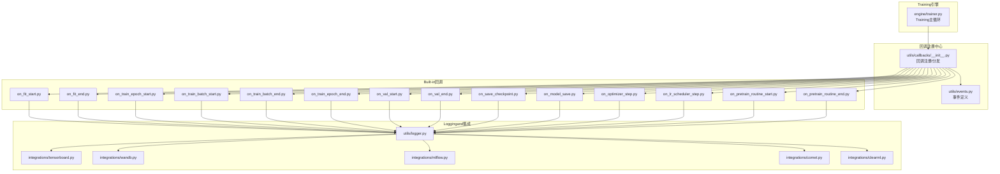
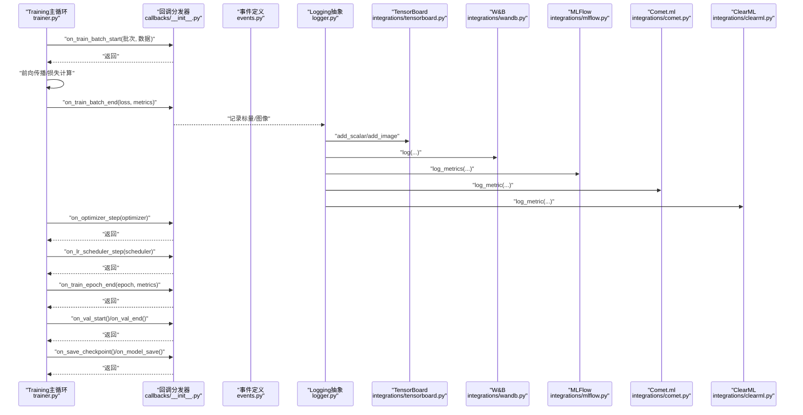
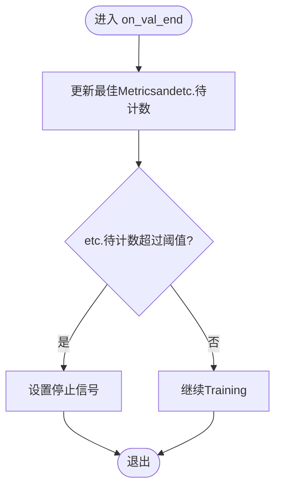
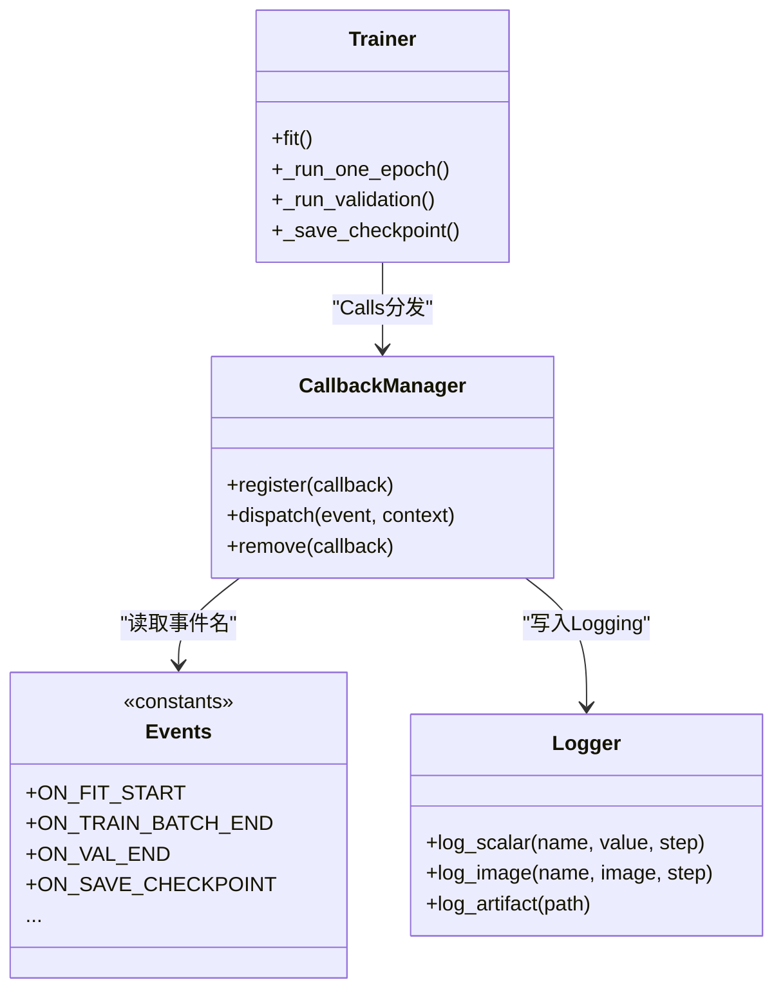
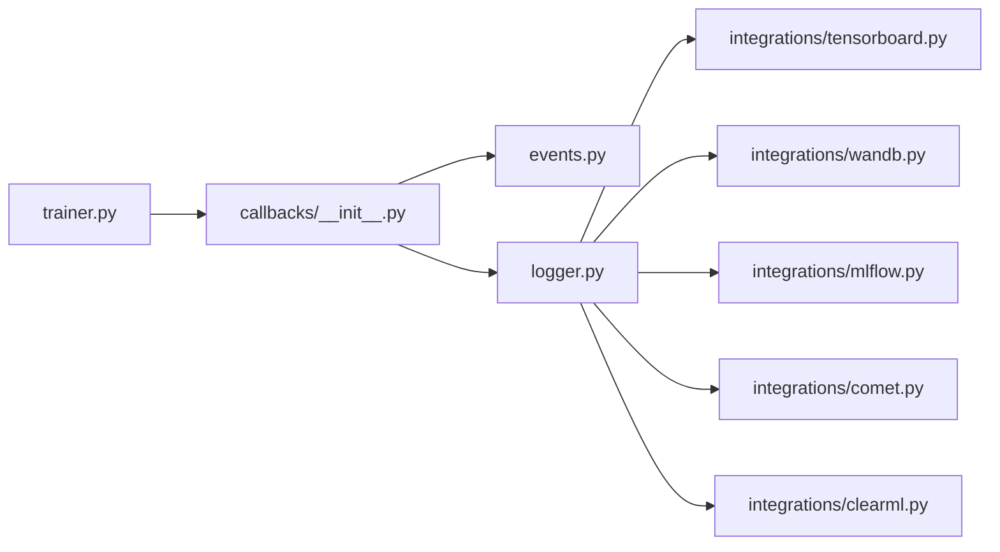

# Training Callback API

<cite>
**Files Referenced in This Document**
- [trainer.py](file://ultralytics/engine/trainer.py)
- [callbacks/__init__.py](file://ultralytics/utils/callbacks/__init__.py)
- [callbacks/on_fit_start.py](file://ultralytics/utils/callbacks/on_fit_start.py)
- [callbacks/on_fit_end.py](file://ultralytics/utils/callbacks/on_fit_end.py)
- [callbacks/on_train_epoch_start.py](file://ultralytics/utils/callbacks/on_train_epoch_start.py)
- [callbacks/on_train_batch_start.py](file://ultralytics/utils/callbacks/on_train_batch_start.py)
- [callbacks/on_train_batch_end.py](file://ultralytics/utils/callbacks/on_train_batch_end.py)
- [callbacks/on_val_start.py](file://ultralytics/utils/callbacks/on_val_start.py)
- [callbacks/on_val_end.py](file://ultralytics/utils/callbacks/on_val_end.py)
- [callbacks/on_save_checkpoint.py](file://ultralytics/utils/callbacks/on_save_checkpoint.py)
- [callbacks/on_model_save.py](file://ultralytics/utils/callbacks/on_model_save.py)
- [callbacks/on_pretrain_routine_start.py](file://ultralytics/utils/callbacks/on_pretrain_routine_start.py)
- [callbacks/on_pretrain_routine_end.py](file://ultralytics/utils/callbacks/on_pretrain_routine_end.py)
- [callbacks/on_optimizer_step.py](file://ultralytics/utils/callbacks/on_optimizer_step.py)
- [callbacks/on_lr_scheduler_step.py](file://ultralytics/utils/callbacks/on_lr_scheduler_step.py)
- [callbacks/on_train_epoch_end.py](file://ultralytics/utils/callbacks/on_train_epoch_end.py)
- [events.py](file://ultralytics/utils/events.py)
- [logger.py](file://ultralytics/utils/logger.py)
- [integrations/tensorboard.py](file://ultralytics/utils/integrations/tensorboard.py)
- [integrations/wandb.py](file://ultralytics/utils/integrations/wandb.py)
- [integrations/mlflow.py](file://ultralytics/utils/integrations/mlflow.py)
- [integrations/comet.py](file://ultralytics/utils/integrations/comet.py)
- [integrations/clearml.py](file://ultralytics/utils/integrations/clearml.py)
</cite>

## Table of Contents
1. [Introduction](#Introduction)
2. [Project Structure](#Project Structure)
3. [Core Components](#Core Components)
4. [Architecture Overview](#Architecture Overview)
5. [Detailed Component Analysis](#Detailed Component Analysis)
6. [Dependency Analysis](#Dependency Analysis)
7. [Performance Considerations](#Performance Considerations)
8. [Troubleshooting Guide](#Troubleshooting Guide)
9. [Conclusion](#Conclusion)
10. [Appendix](#Appendix)

## Introduction
本文件for YOLO-Master TrainingCallback System的完整 API Documentation，覆盖Training生命周期中的关键钩子点：模型初始化、Data Loading、前向传播、损失计算、Backpropagation、Optimizer更新、Validationand保存etc.阶段。Documentation同时记录Built-in集成（TensorBoard、Weights & Biases、ClearML、Comet.ml、MLFlow）的用法，并provides自定义回调开发Examples（Metrics收集、Checkpoint保存、早停机制），Centered onand异步处理and性能Optimization的最佳实践。

## Project Structure
YOLO-Master 的TrainingCallback System位于 utils/callbacks and engine/trainer 中，采用“事件drivers are installed”的设计：Training主循环while关键步骤触发事件，回调管理器分发to已注册的回调函数或类方法。

Figure Source
- [trainer.py](file://ultralytics/engine/trainer.py)
- [callbacks/__init__.py](file://ultralytics/utils/callbacks/__init__.py)
- [events.py](file://ultralytics/utils/events.py)
- [logger.py](file://ultralytics/utils/logger.py)
- [integrations/tensorboard.py](file://ultralytics/utils/integrations/tensorboard.py)
- [integrations/wandb.py](file://ultralytics/utils/integrations/wandb.py)
- [integrations/mlflow.py](file://ultralytics/utils/integrations/mlflow.py)
- [integrations/comet.py](file://ultralytics/utils/integrations/comet.py)
- [integrations/clearml.py](file://ultralytics/utils/integrations/clearml.py)

Section Source
- [trainer.py](file://ultralytics/engine/trainer.py)
- [callbacks/__init__.py](file://ultralytics/utils/callbacks/__init__.py)
- [events.py](file://ultralytics/utils/events.py)
- [logger.py](file://ultralytics/utils/logger.py)

## Core Components
- Training主循环（trainer.py）
  - 负责whileTraining各阶段Calls回调分发器，provides上下文信息（such as epoch、batch、loss、metrics、optimizer、scheduler、checkpoint 路径etc.）。
- 回调注册中心（callbacks/__init__.py）
  - provides回调注册、去重、按阶段分发、异常隔离etc.capabilities；Supporting函数式and类方法两种形式。
- 事件定义（events.py）
  - 集中定义Training生命周期事件常量and参数契约，确保回调间数据一致性。
- Logging抽象（logger.py）
  - 统一Logging接口，供Built-in回调写入 TensorBoard/W&B/ClearML/Comet/MLFlow etc.后端。

Section Source
- [trainer.py](file://ultralytics/engine/trainer.py)
- [callbacks/__init__.py](file://ultralytics/utils/callbacks/__init__.py)
- [events.py](file://ultralytics/utils/events.py)
- [logger.py](file://ultralytics/utils/logger.py)

## Architecture Overview
下图展示一次典型Training步的回调时序：从批次开始toEnd，包含前向、损失、Backpropagation、Optimizer更新、Learning Rate调度、Metrics记录andOptional的Validation/保存。

Figure Source
- [trainer.py](file://ultralytics/engine/trainer.py)
- [callbacks/__init__.py](file://ultralytics/utils/callbacks/__init__.py)
- [events.py](file://ultralytics/utils/events.py)
- [logger.py](file://ultralytics/utils/logger.py)
- [integrations/tensorboard.py](file://ultralytics/utils/integrations/tensorboard.py)
- [integrations/wandb.py](file://ultralytics/utils/integrations/wandb.py)
- [integrations/mlflow.py](file://ultralytics/utils/integrations/mlflow.py)
- [integrations/comet.py](file://ultralytics/utils/integrations/comet.py)
- [integrations/clearml.py](file://ultralytics/utils/integrations/clearml.py)

## Detailed Component Analysis

### 回调生命周期and接口规范
- 事件命名约定
  - on_<阶段>_<时机>(context)
  - 阶段包括：fit、pretrain、train、val、save、model_save、optimizer_step、lr_scheduler_step
  - 时机包括：start、end
- 通用上下文字段（由 events.py 定义）
  - 常见字段：epoch、step、batch、data、loss、metrics、optimizer、scheduler、best_model_path、run_dir、device、rank/world_size etc.
  - 具体字段Centered on events.py for准，不同事件可能携带不同上下文

Section Source
- [events.py](file://ultralytics/utils/events.py)

#### 预Trainingand整体拟合
- on_pretrain_routine_start / on_pretrain_routine_end
  - 用于准备环境、初始化外部Tracking器、打印配置摘要etc.
- on_fit_start / on_fit_end
  - 用于全局初始化and收尾（such as关闭Tracking会话、汇总报告）

Section Source
- [callbacks/on_pretrain_routine_start.py](file://ultralytics/utils/callbacks/on_pretrain_routine_start.py)
- [callbacks/on_pretrain_routine_end.py](file://ultralytics/utils/callbacks/on_pretrain_routine_end.py)
- [callbacks/on_fit_start.py](file://ultralytics/utils/callbacks/on_fit_start.py)
- [callbacks/on_fit_end.py](file://ultralytics/utils/callbacks/on_fit_end.py)

#### Training阶段
- on_train_epoch_start
  - 适合重置 epoch 级统计、预热缓存
- on_train_batch_start
  - 适合记录输入样本元信息、计时起点
- on_train_batch_end
  - 适合记录 loss、Gradient范数、PredictionVisualization、Metrics快照
- on_train_epoch_end
  - 适合聚合 epoch Metrics、写入Logging、触发Validation/保存策略

Section Source
- [callbacks/on_train_epoch_start.py](file://ultralytics/utils/callbacks/on_train_epoch_start.py)
- [callbacks/on_train_batch_start.py](file://ultralytics/utils/callbacks/on_train_batch_start.py)
- [callbacks/on_train_batch_end.py](file://ultralytics/utils/callbacks/on_train_batch_end.py)
- [callbacks/on_train_epoch_end.py](file://ultralytics/utils/callbacks/on_train_epoch_end.py)

#### Validation阶段
- on_val_start / on_val_end
  - 适合切换Evaluation模式、记录Validation集信息、汇总 mAP/Precision/Recall/F1 etc.

Section Source
- [callbacks/on_val_start.py](file://ultralytics/utils/callbacks/on_val_start.py)
- [callbacks/on_val_end.py](file://ultralytics/utils/callbacks/on_val_end.py)

#### OptimizerandLearning Rate
- on_optimizer_step
  - 适合记录权重/Gradient统计、NaN/Inf 检测、Gradient裁剪后状态
- on_lr_scheduler_step
  - 适合记录Learning Rate曲线、warmup/decay 状态

Section Source
- [callbacks/on_optimizer_step.py](file://ultralytics/utils/callbacks/on_optimizer_step.py)
- [callbacks/on_lr_scheduler_step.py](file://ultralytics/utils/callbacks/on_lr_scheduler_step.py)

#### Checkpointand模型保存
- on_save_checkpoint
  - 适合打包额外元数据（超参、随机种子、环境信息）
- on_model_save
  - 适合Export中间模型、生成可部署产物、上传远端存储

Section Source
- [callbacks/on_save_checkpoint.py](file://ultralytics/utils/callbacks/on_save_checkpoint.py)
- [callbacks/on_model_save.py](file://ultralytics/utils/callbacks/on_model_save.py)

### Built-in集成Uses指南
- TensorBoard
  - Via logger 写入标量、图像、直方图；建议while on_fit_start 初始化，on_fit_end 关闭
  - Refer to路径：[integrations/tensorboard.py](file://ultralytics/utils/integrations/tensorboard.py)
- Weights & Biases
  - Supporting log、watch、save_artifact；建议while on_fit_start 启动 run，on_fit_end finish
  - Refer to路径：[integrations/wandb.py](file://ultralytics/utils/integrations/wandb.py)
- MLFlow
  - Supporting log_params/log_metrics/log_artifacts；建议 on_fit_start 创建实验，on_fit_end End
  - Refer to路径：[integrations/mlflow.py](file://ultralytics/utils/integrations/mlflow.py)
- Comet.ml
  - Supporting log_metric/log_artifact；注意并发限制and网络重试
  - Refer to路径：[integrations/comet.py](file://ultralytics/utils/integrations/comet.py)
- ClearML
  - Supporting log_metric/log_figure；适合远程Tasks管理
  - Refer to路径：[integrations/clearml.py](file://ultralytics/utils/integrations/clearml.py)

Section Source
- [logger.py](file://ultralytics/utils/logger.py)
- [integrations/tensorboard.py](file://ultralytics/utils/integrations/tensorboard.py)
- [integrations/wandb.py](file://ultralytics/utils/integrations/wandb.py)
- [integrations/mlflow.py](file://ultralytics/utils/integrations/mlflow.py)
- [integrations/comet.py](file://ultralytics/utils/integrations/comet.py)
- [integrations/clearml.py](file://ultralytics/utils/integrations/clearml.py)

### 自定义回调开发Examples

#### Metrics收集回调
- 目标：while每步/每 epoch 收集并聚合Metrics，输出to统一Logging后端
- implementing要点：
  - while on_train_batch_end 追加Metrics
  - while on_train_epoch_end 聚合并写入 logger
  - 避免阻塞Training：对耗时操作Uses队列或异步提交
- Refer to位置：
  - [callbacks/on_train_batch_end.py](file://ultralytics/utils/callbacks/on_train_batch_end.py)
  - [callbacks/on_train_epoch_end.py](file://ultralytics/utils/callbacks/on_train_epoch_end.py)
  - [logger.py](file://ultralytics/utils/logger.py)

#### 模型Checkpoint保存回调
- 目标：按策略保存最佳/最近Checkpoint，附带元数据
- implementing要点：
  - while on_train_epoch_end 判断是否满足保存条件
  - while on_save_checkpoint 注入额外元数据（such as当前 LR、GPU 利用率）
  - while on_model_save 执行Export或上传
- Refer to位置：
  - [callbacks/on_train_epoch_end.py](file://ultralytics/utils/callbacks/on_train_epoch_end.py)
  - [callbacks/on_save_checkpoint.py](file://ultralytics/utils/callbacks/on_save_checkpoint.py)
  - [callbacks/on_model_save.py](file://ultralytics/utils/callbacks/on_model_save.py)

#### 早停机制回调
- 目标：当ValidationMetrics长时间不提升时提前终止Training
- implementing要点：
  - while on_val_end 记录最佳Metricsandetc.待计数
  - 超过阈值则设置停止信号（Via事件上下文或共享状态）
  - while on_fit_end 清理资源
- Refer to位置：
  - [callbacks/on_val_end.py](file://ultralytics/utils/callbacks/on_val_end.py)
  - [callbacks/on_fit_end.py](file://ultralytics/utils/callbacks/on_fit_end.py)

Figure Source
- [callbacks/on_val_end.py](file://ultralytics/utils/callbacks/on_val_end.py)
- [callbacks/on_fit_end.py](file://ultralytics/utils/callbacks/on_fit_end.py)

### 回调注册and分发流程
- 注册方式
  - 函数式：直接传入回调函数
  - 类方法：继承基类并重写对应方法
- 分发机制
  - trainer while关键节点Calls分发器
  - 分发器根据事件名查找已注册回调并依次执行
  - 异常隔离：单个回调异常不影响其他回调andTraining主流程

Figure Source
- [trainer.py](file://ultralytics/engine/trainer.py)
- [callbacks/__init__.py](file://ultralytics/utils/callbacks/__init__.py)
- [events.py](file://ultralytics/utils/events.py)
- [logger.py](file://ultralytics/utils/logger.py)

Section Source
- [callbacks/__init__.py](file://ultralytics/utils/callbacks/__init__.py)
- [trainer.py](file://ultralytics/engine/trainer.py)
- [events.py](file://ultralytics/utils/events.py)
- [logger.py](file://ultralytics/utils/logger.py)

## Dependency Analysis
- 低耦合高内聚
  - trainer 仅依赖回调分发器and事件常量，不感知具体回调implementing
  - 回调之间Via事件上下文通信，避免直接相互引用
- External Dependencies
  - Logging后端（TensorBoard/W&B/MLFlow/Comet/ClearML）Via logger 抽象接入，便于替换and扩展
- 潜while风险
  - 回调中同步 IO 会阻塞Training主循环，需采用异步或批量化策略
  - 多进程环境下需保证回调线程安全and设备亲和性

Figure Source
- [trainer.py](file://ultralytics/engine/trainer.py)
- [callbacks/__init__.py](file://ultralytics/utils/callbacks/__init__.py)
- [events.py](file://ultralytics/utils/events.py)
- [logger.py](file://ultralytics/utils/logger.py)
- [integrations/tensorboard.py](file://ultralytics/utils/integrations/tensorboard.py)
- [integrations/wandb.py](file://ultralytics/utils/integrations/wandb.py)
- [integrations/mlflow.py](file://ultralytics/utils/integrations/mlflow.py)
- [integrations/comet.py](file://ultralytics/utils/integrations/comet.py)
- [integrations/clearml.py](file://ultralytics/utils/integrations/clearml.py)

## Performance Considerations
- 异步and批量化
  - 将网络上传、磁盘 IO 放入后台线程/进程池，避免阻塞 GPU 计算
  - Metrics聚合采用滑动窗口或指数移动平均，减少频繁写入
- Logging频率控制
  - 按步/按 epoch 动态调整记录频率，避免高频小粒度写入造成bottlenecks
- 内存and显存
  - 避免while回调中持有大对象引用；and时释放中间结果
  - 图像/张量转 CPU 后再落盘，减少显存压力
- Distributed Training
  - 仅while rank=0 进行网络 IO and文件写入
  - Uses事件上下文中的 world_size/rank 做条件分支

[本节for通用指导，无需特定文件来源]

## Troubleshooting Guide
- 常见问题
  - 回调抛出异常导致Training中断：确认回调异常隔离逻辑，定位具体回调
  - Logging缺失或不一致：核对事件上下文字段and logger Calls顺序
  - 多进程下重复写入：检查 rank 条件and锁机制
- 诊断建议
  - while on_fit_start 打印已注册回调列表
  - while on_train_batch_end 记录最小化上下文（step、loss、metrics 摘要）
  - 针对网络后端（W&B/MLFlow/Comet/ClearML）启用重试and超时保护

Section Source
- [callbacks/__init__.py](file://ultralytics/utils/callbacks/__init__.py)
- [logger.py](file://ultralytics/utils/logger.py)
- [integrations/wandb.py](file://ultralytics/utils/integrations/wandb.py)
- [integrations/mlflow.py](file://ultralytics/utils/integrations/mlflow.py)
- [integrations/comet.py](file://ultralytics/utils/integrations/comet.py)
- [integrations/clearml.py](file://ultralytics/utils/integrations/clearml.py)

## Conclusion
YOLO-Master 的TrainingCallback SystemCentered on事件for核心，provides了清晰的生命周期钩子and统一的Logging抽象，便于快速集成多种实验Tracking工具and自定义逻辑。遵循异步and批量化原则，可while不牺牲Training吞吐的前提下implementing丰富的监控and自动化capabilities。

[本节for总结性内容，无需特定文件来源]

## Appendix
- 常用事件清单（Centered on events.py for准）
  - on_fit_start/on_fit_end
  - on_pretrain_routine_start/on_pretrain_routine_end
  - on_train_epoch_start/on_train_epoch_end
  - on_train_batch_start/on_train_batch_end
  - on_val_start/on_val_end
  - on_optimizer_step
  - on_lr_scheduler_step
  - on_save_checkpoint/on_model_save
- 集成后端
  - TensorBoard、Weights & Biases、MLFlow、Comet.ml、ClearML

Section Source
- [events.py](file://ultralytics/utils/events.py)
- [integrations/tensorboard.py](file://ultralytics/utils/integrations/tensorboard.py)
- [integrations/wandb.py](file://ultralytics/utils/integrations/wandb.py)
- [integrations/mlflow.py](file://ultralytics/utils/integrations/mlflow.py)
- [integrations/comet.py](file://ultralytics/utils/integrations/comet.py)
- [integrations/clearml.py](file://ultralytics/utils/integrations/clearml.py)