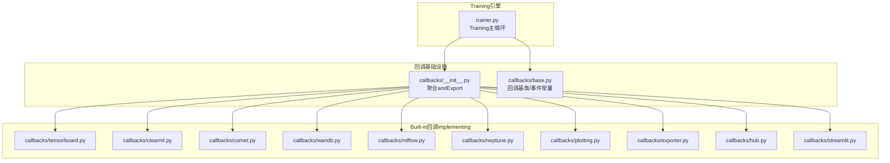
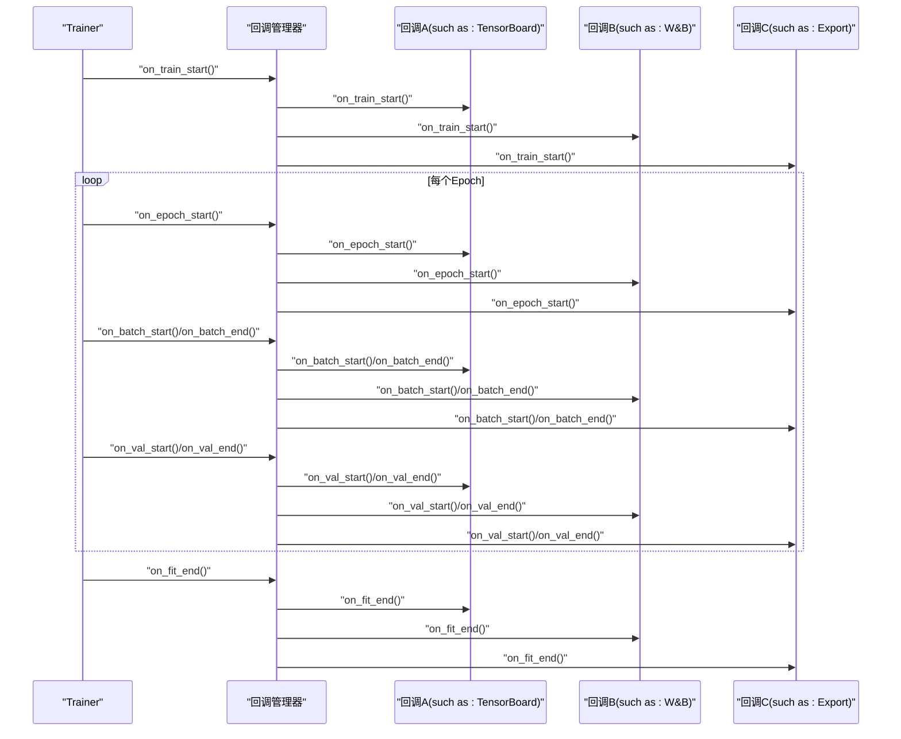
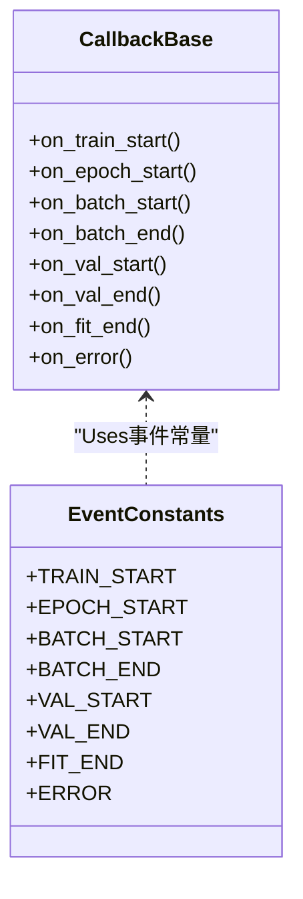
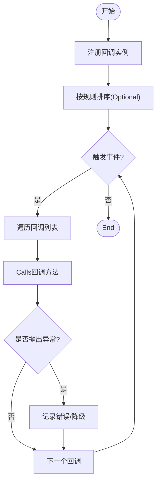
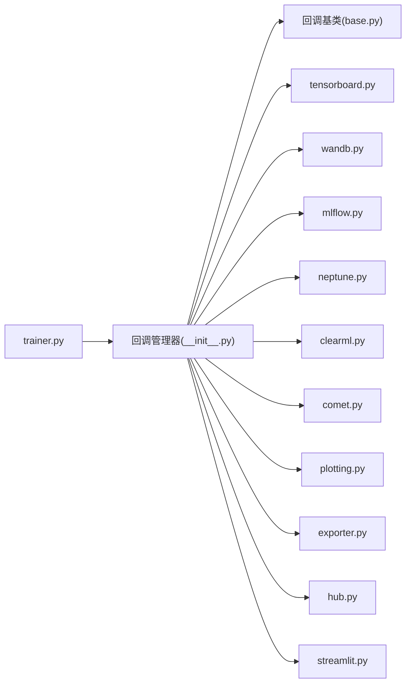

# Training回调概述

<cite>
**Files Referenced in This Document**
- [ultralytics/utils/callbacks/__init__.py](file://ultralytics/utils/callbacks/__init__.py)
- [ultralytics/utils/callbacks/base.py](file://ultralytics/utils/callbacks/base.py)
- [ultralytics/utils/callbacks/tensorboard.py](file://ultralytics/utils/callbacks/tensorboard.py)
- [ultralytics/utils/callbacks/clearml.py](file://ultralytics/utils/callbacks/clearml.py)
- [ultralytics/utils/callbacks/comet.py](file://ultralytics/utils/callbacks/comet.py)
- [ultralytics/utils/callbacks/wandb.py](file://ultralytics/utils/callbacks/wandb.py)
- [ultralytics/utils/callbacks/mlflow.py](file://ultralytics/utils/callbacks/mlflow.py)
- [ultralytics/utils/callbacks/neptune.py](file://ultralytics/utils/callbacks/neptune.py)
- [ultralytics/utils/callbacks/plotting.py](file://ultralytics/utils/callbacks/plotting.py)
- [ultralytics/utils/callbacks/exporter.py](file://ultralytics/utils/callbacks/exporter.py)
- [ultralytics/utils/callbacks/hub.py](file://ultralytics/utils/callbacks/hub.py)
- [ultralytics/utils/callbacks/streamlit.py](file://ultralytics/utils/callbacks/streamlit.py)
- [ultralytics/engine/trainer.py](file://ultralytics/engine/trainer.py)
</cite>

## Table of Contents
1. [Introduction](#Introduction)
2. [Project Structure](#Project Structure)
3. [Core Components](#Core Components)
4. [Architecture Overview](#Architecture Overview)
5. [Detailed Component Analysis](#Detailed Component Analysis)
6. [Dependency Analysis](#Dependency Analysis)
7. [Performance Considerations](#Performance Considerations)
8. [Troubleshooting Guide](#Troubleshooting Guide)
9. [Conclusion](#Conclusion)
10. [Appendix](#Appendix)

## Introduction
本概述DocumentationtargetingYOLO-Master的TrainingCallback System，聚焦Centered on下目标：
- 解释Training回调的基本概念、设计原理and生命周期管理
- 说明Callback System的架构模式：注册机制、执行顺序控制and错误处理策略
- provides自定义回调开发的基础框架andUses指南（such as何继承基类implementing功能）
- 给出性能Optimization建议and最佳实践

该Documentation旨while帮助读者快速理解并扩展Training过程中的可插拔capabilities，such asLogging、Metrics上报、Visualization、Model Export、云端同步etc.。

## Project Structure
YOLO-Master将Training回调统一组织while工具层，便于被引擎侧的TrainerCallsand编排。关键位置such as下：
- 回调接口and基类定义：位于工具层的回调包中，provides统一的钩子方法and生命周期事件
- Built-in回调implementing：涵盖TensorBoard、ClearML、Comet、W&B、MLflow、Neptune、绘图、Export、Hub、Streamlitetc.
- Training引擎集成点：TrainerwhileTraining循环的关键阶段触发回调事件

Figure Source
- [ultralytics/engine/trainer.py](file://ultralytics/engine/trainer.py)
- [ultralytics/utils/callbacks/__init__.py](file://ultralytics/utils/callbacks/__init__.py)
- [ultralytics/utils/callbacks/base.py](file://ultralytics/utils/callbacks/base.py)
- [ultralytics/utils/callbacks/tensorboard.py](file://ultralytics/utils/callbacks/tensorboard.py)
- [ultralytics/utils/callbacks/clearml.py](file://ultralytics/utils/callbacks/clearml.py)
- [ultralytics/utils/callbacks/comet.py](file://ultralytics/utils/callbacks/comet.py)
- [ultralytics/utils/callbacks/wandb.py](file://ultralytics/utils/callbacks/wandb.py)
- [ultralytics/utils/callbacks/mlflow.py](file://ultralytics/utils/callbacks/mlflow.py)
- [ultralytics/utils/callbacks/neptune.py](file://ultralytics/utils/callbacks/neptune.py)
- [ultralytics/utils/callbacks/plotting.py](file://ultralytics/utils/callbacks/plotting.py)
- [ultralytics/utils/callbacks/exporter.py](file://ultralytics/utils/callbacks/exporter.py)
- [ultralytics/utils/callbacks/hub.py](file://ultralytics/utils/callbacks/hub.py)
- [ultralytics/utils/callbacks/streamlit.py](file://ultralytics/utils/callbacks/streamlit.py)

Section Source
- [ultralytics/utils/callbacks/__init__.py](file://ultralytics/utils/callbacks/__init__.py)
- [ultralytics/utils/callbacks/base.py](file://ultralytics/utils/callbacks/base.py)
- [ultralytics/engine/trainer.py](file://ultralytics/engine/trainer.py)

## Core Components
- 回调基类and事件常量
  - provides统一的回调方法签名and生命周期事件常量，确保所有回调遵循一致的契约
  - 典型事件包括：Training开始/End、每个epoch开始/End、每步开始/End、Validation开始/End、保存Checkpoint、Export、错误etc.
- 回调注册器/管理器
  - 负责收集、排序、执行回调实例
  - Supporting按优先级或固定顺序执行，保证关键回调（such as保存、Export）的执行时机
- Built-in回调implementing
  - LoggingandMetrics：TensorBoard、ClearML、Comet、W&B、MLflow、Neptune
  - VisualizationandExport：绘图、Exporter、Streamlit UI
  - 平台集成：Hub上传and状态同步

Section Source
- [ultralytics/utils/callbacks/base.py](file://ultralytics/utils/callbacks/base.py)
- [ultralytics/utils/callbacks/__init__.py](file://ultralytics/utils/callbacks/__init__.py)

## Architecture Overview
Training回调采用“事件drivers are installed + 插件化”的架构模式：
- 事件drivers are installed：TrainerwhileTraining流程的关键节点发出事件
- 插件化：各回调作for独立Modules订阅事件，按需implementing逻辑
- 集中编排：回调管理器维护回调列表and执行顺序，并对异常进行隔离and上报

Figure Source
- [ultralytics/engine/trainer.py](file://ultralytics/engine/trainer.py)
- [ultralytics/utils/callbacks/__init__.py](file://ultralytics/utils/callbacks/__init__.py)
- [ultralytics/utils/callbacks/base.py](file://ultralytics/utils/callbacks/base.py)

## Detailed Component Analysis

### 回调基类and事件常量
- 职责
  - 定义回调方法的统一签名（例such as：接收当前Training上下文、配置、进度信息etc.）
  - provides事件常量，用于标识不同生命周期阶段
- 设计要点
  - 无副作用默认implementing，便于子类选择性覆盖
  - Via类型TipsandDocumentation字符串明确输入输出约定
- 复杂度
  - 时间复杂度：O(1)（仅定义and分发）
  - 空间复杂度：O(1)

Figure Source
- [ultralytics/utils/callbacks/base.py](file://ultralytics/utils/callbacks/base.py)

Section Source
- [ultralytics/utils/callbacks/base.py](file://ultralytics/utils/callbacks/base.py)

### 回调管理器and注册机制
- 职责
  - 维护回调实例集合
  - provides注册/注销接口
  - 按顺序遍历并Calls对应事件方法
- 执行顺序控制
  - Supporting按插入顺序或优先级排序
  - 对关键回调（such as保存、Export）设置固定位置，避免被User回调阻塞
- 错误处理策略
  - 单个回调异常不影响其他回调执行
  - 捕获异常并记录to统一Logging，必要时中断Training或降级运行

Figure Source
- [ultralytics/utils/callbacks/__init__.py](file://ultralytics/utils/callbacks/__init__.py)
- [ultralytics/utils/callbacks/base.py](file://ultralytics/utils/callbacks/base.py)

Section Source
- [ultralytics/utils/callbacks/__init__.py](file://ultralytics/utils/callbacks/__init__.py)
- [ultralytics/utils/callbacks/base.py](file://ultralytics/utils/callbacks/base.py)

### Built-in回调implementing概览
- LoggingandMetrics
  - TensorBoard：写入标量、图像、直方图etc.
  - ClearML/Comet/W&B/MLflow/Neptune：对接各自平台，上传实验元数据andMetrics
- VisualizationandExport
  - Plotting：绘制Training曲线、混淆矩阵、PR曲线etc.
  - Exporter：while合适时机触发Model Export
- 平台集成
  - Hub：上传权重、同步Training状态
  - Streamlit：provides交互式UI展示Training进度

Section Source
- [ultralytics/utils/callbacks/tensorboard.py](file://ultralytics/utils/callbacks/tensorboard.py)
- [ultralytics/utils/callbacks/clearml.py](file://ultralytics/utils/callbacks/clearml.py)
- [ultralytics/utils/callbacks/comet.py](file://ultralytics/utils/callbacks/comet.py)
- [ultralytics/utils/callbacks/wandb.py](file://ultralytics/utils/callbacks/wandb.py)
- [ultralytics/utils/callbacks/mlflow.py](file://ultralytics/utils/callbacks/mlflow.py)
- [ultralytics/utils/callbacks/neptune.py](file://ultralytics/utils/callbacks/neptune.py)
- [ultralytics/utils/callbacks/plotting.py](file://ultralytics/utils/callbacks/plotting.py)
- [ultralytics/utils/callbacks/exporter.py](file://ultralytics/utils/callbacks/exporter.py)
- [ultralytics/utils/callbacks/hub.py](file://ultralytics/utils/callbacks/hub.py)
- [ultralytics/utils/callbacks/streamlit.py](file://ultralytics/utils/callbacks/streamlit.py)

### 自定义回调开发指南
- 步骤
  - 继承回调基类，按需覆写所需事件方法
  - while回调初始化时准备资源（such as连接远端服务、打开文件句柄）
  - while相应事件中执行业务逻辑（such as记录Metrics、生成Visualization）
  - whileTrainingEnd时清理资源（关闭连接、释放内存）
- 注册方式
  - Via回调管理器provides的注册接口添加自定义回调
  - such as需控制执行顺序，可while注册时指定优先级或插入位置
- 错误处理
  - while回调内部捕获并处理异常，避免影响其他回调
  - 对于不可恢复的错误，Optional择向上抛出Centered on便管理器统一处理

Section Source
- [ultralytics/utils/callbacks/base.py](file://ultralytics/utils/callbacks/base.py)
- [ultralytics/utils/callbacks/__init__.py](file://ultralytics/utils/callbacks/__init__.py)

## Dependency Analysis
- Trainerand回调管理器耦合度低，Via事件接口解耦
- 回调之间相互独立，不直接依赖彼此，降低环依赖风险
- 外部库依赖（such asTensorBoard、W&B、MLflowetc.）仅while对应回调中引入，减少主流程负担

Figure Source
- [ultralytics/engine/trainer.py](file://ultralytics/engine/trainer.py)
- [ultralytics/utils/callbacks/__init__.py](file://ultralytics/utils/callbacks/__init__.py)
- [ultralytics/utils/callbacks/base.py](file://ultralytics/utils/callbacks/base.py)
- [ultralytics/utils/callbacks/tensorboard.py](file://ultralytics/utils/callbacks/tensorboard.py)
- [ultralytics/utils/callbacks/wandb.py](file://ultralytics/utils/callbacks/wandb.py)
- [ultralytics/utils/callbacks/mlflow.py](file://ultralytics/utils/callbacks/mlflow.py)
- [ultralytics/utils/callbacks/neptune.py](file://ultralytics/utils/callbacks/neptune.py)
- [ultralytics/utils/callbacks/clearml.py](file://ultralytics/utils/callbacks/clearml.py)
- [ultralytics/utils/callbacks/comet.py](file://ultralytics/utils/callbacks/comet.py)
- [ultralytics/utils/callbacks/plotting.py](file://ultralytics/utils/callbacks/plotting.py)
- [ultralytics/utils/callbacks/exporter.py](file://ultralytics/utils/callbacks/exporter.py)
- [ultralytics/utils/callbacks/hub.py](file://ultralytics/utils/callbacks/hub.py)
- [ultralytics/utils/callbacks/streamlit.py](file://ultralytics/utils/callbacks/streamlit.py)

Section Source
- [ultralytics/engine/trainer.py](file://ultralytics/engine/trainer.py)
- [ultralytics/utils/callbacks/__init__.py](file://ultralytics/utils/callbacks/__init__.py)

## Performance Considerations
- 异步and批处理
  - 对I/O密集型回调（such as远端上传）Recommended to use异步或批量提交，减少网络往返
- 采样and节流
  - 高频事件（such as每步）应进行采样或节流，避免频繁写入导致Trainingbottlenecks
- 资源复用
  - 复用连接and对象（such asWriter、Logger），避免while每个事件中重复创建
- 计算卸载
  - 将重计算Tasks移至后台线程或进程，避免阻塞Training主循环
- 条件启用
  - 根据配置动态启用回调，减少不必要的开销

[本节for通用指导，无需特定文件引用]

## Troubleshooting Guide
- 常见问题
  - 回调未触发：检查事件常量and方法名是否and基类一致；确认已正确注册
  - 执行顺序问题：查看管理器排序逻辑，必要时调整优先级或插入位置
  - 异常中断：定位具体回调的异常堆栈，确认是否吞掉异常或未做隔离
  - 资源泄漏：确保whileon_fit_end或析构中释放资源
- 诊断建议
  - 开启详细Logging，记录每个事件的进入and退出
  - for回调增加计时and计数统计，识别热点路径
  - 逐步禁用部分回调Centered on定位问题源

Section Source
- [ultralytics/utils/callbacks/base.py](file://ultralytics/utils/callbacks/base.py)
- [ultralytics/utils/callbacks/__init__.py](file://ultralytics/utils/callbacks/__init__.py)

## Conclusion
YOLO-Master的TrainingCallback SystemVia事件drivers are installedand插件化设计，implementing了高内聚、低耦合的可扩展架构。统一的基类and事件常量简化了自定义回调的开发，而回调管理器provides了可靠的执行顺序and错误隔离机制。Combining性能Optimizationand最佳实践，开发者可Centered on高效地扩展Training流程，满足多样化的监控、Visualizationand集成需求。

[本节for总结性内容，无需特定文件引用]

## Appendix
- 术语
  - 回调：whileTraining生命周期特定时刻触发的可插拔函数或对象
  - 事件：表示Training流程中的某个阶段或动作
  - 回调管理器：负责注册、排序and执行回调的组件
- Refer to路径
  - 基类and事件常量：[ultralytics/utils/callbacks/base.py](file://ultralytics/utils/callbacks/base.py)
  - 回调聚合andExport：[ultralytics/utils/callbacks/__init__.py](file://ultralytics/utils/callbacks/__init__.py)
  - Training引擎集成点：[ultralytics/engine/trainer.py](file://ultralytics/engine/trainer.py)